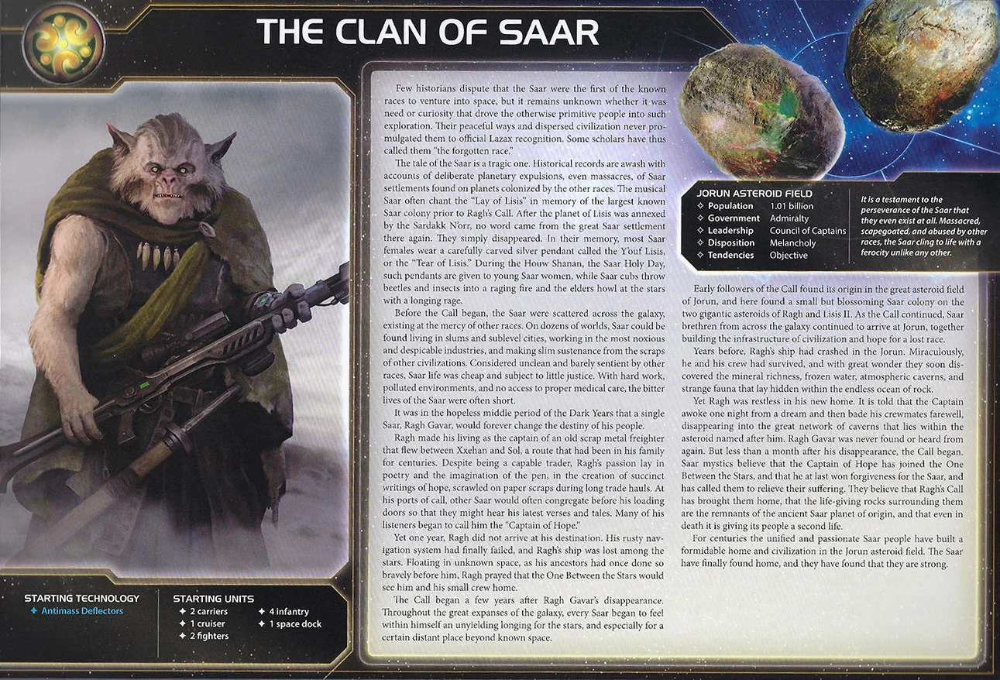

<nav class="page-nav">
<a href="../index.html" class="back-link">Back to Index</a>
<a href="Clan_of_Saar.md" download class="download-link" title="Plain text file - safe to download">Download .md</a>
</nav>

# The Clan of Saar Comprehensive Strategy Guide

## I. Introduction

The Clan of Saar are Twilight Imperium's mobile production masters—the only faction whose space docks float in space, move like ships, and produce without controlling planets. Your Floating Factories break fundamental TI4 rules: relocate infrastructure instantly, invade from unexpected angles, and score objectives even if you abandon your home system entirely.

No faction matches Saar's ability to produce anywhere on the map. Aggressive expansion, positional flexibility, and knowing when to float forward versus consolidate—that's the Saar way.

## II. Playstyle

You are scavengers, ready to exploit every planet you land on and grab more than your fair share. Produce your Floating Factories early and wander around space extracting value at every corner.

Your strength is **invasion mobility, production flexibility, and asteroid control**. Floating Factories move like ships—invade from unexpected angles, reposition production anywhere, retreat when threatened. Nomadic means you have less of a home and live on the road while opponents hungrily eye the planets you left behind. Unlock commander to place infantry/fighters at any dock and leverage Scavenge to turn every conquest into trade goods. Extract maximum value from every planet you touch, then move on to the next target.

Asteroids become safe havens with Chaos Mapping—opponents cannot activate asteroid fields containing your ships. Position factories in asteroids to block opponent movement and bombard from range. Your factories are your home, asteroids are your fortresses.

Victory comes from wandering the galaxy, scoring objectives through mobile production, conquering planets for Scavenge income, and controlling key positions.

## III. Faction Info and Drafting

### A. Home System & Commodities

**Home System:**

- **Lisis II:** 1 resource / 0 influence = 1 optimal resource / 0 optimal influence
- **Ragh:** 2 resources / 1 influence = 2 optimal resources / 0 optimal influence
- **Total: 3 resources / 1 influence (3 optimal resources / 0 optimal influence)**

**Commodities:** 3

**Notes:** Probably the worst home system in the game. Luckily, you're not tied to your home system—you and your docks are free to roam around. The 3 commodities are solid enough.

### B. Starting Fleet

- 2 Carriers
- 1 Cruiser
- 2 Fighters
- 4 Infantry
- 1 Space Dock (Floating Factory I)

**Notes:** Incredible flexibility with production on the move. Your Floating Factory I (move 1, capacity 4, production 5) is placed in space, retreats from combat, and is destroyed if blockaded. Only weakness is 4 infantry—you can't take full advantage of your 3 capacity units.

### C. Faction Abilities

**Scavenge:** After you gain control of a planet, gain 1 trade good.

Solves every early game problem and objective. Take as many planets as possible R1-R2, get trade goods for every conquest, fund your expansion engine. Then you can move your factories wherever they have the most value.

**Nomadic:** You can score objectives even if you do not control the planets in your home system.

Game-winning ability. When opponents see you're about to win, they have to aim for cutting off objectives rather than just taking your home system. Other factions lose when their home falls—you're already gone.

**Floating Factory I:** Saar Space Dock - Move 1, Capacity 4, PRODUCTION 5. This unit is placed in a space area instead of on a planet. This unit can move and retreat as if it were a ship. If this unit is blockaded, it is destroyed.

Your defining unit. Space dock that moves like a ship, produces in space, and can retreat from combat. If blockaded, it's destroyed. Treat it like a mobile production platform.

### D. Starting and Faction Technologies

**Starting Technologies:**

- **Antimass Deflectors (0)** - Your ships can move into and through asteroid fields. When other players' units use SPACE CANNON against your units, apply -1 to the result of each die roll.

**Notes:** Crucial tech that combos with Chaos Mapping. Asteroid belts become your home—where you are, people nearby feel it. Position your factories in asteroids and opponents can't activate those systems. Good to get started in blue tech path.

**Faction Technologies:**

**Floating Factory II (YY):** Saar Space Dock - Move 2, Capacity 5, PRODUCTION 7. This unit is placed in a space area instead of on a planet. This unit can move and retreat as if it were a ship. If this unit is blockaded, it is destroyed.

One of your preferred techs. Upgrades your factories to move 2, capacity 5, production 7. Doesn't hurt your incredible production to have even more—definitely worth getting if you happen to be running by an entropic scar.

**Chaos Mapping (B):** Other players cannot activate asteroid fields that contain 1 or more of your ships. At the start of your turn during the action phase, you may produce 1 unit in a system that contains at least 1 of your units that has PRODUCTION.

Your defining tech—you get it every game. Serves as security and flexibility. Being able to produce every single turn BEFORE you move (a destroyer or a fighter) is incredible and keeps people guessing on your true strength. Opponents can't activate asteroids with your ships.

### E. Leaders

**Agent - Captain Mendosa:** After a player activates a system, you may exhaust this card to increase the move value of 1 of that player's ships to match the move value of the ship on the game board that has the highest move value.

Great early to reach key targets. Key to keeping quick-moving armies together with potentially slower units like a flagship or dock. Works on any player's ships (trading tool).

**Commander - Rowl Sarring:** *Unlock: Have 3 space docks on the game board.*

When you produce fighters or infantry, you may place each of those units at any of your space docks that are not blockaded.

Can be helpful. Activate your dock standing safely in an asteroid belt in your slice to send units to reinforce the frontlines. Specifically good for you since your dock moves. Unlock is natural with your urgency to get all docks anyway.

**Hero - Gurno Aggero:** *Unlock: Have 3 scored objectives.*

**Armageddon Relay:** ACTION: Choose 1 system that is adjacent to 1 of your space docks. Destroy all other players' infantry and fighters in that system. Then, purge this card.

Fighters and infantry win games, so why not remove them all? Makes people scared about posting up massive armies nearby you, which can be helpful when looking for invasion targets. Position your factories adjacent to key systems.

### F. Promissory Note

**Ragh's Call:** After you commit 1 or more units to land on a planet: Remove all of the Saar player's ground forces from that planet and place them on a planet controlled by the Saar player. Then, return this card to the Saar player.

Small value. Commonly used as a tool to avoid combat and save your troops instead. If you go in planning to use Ragh's Call, you don't lose anything—you keep your troops, everyone's happy.

### G. Alliance

Your Alliance gives your ally your commander—when they produce fighters or infantry, they may place them at any of their space docks that are not blockaded. Solid for factions with multiple space docks.

Use your Alliance as leverage to get good alliances. People want you to look in another direction—trade your Alliance to neighbors who fear your aggression in exchange for stronger commanders that complement your wandering playstyle.

### H. Mech - **Scavenger Zeta**

Cost: 2 | Combat: 6 | **Sustain Damage**

**DEPLOY:** After you gain control of a planet, you may spend 1 trade good to place 1 mech on that planet.

Really solid deploy ability. Easily gets you to 4 mechs early in the game on key planets or riding with your fleet to ensure invasions. Synergizes with Scavenge—conquer planet, gain 1 TG, spend it to deploy mech. Sometimes if things work well you can have a ridiculous looking board state with Saar after first round: 4 systems filled with new mechs. Very intimidating.

### I. Flagship - **Son of Ragh**

Cost: 8 | Combat: 5 (x2) | Move: 1 | Capacity: 3 | **Sustain Damage** | **ANTI-FIGHTER BARRAGE 6 (x4)**

Combat-wise among the strongest flagships in the game. Ridiculous average of 2 fighter hits right away from AFB 6 (x4), then hitting double 5's in combat. Get it every game with your main super fleet.

### J. Breakthrough - **Deorbit Barrage (B↔R)**

ACTION: Exhaust this card and spend any amount of resources to choose a planet up to 2 systems away from an asteroid field that contains your ships; roll a number of dice equal to the amount spent and assign 1 hit to a ground force on that planet for each roll of 4 or greater.

Mostly used as a stall. The ability is not impactful enough except for edge cases. You'll also annoy people that are probably already annoyed by you.

**B↔R Synergy:** Blue and red technologies count as each other for prerequisites. Getting it to unlock Destroyer 2 that you can easily produce every turn using Chaos Mapping is the most interesting part.

Try to place Thunder's Edge in an asteroid field—you can always use the extra resources.

### K. Slice Considerations

Saar wants resources for production and mobile positioning for factory flexibility.

**Speaker Order:**

- Speaker order is irrelevant. Prioritize great systems. You can handle any position and love cards others loathe.

**Neighbors:**

- An easier target for invasions is great.

**Slice Priorities:**

- **Asteroid belt** - Priority. Essential for Chaos Mapping and safe factory positioning.
- **High resources** - You're token efficient since you produce and move with the same token. You got massive production and need resources to spend it.
- **Favor tech skips (blue/yellow)** - Industrial or cybernetic for Floating Factory II path. Tech skip to get access to Fracture.

**Nice to Have:**

- Path to Mecatol but flexible enough to go to neighbor instead.

**Avoid:**

- Supernova and gravity rift on the way to Mecatol if possible.

## IV. Round 1 Problems and Faction Weakness

### A. First Turn Priorities

Your Round 1 (R1) priority order: **Scoring > Expansion + Production > Technology > Breakthrough**

Focus on:

1. **Scoring** - Win from ahead as Saar. You need to capitalize on your super start and hope people can never catch up as you go. Score early and often.

2. **Expansion + Production** - Priority to get a ton of ships/ground troops out to secure your bigger than average slice.

3. **Technology** - Pushing toward Floating Factory II and Chaos Mapping. Tech is nice but you're fine without it if you have to prioritize troops.

4. **Breakthrough** - Try to snipe Thunder's Edge if available, otherwise leave it. Definitely for R1.

**Expansion Notes:** Grab your entire slice and maybe more Round 1. Get mechs and tons of ships out early to become a massive presence right away and grab more than your fair share. Your mobile factories and Scavenge ability reward maximum aggression.

### B. Table Hate

People will come together to beat your spread out forces if you overextend in points or territory. Your mobile factories and Scavenge income make you look scarier than you are—opponents coordinate to knock you down before you run away with the game.

The table also feels since they can't stop you in the late game by taking your home system, they have to go early even if you're not in the greatest position. Nomadic makes you a priority target—manage your threat level carefully.

## V. Technology

### A. Overview

You start with **Antimass Deflectors** (0-cost Blue), allowing asteroid passage and -1 to space cannon rolls against you. Crucial to combo with your **Chaos Mapping** as asteroid belts are home—where you are and people nearby you are not.

You're not very tech dependent—you like more plastic over techs. **Chaos Mapping** is your defining tech and you get it every game. It serves as security and flexibility—being able to produce every single turn either a destroyer or a flagship BEFORE you move is incredible and keeps people guessing on your true strength.

### B. Technology Path

**R1:** Gravity Drive (B)
- After you activate a system, apply +1 to the move value of 1 of your ships during this tactical action.
- **Why:** Solid bonus mobility to keep space dock with your fleet and to reach key targets.

**R2-3:** Chaos Mapping (B - Faction Tech)
- Other players cannot activate asteroid fields that contain 1 or more of your ships. At the start of your turn during the action phase, you may produce 1 unit in a system that contains at least 1 of your units that has PRODUCTION.
- **Why:** Produce 1 unit every turn before movement. Security in asteroid belts. Keeps opponents guessing.

**R3-4:** Carrier II (BB)
- XRD Transporters. Cost: 3, Combat: 9, Move: 2, Capacity: 6.
- **Why:** Capacity 6 for mass troop transport, better combat value.

**R4:** Destroyer II (RR) if you have Deorbit Barrage breakthrough R4
- Automated Defense Turrets. Cost: 1, Combat: 8, Move: 2, ANTI-FIGHTER BARRAGE 6 (x3).
- **Why:** Cheap screening, AFB 6(x3) for fighter defense. Easy to produce with Chaos Mapping.

**R5:** Light/Wave Deflector (BBB)
- Your ships can move through systems that contain other players' ships.
- **Why:** Avoid combat while repositioning factories and fleets. Essential for late game mobility.

**Fleet Logistics (BB)** - During each of your turns of the action phase, you may perform 2 actions instead of 1. Can be useful situationally.

## VI. Strategy Cards

### A. Round 1

You are so incredibly flexible Round 1 that it's hard to say which cards are the best.

**Round 1 Priority Ranking:**

1. **Technology** - Saving resources for more plastic and a token.

2. **Trade** - Flexibility.

3. **Construction** - For your key docks. Consider producing infantry instead of double space docks.

4. **Warfare** - Go into middle of slice with all troops, produce with docks, then spread from there for a mega Round 1.

5. **Leadership** - More tokens, more moves.

6. **Politics** - Breakthrough unlock and setup for custodian.

7. **Diplomacy** - Probably never worth it since you usually have bad planets to diplo.

8. **Imperial** - Never R1.

**Strategy Token Priority:** Construction, Diplomacy, Technology.

### B. Round 2+

**Love:**

- **Trade** - Refresh 3 commodities. Scavenge provides additional TG income from conquests.
- **Imperial** - Needed for scoring R3-R5. Nomadic lets you score without home control.

**Good:**

- **Construction** - Build 2nd and 3rd Floating Factories for commander unlock. Forward factory positioning creates production nodes.
- **Technology** - Gravity Drive, Chaos Mapping, Carrier II progression.
- **Warfare** - Redistribution after mobile factory repositioning. Useful for multi-front expansion.
- **Politics** - Breakthrough unlock and custodian setup.
- **Leadership** - Command tokens for factory movement and Scavenge conquests.

**Situational:**

- **Diplomacy** - Usually not worth it with bad home planets.

## VII. Unit Composition and Game Plan

### A. Unit Composition

Your ideal fleet composition:

- **Floating Factories** - Your capital ships. Protect them like flagships. Build 3 for commander unlock, position them in strategic locations (asteroid belts, Mecatol adjacent, high-resource systems).
- **Carriers** - Transport factories and infantry. Essential for mobility. Carrier II (capacity 6) for mass troop transport.
- **Destroyers** - If you have Destroyer II, cheap screening with AFB 6(x3). Easy to produce with Chaos Mapping.
- **Fighters** - Screening and hit absorption.
- **Infantry** - Mass conquest for Scavenge income. Produce everywhere with commander.
- **Mechs** - Deploy via Scavenge trade goods on conquered planets for instant defense.
- **Flagship (Son of Ragh)** - Combat 5 (x2), AFB 6 (x4). Anti-fighter dominance for critical systems.

**Fleet Focus:** Mobile production with multiple factories. Keep your factories moving with your fleets. Commander lets you produce infantry at one factory and place them at any other—use this for multi-front invasions.

### B. Game Plan

**Early Game (Rounds 1-2):**

Grab your entire slice and maybe more. Your Floating Factories let you produce anywhere—priority is getting a ton of ships and ground troops out to secure your bigger-than-average slice. Build additional factories for commander unlock (need 3 total). Every planet conquered gives you 1 trade good from Scavenge—fund your expansion engine. Get Gravity Drive for mobility. Grab custodian or score an early Imperial point to get ahead.

**Mid Game (Rounds 3-4):**

Take Mecatol Rex and hold it. Your mobile production and Nomadic ability make you excellent at controlling MR—even if opponents threaten your home system, you can still score. Commander unlocks with 3 factories for multi-front reinforcement. If Fracture is unlocked, go into it—add planets and relics to your total. Build flagship for combat power.

**Late Game (Rounds 5+):**

Use hero for a key fight. Nomadic allows you to focus on objectives without worry. Go for Styx to make that final push. Win through territorial control, Mecatol points, and mobile production.

## VIII. Objectives

### A. Objective Summary

**Strengths:** Saar dominates movement and positioning objectives with mobile Floating Factories and flexible production placement. Scavenge ability makes trade good spending objectives achievable. Tech objectives are easy with strong tech paths. Structure count objectives are natural—Floating Factories count as structures.

**Weaknesses:** Influence spending is difficult with weak home system (1 influence). Tech specialty planet control requires aggressive expansion. Agenda objectives don't align with faction strengths.

### B. Stage I Objectives

| Stage I Objective                                                       | Status |
|-------------------------------------------------------------------------|--------|
| **Spendies**                                                            |        |
| Erect a Monument (Spend 8 resources)                                    | 🟢     |
| Sway the Council (Spend 8 influence)                                    | 🟡     |
| Negotiate Trade Routes (Spend 5 trade goods)                            | 🟢     |
| Lead from the Front (Spend 3 tokens from tactic/strategy pools)         | 🟡     |
| Amass Wealth (Spend 3 influence, 3 resources, 3 trade goods)            | 🟡     |
| **Control**                                                             |        |
| Expand Borders (Control 6 planets in non-home systems)                  | 🟢     |
| Corner the Market (Control 4 planets with same trait)                   | 🟡     |
| Found Research Outposts (Control 3 planets with tech specialties)       | 🟡     |
| Discover Lost Outposts (Control 2 planets with attachments)             | 🟡     |
| Push Boundaries (Control more planets than each neighbor)               | 🟢     |
| **Ships in Systems**                                                    |        |
| Intimidate the Council (Ships in 2 systems adjacent to MR)              | 🟢     |
| Explore Deep Space (Units in 3 systems without planets)                 | 🟢     |
| Make History (Units in 2 systems with legendary/MR/anomalies)           | 🟢     |
| Populate the Outer Rim (Units in 3 edge systems)                        | 🟢     |
| Raise a Fleet (5+ non-fighter ships in 1 system)                        | 🟢     |
| Engineer a Marvel (Have flagship or war sun on board)                   | 🟢     |
| **Tech**                                                                |        |
| Diversify Research (Own 2 tech in each of 2 colors)                     | 🟡     |
| Develop Weaponry (Own 2 unit upgrade technologies)                      | 🟢     |
| **Structure**                                                           |        |
| Build Defenses (Have 4 or more structures)                              | 🟢     |
| Improve Infrastructure (Structures on 3 planets outside HS)             | 🔴     |

**Legend:** 🟢 Likely | 🟡 Possible | 🔴 Difficult

### C. Secret Objectives

| Secret Objective                                                         | Status |
|--------------------------------------------------------------------------|--------|
| **Combat**                                                               |        |
| Unveil Flagship (Win space combat with flagship)                         | 🟢     |
| Destroy their Greatest Ship (Destroy war sun/flagship)                   | 🟡     |
| Spark a Rebellion (Win combat vs VP leader)                              | 🟢     |
| Betray a Friend (Win combat vs player whose PN you have)                | 🟢     |
| Brave the Void (Win combat in anomaly)                                  | 🟢     |
| Darken the Skies (Win combat in another player's HS)                    | 🟡     |
| Demonstrate your Power (3+ non-fighter ships after space combat)        | 🟢     |
| Turn their Fleets to Dust (SPACE CANNON destroy last ship)              | 🔴     |
| Make an Example (BOMBARDMENT destroy last ground forces)                | 🟡     |
| Fight With Precision (AFB destroy last fighter)                         | 🟢     |
| **Ships in Systems**                                                     |        |
| Threaten Enemies (Ships adjacent to another player's HS)                | 🟢     |
| Cut Supply Lines (Ships in system with enemy space dock)                | 🟢     |
| Defy Space and Time (Units in wormhole nexus)                           | 🟡     |
| Become the Gatekeeper (Ships in alpha and beta wormhole systems)        | 🟢     |
| Learn Secrets of the Cosmos (Ships in 3 systems adjacent to anomalies)  | 🟢     |
| Control the Region (Ships in 6 systems)                                 | 🟢     |
| Occupy the Seat of the Empire (Control MR with 3+ ships)                | 🟢     |
| **Control**                                                              |        |
| Monopolize Production (Control 4 industrial planets)                     | 🟡     |
| Mine Rare Minerals (Control 4 hazardous planets)                         | 🟡     |
| Forge an Alliance (Control 4 cultural planets)                           | 🟡     |
| Establish Hegemony (Control planets with 12+ influence)                 | 🟢     |
| Hoard Raw Materials (Control planets with 12+ resources)                | 🟢     |
| Seize an Icon (Control legendary planet)                                | 🟢     |
| Stake Your Claim (Control planet in contested system)                   | 🟢     |
| Become a Martyr (Lose control of planet in home system)                 | 🟢     |
| **Tech**                                                                 |        |
| Adapt New Strategies (Own 2 faction technologies)                       | 🔴     |
| Master the Laws of Physics (Own 4 tech of same color)                   | 🟢     |
| **Structure/Units**                                                      |        |
| Establish a Perimeter (Have 4 PDS on board)                             | 🔴     |
| Fuel the War Machine (Have 3 space docks)                               | 🟢     |
| Gather a Mighty Fleet (Have 5 dreadnoughts)                             | 🔴     |
| Mechanize the Military (1 mech on each of 4 planets)                    | 🟢     |
| Occupy the Fringe (9+ ground forces on planet without space dock)       | 🟢     |
| Produce en Masse (Units with PRODUCTION 8+ in single system)            | 🟢     |
| **Other**                                                                |        |
| Dictate Policy (3+ laws in play)                                        | 🔴     |
| Drive the Debate (You/your planet elected by agenda)                    | 🔴     |
| Destroy Heretical Works (Purge 2 relic fragments)                       | 🔴     |
| Form a Spy Network (Discard 5 action cards)                             | 🟡     |
| Foster Cohesion (Be neighbors with all players)                         | 🟢     |
| Strengthen Bonds (Have another player's PN)                             | 🟢     |
| Prove Endurance (Last to pass)                                          | 🔴     |

**Legend:** 🟢 Likely | 🟡 Possible | 🔴 Difficult

### D. Stage II Objectives

| Stage II Objective                                                       | Status |
|--------------------------------------------------------------------------|--------|
| **Spendies**                                                             |        |
| Centralize Galactic Trade (Spend 10 trade goods)                         | 🟡     |
| Found a Golden Age (Spend 16 resources)                                  | 🟡     |
| Galvanize the People (Spend 6 tokens from tactic/strategy pools)         | 🟡     |
| Manipulate Galactic Law (Spend 16 influence)                             | 🔴     |
| Hold Vast Reserves (Spend 6 influence, 6 resources, 6 trade goods)       | 🟡     |
| **Control**                                                              |        |
| Conquer the Weak (Control 1 planet in another player's HS)               | 🟡     |
| Rule Distant Lands (Control 2 planets in/adjacent to different players' HS) | 🟡     |
| Subdue the Galaxy (Control 11 planets in non-home systems)               | 🔴     |
| Unify the Colonies (Control 6 planets with same trait)                   | 🟡     |
| Reclaim Ancient Monuments (Control 3 planets with attachments)           | 🟡     |
| Form Galactic Brain Trust (Control 5 planets with tech specialties)      | 🔴     |
| **Ships in Systems**                                                     |        |
| Command an Armada (Have 8+ non-fighter ships in 1 system)                | 🟡     |
| Achieve Supremacy (Flagship/War Sun in another player's HS or MR)        | 🟢     |
| Become a Legend (Units in 4 systems with legendary/MR/anomalies)         | 🟢     |
| Patrol Vast Territories (Units in 5 systems without planets)             | 🟡     |
| Control the Borderlands (Units in 5 edge systems not HS)                 | 🟡     |
| **Tech**                                                                 |        |
| Master of Sciences (Own 2 techs in each of 4 colors)                     | 🔴     |
| Revolutionize Warfare (Own 3 unit upgrade technologies)                  | 🔴     |
| **Structure**                                                            |        |
| Construct Massive Cities (Have 7+ structures)                            | 🔴     |
| Protect the Border (Structures on 5 planets outside HS)                  | 🔴     |

**Legend:** 🟢 Likely | 🟡 Possible | 🔴 Difficult

---

## IX. Alliance Priority

Trading for other factions' Alliance promissory notes (which give you access to their Commanders) can significantly boost your strategy. Here are the top alliances to prioritize:

**Top Tier:**

1. **Nomad (Navarch Feng)** - Produce flagship without spending resources. Incredible combo with Chaos Mapping—produce one free flagship every turn.
2. **Crimson Rebellion (Ahk Siever)** - At end of combat, gain commodity/TG. Excellent for combat-heavy Saar.
3. **Muaat (Magmus)** - After you spend strategy token, gain 1 trade good. Good TG income for Saar's token-heavy playstyle.
4. **Winnu (Rickar Rickani)** - Apply +2 combat in MR, home system, legendary planet systems. Excellent for holding Mecatol Rex.
5. **Titans of Ul (Tungstantus)** - Gain 1 TG when using PRODUCTION. Fantastic synergy—you produce constantly with multiple factories.
6. **Vuil'raith Cabal (That Which Molds Flesh)** - Up to 2 fighters/infantry don't count against PRODUCTION limit. Extra production capacity—fantastic with multiple factories.

**Good:**

7. **Deepwrought (Aello)** - When others research tech, gain commodity/TG if they take -1 discount. Passive TG income.
8. **Naaz-Rokha (Dart and Tai)** - After you gain control of planet from another player, explore it. Extra value from conquest-heavy playstyle.
9. **Mentak Coalition (S'ula Mentarion)** - Force opponent to give PN after winning space combat. Useful for acquiring alliances you need.
10. **Ral Nel Consortium (Watchful OJZ)** - When you declare retreat, immediately retreat up to 2 ships to adjacent system. Enhanced retreat for protecting factories and flagship.

## X. Bonus Game Elements

This section highlights action cards that synergize particularly well with your faction's strengths or mitigate your weaknesses, relics that offer exceptional value for your faction's strategy and abilities, and agendas to pursue that benefit your position, and agendas to watch out for that could hurt you.

### A. High-Value Action Cards

### B. Relic Priorities

### C. Agenda Awareness

---

## XI. End Notes

Clan of Saar is the faction for players who understand that stationary infrastructure is a limitation. Your Floating Factories rewrite TI4's fundamental rules—produce in space, retreat from combat, reposition across the galaxy. Combined with Scavenge income and Nomadic scoring, you operate with freedoms other factions don't have.

Your strength is mobility and aggressive expansion. Grab your entire slice Round 1 and fund it through Scavenge. Build 3 factories early for commander unlock. Position factories in asteroid belts with Chaos Mapping for security and free production every turn. Take Mecatol Rex and hold it through mobile reinforcement. When opponents threaten your home, you've already abandoned it—Nomadic lets you score without looking back.

When you master Saar, the galaxy bends to your production. Factories move with your fleets. Commander distributes infantry and fighters across multiple docks. Your mobility lets you reach Styx, Fracture, and objectives that others struggle with. Opponents can't pin you down—you're already somewhere else, producing another fleet.

**The Clan roams the stars. Production knows no borders.**
