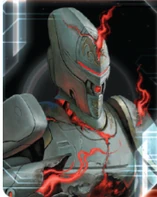

# Crimson Rebellion Guide

---

## I. Introduction

The Crimson Rebellion is TI4's breach network faction—a completely new experience of how Twilight Imperium works. While other factions measure distance and plan routes, you create instant connections across the galaxy. Your breach network turns the map into a web of adjacencies that only you control, making distance irrelevant and traditional movement obsolete.

This faction is about reshaping space itself. You can't use normal wormholes, but you create your own network through breach tokens. Systems become adjacent to each other through your will, allowing you to strike from anywhere. Your home system destroys anyone who tries to attack it, making you untouchable at home while projecting power across the entire map.

Your economy builds over time, allowing for strong late game plays. The Crimson Rebellion offers a fundamentally different TI4 experience. You're not playing the same game as everyone else—you're bending the rules of space and movement to create opportunities no other faction can match.

## II. Playstyle

Playing Crimson Rebellion is about strategic positioning through breach network creation. Your breach tokens create instant connections across the galaxy, turning distance into irrelevance. You're not measuring range—you're redefining what "adjacent" means.

Your playstyle revolves around movement and surprise. Place breaches liberally to create pathways, then exploit them when opponents least expect it. Strike key systems from impossible distances. Deploy mechs to contested planets without warning. Your safe home system lets you commit everything forward without defensive concerns.

Aggression fuels your economy. Combat generates wealth through passive income, creating a "post-planet economy" where you're rich without needing more territory. The more the table fights, the wealthier you become. This lets you afford decisive strikes when the moment arrives.

Unpredictability is your weapon. Opponents can't defend everywhere, and your breach network means you can appear anywhere. Keep them guessing, exploit openings, and reshape the map to your advantage.

## III. The Basics

### A. Home System & Commodities

**Home System:**
- **Ahk Creuxx:** 4 resources / 2 influence
- **Total: 4 resources / 2 influence (4 optimal resources / 0 optimal influence)**

**Special:** The Sorrow (tile 94) is placed where your home system would normally go. The Sorrow is NOT a home system but starts with an inactive breach. Your actual home system (tile 118 - Ahk Creuxx) goes in your play area and can be placed during setup using Sea of Tears.

**Commodities:** 2

Your home system provides strong resources (4), making you economically solid from the start. The Sorrow creates a unique dual-location setup that gives you incredible flexibility in board positioning.

### B. Starting Fleet
- 1 Carrier
- 2 Destroyers
- 3 Fighters
- 4 Infantry
- 1 Space Dock
- 1 PDS

**Notes:** Strong starting fleet with 2 destroyers (your special Exile units). Good for expansion and early aggression. Your agent + breakthrough let you explore 2 systems nearby from the starting fleet. The PDS is somewhat useless since your home system can't be attacked anyway.

### C. Faction Abilities

**Sundered:** You cannot use wormholes other than epsilon wormholes. Other players' units that move or are placed into your home system are destroyed.

Your home system is untouchable. Push everything forward without worrying about defense.

**Incursion:** When you activate a system that contains a breach, you may flip that breach. Systems that contain active breaches are adjacent to each other. At the end of the status phase, any player with ships in a system that contains an active breach may remove that breach.

This is your core identity. Active breaches make systems adjacent to EACH OTHER (not just to one system). If you have active breaches in systems A, B, and C, all three systems are adjacent to each other. This creates a web of movement options. Important: Active breaches can be used by ALL players, not just you. Mostly place inactive breaches—you can flip them when needed. Be frivolous with breach placement. Opponents can remove active breaches, but inactive breaches can only be moved (not removed by opponents). You start with 7 breaches total.

**Sea of Tears:** When you create the game board, place the Sorrow (tile 94) where your home system would be placed, and place an inactive breach in it. The Sorrow is not a home system. Then, place your home system (tile 118) in your play area.

Your home system feels close thanks to your breakthrough's extra movement from The Sorrow. Just extra safe.

**Exile I (Special Unit):** Crimson Rebellion Destroyer - Cost: 1 | Combat: 8 | Move: 2 | ANTI-FIGHTER BARRAGE 9 (x2)

At the end of any player's combat in this unit's system or an adjacent system, you may place 1 inactive breach in that system.

Your destroyers place breaches after any combat (yours or others) in their system or adjacent. This is your main breach placement method. Note: Works through wormholes—if your destroyer is adjacent via wormhole, you can place a breach. You start with 2 destroyers.

### D. Starting and Faction Technologies

**Starting Technologies:**

**Choose one blue or red technology with no prerequisites**

Recommended options:
- **Dark Energy Tap** - Best choice. Extra frontier token in Sorrow, retreat flexibility.
- **AI Development Algorithm** - Enables low-tech game with Carrier II rush. Opens War Sun path with B<>R synergy.
- **Antimass Deflectors** - Only if slice requires asteroid/supernova mobility.

Pick AI Dev or DET. Only take Antimass if your slice requires it.

**Faction Technologies:**

**Exile II (RR):**
*Crimson Rebellion Destroyer - Cost: 1 | Combat: 7 | Move: 2 | ANTI-FIGHTER BARRAGE 6 (x3)*

At the end of any player's combat in this unit's system or up to 2 systems away, you may place 1 active or inactive breach in that system.

Main value is the AFB 6 (x3) upgrade—deterrent for fighter screens. The 2-away breach placement is nice. Reminder: If your destroyer dies in combat, it doesn't place a breach.

**Subatomic Splicer (Y):**
*When one of your ships is destroyed, you may produce a ship of the same type at a space dock in your home system.*

Home system production is slow. Works well with Hero—rebuild ships and place on Fragment Reality card. Note: Fighters cost 1 each (not 1 for 2) when rebuilt this way.

### E. Leaders

**Agent - Ahk Ravin:** ACTION: Exhaust this card to choose 1 player. That player may swap the position of 2 of their ships in any systems; they may transport units when they swap.

Enables 2-move expansion: Send carrier out to take a system, swap carrier with destroyer, take another system. For expansion you have 2 carriers worth of capacity, but your defense will have 1 carrier (with fighters). Your slice can become weak if you rely too much on swapping instead of building proper defense. Also useful late game for surprise flagship positioning (build at home, swap to Mecatol Rex).

**Commander - Ahk Siever:**
- **Unlock:** Place a breach token in a system that contains another player's unit
- **Ability:** At the end of a combat between any players, gain 1 commodity or convert 1 of your commodities to a trade good

Your commander converts combat into economy. Every combat in the game generates value for you. Best strategy: Give your alliance to a neighbor to enable "washing"—you both gain commodities/TGs from table-wide combat. You only have 2 commodities, so you'll convert frequently.

**Hero - Homesick Phantom:**
- **Unlock:** Have 3 scored objectives
- **Fragment Reality:** When you produce ships, you may place any of those ships onto this card. At the start of a space combat, you may purge this card to place all ships from this card into the active system.

Enables devastating alpha strikes and is your closer for Mecatol Rex or Styx. Stack fighters on it (capacity isn't checked until after combat). Synergizes with Subatomic Splicer—rebuild destroyed ships and place on hero. Carrier II helps maintain capacity after deploying fighters. Half the time does nothing, half the time wins you the game.

### F. Promissory Note

**Sever:** ACTION: Place this card faceup in your play area and place the sever token in a system that contains your units; wormholes in that system have no effect during movement. Remove the sever token and return this card to the Rebellion player at the end of the status phase.

It's a stall. Sell for anything—literally any value. Can be used to block Ghosts in Mallice. Warning: Don't sell to someone who might place sever token on epsilon wormhole in your home system.

### G. Alliance

Whoever holds your alliance card has your Commander (Ahk Siever - gain commodity/TG at end of any combat).

One of the strongest alliances in the game—generates massive passive income from table-wide combat. Ideal swaps: Deepwrought (comparable value, fixes both factions' problems), Empyrean Blood/Dark Pact (50% trade good increase). If neighbor is Mentak, trade for Promise of Protection immediately. Your alliance partner gets better value than you—make sure they understand this when negotiating.

### H. Mech

**Revenant:** Cost 2, Combat 6, Sustain Damage
- **DEPLOY:** During the "Commit Ground Forces" step of your tactical action in a system that contains an active breach, you may commit 1 mech, even if you have no units in the system.

Your mechs can deploy from anywhere to any system with an active breach. Only works on YOUR tactical actions (not defensive). Keep 1-2 mechs in reinforcements for surprise deploy plays.

### I. Flagship

**Quietus:** Cost 8, Combat 5 (x2), Move 1, Capacity 3, Sustain Damage

While this unit is in a system that contains an active breach, other players units in systems with active breaches lose all their unit abilities.

This is a devastating debuff flagship. When parked in a breach system, it strips abilities from all enemy units in ALL breach systems. This shuts down Sustain Damage, PRODUCTION, special abilities, everything. It's one of the strongest flagships in the game when your breach network is established.

### J. Breakthrough

**Resonance Generator:** B<>R (Blue-Red synergy)

During your tactical actions, apply +1 to the move value of each of your ships that starts its movement in your home system or in a system that contains an active breach.

**ACTION:** Exhaust this card to flip any breach or place an active breach in a non-home system that contains your units.

This breakthrough is essential to your strategy. The +1 movement from home/breaches stacks with Gravity Drive for 3 movement, and the action ability lets you create/flip breaches without activating systems. This is incredibly powerful for network management.

### K. Slice Considerations

**Speaker Order:**
Anything high value works. Very flexible since your breakthrough is unlocked. Avoid early aggressive neighbor if possible.

**Must Have:**
- Access to Mecatol Rex or The Fracture (breach networks enable distant objectives)
- 1-2 high-resource planets (you need production capacity)
- Wormholes (place destroyers for sneaky breach placements via wormhole adjacency)

**Nice to Have:**
- Blue or red tech skips (for Fracture—you roll for Fracture right away with these colors)
- Entropic Scar (solid faction tech—Exile II or Subatomic Splicer)
- Space Station (bonus commodity value)

**Avoid:**
- Ultra-low influence slices (even if you get comms later, too low influence early is annoying)

## IV. Structural Weaknesses

### A. First Turn Priorities

**Round 1 Priority Rankings:**

1. **Scoring** - Getting a head start on scoring is solid. You scale but don't have too many swing mechanics.

2. **Expansion and Production** - Have to expand and produce to make up for your weak combat starting fleet.

3. **Technology** - If you can afford, always nice to have but you got natural expansion capabilities either way.

4. **Breakthrough** - You start with it.

**Expansion Notes:** Your agent and breakthrough let you explore 2 systems from starting position. You can grab entire slice if you get tech almost always. Getting ahead of other people's expansion is solid, setting you up for a great Round 2.

### B. Weak Early Economy

You're a 2 commodity faction with weak starting plastic (1 carrier, 2 destroyers). Your economy curve: poor early, slowly becomes rich through Commander. Avoid spending 6 influence on custodians Round 2—delays your economy coming online. Your alliance partner will likely get better value from Commander than you do.

## V. Technology

### A. Overview

You start by choosing one blue or red technology with no prerequisites. You can be quite tech poor without problems—most of your faction works anyway.

### B. Starting Technologies

**Choose one blue or red technology with no prerequisites**

Pick AI Development Algorithm or Dark Energy Tap. Only take Antimass Deflectors if your slice requires it.

Recommended options:
- **Dark Energy Tap** - Best choice. Extra frontier token in Sorrow, retreat flexibility.
- **AI Development Algorithm** - Enables low-tech game with Carrier II rush. Opens War Sun path with B<>R synergy.
- **Antimass Deflectors** - Only if slice requires asteroid/supernova mobility.

### C. Tech Path

**Starting Tech:** Dark Energy Tap or AI Development Algorithm or Antimass Deflectors

**Minimal Tech Approach (Recommended):**

**Round 2:** Sling Relay (B) or Carrier II (BB) with AI Development Algorithm
- Sling Relay gives you 3 stalls total (agent, Dark Energy Tap, Sling Relay)
- Carrier II with AI Development Algorithm start enables low-tech game

**Round 3:** Exile II (RR)
- AFB 6 (x3) deterrent. 2-away breach placement.

**Round 4+:** Flex or stop teching.

You're one of the least tech-dependent factions. Plastic > Tech. Try to stay 1 tech off "2 in each of 2 colors" and "2 unit upgrades" for flexibility.

### D. Flex Technologies

**High Value:**
- **Assault Cannon (RRR)** - Same timing as hero. Immune to Skilled Retreat.
- **Subatomic Splicer (Y)** - Ship rebuilding. Hero synergy.
- **Fleet Logistics (BB)** - If needed.
- **War Sun (RRRY)** - AI Development Algorithm + B<>R synergy enables. Requires wealth.

**Situational:**
- **Fighter II (GB)** - Heavy fighter hero strategy.

## VI. Strategy Cards

### A. Round 1

**Round 1 Priority Ranking:**

1. **Trade** - Weak early economy with 2 commodities. Early TG injection changes your tempo dramatically.

2. **Politics** - Round 2 custodians strategy. Speaker for Round 2 plays.

3. **Leadership** - Tokens for expansion and stalls.

4. **Technology** - Tech Primary saves resources. Sling Relay gives you 3 stalls total.

5. **Construction** - Forward dock for production capacity (not positioning). Last pick option with Diplomacy.

6. **Diplomacy** - Last pick option. Unlock breakthrough (but you start with it).

7. **Warfare** - Agent makes primary pointless (encourages spreading too thin). Secondary good for getting plastic out since home is safe.

8. **Imperial** - Never Round 1.

**Strategy Token Priority:** Diplomacy, Warfare, and Technology as strategy token options.

### B. Round 2+

**Love:**
- **Leadership** - Tokens for breach activations.
- **Imperial** - Scoring points. Round 2-3 custodians or Mecatol bonus.

**Good:**
- **Trade** - Refresh 2 commodities. Extra plastic.
- **Technology** - Exile II, support techs. Extra plastic.
- **Politics** - Speaker control.

**Situational:**
- **Construction** - Forward dock for production capacity if needed.
- **Warfare** - Secondary only. Primary pointless with agent.
- **Diplomacy** - Late game scoring only.

## VII. Intermediate

### A. Unit Composition

**Preferred Units:**
- **Destroyers** - Your special Exile units. Prioritize these for breach placement and AFB.
- **Carriers** - Transport capacity. Don't overbuild—agent enables 2-move strategy with 1 carrier.
- **Fighters** - Stack on hero. With Quietus flagship, HP wins fights (no Sustain Damage for enemies).
- **Infantry** - Ground forces for invasions.
- **Mechs** - Keep 1-2 in reinforcements for deploy plays.
- **Flagship** - Closer for Mecatol/Styx. Strips enemy unit abilities in breach systems.

**Not Recommended:**
- **Dreadnoughts** - Expensive. Carriers/Destroyers/Fighters better for breach mobility.

### B. Game Plan

**Early Game (Rounds 1-2):**

Expand using agent swap strategy. Send carrier to take a system, swap with destroyer, continue expanding. Place inactive breaches with destroyers—be frivolous. Your home system is safe (can't be attacked), so push everything forward.

**Mid Game:**

Commander unlocked—enter "post-planet economy" with constant TG generation from table combat. Build breach network connecting Sorrow → Mecatol → Fracture. Use Resonance Generator action to place/flip breaches without activating. Get Exile II for AFB deterrent. Consider Sling Relay for production flexibility.

**Late Game:**

Use hero to stack fighters and alpha strike key systems. Quietus flagship strips enemy Sustain Damage—HP wins fights. Final play: Mecatol Rex → Styx using breach network. Control objectives benefit from breach mechanics (Rule Distant Lands, deploy mechs anywhere).

---

## VIII. Objectives

### A. Objective Summary

**Strengths:** Excels at economy objectives once Commander unlocks (post-planet economy). Control objectives benefit from breach mobility and mech deploy. Combat objectives align with aggressive playstyle.

**Weaknesses:** Weak early game makes early objectives challenging. Tech objectives difficult with minimal tech focus. Spending objectives hard despite late-game wealth. Structure objectives require investment.

### B. Stage I Objectives

| Stage I Objective                                                       | Status |
|-------------------------------------------------------------------------|--------|
| Erect a Monument (Spend 8 resources)                                    | 🟡     |
| Sway the Council (Spend 8 influence)                                    | 🔴     |
| Negotiate Trade Routes (Spend 5 trade goods)                            | 🟡     |
| Lead from the Front (Spend 3 tokens from tactic/strategy pools)         | 🟡     |
| Diversify Research (Own 2 tech in each of 2 colors)                     | 🔴     |
| Develop Weaponry (Own 2 unit upgrade technologies)                      | 🟡     |
| Found Research Outposts (Control 3 planets with tech specialties)       | 🔴     |
| Intimidate the Council (Ships in 2 systems adjacent to MR)              | 🟢     |
| Expand Borders (Control 6 planets in non-home systems)                  | 🟢     |
| Corner the Market (Control 4 planets with same trait)                   | 🔴     |
| Amass Wealth (Spend 3 influence, 3 resources, 3 trade goods)            | 🟡     |
| Build Defenses (Have 4 or more structures)                              | 🔴     |
| Discover Lost Outposts (Control 2 planets with attachments)             | 🔴     |
| Engineer a Marvel (Have flagship or war sun on board)                   | 🟢     |
| Explore Deep Space (Units in 3 systems without planets)                 | 🟢     |
| Improve Infrastructure (Structures on 3 planets outside HS)             | 🔴     |
| Make History (Units in 2 systems with legendary/MR/anomalies)           | 🟢     |
| Populate the Outer Rim (Units in 3 edge systems)                        | 🟢     |
| Push Boundaries (Control more planets than each neighbor)               | 🟢     |
| Raise a Fleet (5+ non-fighter ships in 1 system)                        | 🟢     |

**Legend:** 🟢 Likely | 🟡 Possible | 🔴 Difficult

### C. Secret Objectives

| Secret Objective                                                         | Status |
|--------------------------------------------------------------------------|--------|
| Unveil Flagship (Win space combat with flagship)                         | 🟢     |
| Turn their Fleets to Dust (SPACE CANNON destroy last ship)              | 🔴     |
| Destroy their Greatest Ship (Destroy war sun/flagship)                   | 🟢     |
| Spark a Rebellion (Win combat vs VP leader)                              | 🟡     |
| Threaten Enemies (Ships adjacent to another player's HS)                | 🟢     |
| Make an Example (BOMBARDMENT destroy last ground forces)                | 🔴     |
| Cut Supply Lines (Ships in system with enemy space dock)                | 🟢     |
| Monopolize Production (Control 4 industrial planets)                     | 🔴     |
| Mine Rare Minerals (Control 4 hazardous planets)                        | 🔴     |
| Forge an Alliance (Control 4 cultural planets)                          | 🔴     |
| Become a Martyr (Lose control of planet in home system)                 | 🔴     |
| Betray a Friend (Win combat vs player whose PN you have)                | 🟢     |
| Brave the Void (Win combat in anomaly)                                  | 🟢     |
| Darken the Skies (Win combat in another player's HS)                    | 🔴     |
| Defy Space and Time (Units in wormhole nexus)                           | 🔴     |
| Demonstrate your Power (3+ non-fighter ships after space combat)        | 🟢     |
| Destroy Heretical Works (Purge 2 relic fragments)                       | 🔴     |
| Dictate Policy (3+ laws in play)                                        | 🔴     |
| Drive the Debate (You/your planet elected by agenda)                    | 🔴     |
| Establish Hegemony (Control planets with 12+ influence)                 | 🔴     |
| Adapt New Strategies (Own 2 faction technologies)                       | 🟡     |
| Master the Laws of Physics (Own 4 tech of same color)                   | 🔴     |
| Form a Spy Network (Discard 5 action cards)                             | 🟡     |
| Gather a Mighty Fleet (Have 5 dreadnoughts)                             | 🔴     |
| Establish a Perimeter (Have 4 PDS on board)                             | 🔴     |
| Fuel the War Machine (Have 3 space docks)                               | 🟡     |
| Become the Gatekeeper (Ships in alpha and beta wormhole systems)        | 🔴     |
| Learn Secrets of the Cosmos (Ships in 3 systems adjacent to anomalies)  | 🟢     |
| Control the Region (Ships in 6 systems)                                 | 🟢     |
| Occupy the Seat of the Empire (Control MR with 3+ ships)                | 🟢     |
| Fight With Precision (AFB destroy last fighter)                         | 🟢     |
| Foster Cohesion (Be neighbors with all players)                         | 🟢     |
| Hoard Raw Materials (Control planets with 12+ resources)                | 🟡     |
| Mechanize the Military (1 mech on each of 4 planets)                    | 🟡     |
| Occupy the Fringe (9+ ground forces on planet without space dock)       | 🔴     |
| Produce en Masse (Units with PRODUCTION 8+ in single system)            | 🔴     |
| Prove Endurance (Last to pass)                                          | 🟡     |
| Seize an Icon (Control legendary planet)                                | 🟢     |
| Stake Your Claim (Control planet in contested system)                   | 🟢     |
| Strengthen Bonds (Have another player's PN)                             | 🟢     |

**Legend:** 🟢 Likely | 🟡 Possible | 🔴 Difficult

### D. Stage II Objectives

| Stage II Objective                                                       | Status |
|--------------------------------------------------------------------------|--------|
| Centralize Galactic Trade (Spend 10 trade goods)                         | 🟢     |
| Found a Golden Age (Spend 16 resources)                                  | 🟢     |
| Galvanize the People (Spend 6 tokens from tactic/strategy pools)         | 🟢     |
| Manipulate Galactic Law (Spend 16 influence)                             | 🟡     |
| Hold Vast Reserves (Spend 6 influence, 6 resources, 6 trade goods)       | 🟡     |
| Command an Armada (Have 8+ non-fighter ships in 1 system)                | 🟢     |
| Achieve Supremacy (Flagship/War Sun in another player's HS or MR)        | 🟢     |
| Become a Legend (Units in 4 systems with legendary/MR/anomalies)         | 🟡     |
| Conquer the Weak (Control 1 planet in another player's HS)               | 🔴     |
| Rule Distant Lands (Control 2 planets in/adjacent to different players' HS) | 🟢     |
| Patrol Vast Territories (Units in 5 systems without planets)             | 🟡     |
| Control the Borderlands (Units in 5 edge systems not HS)                 | 🟡     |
| Subdue the Galaxy (Control 11 planets in non-home systems)               | 🟢     |
| Unify the Colonies (Control 6 planets with same trait)                   | 🔴     |
| Reclaim Ancient Monuments (Control 3 planets with attachments)           | 🔴     |
| Construct Massive Cities (Have 7+ structures)                            | 🔴     |
| Protect the Border (Structures on 5 planets outside HS)                  | 🔴     |
| Master of Sciences (Own 2 techs in each of 4 colors)                     | 🔴     |
| Revolutionize Warfare (Own 3 unit upgrade technologies)                  | 🟢     |

**Legend:** 🟢 Likely | 🟡 Possible | 🔴 Difficult

---

## IX. Alliance Priority

Alliance preference ranking based on commander utility:

**Top Tier:**

1. **Deepwrought** (Aello) - Gain commodity/TG when others research tech. Passive income for weak early economy.
2. **Nomad** (Navarch Feng) - Produce flagship without spending resources. Quietus flagship is your closer.
3. **Muaat** (Magmus) - Gain 1 TG after spending strategy pool token. Economy boost.
4. **Empyrean** (Xuange) - Return tokens when others move into your systems. Double harassment—breach in, attack, breach out.

**Good:**

5. **Titans of Ul** (Tungstantus) - Gain 1 TG when using production. Passive income.
6. **Winnu** (Rickar Rickani) - +2 combat in MR/home/legendary systems. Mecatol Rex plays.
7. **Vuil'raith Cabal** (That Which Molds Flesh) - 2 fighters/infantry don't count against production. Hero fighter stacking.
8. **Naaz-Rokha Alliance** (Dart and Tai) - Explore planet after conquering. Breach aggression value.
9. **Jol-Nar** (Ta Zern) - Reroll unit ability dice. Reroll your destroyer AFB for maximum fighter clearing.
10. **Mentak Coalition** (S'ula Mentarion) - Force opponent to give PN after space combat win. Breach strike synergy.

## X. Bonus Game Elements

This section highlights action cards that synergize particularly well with your faction's strengths or mitigate your weaknesses, relics that offer exceptional value for your faction's strategy and abilities, and agendas to pursue that benefit your position, and agendas to watch out for that could hurt you.

### A. High-Value Action Cards

### B. Relic Priorities

### C. Agenda Awareness

---

## XI. End Notes

Crimson Rebellion is one of the most unique and complex factions in Twilight Imperium. Your breach mechanic fundamentally changes how you interact with the game board, transforming distance from a limitation into an irrelevance. While everyone else measures moves and calculates range, you're creating a network of instant connections that let you be everywhere at once.

The key to mastering Crimson is breach network management. You need to constantly evaluate which systems should have breaches, when to flip them active, and how to prevent opponents from removing them. Each breach is both a tool and a vulnerability - it enables your strategy but can be destroyed by any player with ships in that system.

Your biggest challenge is the early game. Before your breach network is established, you're a strong but unremarkable faction with a wormhole restriction that might hurt you. You need to survive rounds 1-2 while setting up your infrastructure, then explode into action once your network is operational.

When you nail Crimson, you create moments of absolute shock at the table. Opponents think they're safe 6 systems away, only to watch you teleport an entire fleet through your breach network and strike in a single activation. Your Sundered home system becomes legendary as opponents lose ships trying to attack you. Your Quietus flagship strips abilities from units across multiple systems simultaneously.

When you master Crimson Rebellion, you feel like you're playing a different game from everyone else. The table will struggle to defend against you, but they can't stop you from creating new pathways across the galaxy. Crimson Rebellion doesn't conquer territory—they redefine it, one breach at a time.

**The map is yours to reshape.**
