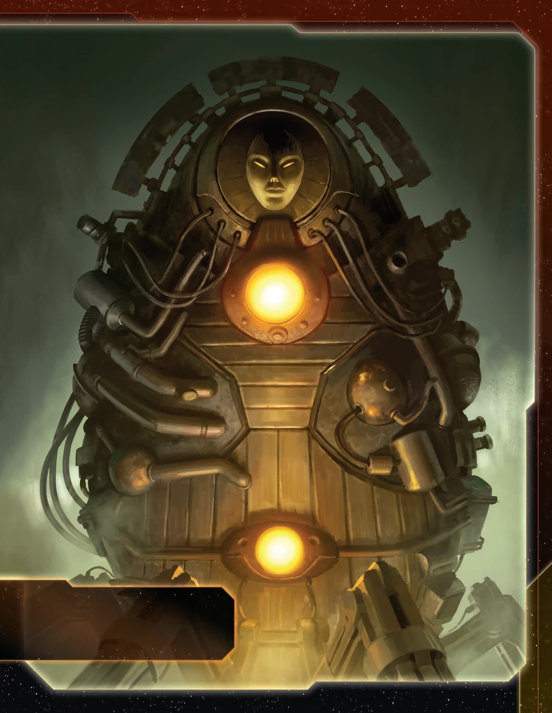

<nav class="page-nav">
<a href="../index.html" class="back-link">Back to Index</a>
<a href="Embers_of_Muaat.md" download class="download-link" title="Plain text file - safe to download">Download .md</a>
</nav>

# Embers of Muaat Guide

## Contents

1. [Introduction](#i-introduction)
2. [Playstyle](#ii-playstyle)
3. [Faction Info and Drafting](#iii-faction-info-and-drafting)
   - [Home System & Commodities](#a-home-system--commodities) · [Starting Fleet](#b-starting-fleet) · [Faction Abilities](#c-faction-abilities) · [Technologies](#d-starting-and-faction-technologies) · [Leaders](#e-leaders) · [Promissory Note](#f-promissory-note---fires-of-the-gashlai) · [Mech](#g-mech---ember-colossus) · [Flagship](#h-flagship---the-inferno) · [Breakthrough](#i-breakthrough---stellar-genesis-ry) · [Slice and Draft](#j-slice-and-draft-considerations)
4. [Round 1 Problems and Faction Weakness](#iv-round-1-problems-and-faction-weakness)
   - [First Turn Priorities](#a-first-turn-priorities) · [War Sun Dependence](#b-war-sun-dependence) · [Slow Mobility Pre-Upgrade](#c-slow-mobility-pre-upgrade)
5. [Technology](#v-technology)
   - [Overview](#a-overview) · [Technology Path](#b-technology-path)
6. [Strategy Cards](#vi-strategy-cards)
   - [Round 1](#a-round-1) · [Round 2+](#b-round-2)
7. [Unit Composition and Game Plan](#vii-unit-composition-and-game-plan)
   - [Unit Composition](#a-unit-composition) · [Game Plan](#b-game-plan)
8. [Objectives](#viii-objectives)
   - [Objective Summary](#a-objective-summary) · [Stage I](#b-stage-i-objectives) · [Secret Objectives](#c-secret-objectives) · [Stage II](#d-stage-ii-objectives)
9. [Alliance Priority](#ix-alliance-priority)
10. [Bonus Game Elements](#x-bonus-game-elements)
    - [Action Cards](#a-high-value-action-cards) · [Relics](#b-relic-priorities) · [Agendas](#c-agenda-awareness)
11. [End Notes](#xi-end-notes)

---

## I. Introduction

The Embers of Muaat wield the galaxy's most powerful weapon from the opening round. While other factions slowly build toward their late-game units, you begin with a war sun on the board—an overwhelming advantage that defines your entire strategy. This faction excels at leveraging supernova mobility, converting massive ships into mobile production platforms, and dominating through sheer firepower that no conventional fleet can match.

Muaat isn't about subtlety or gradual escalation. You're deploying the galaxy's most feared warship immediately, forcing opponents to respect your presence from turn one. Your unique mobility through supernovas opens routes across the map that others cannot access, while your production abilities let you reinforce fleets without traditional infrastructure. When Muaat commits to a system, conventional defenses crumble.

## II. Playstyle

Playing Muaat requires understanding that you begin with overwhelming firepower but limited mobility. Your opening round establishes immediate military dominance—the war sun creates a zone of control that opponents cannot contest conventionally. Your Star Forge ability transforms your massive ships into mobile production platforms, allowing fleet reinforcement without traditional space docks. Supernova mobility grants access to systems and shortcuts that remain closed to other factions.

Early game is about leveraging your war sun's presence. Control critical systems, establish territorial dominance, and use Star Forge to maintain fleet strength. Your war sun's slow movement means careful positioning matters—commit to systems that provide long-term value rather than overextending into vulnerable positions.

Mid-game transforms you into a mobile fortress. Upgrade to Prototype War Sun II for increased mobility, making your superweapon significantly more flexible. Stack your commander's trade good generation with Star Forge usage to create self-sustaining fleet expansion. Your ability to produce units anywhere your war suns travel means you can project power without the infrastructure constraints other factions face.

Late game, you become unstoppable through superior positioning and overwhelming force. Your hero provides a devastating nuclear option—destroying entire systems by converting them to supernovas. Use this threat for negotiations or execute it to eliminate critical opponent strongholds. Your fleet regeneration through Star Forge means you can sustain pressure that exhausts opponents who cannot match your production flexibility.

---

## III. Faction Info and Drafting

### A. Home System & Commodities

**Home System:**
- **Muaat:** 4 resources / 1 influence
- **Total: 4 resources / 1 influence (4 optimal resources / 0 optimal influence)**

**Commodities:** 4

Resource-heavy single-planet home system with minimal influence. 4 resources provide solid production capacity for war sun manufacturing. Single planet means you must choose between exhausting for resources or influence each round—you cannot get both simultaneously. 4 commodities provide excellent trade potential.

### B. Starting Fleet

- 1 War Sun (Prototype War Sun I)
- 2 Fighters
- 4 Infantry
- 1 Space Dock

Only faction that starts with a war sun, providing overwhelming combat power from round one. 4 infantry enable planet conquest and 2 fighters provide screening. Starting fleet is incredibly strong but immobile—war sun has move 1, creating significant positional constraints during opening expansion.

Your agent Umbat can produce a carrier in your home system, allowing you to split your infantry and expand to 2 nearby systems instead of just 1.

### C. Faction Abilities

**Star Forge:** ACTION: Spend 1 token from your strategy pool to place either 2 fighters or 1 destroyer from your reinforcements in a system that contains 1 or more of your war suns.

Star Forge transforms your war suns into mobile production platforms. By spending a strategy command counter, you instantly place 2 fighters or 1 destroyer in any system containing your war suns, bypassing the need for traditional space dock infrastructure. When you have mechs on planets in or adjacent to the system where you use Star Forge, you can simultaneously place 1 infantry with each mech, creating powerful ground force expansion without traditional production.

**Gashlai Physiology:** Your ships can move through supernovas.

Gashlai Physiology grants unique mobility through supernovas, which normally destroy all ships that enter them. Your ships pass through these systems safely, creating shortcuts across the map and accessing systems that remain closed to other factions.

### D. Starting and Faction Technologies

**Starting Technology:**

**Plasma Scoring (R):** When 1 or more of your units use BOMBARDMENT or SPACE CANNON, 1 of those units may roll 1 additional die.

Plasma Scoring opens red technology paths and synergizes excellently with your war sun's BOMBARDMENT 3 (x3) capability. You can roll an additional die during bombardment, effectively creating BOMBARDMENT 3 (x4) for devastating ground invasions.

**Faction Technologies:**

**Prototype War Sun II (RRRY):** Muaat War Sun | Cost: 10 | Combat: 3 (x3) | Move: 3 | Capacity: 6 | BOMBARDMENT 3 (x3) | Sustain Damage | Other players' units in this system lose the Planetary Shield ability.

Prototype War Sun II is your critical upgrade, reducing cost from 12 to 10 and dramatically increasing movement from 1 to 3. This mobility transformation makes your war sun significantly more flexible and threatening, allowing rapid repositioning and system control.

**Magmus Reactor Ω (RR):** Your ships can move into supernovas. Each supernova that contains 1 or more of your units gains the PRODUCTION 5 ability as if it were 1 of your units.

Magmus Reactor allows your ships to move into and stop in supernovas, while also granting PRODUCTION 5 to any supernova containing your units. This creates powerful production hubs in systems other factions cannot access, combining your Gashlai Physiology mobility with economic benefits.

### E. Leaders

**Agent - Umbat:** ACTION: Exhaust this card to choose a player; that player may produce up to 2 units that each have a cost of 4 or less in a system that contains one of their war suns or their flagship.

Umbat provides production flexibility for yourself or allies. You can produce up to 2 units costing 4 or less in systems containing war suns or flagships, enabling dreadnoughts, cruisers, carriers, destroyers, fighters, infantry, or mechs. Functions as both a diplomatic tool for building alliances and a self-boost mechanism.

Umbat combos exceptionally well with mobile fighting fleets. Combined with Avernus (with space dock), Star Forge, and Umbat's production, you can quickly regenerate lost troops and ships wherever your war sun travels, maintaining combat strength without returning to traditional production infrastructure. This combination solves early game production limitations and provides powerful stalling capabilities.

**Commander - Magmus:** *Unlock: Produce a war sun.* After you spend a token from your strategy pool: You may gain 1 trade good.

Magmus unlocks easily for Muaat since you start with a war sun and only need to produce one more. Once unlocked, every time you spend a strategy command counter, you gain 1 trade good. This transforms Star Forge usage into an economic engine—you generate trade goods while reinforcing your fleets, creating self-sustaining expansion.

Typically, you build a second Prototype War Sun I before upgrading to Prototype War Sun II specifically to unlock this very strong commander. Once Magmus is active, you can use Star Forge and spend command counters on secondaries while generating trade goods, making every strategy token expenditure economically efficient.

**Hero - Adjudicator Ba'al:** *Unlock: Have 3 scored objectives.* Nova Seed: After you move a war sun into a non-home system other than Mecatol Rex: You may destroy all other players' units in that system and replace that system tile with the Muaat supernova tile. If you do, purge this card and each planet card that corresponds to the replaced system tile.

Adjudicator Ba'al provides the ultimate weapon. When activated, move your war sun into an enemy system, destroy all units there, and replace the entire system tile with a supernova. This permanently removes planets from the game. Save this for eliminating critical opponent strongholds or as leverage in negotiations. The threat alone can shape diplomatic outcomes.

### F. Promissory Note - **Fires of the Gashlai**

ACTION: Remove 1 token from the Muaat player's fleet pool and return it to his reinforcements. Then, gain your war sun unit upgrade technology card. Then, return this card to the Muaat Player.

Fires of the Gashlai is an incredibly powerful promissory note. When played, another player gains your war sun technology, allowing them to build war suns themselves. The cost to you is losing 1 token from your fleet pool. Preferably trade this to resource-poor players who cannot afford to actually produce war suns—they gain the technology but lack the economic means to use it against you. This promissory note has significant trade value for securing alliances or extracting concessions.

### G. Mech - **Ember Colossus**

Cost: 2 | Combat: 6 | **Sustain Damage**

When you use your Star Forge faction ability in this system or an adjacent system, you may place 1 infantry from your reinforcements with this unit.

Ember Colossus synergizes with Star Forge production. When you use Star Forge to produce fighters or destroyers in the same system or adjacent system, you can simultaneously place 1 infantry with your mech. This builds ground forces without traditional production infrastructure. Sustain Damage makes these mechs durable in ground combat.

### H. Flagship - **The Inferno**

Cost: 8 | Combat: 5 (x2) | Move: 1 | Capacity: 3 | **Sustain Damage**

ACTION: Spend 1 token from your strategy pool to place 1 cruiser in this unit's system.

The Inferno extends your Star Forge capability to cruisers, but this ability has limited usefulness. Destroyer II is more powerful than cruisers, and even Destroyer I is nearly equivalent in combat value. Since Star Forge already produces destroyers, the flagship's cruiser production is only helpful when you've run out of destroyer plastic. The flagship's move 1 also limits its repositioning speed.

### I. Breakthrough - **Stellar Genesis (R<>Y)**

When you gain this card, place the Avernus planet token into a non-home system that is adjacent to a planet you control; gain control of and ready it. After you move 1 of your war suns out of or through Avernus's system and into a non-home system, you may move the Avernus token with it.

**Avernus:** 2 resources / 0 influence (Legendary Planet)
**Legendary Ability - The Nucleus:** ACTION: Exhaust this card to use the Embers of Muaat's STAR FORGE faction ability without spending a command token.

**R<>Y Synergy:** Red and yellow technologies count as each other for prerequisites.

Stellar Genesis helps early game by providing a readied planet with 2 resources. Building a space dock on Avernus creates a crazy mobile production facility that moves with your war suns across the galaxy. Additionally, Avernus can be moved from a locked system if your other war sun moves through that system, allowing you to relocate the planet even when the system is controlled or contested.

### J. Slice and Draft Considerations

As a resource-intensive faction built around expensive capital ships, Muaat has specific priorities during galaxy setup and faction draft.

**Speaker Order:**

Speaker order is not particularly important for Muaat. Prefer to have one neighbor to bully with your war sun rather than optimizing for strategy card picks.

**Priorities:**
- High influence slices - You have 4 resources at home and 2 from Avernus (6 total in kit). Resources are not your bottleneck—you need influence to generate command tokens for production, expansion, and Star Forge activations.
- Central positioning - War sun has move 1 until upgraded. Being centrally located allows you to threaten multiple opponents and control key systems without excessive movement.
- One neighbor to bully - Your war sun dominates 1v1 matchups. Having one weak neighbor to pressure is ideal.
- Entropic Scar access - Allows complete tech path flexibility with its tech skip.

**Nice to Have:**
- Supernova access (Gashlai Physiology moves through them, Magmus Reactor creates PRODUCTION 5 zones in them)
- Red technology specialties (accelerate path to Prototype War Sun II)
- High planet count for influence generation

**Avoid:**
- Isolated slices (your slow war sun cannot effectively threaten multiple opponents from isolation)
- Resource-starved neighbors (hard to extract value through bullying if they have nothing)

---

## IV. Round 1 Problems and Faction Weakness

### A. First Turn Priorities

Your Round 1 (R1) priority order: **Breakthrough > Production > Scoring > Technology**

1. **Breakthrough** - Stellar Genesis creates Avernus legendary planet with 2 resources and the R<>Y synergy. Building a space dock on Avernus creates a mobile production facility that follows your war sun. Priority one.

2. **Production** - Use Umbat to produce a carrier, split your 4 infantry across carriers for multi-system expansion. Secure resource planets for future war sun production.

3. **Scoring** - Score if objectives align with your expansion. Don't force it R1.

4. **Technology** - Defer to R2. Focus on economy and breakthrough first.

**R1 Expansion Notes:** You have 1 war sun (capacity 6), 2 fighters, and 4 infantry. Use Umbat on yourself to produce a carrier (3 resources) + 1 infantry if you have more planets to take, or a destroyer if you need early combat presence. Split infantry across your war sun and carrier to take 2-3 systems R1.

### B. War Sun Dependence

Your entire strategy revolves around your war sun's presence and survivability. Losing your war sun cripples your faction since replacement costs 12 resources—a devastating setback that can effectively eliminate you from contention.

**Protection Strategies:**
- Always screen your war sun with fighters and destroyers that can absorb hits
- Never commit your war sun to combat alone or without supporting fleet
- Keep action cards like Shields Holding for critical moments
- Position your war sun where it can retreat if combat goes poorly
- Build a second war sun as soon as economically feasible for redundancy

**Recovery from War Sun Loss:**
If you lose your war sun, immediately prioritize rebuilding. You need 12 resources (10 with Prototype War Sun II).

### C. Slow Mobility Pre-Upgrade

Your war sun begins with move 1, making it extremely slow to project power across the map.

**Problems:**
- Faster factions outmaneuver you and raid territory while your war sun is occupied elsewhere

**Solutions:**
- Rush Prototype War Sun II (move 3) as highest priority tech
- Build a second war sun to cover more territory

---

## V. Technology

### A. Overview

**Starting Technology:** Plasma Scoring - Not a great tech but is on the way to Prototype War Sun II.

Your main technology path focuses on acquiring Prototype War Sun II (RRRY) for the critical mobility upgrade from move 1 to move 3. Secondary priority is Magmus Reactor (RR) for supernova production.

### B. Technology Path

**Round 1:** AI Development Algorithm - Sometimes you have a great round
- Exhaust to ignore 1 prereq when researching unit upgrades; reduce cost by number of unit upgrades owned

**Round 2:** Self-Assembly Routines (R) or Magmus Reactor (RR) if supernova available
- *Self-Assembly Routines:* After PRODUCTION, place 1 mech. After mech destroyed, gain 1 TG
- *Magmus Reactor:* Ships can move into supernovas. Supernovas with your units gain PRODUCTION 5

**Round 3:** Prototype War Sun II (RRRY) - **MAJOR POWER SPIKE**
- Your war sun transforms from move 1 to move 3

**Round 4:** Gravity Drive (B) if you have blue skip, otherwise Destroyer II (RR)
- *Gravity Drive:* +1 move to 1 ship per tactical action
- *Destroyer II:* Cost 1, Combat 8, Move 2, AFB 6 (x3)

**Note:** If you need 3 unit upgrades for objectives, consider Cruiser II (flagship synergy) or Space Dock II.

---

## VI. Strategy Cards

### A. Round 1

Your R1 priority is establishing economic foundation while protecting your war sun and beginning expansion.

**Round 1 Priority Ranking:**

1. **Trade** - With 4 commodities, you generate substantial trade good income that helps you achieve all R1 goals including tech.

2. **Technology** - Begin the path toward Prototype War Sun II (RRRY). The mobility upgrade from move 1 to move 3 solves your most critical weakness.

3. **Leadership** - Command tokens for Star Forge activations and territorial expansion. Easy breakthrough unlock.

4. **Politics** - Speaker token has utility for strategy card selection. Easy breakthrough unlock.

5. **Diplomacy** - Easy breakthrough unlock, especially if you have a tech skip planet.

6. **Warfare** - Usually lets you fill out your entire slice.

7. **Construction** - Space dock on Avernus is not terrible.

8. **Imperial** - Never R1.

**Strategy Token Priority:** Diplomacy and Technology.

### B. Round 2+

**Love:**
- **Trade** - Refreshing 4 commodities creates consistent income for Star Forge, war sun production, and tech. Your economic engine.
- **Leadership** - Command tokens enable Star Forge spam. Leadership R2 helps you produce a second war sun and mechs to unlock Magmus commander. Once unlocked, spending strategy tokens generates trade goods—Star Forge pays for itself.
- **Imperial** (R3+) - Your war sun makes Mecatol Rex control realistic. Score points while maintaining board presence.

**Like:**
- **Technology** - Progress toward Prototype War Sun II and beyond. Essential until upgrade complete, then situational.
- **Warfare** - Double usage of big war sun fleets after potential Star Forge stall.
- **Politics** - Speaker token utility for strategy card selection.

**Situational:**
- **Construction** - Can be potential if you have forward space dock with Avernus.
- **Diplomacy** - Not useful for defense. Gives opponents too much value.

---

## VII. Unit Composition and Game Plan

### A. Unit Composition

Your ideal fleet composition in each system:

- **War Sun (centerpiece)** - Overwhelming combat power that no conventional fleet can match. Combat 3 (x3), BOMBARDMENT 3 (x3), Sustain Damage, Capacity 6
- **Fighters (screen)** - Absorb hits and protect your most valuable asset. Produced via Star Forge
- **Destroyers** - Additional combat dice, AFB capability, produced via Star Forge. Destroyer II (RR) provides excellent value
- **Infantry (as needed)** - Conquest capability for taking planets
- **Mechs (situational)** - Enhanced ground combat, Sustain Damage, Star Forge synergy for infantry placement

**Fleet Priority:** Your war sun is everything. Always protect it with screening ships that absorb incoming fire. As your war sun moves across the map, use Star Forge to produce fighters and destroyers in its system, maintaining the protective screen throughout operations.

**Late Game Composition:** Two war suns with fighter screens and destroyer support create overwhelming map control. Add your flagship if objectives require it or if you have Nomad alliance for free production.

### B. Game Plan

**Early Game (R1-R2):** Focus on securing resource planets to build your economic foundation. You need minimum 8-10 total resources to sustain war sun production. Use Umbat R1 to produce a carrier for multi-system expansion. Protect your war sun and never expose it to unnecessary risk while beginning your tech path toward Prototype War Sun II.

**Mid Game (R3-R4):** Acquire Prototype War Sun II—the move 3 upgrade changes everything. Build a second war sun to unlock Magmus commander. Use Star Forge aggressively, spending strategy tokens for fighters and destroyers. Once your commander unlocks, Star Forge generates trade goods while building your fleet. Position your war suns to threaten Mecatol Rex and opponent territories.

**Late Game (R5-R6):** Control Mecatol Rex using your war sun's superior holding power. Park your war sun there with supporting ships and use Star Forge to reinforce. If you have Magmus Reactor, implement your supernova strategy for untouchable production zones. Deploy your hero Nova Seed for critical strategic moments—creating supernova barriers or denying objectives. Remember that turning systems into supernovas is permanent.

---

## VIII. Objectives

### A. Objective Summary

**Strengths:** Muaat excels at combat objectives with war sun dominance and overwhelming firepower. Unit upgrade objectives are easy with Prototype War Sun II, and Magmus commander generates trade goods for spending objectives.

**Weaknesses:** Influence spending objectives are nearly impossible with minimal home influence. Planet control objectives are challenging with slow war sun mobility, and structure objectives require significant investment beyond your core strategy.

### B. Stage I Objectives

| Stage I Objective                                              | Status |
|----------------------------------------------------------------|--------|
| **Spendies**                                                   |        |
| Erect a Monument (Spend 8 resources)                           | 🟢     |
| Sway the Council (Spend 8 influence)                           | 🔴     |
| Negotiate Trade Routes (Spend 5 trade goods)                   | 🟢     |
| Lead from the Front (Spend 3 tokens from tactic/strategy pools)| 🟡     |
| Amass Wealth (Spend 3 influence, 3 resources, 3 trade goods)   | 🟡     |
| **Control**                                                    |        |
| Expand Borders (Control 6 planets in non-home systems)         | 🟢     |
| Corner the Market (Control 4 planets with same trait)          | 🟡     |
| Found Research Outposts (Control 3 planets with tech specialties)       | 🔴     |
| Discover Lost Outposts (Control 2 planets with attachments)    | 🔴     |
| Push Boundaries (Control more planets than each neighbor)      | 🟢     |
| **Ships in Systems**                                           |        |
| Intimidate the Council (Ships in 2 systems adjacent to MR)     | 🟢     |
| Explore Deep Space (Units in 3 systems without planets)        | 🟢     |
| Make History (Units in 2 systems with legendary/MR/anomalies)           | 🟢     |
| Populate the Outer Rim (Units in 3 edge systems)                        | 🟢     |
| Raise a Fleet (5+ non-fighter ships in 1 system)               | 🟡     |
| Engineer a Marvel (Have flagship or war sun on board)                   | 🟢     |
| **Tech**                                                       |        |
| Diversify Research (Own 2 techs in each of 2 colors)           | 🟡     |
| Develop Weaponry (Own 2 unit upgrade technologies)             | 🟢     |
| **Structure**                                                  |        |
| Build Defenses (Have 4+ structures)                            | 🔴     |
| Improve Infrastructure (Structures on 3 planets outside HS)    | 🔴     |

**Legend:** 🟢 Likely | 🟡 Possible | 🔴 Difficult

### C. Secret Objectives

| Secret Objective                                                | Status |
|----------------------------------------------------------------|--------|
| **Combat**                                                     |        |
| Unveil Flagship (Win space combat with flagship)               | 🟡     |
| Destroy their Greatest Ship (Destroy war sun/flagship)          | 🟢     |
| Spark a Rebellion (Win combat vs most VP player)               | 🟢     |
| Betray a Friend (Win combat vs player whose PN you have)                | 🟢     |
| Brave the Void (Win combat in anomaly)                                  | 🟡     |
| Darken the Skies (Win combat in another player's HS)                    | 🟡     |
| Demonstrate your Power (3+ non-fighter ships after space combat)        | 🟢     |
| Turn their Fleets to Dust (SPACE CANNON destroy last ship)     | 🔴     |
| Make an Example (BOMBARDMENT destroy last ground forces)                | 🟢     |
| Fight With Precision (AFB destroy last fighter)                | 🔴     |
| **Ships in Systems**                                           |        |
| Threaten Enemies (Ships adjacent to another player's HS)       | 🟢     |
| Cut Supply Lines (Ships in system with another's space dock)   | 🟢     |
| Defy Space and Time (Units in wormhole nexus)                           | 🟡     |
| Become the Gatekeeper (Ships in alpha and beta wormhole systems)        | 🟡     |
| Learn Secrets of the Cosmos (Ships in 3 systems adjacent to anomalies)  | 🟢     |
| Control the Region (Ships in 6 systems)                                 | 🟢     |
| Occupy the Seat of the Empire (Control MR with 3+ ships)       | 🟢     |
| **Control**                                                    |        |
| Monopolize Production (Control 4 industrial planets)            | 🔴     |
| Mine Rare Minerals (Control 4 hazardous planets)               | 🔴     |
| Forge an Alliance (Control 4 cultural planets)                 | 🔴     |
| Establish Hegemony (Control planets with 12+ influence)                 | 🔴     |
| Hoard Raw Materials (Control planets with 12+ resources)                | 🟢     |
| Seize an Icon (Control legendary planet)                       | 🟢     |
| Stake Your Claim (Control planet in contested system)                   | 🟡     |
| Become a Martyr (Lose control of planet in HS)                 | 🔴     |
| **Tech**                                                       |        |
| Adapt New Strategies (Own 2 faction technologies)                       | 🟢     |
| Master the Laws of Physics (Own 4 tech of same color)                   | 🔴     |
| **Structure/Units**                                            |        |
| Establish a Perimeter (Have 4 PDS on board)                             | 🔴     |
| Fuel the War Machine (Have 3 space docks)                               | 🔴     |
| Gather a Mighty Fleet (Have 5 dreadnoughts)                             | 🔴     |
| Mechanize the Military (1 mech on each of 4 planets)           | 🟡     |
| Occupy the Fringe (9+ ground forces on planet without space dock)       | 🔴     |
| Produce en Masse (Units with PRODUCTION 8+ in single system)            | 🟡     |
| **Other**                                                      |        |
| Dictate Policy (3+ laws in play)                                        | 🔴     |
| Drive the Debate (You/your planet elected by agenda)                    | 🔴     |
| Destroy Heretical Works (Purge 2 relic fragments)                       | 🔴     |
| Form a Spy Network (Discard 5 action cards)                             | 🟡     |
| Foster Cohesion (Be neighbors with all players)                | 🟢     |
| Strengthen Bonds (Have another player's PN)                    | 🟢     |
| Prove Endurance (Last to pass)                                 | 🟡     |

**Legend:** 🟢 Likely | 🟡 Possible | 🔴 Difficult

### D. Stage II Objectives

| Stage II Objective                                                       | Status |
|--------------------------------------------------------------------------|--------|
| **Spendies**                                                             |        |
| Centralize Galactic Trade (Spend 10 trade goods)                         | 🟢     |
| Found a Golden Age (Spend 16 resources)                                  | 🟢     |
| Galvanize the People (Spend 6 tokens from tactic/strategy pools)         | 🟡     |
| Manipulate Galactic Law (Spend 16 influence)                             | 🔴     |
| Hold Vast Reserves (Spend 6 influence, 6 resources, 6 trade goods)       | 🟢     |
| **Control**                                                              |        |
| Conquer the Weak (Control 1 planet in another player's HS)               | 🟡     |
| Rule Distant Lands (Control 2 planets in/adjacent to different players' HS) | 🟡     |
| Subdue the Galaxy (Control 11 planets in non-home systems)               | 🔴     |
| Unify the Colonies (Control 6 planets with same trait)                   | 🔴     |
| Reclaim Ancient Monuments (Control 3 planets with attachments)           | 🔴     |
| Form Galactic Brain Trust (Control 5 planets with tech specialties)      | 🔴     |
| **Ships in Systems**                                                     |        |
| Command an Armada (Have 8+ non-fighter ships in 1 system)                | 🔴     |
| Achieve Supremacy (Flagship/War Sun in another player's HS or MR)        | 🟢     |
| Become a Legend (Units in 4 systems with legendary/MR/anomalies)         | 🟡     |
| Patrol Vast Territories (Units in 5 systems without planets)             | 🔴     |
| Control the Borderlands (Units in 5 edge systems not HS)                 | 🔴     |
| **Tech**                                                                 |        |
| Master of Sciences (Own 2 techs in each of 4 colors)                     | 🔴     |
| Revolutionize Warfare (Own 3 unit upgrade technologies)                  | 🟢     |
| **Structure**                                                            |        |
| Construct Massive Cities (Have 7+ structures)                            | 🔴     |
| Protect the Border (Structures on 5 planets outside HS)                  | 🔴     |

**Legend:** 🟢 Likely | 🟡 Possible | 🔴 Difficult

---

## IX. Alliance Priority

Trading for other factions' Alliance promissory notes grants you access to their commanders, potentially boosting your strategy significantly.

**Top Tier:**

1. **Crimson Rebellion (Ahk Siever)** - At the end of combat between any players, gain 1 commodity or convert 1 commodity to a trade good. Passive income from table aggression.

2. **Deepwrought Scholarate (Aello)** - When another player researches tech, they may reduce cost by 1; if they do, gain 1 commodity or convert 1 commodity to trade good. Passive income as players tech frequently.

3. **Nomad (Navarch Feng)** - Produce your flagship without spending resources. Saves 8 resources while adding The Inferno's cruiser production ability.

4. **Winnu (Rickar Rickani)** - Apply +2 to combat rolls in Mecatol Rex, your home system, and legendary planet systems. Makes your war sun even more dominant in critical locations.

5. **Empyrean (Xuange)** - After another player moves ships into a system with your command token, return token to reinforcements. Late-game slaying tool.

**Good:**

6. **Jol-Nar (Ta Zern)** - Reroll unit ability dice. Directly benefits your war sun's BOMBARDMENT 3 (x3) capability.

7. **Argent Flight (Trrakan Aun Zulok)** - Roll 1 additional die for unit abilities. Combined with Plasma Scoring, your war sun effectively rolls 5 bombardment dice.

8. **Yin Brotherhood (Brother Omar)** - Green prerequisite + skip prereqs when researching others' tech. Helps with late game blue tech.

9. **Naaz-Rokha (Dart and Tai)** - After you gain control of a planet from another player, explore that planet. Bonus exploration from war sun conquests.

10. **Nekro Virus (Nekro Acidos)** - After you gain a technology, draw 1 action card. Card draw along your tech path.

---

## X. Bonus Game Elements

### A. High-Value Action Cards

### B. Relic Priorities

### C. Agenda Awareness

**Publicize Weapon Schematics** (Law) - If any player owns a war sun technology, all players may ignore all prerequisites on war sun technologies. All war suns lose Sustain Damage.

**CRITICAL THREAT.** This law destroys your faction identity. Your war sun losing Sustain Damage makes it dramatically more vulnerable—a single Direct Hit or focused fire can destroy it. Simultaneously, other factions can build war suns without prerequisites, eliminating your unique advantage. Vote against this with everything you have.

---

## XI. End Notes

Embers of Muaat is TI4's war sun superpower. You begin with the galaxy's most feared weapon while other factions are still building cruisers. Your entire strategy revolves around protecting, upgrading, and multiplying this devastating asset.

Early game feels slow with move 1 war sun. Accept this—you're investing in economy and breakthrough while others expand aggressively. Your power spike comes R3-R4 with Prototype War Sun II. The move 3 upgrade transforms everything, letting you project power across the entire map.

Build a second war sun to unlock Magmus commander and achieve near-unstoppable map control. Use Star Forge constantly to screen your war sun with fighters and destroyers. Once Magmus unlocks, every strategy token spent generates a trade good, making Star Forge pay for itself.

Don't be afraid to use your war sun aggressively. It's the strongest ship in the game—opponents should fear it, not you.
