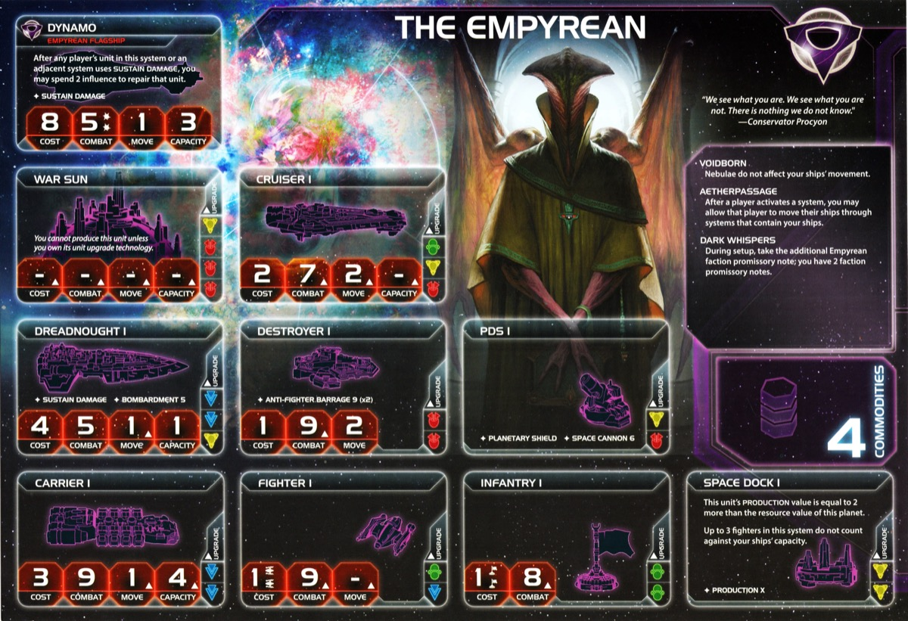

<nav class="page-nav">
<a href="../index.html" class="back-link">Back to Index</a>
<a href="Empyrean.md" download class="download-link" title="Plain text file - safe to download">Download .md</a>
</nav>

# Empyrean Guide

*Art credit: Fantasy Flight Games (Prophecy of Kings)*

## Contents

1. [Introduction](#i-introduction)
2. [Playstyle](#ii-playstyle)
3. [Faction Info and Drafting](#iii-faction-info-and-drafting)
   - [Home System & Commodities](#a-home-system--commodities) · [Starting Fleet](#b-starting-fleet) · [Faction Abilities](#c-faction-abilities) · [Technologies](#d-starting-and-faction-technologies) · [Leaders](#e-leaders) · [Promissory Note](#f-promissory-note) · [Alliance](#g-alliance) · [Mech](#h-mech) · [Flagship](#i-flagship) · [Breakthrough](#j-breakthrough) · [Slice and Draft](#k-slice-and-draft-considerations)
4. [Round 1 Problems and Faction Weakness](#iv-round-1-problems-and-faction-weakness)
5. [Technology](#v-technology)
6. [Strategy Cards](#vi-strategy-cards)
7. [Unit Composition and Game Plan](#vii-unit-composition-and-game-plan)
8. [Objectives](#viii-objectives)
9. [Alliance Priority](#ix-alliance-priority)
10. [Bonus Game Elements](#x-bonus-game-elements)
11. [End Notes](#xi-end-notes)

---

## I. Introduction

The Empyrean are TI4's frontier exploration and diplomatic leverage masters. Your two promissory notes create unprecedented flexibility—grant movement through your ships or sever adjacencies to break the map for opponents. You're the faction that controls who can move where.

This is a faction about spatial control and exploration dominance. Your agent refunds command tokens for constant frontier exploration. Your hero floods the board with frontier tokens and explores them all simultaneously. Everything builds toward becoming everyone's necessary ally while extracting value from empty space.

Watch opponents realize their plans depend on your permission. You don't dominate through raw power—you dominate through controlling space itself.

## II. Playstyle

Playing Empyrean means mastering frontier token exploration like no other faction. Dark Energy Tap exploration lets you milk the frontier deck for value. Your hero floods the board with frontier tokens, exploring all of them simultaneously. Your kit revolves around empty system control and exploration dominance.

Your 4 commodities provide strong trade economy. Your two promissory notes create unprecedented diplomatic leverage. Your Voidborn ability keeps your fleet mobile through nebulae—easily send destroyers to explore empty systems while maintaining defensive nebula home with carriers and fighters. This combination of exploration mastery, economic strength, and diplomatic flexibility makes you powerful without relying on combat.

Your commander returns command tokens to reinforcements when opponents move into your systems—reclaims board space for more activations. Aetherstream and Voidwatch are sellable abilities that make you valuable to neighbors while extracting value. You're kind of a puppet master—offering people bonus movement to engage with each other and cause conflict while you benefit from the chaos.

Your power comes from exploration dominance (frontier token mastery), diplomatic strength (two promissory notes, sellable abilities), and economic flexibility (4 commodities, trade economy) backed by mobile fleet. You're not conquering through force—you're succeeding through exploration, negotiation, and economic superiority.

## III. Faction Info and Drafting

### A. Home System & Commodities

**Home System:** 1 planet (Nebula)
- **The Dark:** 3 resources / 4 influence = 4 optimal influence
- **Total: 3 resources / 4 influence (4 optimal influence)**

**Commodities:** 4

**Notes:** You are rich. Home system gives lots of tokens mostly, but can be used for resources if your slice needs it. Very strong defensive system. 4 commodities is awesome. Decent production. Nebula is an anomaly—counts for anomaly objectives. Nebula defense works well with carriers + fighters (HP-based).

### B. Starting Fleet

- 2 Carriers
- 1 Destroyer
- 2 Fighters
- 4 Infantry
- 1 Space Dock

**Notes:** Solid starting fleet. Bit weak economically but good for expansion. Easy to send out destroyer to explore empty systems.

### C. Faction Abilities

**Voidborn:** Nebulae do not affect your ships' movement.

Treat nebulae like empty space. Rarely comes up—only 1 nebula tile in game unless in your slice. Primarily exists because your home system is in nebula. Can be useful when people are scared of otherwise good slice with nebula on way to Mecatol. Lets you go through nebulae without stopping.

**Aetherpassage:** After a player activates a system, you may allow that player to move their ships through systems that contain your ships.

Grant permission to move through your units. Creates diplomatic leverage—you decide who gets passage and who doesn't. Sellable ability for deals. Allows greedy frontier token snatches—grab frontiers that might block people because you can always say you'll let them through.

**Dark Whispers:** During setup, take the additional Empyrean faction promissory note; you have 2 faction promissory notes.

Two different promissory notes instead of one. Doubles your diplomatic leverage and creates multiple alliance paths.

### D. Starting and Faction Technologies

**Starting Technologies:**

**Dark Energy Tap:** After you perform a tactical action in a system that contains a frontier token, if you have 1 or more ships in that system, explore that token. Your ships can retreat into adjacent systems that do not contain other players' units even if you do not have units or control planets in that system.

Combos with your agent—since the deck involves a lot of token gain, you can often keep exploring 2-3 empty systems per round even though agent only refunds one. Solid starting tech opening up later blue techs. Retreat flexibility.

**Faction Technologies:**

**Aetherstream (BB):** After you or one of your neighbors activates a system that is adjacent to an anomaly, you may apply +1 to the move value of all of that player's ships during this tactical action.

Might not always be the best but most of the time really is game-changing movement. Ability to sell/enable others makes it just too good to pass up.

**Voidwatch (G):** After a player moves ships into a system that contains 1 or more of your units, they must give you 1 promissory note from their hand, if able.

Would really not recommend. People rarely will be forced to give you something useful. A tech and opportunity cost of not getting other tech is too much of a price. Since you have the tokens, definitely get it in Entropic Scar but otherwise skip.

### E. Leaders

**Agent - Acamar:** After a player moves ships into a system that does not contain any planets, you may exhaust this card; that player gains 1 command token.

Superb. Keeps your strong economic leverage—you just keep getting to those empty systems, keep getting those explores, and find value where people usually cannot.

**Commander - Xuange:**

- **Unlock:** Be neighbors with all other players
- **Ability:** After another player moves ships into a system that contains 1 of your command tokens, you may return that token to your reinforcements.

Great for ensuring you don't get screwed out of scoring. If you send ship somewhere for objective and people blow you out, you can retaliate and grab it right back. Very helpful for winslaying—coordinate with table to walk big fleet somewhere to bring someone down.

**Hero - Conservator Procyon:**

- **Unlock:** Have 3 scored objectives
- **Multiverse Shift:** Place 1 frontier token in each system that does not contain any planets and does not already have a frontier token. Then, explore each frontier token that is in a system that contains 1 or more of your ships. Then, purge this card.

Incredible hero that gets you so much value with your natural playstyle. As long as you kept a ton of random destroyers around, you can pop this for big spike. On top of that, you can keep exploring if you need to keep drawing for something in the frontier deck. In TE they got big buff too—Fracture has FOUR new empty systems automatically.

Consider if you want to pop hero earlier for 3-4 explores or try to get even more value. Always risky to be blown out of the sky if people see you setting up massive hero play.

### F. Promissory Note

**Blood Pact:** Place this card faceup in your play area. When you and the Empyrean player cast votes for the same outcome, cast 4 additional votes for that outcome. If you activate a system that contains 1 or more of the Empyrean player's units, return this card to the Empyrean player.

Definitely a bit more situational but useful if you need to send someone a PN for some reason. Sold as cheap stall or ask someone to align with you on voting.

**Dark Pact:** Place this card faceup in your play area. When you give a number of commodities to the Empyrean player equal to your maximum commodity value, you each gain 1 trade good. If you activate a system that contains 1 or more of the Empyrean player's units, return this card to the Empyrean player.

Great promissory note. People like them as stalls potentially. Will most likely give you 4-5 TGs but the diplomatic advantage of having a rich and happy neighbor cannot be understated. Getting your Dark Pact going for a great ally that gets constant value over the course of the game.

### G. Alliance

**Alliance Ability:** Your ally gains Xuange - After another player moves ships into a system that contains 1 of their command tokens, they may return that token to their reinforcements.

Grants your Commander ability. Very strong potentially but might not do a ton for them. Can combine to help each other lift tokens if needed. Trade value is hard to tell—try to get a useful alliance instead of selling it for money. You need a partner, not a few TGs.

### H. Mech

**Watcher:** Cost 2, Combat 6, Sustain Damage. You may remove this unit from a system that contains or is adjacent to another player's units to cancel an action card played by that player.

One of the strongest mechs in the game. Sabotages on command is game-winning. Fact that you can cancel Sabotages is also game-winning. Can be used for extortion. Definite downside: people save their Sabotages and ask you to spend your mechs for stopping wins, which can be annoying.

### I. Flagship

**Dynamo:** Cost 8, Combat 5 (x2), Move 1, Capacity 3, Sustain Damage. After any player's unit in this system or an adjacent system uses Sustain Damage, you may spend 2 influence to repair that unit.

Strong combat-wise, which your faction kind of needs. Ability is a bit costly but when you need it, great to be able to repair a key unit if you have a ton of extra cash. Might swing the fight.

### J. Breakthrough - **Void Tether (B↔G)**

When you activate a system that contains or is adjacent to a unit or planet you control, you may place or move 1 of your void tether tokens onto a border that system shares with another system. Other players do not treat those systems as adjacent to each other unless you allow it.

**B↔G Synergy:** Blue and green count as each other for prerequisites. Lets you get some late green tech like X-89.

**Map Control:** Might be really impactful and takes some know-how in how to use them. The more you play Empyrean, you'll see what's needed in what systems. Some suggested uses: blocking Fracture planet and Styx, blocking key wormhole into your system, or just say no to battlethirsty neighbor. Definitely useful and should be pretty easy to get.

### K. Slice and Draft Considerations

**Speaker Priority:** Whatever, you can handle anything. Prioritize slice. Obviously having some cool trading partners as neighbors is always helpful.

**Slice Priorities:**

- **Lots of empty systems** - Exploration is your core strength.
- **Wormholes** - Ability to move around the map.
- **Best overall slice** - You have great token economy with home system + agent. Aim for slightly more resource-heavy but prioritize getting best overall slice. Solve res/inf distribution with your TGs.

**Nice to Have:**

- Fracture access (very helpful).
- Systems with anomalies (supports Aetherstream).
- Entropic Scar (both techs worth a token).

**Avoid:**

- Awkward asteroid/supernova in middle of your slice.

## IV. Round 1 Problems and Faction Weakness

### A. First Turn Priorities

**Round 1 Priority Rankings:**

1. **Scoring** - Key since you can mostly rely on others to stop people and have strong defensive tools.

2. **Expansion and Production** - Explore empty systems with destroyer. Try to fit in building extra ships for more explores and system grabs. Expand to 2-3 systems R1.

3. **Technology** - Gravity Drive to get more things in your slice.

4. **Breakthrough** - Good to get out of the way and will be a useful tool.

**Expansion Notes:** 2 carriers, 1 destroyer, 4 infantry. Send carriers into nearby systems. If you grab Gravity Drive, you can build an extra carrier and try to get a third system. Send destroyer to explore empty systems with Dark Energy Tap.

### B. Combat Power

You have a hard time being on the offense. Have to rely on diplomatic dealing to solve problems. No inherent combat bonuses—your power is in negotiation and positioning, not fighting.

---

## V. Technology

### A. Overview

**Starting Tech:** Dark Energy Tap.

You're flexible within blue to get what you need. Priority is Aetherstream for game-changing movement. Breakthrough allows X-89 as flex tech in late game R5.

### B. Technology Paths

**Standard Path:**

**Round 1:** Gravity Drive (B)
- After you activate a system, apply +1 to the move value of 1 of your ships during this tactical action
- **Why:** Mobility to get more things in your slice.

**Round 2:** Aetherstream (BB)
- After you or one of your neighbors activates a system that is adjacent to an anomaly, you may apply +1 to the move value of all of that player's ships during this tactical action
- **Why:** Game-changing movement. Sellable ability.

**Round 3:** Carrier II (BB)
- Cost 3, Combat 9, Move 2, Capacity 6
- **Why:** Transport capacity. Move 2 carriers.

**Round 4:** Fleet Logistics (BB)
- During each of your turns of the action phase, you may perform 2 actions instead of 1
- **Why:** Double actions for flexibility.

**Round 5:** Light/Wave Deflector (BBB)
- Your ships can move through systems that contain other players' ships
- **Why:** Move through enemy fleets.

**Bonus Tech:** X-89 Bacterial Weapon (GGG) via B↔G breakthrough
- After using BOMBARDMENT, destroy all infantry on planet if at least 1 destroyed. Double BOMBARDMENT and ground combat hits. Exhaust planet.
- **Why:** Late game flex tech using breakthrough synergy.

---

## VI. Strategy Cards

### A. Round 1

**Round 1 Priority Ranking:**

1. **Trade** - Refresh 4 commodities. Super good since you have good chance to have a few neighbors to collect money from.
2. **Technology** - Critical tech path. Start Gravity Drive early. Great to save resources.
3. **Leadership** - More activations is good. Can also throw bad secret for breakthrough.
4. **Politics** - Sell speaker token and get first pick. Setup to prepare for R2 objectives.
5. **Construction** - Can be nice to produce a carrier, destroyer, and infantry at home for more exploration and system takes for economic head start.
6. **Diplomacy** - Can be cheap breakthrough unlock with tech skip planet nearby.
7. **Warfare** - Only with very annoying slice with best planets far away and far back in speaker order (why did you do this to yourself).
8. **Imperial** - Never R1.

**Note:** Technology, Diplomacy, and Warfare all doable with your agent.

**Strategy Token Priority:** Technology and Diplomacy as secondary.

### B. Round 2+

**Love:**

- **Imperial** - Score objectives. Mobility via Aetherpassage enables Mecatol control.
- **Leadership** - Command tokens for continued expansion and activations.
- **Trade** - Refresh 4 commodities for consistent economy. Dark Pact provides additional value.

**Like:**

- **Technology** - Continue Aetherstream path.
- **Politics** - Setup for objectives. Voting power with 4 influence.

**Situational:**

- **Construction** - Only if you need additional space docks for expansion.
- **Warfare** - Fleet token return useful for specific aggressive plays or repositioning.
- **Diplomacy** - Only for key defensive plays and if you need more resources for scoring objectives.

---

## VII. Unit Composition and Game Plan

### A. Unit Composition

Your ideal fleet composition:

- **Destroyers** - For explores. Send to empty systems.
- **Carriers** - Fighting power with fighters. Core transport.
- **Fighters** - For fighting power. Nebula defense synergy.
- **Infantry** - Good for ground combat.
- **Mechs** - Good for ground combat. Cancel action cards.
- **Flagship** - Solid power ship.
- **Dreadnoughts** - One or 2 in slice to combine for defensive power. Not for mobility.

No cruisers. Focus on exploration ships (destroyers) and defensive carriers with fighter screens.

### B. Game Plan

**Early Game:** Send destroyers to explore empty systems with Dark Energy Tap. Agent refunds tokens, letting you keep exploring 2-3 empty systems per round. Trade Dark Pact to key neighbor to establish economic partnership. Expand to 2-3 systems with dual carriers. Build defensive carrier + fighter fleet leveraging nebula home. Research Gravity Drive to get more things in your slice.

**Mid Game:** Aetherstream provides game-changing movement—sell/enable others while benefiting yourself. Build more destroyers for continued exploration. Void Tether provides map control—block key routes, protect your systems, deny battlethirsty neighbors. Carrier II and Fleet Logistics increase tempo. Your defensive carriers with fighter screens protect controlled territory while destroyers explore.

**Late Game:** Hero floods board with frontier tokens, exploring all of them for massive spike. Commander provides board control—reclaim tokens when opponents activate near you. Useful for winslaying (coordinate with table to walk fleet somewhere) and scoring security (grab objective, if blown out, retaliate and grab it back). Light/Wave for final mobility. X-89 via B↔G breakthrough as late flex tech. Close out through exploration advantage, diplomatic leverage, and economic superiority.

---

## VIII. Objectives

### A. Objective Summary

**Strengths:** All spending is easy with 4 home influence and 4 commodities. Ships in systems objectives are great—exploration focus gets you into empty systems easily. Early tech objectives can be dealt with.

**Weaknesses:** Control objectives not so easy—requires breaking diplomatic ways sometimes. Structure objectives are not nice—you don't naturally build structures. Combat objectives are harder without combat bonuses. Planet type control objectives (Corner Market, Research Outposts) are difficult.

### B. Stage I Objectives

| Stage I Objective                                                       | Status |
|-------------------------------------------------------------------------|--------|
| **Spendies**                                                            |        |
| Erect a Monument (Spend 8 resources)                                    | 🟢     |
| Sway the Council (Spend 8 influence)                                    | 🟢     |
| Negotiate Trade Routes (Spend 5 trade goods)                            | 🟢     |
| Lead from the Front (Spend 3 tokens from tactic/strategy pools)         | 🟢     |
| Amass Wealth (Spend 3 influence, 3 resources, 3 trade goods)            | 🟢     |
| **Control**                                                             |        |
| Expand Borders (Control 6 planets in non-home systems)                  | 🟡     |
| Corner the Market (Control 4 planets with same trait)                   | 🔴     |
| Found Research Outposts (Control 3 planets with tech specialties)       | 🔴     |
| Discover Lost Outposts (Control 2 planets with attachments)             | 🟡     |
| Push Boundaries (Control more planets than each neighbor)               | 🟢     |
| **Ships in Systems**                                                    |        |
| Intimidate the Council (Ships in 2 systems adjacent to MR)              | 🟢     |
| Explore Deep Space (Units in 3 systems without planets)                 | 🟢     |
| Make History (Units in 2 systems with legendary/MR/anomalies)           | 🟢     |
| Populate the Outer Rim (Units in 3 edge systems)                        | 🟢     |
| Raise a Fleet (5+ non-fighter ships in 1 system)                        | 🟡     |
| Engineer a Marvel (Have flagship or war sun on board)                   | 🟢     |
| **Tech**                                                                |        |
| Diversify Research (Own 2 tech in each of 2 colors)                     | 🟡     |
| Develop Weaponry (Own 2 unit upgrade technologies)                      | 🟢     |
| **Structure**                                                           |        |
| Build Defenses (Have 4 or more structures)                              | 🟡     |
| Improve Infrastructure (Structures on 3 planets outside HS)             | 🟡     |

**Legend:** 🟢 Likely | 🟡 Possible | 🔴 Difficult

### C. Secret Objectives

| Secret Objective                                                         | Status |
|--------------------------------------------------------------------------|--------|
| **Combat**                                                               |        |
| Unveil Flagship (Win space combat with flagship)                         | 🟢     |
| Destroy their Greatest Ship (Destroy war sun/flagship)                   | 🔴     |
| Spark a Rebellion (Win combat vs VP leader)                              | 🟢     |
| Betray a Friend (Win combat vs player whose PN you have)                | 🟢     |
| Brave the Void (Win combat in anomaly)                                  | 🟢     |
| Darken the Skies (Win combat in another player's HS)                    | 🔴     |
| Demonstrate your Power (3+ non-fighter ships after space combat)        | 🟢     |
| Turn their Fleets to Dust (SPACE CANNON destroy last ship)              | 🔴     |
| Make an Example (BOMBARDMENT destroy last ground forces)                | 🟡     |
| Fight With Precision (AFB destroy last fighter)                         | 🟢     |
| **Ships in Systems**                                                     |        |
| Threaten Enemies (Ships adjacent to another player's HS)                | 🟢     |
| Cut Supply Lines (Ships in system with enemy space dock)                | 🟢     |
| Defy Space and Time (Units in wormhole nexus)                           | 🟡     |
| Become the Gatekeeper (Ships in alpha and beta wormhole systems)        | 🟢     |
| Learn Secrets of the Cosmos (Ships in 3 systems adjacent to anomalies)  | 🟢     |
| Control the Region (Ships in 6 systems)                                 | 🟢     |
| Occupy the Seat of the Empire (Control MR with 3+ ships)                | 🟢     |
| **Control**                                                              |        |
| Monopolize Production (Control 4 industrial planets)                     | 🔴     |
| Mine Rare Minerals (Control 4 hazardous planets)                         | 🔴     |
| Forge an Alliance (Control 4 cultural planets)                           | 🔴     |
| Establish Hegemony (Control planets with 12+ influence)                 | 🟡     |
| Hoard Raw Materials (Control planets with 12+ resources)                | 🟡     |
| Seize an Icon (Control legendary planet)                                | 🟢     |
| Stake Your Claim (Control planet in contested system)                   | 🟡     |
| Become a Martyr (Lose control of planet in home system)                 | 🔴     |
| **Tech**                                                                 |        |
| Adapt New Strategies (Own 2 faction technologies)                       | 🟢     |
| Master the Laws of Physics (Own 4 tech of same color)                   | 🟢     |
| **Structure/Units**                                                      |        |
| Establish a Perimeter (Have 4 PDS on board)                             | 🔴     |
| Fuel the War Machine (Have 3 space docks)                               | 🟢     |
| Gather a Mighty Fleet (Have 5 dreadnoughts)                             | 🟡     |
| Mechanize the Military (1 mech on each of 4 planets)                    | 🟢     |
| Occupy the Fringe (9+ ground forces on planet without space dock)       | 🔴     |
| Produce en Masse (Units with PRODUCTION 8+ in single system)            | 🔴     |
| **Other**                                                                |        |
| Dictate Policy (3+ laws in play)                                        | 🔴     |
| Drive the Debate (You/your planet elected by agenda)                    | 🔴     |
| Destroy Heretical Works (Purge 2 relic fragments)                       | 🟡     |
| Form a Spy Network (Discard 5 action cards)                             | 🟢     |
| Foster Cohesion (Be neighbors with all players)                         | 🟢     |
| Strengthen Bonds (Have another player's PN)                             | 🟢     |
| Prove Endurance (Last to pass)                                          | 🟢     |

**Legend:** 🟢 Likely | 🟡 Possible | 🔴 Difficult

### D. Stage II Objectives

| Stage II Objective                                                       | Status |
|--------------------------------------------------------------------------|--------|
| **Spendies**                                                             |        |
| Centralize Galactic Trade (Spend 10 trade goods)                         | 🟢     |
| Found a Golden Age (Spend 16 resources)                                  | 🟢     |
| Galvanize the People (Spend 6 tokens from tactic/strategy pools)         | 🟢     |
| Manipulate Galactic Law (Spend 16 influence)                             | 🟢     |
| Hold Vast Reserves (Spend 6 influence, 6 resources, 6 trade goods)       | 🟢     |
| **Control**                                                              |        |
| Conquer the Weak (Control 1 planet in another player's HS)               | 🔴     |
| Rule Distant Lands (Control 2 planets in/adjacent to different players' HS) | 🟢 |
| Subdue the Galaxy (Control 11 planets in non-home systems)               | 🔴     |
| Unify the Colonies (Control 6 planets with same trait)                   | 🔴     |
| Reclaim Ancient Monuments (Control 3 planets with attachments)           | 🔴     |
| Form Galactic Brain Trust (Control 5 planets with tech specialties)      | 🔴     |
| **Ships in Systems**                                                     |        |
| Command an Armada (Have 8+ non-fighter ships in 1 system)                | 🟢     |
| Achieve Supremacy (Flagship/War Sun in another player's HS or MR)        | 🟡     |
| Become a Legend (Units in 4 systems with legendary/MR/anomalies)         | 🟢     |
| Patrol Vast Territories (Units in 5 systems without planets)             | 🟢     |
| Control the Borderlands (Units in 5 edge systems not HS)                 | 🟢     |
| **Tech**                                                                 |        |
| Master of Sciences (Own 2 techs in each of 4 colors)                     | 🔴     |
| Revolutionize Warfare (Own 3 unit upgrade technologies)                  | 🟢     |
| **Structure**                                                            |        |
| Construct Massive Cities (Have 7+ structures)                            | 🔴     |
| Protect the Border (Structures on 5 planets outside HS)                  | 🔴     |

**Legend:** 🟢 Likely | 🟡 Possible | 🔴 Difficult

---

## IX. Alliance Priority

**Top Tier:**

1. **Nomad (Navarch Feng)** - Produce flagship without spending resources. Free Dynamo (8 resources saved).
2. **Crimson Rebellion (Ahk Siever)** - Gain commodity/TG at end of combat. Passive income.
3. **Deepwrought (Aello)** - Gain commodity/TG when others research tech with discount. Passive income.
4. **Muaat (Magmus)** - Gain 1 TG after spending strategy token. Passive income from secondaries.
5. **Winnu (Rickar Rickani)** - Apply +2 combat in MR, home system, legendary planets. Combat boost.

**Good:**

6. **Vuil'raith Cabal (That Which Molds Flesh)** - Up to 2 fighters/infantry don't count against PRODUCTION limit. Extra production capacity.
7. **Nekro Virus (Nekro Acidos)** - Draw 1 action card after gaining tech. Action card economy.
8. **Ral Nel (Watchful OJZ)** - Retreat up to 2 ships to adjacent system, place token. Nice with your spread out playstyle.
9. **Titans of Ul (Tungstantus)** - Gain 1 TG when using PRODUCTION. Passive income.
10. **Yssaril Tribes (So Ata)** - Look at action cards/PNs/secrets when activating systems with your units. Information gathering.

---

## X. Bonus Game Elements

This section highlights action cards that synergize particularly well with your faction's strengths or mitigate your weaknesses, relics that offer exceptional value for your faction's strategy and abilities, and agendas to pursue that benefit your position, and agendas to watch out for that could hurt you.

### A. High-Value Action Cards

### B. Relic Priorities

### C. Agenda Awareness

---

## XI. End Notes

Empyrean is the faction for players who understand that exploration and diplomatic leverage create power. You're not conquering through military force—you're succeeding through frontier token mastery, economic flexibility, and being positioned where everyone needs you to cooperate. Your kit revolves around empty system exploration and extracting value from being everyone's neighbor.

Your biggest strength is frontier token exploration. Dark Energy Tap lets you milk the frontier deck for value. Agent refunds tokens so you keep exploring 2-3 empty systems per round. Hero floods the board with frontier tokens and explores all of them simultaneously for massive spike. Combined with 4 commodities and two promissory notes, you build economic and diplomatic advantages without fighting.

When you master Empyrean, you leverage Aetherstream's game-changing movement as both personal benefit and sellable ability. You're a puppet master—offering people bonus movement to engage with each other and cause conflict while you benefit from the chaos. Your defensive nebula home with carriers and fighters protects your slice. Commander reclaims board space when opponents activate near you. Void Tether blocks key routes when needed. You have a hard time being on offense, so you rely on diplomatic dealing to solve problems.

Your destroyers keep finding value in empty systems where others see nothing. Your economic base from 4 commodities and Dark Pact partnerships funds continuous fleet expansion. Your defensive tools (nebula home, Watcher mechs, Void Tether) keep you safe without offensive strength. You don't conquer through force—you succeed through exploration, negotiation, and economic superiority.

**"We explore what others ignore."**
