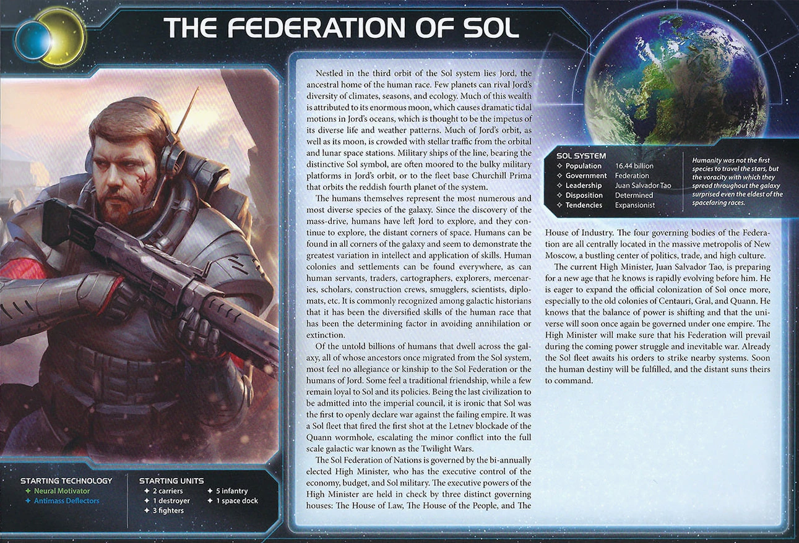

<nav class="page-nav">
<a href="../index.html" class="back-link">Back to Index</a>
<a href="Federation_of_Sol.md" download class="download-link" title="Plain text file - safe to download">Download .md</a>
</nav>

# Federation of Sol Guide

## Contents

1. [Introduction](#i-introduction)
2. [Playstyle](#ii-playstyle)
3. [Faction Info and Drafting](#iii-faction-info-and-drafting)
   - [Home System & Commodities](#a-home-system--commodities) · [Starting Fleet](#b-starting-fleet) · [Faction Abilities](#c-faction-abilities) · [Technologies](#d-starting-and-faction-technologies) · [Leaders](#e-leaders) · [Promissory Note](#f-promissory-note) · [Alliance](#g-alliance) · [Mech](#h-mech---zs-thunderbolt-m2) · [Flagship](#i-flagship---genesis) · [Breakthrough](#j-breakthrough---bellum-gloriosum-yg) · [Slice and Draft](#k-slice-considerations)
4. [Round 1 Problems and Faction Weakness](#iv-round-1-problems-and-faction-weakness)
   - [First Turn Priorities](#a-first-turn-priorities) · [Flavorless / Low Surprise Factor](#b-flavorless--low-surprise-factor)
5. [Technology](#v-technology)
   - [Overview](#a-overview) · [Tech Path](#b-tech-path-standard)
6. [Strategy Cards](#vi-strategy-cards)
   - [Round 1](#a-round-1) · [Round 2+](#b-round-2)
7. [Unit Composition and Game Plan](#vii-unit-composition-and-game-plan)
   - [Unit Composition](#a-unit-composition) · [Game Plan](#b-game-plan)
8. [Objectives](#viii-objectives)
   - [Objective Summary](#a-objective-summary) · [Stage I](#b-stage-i-objectives) · [Secret Objectives](#c-secret-objectives) · [Stage II](#d-stage-ii-objectives)
9. [Alliance Priority](#ix-alliance-priority)
10. [Bonus Game Elements](#x-bonus-game-elements)
    - [Action Cards](#a-high-value-action-cards) · [Relics](#b-relic-priorities) · [Agendas](#c-agenda-awareness)
11. [End Notes](#xi-end-notes)

---

## I. Introduction

Federation of Sol is TI4's vanilla faction—and that's a compliment. No gimmicks, no weird restrictions, just solid fundamentals that let you do anything. Extra command tokens every round, extra action cards, pre-upgraded carriers and infantry. You have the tools to expand, fight, trade, or politic as the game demands.

Sol's flexibility means you can adapt to any board state, any objective spread, any table dynamic. Other factions specialize; you generalize. That makes Sol excellent for learning the game and surprisingly strong at high levels when played by someone who understands how to leverage options.

## II. Playstyle

Sol plays like a well-oiled military machine. You expand steadily, build up production, and overwhelm through sheer numbers rather than tricks. Your extra command tokens let you take more actions than opponents, and your upgraded carriers make expansion cheap and efficient.

You're not flashy—you're consistent. Claim territory early, defend it with your commander's free infantry, and scale into late game where your production and action economy compound into dominance.

Sol rewards fundamental TI4 skills: good expansion, smart token management, and knowing when to fight versus when to build. You don't have a "win button" ability—you win by doing everything slightly better than everyone else.

## III. Faction Info and Drafting

### A. Home System & Commodities

**Home System:** Jord
- 4 resources / 2 influence
- **Total: 4 resources / 2 influence (4 optimal resources / 0 optimal influence)**

**Commodities:** 4

Strong resources at home combined with 4 commodities means excellent early economy. Combined with Versatile's extra command token, you have an incredible economic foundation. Single-planet home system is also nearly impenetrable with Spec Ops defending it.

### B. Starting Fleet
- 2 Carriers
- 1 Destroyer
- 3 Fighters
- 5 Infantry
- 1 Space Dock

Very solid starting fleet. Two capacity ships and 5 infantry lets you solve almost any slice round 1.

### C. Faction Abilities

**Orbital Drop:** Spend 1 token from your strategy pool to place 2 infantry from your reinforcements on 1 planet you control.

Deploy infantry directly to any planet you control without needing carriers. Mid/late game ability—don't use early when you need those strategy tokens. Enables defensive reinforcement and surprise ground combat swings once you have tokens to spare.

**Versatile:** When you gain command tokens during the status phase, gain 1 additional command token.

+1 command token per round. Massive action economy advantage over the course of a game.

**Advanced Carrier I:** Cost 3, Combat 9, Move 1, Capacity 6. Your carriers have +2 capacity over standard carriers.

**Spec Ops I:** Cost 1 (x2), Combat 7. Your infantry hit on 7 instead of 8.

### D. Starting and Faction Technologies

**Starting Technologies:**

- **Neural Motivator :** Draw 2 action cards instead of 1 during status phase. Bonus action cards always nice, part of your flexibility. Sets up Spec Ops II path.
- **Antimass Deflectors :** Move through asteroid fields. -1 to SPACE CANNON rolls against you. Allows for slice diversity, solving most issues. Sets up Advanced Carrier II path.

**Faction Unit Upgrades:**

- **Advanced Carrier II :** Cost 3, Combat 9, Move 2, Capacity 8, Sustain Damage. Takes an already incredible ship (Carrier II) and adds Sustain Damage plus extra capacity. Your carriers become nearly unkillable transports.
- **Spec Ops II :** Cost 1 (x2), Combat 7. On death, 5+ returns to home system. 60% recursion on a d10.

### E. Leaders

**Agent - Evelyn DeLouis:** At the start of a ground combat round, you may exhaust this card to choose 1 ground force in the active system. That ground force rolls 1 additional die during this combat round.

Pretty bad—just a single bonus roll. But you're already difficult to beat on the ground, and ground combat snowballs quickly since engagements are usually small. An extra hit early can make a big difference, and opponents have to account for it.

**Commander - Claire Gibson:**

- **Unlock:** Control planets that have a combined total of at least 12 resources
- **Ability:** At the start of a ground combat on a planet you control, you may place 1 infantry from your reinforcements on that planet.

Same theme—always nice but limited. Only triggers at start of ground combat, so can't defend empty planets or planets that get bombarded out first. Still, free infantry on defense is free infantry.

**Hero - Jace X, 4th Air Legion:**

- **Unlock:** Have 3 scored objectives
- **Helio Command Array:** Remove each of your command tokens from the game board and return them to your reinforcements. Then, purge this card.

Clears all your command tokens from the board, returning them to your pool. Enables late game control plays as long as you have a big token bank saved up.

### F. Promissory Note

**Military Support:** At the start of the Sol player's turn, remove 1 token from the Sol player's strategy pool, if able, and return it to his reinforcements. Then, you may place 2 infantry from your reinforcements on any planet you control. Then, return this card to the Sol player.

Very solid economic tool. Make sure buyers only use it after you've spent your strategy tokens. Always sell for at least 1 TG and try to pawn it as many times as possible once your strategy pool is empty.

### G. Alliance

Your Alliance gives your ally your commander—free infantry when defending ground combat. Simple but solid for factions that struggle on the ground.

Your military reputation lets you trade up for better alliances. Factions scared of your production and infantry swarm will offer their Alliance to stay on your good side—use this leverage to get access to stronger commanders than your own.

### H. Mech - **ZS Thunderbolt M2**

Cost: 2 | Combat: 6 | **Sustain Damage**

**DEPLOY:** After you use your Orbital Drop faction ability, you may spend 3 resources to place 1 mech on that planet.

Not a great mech. The deploy ability costs 3 resources on top of Orbital Drop's strategy token—expensive for what you get. Only use in emergency cases. Maybe build a few to complement your strong Spec Ops, but with Breakthrough you can produce so many infantry for a way cheaper cost—mechs become even less useful.

### I. Flagship - **Genesis**

Cost: 8 | Combat: 5 (x2) | Move: 1 | Capacity: 12 | **Sustain Damage**

At the end of the status phase, place 1 infantry from your reinforcements in this system's space area.

Crazy ship. Full fighting power with 2 dice at combat 5, massive 12 capacity, and free infantry every round. Can be sling relayed to drop another 12 infantry or fighters wherever needed. Should be the cornerstone of your already incredible armada of super carriers.

Note: If you have weak/damaged carriers on the frontline, move them back to a space dock—with Breakthrough you get bonus production when building new carriers.

### J. Breakthrough - **Bellum Gloriosum (Y↔G)**

When you produce a ship that has capacity, you may also produce any combination of ground forces or fighters up to that ship's capacity. They do not count against your PRODUCTION limit.

**Y↔G Synergy:** Yellow and green technologies count as each other for prerequisites.

Absurd production. Produce a carrier and get infantry/fighters up to its capacity without counting against production. Enables massive army building in one activation. The Y↔G synergy isn't useful unless you want Dreadnought II.

### K. Slice Considerations

**Speaker Priority:** Handles anything, but extra good with an early pick—taking the best slice makes the game harder for others while you thrive regardless. Always nice to have some target planets in equidistants from neighbors for early expansion pressure.

Slice priority isn't really a thing for Sol—you handle anything.

**Prefer:**

- Slight resource bias (Versatile and incredibly efficient production)
- Access to Mecatol
- Tech skips for Breakthrough
- Top objectives in reach
- Can prioritize 4 planets of one trait or 6 planet objectives since any slice layout works for you
- Entropic very strong for tech tempo

**Avoid:**

- Things blocking Mecatol access

## IV. Round 1 Problems and Faction Weakness

### A. First Turn Priorities

Sol has no real Round 1 problems—your starting fleet solves any slice, and your flexibility means you adapt to whatever objectives appear.

**Round 1 Priority Rankings:**

1. **Breakthrough** - Bellum Gloriosum is incredible for Sol. Produce infantry/fighters up to carrier capacity without counting against production limit—absurd army building.

2. **Scoring** - You can score most Round 1 objectives without issue.

3. **Technology** - Grab a tech if you can, sets up your faction tech paths.

4. **Expansion + Production** - Two carriers with 5 infantry handles any slice. Take what you need and build more carriers.

**Expansion Notes:** Split your carriers to take 2 systems. Your 5 infantry lets you garrison multiple planets solidly. Produce more carriers off secondary Warfare if possible—each carrier is only 3 resources. Your flexibility means any expansion pattern and movement works.

### B. Flavorless / Low Surprise Factor

Sol doesn't have real weaknesses—that's the point of a vanilla faction. You have solid starting tech, solid starting fleet, extra command tokens, upgraded infantry, upgraded carriers, and flexibility to do anything.

The tradeoff is you're predictable. Everyone knows what Sol does—expand, produce, overwhelm. No tricks, no surprises, no "gotcha" moments. Other factions have crippling weaknesses but also game-warping abilities. Sol just plays TI4. Your "weakness" is that you don't have a broken ability that wins games by itself—you win through fundamentals.

## V. Technology

### A. Overview

You start with **Neural Motivator (Green)** and **Antimass Deflectors (Blue)**.

Tech path is easy for Sol. Rush Gravity Drive for mobility, Sling Relay for repositioning, then Advanced Carrier II for your incredible super carriers. Flex into whatever the game demands after that.

### B. Tech Path (Standard)

**Starting Tech:** Neural Motivator, Antimass Deflectors

**Round 1: Gravity Drive **
- After you activate a system, apply +1 to the move value of 1 of your ships during this tactical action.
- **Why:** 2-movement carriers. Essential for Sol's expansion and reach.

**Round 2: Sling Relay **
- ACTION: Exhaust this card to produce 1 ship in any system that contains 1 of your space docks.
- **Why:** Reposition carriers across the map. Combined with your production, this is huge.

**Round 3: Advanced Carrier II **
- Cost 3, Combat 9, Move 2, Capacity 8, Sustain Damage.
- **Why:** Your faction tech. Makes an already incredible ship even better with Sustain Damage and 8 capacity.

**Flex Techs (Round 4/5):**

- **Bio-Stims :** Ready a tech specialty planet or another technology at end of turn. Double Sling Relay use.
- **Fleet Logistics :** Perform 2 actions per turn instead of 1. Sneaky late game plays.
- **Fighter II :** Combat 8, Move 2. Fighters can move independently. You produce so many anyway.
- **Light/Wave Deflector :** Your ships can move through systems with other players' ships. Control plays and blocking people.
- **Dreadnought II :** Cost 4, Combat 5, Move 2, Capacity 1, Sustain Damage, Bombardment 5. If you need fleet mobility and have too many resources.

## VI. Strategy Cards

### A. Round 1

Your R1 priority is maximizing expansion and establishing production base. Early resources help unlock Breakthrough.

**Round 1 Priority Ranking:**

1. **Trade** - 4 commodities for early resources. Easy Breakthrough unlock with the TGs.

2. **Technology** - Early resources and get Gravity Drive. Accelerates your carrier swarm.

3. **Leadership** - Early resources and easy Breakthrough unlock.

4. **Politics** - Early resources, action cards, selling speaker. Easy Breakthrough unlock.

5. **Diplomacy** - Extra resources R1 and not missing tech secondary.

6. **Construction** - Production secondary helpful if Warfare isn't picked.

7. **Warfare** - Fleet token return is valuable but you expand fine without it.

8. **Imperial** - Never R1.

**Strategy Token Priority:** Trade and Warfare secondaries are your priority follows.

### B. Round 2+

**Love:**

- **Imperial** - Score objectives. You'll have Mecatol plays available late game.
- **Leadership** - 3 command tokens + Versatile gives you 4 total. Essential for sustained expansion.
- **Trade** - Massive production needs massive economy. Refresh 4 commodities.

**Good:**

- **Technology** - One tech per round is fine.
- **Politics** - Action cards and selling speaker. Setting up scoring.

**Situational:**

- **Warfare** - Fleet mobility for aggressive plays.
- **Construction** - Additional space docks if needed.
- **Diplomacy** - Defensive use only. Can protect key planets.

## VII. Unit Composition and Game Plan

### A. Unit Composition

Your ideal fleet composition in each system:

- **Carriers (Advanced Carrier II)** - Your core unit. Cost 3, Combat 9, Move 2, Capacity 8, Sustain Damage. Build more carriers than any other faction. The Sustain Damage makes them incredibly hard to kill—opponents need to chew through your carriers before reaching anything else.
- **Infantry (Spec Ops)** - Hit on 7 instead of 8. Your bread and butter. With Breakthrough, every carrier you produce can bring infantry for free (not counting against production). Overwhelm opponents with sheer numbers.
- **Fighters** - Cheap screening and combat dice. You produce so many with Breakthrough anyway. Protect your carriers and add space combat power.
- **Flagship (Genesis)** - Cost 8, Combat 5 (x2), Move 1, Capacity 12, Sustain Damage. Free infantry every status phase. Cornerstone of your late game armada. Can be sling relayed to drop 12 units wherever needed.

**Lower Priority:**

- **Dreadnoughts** - Only if you have excess resources and want fleet mobility with Dreadnought II. Your carriers already have Sustain Damage so dreads add less value than for other factions.
- **Mechs** - Emergency only. With Breakthrough you produce infantry so cheaply that mechs aren't worth the cost. The Deploy ability is overpriced.

**Fleet Focus:** Carrier swarm with Genesis flagship. Your Advanced Carrier II with Sustain Damage is one of the best ships in the game. Stack multiple carriers with infantry and fighters, protected by Sustain Damage, and overwhelm through numbers.

### B. Game Plan

**Early Game (Rounds 1-2):**

Expand and get custodian. Your starting fleet solves any slice—split carriers and take what you need. Focus on getting Gravity Drive and setting up for Breakthrough unlock. Build carriers and expand aggressively.

**Mid Game (Rounds 3-4):**

Decide on your target. You have three main options:

1. **Fracture** - Go for legendary planets and relics. Your carrier mobility and infantry numbers make you excellent at taking and holding Fracture systems.

2. **Mecatol Rex** - Grab it or defend it if you already have it. Your commander gives free infantry on defense, making you incredibly hard to dislodge. Orbital Drop can reinforce instantly.

3. **Pick a Neighbor** - Extract value from a weak neighbor. Your carrier swarm and Spec Ops can pressure opponents into deals or take their planets outright.

**Late Game (Rounds 5+):**

Custodian and score actively—you can win from behind. Your hero (Jace X) clears all command tokens from the board for one massive multi-front assault round—use this to secure final objectives or eliminate threats. By now you should have Advanced Carrier II with Sustain Damage and Breakthrough production online. Overwhelm through numbers.

## VIII. Objectives

### A. Objective Summary

**Strengths:** Almost everything is moderate or easy for Sol. Your flexibility, carrier mobility, and infantry numbers mean you can adapt to whatever objectives appear. Spendies, control, ships in systems, combat—all accessible.

**Weaknesses:** Structure objectives are harder (you're not building PDS networks). Certain tech objectives can be tricky depending on your path. Stage II control objectives (6 same trait, 11 planets) require significant commitment.

### B. Stage I Objectives

| Stage I Objective                                                       | Status |
|-------------------------------------------------------------------------|--------|
| **Spendies** |
| Erect a Monument (Spend 8 resources)                                    | 🟢     |
| Sway the Council (Spend 8 influence)                                    | 🟡     |
| Negotiate Trade Routes (Spend 5 trade goods)                            | 🟢     |
| Lead from the Front (Spend 3 tokens from tactic/strategy pools)         | 🟢     |
| Amass Wealth (Spend 3 influence, 3 resources, 3 trade goods)            | 🟢     |
| **Control** |
| Expand Borders (Control 6 planets in non-home systems)                  | 🟢     |
| Corner the Market (Control 4 planets with same trait)                   | 🟡     |
| Found Research Outposts (Control 3 planets with tech specialties)       | 🔴     |
| Discover Lost Outposts (Control 2 planets with attachments)             | 🔴     |
| Push Boundaries (Control more planets than each neighbor)               | 🟢     |
| **Ships in Systems** |
| Intimidate the Council (Ships in 2 systems adjacent to MR)              | 🟢     |
| Explore Deep Space (Units in 3 systems without planets)                 | 🟢     |
| Make History (Units in 2 systems with legendary/MR/anomalies)           | 🟢     |
| Populate the Outer Rim (Units in 3 edge systems)                        | 🟢     |
| Raise a Fleet (5+ non-fighter ships in 1 system)                        | 🟢     |
| Engineer a Marvel (Have flagship or war sun on board)                   | 🟢     |
| **Tech** |
| Diversify Research (Own 2 tech in each of 2 colors)                     | 🟢     |
| Develop Weaponry (Own 2 unit upgrade technologies)                      | 🟢     |
| **Structure** |
| Build Defenses (Have 4 or more structures)                              | 🔴     |
| Improve Infrastructure (Structures on 3 planets outside HS)             | 🔴     |

**Legend:** 🟢 Likely | 🟡 Possible | 🔴 Difficult

### C. Secret Objectives

| Secret Objective                                                         | Status |
|--------------------------------------------------------------------------|--------|
| **Combat** |
| Unveil Flagship (Win space combat with flagship)                         | 🟢     |
| Destroy their Greatest Ship (Destroy war sun/flagship)                   | 🟢     |
| Spark a Rebellion (Win combat vs VP leader)                              | 🟢     |
| Betray a Friend (Win combat vs player whose PN you have)                | 🟢     |
| Brave the Void (Win combat in anomaly)                                  | 🟢     |
| Darken the Skies (Win combat in another player's HS)                    | 🟢     |
| Demonstrate your Power (3+ non-fighter ships after space combat)        | 🟢     |
| Turn their Fleets to Dust (SPACE CANNON destroy last ship)              | 🔴     |
| Make an Example (BOMBARDMENT destroy last ground forces)                | 🟡     |
| Fight With Precision (AFB destroy last fighter)                         | 🟡     |
| **Ships in Systems** |
| Threaten Enemies (Ships adjacent to another player's HS)                | 🟢     |
| Cut Supply Lines (Ships in system with enemy space dock)                | 🟢     |
| Defy Space and Time (Units in wormhole nexus)                           | 🟢     |
| Become the Gatekeeper (Ships in alpha and beta wormhole systems)        | 🟢     |
| Learn Secrets of the Cosmos (Ships in 3 systems adjacent to anomalies)  | 🟢     |
| Control the Region (Ships in 6 systems)                                 | 🟢     |
| Occupy the Seat of the Empire (Control MR with 3+ ships)                | 🟢     |
| **Control** |
| Monopolize Production (Control 4 industrial planets)                     | 🔴     |
| Mine Rare Minerals (Control 4 hazardous planets)                        | 🔴     |
| Forge an Alliance (Control 4 cultural planets)                          | 🔴     |
| Establish Hegemony (Control planets with 12+ influence)                 | 🟡     |
| Hoard Raw Materials (Control planets with 12+ resources)                | 🟢     |
| Seize an Icon (Control legendary planet)                                | 🟢     |
| Stake Your Claim (Control planet in contested system)                   | 🟢     |
| Become a Martyr (Lose control of planet in home system)                 | 🔴     |
| **Tech** |
| Adapt New Strategies (Own 2 faction technologies)                       | 🟢     |
| Master the Laws of Physics (Own 4 tech of same color)                   | 🟢     |
| **Structure/Units** |
| Establish a Perimeter (Have 4 PDS on board)                             | 🔴     |
| Fuel the War Machine (Have 3 space docks)                               | 🟢     |
| Gather a Mighty Fleet (Have 5 dreadnoughts)                             | 🔴     |
| Mechanize the Military (1 mech on each of 4 planets)                    | 🟡     |
| Occupy the Fringe (9+ ground forces on planet without space dock)       | 🟢     |
| Produce en Masse (Units with PRODUCTION 8+ in single system)            | 🔴     |
| **Other** |
| Dictate Policy (3+ laws in play)                                        | 🔴     |
| Drive the Debate (You/your planet elected by agenda)                    | 🔴     |
| Destroy Heretical Works (Purge 2 relic fragments)                       | 🔴     |
| Form a Spy Network (Discard 5 action cards)                             | 🟢     |
| Foster Cohesion (Be neighbors with all players)                         | 🟢     |
| Strengthen Bonds (Have another player's PN)                             | 🟢     |
| Prove Endurance (Last to pass)                                          | 🟢     |

**Legend:** 🟢 Likely | 🟡 Possible | 🔴 Difficult

### D. Stage II Objectives

| Stage II Objective                                                       | Status |
|--------------------------------------------------------------------------|--------|
| **Spendies** |
| Centralize Galactic Trade (Spend 10 trade goods)                         | 🟢     |
| Found a Golden Age (Spend 16 resources)                                  | 🟢     |
| Galvanize the People (Spend 6 tokens from tactic/strategy pools)         | 🟢     |
| Manipulate Galactic Law (Spend 16 influence)                             | 🟡     |
| Hold Vast Reserves (Spend 6 influence, 6 resources, 6 trade goods)       | 🟢     |
| **Control** |
| Conquer the Weak (Control 1 planet in another player's HS)               | 🟢     |
| Rule Distant Lands (Control 2 planets in/adjacent to different players' HS) | 🟢     |
| Subdue the Galaxy (Control 11 planets in non-home systems)               | 🔴     |
| Unify the Colonies (Control 6 planets with same trait)                   | 🔴     |
| Reclaim Ancient Monuments (Control 3 planets with attachments)           | 🔴     |
| Form Galactic Brain Trust (Control 5 planets with tech specialties)      | 🔴     |
| **Ships in Systems** |
| Command an Armada (Have 8+ non-fighter ships in 1 system)                | 🟢     |
| Achieve Supremacy (Flagship/War Sun in another player's HS or MR)        | 🟢     |
| Become a Legend (Units in 4 systems with legendary/MR/anomalies)         | 🟢     |
| Patrol Vast Territories (Units in 5 systems without planets)             | 🟢     |
| Control the Borderlands (Units in 5 edge systems not HS)                 | 🟢     |
| **Tech** |
| Master of Sciences (Own 2 techs in each of 4 colors)                     | 🔴     |
| Revolutionize Warfare (Own 3 unit upgrade technologies)                  | 🟢     |
| **Structure** |
| Construct Massive Cities (Have 7+ structures)                            | 🔴     |
| Protect the Border (Structures on 5 planets outside HS)                  | 🔴     |

**Legend:** 🟢 Likely | 🟡 Possible | 🔴 Difficult

## IX. Alliance Priority

Trading for other factions' Alliance promissory notes grants you access to their commanders, potentially boosting your strategy significantly. Your military reputation lets you trade up for better alliances.

**Top Tier:**

1. **Nomad (Navarch Feng)** – Produce flagship without spending resources. Crazy combo with Genesis and Sling Relay—free flagship production then sling it across the map with 12 capacity.

2. **Crimson Rebellion (Ahk Siever)** – At end of combat, gain commodity/TG. You fight constantly—this adds up fast.

3. **Deepwrought (Aello)** – When others research tech, gain commodity/TG if they take -1 discount. Passive TG income.

4. **Muaat (Magmus)** – Gain 1 TG after spending strategy token. Synergizes with your high activation count.

5. **Barony of Letnev (Rear Admiral Farran)** – After unit uses Sustain Damage, gain 1 TG. Incredible value with Advanced Carrier II sustains.

**Good:**

6. **Winnu (Rickar Rickani)** – Apply +2 combat in MR, home system, and legendary planet systems. Helps your weak space combat.

7. **Empyrean (Xuange)** – Return command token when opponents move into systems with your tokens. Late game value with your spread-out presence.

8. **Naaz-Rokha (Dart and Tai)** – After you gain control of planet from another player, explore that planet. Extra value from conquests.

9. **Mentak Coalition (S'ula Mentarion)** – Force opponent to give PN after winning space combat. Steal promissory notes from your conquests.

10. **Firmament Obsidian** – Firmament treats planets in systems with ships as controlled for scoring secrets (your carrier swarm is everywhere). Obsidian gives +1 combat in The Fracture for late game Styx plays.

## X. Bonus Game Elements

This section highlights action cards that synergize particularly well with your faction's strengths or mitigate your weaknesses, relics that offer exceptional value for your faction's strategy and abilities, and agendas to pursue that benefit your position, and agendas to watch out for that could hurt you.

### A. High-Value Action Cards

### B. Relic Priorities

### C. Agenda Awareness

---

## XI. End Notes

Federation of Sol is the faction for players who want to master TI4 fundamentals. No gimmicks, no flashy combos—just carriers, infantry, and more activations than anyone can handle.

Your strength is flexibility. Any objective pool works. Any slice works. Any neighbor works. While other factions hunt for their combo pieces, you're already scoring.

When you nail Sol, the game feels simple. You spread, you produce, you score. Opponents are still setting up their engines when you're already at full capacity. The galaxy belongs to whoever shows up with more boots on the ground and ships in the sky.

Federation of Sol doesn't win through tricks—they win through showing up.

**UNITY. RESOLVE. EXPANSION.**
