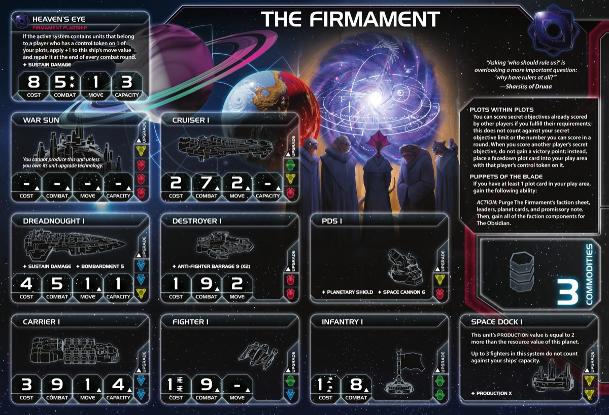

<nav class="page-nav">
<a href="../index.html" class="back-link">Back to Index</a>
<a href="Firmament_Obsidian.md" download class="download-link" title="Plain text file - safe to download">Download .md</a>
</nav>

# Firmament Obsidian Guide

## Contents

1. [Introduction](#i-introduction)
2. [Playstyle](#ii-playstyle)
3. [Faction Info and Drafting](#iii-faction-info-and-drafting)
   - [Home System & Commodities](#a-home-system--commodities) · [Starting Fleet](#b-starting-fleet) · [Faction Abilities](#c-faction-abilities) · [Technologies](#d-starting-and-faction-technologies) · [Leaders](#e-leaders) · [Promissory Note](#f-promissory-note) · [Alliance](#g-alliance) · [Mech](#h-mech) · [Flagship](#i-flagship) · [Breakthrough](#j-breakthrough) · [Slice and Draft](#k-slice-and-draft-considerations)
4. [Round 1 Problems and Faction Weakness](#iv-round-1-problems-and-faction-weakness)
   - [First Turn Priorities](#a-first-turn-priorities)
5. [Technology](#v-technology)
   - [Starting Technologies](#a-starting-technologies) · [Technology Paths](#b-technology-paths) · [Key Technologies](#c-key-technologies)
6. [Strategy Cards](#vi-strategy-cards)
   - [Round 1](#a-round-1-as-the-firmament) · [Round 2+](#b-round-2)
7. [Unit Composition and Game Plan](#vii-unit-composition-and-game-plan)
   - [Unit Composition](#a-unit-composition) · [Game Plan](#b-game-plan)
8. [Objectives](#viii-objectives)
   - [Objective Summary](#a-objective-summary) · [Stage I](#b-stage-i-objectives) · [Secret Objectives](#c-secret-objectives) · [Stage II](#d-stage-ii-objectives)
9. [Alliance Priority](#ix-alliance-priority)
10. [Bonus Game Elements](#x-bonus-game-elements)
    - [Action Cards](#a-high-value-action-cards) · [Relics](#b-relic-priorities) · [Agendas](#c-agenda-awareness)
11. [End Notes](#xi-end-notes)

---

## I. Introduction

The Firmament / The Obsidian are Twilight Imperium's dual-faction transformation powerhouse—the only faction that fundamentally changes identity mid-game. You begin as The Firmament, a shadow manipulator that scores other players' secret objectives, collecting plot cards instead of points.

When you transform into The Obsidian, everything changes. Your home system doubles its resources, all plots activate against puppeted players, and your faction upgrades to aggressive versions. No other faction plays two completely different games in sequence.

---

## II. Playstyle

Playing Firmament Obsidian is like being a sleeper agent who becomes the assassin. You spend the early game as a diplomat, appearing weak on the scoreboard while quietly accumulating power through deals and positioning. Then you transform, your home system doubles its resources, all your plots activate simultaneously, and you become a military juggernaut.

The Firmament phase is heavily diplomatic. You're not fighting—you're positioning to score secrets that opponents have already scored, gaining facedown plot cards instead of victory points. Trade your Black Ops promissory note for favors. Make deals for board position. Stay friendly with everyone while puppeting them one by one. Your commander unlocks easily, letting you treat systems with your ships as controlled for scoring purposes.

The key decision is transformation timing. Transform too early and you're a weak Obsidian. Transform too late and you can't score enough points to win. Balance plot accumulation against remaining game time.

The Obsidian phase requires aggression. You're likely behind on points, so you can't be passive—you need to stop leaders and extend the game while you catch up. Your home planets double their resources. All plots reveal and activate against your puppeted targets. Your flagship, agent, and breakthrough all upgrade to combat-focused versions. Use your resource advantage to field strong fleets and threaten the opponents you've been quietly setting up.

Opponents won't see it coming. You looked friendly, made deals, fell behind on points. Then you transform, and suddenly you're targeting them with stacked combat abilities. The shadow becomes the blade.

---

## III. Faction Info and Drafting

### A. Home System & Commodities

**Home System (Firmament):**

- **Cronos:** 2 resources / 1 influence
- **Tallin:** 1 resource / 2 influence
- **Total: 3 resources / 3 influence (2 optimal resources / 2 optimal influence)**

**Notes:** Weak home system. Low production, no 4-resource planet for tech, and no reasonable way to spend your 2/1 for a token early. You're in a tough spot economically and need to be very efficient with spending to avoid falling behind.

**Commodities:** 3

**Home System (Obsidian - After Transformation):**

- **Cronos Hollow:** 3 resources / 0 influence
- **Tallin Hollow:** 3 resources / 0 influence
- **Total: 6 resources / 0 influence (6 optimal resources / 0 optimal influence)**

**Notes:** Production powerhouse. With 2 docks you get 10 production, solid resources for a big fleet, and solid defenses. The Blade's Orchestra readies your hollow planets upon transformation, giving you 6 fresh resources immediately. Zero influence means you're dependent on conquered planets for influence.

### B. Starting Fleet

- 1 Carrier
- 1 Cruiser
- 1 Destroyer
- 3 Fighters
- 3 Infantry
- 1 Space Dock

**Notes:** Plenty of problems. Cruiser and destroyer might find some value for exploration, but very weak starting fleet overall. Only 1 space dock, only 3 infantry—as if you didn't have enough problems to deal with from your home system.

### C. Faction Abilities

**Plots within Plots (Firmament):** *You can score secret objectives already scored by other players if you fulfill their requirements; this does not count against your secret objective limit or the number you can score in a round. When you score another player's secret objective, do not gain a victory point; instead, place a facedown plot card into your play area with that player's control token on it.*

Your core mechanic and the key to your entire game. You need to find the right targets, make deals for people to score scoreable secrets, and use every diplomatic tool you have—your strong promissory note, votes, favors, whatever it takes. You need as many plots as possible before you flip. Doesn't count against your secret limit, so you can score your own secret plus multiple opponent secrets in one round.

**Puppets of the Blade (Firmament):** *If you have at least 1 plot card in your play area, gain the following ability: ACTION: Purge The Firmament's faction sheet, leaders, planet cards, and promissory note. Then, gain all of the faction components for The Obsidian.*

Your transformation ability. Aim for Round 3—middle of the road, not too early, not too late. You need to play more Obsidian than Firmament if you want a chance at winning. Requires at least 1 plot and costs a full action. Purges all Firmament components permanently and gains all Obsidian components. Irreversible.

**Nocturne (Obsidian):** *This faction cannot be chosen during setup.*

The Obsidian cannot be selected at game start. Only appears through Firmament transformation.

**The Blade's Orchestra (Obsidian):** *When this faction comes into play, flip your home system, double-sided faction components, and all of your in-play plot cards. Then, ready Cronos Hollow and Tallin Hollow if you control them.*

Triggers when you transform. The planet readying is huge—6 fresh resources to push past your weak early game. Flips all plot cards from facedown to revealed, getting them online against your targets. This is what makes the faction click.

**Marionettes (Both):** *The player or players whose control tokens are on each plot card are the puppeted players for that plot.*

Defines who is "puppeted" for plot abilities. Each plot targets the player whose secret you scored. You can have multiple plots targeting the same player.

**Plot Cards:**

Plots are drawn randomly when you score opponent secrets. Each has facedown and revealed abilities:

- **Extract:** Copy technologies from puppeted player. Target if they have key tech you need and are likely to keep teching late into the game based on faction and game state.

- **Siphon:** Gain trade goods when puppeted player gains commodities. Target rich factions with high commodity counts or mechanics that continuously give them commodities (commonly commanders).

- **Enervate:** Free strategy card secondaries from puppeted player's picks. Solid overall and helps your low Obsidian influence count. Works to get Leadership primary which is huge. Downside is you can't pick their strategy cards.

- **Assail:** +1 combat against puppeted player. Target if you really need to fight someone or had previous disagreements during the Firmament stage.

- **Seethe:** Destroy puppeted player's units. Target if there's a massively juicy target and their fleet will be too strong anyway—use to protect your planets.

Pick Assail and Seethe cautiously—targeting a previously friendly neighbor will cause annoyance.

### D. Starting and Faction Technologies

**Starting Technology:**

**Choose ONE Green or Yellow Technology with No Prerequisites.** Sarween Tools is highly recommended—you need the efficiency given your weak start. The other options (Scanlink, Neural Motivator, Psychoarchaeology) are too slow or give you nothing useful.

**Faction Technologies:**

You cannot research faction techs as Obsidian—research them as Firmament and they flip when you transform.

**Planesplitter (YY) / Planesplitter (0):**
- *Firmament:* When you gain this card, put The Fracture into play.
- *Obsidian:* Same effect, but 0 prerequisites.

Sounds good and would combo with your commander, but most likely you're just helping more mobile factions if it's not already in play. You'll be too slow to grab the value.

**Neural Parasite (GG) / Neural Parasite (0):**
- *Firmament:* At the start of the status phase, place 1 infantry on a home planet.
- *Obsidian:* At the start of your turn, destroy 1 enemy infantry in or adjacent to a system with your infantry.

As Firmament, generates free infantry for invasions and scoring ground-based secrets. As Obsidian, valuable for crippling a neighbor's invasion ability—people usually don't have more than a couple infantry per planet, so you can pretty much empty every planet nearby. But it's an opportunity cost—if it means you're not scoring a plot as Firmament, is it really worth it?

### E. Leaders

**Firmament Leaders:**

**Agent - Myru Vos:** *When a player moves ships: You may exhaust this card; if you do, SPACE CANNON cannot be used against those ships. If they are not transporting units, they can also move through other players' ships.*

Made for scoring control secret objectives—move ships into systems without triggering space cannon or blocking. Combos with your commander to get ships safely into systems for secret scoring. Also use to help neighbors score control secrets so you can score them too via Plots within Plots.

**Commander - Captain Aroz:**

- **Unlock:** Have a plot card in play
- **Ability:** You may treat planets in systems that contain your ships as if you controlled them for the purpose of scoring secret objectives.

Easy unlock—commonly done by trading your PN for a free plot. Try to get it unlocked ASAP. Lets you score ground-based secrets without actually controlling the planets. Dramatically easier to score opponent secrets.

**Hero - Sharsiss:**

- **Unlock:** Have 3 scored objectives
- **The blade beckons:** Place 1 of your plot cards in play with any other player's control token on it. Then, you may place any player's control token on 1 of your in-play plot cards.

Should be unlocked by status phase 2 if you can help it. Important: scoring plots counts towards the 3 objectives unlock, which helps a lot. Gain a free plot targeting any player—even if you couldn't score their secret. Can also reassign existing plots to different players. Use to target players you couldn't puppet otherwise.

**Obsidian Leaders:**

**Agent - Vos Hollow:** *When a player's ship is destroyed during any combat: You may exhaust this card; if you do, that player's opponent must destroy 1 of their ships of the same type in the active system.*

Works better vs bigger ships, but getting an extra ship out early in combat is also impactful.

**Commander - Aroz Hollow:**

- **Unlock:** Have units in The Fracture
- **Ability:** Apply +1 to the result of each of your units' combat rolls in The Fracture.

Very easy unlock but the bonus is not too impactful—someone will have taken the relics and gummed up The Fracture. Maybe an opportunity to grab Styx somehow, but otherwise just a small situational bonus.

**Hero - Sharsiss Hollow:**

- **Unlock:** Have 3 scored objectives
- **The blade revealed:** Ready all of your planets.

Actually slightly less impactful than it sounds, but if you have systems with both influence and resources it can be worth getting extra tokens the turn you plan to use it. Probably most useful in round 4 for a big swing of plastic, help solve spending objectives, and be setup to scrap.

### F. Promissory Note

**Black Ops (Firmament):** When you receive this card, if you are not the Firmament: The Firmament player may place 1 facedown plot card in their play area with your control token on it. Then, gain 2 command tokens, gain 2 trade goods, and purge this card.

People know you're weak, so ask to get the 2TG back from the deal and offer to place their token on a "friendly plot"—they get no real downside and a great head start on token economy. Trade early for commander unlock.

**Malevolency (Obsidian):** At the end of one of your tactical actions: Spend 1 influence to give this card to one of your neighbors. At the end of the status phase, if you are not the Obsidian player, remove 1 command token from your fleet pool.

Great vs some factions, not so great vs others. Key thing: they can only send it back after a tactical action, so you can target anyone who has passed. Feels extra annoying if they're already a poor faction—if someone is in a strong position but poor and has spent their TG, this is a great way to twist the knife.

### G. Alliance

**Alliance Ability (Firmament):** Your ally gains Plots within Plots—they can score opponent secrets for plots instead of victory points.

Try to sell this to someone willing to get help scoring their secret by round 2 latest. People usually don't want to project strength by asking for help, so you have to get lucky with which secrets they have and how hard they feel it will be.

**Alliance Ability (Obsidian):** Your ally gains Aroz Hollow—apply +1 to the result of each of their units' combat rolls in The Fracture.

Probably more sought after but not interesting—more of a diplomatic tool than having great sales value.

### H. Mech

**Viper Ex-23 (Firmament):** Cost 2, Combat 6, Sustain Damage. When ground forces are committed to this planet, you may choose for your units to coexist.

Defensive stalling tactic—coexistence means both players' ground forces exist on planet without fighting and neither controls it. Use to avoid losing public objectives, secrets, or plots.

**Viper Ex-23 (Obsidian):** Cost 2, Combat 6, Sustain Damage. If this unit was coexisting when this card flipped, gain control of its planet; the other player's units are now coexisting.

Extremely situational. You have to build early mechs, get them into coexistence state, and then transform at the right time. If that's not the case, you have no special ability—lackluster.

### I. Flagship

**Heaven's Eye (Firmament):** Cost 8, Combat 5 (x2), Move 1, Capacity 3, Sustain Damage. If the active system contains units from a puppeted player, apply +1 to move and repair at end of every combat round.

Rare to have early, but incredibly versatile. Strong combat numbers, self-repair, and 2 move vs puppeted players. Crazy strong when targeting puppeted neighbors—which is most likely who you're fighting anyway.

**Heaven's Hollow (Obsidian):** Cost 8, Combat 5 (x3), Move 1, Capacity 3, Sustain Damage.

Strong battle values, especially for extended battles with that third die. But losing the 2 movement and self-repair versatility is a real cost—slight downgrade overall.

### J. Breakthrough - **The Sowing / The Reaping (Y↔G)**

**The Sowing (Firmament):** At status phase, place up to 3 trade goods on this card.

Getting breakthrough at the cost of not scoring plots and falling behind in scoring tempo is probably not worth it. The Sowing gives you literally nothing before you flip—hard sell for a faction with a weak start. If you can get it without paying that opportunity cost, it's nice to have.

**The Reaping (Obsidian):** Gain 1 trade good on this card each time you win combat vs puppeted player. At status phase, gain all trade goods on card, then double them.

Very nice and will pay big if you're in a few combats. But your Obsidian economic engine (6-resource home) should be solid enough that you won't miss this if you decided to get an extra plot instead of unlocking breakthrough.

### K. Slice and Draft Considerations

**Speaker Order:** Unlocking breakthrough isn't key, so speaker position matters less for that—but getting a premium round 1 strategy card and a strong slice should happen every time you play Firmament. For neighbors, try to get people willing to deal with you early who won't just grab a chunk of your slice while you're puny Firmament.

**Slice Priorities:**

- **Easy expansion** - No special techs like Antimass required.
- **Balanced and rich** - You need resources and influence.
- **Scoreable secrets** - Planet composition doesn't matter a ton, but making secrets scoreable is a priority.

**Nice to Have:**

- Tech skips to help skip into better tech early.
- Combat planets like Hope's End or Primor—makes a big difference.

**Avoid:**

- The usual weird stuff in the middle of your slice (supernova, gravity rift, asteroid field).

---

## IV. Round 1 Problems and Faction Weakness

### A. First Turn Priorities

**Round 1 Priority Rankings:**

1. **Scoring** - Trade your PN for a plot and commander unlock. Deal for secrets to be scored ASAP so you have a chance to plan around them. Your hero needs to be unlocked before round 3.

2. **Expansion and Production** - Key priority. You start weak—if you spend too much on tech you'll be an easy target. Expand to 2-3 systems and build plastic to not look inviting.

3. **Technology** - Nice to have and you'll feel miserable if you don't get any as Firmament, but you have mechanics to catch up later. If teching screws your early game, just don't.

4. **Breakthrough** - Same deal. Only easy and cheap unlocks—this does zero for you early when you need the most juice.

**Expansion Notes:** 1 carrier, 1 cruiser, 1 destroyer, 3 infantry. Try to build a carrier. Send carrier to nearby systems, use cruiser/destroyer for exploration. Weak start—be efficient.

### B. Faction Weaknesses

**Weak Start, Lots to Do:** You start weak exactly when you need to do the most to build up strength for later. A lot has to go right during Firmament phase.

**No Magic Catchup Tricks:** As the Obsidian, no great catchup mechanics—since you're a bit flexible and will likely receive techs from one of your plots. When playing from behind (which you likely will be), you have to use brute force—troop strength and a strong economic engine. No shortcuts.

---

## V. Technology

### A. Overview

**Starting Tech:** Choose from green/yellow with no prereqs.

- **Sarween Tools** for Path 1 (Mobility Safe Path) - covers yellow prereq for Dreadnought II.
- **Neural Motivator** for Path 2 (Ground Dominance Spicy Path) - starts green for faction tech and X-89.

You're flexible but limited by opportunity cost. Focus on plots over tech during Firmament phase. Path 1 is safe and doesn't require breakthrough. Path 2 requires breakthrough unlocked for the Y↔G synergy.

Always look for what you're missing via Extract plots. If you're in Path 1 (blue mobility, unit upgrades), look for combat power—Assault Cannon, Duranium Armor, Integrated Economy, X-89. If you're in Path 2 (slow ground dominance), look for blue mobility and unit upgrades—Gravity Drive, Carrier II, Dreadnought II, Fleet Logistics.

### B. Technology Paths

**Path 1: Mobility Safe Path (Recommended)**

**Round 1:** Dark Energy Tap
- After you perform a tactical action in a system that contains a frontier token, if you have 1 or more ships in that system, explore that token. Your ships can retreat into adjacent systems that do not contain other players' units.
- **Why:** Explore frontier tokens, retreat flexibility.

**Round 2:** Gravity Drive (B)
- After you activate a system, apply +1 to the move value of 1 of your ships during this tactical action.
- **Why:** Mobility to reach secrets and position for plots.

**Round 3:** Carrier II (BB)
- Cost 3, Combat 9, Move 2, Capacity 6.
- **Why:** Fleet mobility and transport capacity.

**Round 4:** Dreadnought II (BBY)
- Cost 4, Combat 5, Move 2, Capacity 1, Sustain Damage, BOMBARDMENT 5. Cannot be destroyed by Direct Hit.
- **Why:** Move 2 dreads are your Obsidian backbone. Sarween start covers yellow prereq.

**Round 5:** Fleet Logistics (BB)
- During each of your turns of the action phase, you may perform 2 actions instead of 1.
- **Why:** Late game power spike. Double actions as Obsidian.

**Path 2: Ground Dominance Spicy Path (Neural Motivator Start, Requires BT)**

**Round 1:** Bio-Stims (G)
- You may exhaust this card at the end of your turn to ready 1 of your planets that has a technology specialty or 1 of your other technologies.
- **Why:** Economy boost, readies tech planets.

**Round 2:** Neural Parasite (GG)
- Firmament: Place 1 infantry on home planet at status phase. Obsidian: Destroy 1 enemy infantry adjacent to your infantry at start of turn.
- **Why:** Free infantry as Firmament, cripple neighbors as Obsidian.

**Round 3:** X-89 Bacterial Weapon (GGG)
- After using BOMBARDMENT, destroy all infantry on planet if at least 1 destroyed. Double BOMBARDMENT and ground combat hits.
- **Why:** Clear planets fast as Obsidian.

**Round 4:** Integrated Economy (YYY)
- After you gain control of a planet, you may produce units on that planet equal to its resource value.
- **Why:** Y↔G breakthrough covers prereqs. Instant production on conquered planets.

**Round 5:** Transit Diodes (YY) - Flex
- You may exhaust this card at the start of your turn; remove up to 4 ground forces and place them on planets you control.
- **Why:** Teleport infantry for invasions. This is flex—if an Extract plot target goes for Light/Wave Deflector, Fleet Logistics, etc., consider copying those instead of teching yourself.

---

## VI. Strategy Cards

### A. Round 1

**Round 1 Priority Ranking:**

1. **Trade** - 3 commodities, trade your PN for a plot. You need resources.
2. **Technology** - If you need a specific tech for your path.
3. **Construction** - Get out carrier for second system expansion. Use for forward dock if possible, or double dock home to combo better with Warfare later.
4. **Leadership** - Can be awkward, but means you can splurge on secondaries. Not a fan of throwing the secret as Firmament, but could be a way of unlocking BT.
5. **Politics** - Setup scoring for round 2. Speaker selling can allow you to enable a secret to be scored.
6. **Warfare** - Situational. Only if you need repositioning.
7. **Diplomacy** - Low priority early.
8. **Imperial** - Never round 1.

**Note:** Trading your PN early is key—gets you a plot and commander unlock.

### B. Round 2+

**Note:** Whatever helps you score secrets/plots should be priority—as long as it doesn't lose you a PO.

**As Firmament:**

**Love:**

- **Trade** - Keep economy flowing, make deals.
- **Leadership** - Tokens for activations.
- **Technology** - Continue your tech path.

**Like:**

- **Politics** - Action cards, speaker control.

**Situational:**

- **Imperial** - You most likely can't afford to score points.
- **Warfare** - Only if you need repositioning.
- **Construction** - Forward docks help position for secrets.
- **Diplomacy** - If you got an aggressive neighbor, might have to be picked.

**As Obsidian:**

**Love:**

- **Imperial** - Take it many times—you need to catch up. Try to get MR point. Maybe even pick twice if allowed (Imperial, Politics, Imperial R3-R5).
- **Leadership** - Great. You got tons of resources but few tokens.

**Like:**

- **Trade** - Flexible economy to solve objectives.
- **Technology** - Might have to double tech to catch up if you weren't able to tech early rounds.
- **Politics** - Need to ensure Imperial.

**Situational:**

- **Warfare** - Fleet token return, repositioning for aggression.
- **Construction** - 6-resource home means big production.
- **Diplomacy** - Only for key defensive plays or refresh.

---

## VII. Unit Composition and Game Plan

### A. Unit Composition

You can afford heavy capital ships like your flagship and dreads.

- **Carriers** - Core transport. Standard fleet backbone. Carrier II for Move 2.
- **Fighters** - Fighting power with carriers. Cheap hitpoints.
- **Dreadnoughts** - Your late game backbone. Move 2 with Dreadnought II. Sustain and bombardment.
- **Destroyers** - Supplemental ships. Cheap early expansion and exploration.
- **Infantry** - Ground presence. Need them to take and hold planets.
- **Mechs** - Ground combat power. Firmament mech for coexistence, Obsidian mech situational.
- **Flagship** - Versatile vs puppeted players. 2 move, self-repair, strong combat.

Build light as Firmament—you're positioning for secrets. Build heavy as Obsidian—leverage 6-resource home for the real fleet.

### B. Game Plan

**Early Game (R1-2, Firmament):** Trade PN for plot and commander unlock. Expand to 2-3 systems. Position to score opponent secrets. Stay diplomatic—you need deals to get secrets scored. Build light, focus on plots not points.

**Mid Game (R3, Transform):** Use Puppets of the Blade when you have 3+ plots. Focus on economic and tech plots if not forced to do aggressive ones. Home readies with 6 resources, plots flip to revealed side, all components upgrade. Big power spike.

**Late Game (R4+, Obsidian):** Aggression time. Stop leaders, extend game if needed, score rapidly. Use plot abilities against puppeted players. Take Imperial multiple times. Leverage resource advantage for big builds. Close out through military pressure and scoring catch-up.

---

## VIII. Objectives

### Firmament Phase Objective Summary

**Strengths:** You have 3 home influence so influence spendies are more doable than as Obsidian. Secrets that involve positioning rather than combat work.

**Weaknesses:** Firmament home system poor in general, no real moneymaking tactics. You should be getting plots, not scoring points.

### B. Stage I Objectives (Firmament)

| Stage I Objective                                                       | Status |
|-------------------------------------------------------------------------|--------|
| **Spendies**                                                            |        |
| Erect a Monument (Spend 8 resources)                                    | 🔴     |
| Sway the Council (Spend 8 influence)                                    | 🔴     |
| Negotiate Trade Routes (Spend 5 trade goods)                            | 🔴     |
| Lead from the Front (Spend 3 tokens from tactic/strategy pools)         | 🟡     |
| Amass Wealth (Spend 3 influence, 3 resources, 3 trade goods)            | 🔴     |
| **Control**                                                             |        |
| Expand Borders (Control 6 planets in non-home systems)                  | 🔴     |
| Corner the Market (Control 4 planets with same trait)                   | 🔴     |
| Found Research Outposts (Control 3 planets with tech specialties)       | 🔴     |
| Discover Lost Outposts (Control 2 planets with attachments)             | 🔴     |
| Push Boundaries (Control more planets than each neighbor)               | 🔴     |
| **Ships in Systems**                                                    |        |
| Intimidate the Council (Ships in 2 systems adjacent to MR)              | 🟡     |
| Explore Deep Space (Units in 3 systems without planets)                 | 🟡     |
| Make History (Units in 2 systems with legendary/MR/anomalies)           | 🟡     |
| Populate the Outer Rim (Units in 3 edge systems)                        | 🟡     |
| Raise a Fleet (5+ non-fighter ships in 1 system)                        | 🔴     |
| Engineer a Marvel (Have flagship or war sun on board)                   | 🟡     |
| **Tech**                                                                |        |
| Diversify Research (Own 2 tech in each of 2 colors)                     | 🔴     |
| Develop Weaponry (Own 2 unit upgrade technologies)                      | 🔴     |
| **Structure**                                                           |        |
| Build Defenses (Have 4 or more structures)                              | 🔴     |
| Improve Infrastructure (Structures on 3 planets outside HS)             | 🔴     |

**Legend:** 🟢 Likely | 🟡 Possible | 🔴 Difficult

### C. Secret Objectives (Firmament)

| Secret Objective                                                         | Status |
|--------------------------------------------------------------------------|--------|
| **Combat**                                                               |        |
| Unveil Flagship (Win space combat with flagship)                         | 🔴     |
| Destroy their Greatest Ship (Destroy war sun/flagship)                   | 🔴     |
| Spark a Rebellion (Win combat vs VP leader)                              | 🟡     |
| Betray a Friend (Win combat vs player whose PN you have)                | 🟡     |
| Brave the Void (Win combat in anomaly)                                  | 🔴     |
| Darken the Skies (Win combat in another player's HS)                    | 🔴     |
| Demonstrate your Power (3+ non-fighter ships after space combat)        | 🟡     |
| Turn their Fleets to Dust (SPACE CANNON destroy last ship)              | 🔴     |
| Make an Example (BOMBARDMENT destroy last ground forces)                | 🔴     |
| Fight With Precision (AFB destroy last fighter)                         | 🔴     |
| **Ships in Systems**                                                     |        |
| Threaten Enemies (Ships adjacent to another player's HS)                | 🟡     |
| Cut Supply Lines (Ships in system with enemy space dock)                | 🔴     |
| Become the Gatekeeper (Ships in alpha and beta wormhole systems)        | 🟡     |
| Control the Region (Ships in 6 systems)                                 | 🔴     |
| Learn Secrets of the Cosmos (Ships in 3 systems adjacent to anomalies)  | 🟡     |
| **Control**                                                              |        |
| Seize an Icon (Control legendary planet)                                | 🟢     |
| Forge an Alliance (Control 4 cultural planets)                           | 🟡     |
| Mine Rare Minerals (Control 4 hazardous planets)                         | 🟡     |
| Monopolize Production (Control 4 industrial planets)                     | 🟡     |
| Hoard Raw Materials (Control planets with 12+ resources)                | 🔴     |
| Establish Hegemony (Control planets with 12+ influence)                 | 🔴     |
| Occupy the Seat of the Empire (Control MR with 3+ ships)                | 🔴     |
| Stake Your Claim (Control planet in contested system)                   | 🔴     |
| **Tech/Units**                                                           |        |
| Adapt New Strategies (Own 2 faction technologies)                       | 🔴     |
| Master the Laws of Physics (Own 4 tech of same color)                   | 🔴     |
| Mechanize the Military (1 mech on each of 4 planets)                    | 🔴     |
| Occupy the Fringe (9+ ground forces on planet without space dock)       | 🔴     |
| Gather a Mighty Fleet (Have 5 dreadnoughts)                             | 🔴     |
| **Structure**                                                            |        |
| Fuel the War Machine (Have 3 space docks)                               | 🔴     |
| Establish a Perimeter II (Have 4 PDS on board)                          | 🔴     |
| Produce en Masse (Units with PRODUCTION 8+ in single system)            | 🔴     |
| **Other**                                                                |        |
| Become a Martyr (Lose control of planet in home system)                 | 🔴     |
| Defy Space and Time (Units in wormhole nexus)                           | 🔴     |
| Dictate Policy (3+ laws in play)                                        | 🔴     |
| Drive the Debate (You/your planet elected by agenda)                    | 🔴     |
| Destroy Heretical Works (Purge 2 relic fragments)                       | 🔴     |
| Form a Spy Network (Discard 5 action cards)                             | 🔴     |
| Foster Cohesion (Be neighbors with all players)                         | 🔴     |
| Prove Endurance (Last to pass)                                          | 🔴     |
| Strengthen Bonds (Have another player's PN)                             | 🟢     |

---

### Obsidian Phase Objective Summary

**Strengths:** Resource spendies are easy with 6-resource home. Fleet and combat objectives doable with strong production. Aggression objectives play into your game plan. Can afford heavy capital ships.

**Weaknesses:** Influence objectives are brutal—zero home influence. Structure objectives still not natural. PDS/Space Cannon objectives don't fit your build.

### D. Stage I Objectives (Obsidian)

| Stage I Objective                                                       | Status |
|-------------------------------------------------------------------------|--------|
| **Spendies**                                                            |        |
| Erect a Monument (Spend 8 resources)                                    | 🟢     |
| Sway the Council (Spend 8 influence)                                    | 🟢     |
| Negotiate Trade Routes (Spend 5 trade goods)                            | 🟢     |
| Lead from the Front (Spend 3 tokens from tactic/strategy pools)         | 🟢     |
| Amass Wealth (Spend 3 influence, 3 resources, 3 trade goods)            | 🟢     |
| **Control**                                                             |        |
| Expand Borders (Control 6 planets in non-home systems)                  | 🟢     |
| Corner the Market (Control 4 planets with same trait)                   | 🟡     |
| Found Research Outposts (Control 3 planets with tech specialties)       | 🔴     |
| Discover Lost Outposts (Control 2 planets with attachments)             | 🔴     |
| Push Boundaries (Control more planets than each neighbor)               | 🟢     |
| **Ships in Systems**                                                    |        |
| Intimidate the Council (Ships in 2 systems adjacent to MR)              | 🟢     |
| Explore Deep Space (Units in 3 systems without planets)                 | 🟢     |
| Make History (Units in 2 systems with legendary/MR/anomalies)           | 🟢     |
| Populate the Outer Rim (Units in 3 edge systems)                        | 🟢     |
| Raise a Fleet (5+ non-fighter ships in 1 system)                        | 🟢     |
| Engineer a Marvel (Have flagship or war sun on board)                   | 🟢     |
| **Tech**                                                                |        |
| Diversify Research (Own 2 tech in each of 2 colors)                     | 🟢     |
| Develop Weaponry (Own 2 unit upgrade technologies)                      | 🟢     |
| **Structure**                                                           |        |
| Build Defenses (Have 4 or more structures)                              | 🟡     |
| Improve Infrastructure (Structures on 3 planets outside HS)             | 🟡     |

**Legend:** 🟢 Likely | 🟡 Possible | 🔴 Difficult

### E. Secret Objectives (Obsidian)

| Secret Objective                                                         | Status |
|--------------------------------------------------------------------------|--------|
| **Combat**                                                               |        |
| Unveil Flagship (Win space combat with flagship)                         | 🟢     |
| Destroy their Greatest Ship (Destroy war sun/flagship)                   | 🟡     |
| Spark a Rebellion (Win combat vs VP leader)                              | 🟢     |
| Betray a Friend (Win combat vs player whose PN you have)                | 🟢     |
| Brave the Void (Win combat in anomaly)                                  | 🟢     |
| Darken the Skies (Win combat in another player's HS)                    | 🟢     |
| Demonstrate your Power (3+ non-fighter ships after space combat)        | 🟢     |
| Turn their Fleets to Dust (SPACE CANNON destroy last ship)              | 🔴     |
| Make an Example (BOMBARDMENT destroy last ground forces)                | 🟢     |
| Fight With Precision (AFB destroy last fighter)                         | 🟡     |
| **Ships in Systems**                                                     |        |
| Threaten Enemies (Ships adjacent to another player's HS)                | 🟢     |
| Cut Supply Lines (Ships in system with enemy space dock)                | 🟡     |
| Become the Gatekeeper (Ships in alpha and beta wormhole systems)        | 🟢     |
| Control the Region (Ships in 6 systems)                                 | 🟢     |
| Learn Secrets of the Cosmos (Ships in 3 systems adjacent to anomalies)  | 🟢     |
| **Control**                                                              |        |
| Seize an Icon (Control legendary planet)                                | 🟢     |
| Forge an Alliance (Control 4 cultural planets)                           | 🔴     |
| Mine Rare Minerals (Control 4 hazardous planets)                         | 🔴     |
| Monopolize Production (Control 4 industrial planets)                     | 🔴     |
| Hoard Raw Materials (Control planets with 12+ resources)                | 🟢     |
| Establish Hegemony (Control planets with 12+ influence)                 | 🟡     |
| Occupy the Seat of the Empire (Control MR with 3+ ships)                | 🟢     |
| Stake Your Claim (Control planet in contested system)                   | 🟢     |
| **Tech/Units**                                                           |        |
| Adapt New Strategies (Own 2 faction technologies)                       | 🔴     |
| Master the Laws of Physics (Own 4 tech of same color)                   | 🟢     |
| Mechanize the Military (1 mech on each of 4 planets)                    | 🟢     |
| Occupy the Fringe (9+ ground forces on planet without space dock)       | 🔴     |
| Gather a Mighty Fleet (Have 5 dreadnoughts)                             | 🟢     |
| **Structure**                                                            |        |
| Fuel the War Machine (Have 3 space docks)                               | 🟢     |
| Establish a Perimeter II (Have 4 PDS on board)                          | 🔴     |
| Produce en Masse (Units with PRODUCTION 8+ in single system)            | 🟢     |
| **Other**                                                                |        |
| Become a Martyr (Lose control of planet in home system)                 | 🔴     |
| Defy Space and Time (Units in wormhole nexus)                           | 🟡     |
| Dictate Policy (3+ laws in play)                                        | 🔴     |
| Drive the Debate (You/your planet elected by agenda)                    | 🔴     |
| Destroy Heretical Works (Purge 2 relic fragments)                       | 🔴     |
| Form a Spy Network (Discard 5 action cards)                             | 🟢     |
| Foster Cohesion (Be neighbors with all players)                         | 🟢     |
| Prove Endurance (Last to pass)                                          | 🔴     |
| Strengthen Bonds (Have another player's PN)                             | 🟢     |

**Legend:** 🟢 Likely | 🟡 Possible | 🔴 Difficult

### F. Stage II Objectives (Obsidian)

| Stage II Objective                                                       | Status |
|--------------------------------------------------------------------------|--------|
| **Spendies**                                                             |        |
| Found a Golden Age (Spend 16 resources)                                  | 🟢     |
| Manipulate Galactic Law (Spend 16 influence)                             | 🔴     |
| Centralize Galactic Trade (Spend 10 trade goods)                         | 🟢     |
| Galvanize the People (Spend 6 tokens from tactic/strategy pools)         | 🟡     |
| Hold Vast Reserves (Spend 6 influence, 6 resources, 6 trade goods)       | 🟢     |
| **Control**                                                              |        |
| Subdue the Galaxy (Control 11 planets in non-home systems)               | 🔴     |
| Unify the Colonies (Control 6 planets with same trait)                   | 🔴     |
| Form Galactic Brain Trust (Control 5 planets with tech specialties)      | 🔴     |
| Reclaim Ancient Monuments (Control 3 planets with attachments)           | 🔴     |
| Conquer the Weak (Control 1 planet in another player's HS)               | 🔴     |
| Rule Distant Lands (Control 2 planets in/adjacent to different players' HS) | 🟡     |
| **Ships in Systems**                                                     |        |
| Command an Armada (Have 8+ non-fighter ships in 1 system)                | 🟡     |
| Achieve Supremacy (Flagship/War Sun in another player's HS or MR)        | 🔴     |
| Become a Legend (Units in 4 systems with legendary/MR/anomalies)         | 🔴     |
| Patrol Vast Territories (Units in 5 systems without planets)             | 🔴     |
| Control the Borderlands (Units in 5 edge systems not HS)                 | 🔴     |
| **Tech**                                                                 |        |
| Master of Sciences (Own 2 techs in each of 4 colors)                     | 🔴     |
| Revolutionize Warfare (Own 3 unit upgrade technologies)                  | 🟡     |
| **Structure**                                                            |        |
| Construct Massive Cities (Have 7+ structures)                            | 🔴     |
| Protect the Border (Structures on 5 planets outside HS)                  | 🔴     |

**Legend:** 🟢 Likely | 🟡 Possible | 🔴 Difficult

---

## IX. Alliance Priority

**Top Tier:**

1. **Crimson Rebellion (Ahk Siever)** - Gain 1 TG after any combat. Passive income for combat-focused Obsidian.
2. **Nomad (Navarch Feng)** - Produce flagship without spending resources. Free Heaven's Eye saves 8 resources.
3. **Muaat (Magmus)** - Gain 1 TG after spending strategy token. Passive income helps weak Firmament economy.
4. **Deepwrought (Aello)** - Gain commodity/TG when others research tech. Passive income.
5. **Winnu (Rickar Rickani)** - Apply +2 combat in MR, home systems, legendary planets. Combat boost as Obsidian.

**Good:**

6. **Nekro Virus (Nekro Acidos)** - Draw 1 action card after gaining tech. Cards help score secrets.
7. **Empyrean (Xuange)** - Return command token when others move into your systems. Late game slaying tool.
8. **Vuil'raith Cabal (That Which Molds Flesh)** - Up to 2 fighters/infantry don't count against PRODUCTION. Extra capacity.
9. **Barony of Letnev (Rear Admiral Farran)** - Gain 1 TG after unit uses Sustain Damage. Works with dreads.
10. **Naaz-Rokha (Dart and Tai)** - Explore planet after conquering. Extra value from Obsidian aggression.

---

## X. Bonus Game Elements

This section highlights action cards that synergize particularly well with your faction's strengths or mitigate your weaknesses, relics that offer exceptional value for your faction's strategy and abilities, and agendas to pursue that benefit your position, and agendas to watch out for that could hurt you.

### A. High-Value Action Cards

### B. Relic Priorities

### C. Agenda Awareness

---

## XI. End Notes

Firmament Obsidian is the faction for players who like coming from behind and making big swing plays. You don't mind solving complicated board and diplomatic problems all game. You're building toward one of the biggest power spikes in the game.

Your biggest strength is the dual-faction transformation. You appear weak as Firmament, quietly puppeting players. Then you flip into Obsidian and become a military juggernaut with stacked abilities against everyone you've been setting up.

The table learns to fear your transformation. You looked friendly, made deals, fell behind on points. Then you flip, and suddenly you're targeting them. You don't conquer through early aggression—you position quietly, then strike decisively.

**"The shadow becomes the blade."**
