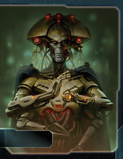

[← Back to Index](../index.html)

# L1Z1X Mindnet Guide

---

## I. Introduction

The L1Z1X Mindnet is Twilight Imperium's **premier dreadnought faction**. Deploy massive Super Dreadnoughts, unleash devastating BOMBARDMENT against enemy ground forces, and conquer planets across the galaxy. Your faction excels at territorial expansion through overwhelming military force, stealing enemy infrastructure when you conquer their worlds, and projecting unstoppable late-game power. L1Z1X isn't about subtle diplomacy—it's about building the most terrifying fleet in the galaxy and using it to dominate through conquest.

## II. Playstyle

Playing L1Z1X Mindnet is about methodical territorial expansion backed by overwhelming military force. Build dreadnoughts, conquer planets, steal enemy structures, and gradually expand your empire.

Early game you establish your production and build your dreadnought fleet. Mid-game you unlock your Commander and start making aggressive moves on fortified worlds. Late game you leverage your massive fleet to make decisive swings across the map—teleporting fleets with your Hero, conquering key planets, and securing objectives through military superiority.

Once you take something, it was always yours.

## III. The Basics

### A. Home System & Commodities

**Home System:**
- **[0.0.0]:** 5 resources / 0 influence
- **Total: 5 resources / 0 influence (5 optimal resources / 0 optimal influence)**

**Notes:** One of the strongest home systems in the game. Easy to defend, and 5 resources provides great production for dreadnoughts. Zero influence makes political gameplay difficult but doesn't matter for your military strategy.

**Commodities:** 2

Low commodity count reflects your non-economic focus. You're not a trading faction.

### B. Starting Fleet

**Fleet Composition:**
- 1 Dreadnought (Super Dreadnought I)
- 1 Carrier
- 3 Fighters
- 5 Infantry
- 1 Space Dock
- 1 PDS

**Notes:** Very solid starting fleet. Having 5 infantry and 2 ships with capacity (Super Dreadnought with capacity 2, Carrier with capacity 6) gives you a solid start for expansion. Space dock and PDS on your home planet are standard.

### C. Faction Abilities

**Assimilate:** *When you gain control of a planet, replace each PDS and space dock that is on that planet with a matching unit from your reinforcements.*

Steal enemy structures when conquering planets. If your opponent has a space dock on the planet you invade, you take it—no need to build your own. Same for PDS. This is incredibly powerful for forward expansion. Taking an enemy's forward space dock gives you an instant production facility deep in their territory.

**Harrow:** *After each round of ground combat, your ships in the active system may use their BOMBARDMENT abilities against your opponent's ground forces on the planet.*

Game-changing invasion ability. Unlike normal BOMBARDMENT (which only happens before invasion begins), Harrow lets you BOMBARDMENT after every ground combat round. Here's how it works:

1. Pre-invasion BOMBARDMENT (normal timing)
2. Round 1 of ground combat
3. **Harrow BOMBARDMENT** (you roll BOMBARDMENT again)
4. Round 2 of ground combat
5. **Harrow BOMBARDMENT** (you roll again)
6. Continue until invasion ends

This means a Super Dreadnought with BOMBARDMENT can potentially roll multiple times during a single invasion, systematically destroying ground forces. Combined with your mech's BOMBARDMENT and Plasma Scoring (+1 die to BOMBARDMENT), you can obliterate defenders without risking your own infantry.

### D. Starting and Faction Technologies

**Starting Technologies:**
- **Neural Motivator:** *During the status phase, draw 2 action cards instead of 1.*
- **Plasma Scoring:** *When 1 or more of your units use BOMBARDMENT or SPACE CANNON, 1 of those units may roll 1 additional die.*

**Strategic Analysis:**

**Neural Motivator** gives you action card advantage. Draw 2 action cards every status phase instead of 1, giving you more options and flexibility.

**Plasma Scoring** boosts your BOMBARDMENT advantage. Your Super Dreadnoughts benefit massively from rolling extra dice. This also helps your PDS for SPACE CANNON defense.

These are not the tech colors we deserve, but what we got. Your Super Dreadnought II is as far away as it is for the techless Sardakk.

**Faction Technologies:**

**Super Dreadnought II (BBY):**
*L1Z1X Dreadnought - Cost: 4 | Combat: 4 | Move: 2 | Capacity: 2 | BOMBARDMENT 4 | Sustain Damage*

This unit cannot be destroyed by "Direct Hit" action cards.

Upgraded version with better combat (4 instead of 5), Move 2 (instead of 1), BOMBARDMENT 4 (instead of 5), and immunity to Direct Hit. The mobility and Direct Hit immunity are game-changing.

**Inheritance Systems (YY):**
*You may exhaust this card and spend 2 resources when you research a technology; ignore all of that technology's prerequisites.*

Tech skip card. Exhaust and pay 2 resources to ignore prerequisites when researching any tech. This lets you jump straight to high-tier technologies without building up prerequisite chains.

### E. Leaders

**Agent - I48S:** *After a player activates a system: You may exhaust this card to allow that player to replace 1 of their infantry in the active system with 1 mech from their reinforcements.*

Trade this to players who need mechs. Not particularly strong for you since mechs aren't your focus, but can be useful for making deals. You can also use it yourself to deploy your mech.

**Commander - 2RAM:** *Unlock: Have 4 dreadnoughts on the game board. Units that have Planetary Shield do not prevent you from using BOMBARDMENT.*

**This is your key unlock.** Planetary Shield (from mechs, Magen Defense Grid tech, or faction abilities) normally prevents BOMBARDMENT entirely. With 2RAM unlocked, you ignore this restriction—you can BOMBARDMENT planets even if they have Planetary Shield. This removes the primary counter to your strategy. Aim to unlock Round 2-3 (R2-R3) by producing dreadnoughts early.

**Hero - The Helmsman:** *Unlock: Have 3 scored objectives.* **Dark Space Navigation** - ACTION: Choose 1 system that does not contain other players' ships; you may move your flagship and any number of your dreadnoughts from other systems into the chosen system. Then, purge this card.

Teleport your dreadnought fleet across the galaxy. Use this for surprise Mecatol Rex takes, defensive regrouping, or positioning for critical objectives. The limitation (system cannot contain other players' ships) means you can't use it for direct attacks, but you can move to adjacent systems for next-turn strikes. Timing is crucial—save this for Round 4-5 (R4-R5) when positioning wins games.

### F. Promissory Note - **Cybernetic Enhancements Ω**

*When you gain command tokens during the status phase: Gain 1 additional command token. Then, return this card to the L1Z1X player.*

Gives a player +1 command token during status phase. Very sellable—command tokens are always useful.

Trade value: 2 TG. First person to ask usually gets it. Don't undersell—this is worth the command token they would buy from Leadership anyway.

### G. Alliance

Your alliance gives access to your Commander (2RAM). Players who take your alliance can ignore Planetary Shield for BOMBARDMENT, which is strong for invasion-focused factions. Trade this to military factions (Sardakk, Barony, Sol) who benefit from BOMBARDMENT, or use it as leverage in negotiations.

### H. Mech - **Annihilator**

- **Cost:** 2
- **Combat:** 6
- **Sustain Damage**
- **BOMBARDMENT 8**
- **Special:** *While not participating in ground combat, this unit can use its BOMBARDMENT ability on planets in its system as if it were a ship.*

**BOMBARDMENT from orbit.** Your mech can BOMBARDMENT planets in its system without landing. Important: once you commit your mech to a planet for ground combat, you lose this ability.

In practice, mechs are usually better on the ground. Hitting on 6 and soaking damage with Sustain Damage is more valuable than keeping them in orbit for repeated BOMBARDMENT. Only leave mechs in orbit if you're trying to slowly siege a heavily defended planet without committing ground forces.

**Agent Synergy:** You'll have your mechs out early because of your Agent. Use I48S to replace one of your starting 5 infantry with a mech when you activate systems. This is why you start with 5 infantry—to leave one behind and convert the other 4 into two 2-capacity ship loads.

### I. Flagship - **[0.0.1]**

- **Cost:** 8
- **Combat:** 5 (x2)
- **Move:** 1
- **Capacity:** 5
- **Sustain Damage**
- **Special:** *During a space combat, hits produced by this ship and by your dreadnoughts in this system must be assigned to non-fighter ships if able.*

Forces hits to be assigned to non-fighter ships. This bypasses fighter screens—opponents must assign hits to carriers, cruisers, and dreadnoughts first. Makes your fleet lethal at chewing through capital ships, even when outnumbered by fighters.

**Defensive Value:** Your flagship is an amazing defensive tool. Wherever it sits, opponents can't just send carriers—they need real fleet power to challenge you. You're more incentivized to build and use your flagship than most factions.

**Win-Slaying:** Combines with your Hero to teleport your flagship + dreads for decisive Round 5 strikes.

### J. Breakthrough - **Fealty Uplink (R<>G)**

*When you gain control of a planet, place infantry from your reinforcements equal to that planet's influence value on that planet.*

When you conquer a planet, gain infantry equal to its influence value. A 3-influence planet gives you 3 free infantry immediately. This is strong for sustained invasions—you don't need to transport infantry, you generate them on conquest. The R<>G swap (red and green count as each other for prerequisites) opens tech path flexibility.

**Unlock timing:** Secure this Round 1 or not at all. If you're unlocking your breakthrough later, you're probably not in an invasion-focused game and should skip Fealty Uplink entirely.

### K. Slice and Draft Considerations

**Speaker Position:** Prefer 1-3 to secure breakthrough and get value from good strategy cards (Technology, Diplomacy).

**Slice Preferences:**
- **INFLUENCE-HEAVY SLICES (CRITICAL)** - You need influence to offset your 5/0 home system. Command tokens require influence. Fealty Uplink breakthrough generates infantry equal to influence value—high-influence planets = more free infantry. Don't fall into the trap of taking resource-heavy slices. You need influence desperately.
- **Strong systems nearby home system** - Your dreadnoughts are slow (move 1 until upgraded) and you lack mobility early. You need valuable systems adjacent or close to home. Always nice to have a willing neighbor if Mecatol Rex is unavailable.
- **High-value targets with structures** - Assimilate benefits from conquering planets that have space docks and PDS. If your slice has neighbors with developed infrastructure, you can steal it.

**Draft Considerations:**
- **Tempesta Legendary** - Has to be nearby home system. Gives +1 movement to ships (once per round). Solves your mobility problem early.
- **Entropic** - Turns you from a faction in trouble to a faction that is trouble.

---

## IV. Structural Weaknesses

### A. First Turn Priorities

Your Round 1 (R1) is about establishing dreadnought production and expansion. The priority order is:

1. **Breakthrough** - Secure Round 1 or not at all.
2. **Scoring** - Expand to score Stage I objectives.
3. **Technology** - Get on your tech path early.
4. **Production & Expansion** - Build dreadnoughts and grab planets.

**Strategy Token Spending (Secondaries):**
- **Diplomacy secondary** - Big value with your 5-resource home system.
- **Technology secondary** - Important to get started on your tech path.

### B. Low Mobility Early

Your dreadnoughts start with move 1. This severely limits mobility until you get Super Dreadnought II (move 2). You'll struggle to reach distant planets and Mecatol Rex quickly. Limits access to fractures early. Gravity Drive helps but costs a blue tech. Plan your expansion carefully—you can't reposition easily.

### C. Influence Poverty

Zero home influence cripples your command token economy. You can't spend influence to buy command tokens, which severely limits tactical actions. This is your biggest economic weakness and must be addressed through slice selection and early expansion.

Secondary issues: You can't claim Mecatol Rex easily and have no voting power during agendas.

---

## V. Technology

### A. Overview

**Starting Technologies:**
- Neural Motivator - Draw 2 action cards instead of 1 during status phase
- Plasma Scoring - +1 die to BOMBARDMENT or SPACE CANNON
- **Note:** Impactful in New Age Path, kinda weak in Blue Path.

**Core Technologies:** Gravity Drive, Super Dreadnought II

L1Z1X is very tech-dependent. You need multiple technologies to make your kit work. Successful L1Z1X games are the ones where people ask "Why does L1 have so much tech?" -SCPT. Don't be shy about investing in technology—your faction thrives when you over-tech.

### B. Tech Path 1: Blue Path (Oldie but Goldie)

The classic path. Unfortunately, it requires you to move to blue without help from your starting techs. This path allows for higher mobility and flexibility by paying with firepower—you're investing in movement and positioning rather than raw combat upgrades. You have to double tech once during R1-R3.

**Note:** A blue skip allows faster progression but can be costly if you need to use it for every tech.

**Round 1:** Dark Energy Tap - Retreat flexibility, frontier exploration | OR Antimass Deflectors - Move through asteroids, SPACE CANNON defense

**Round 2:** Gravity Drive (B) - +1 move to one ship per activation

**Round 3:** AI Development Algorithm - Skip unit upgrade prereqs, production cost reduction | AND Super Dreadnought II (BBY) - Move 2, immune to Direct Hit

**Round 4:** Fleet Logistics (BB) - 2 actions per turn | OR Light/Wave Deflector (BBB) - Move through enemy systems | OR Carrier II (BB) - Move 2, capacity 6

**Round 5:** Fleet Logistics (BB) | Light/Wave Deflector (BBB) | Carrier II (BB)

**Note:** Destroyer II (RR) is a good 3rd unit upgrade option for anti-fighter coverage.

### C. Tech Path 2: New Age Path

This path requires securing Fealty Uplink breakthrough Round 1.

**Round 1:** Hyper Metabolism (GG) - 3 command tokens per status phase (economy)

**Round 2:** AI Development Algorithm - Skip unit upgrade prereqs, production cost reduction

**Round 3:** War Sun (RRRY) - Massive capital ship, BOMBARDMENT 3 (x3), removes Planetary Shield

**Round 4:** X-89 Bacterial Weapon (GGG) - DOUBLE BOMBARDMENT every round. Death Star-level orbital annihilation. How does anyone stay alive on the ground? | OR Destroyer II (RR) - Cost 1, combat 8, ANTI-FIGHTER BARRAGE 6 (x3)

**Round 5:** Flexible as Round 4

You become an unstoppable monster on the ground with Harrow, easy access to mechs, and tons of bonus infantry from Fealty Uplink. However, you might struggle in space combat. Consider prioritizing Destroyer II first to shore up your anti-fighter capabilities.

**Note:** A blue skip allows you to get Gravity Drive in this path. Cruiser II (GYR) is a good 3rd unit upgrade option for bonus mobility.

### D. Path Choices

**Resource-heavy slice:** War Sun path (New Age Path) allows you to leverage high resources for expensive War Suns.

**Influence-heavy slice:** Blue Path is slightly better. More influence helps offset your 5/0 home system for command token economy.

---

## VI. Strategy Cards

### A. Round 1

**Round 1 Priority Ranking:**

1. **Trade** - Trade goods > resources. Three TG + washing 2 commodities is solid value.

2. **Leadership** - Excellent for breakthrough path. Three command tokens enable strong Round 1 expansion.

3. **Technology** - Solid. You're very tech-dependent.

4. **Diplomacy** - Five-resource home system is amazing. Spend 5 on tech, ready it, spend 5 on plastic. With blue skip, grab Gravity Drive immediately.

5. **Politics** - Breakthrough access and bonus money for good speaker position Round 2.

6. **Warfare** - You start with 2C4i. Don't need to over-expand Round 1. Can be better than Construction depending on slice.

7. **Construction** - You can steal structures with Assimilate. Let your neighbors build, then take their stuff. Gives less value than other options.

8. **Imperial** - Never pick Round 1. You're not holding Mecatol Rex yet.

**Note:** If you're playing L1, you should probably not be bottom of speaker order. You need access to good strategy cards.

### B. Round 2+ Priority

**Love:**
- **Technology** - Keep investing in tech. You need 5-7 technologies to be good.
- **Trade** - Trade goods solve your economy problems. Take it if available.
- **Leadership** - Command token economy. Solid every round.

**Good:**
- **Imperial** - Very good for scoring points and actually winning.
- **Politics** - Setting up flexibility for next round, but usually you have a hand full of action cards anyway.

**Situational:**
- **Diplomacy** - Only for scoring late.
- **Warfare** - For specific aggressive play.
- **Construction** - If you got forward dock.

---

## VII. Intermediate

### A. Unit Composition

**Blue Path Composition:** **Dreadnoughts + Carrier + Fighters + Infantry**

- **Dreadnoughts:** Your core units. Build 4+ for Commander unlock, then keep producing. Upgrade to Super Dreadnought II for move 2. BOMBARDMENT with Harrow makes invasions trivial.
- **Carrier:** Capacity for infantry transport. Upgrade to Carrier II for 6 capacity and move 2.
- **Fighters:** Screen for dreadnoughts. Absorb hits in space combat.
- **Infantry:** Ground forces for invasion.
- **Mechs:** Deploy 1-2 mechs for BOMBARDMENT orbital support. Don't need many—they're expensive (2 resources) and niche.

**New Age Path Composition:** **War Suns + Destroyers + Infantry + Mechs**

- **War Suns:** Your capital ships. Replace dreadnoughts as primary fleet power. BOMBARDMENT 3 (x3) removes Planetary Shield.
- **Dreadnoughts:** Build 4 for Commander unlock, then transition to War Suns.
- **Destroyer II:** Anti-fighter coverage. You struggle in space combat without this.
- **Mechs:** Deploy 2-3 mechs. More important in this path with Fealty Uplink and ground focus.
- **Infantry:** Fealty Uplink generates tons of free infantry. X89 Bacterial Weapon makes you unstoppable on the ground.
- **Cruiser II (bonus):** Sneaky mobility for fast strikes. Move 3 with capacity 1.

### B. Game Plan

**Round 1 is make or break.** Get everything rolling and fill out your slice for a strong Round 2. If you manage to establish production and secure your territory Round 1, the sky is the limit.

**Unlock breakthrough first thing** to leverage a safe slice later in game with tons of bonus infantry. Each planet on average will have 2 extra infantry from Fealty Uplink. 3 infantry isn't a quick drive-by compared to most people that will have 1.

**Round 2-3: Plan and execute.** Target fracture, Mecatol Rex, or a neighbor. Plan Round 2, execute latest Round 3. No silly ground forces will be enough to stop you. If you get through the air, you get through the ground.

Even though your focus won't be on PDS, smashing through a silly "defensive faction" in Round 3 who relies on Planetary Shield will make it a nightmare later for them to grab it back. You won't have any PDS at home, so plenty of plastic left in the box to place in an opponent's slice.

**Round 4: Plan for victory.** You need a realistic plan for how to win in Round 5. Assume bonus points from Styx. Position your fleet, secure objectives, and prepare for the final push.

**Round 5: Execute your win.** You have to solve your own win-slaying. Use The Helmsman to teleport your fleet for decisive strikes. Take what you need and win the game.

**Fracture opportunities:** Push fracture for relics and legendary planets. Your Hero teleports your fleet to Styx later in the game for decisive positioning.

---

## VIII. Objectives

### A. Objective Summary

**Strengths:** Decent economy but hard to access trade goods. Control objectives that require low mobility are a strong part of your kit. Very many possible Stage II objectives for swingy turns late game.

**Weaknesses:** Structures can be hard and very neighbor dependent.

### B. Stage I Objectives

| Stage I Objective                                              | Status |
|----------------------------------------------------------------|--------|
| Erect a Monument (Spend 8 resources)                           | 🟢     |
| Sway the Council (Spend 8 influence)                           | 🔴     |
| Negotiate Trade Routes (Spend 5 trade goods)                   | 🟡     |
| Lead from the Front (Spend 3 tokens from tactic/strategy pools)| 🟡     |
| Diversify Research (Own 2 techs in each of 2 colors)           | 🟢     |
| Develop Weaponry (Own 2 unit upgrade technologies)             | 🟢     |
| Found Research Outposts (Control 3 planets with tech specialties)       | 🔴     |
| Intimidate the Council (Ships in 2 systems adjacent to MR)     | 🟢     |
| Expand Borders (Control 6 planets in non-home systems)         | 🟢     |
| Corner the Market (Control 4 planets with same trait)          | 🟡     |
| Amass Wealth (Spend 3 influence, 3 resources, 3 trade goods)   | 🟡     |
| Build Defenses (Have 4+ structures)                            | 🔴     |
| Discover Lost Outposts (Control 2 planets with attachments)    | 🔴     |
| Engineer a Marvel (Have flagship or war sun on board)                   | 🟢     |
| Explore Deep Space (Units in 3 systems without planets)        | 🟢     |
| Improve Infrastructure (Structures on 3 planets outside HS)    | 🔴     |
| Make History (Units in 2 systems with legendary/MR/anomalies)           | 🟢     |
| Populate the Outer Rim (Units in 3 edge systems)                        | 🟢     |
| Push Boundaries (Control more planets than each neighbor)      | 🟢     |
| Raise a Fleet (5+ non-fighter ships in 1 system)               | 🟢     |

**Legend:** 🟢 Easy | 🟡 Moderate | 🔴 Difficult

### C. Secret Objectives

| Secret Objective                                                | Status |
|----------------------------------------------------------------|--------|
| Unveil Flagship (Win space combat with flagship)               | 🟢     |
| Turn their Fleets to Dust (SPACE CANNON destroy last ship)     | 🔴     |
| Destroy their Greatest Ship (Destroy war sun/flagship)          | 🟢     |
| Spark a Rebellion (Win combat vs most VP player)               | 🟢     |
| Threaten Enemies (Ships adjacent to another player's HS)       | 🟢     |
| Make an Example (BOMBARDMENT destroy last ground forces)                | 🟢     |
| Cut Supply Lines (Ships in system with another's space dock)   | 🟢     |
| Monopolize Production (Control 4 industrial planets)            | 🟡     |
| Mine Rare Minerals (Control 4 hazardous planets)               | 🟡     |
| Forge an Alliance (Control 4 cultural planets)                 | 🟡     |
| Become a Martyr (Lose control of planet in HS)                 | 🔴     |
| Betray a Friend (Win combat vs player whose PN you have)                | 🟢     |
| Brave the Void (Win combat in anomaly)                                  | 🟢     |
| Darken the Skies (Win combat in another player's HS)                    | 🟢     |
| Defy Space and Time (Units in wormhole nexus)                           | 🟡     |
| Demonstrate your Power (3+ non-fighter ships after space combat)        | 🟢     |
| Destroy Heretical Works (Purge 2 relic fragments)                       | 🔴     |
| Dictate Policy (3+ laws in play)                                        | 🔴     |
| Drive the Debate (You/your planet elected by agenda)                    | 🔴     |
| Establish Hegemony (Control planets with 12+ influence)                 | 🟡     |
| Adapt New Strategies (Own 2 faction technologies)                       | 🔴     |
| Master the Laws of Physics (Own 4 tech of same color)                   | 🟡     |
| Form a Spy Network (Discard 5 action cards)                             | 🟢     |
| Gather a Mighty Fleet (Have 5 dreadnoughts)                             | 🟢     |
| Establish a Perimeter (Have 4 PDS on board)                             | 🔴     |
| Fuel the War Machine (Have 3 space docks)                               | 🟡     |
| Become the Gatekeeper (Ships in alpha and beta wormhole systems)        | 🟡     |
| Learn Secrets of the Cosmos (Ships in 3 systems adjacent to anomalies)  | 🟢     |
| Control the Region (Ships in 6 systems)                                 | 🟢     |
| Occupy the Seat of the Empire (Control MR with 3+ ships)       | 🟢     |
| Fight With Precision (AFB destroy last fighter)                | 🟡     |
| Foster Cohesion (Be neighbors with all players)                | 🟢     |
| Hoard Raw Materials (Control planets with 12+ resources)                | 🟢     |
| Mechanize the Military (1 mech on each of 4 planets)           | 🟢     |
| Occupy the Fringe (9+ ground forces on planet without space dock)       | 🟢     |
| Produce en Masse (Units with PRODUCTION 8+ in single system)            | 🔴     |
| Prove Endurance (Last to pass)                                 | 🔴     |
| Seize an Icon (Control legendary planet)                       | 🟢     |
| Stake Your Claim (Control planet in contested system)                   | 🟢     |
| Strengthen Bonds (Have another player's PN)                    | 🟢     |

**Legend:** 🟢 Easy | 🟡 Moderate | 🔴 Difficult

### D. Stage II Objectives

| Stage II Objective                                                       | Status |
|--------------------------------------------------------------------------|--------|
| Centralize Galactic Trade (Spend 10 trade goods)                         | 🔴     |
| Found a Golden Age (Spend 16 resources)                                  | 🟢     |
| Galvanize the People (Spend 6 tokens from tactic/strategy pools)         | 🟡     |
| Manipulate Galactic Law (Spend 16 influence)                             | 🔴     |
| Hold Vast Reserves (Spend 6 influence, 6 resources, 6 trade goods)       | 🟡     |
| Command an Armada (Have 8+ non-fighter ships in 1 system)                | 🟢     |
| Achieve Supremacy (Flagship/War Sun in another player's HS or MR)        | 🟢     |
| Become a Legend (Units in 4 systems with legendary/MR/anomalies)         | 🟢     |
| Conquer the Weak (Control 1 planet in another player's HS)               | 🟢     |
| Rule Distant Lands (Control 2 planets in/adjacent to different players' HS) | 🟢     |
| Patrol Vast Territories (Units in 5 systems without planets)             | 🔴     |
| Control the Borderlands (Units in 5 edge systems not HS)                 | 🟡     |
| Subdue the Galaxy (Control 11 planets in non-home systems)               | 🔴     |
| Unify the Colonies (Control 6 planets with same trait)                   | 🔴     |
| Reclaim Ancient Monuments (Control 3 planets with attachments)           | 🔴     |
| Construct Massive Cities (Have 7+ structures)                            | 🔴     |
| Protect the Border (Structures on 5 planets outside HS)                  | 🔴     |
| Master of Sciences (Own 2 techs in each of 4 colors)                     | 🔴     |
| Revolutionize Warfare (Own 3 unit upgrade technologies)                  | 🟢     |

**Legend:** 🟢 Likely | 🟡 Possible | 🔴 Difficult

---

## IX. Alliance Priority

Trading for other factions' Alliance promissory notes (which give you access to their Commanders) can significantly boost your strategy. Here are the top alliances to prioritize:

**Top Tier:**
1. **Nomad (Navarch Feng)** - Produce flagship without spending resources. Saves 8 resources. Always good value.
2. **Crimson Rebellion (Ahk Siever)** - At end of combat, gain commodity/TG. Combat-focused faction, smooths out TG access weakness.
3. **Muaat (Magmus)** - After you spend strategy token, gain 1 trade good. Smooths out TG access weakness.
4. **Deepwrought (Aello)** - When others research tech, gain commodity/TG if they take -1 discount. Smooths out TG access weakness.
5. **Naaz-Rokha (Dart and Tai)** - After you gain control of planet from another player, explore that planet. Extra value from conquests.

**Good:**
6. **Obsidian (Aroz Hollow)** - Apply +1 combat in The Fracture. Late game Styx plays with Hero teleport.
7. **Nekro Virus (Nekro Acidos)** - After you gain tech, draw 1 action card. Tech-heavy faction.
8. **Winnu (Rickar Rickani)** - Apply +2 combat in MR, home system, and legendary planet systems. Boosts fleet in key battles.
9. **Empyrean (Xuange)** - After another player moves ships into system with your token, return token to reinforcements. Late game slaying tool.

---

## X. Bonus Game Elements

This section highlights action cards that synergize particularly well with your faction's strengths or mitigate your weaknesses, relics that offer exceptional value for your faction's strategy and abilities, and agendas to pursue that benefit your position, and agendas to watch out for that could hurt you.

### A. High-Value Action Cards

### B. Relic Priorities

### C. Agenda Awareness

---

## XI. End Notes

L1Z1X Mindnet is one of the most fun and flexible factions in Twilight Imperium. Want to bomb the shit out of your friends? L1Z1X has you covered. Build massive dreadnought fleets, unleash devastating orbital bombardment, and invade planets with overwhelming force. Your opponents build structures? You steal them. They fortify their planets? You ignore Planetary Shield and bomb them anyway. Need to make a surprise play across the galaxy? Teleport your entire fleet with The Helmsman.

L1Z1X is an excellent faction for learning Twilight Imperium. You have straightforward mechanics that teach core concepts: production, combat, territory control, and military objectives. Your faction excels at multiple strategies—whether you go for the classic dreadnought swarm or the experimental War Sun path. You're strong throughout the game, from early territorial expansion to late game win-slaying.

Most importantly, L1Z1X delivers on the power fantasy. You're not subtle. You're not diplomatic. You're the galaxy's most feared military force, and everyone knows it. When you show up in someone's home system with a fleet of Super Dreadnoughts, they know exactly what's about to happen. Play L1Z1X, build the biggest fleet in the galaxy, and show your table why nobody messes with the Mindnet.
