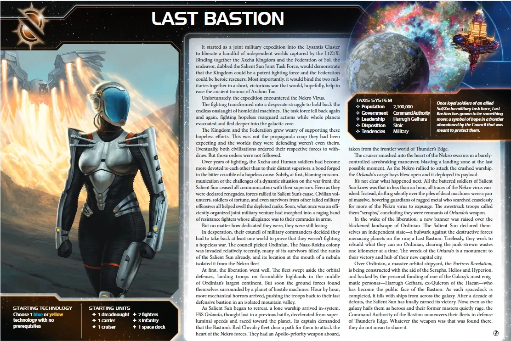

[← Back to Index](../index.html)

# Last Bastion Guide

## Contents

1. [Introduction](#i-introduction)
2. [Playstyle](#ii-playstyle)
3. [Faction Info and Drafting](#iii-faction-info-and-drafting)
   - [Home System & Commodities](#a-home-system--commodities) · [Starting Fleet](#b-starting-fleet) · [Faction Abilities](#c-faction-abilities) · [Technologies](#d-starting-and-faction-technologies) · [Leaders](#e-leaders) · [Promissory Note](#f-promissory-note) · [Alliance](#g-alliance) · [Mech](#h-mech) · [Flagship](#i-flagship) · [Breakthrough](#j-breakthrough) · [Slice and Draft](#k-slice-and-draft-considerations)
4. [Round 1 Problems and Faction Weakness](#iv-round-1-problems-and-faction-weakness)
5. [Technology](#v-technology)
6. [Strategy Cards](#vi-strategy-cards)
7. [Unit Composition and Game Plan](#vii-unit-composition-and-game-plan)
8. [Objectives](#viii-objectives)
9. [Alliance Priority](#ix-alliance-priority)
10. [Bonus Game Elements](#x-bonus-game-elements)
11. [End Notes](#xi-end-notes)

---

## I. Introduction

The Last Bastion are TI4's escalating combat faction—a faction for players who understand that every battle makes you stronger. Your Galvanize mechanic places tokens on units after combat, granting +1 die per token. The more you fight, the more powerful your fleet becomes. This isn't gradual scaling—it's exponential. A galvanized dreadnought doesn't just roll better dice, it snowballs into an unstoppable force.

This is a faction about sustained warfare and territorial expansion. Your Liberate ability readies planets instantly when you invade with infantry equal to resource value. Your Helios space docks increase planet resources. Your flagship gains +1 combat per planet you control. Everything synergizes toward aggressive expansion and constant combat.

Watch opponents realize their mistake when your galvanized units dominate battles they should have won. Your flagship scales to combat 15+ by late game. Your galvanized fleet rolls extra dice in every engagement. You don't avoid combat—you seek it, knowing each battle makes you stronger.

## II. Playstyle

Playing Last Bastion means embracing sustained warfare as your path to dominance. Every combat you fight galvanizes a unit with Phoenix Standard—that unit gains +1 die permanently. This scaling compounds quickly. Three combats mean three galvanized units rolling extra dice forever. Your fleet doesn't just survive battles—it grows stronger from them.

Your early game focuses on aggressive expansion with Liberate. Invade planets with infantry equal to their resource value and they ready instantly—produce units the same round you conquer. Choose your starting tech wisely (Gravity Drive or Sarween Tools recommended) to accelerate this conquest cycle. Helios space docks increase planet resources by +1, making low-value planets into viable production centers.

As the game progresses, galvanized units compound your combat advantage. Commander unlocks with just 3 galvanized units, granting Sabotage immunity and Nekro protection. Your flagship scales with every planet you control—+1 combat per non-home planet means combat 10+ by mid-game. Build more Helios docks to boost conquered planet production. Fight frequently to accumulate galvanize tokens.

Your endgame leverages overwhelming galvanized fleet advantage. Hero turns galvanized unit deaths into board clears—roll dice for every enemy unit, destroying them on successful rolls. Your flagship at combat 15+ auto-hits everything. The Icon breakthrough produces ships in forward positions, bypassing space dock requirements. Close out through combat dominance and territorial control.

## III. Faction Info and Drafting

### A. Home System & Commodities

**Home System:** 2 planets
- **Ordinian (Legendary):** 0 resources / 0 influence. Legendary Ability: Exhaust when you pass to draw 1 action card and gain 1 command token.
- **Revelation (Trade Station):** 1 resource / 2 influence = 2 optimal influence
- **Total: 1 resource / 2 influence (2 optimal influence)**

**Commodities:** 1

**Notes:** Weakest home economy in the game. Ordinian provides action card + token when passing but zero production. Revelation provides 2 influence for early voting. 1 commodity is the lowest in game—trade economy nonexistent. You rely entirely on expansion.

### B. Starting Fleet

- 1 Dreadnought
- 1 Carrier
- 1 Cruiser
- 2 Fighters
- 3 Infantry
- 1 Space Dock (Helios VI)

**Notes:** Strong combat start. 3 infantry for Liberate invasions. Helios VI space dock increases planet resources by +1 and has production +2.

### C. Faction Abilities

**Liberate:** When you gain control of a planet, ready that planet if it contains infantry equal to or greater than its resource value; otherwise, place 1 infantry on that planet.

Invade with infantry equal to planet resources and the planet readies immediately, letting you produce units the same round. Otherwise gain 1 free infantry. Plan invasions with enough infantry to trigger the ready effect for maximum snowball.

**Galvanize:** When a game effect instructs a player to galvanize a unit, place a galvanize token beneath it if it doesn't have one. Galvanized units roll 1 additional die for combat and unit abilities.

Permanent +1 die for combat and unit abilities until destroyed. Only 1 token per unit. Works for space combat, ground combat, bombardment, anti-fighter barrage, and space cannon.

**Phoenix Standard:** At the end of a combat, you may galvanize 1 of your units that participated.

After every combat (space or ground), galvanize 1 unit you choose. Prioritize single-die units (dreadnoughts, flagship, cruisers). Even losing combats lets you galvanize survivors. Accumulate tokens through frequent combat.

### D. Starting and Faction Technologies

**Starting Technologies:** Choose 1 blue or yellow technology with no prerequisites.

**Recommendations:**
1. **Gravity Drive (B)** - +1 movement for reaching objectives and aggressive expansion
2. **Sarween Tools (Y)** - Free fighter/infantry per production for Liberate sustainability
3. **Fleet Logistics (BB)** - 2 tactical actions per round for doubled tempo

**Faction Technologies:**

**Helios V2 (Y):** Last Bastion Space Dock. Capacity 5, PRODUCTION: Planet +4. The resource value of this planet is increased by 2.

Your critical mid-game tech. Production +4 and +2 planet resources transforms economy. Example: 2-resource planet becomes 4 resources with Helios V2. Only requires 1 yellow prerequisite.

**Proxima Targeting VI (R):** Cancel 1 hit produced by BOMBARDMENT against your ground forces for each galvanized unit present. At start of ground combat, you may resolve BOMBARDMENT 8 (x3) against opponent's ground forces; if you do, make identical roll against your own ground forces.

Cancel bombardment hits equal to galvanized ground forces. Optional BOMBARDMENT 8 x3 hits both sides. High-risk bombardment—use when you have superior ground forces or galvanized infantry with sustain damage from mechs.

### E. Leaders

**Agent - Dame Briar:** When a player's unit is destroyed, you may exhaust this to galvanize another of that player's units in the destroyed unit's system.

Galvanize survivors when your units die in combat (lose fighter, galvanize dreadnought). Can sell as transaction tool—galvanize other players' units for support. Moderate transaction value.

**Commander - Nip and Tuck:** *Unlock: 3 galvanized units on board.* Your action cards cannot be canceled by Sabotage. Nekro cannot place assimilator tokens on your components.

Easy unlock (3 galvanized units by R2-3). Immunity to Sabotage and Nekro assimilation. Extremely powerful against Nekro and action-card-heavy metagames.

**Hero - Entity 4X41A "Apollo":** *Unlock: 3 scored objectives.* When your galvanized unit is destroyed, purge this to roll 1 die per enemy unit in system; destroy each unit if result equals or exceeds galvanized unit's combat value.

Devastating board clear. Galvanized dreadnought (combat 5) destroyed = roll dice for all enemy units, destroy each on 5+. Best with high-combat-value galvanized units (dreadnoughts at 5, flagship at 9+). Opponent must destroy your galvanized unit to trigger.

### F. Promissory Note

**Raise the Standard:** At the end of a combat, galvanize 1 of your units that participated. Then, return this to the Last Bastion player.

Grants Phoenix Standard for one combat. Returns after use. Trade value: 2-4 TG for combat factions. Best for factions wanting to galvanize key units (Sardakk dreadnoughts, Sol carriers).

### G. Alliance

**Alliance Ability:** While neighbors with Last Bastion player: At the end of a combat, you may galvanize 1 of your units that participated.

Grants Phoenix Standard to ally. Powerful for aggressive factions (Barony, Sardakk, L1Z1X). Creates 2v1 scenarios where both players galvanize units. High value for war factions.

### H. Mech

**A3 Valiance:** Cost 2, Combat 6, Sustain Damage. When this unit is destroyed, if it was galvanized, galvanize up to 3 infantry in its system.

Spreads galvanize tokens to infantry when destroyed. Galvanized infantry become combat 9. Encourages galvanizing mechs via Phoenix Standard. Deploy with infantry groups for defensive synergy.

### I. Flagship

**The Egeiro:** Cost 8, Combat 9 (x1), Move 1, Capacity 3, Sustain Damage. Apply +1 to combat rolls for each non-home planet you control.

Scales with territorial expansion. Control 8 non-home planets = combat 17 flagship. If galvanized, rolls +1 die at combat 9+. Late-game nearly invincible. Does NOT count home system planets.

### J. Breakthrough

**The Icon (Y<>R):** When you produce ships, exhaust this to place them in a system with your command token, at least 1 ground force, and no enemy ships.

Produce ships in forward systems without space dock. Bypasses space dock requirement entirely. Game-changing production flexibility. Requires yellow + red prerequisites.

### K. Slice and Draft Considerations

**Priorities:**
- **High Resources** - Need 10-15 resources from slice. Helios docks increase planet resources (+1 VI, +2 V2)
- **Infantry-Friendly Planets** - Lower-resource planets (1-3) easier to Liberate. High-resource planets (4-5) require large infantry investments
- **Influence** - Start with 2 influence. Need influence-rich planets for politics
- **Tech Specialties** - Industrial/hazardous for The Icon breakthrough

**Ideal Slice:** 10-12 resources, 8-10 influence. Multiple 1-3 resource planets. 1-2 tech specialties. Moderate Mecatol proximity.

## IV. Round 1 Problems and Faction Weakness

### A. First Turn Priorities

1. **Technology** - Starting tech choice is game-defining. Gravity Drive or Sarween Tools recommended. Shapes entire game.

2. **Expansion + Production** - Liberate readies planets when invaded with infantry equal to resources. Expand to 2-3 planets R1 with enough infantry to trigger ready effect. Helios docks increase planet resources by +1.

3. **Breakthrough** - Seek early combat R1 to accumulate galvanize tokens. Power curve depends on frequent fighting.

4. **Scoring** - Limited until 3-5 galvanized units accumulated (R2-3). Focus R1 on tech, expansion, and first combats.

**Weaknesses:**

**Worst Commodity Economy:** 1 commodity (lowest in game). Trade worthless. Cannot compete economically with trade factions. Growth depends entirely on conquest and Helios bonuses.

**Weak Starting Economy:** 1/2 home + 1 commodity. Struggle to fund fleet production and tech research simultaneously.

**Galvanize Dependency:** Requires frequent combat to accumulate tokens. Avoidance strategies (Ghosts, Naalu initiative, retreating) counter your scaling. Peaceful metagames weaken you significantly.

**Infantry Sustainability:** High-resource planets (4-5) need 4-5 infantry to Liberate. Without Sarween Tools, maintaining Liberate-ready forces is difficult.

**Hero Timing:** Requires losing a galvanized unit to trigger board clear. Opponents can avoid destroying galvanized units or target non-galvanized units first.

**Flagship Scaling:** Early game (2-4 planets) only combat 11-13. Mid-game (5-7 planets) combat 14-16. Becomes dominant combat 17+ only late-game (8+ planets).

**Starting Tech Reliance:** Round 1 tech choice is permanent. Poor choice (Scanners instead of Gravity Drive) cripples the entire game.

## V. Technology

### A. Overview

**Starting Tech:** Choose 1 blue or yellow technology with no prerequisites.

**Recommendations:** Gravity Drive (B) for mobility, Sarween Tools (Y) for infantry spam, or Fleet Logistics (BB) if willing to skip starting tech for double tempo.

You have two distinct tech paths:

**Path 1 - Gravity Drive Start (Standard):** Focuses on early mobility and expansion. Gets Gravity Drive R1, Sarween Tools R2, Helios V2 R3, then pivots into The Icon breakthrough (Y<>R) by getting red prereqs. Best for aggressive expansion and reaching distant objectives.

**Path 2 - Sarween Start (Infantry Focus):** Prioritizes infantry spam for Liberate. Gets Sarween Tools R1, Gravity Drive R2, Helios V2 R3. Maximizes Liberate sustainability and ground dominance. Best when slice has many low-resource planets.

### B. Technology Paths

**Path 1 - Gravity Drive Start (Standard):**

**Round 1:** Gravity Drive (B) - +1 movement for aggressive expansion
- *After you activate a system, apply +1 to move value of 1 ship*

**Round 2:** Sarween Tools (Y) - Infantry production for Liberate
- *When using PRODUCTION, produce 1 additional fighter or infantry for free*

**Round 3:** Helios V2 (Y) - Space dock upgrade
- *Production +4, planet resource +2. Transforms economy*

**Round 4:** AI Development Algorithm (R) OR Magen Defense Grid (R) - Red prereq for The Icon
- *AI Dev: Ignore 1 prereq for unit upgrades, reduce production cost*
- *Magen: Infantry at structures, produce 1 hit vs ground forces*

**Round 5+:** The Icon (Y<>R) OR unit upgrades (Carrier II, Dreadnought II)
- *Produce ships in forward systems without space dock*

---

**Path 2 - Sarween Start (Infantry Focus):**

**Round 1:** Sarween Tools (Y) - Infantry spam for Liberate
- *Free fighter or infantry per production*

**Round 2:** Gravity Drive (B) - Mobility for expansion
- *+1 movement for ships*

**Round 3:** Helios V2 (Y) - Space dock upgrade
- *Production +4, planet resource +2*

**Round 4:** Carrier II (BB) OR continue toward The Icon
- *Move 2, Capacity 6 for transporting infantry swarms*

**Round 5+:** Proxima Targeting VI (R) OR The Icon (Y<>R)
- *Proxima: Cancel bombardment, optional BOMBARDMENT 8 x3*
- *The Icon: Forward production*

## VI. Strategy Cards

### A. Round 1

Your R1 priority is starting tech path and seeking early combat to accumulate galvanize tokens.

**Round 1 Priority Ranking:**

1. **Technology** - Critical tech path (Helios V2, Proxima Targeting, The Icon). Start immediately.
2. **Construction** - Build Helios space docks to increase planet resources. Each dock transforms planet economy.
3. **Warfare** - Redistribute fleets, seek combats to galvanize units.
4. **Leadership** - Command tokens for aggressive expansion. Ordinian provides token when passing.
5. **Imperial** - Scoring if objectives achievable.
6. **Politics** - Speaker token decent. Low influence (2) makes voting weak.
7. **Diplomacy** - Liberate readies planets automatically. Skip unless defending key system.
8. **Trade** - Worst Trade faction (1 commodity). Never pick unless desperate.

### B. Round 2+

**Love:**
- **Technology** - Helios V2, Proxima Targeting, The Icon. Essential tech path.
- **Construction** - Build Helios docks for resource bonuses.
- **Warfare** - Seek multi-front combats for maximum galvanize accumulation.

**Like:**
- **Imperial** - Score objectives rounds 3-5.
- **Leadership** - Token replenishment for sustained aggression.

**Situational:**
- **Politics** - Low influence (2) limits voting power. Only for speaker or critical agendas.
- **Diplomacy** - Liberate readies planets. Rarely useful.

## VII. Unit Composition and Game Plan

### A. Unit Composition

Your ideal fleet composition:

- **Dreadnoughts** - Galvanize priority targets. Single-die units benefit most from +1 die.
- **Cruisers** - Cost-efficient galvanized units. Affordable screening that scales.
- **Carriers** - Transport infantry for Liberate. Not galvanize priority.
- **Infantry** - Spam for Liberate invasions. Need infantry equal to planet resources.
- **Fighters** - Screening for galvanized units.
- **Flagship** - Scales with planets controlled. Late-game combat 15-20.
- **Mechs** - Spread galvanize to infantry when destroyed.
- **Helios Space Docks** - Build multiple for planet resource bonuses (+1 VI, +2 V2).

Focus on galvanizing single-die units first. Carriers transport, don't galvanize them. Infantry spam supports Liberate. Flagship becomes game-winning late-game with 8+ planets.

### B. Game Plan

**Early Game (R1-2):** Choose starting tech wisely (Gravity Drive or Sarween Tools recommended). Expand aggressively to 2-3 planets R1 using Liberate—bring infantry equal to planet resources to ready planets immediately. Seek early combat to accumulate galvanize tokens. Place 2nd Helios space dock with Construction. Your power curve depends on frequent fighting—even small skirmishes galvanize units. Build economy foundation through conquered planets with Helios resource bonuses.

**Mid Game (R3-4):** Commander unlocks naturally with 3 galvanized units (immunity to Sabotage and Nekro). Helios V2 transforms economy—production +4 and +2 planet resources. Conquer Mecatol Rex with galvanized fleet. Accumulate 3-4 galvanized dreadnoughts/cruisers. Continue Liberate expansion—ready planets immediately for snowball production. Helios V2 upgrades transform 3-4 planets into high-resource producers. Hero unlocks with 3 scored objectives. Your galvanized units compound combat advantage.

**Late Game (R5+):** Flagship scales to combat 15+ with 8+ planets controlled—auto-hits everything. The Icon breakthrough produces ships in forward systems without space docks. Hero turns galvanized unit deaths into board clears—galvanized dreadnought dies, roll dice for every enemy unit, destroy on 5+. Your galvanized fleet dominates contested space. Mechs spread galvanize to infantry. Control 11+ planets through Liberate expansion. Convert overwhelming galvanized advantage into victory points. Close out through combat dominance and territorial control.

## VIII. Objectives

### A. Objective Summary

**Strengths:** Last Bastion excels at combat objectives with galvanized units providing consistent combat bonuses. Tech objectives are achievable with strong tech paths, and territorial objectives benefit from Phoenix Standard unit recursion enabling persistent board presence.

**Weaknesses:** Trade good spending objectives are very difficult with only 1 commodity and no natural TG generation. Influence spending can be challenging depending on slice composition, and structure objectives require deliberate investment.

### B. Stage I Objectives

| Stage I Objective                                                       | Status |
|-------------------------------------------------------------------------|--------|
| **Spendies** |  |
| Develop Weaponry (Own 2 unit upgrade technologies)                      | 🟢     |
| Diversify Research (Own 2 tech in each of 2 colors)                     | 🟢     |
| Lead from the Front (Spend 3 tokens from tactic/strategy pools)         | 🟡     |
| Negotiate Trade Routes (Spend 5 trade goods)                            | 🔴     |
| Sway the Council (Spend 8 influence)                                    | 🔴     |
| **Control** |  |
| Expand Borders (Control 6 planets in non-home systems)                  | 🟢     |
| **Ships in Systems** |  |
| Amass Wealth (Spend 3 influence, 3 resources, 3 trade goods)            | 🔴     |
| Discover Lost Outposts (Control 2 planets with attachments)             | 🟡     |
| Engineer a Marvel (Have flagship or war sun on board)                   | 🟡     |
| Explore Deep Space (Units in 3 systems without planets)                 | 🟡     |
| Intimidate the Council (Ships in 2 systems adjacent to MR)              | 🟡     |
| Make History (Units in 2 systems with legendary/MR/anomalies)           | 🟡     |
| Populate the Outer Rim (Units in 3 edge systems)                        | 🟡     |
| Push Boundaries (Control more planets than each neighbor)               | 🟢     |
| Raise a Fleet (5+ non-fighter ships in 1 system)                        | 🟢     |
| **Tech** |  |
| Corner the Market (Control 4 planets with same trait)                   | 🟡     |
| Found Research Outposts (Control 3 planets with tech specialties)       | 🟡     |
| **Structure** |  |
| Build Defenses (Have 4 or more structures)                              | 🟢     |
| Erect a Monument (Spend 8 resources)                                    | 🟡     |
| Improve Infrastructure (Structures on 3 planets outside HS)             | 🟡     |

**Legend:** 🟢 Likely | 🟡 Possible | 🔴 Difficult

Last Bastion excel at territorial and combat objectives through Liberate readying and galvanized unit scaling.

### C. Secret Objectives

| Secret Objective                                                         | Status |
|--------------------------------------------------------------------------|--------|
| **Combat** |  |
| Become a Martyr (Lose control of planet in home system)                 | 🟡     |
| Betray a Friend (Win combat vs player whose PN you have)                | 🟢     |
| Brave the Void (Win combat in anomaly)                                  | 🟢     |
| Darken the Skies (Win combat in another player's HS)                    | 🟡     |
| Demonstrate your Power (3+ non-fighter ships after space combat)        | 🟢     |
| Destroy their Greatest Ship (Destroy war sun/flagship)                   | 🟡     |
| Fight With Precision (AFB destroy last fighter)                         | 🟡     |
| Make an Example (BOMBARDMENT destroy last ground forces)                | 🟡     |
| Spark a Rebellion (Win combat vs VP leader)                              | 🟢     |
| Turn their Fleets to Dust (SPACE CANNON destroy last ship)              | 🟡     |
| **Ships in Systems** |  |
| Become the Gatekeeper (Ships in alpha and beta wormhole systems)        | 🟡     |
| Cut Supply Lines (Ships in system with enemy space dock)                | 🟢     |
| Forge an Alliance (Control 4 cultural planets)                           | 🟡     |
| Occupy the Seat of the Empire (Control MR with 3+ ships)                | 🟢     |
| Threaten Enemies (Ships adjacent to another player's HS)                | 🟢     |
| **Control** |  |
| Adapt New Strategies (Own 2 faction technologies)                       | 🟢     |
| Defy Space and Time (Units in wormhole nexus)                           | 🟡     |
| Hoard Raw Materials (Control planets with 12+ resources)                | 🟡     |
| Learn Secrets of the Cosmos (Ships in 3 systems adjacent to anomalies)  | 🟡     |
| Mine Rare Minerals (Control 4 hazardous planets)                         | 🟡     |
| Monopolize Production (Control 4 industrial planets)                     | 🟡     |
| Seize an Icon (Control legendary planet)                                | 🟡     |
| Stake Your Claim (Control planet in contested system)                   | 🟢     |
| **Tech** |  |
| Master the Laws of Physics (Own 4 tech of same color)                   | 🟢     |
| Unveil Flagship (Win space combat with flagship)                         | 🟢     |
| **Structure/Units** |  |
| Establish a Perimeter (Have 4 PDS on board)                             | 🟡     |
| Establish Hegemony (Control planets with 12+ influence)                 | 🔴     |
| Form a Spy Network (Discard 5 action cards)                             | 🟡     |
| Fuel the War Machine (Have 3 space docks)                               | 🟢     |
| Mechanize the Military (1 mech on each of 4 planets)                    | 🟢     |
| Occupy the Fringe (9+ ground forces on planet without space dock)       | 🟡     |
| **Other** |  |
| Destroy Heretical Works (Purge 2 relic fragments)                       | 🟡     |
| Dictate Policy (3+ laws in play)                                        | 🔴     |
| Drive the Debate (You/your planet elected by agenda)                    | 🔴     |
| Foster Cohesion (Be neighbors with all players)                         | 🟡     |
| Gather a Mighty Fleet (Have 5 dreadnoughts)                             | 🟡     |
| Produce en Masse (Units with PRODUCTION 8+ in single system)            | 🟢     |
| Prove Endurance (Last to pass)                                          | 🟡     |
| Strengthen Bonds (Have another player's PN)                             | 🟡     |

### D. Stage II Objectives

| Stage II Objective                                                       | Status |
|--------------------------------------------------------------------------|--------|
| **Spendies** |  |
| Dictate Policy (Spend X influence)                                      | N/A    |
| Drive the Debate (Spend X influence)                                    | N/A    |
| Wield Authority (Spend X influence)                                     | N/A    |
| Produce En Masse (Spend X resources)                                    | N/A    |
| Dominate Economic Policy (Spend X resources/trade goods)                | N/A    |
| **Control** |  |
| Conquer the Weak (Control 1 planet in another player's HS)               | 🟡     |
| Form Galactic Brain Trust (Control 5 tech specialty planets)            | N/A    |
| Hold Vast Reserves (Spend 6 influence, 6 resources, 6 trade goods)       | 🔴     |
| Master of Sciences (Own 2 techs in each of 4 colors)                     | 🟢     |
| Subdue the Galaxy (Control 11 planets in non-home systems)               | 🟢     |
| **Ships in Systems** |  |
| Achieve Supremacy (Flagship/War Sun in another player's HS or MR)        | 🟢     |
| Centralize Galactic Trade (Spend 10 trade goods)                         | 🔴     |
| Command an Armada (Have 8+ non-fighter ships in 1 system)                | 🟢     |
| Patrol Vast Territories (Units in 5 systems without planets)             | 🟡     |
| Protect the Border (Structures on 5 planets outside HS)                  | 🟡     |
| **Tech** |  |
| Revolutionize Warfare (Own 3 unit upgrade technologies)                  | 🟢     |
| Unify the Colonies (Control 6 planets with same trait)                   | 🟡     |
| **Structure** |  |
| Become a Legend (Units in 4 systems with legendary/MR/anomalies)         | 🟡     |
| Construct Massive Cities (Have 7+ structures)                            | 🟡     |

🟢 Likely | 🟡 Possible | 🔴 Difficult

Last Bastion's galvanized units and Helios economy excel at combat and territorial scoring. Low commodities hamper trade objectives.

## IX. Alliance Priority

Trading for other factions' Alliance promissory notes (which give you access to their Commanders) can significantly boost your strategy. Here are the top alliances to prioritize:

**Top Tier:**

1. **Nomad (Navarch Feng)** - Produce flagship without spending resources. Saves 8 resources for Egeiro. Your flagship scales massively with planets—get it cheap.

2. **Crimson Rebellion (Ahk Siever)** - At end of combat, gain commodity/TG. Passive income from your frequent combat. You fight constantly for galvanize—this generates wealth.

3. **Deepwrought (Aello)** - When others research tech with -1 discount, gain commodity/TG. Passive income addresses your 1 commodity weakness.

4. **Muaat (Magmus)** - After spending strategy token, gain 1 TG. Passive income every round. Helps economic weakness.

5. **Winnu (Rickar Rickani)** - Apply +2 combat in MR, home system, legendary planets. Strong combat boost for Mecatol conquest and defending Ordinian.

6. **Titans of Ul (Tungstantus)** - When using PRODUCTION, gain 1 TG. Passive income every production. You produce frequently—compounds wealth.

7. **Barony of Letnev (Rear Admiral Farran)** - After unit uses Sustain Damage, gain 1 TG. Galvanized dreadnoughts with sustain damage generate money.

8. **Vuil'raith Cabal (That Which Molds Flesh)** - Up to 2 fighters/infantry don't count against PRODUCTION limit. Helps infantry spam for Liberate.

9. **Nekro Virus (Nekro Acidos)** - After gaining tech, draw 1 action card. Tech-heavy path benefits. More action cards.

10. **Empyrean (Xuange)** - After players move ships into systems with your token, return token to reinforcements. Late game slaying tool.

## X. Bonus Game Elements

This section highlights action cards that synergize particularly well with your faction's strengths or mitigate your weaknesses, relics that offer exceptional value for your faction's strategy and abilities, and agendas to pursue that benefit your position, and agendas to watch out for that could hurt you.

### A. High-Value Action Cards

### B. Relic Priorities

### C. Agenda Awareness

---

## XI. End Notes

Last Bastion is the faction for players who understand that sacrifice isn't loss—it's investment in exponential power. You're TI4's escalating combat faction, where every battle makes you permanently stronger through galvanize tokens. While other factions avoid combat to preserve assets, you seek it knowing each engagement compounds your advantage.

Your biggest strength is the galvanize snowball. Phoenix Standard galvanizes 1 unit after every combat—that unit gains +1 die permanently. Three combats mean three galvanized units rolling extra dice forever. This compounds quickly. Your galvanized dreadnought at combat 5 rolling 2 dice is significantly stronger than opponents expect. Your flagship scales to combat 15+ by late game with planetary expansion. Commander unlocks easily (3 galvanized units) and grants Sabotage immunity and Nekro protection.

When you master Last Bastion, you leverage Liberate for explosive economic acceleration. Invade planets with infantry equal to resource value and they ready instantly—produce units the same round you conquer. Helios V2 space docks transform economy by increasing planet resources by +2. Even low-value planets become viable production centers. The Icon breakthrough produces ships in forward positions, bypassing space dock requirements entirely.

Your value comes from understanding that combat isn't destruction—it's galvanize accumulation. Every fight strengthens you. Even losing battles galvanizes survivors. Opponents realize their mistake when your galvanized units dominate battles they should have won. Your flagship at combat 17+ auto-hits everything. Hero turns galvanized deaths into board clears. You don't avoid combat—you seek it.

The table learns to fear your escalation. That galvanized dreadnought isn't just rolling better—it's snowballing into unstoppable force. Your Liberate invasions ready planets for immediate production. Your weak 1 commodity economy doesn't matter when you're conquering everything with readied planets. You don't trade for resources—you take them, knowing each conquest makes you stronger.

**"The Phoenix rises from every battle. Strength through adversity."**
