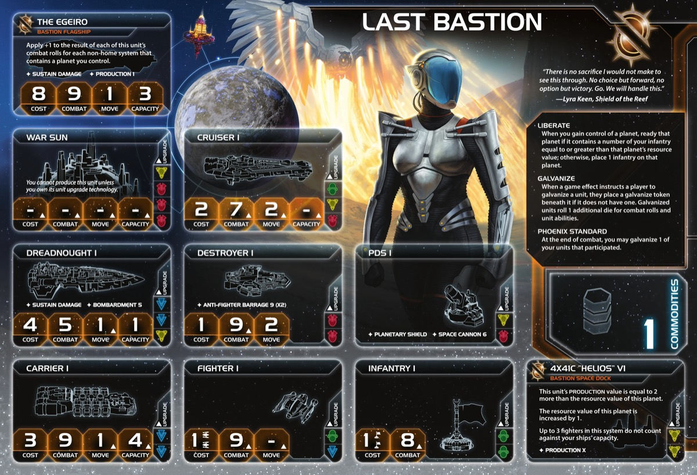

<nav class="page-nav">
<a href="../index.html" class="back-link">Back to Index</a>
<a href="Last_Bastion.md" download class="download-link" title="Plain text file - safe to download">Download .md</a>
</nav>

# Last Bastion Guide

## Contents

1. [Introduction](#i-introduction)
2. [Playstyle](#ii-playstyle)
3. [Faction Info and Drafting](#iii-faction-info-and-drafting)
   - [Home System & Commodities](#a-home-system--commodities) · [Starting Fleet](#b-starting-fleet) · [Faction Abilities](#c-faction-abilities) · [Technologies](#d-starting-and-faction-technologies) · [Leaders](#e-leaders) · [Promissory Note](#f-promissory-note) · [Alliance](#g-alliance) · [Mech](#h-mech) · [Flagship](#i-flagship) · [Breakthrough](#j-breakthrough) · [Slice and Draft](#k-slice-and-draft-considerations)
4. [Round 1 Problems and Faction Weakness](#iv-round-1-problems-and-faction-weakness)
5. [Technology](#v-technology)
6. [Strategy Cards](#vi-strategy-cards)
7. [Unit Composition and Game Plan](#vii-unit-composition-and-game-plan)
8. [Objectives](#viii-objectives)
9. [Alliance Priority](#ix-alliance-priority)
10. [Bonus Game Elements](#x-bonus-game-elements)
11. [End Notes](#xi-end-notes)

---

## I. Introduction

The Last Bastion are TI4's escalating combat faction—a faction for players who understand that every battle makes you stronger. While other factions avoid combat to preserve their fleets, you seek it. Each engagement permanently improves your units through Galvanize. That dreadnought you fought with three times? It's not the same ship anymore—it's evolved into something far more dangerous.

This is a faction about transformation through warfare. Your Liberate ability turns invasions into economic snowballs. Your Helios space docks transform worthless planets into production centers. Your flagship grows stronger with every system you conquer. Everything builds toward sustained aggression where losses don't matter because survivors become unstoppable.

Watch opponents realize their early aggression against you was a mistake. Your units that survived those battles now roll extra dice in every fight. Your flagship that started weak now dominates every engagement. Your conquered planets produce more than their neighbors' pristine worlds. You don't avoid combat—you weaponize it.

## II. Playstyle

Playing Last Bastion feels like a production and economy faction for most of the game, with bonus military upside. Your Helios space docks transform planets by increasing their resource values—this economic transformation is your core strength. You're picking strategic planets to make into production hubs, building an economy through infrastructure rather than trade.

Liberate is your economic engine. Invade planets with enough infantry and they ready instantly, letting you produce the same round you conquer. This turns aggression into fuel rather than drain. You're not just taking territory—you're refreshing it for immediate production. Combined with Helios docks enhancing planet values, each conquest adds more to your economy than it costs.

Galvanize provides military upside without changing your economic focus. Phoenix Standard galvanizes one unit per combat, making your troops stronger over time. Your flagship scales with every planet you control, becoming increasingly dominant as you expand. Commander requires 3 galvanized units on board and provides Sabotage immunity. These military bonuses support your territorial expansion, but the real power is in transformed planet economies funding continuous fleet production.

Your production dominance from multiple Helios-enhanced planets creates overwhelming economic advantage. Galvanized capital ships provide combat edge when needed. Hero offers board clear potential. You close out through economic superiority and production flexibility, with stronger troops as the cherry on top.

## III. Faction Info and Drafting

### A. Home System & Commodities

**Home System:** 2 planets (Nebula)
- **Ordinian (Legendary):** 1 resource / 0 influence (1 from space dock) = 1 optimal resource. Legendary Ability: Exhaust when you pass to draw 1 action card and gain 1 command token.
- **Revelation (Trade Station):** 1 resource / 2 influence = 2 optimal influence
- **Total: 2 resources / 2 influence (1 optimal resource / 2 optimal influence)**

**Commodities:** 1

**Notes:** Rough start. Nebula reduces mobility but gives bonus defense. Only faction with space station in home system—makes your puny 1 commodity into 2 when refreshed. Ordinian's bonus token + action card is like having a 1 resource / 6 influence system which is solid, but can be difficult to get resources R1.

### B. Starting Fleet

- 1 Dreadnought
- 1 Carrier
- 1 Cruiser
- 2 Fighters
- 3 Infantry
- 1 Space Dock (Helios VI)

**Notes:** Solid fleet but a little held back by 3 infantry—having more would have helped for Liberate. Helios VI increases planet resources by +1.

### C. Faction Abilities

**Liberate:** When you gain control of a planet, ready that planet if it contains infantry equal to or greater than its resource value; otherwise, place 1 infantry on that planet.

Most likely your key ability. Strong economic early game—readying conquered planets allows strong start. Bonus infantry provides extra security if you don't have enough for ready trigger. Helpful late game for invasions. Great combo with Mecatol—go there, Liberate and ready Mecatol, then if you picked Leadership R2 and people can't get you off, you got custodian for "free".

**Galvanize:** When a game effect instructs a player to galvanize a unit, place a galvanize token beneath it if it doesn't have one. Galvanized units roll 1 additional die for combat and unit abilities.

Nice effect. +1 die for combat and unit abilities. Only 1 token per unit. Cost of fighting to get it usually costs more than it's worth, but if your goals align that you want to fight them anyway, why not go for it.

**Phoenix Standard:** At the end of a combat, you may galvanize 1 of your units that participated.

After every combat (space or ground), galvanize 1 unit you choose. Prioritize strong units and units with abilities: dreadnought, destroyer, war sun, flagship. Even losing combats lets you galvanize survivors.

**Helios VI (Special Unit):** Last Bastion Space Dock. Capacity 3, PRODUCTION: Planet +2. The resource value of this planet is increased by 1.

Your unique space dock. Increases planet resources by +1. Core unit for transforming planets into production hubs.

### D. Starting and Faction Technologies

**Starting Technologies:** Choose 1 blue or yellow technology with no prerequisites.

**Blue:**

- **Antimass Deflectors** - Move through asteroids, -1 to enemy SPACE CANNON. If your slice has a lot of/key asteroid belts.
- **Dark Energy Tap** - Explore frontier tokens, retreat flexibility. If you have empty systems for bonus value.

**Yellow:**

- **Sarween Tools** - Reduce production cost by 1. If you want to smooth out early game on top of getting to your faction docks.
- **Scanlink Drone Network** - Explore 1 planet per activation. Would not suggest.

**Faction Technologies:**

**Helios V2 (YY):** Last Bastion Space Dock. Capacity 5, PRODUCTION: Planet +4. The resource value of this planet is increased by 2.

Gives 3 bonus resources (if you have 3 docks). Get it early or not at all. Bonus production is nice but maybe not needed with your focus on strong capital ships.

**Proxima Targeting VI (R):** Cancel 1 hit produced by BOMBARDMENT against your ground forces for each galvanized unit present. At start of ground combat, you may resolve BOMBARDMENT 8 (x3) against opponent's ground forces; if you do, make identical roll against your own ground forces.

Not really that risky. If you have 1 galvanized unit, expected hits are 1 so it cancels out—net positive. If you have no galvanized units, do it if you have more units in the fight. Don't if you have less. Variance goes down in smaller fights—2v1 is better odds than 3v2.

### E. Leaders

**Agent - Dame Briar:** When a player's unit is destroyed, you may exhaust this to galvanize another of that player's units in the destroyed unit's system.

Helpful for unlocking Commander. Small ships/infantry die early, then galvanize your dreadnought or mech. Prefer to use on self, but maybe sell for 2-3 TG if necessary.

**Commander - Nip and Tuck:** *Unlock: 3 galvanized units on board.* Your action cards cannot be canceled by Sabotage. Nekro cannot place assimilator tokens on your components.

Not easy unlock without making deals or enemies, but not too hard if willing to part with your PN. When you need it, fantastic. If you're not ahead, probably not too impactful. Can be game changer in right circumstances.

**Hero - Entity 4X41A "Apollo":** *Unlock: 3 scored objectives.* When your galvanized unit is destroyed, purge this to roll 1 die per enemy unit in system; destroy each unit if result equals or exceeds galvanized unit's combat value.

Pretty weird. Improves your odds to win combat but you have to lose your galvanized unit. If you already had strong unit like galvanized dreadnought, you give that up early—and maybe it would have done almost the same in the combat anyway.

### F. Promissory Note

**Raise the Standard:** At the end of a combat, galvanize 1 of your units that participated. Then, return this to the Last Bastion player.

Grants Phoenix Standard for one combat. Returns after use. Trade value: 2-4 TG for combat factions. Best for factions wanting to galvanize key units (Sardakk dreadnoughts, Sol carriers).

### G. Alliance

**Alliance Ability:** Your ally gains Nip and Tuck - Action cards cannot be canceled by Sabotage. Nekro cannot place assimilator tokens on your components.

For factions relying on action cards, this can be massive. For those ahead, this can be difference between win and lose. But cases exist where they don't get much value. Try to sell the upside and get something more consistent in return.

### H. Mech

**A3 Valiance:** Cost 2, Combat 6, Sustain Damage. When destroyed, if galvanized, galvanize up to 3 infantry in its system.

Useful for unlocking Commander. Makes ground combat slightly stronger. Losing your galvanized mech is not fantastic. Would be great combo with Proxima Targeting but you probably won't tech that.

### I. Flagship

**The Egeiro:** Cost 8, Combat 9 (x1), Move 1, Capacity 3, Sustain Damage. Apply +1 to combat rolls for each non-home planet you control.

Scales with territorial expansion. 8 planets = hitting 100% of the time. Average 6-7 planets means hitting on 2-3 instead of 9. If you get this galvanized (one of best targets), you get real good value. Does NOT count home system planets.

### J. Breakthrough - **The Icon (Y<>R)**

When you produce ships, you may exhaust this card to place those ships in a system that contains 1 of your command tokens, at least 1 of your ground forces, and no other players' ships.

**Y<>R Synergy:** Yellow and red count as each other for prerequisites. Very nice option: get Helios V2 (YY) using red techs as yellow prereqs, then pivot into blue for movement and flex techs—skips the long War Sun detour while getting your economic docks.

**Forward Production:** Definitely helps with movement restrictions early—gets your ships out into the field instead of stuck home in nebula. Only works once per round, but that might be enough.

### K. Slice and Draft Considerations

**Speaker Order:** Earlier the better. Flexible overall.

**Slice Priorities:**

- **Balanced resources/influence** - Your docks give bonus resources and your home system offers almost 2 tokens worth from Ordinian.
- **High planet count** - More opportunities for Helios docks and Liberate.
- **Lower-resource planets** - Easier to Liberate (1-3 resource planets).

**Nice to Have:**

- 1/3 planets for bonus token in early game.
- Blue tech skip.
- Yellow/red tech skips with your breakthrough—get Helios V2 using red as yellow prereqs, then pivot into blue for movement and flex techs. Skips long War Sun detour while getting economic docks.
- Mecatol access for big swing Liberate turn.
- Compact slice.

**Avoid:**

- High-resource planets only (3+ resource planets require too much infantry for early economic boost from Liberate).
- Anomalies or empty systems in middle of your slice.
- Spread out slices.

## IV. Round 1 Problems and Faction Weakness

### A. First Turn Priorities

**Round 1 Priority Rankings:**

1. **Scoring** - Get ahead while you have most power in early game.

2. **Expansion and Production** - Get more infantry for better economy. Liberate readies planets when invaded with enough infantry. Expand to 2-3 planets R1.

3. **Technology** - Mobility out of your nebula home system and in your slice.

4. **Breakthrough** - Only if game pushes you that way. The Icon is powerful but not R1 priority.

**Expansion Notes:** Dreadnought + carrier with 3 infantry. Use Liberate to ready conquered planets for immediate production. Consider if you can send extra infantry to ready a key planet for early game economy if you have Warfare secondary or Construction available.

### B. No Magic Tricks

You're very solid—good economy, solid fleet strength, good production, some small things to trade. But you got nothing that swings the game. If you fall behind, you're probably chronically behind. No comeback mechanics.

### C. Hard to Impact the Map

You'll most likely have small impact on your neighbors if you need it, but nothing else really. Might play a key action card they can't Sabotage, but that's about it.

---

## V. Technology

### A. Overview

**Starting Tech:** Choose 1 blue or yellow technology with no prerequisites (Antimass, Dark Energy Tap, or Sarween).

Blue path gives slightly less economy but more mobility and flexibility. Yellow/red path gives more economy and raw combat power.

### B. Technology Paths

Both paths require The Icon breakthrough for Helios V2 via Y<>R synergy.

**Blue Path:**

**Starting Tech:** Dark Energy Tap or Antimass Deflectors

**Round 1:** Gravity Drive (B)
- After you activate a system, apply +1 to move value of 1 ship
- **Why:** Mobility out of nebula and across slice. Helps with your home system being a nebula.

**Round 2:** AI Development Algorithm
- When you research unit upgrade, exhaust to ignore 1 prerequisite. When using PRODUCTION, exhaust to reduce cost by number of unit upgrades owned
- **Why:** Prerequisite skip for unit upgrades. Resource saving later with your planned 3 unit tech path.

**Round 3:** Helios V2 (YY)
- Space dock upgrade. Resource value +2
- **Why:** Economic boost.

**Round 4:** Dreadnought II (BBY)
- Cost 4, Combat 5, Move 2, Capacity 1, Sustain Damage, BOMBARDMENT 5
- **Why:** Move 2 capital ships. Combos with your galvanize.

**Round 5:** Carrier II (BB) OR Fleet Logistics (BB)
- **Carrier II:** Cost 3, Combat 9, Move 2, Capacity 6
- **Fleet Logistics:** 2 actions per turn
- **Why:** Transport capacity or double actions.

---

**Yellow/Red Path:**

**Starting Tech:** Sarween Tools

**Round 1:** Scanlink Drone Network (Y)
- When you activate a system, explore 1 planet in that system
- **Why:** Yellow prerequisite for Helios V2.

**Round 2:** Helios V2 (YY)
- Space dock upgrade. Resource value +2
- **Why:** Economic boost.

**Round 3:** AI Development Algorithm
- When you research unit upgrade, exhaust to ignore 1 prerequisite. When using PRODUCTION, exhaust to reduce cost by number of unit upgrades owned
- **Why:** Prerequisite skip for War Sun. Resource saving with 3 unit tech path.

**Round 4:** War Sun (RRRY)
- Cost 12, Combat 3 (x3), Move 2, Capacity 6, Sustain Damage, BOMBARDMENT 3 (x3)
- **Why:** Heavy combat power.

**Round 5:** Assault Cannon (RRR) OR Duranium Armor (RR) OR Destroyer II (RR)
- **Assault Cannon:** Destroy 1 enemy non-fighter ship at start of space combat if you have 3+ non-fighter ships. If versus factions with big ships.
- **Duranium Armor:** Repair 1 damaged unit after assigning hits each combat round. If you need ground strength, helps a lot.
- **Destroyer II:** Cost 1, Combat 8, Move 2, AFB 6 (x3). Versus fighter screens.

---

## VI. Strategy Cards

### A. Round 1

**Round 1 Priority Ranking:**

1. **Technology** - Saves you token and critical resources for tech.
2. **Trade** - Can unlock breakthrough but can be rough to use all free resources if you can't wash and collect debt.
3. **Leadership** - Tokens are good. Can throw secret for breakthrough to get it out of the way, but usually need a bit more resources.
4. **Construction** - Good to get more docks out and get free production. Good if more systems nearby or for bonus infantry to ready more planets.
5. **Politics** - Can sell speaker for some value and setup next turn objectives.
6. **Warfare** - Can be helpful with Liberate to get quick start in your slice.
7. **Diplomacy** - No good planets to flip at home.
8. **Imperial** - Never R1.

**Strategy Token Priority:** Technology and Diplomacy as secondary.

### B. Round 2+

**Love:**

- **Leadership** - Build in all your space docks.
- **Imperial** - Final push.

**Like:**

- **Construction** - Until you have all space docks.
- **Technology** - Can be good to double tech to get bonus flex techs in late game.
- **Trade** - Flexible economy.

**Situational:**

- **Warfare** - Can be needed for mobility of strong fleet.
- **Politics** - Setup and objective prep.
- **Diplomacy** - Only for extreme defensive purposes or specific objectives.

## VII. Unit Composition and Game Plan

### A. Unit Composition

Your ideal fleet composition:

- **Dreadnoughts** - Strong capital ships. Good galvanize targets if combat aligns with your goals.
- **Carriers** - Transport infantry for Liberate invasions.
- **Infantry** - Essential for Liberate. Bring infantry equal to planet resources to ready planets.
- **Destroyers** - If in yellow/red path. AFB for fighter screens. Good galvanize target since it has unit abilities.
- **War Sun** - If in yellow/red path. Heavy combat power. Good galvanize target since it has unit abilities.
- **Fighters** - For adding HP.
- **Flagship** - Strong late game if galvanized.
- **Mechs** - Galvanized for combat power.

Focus on strong capital ship fleet with infantry support for Liberate. Avoid cruisers. Galvanize units when combat aligns with your expansion goals.

**Note:** Space Dock II allows you to produce a lot of infantry and fighters.

### B. Game Plan

**Early Game:** Choose starting tech based on slice. Expand using Liberate—bring enough infantry to ready planets for immediate production. Build Helios docks on strategic planets to increase resource values. Aim for early hero unlock. Your strength comes from Liberate economic snowball, not combat. Galvanize units if combat opportunities align with expansion goals.

**Mid Game:** Helios V2 transforms your economy if researched. Identify planets to enhance with upgraded docks—these become production hubs. Continue Liberate expansion, readying planets for snowball production. Try to unlock Commander if willing to trade PN or make combat deals. Your economy from transformed planets funds continuous fleet production. Galvanize provides military upside when needed.

**Late Game:** Production dominance from Helios-enhanced planets creates economic advantage. Flagship scales with territorial expansion. Galvanized capital ships provide combat edge. Hero offers board clear potential. Go for Mecatol in later turns with big fleet. Close out through economic superiority and production flexibility backed by solid fleet.

## VIII. Objectives

### A. Objective Summary

**Strengths:** Control objectives benefit from Liberate expansion and high planet count strategy. Resource spending benefits from Helios dock economy. Structure objectives are easier with multiple Helios docks. Tech objectives are achievable with strong tech paths.

**Weaknesses:** Trade good spending objectives are very difficult with 2 commodities (from space station) and no TG generation. Influence spending objectives are hard with weak home influence.

### B. Stage I Objectives

| Stage I Objective                                                       | Status |
|-------------------------------------------------------------------------|--------|
| **Spendies**                                                            |        |
| Erect a Monument (Spend 8 resources)                                    | 🟢     |
| Sway the Council (Spend 8 influence)                                    | 🟡     |
| Negotiate Trade Routes (Spend 5 trade goods)                            | 🔴     |
| Lead from the Front (Spend 3 tokens from tactic/strategy pools)         | 🟡     |
| Amass Wealth (Spend 3 influence, 3 resources, 3 trade goods)            | 🟡     |
| **Control**                                                             |        |
| Expand Borders (Control 6 planets in non-home systems)                  | 🟢     |
| Corner the Market (Control 4 planets with same trait)                   | 🔴     |
| Found Research Outposts (Control 3 planets with tech specialties)       | 🔴     |
| Discover Lost Outposts (Control 2 planets with attachments)             | 🔴     |
| Push Boundaries (Control more planets than each neighbor)               | 🟢     |
| **Ships in Systems**                                                    |        |
| Intimidate the Council (Ships in 2 systems adjacent to MR)              | 🟢     |
| Explore Deep Space (Units in 3 systems without planets)                 | 🟡     |
| Make History (Units in 2 systems with legendary/MR/anomalies)           | 🟢     |
| Populate the Outer Rim (Units in 3 edge systems)                        | 🟡     |
| Raise a Fleet (5+ non-fighter ships in 1 system)                        | 🟢     |
| Engineer a Marvel (Have flagship or war sun on board)                   | 🟢     |
| **Tech**                                                                |        |
| Diversify Research (Own 2 tech in each of 2 colors)                     | 🟢     |
| Develop Weaponry (Own 2 unit upgrade technologies)                      | 🟢     |
| **Structure**                                                           |        |
| Build Defenses (Have 4 or more structures)                              | 🟢     |
| Improve Infrastructure (Structures on 3 planets outside HS)             | 🟢     |

**Legend:** 🟢 Likely | 🟡 Possible | 🔴 Difficult

### C. Secret Objectives

| Secret Objective                                                         | Status |
|--------------------------------------------------------------------------|--------|
| **Combat**                                                               |        |
| Unveil Flagship (Win space combat with flagship)                         | 🟢     |
| Destroy their Greatest Ship (Destroy war sun/flagship)                   | 🟡     |
| Spark a Rebellion (Win combat vs VP leader)                              | 🟢     |
| Betray a Friend (Win combat vs player whose PN you have)                 | 🟢     |
| Brave the Void (Win combat in anomaly)                                   | 🟢     |
| Darken the Skies (Win combat in another player's HS)                     | 🔴     |
| Demonstrate your Power (3+ non-fighter ships after space combat)         | 🟢     |
| Turn their Fleets to Dust (SPACE CANNON destroy last ship)               | 🔴     |
| Make an Example (BOMBARDMENT destroy last ground forces)                 | 🟢     |
| Fight With Precision (AFB destroy last fighter)                          | 🟡     |
| **Ships in Systems**                                                     |        |
| Threaten Enemies (Ships adjacent to another player's HS)                 | 🟢     |
| Cut Supply Lines (Ships in system with enemy space dock)                 | 🟢     |
| Defy Space and Time (Units in wormhole nexus)                            | 🟡     |
| Become the Gatekeeper (Ships in alpha and beta wormhole systems)         | 🟡     |
| Learn Secrets of the Cosmos (Ships in 3 systems adjacent to anomalies)   | 🟢     |
| Control the Region (Ships in 6 systems)                                  | 🟢     |
| Occupy the Seat of the Empire (Control MR with 3+ ships)                 | 🟢     |
| **Control**                                                              |        |
| Monopolize Production (Control 4 industrial planets)                     | 🔴     |
| Mine Rare Minerals (Control 4 hazardous planets)                         | 🔴     |
| Forge an Alliance (Control 4 cultural planets)                           | 🔴     |
| Establish Hegemony (Control planets with 12+ influence)                  | 🔴     |
| Hoard Raw Materials (Control planets with 12+ resources)                 | 🟢     |
| Seize an Icon (Control legendary planet)                                 | 🟢     |
| Stake Your Claim (Control planet in contested system)                    | 🟢     |
| Become a Martyr (Lose control of planet in home system)                  | 🔴     |
| **Tech**                                                                 |        |
| Adapt New Strategies (Own 2 faction technologies)                        | 🟢     |
| Master the Laws of Physics (Own 4 tech of same color)                    | 🟢     |
| **Structure/Units**                                                      |        |
| Establish a Perimeter (Have 4 PDS on board)                              | 🔴     |
| Fuel the War Machine (Have 3 space docks)                                | 🟢     |
| Gather a Mighty Fleet (Have 5 dreadnoughts)                              | 🟢     |
| Mechanize the Military (1 mech on each of 4 planets)                     | 🟢     |
| Occupy the Fringe (9+ ground forces on planet without space dock)        | 🟡     |
| Produce en Masse (Units with PRODUCTION 8+ in single system)             | 🟢     |
| **Other**                                                                |        |
| Dictate Policy (3+ laws in play)                                         | 🔴     |
| Drive the Debate (You/your planet elected by agenda)                     | 🔴     |
| Destroy Heretical Works (Purge 2 relic fragments)                        | 🔴     |
| Form a Spy Network (Discard 5 action cards)                              | 🟡     |
| Foster Cohesion (Be neighbors with all players)                          | 🟢     |
| Strengthen Bonds (Have another player's PN)                              | 🟢     |
| Prove Endurance (Last to pass)                                           | 🔴     |

### D. Stage II Objectives

| Stage II Objective                                                       | Status |
|--------------------------------------------------------------------------|--------|
| **Spendies**                                                             |        |
| Centralize Galactic Trade (Spend 10 trade goods)                         | 🔴     |
| Found a Golden Age (Spend 16 resources)                                  | 🟢     |
| Galvanize the People (Spend 6 tokens from tactic/strategy pools)         | 🟡     |
| Manipulate Galactic Law (Spend 16 influence)                             | 🔴     |
| Hold Vast Reserves (Spend 6 influence, 6 resources, 6 trade goods)       | 🔴     |
| **Control**                                                              |        |
| Conquer the Weak (Control 1 planet in another player's HS)               | 🔴     |
| Rule Distant Lands (Control 2 planets in/adjacent to different players' HS) | 🟡  |
| Subdue the Galaxy (Control 11 planets in non-home systems)               | 🔴     |
| Unify the Colonies (Control 6 planets with same trait)                   | 🔴     |
| Reclaim Ancient Monuments (Control 3 planets with attachments)           | 🔴     |
| Form Galactic Brain Trust (Control 5 planets with tech specialties)      | 🔴     |
| **Ships in Systems**                                                     |        |
| Command an Armada (Have 8+ non-fighter ships in 1 system)                | 🟡     |
| Achieve Supremacy (Flagship/War Sun in another player's HS or MR)        | 🟢     |
| Become a Legend (Units in 4 systems with legendary/MR/anomalies)         | 🔴     |
| Patrol Vast Territories (Units in 5 systems without planets)             | 🔴     |
| Control the Borderlands (Units in 5 edge systems not HS)                 | 🔴     |
| **Tech**                                                                 |        |
| Master of Sciences (Own 2 techs in each of 4 colors)                     | 🔴     |
| Revolutionize Warfare (Own 3 unit upgrade technologies)                  | 🟢     |
| **Structure**                                                            |        |
| Construct Massive Cities (Have 7+ structures)                            | 🔴     |
| Protect the Border (Structures on 5 planets outside HS)                  | 🔴     |

**Legend:** 🟢 Likely | 🟡 Possible | 🔴 Difficult

## IX. Alliance Priority

**Top Tier:**

1. **Crimson Rebellion (Ahk Siever)** - Gain commodity/TG at end of combat. Passive income.
2. **Deepwrought (Aello)** - Gain commodity/TG when others research tech with discount. Passive income addresses 1 commodity weakness.
3. **Muaat (Magmus)** - Gain 1 TG after spending strategy token. Passive income from secondaries.
4. **Titans of Ul (Tungstantus)** - Gain 1 TG when using PRODUCTION. Passive income every production.
5. **Nomad (Navarch Feng)** - Produce flagship without spending resources. Free Egeiro (8 resources saved).

**Good:**

6. **Barony of Letnev (Rear Admiral Farran)** - Gain 1 TG after unit uses Sustain Damage. Passive income.
7. **Vuil'raith Cabal (That Which Molds Flesh)** - Up to 2 fighters/infantry don't count against PRODUCTION limit. Helps infantry spam for Liberate.
8. **Naaz-Rokha (Dart and Tai)** - Explore planet after conquering from another player. Extra value from Liberate invasions.
9. **Winnu (Rickar Rickani)** - Apply +2 combat in MR, home system, legendary planets. Combat boost for Mecatol and Ordinian.
10. **Nekro Virus (Nekro Acidos)** - Draw 1 action card after gaining tech. Action card economy.

## X. Bonus Game Elements

This section highlights action cards that synergize particularly well with your faction's strengths or mitigate your weaknesses, relics that offer exceptional value for your faction's strategy and abilities, and agendas to pursue that benefit your position, and agendas to watch out for that could hurt you.

### A. High-Value Action Cards

### B. Relic Priorities

### C. Agenda Awareness

---

## XI. End Notes

Last Bastion is the faction for players who understand that infrastructure creates power. You're not the flashiest faction with dramatic abilities, but you build one of the most solid economic foundations in the game. Helios space docks transform planets, Liberate readies conquered worlds for immediate production, and galvanize provides military upside when combat aligns with your goals.

Your biggest strength is the Liberate economic engine. Invade planets with enough infantry and they ready instantly—conquer and produce the same round. This turns aggression into fuel rather than drain. Combined with Helios docks increasing planet resources, each conquest adds more to your economy than it costs. You're picking strategic planets to transform into production hubs, building wealth through infrastructure rather than trade.

When you master Last Bastion, you leverage production dominance to stay ahead. Conquered planets with Helios docks generate more resources than pristine worlds. Galvanize provides combat edge when needed but isn't your focus—it's bonus military upside from fights that already served your expansion. Your flagship scales with territorial expansion. Score early while you have power, then maintain advantage through superior production.

The table learns to respect your economic buildup. Your conquered planets produce more than theirs. Your Helios docks have transformed mediocre worlds into production centers. Your solid fleet backed by production infrastructure makes you hard to stop once ahead. You don't conquer through superior force—you conquer through superior economy.

**"Every conquest becomes a foundation. Every foundation, unbreakable."**
