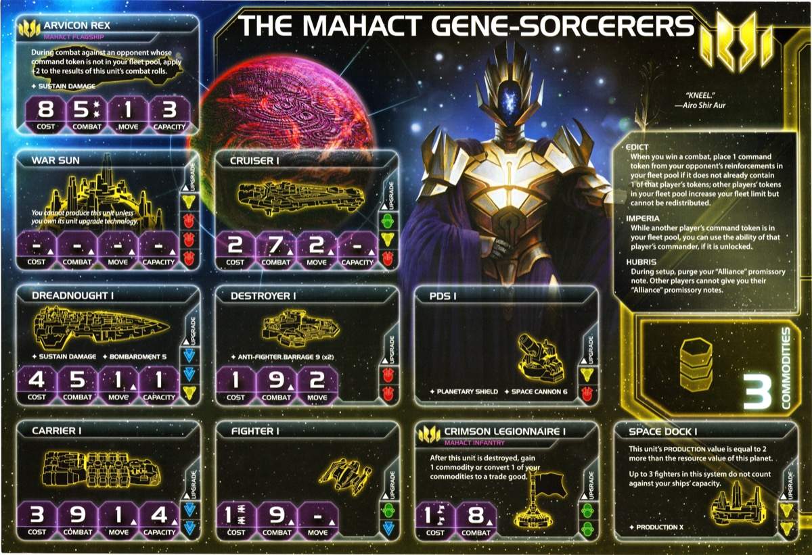

<nav class="page-nav">
<a href="../index.html" class="back-link">Back to Index</a>
<a href="Mahact_Gene_Sorcerers.md" download class="download-link" title="Plain text file - safe to download">Download .md</a>
</nav>

# Mahact Gene-Sorcerers Guide

## Contents

1. [Introduction](#i-introduction)
2. [Playstyle](#ii-playstyle)
3. [Faction Info and Drafting](#iii-faction-info-and-drafting)
   - [Home System & Commodities](#a-home-system--commodities) · [Starting Fleet](#b-starting-fleet) · [Faction Abilities](#c-faction-abilities) · [Technologies](#d-starting-and-faction-technologies) · [Leaders](#e-leaders) · [Promissory Note](#f-promissory-note) · [Alliance](#g-alliance) · [Mech](#h-mech) · [Flagship](#i-flagship) · [Breakthrough](#j-breakthrough) · [Slice and Draft](#k-slice-and-draft-considerations)
4. [Round 1 Problems and Faction Weakness](#iv-round-1-problems-and-faction-weakness)
   - [First Turn Priorities](#a-first-turn-priorities) · [The Mahact Problem](#b-the-mahact-problem)
5. [Technology](#v-technology)
   - [Overview](#a-overview) · [Starting Technologies](#b-starting-technologies) · [Technology Paths](#c-technology-paths)
6. [Strategy Cards](#vi-strategy-cards)
   - [Round 1](#a-round-1) · [Round 2+](#b-round-2)
7. [Unit Composition and Game Plan](#vii-unit-composition-and-game-plan)
   - [Unit Composition](#a-unit-composition) · [Game Plan](#b-game-plan)
8. [Objectives](#viii-objectives)
   - [Objective Summary](#a-objective-summary) · [Stage I](#b-stage-i-objectives) · [Secret Objectives](#c-secret-objectives) · [Stage II](#d-stage-ii-objectives)
9. [Alliance Priority](#ix-alliance-priority)
10. [Bonus Game Elements](#x-bonus-game-elements)
    - [Action Cards](#a-high-value-action-cards) · [Relics](#b-relic-priorities) · [Agendas](#c-agenda-awareness)
11. [End Notes](#xi-end-notes)

---

## I. Introduction

The Mahact Gene-Sorcerers are Twilight Imperium's puppet masters. Every combat victory lets you pull the strings—steal command tokens for extra fleet capacity and unlock the ability to wield your adversaries' most powerful abilities as if they were your own. You're not just fighting; you're orchestrating a symphony of stolen power.

Your infantry are incredibly efficient and generate economy when destroyed. Your political isolation prevents manipulation. You can terminate opponent activations mid-turn and force mandatory battles with no escape. Stack multiple stolen abilities simultaneously for devastating combinations—combat bonuses, utility effects, and economic engines all working together.

Build an arsenal of abilities that creates synergies no single faction should possess. Opponents watch helplessly as you command their own powers better than they can. Mahact doesn't just conquer—they orchestrate dominance through mastery of all.

## II. Playstyle

Playing Mahact is about patient accumulation that explodes into unstoppable momentum. Early game, you're diplomatically maneuvering—winning small skirmishes, siphoning tokens from neighbors, building relationships while quietly growing stronger. Each stolen token expands your fleet capacity and adds another tool to your arsenal.

Mid-game is where you become inevitable. Endless tokens fuel endless production. Your breakthrough lets you purge technologies for relics, converting knowledge into artifacts of power. Commander abilities stack into combinations that break normal game rules. You're not just strong—you're operating on a different level, wielding a cacophony of powers that shouldn't coexist.

Late game, the table realizes you're too strong to stop. You've collected so much stolen power that conventional strategies can't contain you. Terminate opponent turns at will. Force battles they can't escape. Deploy overwhelming force from your endless resource engine. Mahact doesn't just win—they ascend beyond what any single faction should achieve.

---

## III. Faction Info and Drafting

### A. Home System & Commodities

**Home System:**

- **Ixth:** 3 resources / 5 influence
- **Total: 3 resources / 5 influence (5 optimal influence)**

**Commodities:** 3

Good defensive home system with strong influence for command tokens. 5 influence provides excellent token economy during action phase. 3 resources gives mediocre production capacity—you'll need to expand aggressively for additional resources to fuel your fleets.

### B. Starting Fleet

- 1 Dreadnought
- 1 Carrier
- 1 Cruiser
- 2 Fighters
- 3 Infantry (Crimson Legionnaires)
- 1 Space Dock

**Notes:** Decent early fleet. 3 infantry can be a bit small in certain slices but should be manageable.

### C. Faction Abilities

**Edict:**
*When you win a combat, place 1 command token from your opponent's reinforcements in your fleet pool if it does not already contain 1 of that player's tokens; other players' tokens in your fleet pool increase your fleet limit but cannot be redistributed.*

Win any combat (space or ground) and steal 1 opponent token into your fleet pool, increasing your fleet capacity. You can only have 1 token per opponent (cannot stack multiple from same player). These opponent tokens count toward your fleet limit but cannot be redistributed to other pools. Stolen tokens remain until used by your commander ability or mech, unlocking even more tokens for your tactical pool to fuel aggressive expansion and stall tactics. This incentivizes fighting all opponents to collect a full set of tokens, building toward late game dominance.

**Imperia:**
*While another player's command token is in your fleet pool, you can use the ability of that player's commander, if it's unlocked.*

Use any commander ability from factions whose tokens you've stolen. The commander must be unlocked for that faction (you don't unlock it for them), and you gain access immediately when they unlock. Stack multiple commander abilities if you have multiple tokens, creating devastating synergies that break normal game constraints. High variance ability—incredibly strong when opponents have powerful commanders, less impactful against weaker ones. Core of Mahact's mid-late game power.

**Hubris:**
*During setup, purge your "Alliance" promissory note. Other players cannot give you their "Alliance" promissory notes.*

No need to worry about alliances when you can grab them all. Jokes aside, a small diplomatic downside but fairly easy to work around.

### D. Starting and Faction Technologies

**Starting Technologies:**

**Bio-Stims (Green):**
*You may exhaust this card at the end of your turn to ready 1 of your planets that has a technology specialty or 1 of your other technologies.*

Helps a lot early game for extra resources from tech specialty planets. Late game becomes a flexibility tool for resource/influence management or readying key technologies like Predictive Intelligence.

**Predictive Intelligence (Yellow):**
*At the end of your turn, you may exhaust this card to redistribute your command tokens. When you cast votes during the agenda phase, you may cast 3 additional votes. If you do, and the outcome you voted for is not resolved, exhaust this card.*

Combos extremely well with your surplus of tokens from home system, agent, and faction abilities. One of the most unpredictive factions because of Predictive Intelligence—constant token redistribution and flexible voting keep opponents guessing.

**Faction Technologies:**

**Genetic Recombination :**
*You may exhaust this card before a player casts votes; that player must cast at least 1 vote for an outcome of your choice or remove 1 token from their fleet pool and return it to their reinforcements.*

Rarely used—you've got so much other tech you'd want. Funny if gotten with Entropic Scar though. Can absolutely screw someone with the right agenda. Requires 1 green prerequisite.

**Crimson Legionnaire II :**
*Cost: 1 (x2) | Combat: 7*
*After this unit is destroyed, gain 1 commodity or convert 1 of your commodities to a trade good. Then, roll 1 die. If the result is 6 or greater, place the unit on this card. At the start of your next turn, place each unit that is on this card on a planet you control in your home system.*

If you get this early (rare) and get your production going, it can be a bit of a money printer with the commodity generation and resurrection. Unfortunately, like Genetic Recombination, you generally need other stuff more—your tech path is tight and you've got better priorities.

### E. Leaders

**Agent: Jae Mir Kan**
*When you would spend a command token during the secondary ability of a strategic ACTION: You may exhaust this card to remove 1 of the active player's command tokens from the board and use it instead.*

Deal fodder for early rounds and win slaying for later. One of the best agents in the game, saving you a token each round and allowing you to deal for value on top of it. Having 3-4 secondaries every round does compile value—extra action cards, structures, Warfare production that you might not have space for as a non-Mahact faction.

**Commander: Il Na Viroset**
*Unlock: Have 2 other factions' command tokens in your fleet pool.*
*During your tactical actions, you can activate systems that contain your command tokens. If you do, return both command tokens to your reinforcements and end your turn.*

Game breaking, and game breakingly strong. Warps the rules of TI. Unlocks with 2 stolen tokens (easy via Edict). Activate systems with your own tokens to reactivate previous activations. Costs both the system token and one from your strategy pool, both return to reinforcements, and your turn ends immediately. Allows critical re-activations of Mecatol, home system, or contested space.

**Hero: Airo Shir Aur**
*Unlock: Have 3 scored objectives.*
*Benediction:*
*ACTION: Move all units in the space area of any system to an adjacent system that contains a different player's ships. Space combat is resolved in that system; neither player can retreat or resolve abilities that would move their ships. Then, purge this card.*

For late game plays, completely nuts and people will have to plan around it, which they usually don't. Force fleet battles between opponents, pull enemy fleets into traps, disrupt critical scoring, or create forced confrontations. Game-breaking political and military tool best used Round 5-6 when decisive combats matter most.

### F. Promissory Note

**Scepter of Dominion:**
*At the start of the strategy phase: Choose 1 non-home system that contains your units; each other player who has a token on the Mahact player's command sheet places a token from their reinforcements in that system. Then, return this card to the Mahact player.*

A mini Diplomacy. Hard to find a selling point where you get value and you're also not setting up someone really well. Since you might not have so many tokens early, it comes online late, and would you want someone to save their key system against everyone (including you)? Returns to you after use.

### G. Alliance

**Hubris Prevents Alliances:**

You purge your Alliance promissory note during setup and cannot receive others' Alliance notes. You cannot grant Alliance abilities to others, and others cannot grant them to you. Thematic isolation balanced by your power through Edict/Imperia theft.

### H. Mech

**Starlancer:**
*Cost: 2*
*Combat: 6*
*Sustain Damage*
*After a player whose command token is in your fleet pool activates this system, you may spend their token from your fleet pool to end their turn; they gain that token.*

Another game breaking tool. Just say no. Obviously has to be managed with your fleet pool, but for key play denial it's an awesome tool in your late game arsenal. Deploy mechs in critical defensive systems. Removes token from your fleet pool (can steal it again via Edict later).

### I. Flagship

**Arvicon Rex:**
*Cost: 8*
*Combat: 5 (x2)*
*Move: 1*
*Capacity: 3*
*Sustain Damage*
*During combat against an opponent whose command token is not in your fleet pool, apply +2 to the results of this unit's combat rolls.*

One of the strongest flagships in the game. Having the fighting power of 2/3 of a War Sun against most people makes it an awesome force. Excellent tool for chasing people down who have yet to kneel.

### J. Breakthrough

**Vaults of the Heir (Yellow ↔ Green):**
*ACTION: Exhaust this card and purge 1 of your technologies to gain 1 relic.*

Really strong breakthrough. Can be useful to get a few different techs in yellow/green to have purge fodder. Tons to consider—when do you start purging? How many do you purge in total? How do you keep the right prerequisites? Mega boon for late game, but not all relics are better than a tech if you get them early. Remember purge permanently removes the technology. Can purge borrowed techs from Deepwrought. Very useful with Entropic Scar to get bonus relics. All bonus tech agendas/action cards/factions make this go from hard to handle to just a big boost.

### K. Slice and Draft Considerations

**Speaker Order:**

- **Flexible for any position** - Mahact adapts well to any speaker spot. Consider neighbors—you want to be near factions you can fight or deal with.

**Priorities:**

- **Need variety of tech skips** - You need tech flexibility to build your path toward Vaults of the Heir and support your strategy. Really likes blue skips.
- **Favor resources over influence** - You need a lot of tech and plastic (units). All tools in your kit solve lower influence slices—stolen tokens, Predictive Intelligence, and your 5 influence home system already give you token flexibility.

**Nice to Have:**

- Balanced planet spread with good resource totals
- Multi-planet systems for flexibility
- Proximity to multiple factions for token theft opportunities
- Safety of slice is nice—better to solve token theft diplomatically generally

**Avoid:**

- Low resource slices (you need production capacity for tech and plastic)
- Anomalies in the middle of slice

**Summary:**
Mahact is flexible in draft and can work with most slices. Your priority is getting variety in tech skips (especially blue) and positioning near multiple neighbors for combat opportunities. Focus on total slice value over speaker position.

## IV. Round 1 Problems and Faction Weakness

### A. First Turn Priorities

Your Round 1 (R1) priority order: **Expansion + Production > Breakthrough > Scoring > Technology**

1. **Expansion + Production** - Getting your plastic economy started and setting up all future turns. Expand to 2-3 systems R1 with your starting fleet.

2. **Breakthrough** - Easy to unlock with Bio-Stims helping on tech specialty planets, otherwise tough to use Round 1.

3. **Scoring** - You'll be a threat either way—people know what you can do late. Your real power emerges Round 3-4 when you've stolen multiple tokens and can use commander abilities.

4. **Technology** - Tech is a luxury with low resource start. Setup for late game relics dominance via Vaults of the Heir when you can afford it. Token theft and territorial control come first.

**Expansion Notes:** Go out into a tech skip planet, use Bio-Stims to ready it and do your expedition right away for a quick, cheap, and efficient way to solve breakthrough. Might have to spend home system on resources Round 1 to afford things. Hard to grab more than 2 systems, but with Bio-Stims and token economy early game can still be fine. Getting out some scary looking plastic is key for your survival.

**Strategy Card Priority:** Diplomacy (4), Warfare (6), or Tech (7) for R1. If you manage to buy extra tokens, Construction (4) is also nice with the right planet and timing. Try to score early deals for your agent.

### B. The Mahact Problem

You're a massive late game threat. Everyone at the table knows what Mahact can do with stolen tokens and commander abilities by Round 5-6. The problem is you need to make early deals—your agent requires transactions and your economy needs trades to get going.

This creates tension: you need people to deal with you early when you're setting up, but they also know you'll be terrifying late. Good players will either refuse to deal with you or extract premium prices knowing you're the future threat. You have to balance getting the early value you need while managing the target on your back.

## V. Technology

### A. Overview

Mahact has a complicated tech path. With Vaults of the Heir, you're constantly considering purges—which techs to get as purge fodder, which to keep for prerequisites, when to start purging, and how many relics you actually need. Every tech decision involves planning multiple steps ahead: "Do I need this tech, or is it just something to purge later? Will purging this break my prerequisite chain?"

This creates decision paralysis. You can't just grab useful techs—you have to consider their purge value, their prerequisite value, and whether you'll regret losing them.

### B. Starting Technologies

**Bio-Stims (Green):** Ready planets with tech specialties or other technologies at end of turn.

**Predictive Intelligence (Yellow):** Redistribute command tokens or cast +3 votes during agenda phase.

### C. Technology Paths

**Relic Path (Vaults of the Heir Focused):**

**Round 1:** Dark Energy Tap
- *After you perform a tactical action in a system that contains a frontier token, if you have 1 or more ships in that system, explore that token*
- Gives you 1 explore from frontier tokens

**Round 2:** Transit Diodes 
- *Exhaust to remove up to 4 ground forces from the game board and place them on planets you control*
- Now have 2 explores from DET

**Round 3:** Gravity Drive 
- *After you activate a system, apply +1 to the move value of 1 of your ships during this tactical action*
- Movement flexibility and positioning

**Round 4:** Sling Relay , purge Predictive Intelligence for 3rd relic
- *ACTION: Exhaust this card to produce 1 ship in any system that contains 1 of your space docks*

**Round 5:** Fleet Logistics  if Tech is picked, purge Transit Diodes for 4th relic
- *During each of your turns of the action phase, you may perform 2 actions instead of 1*
- End with 4 relics and strong blue tech suite

**Non-Relic Path (Standard Blue Tech):**

**Round 1:** Dark Energy Tap
- *After you perform a tactical action in a system that contains a frontier token, if you have 1 or more ships in that system, explore that token*
- Explore value without committing to relic path

**Round 2:** Gravity Drive 
- *After you activate a system, apply +1 to the move value of 1 of your ships during this tactical action*
- Movement flexibility and positioning

**Round 3:** Carrier II 
- *Cost: 3 | Combat: 9 | Move: 2 | Capacity: 6*
- Essential for mass Crimson Legionnaire transport

**Round 4:** Fleet Logistics , purge Bio-Stims
- *During each of your turns of the action phase, you may perform 2 actions instead of 1*
- Double activation for scoring and tactical flexibility

**Round 5:** Lightwave Deflector , purge DET after teching
- *Your ships can move through systems that contain other players' ships*
- Movement flexibility through enemy systems

## VI. Strategy Cards

### A. Round 1

Your R1 priority is solving your economy, making early deals, and setting up token advantage.

**Round 1 Priority Ranking:**

1. **Trade** - Solves Round 1 economy and makes early deals. 3 commodities isn't amazing but Trade gives you the flexibility to negotiate with everyone and get your resource engine started.

2. **Technology** - Dark Energy Tap or tech skip path setup. Tech is actually strong Round 1 to get ahead on your complicated tech path.

3. **Leadership** - Crazy token economy for R1/R2. Your 5 influence home system makes Leadership incredibly strong for token generation early.

4. **Politics** - For deals and strong Round 2. Speaker token + action card draw. Sets you up well for political plays next round.

5. **Diplomacy** - For resources. Ready your home system or key planets to fund expansion and production.

6. **Construction** - Increase low production. You start with only 3 resources, so getting a second space dock online helps your plastic economy.

7. **Warfare** - Not a fan, too spread out. Only good in specific slices and low speaker positions where you can leverage removal effectively.

8. **Imperial** - Never Round 1. You need setup time before scoring becomes priority.

**Strategy Token Priority:** Technology + Warfare + Diplomacy (can do minimum 3 secondaries).

### B. Round 2+

**Love:**

- **Leadership** - For winning. Crazy stalls in late game and screwing people's token economy. Command token advantage lets you outlast everyone and control the pace.
- **Imperial** - For winning. Score objectives rounds 3-5 to close out the game.

**Like:**

- **Trade** - For plastic and tech. Converts your deals into resources to fuel production and research.
- **Politics** - For setting up next round. Speaker token and action cards give you flexibility for future plays.
- **Technology** - For juicy double techs (aka a tech and a relic).

**Skip:**

- **Diplomacy** - Useless almost always. Planet readying doesn't solve your problems.
- **Warfare** - Only for specific plays. Rarely worth it unless you have a critical combat setup.
- **Construction** - Let someone else do it. You'd rather use those resources elsewhere.

## VII. Unit Composition and Game Plan

### A. Unit Composition

Your ideal fleet composition:

- **Carrier II (upgraded R3-4)** - Capacity 6 for mass Legionnaire transport
- **Dreadnoughts** - Combat backbone and BOMBARDMENT support
- **Fighter screen** - Absorb hits and combat dice
- **Crimson Legionnaires** - Most efficient unit (1 resource for 2 units), spam heavily
- **Mechs (late game)** - Starlancer disruption in critical systems (Mecatol, chokepoints)
- **Flagship** - Strong combat vs non-stolen tokens, chase down opponents

Your 3-resource home system limits early production—prioritize Crimson Legionnaires for efficiency and expand aggressively for more resources. Carrier II dramatically increases transport capacity for mass invasion forces. Fleet Logistics (R4-5) unlocks double activations for scoring and tactical flexibility.

### B. Game Plan

Your game plan is patient accumulation into overwhelming late game power. Solve your 3-resource economy early through Trade and expansion. Build diplomatic relationships while quietly collecting tokens through small combats. Start your complicated tech path while managing the constant decision paralysis of what to purge and when. Your real strength emerges mid-late game when you've accumulated multiple commander abilities and endless tokens.

**Early Game:** Expand aggressively to solve your 3-resource economy problem. Use Bio-Stims on tech skip planets for efficient breakthrough. Pick small fights with neighbors to start collecting tokens via Edict—you only get 1 token per opponent, so fight everyone, not just one player. Alternatively, negotiate diplomatically to avoid early aggression while still making deals with your agent. Make early deals with your agent to build relationships and solve economy. Start your tech path early since your path is complicated and requires planning.

**Mid Game:** Commander unlocks at 2 stolen tokens—this is when Imperia comes online and you start wielding other factions' abilities. Stack multiple commander abilities for combinations that break normal game rules. Your token economy becomes absurd with Leadership—use it for crazy late game stalls and screwing people's token pools. If pursuing relics, start purging techs through Vaults of the Heir. Make continuous trades to keep resources flowing for both plastic and tech.

**Late Game:** Your endless tokens let you do what other factions can't—march your fleet across the galaxy 3 turns in a row to score objectives that would be unscoreable for anyone else. Use Leadership to maintain absurd token advantage and stall out opponents who run dry. Your hero forces mandatory fleet battles to eliminate threats or kingmake critical combats. Deploy mechs in key systems to terminate opponent scoring activations with Starlancer. Stack multiple stolen commander abilities to create plays that shouldn't be possible. Convert your accumulated power into points through brute force scoring.

---

## VIII. Objectives

### A. Objective Summary

**Strengths:** Mahact dominates token-spending objectives with endless tokens from stolen fleet pool tokens and high influence home system. Planet control objectives are straightforward with aggressive expansion. Combat objectives become easier as you accumulate stolen commander abilities.

**Weaknesses:** Tech diversity objectives require careful planning with your focused blue tech path. Structure objectives need deliberate investment beyond your core strategy. Trade good objectives can be challenging with only 3 commodities.

### B. Stage I Objectives

| Stage I Objective                                                       | Status |
|-------------------------------------------------------------------------|--------|
| **Spendies** | |
| Develop Weaponry (Own 2 unit upgrade technologies)                      | 🟡     |
| Diversify Research (Own 2 tech in each of 2 colors)                     | 🟡     |
| Lead from the Front (Spend 3 tokens from tactic/strategy pools)         | 🟢     |
| Negotiate Trade Routes (Spend 5 trade goods)                            | 🟡     |
| Sway the Council (Spend 8 influence)                                    | 🟢     |
| **Control** | |
| Expand Borders (Control 6 planets in non-home systems)                  | 🟢     |
| Push Boundaries (Control more planets than each neighbor)               | 🟢     |
| **Ships in Systems** | |
| Amass Wealth (Spend 3 influence, 3 resources, 3 trade goods)            | 🟢     |
| Discover Lost Outposts (Control 2 planets with attachments)             | 🔴     |
| Engineer a Marvel (Have flagship or War Sun on board)                   | 🟢     |
| Explore Deep Space (Units in 3 systems without planets)                 | 🟢     |
| Intimidate the Council (Ships in 2 systems adjacent to MR)              | 🟡     |
| Make History (Units in 2 systems with legendary/MR/anomalies)           | 🟢     |
| Populate the Outer Rim (Units in 3 edge systems)                        | 🟢     |
| Raise a Fleet (5+ non-fighter ships in 1 system)                        | 🟢     |
| **Tech** | |
| Corner the Market (Control 4 planets with same trait)                   | 🔴     |
| Found Research Outposts (Control 3 planets with tech specialties)       | 🔴     |
| **Structure** | |
| Build Defenses (Have 4 or more structures)                              | 🔴     |
| Erect a Monument (Spend 8 resources)                                    | 🟡     |
| Improve Infrastructure (Structures on 3 planets outside HS)             | 🔴     |

**Legend:** 🟢 Likely | 🟡 Possible | 🔴 Difficult

### C. Secret Objectives

| Secret Objective                                                         | Status |
|--------------------------------------------------------------------------|--------|
| **Combat** | |
| Become a Martyr (Lose control of planet in home system)                 | 🔴     |
| Betray a Friend (Win combat vs player whose PN you have)                | 🟢     |
| Brave the Void (Win combat in anomaly)                                  | 🟢     |
| Darken the Skies (Win combat in another player's HS)                    | 🟢     |
| Demonstrate your Power (3+ non-fighter ships after space combat)        | 🟢     |
| Destroy their Greatest Ship (Destroy War Sun/flagship)                   | 🟢     |
| Fight With Precision (AFB destroy last fighter)                         | 🔴     |
| Make an Example (BOMBARDMENT destroy last ground forces)                | 🟡     |
| Spark a Rebellion (Win combat vs VP leader)                              | 🟢     |
| Turn their Fleets to Dust (SPACE CANNON destroy last ship)              | 🟡     |
| **Ships in Systems** | |
| Become the Gatekeeper (Ships in alpha and beta wormhole systems)        | 🟡     |
| Cut Supply Lines (Ships in system with enemy space dock)                | 🟢     |
| Forge an Alliance (Control 4 cultural planets)                           | 🔴     |
| Occupy the Seat of the Empire (Control MR with 3+ ships)                | 🟢     |
| Threaten Enemies (Ships adjacent to another player's HS)                | 🟢     |
| **Control** | |
| Adapt New Strategies (Own 2 faction technologies)                       | 🔴     |
| Defy Space and Time (Units in wormhole nexus)                           | 🟡     |
| Establish Hegemony (Control planets with 12+ influence)                 | 🟢     |
| Hoard Raw Materials (Control planets with 12+ resources)                | 🟡     |
| Learn Secrets of the Cosmos (Ships in 3 systems adjacent to anomalies)  | 🟡     |
| Mine Rare Minerals (Control 4 hazardous planets)                         | 🔴     |
| Monopolize Production (Control 4 industrial planets)                     | 🔴     |
| Seize an Icon (Control legendary planet)                                | 🟢     |
| **Tech** | |
| Master the Laws of Physics (Own 4 tech of same color)                   | 🔴     |
| Unveil Flagship (Win space combat with flagship)                         | 🟢     |
| **Structure/Units** | |
| Establish a Perimeter (Have 4 PDS on board)                             | 🔴     |
| Fuel the War Machine (Have 3 space docks)                               | 🟢     |
| Mechanize the Military (1 mech on each of 4 planets)                    | 🟡     |
| Occupy the Fringe (9+ ground forces on planet without space dock)       | 🔴     |
| **Other** | |
| Control the Region (Ships in 6 systems)                                 | 🟢     |
| Destroy Heretical Works (Purge 2 relic fragments)                       | 🟡     |
| Dictate Policy (3+ laws in play)                                        | 🔴     |
| Drive the Debate (You/your planet elected by agenda)                    | 🔴     |
| Form a Spy Network (Discard 5 action cards)                             | 🟢     |
| Foster Cohesion (Be neighbors with all players)                         | 🟢     |
| Gather a Mighty Fleet (Have 5 dreadnoughts)                             | 🟢     |
| Produce en Masse (Units with PRODUCTION 8+ in single system)            | 🔴     |
| Prove Endurance (Last to pass)                                          | 🟢     |
| Stake Your Claim (Control planet in contested system)                   | 🟢     |
| Strengthen Bonds (Have another player's PN)                             | 🟢     |

🟢 Likely | 🟡 Possible | 🔴 Difficult

### D. Stage II Objectives

| Stage II Objective                                                       | Status |
|--------------------------------------------------------------------------|--------|
| **Spendies** | |
| Centralize Galactic Trade (Spend 10 trade goods)                         | 🟡     |
| Found a Golden Age (Spend 16 resources)                                  | 🟡     |
| Galvanize the People (Spend 6 tokens from tactic/strategy pools)         | 🟢     |
| Manipulate Galactic Law (Spend 16 influence)                             | 🟢     |
| **Control** | |
| Conquer the Weak (Control 1 planet in another player's HS)               | 🟢     |
| Hold Vast Reserves (Spend 6 influence, 6 resources, 6 trade goods)       | 🟢     |
| Subdue the Galaxy (Control 11 planets in non-home systems)               | 🔴     |
| **Ships in Systems** | |
| Achieve Supremacy (Flagship/War Sun in another player's HS or MR)        | 🟢     |
| Command an Armada (Have 8+ non-fighter ships in 1 system)                | 🟢     |
| Control the Borderlands (Units in 5 edge systems not HS)                 | 🟡     |
| Patrol Vast Territories (Units in 5 systems without planets)             | 🟡     |
| Rule Distant Lands (Control 2 planets in/adjacent to different players' HS) | 🟢     |
| **Tech** | |
| Master of Sciences (Own 2 techs in each of 4 colors)                     | 🔴     |
| Revolutionize Warfare (Own 3 unit upgrade technologies)                  | 🟡     |
| Unify the Colonies (Control 6 planets with same trait)                   | 🔴     |
| **Structure** | |
| Become a Legend (Units in 4 systems with legendary/MR/anomalies)         | 🟢     |
| Construct Massive Cities (Have 7+ structures)                            | 🔴     |
| Protect the Border (Structures on 5 planets outside HS)                  | 🔴     |
| Reclaim Ancient Monuments (Control 3 planets with attachments)           | 🟡     |
| Form Galactic Brain Trust (Control 5 planets with tech specialties)      | 🔴     |

🟢 Likely | 🟡 Possible | 🔴 Difficult

## IX. Alliance Priority

**Mahact Cannot Form Alliances:**

Hubris prevents you from receiving or giving Alliance promissory notes. You cannot trade for other factions' Alliance notes, and you cannot give yours away.

However, understanding which commanders you want to steal via Imperia is critical to your strategy. Identify which top-tier commanders are in your game during setup, then make early deals to secure combat opportunities against those factions. Winning combats to steal specific tokens is a key strategic goal—prioritize fights with Crimson, Muaat, Winnu, Titans, or Empyrean if they're at the table.

**Top Tier:**

1. **Nomad (Navarch Feng)** - Produce flagship without spending resources. Saves 8 resources for your strong flagship.

2. **Crimson Rebellion (Ahk Siever)** - At end of combat, gain commodity/TG. Passive income from table aggression.

3. **Deepwrought (Aello)** - When others research tech, gain commodity/TG if they take -1 discount. Passive income.

4. **Muaat (Magmus)** - After you spend strategy token, gain 1 TG. Incredible passive income with your endless token economy.

5. **Winnu (Rickar Rickani)** - Apply +2 combat in MR, home system, legendary planet systems. Strong combat boost for key battles.

6. **Titans of Ul (Tungstantus)** - Gain 1 TG when using PRODUCTION. Passive income every production round.

7. **Empyrean (Xuange)** - After another player moves ships into system with your token, return token to reinforcements. Late game slaying tool.

**Good:**

8. **Vuil'raith Cabal (That Which Molds Flesh)** - Up to 2 fighters/infantry don't count against PRODUCTION limit. Extra production capacity.

9. **Nekro Virus (Nekro Acidos)** - After you gain tech, draw 1 action card. Good if teching frequently.

10. **Barony of Letnev (Rear Admiral Farran)** - After unit uses Sustain Damage, gain 1 TG. TG from dreadnoughts.

11. **Naaz-Rokha (Dart and Tai)** - After you gain control of planet, explore that planet. Extra value from conquests.

12. **Mentak Coalition (S'ula Mentarion)** - Force opponent to give PN after winning space combat. Steal promissory notes.

13. **Ghosts of Creuss (Sai Seravus)** - Place fighters after moving through wormholes. Wormhole-dependent mobility.

14. **Federation of Sol (Claire Gibson)** - Place 1 infantry when defending ground combat. Defensive infantry.

15. **Jol-Nar (Ta Zern)** - Reroll unit ability dice. Reroll BOMBARDMENT, AFB, SPACE CANNON.

16. **Argent Flight (Trrakan Aun Zulok)** - Roll 1 additional die for unit abilities. Extra die for unit abilities.

17. **Yssaril Tribes (So Ata)** - Look at action cards/PNs/secrets after activating system with your units. Information gathering.

**Nothing Special:**

18. **Ral Nel Consortium (Watchful OJZ)** - When you declare retreat, immediately retreat up to 2 ships to adjacent system. Enhanced retreat mechanics.

19. **Clan of Saar (Rowl Sarring)** - Place fighters/infantry at any space dock when producing. Production flexibility.

20. **Sardakk N'orr (G'hom Sek'kus)** - Commit 1 ground force from adjacent planets during invasion. Invasion flexibility.

21. **Obsidian (Aroz Hollow)** - Apply +1 combat in The Fracture. Late game Styx plays.

22. **Yin Brotherhood (Brother Omar)** - Green prereq + skip prereqs when researching others' tech. Tech path flexibility.

23. **Last Bastion (Nip and Tuck)** - Action cards cannot be canceled by Sabotage. Nekro cannot place assimilator tokens. Sabotage immunity and Nekro protection.

24. **Xxcha Kingdom (Elder Qanoj)** - Each planet exhausted to cast votes provides 1 additional vote. +1 vote per planet.

25. **Council Keleres (Suffi An)** - Perform additional action after component action. Very situational.

26. **Arborec (Dirzuga Rophal)** - Produce 1 unit when another player activates system with your PRODUCTION units. Reactive production.

27. **L1Z1X Mindnet (2RAM)** - Ignore Planetary Shield for BOMBARDMENT. Bypass defensive structures.

28. **Hacan (Gila the Silvertongue)** - Spend TGs for 2 votes each. Convert TG wealth into political power.

29. **Naalu Collective (M'aban)** - Look at neighbors' PNs and top/bottom agenda card. Information gathering.

30. **Firmament (Captain Aroz)** - Treat planets in systems with ships as controlled for scoring secrets. Fake control for secret objectives.

---

## X. Bonus Game Elements

This section highlights action cards that synergize particularly well with your faction's strengths or mitigate your weaknesses, relics that offer exceptional value for your faction's strategy and abilities, and agendas to pursue that benefit your position, and agendas to watch out for that could hurt you.

### A. High-Value Action Cards

### B. Relic Priorities

### C. Agenda Awareness

**Fleet Regulations** (Law) - Each player cannot have more than 4 tokens in their fleet pool.

Problem: Caps your fleet pool at 4 tokens total, severely limiting the value of stolen tokens from Edict. You naturally accumulate well beyond 4 tokens in your fleet pool late game for massive fleets and flexible activations. This law destroys one of your core advantages.

---

## XI. End Notes

Mahact Gene-Sorcerers are the puppet masters of Twilight Imperium. You don't just play your own faction—you steal everyone else's best abilities and wield them better than they can. Your power scales with the table's strength, turning their commanders into your tools.

Your challenge is balancing early diplomacy with late game dominance. You need everyone's tokens—every faction at the table has something you want. Early game is about making deals, staying friendly, and picking small fights to collect tokens without making enemies. You're weak early with limited resources and need others to cooperate. But as you accumulate stolen powers, you transform into an unstoppable threat.

Your biggest advantage is adaptability through theft. Stack commander abilities for combinations that shouldn't exist. Your endless token economy lets you outlast everyone—march across the galaxy turn after turn while opponents run dry. Your complicated tech path creates constant decisions about what to purge and what to keep. Deploy mechs and heroes to terminate critical plays when it matters most.

The tension is real: you're the massive late game threat that needs early deals to survive. Good players know what's coming and will make you pay premium prices. You have to navigate being everyone's future problem while still being their current friend.

When you master Mahact, you become inevitable. Every stolen ability makes you stronger. Every token expands your power. The table watches as you ascend beyond what any faction should achieve.

**All power belongs to Mahact. Kneel.**
