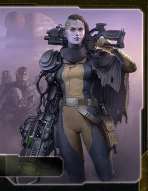

# Mentak Coalition Guide

---

## I. Introduction

The Mentak Coalition are TI4's pirate faction that steal trade goods via Pillage and ambush opponents with pre-combat hits through Ambush. They excel at economic theft from wealthy neighbors and leverage cruiser-heavy fleets for sustained aggression. Mentak rewards positioning near high-commodity factions, understanding when to Pillage versus avoid conflict, and building cruiser swarms for Ambush and Commander synergies.

The payoff? Being a potentially rich bitch leveraging your mobility and faction tech. Steal opponent economies through Pillage, strike with pre-combat Ambush hits, and extract promissory notes via Commander after every space combat victory.

## II. Playstyle

Playing Mentak Coalition is like being a opportunistic corsair—you position near wealthy trade routes and extract value from every passing transaction. Your Pillage steals TGs whenever neighbors gain 3+ (passive income all game), your Ambush fires cruiser/destroyer shots before combat begins (free hits), and your cruiser-focused fleet leverages these abilities for economic and military dominance. You're not trying to win through traditional economy—you're winning through theft, ambush tactics, and leveraging your 2-tech starting advantage.

The key strength of Mentak is economic parasitism. Normal factions build economies through planets and trade. You steal economies through Pillage—every neighbor transaction, every Trade refresh, every deal generates TGs for you automatically. Over a game, Pillage generates 15-25 free TGs (around 2 Trade strategy cards worth of value) just from sitting next to wealthy factions.

Opponents will try to minimize Pillage by spending TGs before hitting 3, trading Promise of Protection for immunity, or avoiding your borders. That moment when you've Pillaged 20+ TGs by R5, ambushed fleets with pre-combat cruiser hits, and extracted 4 promissory notes via Commander? Pure pirate efficiency.

---

## III. The Basics

### A. Home System & Commodities

**Home System:**
- **Moll Primus:** 4 resources / 1 influence
- **Total: 4 resources / 1 influence (4 optimal resources / 1 optimal influence)**

**Commodities:** 2

**Notes:** Single-planet home with 4 resources and only 1 influence. The 4 resources fund military production (excellent for building cruiser swarms), but 1 influence is terrible for politics and influence objectives. Single-planet home is easier to defend than multi-planet systems. Low commodity count (2) is below average—you gain more from Pillaging opponents than refreshing your own commodities.

### B. Starting Fleet

- 1 Carrier
- 2 Cruisers
- 3 Fighters
- 4 Infantry
- 1 Space Dock
- 1 PDS

**Notes:** Problematic starting situation due to lack of carry capacity. You have 4 infantry but only 1 carrier with capacity 4—your 2 cruisers have no capacity. You'll need to build more carriers early for expansion.

### C. Starting Technologies

**Sarween Tools (Yellow)** - When you use PRODUCTION, reduce the combined cost of produced units by 1.

**Plasma Scoring (Red)** - When 1 or more of your units use BOMBARDMENT or SPACE CANNON, 1 of those units may roll 1 additional die.

**Notes:** Good for defense and economy early game, but not much else.

### D. Faction Abilities

**Ambush (Faction Ability):** At the start of a space combat, you may roll 1 die for each of up to 2 of your cruisers or destroyers in the system. For each result equal to or greater than that ship's combat value, produce 1 hit; your opponent must assign it to 1 of their ships.

Pre-combat hit ability. Before combat dice are rolled, choose up to 2 cruisers/destroyers in the system. Roll 1 die per ship. If result ≥ that ship's combat value, deal 1 hit to opponent (they must assign to a ship). Cruiser I has Combat 7, Destroyer I has Combat 9—so you need 7+ or 9+ to hit. After upgrading to Cruiser II (Combat 6), your ambush hits on 6+. This is free damage before combat even begins.

**Pillage (Faction Ability):** After 1 of your neighbors gains trade goods or resolves a transaction, if they have 3 or more trade goods, you may take 1 of their trade goods or commodities.

Passive theft ability. After a NEIGHBOR (adjacent player) gains TGs or resolves a transaction (trade goods, action card effects, strategy cards, etc.), if they now have 3+ TGs, you may steal 1 TG or 1 commodity from them. This triggers passively—you don't spend actions, it just happens whenever conditions are met.

**Triggers:**
- Neighbor refreshes commodities via Trade strategy (gains TGs → you Pillage 1)
- Neighbor receives transaction from another player (gains TGs → you Pillage 1)
- Neighbor activates ability that grants TGs (you Pillage 1)

**Key Limitation:** Only works on NEIGHBORS (players adjacent on the map). Position yourself to neighbor wealthy factions.

### E. Leaders

**Agent - Suffi An:**

After the Pillage faction ability is used against another player: You may exhaust this card; if you do, you and that player each draw 1 action card.

Pillage reward agent. After you Pillage an opponent (not yourself), exhaust agent: both you and Pillaged player draw 1 action card. Good diplomatic tool—softens the blow of Pillage (they get action card compensation) while giving you extra cards.

**Commander - S'ula Mentarion:** *Unlock: Have 4 cruisers on the game board.*

After you win a space combat: You may force your opponent to give you 1 promissory note from their hand.

Promissory extraction commander. After unlocking, every space combat victory lets you FORCE opponent to give you 1 promissory note from their hand. Over a game, you can make some sneaky plays for PN notes.

**Hero - Ipswitch, Loose Cannon:** *Unlock: Have 3 scored objectives.*

**Sleeper Cell - At the start of a space combat that you are participating in:** You may purge this card; if you do, for each other player's ship that is destroyed during this combat, place 1 ship of that type from your reinforcements in the active system.

Ship replication hero. At start of a space combat: purge hero card. For EACH enemy ship destroyed during the combat, place 1 matching ship from your reinforcements in the system. Can be almost impossible to beat—you convert enemy losses into your gains, potentially doubling your fleet mid-combat.

### F. Promissory Note - **Promise of Protection**

ACTION: Place this card faceup in your play area. While this card is in your play area, the Mentak player cannot use their Pillage faction ability against you. If you activate a system that contains 1 or more of the Mentak player's units, return this card to the Mentak player.

Pillage immunity. Give a player immunity from your Pillage as long as they don't activate systems with your units.

**Strategic Usage:**
- **R1-R2: Extract a good deal for your PN.** Find a neighbor that won't generate many TGs (low commodities, poor economy) but still wants to pay for your PN. Get value from a neighbor you wouldn't be pillaging much anyway.
- **Example:** Trade PN to Sardakk/Arborec/Last Bastion for alliance or support for throne. They have low commodity counts so you'd barely pillage them, but they still fear Pillage and will pay for immunity.
- **Better use:** Befriend aggressive neighbors to let you focus on pirate things elsewhere.
- If you can't pillage your best target, the value must be very solid before giving up that Pillage income.

Trade value: HIGH for wealthy factions (3-4 TG equivalent or alliance).

### G. Alliance

**Alliance Ability:**
*While the Mentak player's commander is unlocked:*
*After you win a space combat, you may force your opponent to give you 1 promissory note from their hand.*

Very valuable alliance—depends on how rich the faction that gets it can be. Extract promissory notes from combat victories just like Mentak's Commander. Trade value: 3-4 TG.

### H. Mech - **Moll Terminus**

Cost: 2 | Combat: 6 | **Sustain Damage**

**Special Ability:** Other players' ground forces on this planet cannot use Sustain Damage.

Sustain denial mech (ground version of your flagship). Enemy mechs and infantry on the same planet cannot use Sustain Damage. Place on contested planets during invasions to deny opponent ground force Sustain. Combined with bombardment, this shreds opponent ground defenses.

### I. Flagship - **Fourth Moon**

Cost: 8 | Combat: 7 (x2) | Move: 1 | Capacity: 3 | **Sustain Damage**

**Special Ability:** Other players' ships in this system cannot use SUSTAIN DAMAGE.

Sustain denial flagship. All enemy ships in the system cannot use Sustain Damage. Can be a counter to dreadnought-heavy factions, but can also have low amount of impact depending on opponent fleet composition. Combined with Ambush (pre-combat hits), it can delete opponent capital ships before they can respond.

### J. Faction Technologies

**Mirror Computing (Yellow/Yellow/Yellow)** - When you spend trade goods, each trade good is worth 2 resources or influence instead of 1.

Triple-yellow tech. TGs are worth 2 resources or 2 influence each instead of 1. If you have 5 TGs, you can spend them as 10 resources or 10 influence. This is massive value for Pillage-based economy—stolen TGs become 2x value. The 3 yellow prerequisite is steep (Sarween Tools → Neural Motivator/Graviton → Mirror Computing), but if you Pillage heavily, it's worth it.

**Salvage Operations (Yellow/Yellow)** - After you win or lose a space combat, gain 1 trade good; if you won the combat, you may also produce 1 ship in that system of any ship type that was destroyed during the combat.

Double-yellow tech. After ANY space combat (win or lose), gain 1 TG. If you WON, also produce 1 ship matching any type destroyed during combat (free production). If 3 cruisers died (yours or theirs), produce 1 cruiser for free. Over 5-7 combats per game, this generates 5-7 TGs + 5-7 free ships. Excellent value for aggressive playstyle.

### K. Slice and Draft Considerations

**Speaker Order:**
- **Mentak is too weak to not have a solid position** - You need good slice and neighbor positioning
- **Probably required to pick low priority card to save your early game** - You may have to draft early to secure proper setup, even if it means lower faction priority
- **Position near rich neighbors** - Critical for Pillage. Lobby to sit next to Hacan, Empyrean, Jol-Nar, Deepwrought

**Slice Priorities:**
- **Prioritize a strong system nearby if you can't get multiple carriers** - Move 1 carriers limit expansion
- **Access to wormholes or other players** - You need wormhole access to reach other players for Pillage positioning and expansion
- **Entropic Scar is beast** - Your faction techs (Mirror Computing, Salvage Operations) are super strong
- **Focus on high optimals** - You're flexible with slices since you'll have lots of TG from Pillage
- **Influence planets** - You have 1 influence at home, need influence-heavy planets to balance

**Slice Features to Avoid:**
- **Isolated slices with no wormholes** - Can't access other players easily with Move 1 carriers, limits Pillage opportunities
- **Low influence slices** - You already have only 1 influence at home, can't afford more resource-heavy planets

**Summary:**
Mentak needs wormhole access or proximity to other players for Pillage positioning. Entropic Scar is beast. Influence planets help balance your weak home influence. Avoid isolation.

**Strategic Note:** Position near wealthy neighbors (Hacan, Xxcha, Jol-Nar) during draft to maximize Pillage value. Your weak starting fleet (Move 1 carrier) requires wormhole access or close proximity to other players.

### L. Breakthrough Technology

**The Table's Grace (Yellow<>Green)** - If you have the Cruiser II unit upgrade technology, flip this card and place it on top of Cruiser II.

**Corsair (Cruiser III):** If the active system contains another player's non-fighter ships, this unit can move through systems that contain other players' ships. Cost: 2 | Combat: 6 | Move: 3 | Capacity: 2

Cruiser super-upgrade. Requires Cruiser II first, then expedition this breakthrough. Your cruisers become Corsairs: Cost 2, Combat 6, Move 3, Capacity 2, can move THROUGH enemy systems (bypasses blockades). Can be skipped and gotten later to offset weak start. This is insane mobility—you can move through opponent fleets to reach objectives, bypass defenses, or strike deep into enemy territory.

---

## IV. Structural Weaknesses

### A. First Turn Priorities

Your R1 priority order:
1. **Production** - Great priority
2. **Technology** - Great priority
3. **Scoring** - Will have to be 3rd priority
4. **Breakthrough** - Only if readily available

**Economic Constraint:** Your economy will be too weak if you spend on all of these. Prioritize production and tech, then scoring only when economy allows.

**Expansion Notes:** You have 1 carrier, 2 cruisers, 3 fighters, and 4 infantry. Problematic starting situation due to lack of carry capacity. Focus on taking 2-3 systems R1 while positioning near wealthy neighbors for Pillage opportunities.

**Strategy Token Priority:** [User to provide]

### B. Neighbor-Dependent Pillage

Pillage only works on neighbors (adjacent players). If your neighbors are poor (Sardakk, Arborec, Last Bastion), Pillage generates minimal value.

**Mitigation:**
- During setup, lobby for seating next to Hacan, Empyrean, Jol-Nar, Deepwrought (wealthy factions)
- Expand to create new adjacencies mid-game (become neighbors with more players)
- Fracture is helpful to create new neighbors and expand Pillage opportunities
- Focus on Ambush instead if neighbors are poor

### C. Diplomacy and Player Anger Management

The hardest part of playing Mentak is managing diplomacy and dealing with everyone being angry at you. Pillage and Ambush make you a target for retaliation and coalition-building against you.

**Mitigation:**
- Use Promise of Protection strategically to befriend aggressive neighbors
- Time your Pillage carefully—don't steal from everyone every round
- Extract promissory notes via Commander to create political leverage
- Position yourself as a necessary ally against bigger threats
- Accept that some players will always hate you—focus on managing the most dangerous ones

---

## V. Technology

### A. Core Tech Path

**Starting Techs:**
- **Sarween Tools (GG)** - Reduce production costs by 1 resource. Saves 25+ resources over the game.
- **Plasma Scoring (RR)** - +1 die for Space Cannon or Bombardment. Good for home defense and invasions.

**Round 1: Neural Motivator (GG)**
- When 1 or more of your units use Production, you may exhaust this card to reduce the combined cost by the number of that unit's production value.
- **Why:** Essential economic tech. Needed as prerequisite for Cruiser II. Helps with your weak starting economy by reducing production costs. Strong foundation for your tech path.
- **Prerequisites:** 1 green (Sarween Tools)

**Round 2: Cruiser II (RR)**
- Cost: 2 | Combat: 6 | Move: 3 | Capacity: 1
- **Why:** Your #1 priority tech. Upgrades Ambush from 7+ (40% hit) to 6+ (50% hit). Move 3 gives repositioning flexibility. The capacity 1 is a bonus. Essential for your cruiser-based playstyle.
- **Prerequisites:** 1 green, 1 red, 1 yellow (Sarween Tools, Plasma Scoring, Neural Motivator)

**Round 3: Salvage Operations (YY) - Faction Tech**
- After you win or lose a space combat, gain 1 trade good; if you won and you destroyed 1 or more of your opponent's ships, you may place 1 ship from your reinforcements in that system's space area.
- **Why:** Your signature combat tech. Gain 1 TG after EVERY combat (win or lose). If you win, also produce 1 free ship. For aggressive Mentak, this generates 7+ TGs and 7+ free ships over the game. Incredible value.
- **Prerequisites:** 2 yellow (Neural Motivator + Sarween Tools)
- **Note:** If you can't get Salvage Operations Round 3, you need to find a double tech opportunity—research 1 yellow prerequisite + Salvage Operations in the same round using Technology strategy card or other double-tech methods

**Round 4: Mirror Computing (YY) - Faction Tech**
- When you spend trade goods, each trade good is worth 2 resources or 2 influence instead of 1.
- **Why:** Doubles the value of every TG you Pillage. If you steal 20 TGs via Pillage, Mirror Computing makes them worth 40 resources/influence. Synergizes with Salvage Operations. Late-game economy multiplier.
- **Prerequisites:** 2 yellow (Salvage Operations + Neural Motivator or Sarween Tools)

**Round 5+:** Objectives-based techs or late-game options

### B. Key Technologies

**Cruiser II (RR):**
Essential for your faction. Upgrades Ambush hit chance and gives move 3 for repositioning. Your cruiser swarm strategy depends on this tech. Get this Round 2.

**Mirror Computing (YY):**
Your economic multiplier. Doubles value of Pillaged TGs. Every TG you steal becomes worth 2 resources/influence. Late-game this makes you extremely wealthy. Critical tech for leveraging your pirate economy.

### C. Late-Game Options

**Blue-Skip Gravity Drive (BB):**
If you blue-skip Gravity Drive (using Technology strategy card's blue-skip ability), your cruisers gain the base move 3 + Gravity Drive's +1 movement = **move 4**. This creates surprise plays—you can reach targets opponents don't expect. Very powerful for Pillage positioning and combat strikes.

**PDS II (RR) - For Unit Upgrade Objectives:**
Good combo with your starting structure and Plasma Scoring. If you need a 2nd unit upgrade for "Develop Weaponry" objective, PDS II works well. Your Plasma Scoring already gives +1 die to Space Cannon, and upgrading to PDS II (Space Cannon 5 x2) makes your home defense very strong.

**Integrated Economy (GG) - For Spice:**
Late-game tech to leverage your riches. After you gain control of a planet, you may produce up to 2 units on that planet. With your wealth from Pillage + Mirror Computing, you can afford massive production across the map. Use this to convert your economic advantage into fleet superiority.

---

## VI. Strategy Cards

### A. Round 1 Priority

1. **Construction** - Production at home for expansion
2. **Technology** - Helps R1 token economy and resources. Progress toward Cruiser II
3. **Trade** - Around 10 TG (3 TG + 2 commodities + ~5 TG from other players)
4. **Leadership** - CCs for expansion + positioning near wealthy neighbors
5. **Warfare** - Enables R1 expansion. Preferable not to take, but can be necessary
6. **Politics** - Speaker for agenda control (though 1 influence limits voting power)
7. **Diplomacy** - Helps others more than you
8. **Imperial** - Never R1

### B. Round 2+ Priority

**Love:**
- **Leadership** - CCs for expansion and positioning near wealthy neighbors for Pillage
- **Technology** - Top priority to accelerate to Mirror Computing. Cruiser II and Salvage Operations are essential techs

**Like:**
- **Imperial** - Points are points
- **Politics** - Agenda control, though low influence limits effectiveness
- **Construction** - Forward dock for continued production. You also have decent PDS with Plasma Scoring

**Situational:**
- **Trade** - You want people to be rich so you can pillage more. Offer deals like getting a free refresh or X+1 to make people feel comfortable taking Trade. The richer they get, the more you can steal

**Hate:**
- **Warfare** - After round 1
- **Diplomacy** - Not about defending. Helps others more than you

---

## VII. Intermediate

### A. Unit Composition

Your fleet composition is unique—cruisers operate independently from your main fleet:

**Independent Cruiser Strikes:**
- **2-4 Cruisers (alone)** - Cruisers have move 3 (move 4 with Gravity Drive), allowing sneaky maneuvers
- Other ships can't follow cruisers due to movement speed difference
- Send cruisers alone to strike targets, extract promissory notes, and Pillage positioning
- Ambush pre-combat hits make solo cruiser groups dangerous
- **Spec Pirate Combo:** Cruisers + Mechs = lethal combination. Cruisers transport mechs (capacity 1), mechs deny Sustain Damage on ground invasions

**Main Fleet (Home Defense & Late Game):**
- **Dreadnoughts** - For late-game slice safety and heavy combat
- **Carriers** - For capacity and troop transport
- **Fighters** - Absorb hits
- **Infantry** - Ground forces

With Mirror Computing economy, you can afford expensive ships like dreadnoughts for slice defense while your mobile cruisers operate independently across the map. Cruisers do the pirate work, capital ships defend territory.

### B. Point Planning

**Mentak Christmas-Land Strategy Cards:**

| Round | Card        | Public Points | Secret Points | MR Points | Bonus | Total |
|-------|-------------|---------------|---------------|-----------|-------|-------|
| One   | Construction| 0             | 0             | 0         | 0     | 0     |
| Two   | Technology  | 1             | 0             | 0         | 0     | 1     |
| Three | Leadership  | 2             | 1             | 0         | 0     | 3     |
| Four  | Imperial    | 4             | 2             | 1         | 0     | 7     |
| Five  | Leadership  | 6             | 3             | 1         | 2     | 12    |

You can only score 1 public objective per round (2 if you have Imperial). When you take Imperial, you can double score publics. Aim to score all 3 secrets across the game.

**Notes:**
- **Construction → Technology** - Setup expansion and tech path to Mirror Computing
- **Leadership** - Spam production and positioning for Pillage
- **Imperial** - Score points (you probably won't control MR—focus on public objectives instead)
- Your weak economy R1-R2 means you'll score slower than other factions. Accelerate to Mirror Computing to catch up mid-game

### C. Game Plan

**Focus on Economic Development and Board Presence:**

Mentak is weak early game but scales into a rich, mobile menace with cruiser swarms. Your game plan:

**R1-R2: Survival and Setup**
- Expand with Construction and grab systems near rich neighbors
- Tech to Neural Motivator → Cruiser II
- Position yourself adjacent to wealthy factions (Hacan, Empyrean, Jol-Nar, Deepwrought)
- Start Pillaging TGs from neighbor transactions
- **Priority: Keep your ships out on the board.** More ships on board = more Pillage opportunities and threat projection

**R3-R4: Acceleration**
- Get Salvage Operations and Mirror Computing
- Build cruiser swarms with Ambush
- **Cruiser II gives excellent opportunity to find value in Fracture.** Use move 3 cruisers to reach Fracture for relics and legendary planets
- Start extracting promissory notes via Commander (unlock at 4 cruisers)
- Mecatol Rex is probably out of reach—focus on Fracture and objectives instead

**R5+: Dominance**
- You're now rich from Pillage + Mirror Computing
- Cruiser swarms with Ambush make you dangerous in combat
- Use Hero to replicate enemy dreadnoughts/war suns for massive tempo swing
- Convert economic advantage to points

**Diplomacy and Pillage Policy:**
- **Try and keep some semblance of peaceful relations with your cash cows.** You want rich neighbors to stay rich so you can pillage more.
- **A big part of not making people angry is being fair.** Pillage equally—don't target one player too much. Spread the pain across multiple neighbors.
- **No one should be exempted unless they pay in other favors.** Don't give away Promise of Protection for free.
- Extract value from every neighbor—either pillage them or make them pay to avoid being pillaged.
- Keep ships spread across the board to maximize adjacencies and Pillage opportunities.

**Note:** Commander promissory extraction is hard, but PN Bonus point can be used for late-game sneaky ways to get Support for the Throne.

---

## VIII. Objectives

### A. Stage I Objectives

| Stage I Objective                                                       | Status |
|-------------------------------------------------------------------------|--------|
| Erect a Monument (Spend 8 resources)                                    | 🟢     |
| Sway the Council (Spend 8 influence)                                    | 🟡     |
| Negotiate Trade Routes (Spend 5 trade goods)                            | 🟢     |
| Lead from the Front (Spend 3 tokens from tactic/strategy pools)         | 🟡     |
| Diversify Research (Own 2 tech in each of 2 colors)                     | 🟢     |
| Develop Weaponry (Own 2 unit upgrade technologies)                      | 🟢     |
| Found Research Outposts (Control 3 planets with tech specialties)       | 🔴     |
| Intimidate the Council (Ships in 2 systems adjacent to MR)              | 🟢     |
| Expand Borders (Control 6 planets in non-home systems)                  | 🟢     |
| Corner the Market (Control 4 planets with same trait)                   | 🔴     |
| Amass Wealth (Spend 3 influence, 3 resources, 3 trade goods)            | 🟢     |
| Build Defenses (Have 4 or more structures)                              | 🟡     |
| Discover Lost Outposts (Control 2 planets with attachments)             | 🔴     |
| Engineer a Marvel (Have flagship or war sun on board)                   | 🟡     |
| Explore Deep Space (Units in 3 systems without planets)                 | 🟢     |
| Improve Infrastructure (Structures on 3 planets outside HS)             | 🟡     |
| Make History (Units in 2 systems with legendary/MR/anomalies)           | 🟢     |
| Populate the Outer Rim (Units in 3 edge systems)                        | 🟢     |
| Push Boundaries (Control more planets than each neighbor)               | 🟢     |
| Raise a Fleet (5+ non-fighter ships in 1 system)                        | 🟢     |

**Legend:** 🟢 Easy | 🟡 Moderate | 🔴 Difficult

### B. Secret Objectives

| Secret Objective                                                         | Status |
|--------------------------------------------------------------------------|--------|
| Unveil Flagship (Win space combat with flagship)                         | 🟡     |
| Turn their Fleets to Dust (SPACE CANNON destroy last ship)              | 🟡     |
| Destroy their Greatest Ship (Destroy war sun/flagship)                   | 🟢     |
| Spark a Rebellion (Win combat vs VP leader)                              | 🟢     |
| Threaten Enemies (Ships adjacent to another player's HS)                | 🟢     |
| Make an Example (BOMBARDMENT destroy last ground forces)                | 🔴     |
| Cut Supply Lines (Ships in system with enemy space dock)                | 🟢     |
| Monopolize Production (Control 4 industrial planets)                     | 🟡     |
| Mine Rare Minerals (Control 4 hazardous planets)                        | 🟡     |
| Forge an Alliance (Control 4 cultural planets)                          | 🟡     |
| Become a Martyr (Lose control of planet in home system)                 | 🔴     |
| Betray a Friend (Win combat vs player whose PN you have)                | 🟢     |
| Brave the Void (Win combat in anomaly)                                  | 🟢     |
| Darken the Skies (Win combat in another player's HS)                    | 🟡     |
| Defy Space and Time (Units in wormhole nexus)                           | 🟡     |
| Demonstrate your Power (3+ non-fighter ships after space combat)        | 🟢     |
| Destroy Heretical Works (Purge 2 relic fragments)                       | 🔴     |
| Dictate Policy (3+ laws in play)                                        | 🔴     |
| Drive the Debate (You/your planet elected by agenda)                    | 🔴     |
| Establish Hegemony (Control planets with 12+ influence)                 | 🔴     |
| Adapt New Strategies (Own 2 faction technologies)                       | 🟢     |
| Master the Laws of Physics (Own 4 tech of same color)                   | 🔴     |
| Form a Spy Network (Discard 5 action cards)                             | 🟢     |
| Gather a Mighty Fleet (Have 5 dreadnoughts)                             | 🟡     |
| Establish a Perimeter (Have 4 PDS on board)                             | 🔴     |
| Fuel the War Machine (Have 3 space docks)                               | 🟡     |
| Become the Gatekeeper (Ships in alpha and beta wormhole systems)        | 🟡     |
| Learn Secrets of the Cosmos (Ships in 3 systems adjacent to anomalies)  | 🟢     |
| Control the Region (Ships in 6 systems)                                 | 🟢     |
| Occupy the Seat of the Empire (Control MR with 3+ ships)                | 🟡     |
| Fight With Precision (AFB destroy last fighter)                         | 🔴     |
| Foster Cohesion (Be neighbors with all players)                         | 🟢     |
| Hoard Raw Materials (Control planets with 12+ resources)                | 🟢     |
| Mechanize the Military (1 mech on each of 4 planets)                    | 🟡     |
| Occupy the Fringe (9+ ground forces on planet without space dock)       | 🔴     |
| Produce en Masse (Units with PRODUCTION 8+ in single system)            | 🔴     |
| Prove Endurance (Last to pass)                                          | 🟡     |
| Seize an Icon (Control legendary planet)                                | 🟢     |
| Stake Your Claim (Control planet in contested system)                   | 🟢     |
| Strengthen Bonds (Have another player's PN)                             | 🟢     |

### C. Stage II Objectives

| Stage II Objective                                                       | Status |
|--------------------------------------------------------------------------|--------|
| Centralize Galactic Trade (Spend 10 trade goods)                         | 🟢     |
| Found a Golden Age (Spend 16 resources)                                  | 🟢     |
| Galvanize the People (Spend 6 tokens from tactic/strategy pools)         | 🟢     |
| Manipulate Galactic Law (Spend 16 influence)                             | 🟢     |
| Hold Vast Reserves (Spend 6 influence, 6 resources, 6 trade goods)       | 🟢     |
| Command an Armada (Have 8+ non-fighter ships in 1 system)                | 🟢     |
| Achieve Supremacy (Flagship/War Sun in another player's HS or MR)        | 🔴     |
| Become a Legend (Units in 4 systems with legendary/MR/anomalies)         | 🟡     |
| Conquer the Weak (Control 1 planet in another player's HS)               | 🟡     |
| Rule Distant Lands (Control 2 planets in/adjacent to different players' HS) | 🟡     |
| Patrol Vast Territories (Units in 5 systems without planets)             | 🟡     |
| Control the Borderlands (Units in 5 edge systems not HS)                 | 🟡     |
| Subdue the Galaxy (Control 11 planets in non-home systems)               | 🔴     |
| Protect the Border (Structures in 5 different systems)                   | 🔴     |
| Reclaim Ancient Monuments (Control 3 planets with attachments)           | 🟡     |
| Master the Sciences (Own 2 technologies in each of 4 colors)             | 🔴     |
| Revolutionize Warfare (Own 3 unit upgrade technologies)                  | 🟢     |
| Unify the Colonies (Control 6 planets of the same trait)                 | 🔴     |

**Legend:** 🟢 Likely | 🟡 Possible | 🔴 Difficult

**Notes:**
- All Stage II spending objectives are easy—your economy (Pillage + Mirror Computing) should have kicked in by then
- Early game (Stage I) spending can be kind of annoying before your economy scales up
- Combat objectives favor aggressive playstyle
- Mobile cruiser fleets give you good map presence for territorial objectives

---

## IX. Alliance Priority

Alliance preference ranking based on commander utility:

**Top Tier (Money-Making):**
1. **Muaat** (Magmus) - Gain 1 TG after spending strategy pool token. Incredible passive income.
2. **Titans of Ul** (Tungstantus) - Gain 1 TG when using production. Synergizes perfectly with your playstyle.
3. **Crimson Rebellion** (Ahk Siever) - Gain 1 commodity/TG after any combat. You fight constantly—this prints money.
4. **Deepwrought** (Aello) - Gain commodity/TG when others research tech. Passive income.

**Useful:**
5. **Nomad** (Navarch Feng) - Produce flagship without spending resources. Free flagship production.
6. **Yin Brotherhood** (Brother Omar) - Satisfies green prerequisite and ignore tech prerequisites when researching other players' techs. Tech flexibility.
7. **Empyrean** (Xuange) - Return command tokens when other players move into systems with your tokens. Command token efficiency.
8. **Vuil'raith** (That Which Molds Flesh) - Up to 2 fighters/infantry don't count against production limit. Extra production capacity.
9. **Yssaril** (So Ata) - Look at other players' action cards/promissory notes/secrets when they activate systems with your units. Extra value as deterrent since you'll be attacked a lot.

---

## X. End Notes

Mentak Coalition is a low-tier faction that makes people mad. You thrive on economic theft and mobile cruiser warfare. Your success depends on:

**Neighbor Selection:**
Position yourself next to rich, non-aggressive neighbors. You want factions with high commodity counts that will generate lots of TGs through trade, not combat-focused factions that will retaliate when you Pillage them.

**The Angry Table Problem:**
The hardest part of playing Mentak is managing the table's anger. Everyone hates being pillaged. You need to:
- Be fair with Pillage distribution—spread the pain equally
- Use diplomacy to keep some semblance of peaceful relations with your cash cows
- Extract value from Promise of Protection deals with neighbors who fear you
- Accept that you'll be a target, and position accordingly

**Economic Scaling:**
You start weak but scale into a wealthy, mobile menace. Pillage generates passive income. Mirror Computing doubles your stolen TG value. By late game, you're rich enough to afford expensive fleets and buy political influence.

**What's yours is ours, AAARRRRR!**
