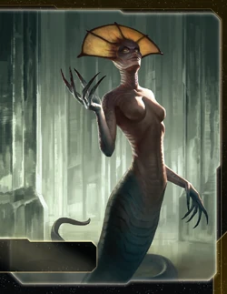

# Naalu Collective Guide

---

## I. Introduction

The Naalu Collective are TI4's initiative-0 faction that always acts first in the action phase. They excel at timing precision, fighter superiority through Hybrid Crystal Fighters (Combat 8 with capacity), and defensive retreats via Foresight. Naalu rewards perfect sequencing, objective theft through first-action advantage, and leveraging superior fighter swarms to dominate space combat.

The payoff? Acting first every single action phase lets you steal objectives before opponents, claim Mecatol Rex when you want it, and position perfectly while everyone else watches. Your fighters having capacity means massive transport efficiency. When you master initiative-0 timing and fighter swarm builds, every round you score first and every battle your fighters overwhelm enemy fleets.

## II. Playstyle

Playing Naalu Collective is like being a precognitive chess grandmaster—you see the board state and act before anyone else can respond. Your Telepathic ability gives you 0 initiative every round, your Foresight retreats ships before combat begins, and your Hybrid Crystal Fighters (Combat 8 with Capacity 1 each) create massive fighter swarms that transport entire armies. You're not trying to win through brute force—you're winning through perfect timing, objective theft, and overwhelming fighter superiority.

The key strength of Naalu is action priority. Initiative 0 means you ALWAYS act first—before Speaker, before everyone. This lets you grab objectives the moment they're revealed, take Mecatol Rex when you choose, and position fleets before opponents can counter. Understanding WHEN to act (not just how) separates good Naalu players from great ones.

Opponents will struggle to compete—you act first, score first, and retreat before losses. That moment when you've stolen 3 objectives by acting first each round and your 24-fighter swarm rolls 24 dice in space combat? Pure dominance.

---

## III. The Basics

### A. Home System & Commodities

**Home System:** Druaa (3 resources / 1 influence), Maaluuk (0 resources / 2 influence)

**Commodities:** 3

**Notes:** Two-planet home system with 3/3 total (low but balanced). Druaa provides 3 resources for military production, Maaluuk provides 2 influence for politics. The total 3/3 is below average—most factions have 4-6. You must expand aggressively R1-2 to build economy. Two-planet home is easier to defend than single-planet systems.

### B. Starting Fleet

- 1 Carrier
- 1 Cruiser
- 1 Destroyer
- 3 Fighters (Hybrid Crystal Fighters I)
- 4 Infantry
- 1 Space Dock
- 1 PDS

**Notes:** Solid starting fleet with carrier + cruiser + destroyer for immediate expansion. You start with 3 Hybrid Crystal Fighters (Combat 8, Capacity 1 each). The starting PDS provides home defense. Your fighters can already transport infantry from turn 1—exceptional early capacity.

### C. Starting Technologies

**Sarween Tools (Yellow)** - When you use PRODUCTION, reduce the combined cost of produced units by 1.

**Neural Motivator (Green)** - When you gain command tokens during the status phase, gain 1 additional command token.

**Notes:** Two starting techs (strong position). Sarween Tools is one of the best techs in the game—saves 1 resource per production, adding up to 20-30 saved resources over a game. Neural Motivator gives +1 CC per status phase (5 rounds = 5 extra CCs). Excellent economic foundation.

### D. Faction Abilities

**Telepathic (Faction Ability):** At the end of the strategy phase, place the Naalu "0" token on your strategy card; you are first in initiative order.

Your defining ability. At end of strategy phase, you become initiative 0—you act FIRST in the action phase, before Speaker, before everyone. This is permanent every round. You ALWAYS go first. This is absurdly powerful for objective scoring (score before opponents), Mecatol Rex claims (take it when you want), and positioning (act before counters).

**Foresight (Faction Ability):** After another player moves ships into a system that contains 1 or more of your ships, you may place 1 token from your strategy pool in an adjacent system that does not contain another player's ships; move your ships from the active system into that system.

Pre-combat retreat ability. When opponent activates a system with your ships, you may spend 1 CC from strategy pool to move ALL your ships to an adjacent empty system. This happens BEFORE combat—you retreat before battle begins. Use this to preserve forces, bait opponent CCs, or avoid bad fights. Key limitation: only works when OPPONENT activates (not you).

### E. Leaders

**Agent - Z'eu (Temporal Entanglement):**

After any player's command token is placed in a system: You may exhaust this card to return that token to that player's reinforcements.

CC refund agent. When ANY player (including you or opponents) places CC in system, exhaust agent to return that CC immediately. Use offensively: opponent activates system, you refund their CC (they wasted the activation). Use defensively: you activate system, refund your own CC (free activation). Use politically: "I'll refund your CC if you vote my way."

**Commander - M'aban (Codex 3):** *Unlock: Have ground forces in or adjacent to the Mecatol Rex system.*

At any time: You may look at your neighbors' hands of promissory notes and the top and bottom card of the agenda deck.

Information commander. Easy unlock (just have ground forces in/adjacent to MR system, achievable R2-3). After unlocking, you see: (1) neighbor promissory hands (know their diplomatic options), (2) top agenda card (know what's coming), (3) bottom agenda card (full agenda knowledge over time). This is intelligence advantage—you know opponent capabilities and upcoming agendas.

**Hero - The Oracle (Codex 3):** *Unlock: Have 3 scored objectives.*

**C-Radium Geometry - At the end of the status phase:** You may force each other player to give you 1 promissory note from their hand. If you do, purge this card.

Promissory theft hero. R4-5 when unlocked, at end of status phase: force ALL opponents to give you 1 promissory note each. In 6-player game, this is 5 promissories instantly. You gain Support for Throne (points), Alliance promissories (economy), or faction-specific notes (abilities). This is massive political leverage.

### F. Promissory Note - **Gift of Prescience**

At the end of the Strategy Phase: Place this card faceup in your play area and place the Naalu "0" token on your strategy card; you are the first in initiative order. The Naalu player cannot use his Telepathic faction ability during this game round. Return this card to the Naalu player at the end of the status phase.

Initiative-0 transfer. Give another player your Telepathic ability for one round—they act first instead of you. Trade value: VERY HIGH (4-5 TG or alliance). Best for players who desperately need first action (Winnu taking MR, someone scoring critical objective). You lose initiative-0 that round (risk), but gain massive favor (reward).

### G. Alliance

Other players cannot use SPACE CANNON against your ships in systems that contain 1 or more of your structures.

SPACE CANNON immunity near your structures. Solid defensive value. Build PDS/docks on border planets, your ships are immune to enemy PDS in those systems. Trade value: 3-4 TG.

### H. Mech - **Iconoclast (Temporal Entanglement)**

Cost: 2 | Combat: 6 | **Sustain Damage**

**DEPLOY:** When another player gains a relic, place 1 mech on any planet you control.

Relic-triggered mech. When ANY player (opponent or you) gains a relic, spawn 1 mech on any of your planets for free. This is passive mech generation—opponents exploring and gaining relics spawns your mechs. Over a game, this spawns 3-5 free mechs. Place mechs on border planets for defense or contested planets for invasion support.

### I. Flagship - **Matriarch**

Cost: 8 | Combat: 9 (x2) | Move: 1 | Capacity: 6 | **Sustain Damage**

**Special Ability:** During an invasion in this system, you may commit fighters to planets as if they were ground forces. When combat ends, return those units to the space area.

Fighters-as-ground-forces flagship. During invasions, your fighters can participate in ground combat AS ground forces. After ground combat ends, fighters return to space. This means: (1) Load flagship with 6 infantry + have 12 fighters in system, (2) Invade planet with 6 infantry + 12 fighters = 18 ground combat dice, (3) After ground combat, 12 fighters return to space for continued operations. This makes invasions overwhelming.

**Strategic Implications:**
- Flagship + 24 fighters = 24 ground combat dice for invasions
- Fighters survive ground combat (return to space after)
- You can conquer heavily defended planets with fighter swarms

### J. Faction Technologies

**Hybrid Crystal Fighter II (Green/Blue)** - Naalu Fighter II

Combat: 7 | Move: 2 | This unit may move without being transported. Each fighter in excess of your ships' capacity counts as 1/2 of a ship against your fleet pool.

Your fighter upgrade. Combat improves from 8 to 7, Move 2, can move independently (don't need carriers to move them), and excess fighters count as 0.5 ships for fleet pool (you can have 2x fighters in fleet). With Capacity 1 retained, these are devastating. Fighters become Combat 7, Move 2, Capacity 1, independent movement, half fleet cost. Research this R3-4.

**Neuroglaive (Green/Green/Green)** - After another player activates a system that contains 1 or more of your ships, that player removes 1 token from his fleet pool and returns it to his reinforcements.

Triple-green tech. When opponent activates system with your ships, they lose 1 fleet supply token (returns to reinforcements, not their pools). This reduces their fleet capacity by 1. If you have fighters in 5 opponent systems, they lose 5 fleet supply—crippling. The 3 green prerequisite is steep—only research if heavily invested in green (Neural Motivator → Bio-Stims → Neuroglaive).

### K. Breakthrough Technology

**Mindsieve (Red<>Green)** - When you would resolve the secondary ability of another player's strategy card, you may give them a promissory note to resolve it without spending a command token.

Free secondaries via promissory. When following another player's strategy card secondary, instead of spending CC, give them a promissory note. This is amazing economy—you follow Tech/Construction/Leadership/etc. for free by trading promissories. Over a game, this saves 10+ CCs (20+ TG equivalent). Research this R4-5 if you have Red + Green investment.

---

## IV. Structural Weaknesses

### A. Low Starting Economy

3/3 home system is below average. You must expand aggressively R1 to compete economically.

**Mitigation:**
- Take Warfare/Leadership R1 for aggressive expansion
- Use initiative-0 to claim best planets before opponents
- Target 3-4 planets by end of R1

### B. Predictable Initiative-0

Everyone knows you act first every round. Opponents can plan around your priority action.

**Mitigation:**
- Stay unpredictable (don't always grab MR or same objectives)
- Use initiative-0 for different priorities each round
- Bluff intentions during strategy phase

### C. Foresight Limitations

Foresight only works when OPPONENTS activate your systems. You can't use it offensively (when you activate).

**Mitigation:**
- Place speed-bump fighters in key systems to trigger Foresight
- Position ships to have multiple adjacent retreat options
- Don't overextend into systems with no escape routes

### D. Fighter Dependency

Your power revolves around fighters. Factions with strong AFB (Anti-Fighter Barrage) counter you hard (Argent Flight, Barony, etc.).

**Mitigation:**
- Research Destroyer II (AFB 6(x2)) to protect fighters
- Build enough fighters that AFB losses don't matter (24+ fighters)
- Use fighter capacity to transport infantry (even if fighters die, infantry land)

---

## V. Technology

### A. Recommended Tech Paths

**Path 1: Fighter Superiority**
1. Sarween Tools / Neural Motivator (Start)
2. Carrier II (R2-3)
3. Hybrid Crystal Fighter II (R3-4) *faction tech*
4. Gravity Drive (R4)
5. Fleet Logistics (R5)

**Path 2: Economic Dominance**
1. Sarween Tools (Start)
2. AI Development Algorithm (R2)
3. Carrier II (R2-3)
4. Destroyer II (R3-4)
5. Gravity Drive (R4-5)

**Path 3: Balanced**
1. Neural Motivator (Start)
2. Sarween Tools (Start)
3. Antimass Deflectors (R2)
4. Destroyer II (R3)
5. Carrier II (R4)
6. Hybrid Crystal Fighter II (R5)

### B. Key Technologies

**Sarween Tools:** You start with this. Use it every production—over 25 builds, saves 25 resources.

**Neural Motivator:** You start with this. Gain +1 CC per status phase = 5 extra CCs over game.

**Carrier II:** Move 2, Capacity 8. Essential for transporting fighter swarms + infantry.

**Hybrid Crystal Fighter II:** Your faction tech. Fighters become Combat 7, Move 2, Capacity 1, independent movement, half fleet cost. Research R3-4 for fighter swarm dominance.

**Gravity Drive:** Mobility for repositioning fleets and reaching distant objectives.

**Destroyer II:** AFB 6(x2), Move 2. Protects your fighters from enemy AFB and provides screen.

---

## VI. Strategy Cards

### Round One

**GREAT:**
- Warfare (enables R1 aggression + exploration)
- Technology (progress toward Carrier II or Fighter II)
- Leadership (CCs for expansion)

**GOOD:**
- Trade (3 commodities + TGs)
- Politics (Speaker for agenda control—though you already act first!)

**MEDIOCRE:**
- Construction (forward dock is okay)
- Imperial (unlikely to score R1, even with initiative-0)

**BAD:**
- Diplomacy (you have Foresight for defense; redundant)

### General Preferences

**Leadership:** LOVE - CCs for expansion + Neural Motivator synergy.

**Diplomacy:** LIKE - Additional protection beyond Foresight.

**Politics:** LIKE - Agenda control. Note: Speaker is less valuable for you (you already act first).

**Construction:** LIKE - Forward dock for continued expansion.

**Trade:** LOVE - 3 commodities + TG generation.

**Warfare:** LOVE - Unlock fleets after attacks.

**Technology:** LOVE - Carrier II and Fighter II upgrades.

**Imperial:** LOVE - Initiative-0 lets you score FIRST before everyone else.

---

## VII. Intermediate

### A. Telepathic Initiative-0 Mastery

Your defining ability. You ALWAYS act first in action phase. Maximize value:

**Application 1: Objective Theft**
- Objective revealed: "Control 6 planets outside home"
- You have 5 planets
- Initiative-0: Act first, conquer 6th planet, score immediately
- Opponents act second: Could have scored, but you took it first

**Application 2: Mecatol Rex Claims**
- R2-3: Race to Mecatol Rex
- Everyone positions near MR
- Initiative-0: Act first, take MR before anyone else
- Even if opponent is closer, you act first

**Application 3: Action Card Timing**
- Opponent reveals Imperial strategy card (planning to score from MR)
- Initiative-0: Play "Sabotage" before they can use Imperial
- You denied their point

**Application 4: Perfect Positioning**
- Strategy phase ends, board state revealed
- You see all strategy cards selected
- Initiative-0: Act first with full information
- Position optimally before opponents respond

**Key Mindset:** Initiative-0 is not just "act first." It's "secure irreversible advantages before opponents can respond."

### B. Foresight Tactical Applications

Pre-combat retreat when opponents activate your systems. Use strategically:

**Speed Bump Fighters:**
- Place 1-2 fighters in 8-10 key systems
- Opponents activate those systems (forced to deal with fighters)
- Foresight: Retreat all fighters to safety
- Result: Opponents spent 8-10 CCs, gained nothing

**Information Gathering:**
- Place fighters in multiple contested systems
- Opponents activate → reveals their intentions
- Foresight: Retreat, now you know their strategy
- Adjust your plans accordingly

**Baiting Overcommitment:**
- Leave small fleet (3 fighters + 1 cruiser) in tempting system
- Opponent commits large fleet (8 dreadnoughts) to attack
- Foresight: Retreat before combat
- Opponent wasted CC + activation, fleet now out of position

**Foresight CC Cost:**
- You spend 1 CC from strategy pool to Foresight retreat
- Worth it if opponent spent CC activating + committed valuable ships

### C. Hybrid Crystal Fighter Swarm Strategy

Your fighters have Combat 8 and Capacity 1 each. Build swarms:

**Fighter Production Schedule:**
- R1: Build 4-6 fighters (total: 9 fighters)
- R2: Build 8-10 fighters (total: 17-19 fighters)
- R3: Build 6-8 fighters (total: 23-27 fighters)
- R4: Research Hybrid Crystal Fighter II (Combat 7)
- R5: 25+ fighters dominate

**Transport Math:**
- 25 fighters with Capacity 1 each = 25 infantry transported
- Normally requires: 25 infantry + 4-5 carriers (15-18 resources)
- Naalu: Just fighters (12.5 resources for 25 fighters)
- **You save 3-5 resources per 25 units transported**

**Combat Math:**
- 24 fighters at Combat 8 = 24 dice at 8+ = ~7-8 hits per round (44% hit rate)
- After Fighter II: 24 fighters at Combat 7 = 24 dice at 7+ = ~12-14 hits per round (66% hit rate)
- This kills 6-7 dreadnoughts per round

**Fleet Composition:**
- 24-30 Hybrid Crystal Fighters (each with 1 infantry)
- 2-3 Carrier IIs (8 capacity each = 16-24 extra units)
- 1 Matriarch flagship (6 capacity)
- 2-3 Destroyers (screen + AFB protection)
- **Total Capacity:** 46-60 units

### D. Commander Intelligence Advantage

After Commander unlocks (ground forces in/adjacent to MR, easy R2-3):

**Neighbor Promissory Viewing:**
- See all neighbor promissory hands
- Know: Who has Support for Throne, who has faction PNs, who has Alliance
- Negotiate from position of knowledge: "I know you have Player X's Alliance. Trade it to me for Y."

**Agenda Deck Knowledge:**
- See top card (know next agenda)
- See bottom card (track what's coming)
- Over time, know most/all agenda deck composition
- Vote optimally, knowing outcomes

**This is perfect information**—you know opponent capabilities and agenda futures.

### E. Hero Promissory Theft Timing

Your Hero (R4-5) forces all opponents to give you 1 promissory each:

**Optimal Timing:**
- Round 4-5 status phase
- Force all opponents to give 1 PN
- In 6-player game: Gain 5 promissories instantly

**Best Promissories to Receive:**
- Support for Throne (immediate points)
- Alliance promissories (economic bonuses)
- Faction PNs with strong abilities (Hacan trade goods, Xxcha Quash, etc.)

**Political Leverage:**
- After Hero, you hold 5+ opponent promissories
- Use as bargaining chips: "I'll return your PN if you vote my way"
- Convert promissories to agenda support, territorial agreements, or objective help

---

## VIII. Objectives

### A. Stage I Objectives

| Stage I Objective                                                       | Status |
|-------------------------------------------------------------------------|--------|
| Erect a Monument (Spend 8 resources)                                    | 🟡     |
| Sway the Council (Spend 8 influence)                                    | 🟡     |
| Negotiate Trade Routes (Spend 5 trade goods)                            | 🟡     |
| Lead from the Front (Spend 3 tokens from tactic/strategy pools)         | 🟢     |
| Diversify Research (Own 2 tech in each of 2 colors)                     | 🟢     |
| Develop Weaponry (Own 2 unit upgrade technologies)                      | 🟢     |
| Found Research Outposts (Control 3 planets with tech specialties)       | 🟡     |
| Intimidate the Council (Ships in 2 systems adjacent to MR)              | 🟢     |
| Expand Borders (Control 6 planets in non-home systems)                  | 🟢     |
| Corner the Market (Control 4 planets with same trait)                   | 🟡     |
| Amass Wealth (Spend 3 influence, 3 resources, 3 trade goods)            | 🟢     |
| Build Defenses (Have 4 or more structures)                              | 🟡     |
| Discover Lost Outposts (Control 2 planets with attachments)             | 🟡     |
| Engineer a Marvel (Have flagship or war sun on board)                   | 🟡     |
| Explore Deep Space (Units in 3 systems without planets)                 | 🟢     |
| Improve Infrastructure (Structures on 3 planets outside HS)             | 🟡     |
| Make History (Units in 2 systems with legendary/MR/anomalies)           | 🟢     |
| Populate the Outer Rim (Units in 3 edge systems)                        | 🟢     |
| Push Boundaries (Control more planets than each neighbor)               | 🟢     |
| Raise a Fleet (5+ non-fighter ships in 1 system)                        | 🟢     |

**Legend:** 🟢 Easy | 🟡 Moderate | 🔴 Difficult

Naalu excels at CC spending (Neural Motivator generates extra CCs), tech objectives (2 starting techs + Fighter II upgrade), and positioning objectives (initiative-0 lets you position first). You're average at resource/influence spending (3/3 home).

**Initiative-0 Bonus:** You can score objectives FIRST before opponents, effectively "stealing" objectives that multiple players could complete.

### B. Secret Objectives

| Secret Objective                                                         | Status |
|--------------------------------------------------------------------------|--------|
| Unveil Flagship (Win space combat with flagship)                         | 🟡     |
| Turn their Fleets to Dust (SPACE CANNON destroy last ship)              | 🔴     |
| Destroy their Greatest Ship (Destroy war sun/flagship)                   | 🟡     |
| Spark a Rebellion (Win combat vs VP leader)                              | 🟢     |
| Threaten Enemies (Ships adjacent to another player's HS)                | 🟢     |
| Make an Example (BOMBARDMENT destroy last ground forces)                | 🔴     |
| Cut Supply Lines (Ships in system with enemy space dock)                | 🟢     |
| Monopolize Production (Control 4 industrial planets)                     | 🟡     |
| Mine Rare Minerals (Control 4 hazardous planets)                        | 🟡     |
| Forge an Alliance (Control 4 cultural planets)                          | 🟡     |
| Become a Martyr (Lose control of planet in home system)                 | 🔴     |
| Betray a Friend (Win combat vs player whose PN you have)                | 🟢     |
| Brave the Void (Win combat in anomaly)                                  | 🟢     |
| Darken the Skies (Win combat in another player's HS)                    | 🟡     |
| Defy Space and Time (Units in wormhole nexus)                           | 🟡     |
| Demonstrate your Power (3+ non-fighter ships after space combat)        | 🟢     |
| Destroy Heretical Works (Purge 2 relic fragments)                       | 🔴     |
| Dictate Policy (3+ laws in play)                                        | 🔴     |
| Drive the Debate (You/your planet elected by agenda)                    | 🟡     |
| Establish Hegemony (Control planets with 12+ influence)                 | 🔴     |
| Adapt New Strategies (Own 2 faction technologies)                       | 🟡     |
| Master the Laws of Physics (Own 4 tech of same color)                   | 🔴     |
| Form a Spy Network (Discard 5 action cards)                             | 🟡     |
| Gather a Mighty Fleet (Have 5 dreadnoughts)                             | 🔴     |
| Establish a Perimeter (Have 4 PDS on board)                             | 🔴     |
| Fuel the War Machine (Have 3 space docks)                               | 🟡     |
| Become the Gatekeeper (Ships in alpha and beta wormhole systems)        | 🟡     |
| Learn Secrets of the Cosmos (Ships in 3 systems adjacent to anomalies)  | 🟢     |
| Control the Region (Ships in 6 systems)                                 | 🟢     |
| Occupy the Seat of the Empire (Control MR with 3+ ships)                | 🟢     |
| Fight With Precision (AFB destroy last fighter)                         | 🔴     |
| Foster Cohesion (Be neighbors with all players)                         | 🟡     |
| Hoard Raw Materials (Control planets with 12+ resources)                | 🟡     |
| Mechanize the Military (1 mech on each of 4 planets)                    | 🟡     |
| Occupy the Fringe (9+ ground forces on planet without space dock)       | 🟡     |
| Produce en Masse (Units with PRODUCTION 8+ in single system)            | 🟡     |
| Prove Endurance (Last to pass)                                          | 🔴     |
| Seize an Icon (Control legendary planet)                                | 🟢     |
| Stake Your Claim (Control planet in contested system)                   | 🟢     |
| Strengthen Bonds (Have another player's PN)                             | 🟢     |

**Notes:**
- **Strengthen Bonds** is EASY—your Hero forces all opponents to give you promissories
- **Occupy the Seat of the Empire** is EASY—initiative-0 lets you claim MR when you want
- **Control the Region** is EASY—fighter swarms create cheap ship presence everywhere
- Initiative-0 lets you score secrets FIRST before opponents can complete them

### C. Stage II Objectives

| Stage II Objective                                                       | Status |
|--------------------------------------------------------------------------|--------|
| Centralize Galactic Trade (Spend 10 trade goods)                         | 🟡     |
| Found a Golden Age (Spend 16 resources)                                  | 🟡     |
| Galvanize the People (Spend 6 tokens from tactic/strategy pools)         | 🟢     |
| Manipulate Galactic Law (Spend 16 influence)                             | 🔴     |
| Hold Vast Reserves (Spend 6 influence, 6 resources, 6 trade goods)       | 🟡     |
| Command an Armada (Have 8+ non-fighter ships in 1 system)                | 🟡     |
| Achieve Supremacy (Flagship/War Sun in another player's HS or MR)        | 🟡     |
| Become a Legend (Units in 4 systems with legendary/MR/anomalies)         | 🟡     |
| Conquer the Weak (Control 1 planet in another player's HS)               | 🟡     |
| Rule Distant Lands (Control 2 planets in/adjacent to different players' HS) | 🟡     |
| Patrol Vast Territories (Units in 5 systems without planets)             | 🟢     |
| Control the Borderlands (Units in 5 edge systems not HS)                 | 🟢     |
| Subdue the Galaxy (Control 11 planets in non-home systems)               | 🟡     |
| Protect the Border (Structures on 5 planets outside HS)                  | 🔴     |
| Reclaim Ancient Monuments (Control 3 planets with attachments)           | 🟡     |
| Master of Sciences (Own 2 techs in each of 4 colors)                     | 🟡     |
| Revolutionize Warfare (Own 3 unit upgrade technologies)                  | 🟢     |
| Unify the Colonies (Control 6 planets with same trait)                   | 🔴     |

**Christmas-Land Points Tracker:**

| Round | Strat Card  | Stage I | Stage II | Secrets | Total |
|-------|-------------|---------|----------|---------|-------|
| 1     | Warfare     | 1       | 0        | 0       | 1     |
| 2     | Imperial    | 2       | 0        | 1       | 4     |
| 3     | Technology  | 3       | 0        | 1       | 5     |
| 4     | Imperial    | 4       | 1        | 2       | 8     |
| 5     | Leadership  | 5       | 2        | 2       | 10    |

---

## IX. Alliance Priority

### S-Tier (Actively Pursue)

**Xxcha Kingdom** - Peaceful coexistence. They want defensive play; you want first action priority. Trade your initiative-0 PN for their Quash + territorial agreements.

**Hacan** - Trade economy. They generate TGs for both players. You need economic boost (3/3 home); they provide it.

**Jol-Nar** - Tech synergy. They research aggressively; you start with 2 techs. Coordinate tech paths and share strategy card secondaries.

### A-Tier (Opportunistic Alliances)

**Argent Flight** - Combat faction. Their AFB threatens your fighters, but alliance prevents conflict. Trade exploration zones for military support.

**Yin Brotherhood** - Combat faction. Both want aggressive expansion. Coordinate targets to avoid conflict.

**Titans of Ul** - Defensive PDS faction. They're slow; you're fast. Avoid each other's space.

### B-Tier (Neutral)

**Sol** - Ground force faction. Limited synergy. Neutral relationship.

**Nomad** - 3 agents faction. You have Agent Z'eu (CC refund). Limited direct synergy.

**Barony of Letnev** - Debt economy. Their AFB threatens your fighters. Cautious relationship.

### C-Tier (Difficult Synergies)

**Sardakk N'orr** - +1 combat faction. They want to fight; you want to expand. Divergent priorities.

**Muaat** - War Sun faction. They're slow and expensive. You're fast and cheap. Different strategies.

### D-Tier (Avoid / Compete)

**Nekro Virus** - Tech-stealing faction. They must attack to gain techs; you're a target. Offer alliance but expect betrayal.

**Argent Flight (if enemy)** - **Direct counter.** Strike Wing Alphas have AFB 5(x3)—devastating against fighter swarms. Avoid conflict or overwhelm with sheer fighter numbers.

---

## X. End Notes

Naalu Collective rewards:
- **Initiative-0 mastery:** Always act first—steal objectives, claim MR, position perfectly
- **Fighter swarm dominance:** Build 24-30 fighters for overwhelming combat power
- **Foresight discipline:** Retreat before bad fights, preserve forces
- **Commander intelligence:** Use perfect information (promissory hands + agenda deck knowledge)

You're a top-tier faction with highest skill ceiling. Master initiative-0 timing and fighter swarm builds, and you'll consistently score 9-11 points.

**Core Principles:**
1. ALWAYS act first (initiative-0) to steal objectives before opponents
2. Build 24-30 Hybrid Crystal Fighters by R4 for combat dominance
3. Research Carrier II + Fighter II upgrades for maximum fighter efficiency
4. Use Foresight liberally to retreat from bad fights (preserve forces)
5. Unlock Commander R2-3 (ground forces in/adjacent to MR)
6. Hero R4-5 to steal all opponent promissories (massive political leverage)
7. Place speed-bump fighters everywhere to bait opponent CCs

**We see the future. We act first.**
