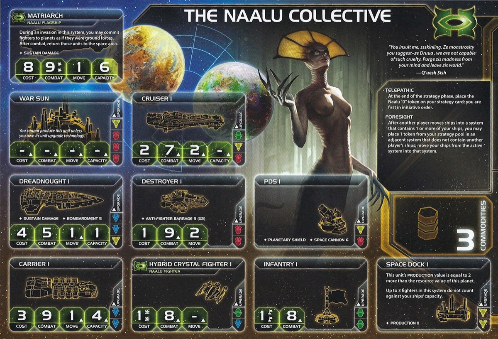

<nav class="page-nav">
<a href="../index.html" class="back-link">Back to Index</a>
<a href="Naalu_Collective.md" download class="download-link" title="Plain text file - safe to download">Download .md</a>
</nav>

# Naalu Collective Guide

## Contents

1. [Introduction](#i-introduction)
2. [Playstyle](#ii-playstyle)
3. [Faction Info and Drafting](#iii-faction-info-and-drafting)
   - [Home System & Commodities](#a-home-system--commodities) · [Starting Fleet](#b-starting-fleet) · [Faction Abilities](#c-faction-abilities) · [Technologies](#d-starting-and-faction-technologies) · [Leaders](#e-leaders) · [Promissory Note](#f-promissory-note---gift-of-prescience) · [Alliance](#g-alliance) · [Mech](#h-mech---iconoclast-temporal-entanglement) · [Flagship](#i-flagship---matriarch) · [Breakthrough](#j-breakthrough) · [Slice and Draft](#k-slice-and-draft-considerations)
4. [Round 1 Problems and Faction Weakness](#iv-round-1-problems-and-faction-weakness)
   - [First Turn Priorities](#a-first-turn-priorities) · [Threat of Winning](#b-threat-of-winning)
5. [Technology](#v-technology)
   - [Overview](#a-overview) · [Tech Path](#b-tech-path)
6. [Strategy Cards](#vi-strategy-cards)
   - [Round 1](#a-round-1) · [Round 2+](#b-round-2)
7. [Unit Composition and Game Plan](#vii-unit-composition-and-game-plan)
   - [Unit Composition](#a-unit-composition) · [Game Plan](#b-game-plan)
8. [Objectives](#viii-objectives)
   - [Objective Summary](#a-objective-summary) · [Stage I](#b-stage-i-objectives) · [Secret Objectives](#c-secret-objectives) · [Stage II](#d-stage-ii-objectives)
9. [Alliance Priority](#ix-alliance-priority)
10. [Bonus Game Elements](#x-bonus-game-elements)
    - [Action Cards](#a-high-value-action-cards) · [Relics](#b-relic-priorities) · [Agendas](#c-agenda-awareness)
11. [End Notes](#xi-end-notes)

---

## I. Introduction

The Naalu Collective are TI4's clairvoyant faction—you see what's coming and act first. While other factions react to events, you shape them. You know when to score, when to strike, when to vanish. Initiative-0 means you always go first, choosing your moment before anyone else can respond.

This faction is about perfect foresight and fighter swarms. Act first if you want. Retreat before battle if you don't. Your opponents never know which you'll choose, and by the time they act, it's already too late. In Twilight Imperium, seeing the future is everything.

## II. Playstyle

Playing Naalu Collective is about staying out of the limelight while being surprisingly strong. You're not the obvious threat—until you score objectives first every round. Your fighter swarms dominate combat more than opponents expect. While others fumble in the darkness of future agendas, you see what's coming and plan accordingly.

Your playstyle revolves around acting first and staying flexible. Score objectives before anyone else. Build fighter swarms for combat superiority. Retreat from fights you don't want, making opponents waste activations chasing you. Your Commander lets you see neighbor promissories and upcoming agendas—information no one else has.

Foresight and initiative define you. Act first when it matters. Vanish when it doesn't. Know what's coming while opponents guess. Stay quiet, score first, and let the table underestimate you until it's too late.

---

## III. Faction Info and Drafting

### A. Home System & Commodities

**Home System:**

- **Druaa:** 3 resources / 1 influence
- **Maaluuk:** 0 resources / 2 influence
- **Total: 3 resources / 3 influence (3 optimal resources / 2 optimal influence)**

**Commodities:** 3

**Notes:** Two-planet home system hard to defend on ground. Luckily you have strong fighters. Solid economical home system. Decent production.

### B. Starting Fleet

- 1 Carrier
- 1 Cruiser
- 1 Destroyer
- 3 Fighters (Hybrid Crystal Fighters I)
- 4 Infantry
- 1 Space Dock
- 1 PDS

**Notes:** Solid starting fleet for expansion. 3 Hybrid Crystal Fighters (Combat 8). Agent allows you to reach all systems in slice usually.

### C. Faction Abilities

**Telepathic (Faction Ability):** At the end of the strategy phase, place the Naalu "0" token on your strategy card; you are first in initiative order.

You act first every action phase. Double-edged sword—good for aggressive plays and awesome for scoring, but risk getting outstalled and showing your hand at the same time.

**Foresight (Faction Ability):** After another player moves ships into a system that contains 1 or more of your ships, you may place 1 token from your strategy pool in an adjacent system that does not contain another player's ships; move your ships from the active system into that system.

Retreat before combat begins. Spend 1 CC from strategy pool to move all your ships to adjacent empty system when opponent activates you. Costly but preserves forces.

**Hybrid Crystal Fighter I (Special Unit):** Naalu Fighter - Cost: 1 (x2) | Combat: 8

Combat 8 fighters provide additional combat power in early scraps. Can be impactful for equidistant systems.

### D. Starting and Faction Technologies

**Starting Technologies:**

**Sarween Tools** - When you use PRODUCTION, reduce the combined cost of produced units by 1.

**Neural Motivator** - When you gain command tokens during the status phase, gain 1 additional command token.

**Notes:** Two of those technologies you just love to start with. Neural Motivator gives 4-5 extra action cards over the course of the game. Sarween Tools saves probably 8-10 resources spent on production over the course of the game.

**Faction Technologies:**

**Hybrid Crystal Fighter II (GB):**
*Naalu Fighter - Combat: 7 | Move: 2*

This unit may move without being transported. Each fighter in excess of your ships' capacity counts as 1/2 of a ship against your fleet pool.

Your faction's battle prowess. Incredible utility moving on its own. People will be shocked at how many hits you produce—a dreadnought hits on a 5, a HCF2 hits on a 7. Having your fighters be your battle power is so good economically since they're so cheap. **Battle example:** A 13-resource Naalu fleet (2 Carrier I + 14 Fighter II) fights 50/50 against a 23-resource fleet (4 Dreadnought II + 1 Carrier + 8 Fighters).

**Neuroglaive (GGG):**
*After another player activates a system that contains 1 or more of your ships, that player removes 1 token from his fleet pool and returns it to his reinforcements.*

Hard to reach tech. Not preferred path into green—try to get through Entropic Scar. Annoying for opponents that are poor influence-wise but usually able to be planned around.

### E. Leaders

**Agent - Z'eu (Temporal Entanglement):**

After any player's command token is placed in a system: You may exhaust this card to return that token to that player's reinforcements.

Increased mobility. Great usage for early slice grabbing.

**Commander - M'aban (Codex 3):** *Unlock: Have ground forces in or adjacent to the Mecatol Rex system.*

At any time: You may look at your neighbors' hands of promissory notes and the top and bottom card of the agenda deck.

Usually better for agendas for seasoned players that usually know what the secret trades entailed. Can surprise people that made a sneaky PN deal.

**Hero - The Oracle (Codex 3):** *Unlock: Have 3 scored objectives.*

**C-Radium Geometry - At the end of the status phase:** You may force each other player to give you 1 promissory note from their hand. If you do, purge this card.

Synergy with breakthrough (Mindsieve). Use ASAP just to get any value. If people moved their PNs around a lot, can catch people off guard.

### F. Promissory Note - **Gift of Prescience**

At the end of the Strategy Phase: Place this card faceup in your play area and place the Naalu "0" token on your strategy card; you are the first in initiative order. The Naalu player cannot use his Telepathic faction ability during this game round. Return this card to the Naalu player at the end of the status phase.

Only sell for Round 2 custodians if you have no interest. Never let people have this for late game scoring.

### G. Alliance

Whoever holds your alliance card has your Commander (M'aban - look at neighbors' promissory hands and top/bottom agenda cards).

Trade for any value, won't net you a lot.

### H. Mech - **Iconoclast (Temporal Entanglement)**

Cost: 2 | Combat: 6 | **Sustain Damage**

**DEPLOY:** When another player gains a relic, place 1 mech on any planet you control.

Free mech when any player gains a relic. Passive mech generation. Buffed with Fracture and certain factions (Naaz-Rokha and Mahact).

### I. Flagship - **Matriarch**

Cost: 8 | Combat: 9 (x2) | Move: 1 | Capacity: 6 | **Sustain Damage**

**Special Ability:** During an invasion in this system, you may commit fighters to planets as if they were ground forces. When combat ends, return those units to the space area.

Fighters participate in ground combat as ground forces, then return to space after. Great for big takes of Mecatol/Styx—can guarantee a blowout space combat and then send them all down to have a blowout ground combat after. Stronger than normal infantry when upgraded (HCF2 hits on 7 vs infantry on 8).

### J. Breakthrough

**Mindsieve (R↔G)** - When you would resolve the secondary ability of another player's strategy card, you may give them a promissory note to resolve it without spending a command token.

**R↔G Synergy:** Red and green technologies count as each other for prerequisites.

You can make deals every time for free strategy tokens—pay a TG here, a TG there, small favor there. Try to be proactive and deal constantly with the breakthrough. Your "useless PNs" can now be used for strategy tokens. Not a lot of use for R↔G synergy.

### K. Slice and Draft Considerations

**Speaker Order:**
Prefer strong early value. Positions 1-4 are best. Can handle most neighbors.

**Slice Priorities:**

- **Safe slice** - Your economic tools are very strong (free secondaries, cheap fleet). Can get away with lower res/influence, but more is better always.
- **High res planets** - Want a few for production capacity.
- **Mecatol access** - Custodian possibility.

**Nice to Have:**

- **Blue skip** - Very helpful.
- **Entropic Scar** - Loves it.
- **Space Station** - TG to trade for PNs.

**Avoid:**

- **Gravity rift/nova/asteroid in path to Mecatol** - Blocks access.

---

## IV. Round 1 Problems and Faction Weakness

### A. First Turn Priorities

**Round 1 Priority Rankings:**

1. **Scoring** - Stay in line if people are scoring, otherwise lower priority. Don't want to show off as strong/winning.

2. **Expansion and Production** - Get economy started.

3. **Breakthrough** - Economic boost. Easiest unlock with throwing secret.

4. **Technology** - Can be lesser priority. Plastic over tech Round 1.

**Expansion Notes:** Take fleet to middle system, lift token (agent), go again. Then take system next to your home with Warfare build.

### B. Threat of Winning

People are afraid of you winning all game. Your initiative-0 and scoring first every round makes opponents view you as a constant threat. This strains your diplomatic capability—the table will target you even when you're not actually winning.

---

## V. Technology

### A. Overview

Strong economic start with bonus action cards. Focus on fighter upgrades. Best path is probably blue for utility, carrier capacity, and movement.

### B. Tech Path

**Starting Tech:** Sarween Tools + Neural Motivator

**Round 1:** Dark Energy Tap (if available from slice/deals)
- Extra frontier token, retreat flexibility.

**Round 2:** Hybrid Crystal Fighter II (GB)
- Faction tech. Independent movement, 0.5 fleet cost.

**Round 3:** Gravity Drive (B)
- +1 move to 1 ship after activating.

**Round 4:** Carrier II (BB) or Fleet Logistics (BB)
- Carrier II for capacity, Fleet Logistics for double actions.
- Fleet Logistics enables crazy Imperial scoring on Mecatol and then also scoring first with the Imperial card in the last round.

**Note:** If blue tech skip, can go Gravity Drive first (Round 2).

---

## VI. Strategy Cards

### A. Round 1

**Round 1 Priority Ranking:**

1. **Trade** - Economy for fighter production. 3 commodities.
2. **Technology** - Start fighter upgrade path.
3. **Leadership** - For secondaries.
4. **Politics** - Good for setting up scoring Round 2.
5. **Construction** - Forward dock for production. Better if you have a great planet to place forward dock on.
6. **Warfare** - Useless with your agent.
7. **Diplomacy** - Last pick option.
8. **Imperial** - Never Round 1.

**Strategy Token Priority:** Diplomacy, Warfare, and Technology. If you got breakthrough, make deal for a bonus secondary.

### B. Round 2+

**Love:**

- **Trade** - Economy. Abuse your breakthrough to save tokens.
- **Technology** - Fighter upgrades. Abuse your breakthrough to save tokens.
- **Imperial** - Score first with initiative-0.

**Good:**

- **Leadership** - Tokens. If table not playing nice with breakthrough deals.
- **Politics** - Setup Imperial. Advantage of speaker with Commander (know top/bottom agendas).

**Situational:**

- **Warfare** - Aggressive plays. Fleet unlock after attacks.
- **Construction** - Forward dock.
- **Diplomacy** - Only for home system lockdown.

---

## VII. Unit Composition and Game Plan

### A. Unit Composition

**Preferred Units:**

- **Fighters** - Core unit. Combat 8. Build swarms.
- **Carriers** - Transport infantry and fighters.
- **Infantry** - Ground forces.
- **Mechs** - Get for free everywhere (when players gain relics).
- **Flagship** - Fighters fight on ground.

Your composition is incredibly cheap if you have production capacity for it. Fighter swarms provide overwhelming combat power at minimal cost.

### B. Game Plan

**Early Game (Rounds 1-2):**

Use initiative-0 to claim best planets with 0 tokens. Use agent to fill out rest of slice and get a head start economically. Do not Foresight retreat—that's a waste of tokens. Build fighter swarms for combat. Consider custodians if you didn't score Round 1. Try to get trades of secondaries started (breakthrough deals).

**Mid Game (Rounds 3-4):**

Research Hybrid Crystal Fighter II for independent movement and combat superiority. Continue building fighter swarms—you want overwhelming numbers. Commander unlocks—if lucky, get ahead on agendas with intelligence advantage. Your breakthrough deals should be flowing now, saving tokens on every secondary. Build up plastic and economy. Hero steals all opponent promissories for political leverage. If controlling Mecatol in mid game, consider the first action Imperial for massive point swing. Stay under the radar while accumulating strength.

**Late Game (Round 5+):**

Make a big swing play if not already running away with the game. Flagship invasions, massive fighter swarms, and initiative-0 scoring give you the tools to close it out.

---

## VIII. Objectives

### A. Objective Summary

**Strengths:** Initiative-0 lets you score objectives first. Economy objectives benefit from breakthrough saving tokens. Combat objectives align with fighter swarms.

**Weaknesses:** Tech objectives challenging despite 2 starting techs. Structure objectives difficult. Hard to spread out and not become a target with the Naalu bullseye on you.

### B. Stage I Objectives

| Stage I Objective                                                       | Status |
|-------------------------------------------------------------------------|--------|
| **Spendies** |
| Erect a Monument (Spend 8 resources)                                    | 🟡     |
| Sway the Council (Spend 8 influence)                                    | 🟡     |
| Negotiate Trade Routes (Spend 5 trade goods)                            | 🟡     |
| Lead from the Front (Spend 3 tokens from tactic/strategy pools)         | 🟢     |
| Amass Wealth (Spend 3 influence, 3 resources, 3 trade goods)            | 🟡     |
| **Control** |
| Expand Borders (Control 6 planets in non-home systems)                  | 🟢     |
| Corner the Market (Control 4 planets with same trait)                   | 🔴     |
| Found Research Outposts (Control 3 planets with tech specialties)       | 🔴     |
| Discover Lost Outposts (Control 2 planets with attachments)             | 🔴     |
| Push Boundaries (Control more planets than each neighbor)               | 🟢     |
| **Ships in Systems** |
| Intimidate the Council (Ships in 2 systems adjacent to MR)              | 🟢     |
| Explore Deep Space (Units in 3 systems without planets)                 | 🟢     |
| Make History (Units in 2 systems with legendary/MR/anomalies)           | 🟢     |
| Populate the Outer Rim (Units in 3 edge systems)                        | 🟢     |
| Raise a Fleet (5+ non-fighter ships in 1 system)                        | 🟢     |
| Engineer a Marvel (Have flagship or war sun on board)                   | 🟢     |
| **Tech** |
| Diversify Research (Own 2 tech in each of 2 colors)                     | 🟢     |
| Develop Weaponry (Own 2 unit upgrade technologies)                      | 🟢     |
| **Structure** |
| Build Defenses (Have 4 or more structures)                              | 🔴     |
| Improve Infrastructure (Structures on 3 planets outside HS)             | 🔴     |

**Legend:** 🟢 Likely | 🟡 Possible | 🔴 Difficult

### C. Secret Objectives

| Secret Objective                                                         | Status |
|--------------------------------------------------------------------------|--------|
| **Combat** |
| Unveil Flagship (Win space combat with flagship)                         | 🟢     |
| Destroy their Greatest Ship (Destroy war sun/flagship)                   | 🟡     |
| Spark a Rebellion (Win combat vs VP leader)                              | 🟢     |
| Betray a Friend (Win combat vs player whose PN you have)                | 🟢     |
| Brave the Void (Win combat in anomaly)                                  | 🟢     |
| Darken the Skies (Win combat in another player's HS)                    | 🟡     |
| Demonstrate your Power (3+ non-fighter ships after space combat)        | 🟡     |
| Turn their Fleets to Dust (SPACE CANNON destroy last ship)              | 🔴     |
| Make an Example (BOMBARDMENT destroy last ground forces)                | 🔴     |
| Fight With Precision (AFB destroy last fighter)                         | 🔴     |
| **Ships in Systems** |
| Threaten Enemies (Ships adjacent to another player's HS)                | 🟢     |
| Cut Supply Lines (Ships in system with enemy space dock)                | 🟢     |
| Defy Space and Time (Units in wormhole nexus)                           | 🟡     |
| Become the Gatekeeper (Ships in alpha and beta wormhole systems)        | 🟡     |
| Learn Secrets of the Cosmos (Ships in 3 systems adjacent to anomalies)  | 🟢     |
| Control the Region (Ships in 6 systems)                                 | 🟢     |
| Occupy the Seat of the Empire (Control MR with 3+ ships)                | 🟢     |
| **Control** |
| Monopolize Production (Control 4 industrial planets)                     | 🔴     |
| Mine Rare Minerals (Control 4 hazardous planets)                        | 🔴     |
| Forge an Alliance (Control 4 cultural planets)                          | 🔴     |
| Establish Hegemony (Control planets with 12+ influence)                 | 🟡     |
| Hoard Raw Materials (Control planets with 12+ resources)                | 🟡     |
| Seize an Icon (Control legendary planet)                                | 🟢     |
| Stake Your Claim (Control planet in contested system)                   | 🟢     |
| Become a Martyr (Lose control of planet in home system)                 | 🟡     |
| **Tech** |
| Adapt New Strategies (Own 2 faction technologies)                       | 🔴     |
| Master the Laws of Physics (Own 4 tech of same color)                   | 🔴     |
| **Structure/Units** |
| Establish a Perimeter (Have 4 PDS on board)                             | 🔴     |
| Fuel the War Machine (Have 3 space docks)                               | 🟢     |
| Gather a Mighty Fleet (Have 5 dreadnoughts)                             | 🔴     |
| Mechanize the Military (1 mech on each of 4 planets)                    | 🟢     |
| Occupy the Fringe (9+ ground forces on planet without space dock)       | 🔴     |
| Produce en Masse (Units with PRODUCTION 8+ in single system)            | 🔴     |
| **Other** |
| Dictate Policy (3+ laws in play)                                        | 🔴     |
| Drive the Debate (You/your planet elected by agenda)                    | 🟡     |
| Destroy Heretical Works (Purge 2 relic fragments)                       | 🔴     |
| Form a Spy Network (Discard 5 action cards)                             | 🟢     |
| Foster Cohesion (Be neighbors with all players)                         | 🟢     |
| Strengthen Bonds (Have another player's PN)                             | 🟢     |
| Prove Endurance (Last to pass)                                          | 🔴     |

**Legend:** 🟢 Likely | 🟡 Possible | 🔴 Difficult

### D. Stage II Objectives

| Stage II Objective                                                       | Status |
|--------------------------------------------------------------------------|--------|
| **Spendies** |
| Centralize Galactic Trade (Spend 10 trade goods)                         | 🟡     |
| Found a Golden Age (Spend 16 resources)                                  | 🟡     |
| Galvanize the People (Spend 6 tokens from tactic/strategy pools)         | 🟢     |
| Manipulate Galactic Law (Spend 16 influence)                             | 🟡     |
| Hold Vast Reserves (Spend 6 influence, 6 resources, 6 trade goods)       | 🟡     |
| **Control** |
| Conquer the Weak (Control 1 planet in another player's HS)               | 🔴     |
| Rule Distant Lands (Control 2 planets in/adjacent to different players' HS) | 🟢     |
| Subdue the Galaxy (Control 11 planets in non-home systems)               | 🔴     |
| Unify the Colonies (Control 6 planets with same trait)                   | 🔴     |
| Reclaim Ancient Monuments (Control 3 planets with attachments)           | 🔴     |
| Form Galactic Brain Trust (Control 5 planets with tech specialties)      | 🔴     |
| **Ships in Systems** |
| Command an Armada (Have 8+ non-fighter ships in 1 system)                | 🟡     |
| Achieve Supremacy (Flagship/War Sun in another player's HS or MR)        | 🟡     |
| Become a Legend (Units in 4 systems with legendary/MR/anomalies)         | 🟡     |
| Patrol Vast Territories (Units in 5 systems without planets)             | 🟡     |
| Control the Borderlands (Units in 5 edge systems not HS)                 | 🟢     |
| **Tech** |
| Master of Sciences (Own 2 techs in each of 4 colors)                     | 🔴     |
| Revolutionize Warfare (Own 3 unit upgrade technologies)                  | 🟡     |
| **Structure** |
| Construct Massive Cities (Have 7+ structures)                            | 🔴     |
| Protect the Border (Structures on 5 planets outside HS)                  | 🔴     |

**Legend:** 🟢 Likely | 🟡 Possible | 🔴 Difficult

---

## IX. Alliance Priority

Alliance preference ranking based on commander utility:

**Top Tier:**

1. **Vuil'raith Cabal** (That Which Molds Flesh) - 2 fighters/infantry don't count against production. Massive value for fighter spam.
2. **Crimson Rebellion** (Ahk Siever) - Gain TG after any combat. Passive income.
3. **Deepwrought** (Aello) - Gain TG when others research. Passive income.
4. **Titans of Ul** (Tungstantus) - Gain TG when using production. Passive income.

**Good:**

5. **Nomad** (Navarch Feng) - Produce flagship without resources. Saves 8 resources.
6. **Muaat** (Magmus) - Gain TG after spending strategy tokens. Passive income.
7. **Empyrean** (Xuange) - Return tokens when others move into your systems. Token efficiency.
8. **Winnu** (Rickar Rickani) - +2 combat in MR/home/legendary. Combat boost.
9. **Nekro Virus** (Nekro Acidos) - Draw cards when gaining tech. Good value.
10. **Xxcha Kingdom** (Elder Qanoj) - +1 vote per planet exhausted. Diplomatic alliance for massive votes and voting info (with Commander).

---

## X. Bonus Game Elements

This section highlights action cards that synergize particularly well with your faction's strengths or mitigate your weaknesses, relics that offer exceptional value for your faction's strategy and abilities, and agendas to pursue that benefit your position, and agendas to watch out for that could hurt you.

### A. High-Value Action Cards

### B. Relic Priorities

### C. Agenda Awareness

---

## XI. End Notes

Naalu Collective is the faction for players who love staying under the radar while being surprisingly strong. You're not the obvious powerhouse—you're the faction that quietly scores objectives and snatches the win before anyone can react. Your initiative-0 is a double-edged sword with big scoring implications late game, but the surprise factor is powerful.

Your biggest strength is that you're stronger than people expect. Your fighter swarms dominate combat at a fraction of the cost. Your breakthrough saves tokens on every secondary. Your Commander gives you information others don't have. While the table focuses on louder factions, you're scoring first, expanding first, and positioning first.

When you master Naalu Collective, you feel like you're seeing the future while everyone else guesses. The table underestimates you until suddenly you're scoring objectives they thought they had secured. Naalu Collective doesn't announce their plans—they execute them before anyone knows what happened.

**We see the future. We act on it.**
