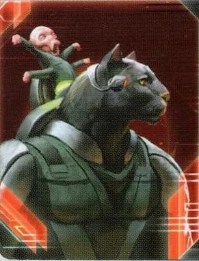

# Naaz-Rokha Alliance Guide

---

## I. Introduction

The Naaz-Rokha Alliance are TI4's exploration and relic fragment specialists that convert exploration into board presence. They excel at fragment collection through their Distant Suns ability (draw extra cards when exploring with mechs), and convert those fragments into relics or command tokens via Fabrication. Naaz-Rokha rewards aggressive early exploration, fragment management, and understanding when to convert fragments versus saving them for relic sets.

The payoff? Exploring planets with mechs gives double card draw (choose the best result), gaining free relics by purging 2 matching fragments, and generating command tokens on demand. When you master exploration timing and mech placement, every planet becomes a double exploration opportunity and your economy scales through fragment conversion.

## II. Playstyle

Playing Naaz-Rokha is like being a relic hunter with perfect information—you explore more efficiently than any other faction and convert those discoveries into tangible advantages. Your Distant Suns draws extra exploration cards when mechs are present, your Fabrication converts fragments into relics or CCs, and your Z-Grav Eidolon mechs flip between ground and space modes for tactical flexibility. You're not trying to win through combat—you're winning through exploration efficiency, relic acquisition, and economic scaling.

The key strength of Naaz-Rokha is exploration value extraction. Normal factions explore once per planet. You explore with mechs present and draw 2+ cards, choosing the best. Over a game with 8-10 planet explorations, this means seeing 16-20 exploration cards instead of 8-10—double the value, double the fragments, double the relics.

Opponents will compete with you for exploration—Nomad, Nekro (via predictions), and exploration-focused players all want fragments. That moment when you've collected 10+ fragments by R3, converted them to 5 relics, and have CCs to spare? Pure efficiency.

---

## III. The Basics

### A. Home System & Commodities

**Home System:** Naazir (2 resources / 1 influence), Rokha (1 resource / 2 influence)

**Commodities:** 3

**Notes:** Two-planet home system with 3/3 total split (balanced but low). Naazir provides resources for military production, Rokha provides influence for objectives. The low total (3/3) means you must expand aggressively R1-2 to build economy. Two planets are easier to defend than single-planet homes and provide more total resources when building.

### B. Starting Fleet

- 2 Carriers
- 1 Destroyer
- 2 Fighters
- 1 Mech
- 3 Infantry
- 1 Space Dock

**Notes:** Strong starting fleet with 2 carriers (8 capacity total) for aggressive R1 expansion. You start with 1 mech—place it strategically for Distant Suns exploration bonuses. The destroyer provides AFB defense. Single space dock means you'll want Construction R1-2 for forward production.

### C. Starting Technologies

**Psychoarchaeology** - When 1 or more of your units use PRODUCTION in a system, you may exhaust this card to reduce the cost of 1 of those units by 2.

**AI Development Algorithm** - When you research a unit upgrade technology, you may exhaust this card to ignore 1 prerequisite.

**Notes:** Psychoarchaeology is niche—saves 2 resources when producing (useful for expensive units like dreadnoughts/war suns). AI Dev Algorithm is excellent—you'll research 3-4 unit upgrades, and this skips prerequisites for all of them. Both yellow and blue starting techs give you flexible tech paths.

### D. Faction Abilities

**Distant Suns (Faction Ability):** When you explore a planet that contains 1 or more of your mechs, you may draw 1 additional card; choose 1 to resolve and discard the rest.

Your exploration multiplier. When exploring a planet WITH A MECH PRESENT, draw 2 cards total (1 normal + 1 from Distant Suns), choose 1 to resolve, discard the other. This is absurdly powerful—you see twice as many exploration results, always take the best. Over a game, this nets 5-10 extra valuable exploration results (fragments, TGs, attachments).

**Strategic Implication:** Always place mechs on planets BEFORE exploring them if possible. Load mech in carrier, land it, then explore = guaranteed double draw.

**Fabrication (Faction Ability):** ACTION: Either purge 2 of your relic fragments of the same type to gain 1 relic or purge 1 of your relic fragments to gain 1 command token.

Fragment conversion ability. During your turn, spend 2 matching fragments (2 red, 2 blue, or 2 yellow) to gain 1 relic corresponding to that color. OR spend 1 fragment of any type to gain 1 CC. This is your economy engine—convert fragments you don't need for relics into CCs for expansion, or complete relic sets for powerful abilities.

**Optimal Usage:**
- Convert fragments to CCs when you need expansion fuel R2-3
- Save matching fragments for relics when close to completing sets (Shard of the Throne requires 3 matching fragments—save for it!)
- Don't convert immediately—hold optionality

### E. Leaders

**Agent - Garv and Gunn:**

At the end of a player's turn: You may exhaust this card to allow that player to explore 1 of their planets.

Exploration support agent. At end of ANY player's turn, exhaust to let them explore one of their planets. Use politically: "I'll let you explore if you vote my way" or "I'll agent you for your Alliance promissory." Also useful to agent yourself for extra exploration on your own turn (if you have multiple unexplored planets, activate one, explore naturally, then agent yourself to explore another).

**Commander - Dart and Tai:** *Unlock: Have mechs in 3 systems.*

After you gain control of a planet that was controlled by another player: You may explore that planet.

Easy unlock (3 mechs in 3 systems, achievable R2-3). After unlocking, every planet you conquer from opponents can be explored immediately. This incentivizes invasion—each successful conquest nets exploration (likely fragments). Combine with Distant Suns if you have mechs present for double card draw on invaded planets.

**Hero - Hesh and Prit:** *Unlock: Have 3 scored objectives.*

**Perfect Synthesis - ACTION:** Gain 1 relic and perform the secondary ability of up to 2 readied or unchosen strategy cards; during this action, spend command tokens from your reinforcements instead of your strategy pool. Then, purge this card.

Power spike hero. In one action: (1) Gain 1 relic for free, (2) Perform 2 strategy card secondaries (spend from reinforcements, not strategy pool—so you keep your CCs!). Use R5-6 for massive swing turn. Example: Gain relic, follow Technology for 2 techs, follow Construction for PDS, all without spending CCs from pools.

### F. Promissory Note - **Black Market Forgery**

ACTION: Purge 2 of your relic fragments of the same type to gain 1 relic. Then, return this card to the Naaz-Rokha player.

Fragment-to-relic conversion for another player. This is your Fabrication ability given to an opponent once. Trade value: 3-4 TG equivalent. Best for exploration-heavy factions (Nomad, other Naaz-Rokha in mirror match) or factions needing specific relics.

### G. Alliance

After you explore a planet that is not a legendary planet or Mecatol Rex: Gain 1 trade good.

Exploration trade good generation. Ally gains 1 TG per normal planet exploration (not legendaries or MR). Over a game with 6-8 explorations, this generates 6-8 TGs for ally. Solid economic value. Trade value: 3-4 TG.

### H. Mech - **Eidolon / Z-Grav Eidolon**

Cost: 2 | Combat: 6 (x2) | **Sustain Damage**

**Eidolon (Ground Mode):** If this unit is in the space area of the active system at the start of a space combat, flip this card. This card begins the game with this side faceup.

**Z-Grav Eidolon (Space Mode - Flipped):** Cost: 2 | Combat: 8 (x2) | If this unit is in the space area of the active system, it is also a ship. At the end of a space battle in the active system, flip this card. This card begins the game with this side facedown.

Dual-mode mech. Starts in ground mode. When space combat occurs in the system, flips to space mode (becomes a ship with Combat 8(x2)). After space combat ends, flips back to ground. This means your mechs participate in space combat as ships (like Nekro's Alastor but for mechs), then revert to ground forces after.

**Strategic Implications:**
- Place mechs on planets in contested systems
- When enemies attack, mechs flip to space mode and fight as ships (Combat 8(x2))
- After battle, mechs flip back to ground (still defend planet)
- This gives you "free" space combat dice without producing actual ships

### I. Flagship - **Visz El Vir**

Cost: 8 | Combat: 9 (x2) | Move: 1 | Capacity: 4 | **Sustain Damage**

**Special Ability:** Your mechs in this system roll 1 additional die during combat.

Mech enhancement flagship. All mechs in the system roll +1 die during combat (both space and ground). Your Eidolon mechs normally roll 2 dice (6+ on ground, 8+ in space mode). With flagship: 3 dice per mech. If you have flagship + 3 mechs in system during space combat, that's 2 flagship dice (9+) + 9 mech dice (8+) = 11 total dice.

**Strategic Implications:**
- Load flagship with infantry + mechs for invasions
- During space combat, mechs flip to space mode (Z-Grav) and roll 3 dice each at 8+
- This creates overwhelming space combat power
- After combat, mechs land for ground invasion with 3 dice each at 6+

### J. Faction Technologies

**Pre-Fab Arcologies (Green/Green/Green)** - After you explore a planet, ready that planet.

Triple-green tech. After exploring planet, ready it immediately. This lets you exhaust planet for resources, explore it (via agent or action), then ready it for production/spending. The 3 green prerequisite is steep—only research if heavily invested in green tree.

**Supercharge (Red)** - At the start of a combat round, you may exhaust this card to apply +1 to the result of each of your unit's combat rolls during this combat round.

Combat enhancement tech. Exhaust at start of any combat round (space or ground) to give ALL your units +1 to combat rolls for that round. Destroyer goes from 9+ to 8+, infantry from 8+ to 7+, mechs from 6+ to 5+ (space mode from 8+ to 7+). Use once per combat on critical rounds. Excellent value for aggressive players.

### K. Breakthrough Technology

**Absolute Synergy (Blue<>Green)** - When you have 4 mechs in the same system, you may return 3 of those mechs to your reinforcements to flip this card and place it on top of your mech card.

**Eidolon Maximum (Flipped):** This unit is both a ship and ground force. It cannot be assigned hits from unit abilities. Repair it at the start of every combat round. Game effects cannot place or produce your mechs. When this unit is destroyed or removed, flip this card and return it to your play area. Combat: 4 (x4) | Move: 3 | **Sustain Damage**

Super-mech breakthrough. When you have 4 mechs in one system, sacrifice 3 to create Eidolon Maximum: Combat 4(x4), Move 3, Sustain, is BOTH ship and ground force simultaneously, repairs every combat round, cannot be targeted by abilities. This is a super-unit that never dies (repairs every round) and fights everywhere.

**Downside:** After creating Eidolon Maximum, you CANNOT produce normal mechs anymore (card says "game effects cannot place or produce your mechs"). You get 1 super mech and that's it. Only use if you're going all-in on this strategy.

---

## IV. Structural Weaknesses

### A. First Turn Priorities

As Naaz-Rokha Alliance, your first turn priorities should reflect your exploration and relic fragment specialization. Here's the recommended ordering:

1. **Expansion + Production** - Your Distant Suns ability (explore twice with mechs) requires claiming planets with frontier tokens. Expand aggressively Round 1 to 2-3 systems with unexplored planets. Your 4 resources and 2 influence from home support this expansion.

2. **Breakthrough** - Immediately deploy mechs to planets with frontier tokens and explore twice per planet. Each double-exploration generates 2 relic fragments on average. Build toward 3 fragments for Fabrication (convert to relics or command tokens). Exploration dominance is your core identity.

3. **Scoring** - Score exploration-based secrets early (discover lost outposts, control planets with attachments). Your ability to explore faster than anyone else makes these secrets easier. Territory objectives also benefit from aggressive expansion.

4. **Technology** - Push toward unit upgrades or Temporal Cascade (mech production tech) for more Distant Suns triggers. However, exploration and fragment collection come first—tech enhances an existing exploration engine.

### A. Exploration Dependency

Your faction revolves around exploration. If opponents explore all planets before you, or if the map has few planets, you're crippled. You must explore aggressively R1-3.

**Mitigation:**
- Take Warfare R1 for rapid expansion
- Negotiate exploration rights with neighbors ("I explore left, you explore right")
- Use Agent to explore multiple planets per round
- Place mechs before exploring for Distant Suns double draw

### B. Fragment Competition

Nomad, Nekro (via predictions), and other exploration factions want fragments. You're competing for limited resources.

**Mitigation:**
- Explore more efficiently (Distant Suns gives better results)
- Convert fragments to relics/CCs before opponents can contest
- Trade with Nomad/Nekro for non-aggression regarding exploration zones

### C. Low Starting Economy

3/3 home system is below average (most factions have 4-6 total resources/influence). You must expand quickly or fall behind economically.

**Mitigation:**
- Aggressive R1 expansion (take 3-4 planets by end of R1)
- Use Fabrication to convert fragments to CCs for more expansion
- Take Trade R1-2 for TG injection

### D. Mech Production Limits

You can only have a finite number of mechs (8-10 total in reinforcements depending on faction components). Once you run out, you can't benefit from Distant Suns unless you recycle mechs.

**Mitigation:**
- Place mechs strategically, not everywhere
- Prioritize high-value planets for mech placement (tech specialties, legendaries, high resources)
- Consider Absolute Synergy breakthrough to consolidate 4 mechs → 1 super mech (but lose future mech production)

---

## V. Technology

### A. Recommended Tech Paths

**Path 1: Exploration Enhancement**
1. Sarween Tools (R2)
2. Scanlink Drone Network (R2-3)
3. Gravity Drive (R3-4)
4. Cruiser II / Carrier II (R4)
5. Fleet Logistics (R5)

**Path 2: Combat Focus**
1. Supercharge (R2) *faction tech*
2. Destroyer II (R2-3)
3. Gravity Drive (R3)
4. Duranium Armor (R4)
5. Assault Cannon (R4-5)

**Path 3: Balanced**
1. Sarween Tools (R2)
2. Gravity Drive (R3)
3. Supercharge (R3-4) *faction tech*
4. Carrier II (R4)
5. Destroyer II / Cruiser II (R5)

### B. Key Technologies

**AI Development Algorithm:** You start with this. Use it to skip prerequisites for Destroyer II, Carrier II, Cruiser II, etc.

**Sarween Tools:** Standard economy tech. Saves 1 resource per production—over 20 builds, saves 20 resources.

**Supercharge:** Your faction tech. +1 to all combat rolls for a round is devastating with multiple mechs (flagship + 3 mechs = 11 dice all getting +1).

**Gravity Drive:** Mobility for repositioning fleets and bringing mechs to new exploration zones.

**Scanlink Drone Network:** You explore more than most factions. Gaining CCs from exploration is solid value.

**Destroyer II:** AFB + Move 2. Excellent for screening and mobility.

---

## VI. Strategy Cards

### A. Round 1

Your R1 priority is aggressive exploration and expansion to trigger Distant Suns benefits.

**Round 1 Priority Ranking:**

1. **Warfare** - Enables R1 aggression + exploration expansion. You expand and explore constantly.

2. **Technology** - Get Sarween Tools or progress toward Supercharge. Tech path includes 3-4 unit upgrades.

3. **Construction** - Build forward space dock for continued expansion and deeper exploration.

4. **Trade** - 3 commodities + TGs for expansion. TG generation from ally exploration.

5. **Leadership** - CCs fuel exploration and expansion activations.

6. **Politics** - Speaker + agenda control.

7. **Imperial** - Unlikely to score R1.

8. **Diplomacy** - Protecting home is fine but not priority.

### B. Round 2+

**Love:**
- **Warfare** - You expand and explore constantly. Unlocking fleets is critical.
- **Technology** - Tech path includes 3-4 unit upgrades + Supercharge. Essential progression.
- **Leadership** - CCs fuel exploration and expansion.
- **Politics** - Speaker + agenda control.
- **Imperial** - Points are points. Needed rounds 3-5.

**Like:**
- **Construction** - Forward space dock enables deeper exploration.
- **Trade** - 3 commodities + TG generation from ally exploration.
- **Diplomacy** - Protect explored planets while pushing forward.

---

## VII. Intermediate

### A. Distant Suns Optimization

Your defining ability. Maximize value:

**Mech Placement Priority:**
1. Load mech in carrier R1
2. Move to new system
3. Land mech on planet
4. Explore planet with mech present
5. Draw 2 cards (Distant Suns), choose best, discard other

**Best Results to Choose:**
- Relic fragments (convert to relics/CCs via Fabrication)
- Trade goods (immediate economy)
- Attachments (Demilitarized Zone, DMZ, etc.)

**Avoid Results:**
- Negative effects (lose ships, exhaust planets)
- Minimal value (single fighter, single infantry)

**Over 8 explorations with Distant Suns:**
- See 16 exploration cards
- Choose 8 best results
- This is 2x value of normal factions

### B. Fabrication Economy

You convert fragments to relics or CCs. Timing matters:

**When to Convert Fragments → CCs:**
- R2-3 when you need expansion fuel
- When you have "orphan" fragments (1 red fragment but no others)
- When CC-starved and no other options

**When to Save Fragments for Relics:**
- Close to completing relic sets (2/3 matching fragments)
- For powerful relics (Shard of the Throne, Crown of Emphidia)
- When you already have enough CCs

**Fragment Value:**
- 2 matching fragments → 1 relic (varies by relic power)
- 1 fragment → 1 CC (worth ~2 TG)
- Save fragments for relics unless desperate for CCs

### C. Z-Grav Eidolon Tactics

Your mechs flip to space mode during space combat:

**Optimal Mech Placement:**
- Border planets in contested systems
- Planets adjacent to opponents
- Planets in systems you expect to defend

**Combat Math:**
- Normal mech (ground): Combat 6(x2)
- Z-Grav mech (space): Combat 8(x2), is a ship
- With Flagship: Combat 8(x3), is a ship
- With Supercharge: Combat 7(x3), is a ship

**Defensive Setup:**
- Place 3 mechs on border planet
- Enemy attacks system
- 3 mechs flip to space mode (6 dice at 8+, or 9 dice with flagship)
- This defends space without producing ships
- After combat, mechs flip back to ground (still defend planet)

### D. Commander Exploitation

After unlocking Commander (3 mechs in 3 systems, easy by R2-3), every conquered planet = free exploration:

**Invasion Strategy:**
- Target opponent planets
- Invade successfully
- Immediately explore (Commander trigger)
- If you have mech present: Distant Suns double draw
- Gain fragments/TGs/attachments from every conquest

**This changes invasion calculus:**
- Normal faction: Invade planet for resources/influence
- Naaz-Rokha: Invade planet for resources/influence + free exploration

**Synergy with Yin's Indoctrination:**
If trading with Yin or have their promissory, you can conquer planets cheaply then explore them via Commander.

### E. Hero Perfect Synthesis Timing

Your Hero (R4-5 typically) does 3 things in one action:
1. Gain 1 relic for free
2. Perform 2 strategy card secondaries
3. Spend CCs from reinforcements (not your pools)

**Optimal Hero Turn:**
- Round 5 when you need double-score
- Perform Technology secondary (research 2 techs if you have resources)
- Perform Construction secondary (place PDS + gain influence)
- Gain 1 relic (hopefully powerful one like Shard of the Throne)
- All without spending CCs from strategy pool

**This is a massive swing turn—use for game-winning objective pushes.**

---

## VIII. Objectives

### A. Objective Summary

**Strengths:** Naaz-Rokha excels at exploration objectives with mechanics that generate fragments and convert them to relics efficiently. Tech objectives benefit from exploration rewards, and mech deployment through exploration provides ground force advantages for planet control.

**Weaknesses:** Combat objectives are harder without direct military bonuses, requiring fleet investment. Spending objectives can be challenging depending on exploration luck, and influence spending may be difficult with variable planet acquisition.

### B. Stage I Objectives

| Stage I Objective                                                       | Status |
|-------------------------------------------------------------------------|--------|
| Erect a Monument (Spend 8 resources)                                    | 🟡     |
| Sway the Council (Spend 8 influence)                                    | 🟡     |
| Negotiate Trade Routes (Spend 5 trade goods)                            | 🟡     |
| Lead from the Front (Spend 3 tokens from tactic/strategy pools)         | 🟢     |
| Diversify Research (Own 2 tech in each of 2 colors)                     | 🟢     |
| Develop Weaponry (Own 2 unit upgrade technologies)                      | 🟢     |
| Found Research Outposts (Control 3 planets with tech specialties)       | 🟡     |
| Intimidate the Council (Ships in 2 systems adjacent to MR)              | 🟢     |
| Expand Borders (Control 6 planets in non-home systems)                  | 🟢     |
| Corner the Market (Control 4 planets with same trait)                   | 🟡     |
| Amass Wealth (Spend 3 influence, 3 resources, 3 trade goods)            | 🟢     |
| Build Defenses (Have 4 or more structures)                              | 🟡     |
| Discover Lost Outposts (Control 2 planets with attachments)             | 🟢     |
| Engineer a Marvel (Have flagship or war sun on board)                   | 🟡     |
| Explore Deep Space (Units in 3 systems without planets)                 | 🟢     |
| Improve Infrastructure (Structures on 3 planets outside HS)             | 🟡     |
| Make History (Units in 2 systems with legendary/MR/anomalies)           | 🟢     |
| Populate the Outer Rim (Units in 3 edge systems)                        | 🟢     |
| Push Boundaries (Control more planets than each neighbor)               | 🟢     |
| Raise a Fleet (5+ non-fighter ships in 1 system)                        | 🟢     |

**Legend:** 🟢 Easy | 🟡 Moderate | 🔴 Difficult

Naaz-Rokha excels at exploration objectives (you explore more efficiently), CC spending (Fabrication generates CCs), and tech objectives (2 starting techs + AI Dev). You're average at resource/influence spending (low home economy).

### C. Secret Objectives

| Secret Objective                                                         | Status |
|--------------------------------------------------------------------------|--------|
| Unveil Flagship (Win space combat with flagship)                         | 🟡     |
| Turn their Fleets to Dust (SPACE CANNON destroy last ship)              | 🔴     |
| Destroy their Greatest Ship (Destroy war sun/flagship)                   | 🟡     |
| Spark a Rebellion (Win combat vs VP leader)                              | 🟢     |
| Threaten Enemies (Ships adjacent to another player's HS)                | 🟢     |
| Make an Example (BOMBARDMENT destroy last ground forces)                | 🔴     |
| Cut Supply Lines (Ships in system with enemy space dock)                | 🟢     |
| Monopolize Production (Control 4 industrial planets)                     | 🟡     |
| Mine Rare Minerals (Control 4 hazardous planets)                        | 🟡     |
| Forge an Alliance (Control 4 cultural planets)                          | 🟡     |
| Become a Martyr (Lose control of planet in home system)                 | 🔴     |
| Betray a Friend (Win combat vs player whose PN you have)                | 🟢     |
| Brave the Void (Win combat in anomaly)                                  | 🟢     |
| Darken the Skies (Win combat in another player's HS)                    | 🟡     |
| Defy Space and Time (Units in wormhole nexus)                           | 🟡     |
| Demonstrate your Power (3+ non-fighter ships after space combat)        | 🟢     |
| Destroy Heretical Works (Purge 2 relic fragments)                       | 🟢     |
| Dictate Policy (3+ laws in play)                                        | 🔴     |
| Drive the Debate (You/your planet elected by agenda)                    | 🟡     |
| Establish Hegemony (Control planets with 12+ influence)                 | 🔴     |
| Adapt New Strategies (Own 2 faction technologies)                       | 🟡     |
| Master the Laws of Physics (Own 4 tech of same color)                   | 🔴     |
| Form a Spy Network (Discard 5 action cards)                             | 🟡     |
| Gather a Mighty Fleet (Have 5 dreadnoughts)                             | 🔴     |
| Establish a Perimeter (Have 4 PDS on board)                             | 🔴     |
| Fuel the War Machine (Have 3 space docks)                               | 🟡     |
| Become the Gatekeeper (Ships in alpha and beta wormhole systems)        | 🟡     |
| Learn Secrets of the Cosmos (Ships in 3 systems adjacent to anomalies)  | 🟢     |
| Control the Region (Ships in 6 systems)                                 | 🟢     |
| Occupy the Seat of the Empire (Control MR with 3+ ships)                | 🟡     |
| Fight With Precision (AFB destroy last fighter)                         | 🟡     |
| Foster Cohesion (Be neighbors with all players)                         | 🟡     |
| Hoard Raw Materials (Control planets with 12+ resources)                | 🟡     |
| Mechanize the Military (1 mech on each of 4 planets)                    | 🟢     |
| Occupy the Fringe (9+ ground forces on planet without space dock)       | 🟡     |
| Produce en Masse (Units with PRODUCTION 8+ in single system)            | 🟡     |
| Prove Endurance (Last to pass)                                          | 🟡     |
| Seize an Icon (Control legendary planet)                                | 🟢     |
| Stake Your Claim (Control planet in contested system)                   | 🟢     |
| Strengthen Bonds (Have another player's PN)                             | 🟢     |

**Notes:**
- **Destroy Heretical Works** is EASY—you collect 10+ fragments per game; purging 2 is trivial
- **Mechanize the Military** is EASY—you place mechs frequently for Distant Suns
- Exploration-heavy secrets favor Naaz-Rokha's aggressive exploration playstyle

### D. Stage II Objectives

| Stage II Objective                                                       | Status |
|--------------------------------------------------------------------------|--------|
| Centralize Galactic Trade (Spend 10 trade goods)                         | 🟡     |
| Found a Golden Age (Spend 16 resources)                                  | 🟡     |
| Galvanize the People (Spend 6 tokens from tactic/strategy pools)         | 🟢     |
| Manipulate Galactic Law (Spend 16 influence)                             | 🔴     |
| Hold Vast Reserves (Spend 6 influence, 6 resources, 6 trade goods)       | 🟡     |
| Command an Armada (Have 8+ non-fighter ships in 1 system)                | 🟡     |
| Achieve Supremacy (Flagship/War Sun in another player's HS or MR)        | 🟡     |
| Become a Legend (Units in 4 systems with legendary/MR/anomalies)         | 🟡     |
| Conquer the Weak (Control 1 planet in another player's HS)               | 🟡     |
| Rule Distant Lands (Control 2 planets in/adjacent to different players' HS) | 🟡     |
| Patrol Vast Territories (Units in 5 systems without planets)             | 🟡     |
| Control the Borderlands (Units in 5 edge systems not HS)                 | 🟡     |
| Subdue the Galaxy (Control 11 planets in non-home systems)               | 🟡     |
| Protect the Border (Structures on 5 planets outside HS)                  | 🔴     |
| Reclaim Ancient Monuments (Control 3 planets with attachments)           | 🟢     |
| Master of Sciences (Own 2 techs in each of 4 colors)                     | 🟡     |
| Revolutionize Warfare (Own 3 unit upgrade technologies)                  | 🟢     |
| Unify the Colonies (Control 6 planets with same trait)                   | 🔴     |

**Christmas-Land Points Tracker:**

| Round | Strat Card  | Stage I | Stage II | Secrets | Total |
|-------|-------------|---------|----------|---------|-------|
| 1     | Warfare     | 1       | 0        | 0       | 1     |
| 2     | Technology  | 2       | 0        | 1       | 4     |
| 3     | Construction| 3       | 0        | 1       | 5     |
| 4     | Imperial    | 4       | 1        | 2       | 8     |
| 5     | Politics    | 5       | 2        | 2       | 10    |

---

## IX. Alliance Priority

### S-Tier (Actively Pursue)

**Nomad** - Exploration synergy. You both want fragments but can coordinate. Trade Agent uses for mutual exploration benefits. Alliance gives ally TGs on explorations.

**Hacan** - Trade economy. They generate TGs for both players. You convert fragments to relics/CCs; they provide economic base.

**Xxcha Kingdom** - Peaceful coexistence. They want defensive play; you want exploration. Trade exploration rights for their political support.

### A-Tier (Opportunistic Alliances)

**Argent Flight** - Combat faction. Trade your Supercharge combat support for territorial agreements. Your mechs + their combat bonuses = strong coalition.

**Yin Brotherhood** - Commander unlock synergy. They want agent uses; you want peaceful expansion. Trade exploration zones.

**Titans of Ul** - Defensive faction. They're slow; you're fast. Coordinate to avoid conflict.

### B-Tier (Neutral)

**Jol-Nar** - Tech faction. They research; you explore. Limited direct synergy but no inherent conflict.

**Sol** - Ground force faction. Limited synergy. Neutral relationship.

**Barony of Letnev** - Debt economy. Limited synergy with exploration style.

### C-Tier (Difficult Synergies)

**Muaat** - Slow faction. They turtle with war suns; you expand rapidly. Divergent strategies.

**Empyrean** - Can extract your promissory for disadvantageous trades.

### D-Tier (Avoid / Compete)

**Nekro Virus** - **Direct competitor.** Nekro wants techs via predictions; both of you want exploration. Territorial conflict likely. Avoid if possible or negotiate exploration zones early.

**Naaz-Rokha (mirror match)** - Direct fragment competition. Both want to explore all planets. Negotiate zones or expect conflict.

---

## X. Bonus Game Elements

This section highlights action cards that synergize particularly well with your faction's strengths or mitigate your weaknesses, relics that offer exceptional value for your faction's strategy and abilities, and agendas to pursue that benefit your position, and agendas to watch out for that could hurt you.

### A. High-Value Action Cards

### B. Relic Priorities

### C. Agenda Awareness

---

## XI. End Notes

Naaz-Rokha Alliance rewards:
- **Aggressive exploration:** You must explore 8-10+ planets by R4
- **Fragment management:** Know when to convert fragments vs save for relics
- **Mech placement:** Place mechs before exploring for Distant Suns value
- **Economic efficiency:** Use Fabrication to convert fragments to CCs when needed

You're a mid-tier faction with high skill ceiling. Master exploration timing and fragment conversion, and you'll consistently score 8-10 points.

**Core Principles:**
1. Always place mechs on planets before exploring (Distant Suns double draw)
2. Explore aggressively R1-3 (aim for 6-8 planets explored by R3)
3. Convert fragments to CCs when expansion-starved, relics when close to sets
4. Unlock Commander R2-3 (3 mechs in 3 systems) for conquest exploration
5. Use mechs defensively (Z-Grav mode participates in space combat)
6. Hero R5 for massive swing turn (free relic + 2 strategy card secondaries)

**The Alliance explores.**
