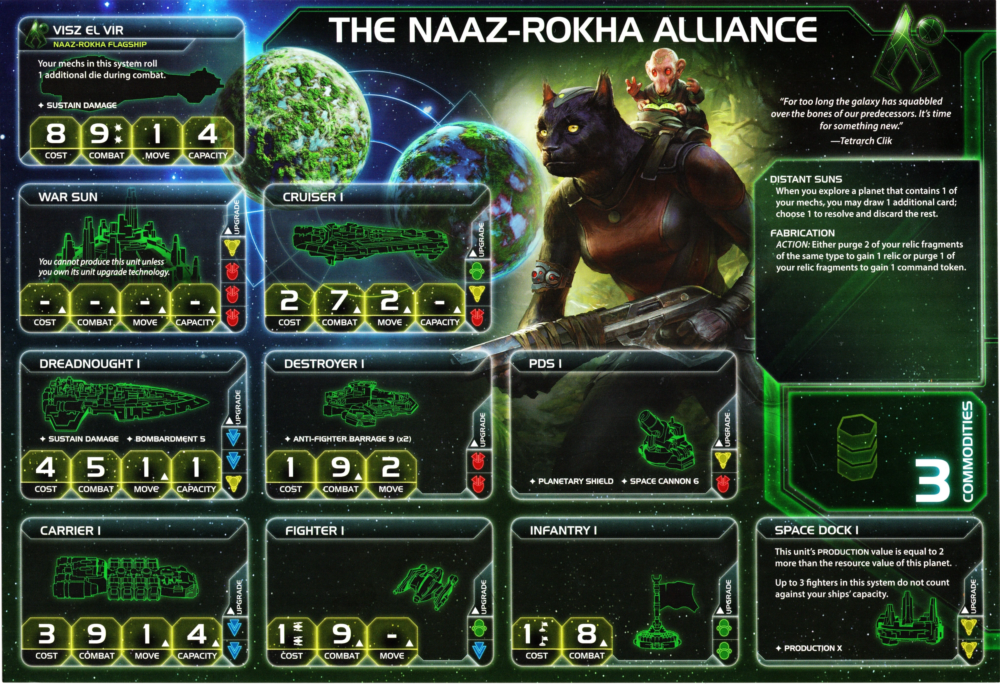

<nav class="page-nav">
<a href="../index.html" class="back-link">Back to Index</a>
<a href="Naaz-Rokha_Alliance.md" download class="download-link" title="Plain text file - safe to download">Download .md</a>
</nav>

# Naaz-Rokha Alliance Guide

## Contents

1. [Introduction](#i-introduction)
2. [Playstyle](#ii-playstyle)
3. [Faction Info and Drafting](#iii-faction-info-and-drafting)
   - [Home System & Commodities](#a-home-system--commodities) · [Starting Fleet](#b-starting-fleet) · [Faction Abilities](#c-faction-abilities) · [Technologies](#d-starting-and-faction-technologies) · [Leaders](#e-leaders) · [Promissory Note](#f-promissory-note) · [Alliance](#g-alliance) · [Mech](#h-mech) · [Flagship](#i-flagship) · [Breakthrough](#j-breakthrough) · [Slice and Draft](#k-slice-and-draft-considerations)
4. [Round 1 Problems and Faction Weakness](#iv-round-1-problems-and-faction-weakness)
5. [Technology](#v-technology)
6. [Strategy Cards](#vi-strategy-cards)
7. [Unit Composition and Game Plan](#vii-unit-composition-and-game-plan)
8. [Objectives](#viii-objectives)
9. [Alliance Priority](#ix-alliance-priority)
10. [Bonus Game Elements](#x-bonus-game-elements)
11. [End Notes](#xi-end-notes)

---

## I. Introduction

The Naaz-Rokha Alliance are TI4's triple-threat faction—planet optimization, relic acquisition, and devastating mech combat. While others explore once and accept whatever they draw, you see two options for every planet and cherry-pick the best. Your planets become superior through premium attachments. Your fragment collection converts into powerful relics. Your mechs win the critical battles that matter.

This faction is about quality over quantity. Double exploration draws let you upgrade ordinary worlds into superior assets and complete relic sets faster than anyone. Your mechs flip to space mode during combat, devastating opponents when battles matter. You don't conquer through overwhelming numbers—you dominate through superior planets, powerful relics, and mechs that win the fights you choose.

## II. Playstyle

Playing Naaz-Rokha means self-sufficiency through exploration mastery. You can handle almost anything on your own—your Distant Suns draws two exploration cards per planet, letting you cherry-pick the best attachments to upgrade planets, choose optimal fragments for relic completion, and reject mediocre results. This doesn't mean you can't trade and play ball with others—your flexibility and lack of economic desperation makes you an excellent negotiation partner. You deal from a position of strength.

Your strategy revolves around activating your own systems repeatedly. Land mechs on planets, explore with Distant Suns for double draws, and combo space docks on those improved planets to produce big fleets at cheap prices. Upgraded planets from exploration attachments provide extra resources, letting you build larger fleets for fewer exhausted planets than opponents expect. Self-activation isn't just about exploration—it's about building superior infrastructure and leveraging it efficiently.

As the game develops, your advantages compound. Commander unlocks easily and lets you explore every planet you conquer—invasions become planet upgrade opportunities. Your Z-Grav Eidolon mechs flip to space mode during combat, providing devastating firepower when battles matter. Flagship enhances mechs to roll additional dice.

Your endgame leverages accumulated advantages. Multiple relics from Fabrication provide game-changing power spikes. Hero gains a free relic and performs 2 strategy card secondaries without spending command tokens—massive swing turn. Your planets are better, your relics are stronger, and your mechs win the fights that matter. Close out games through superior quality, not overwhelming quantity.

---

## III. Faction Info and Drafting

### A. Home System & Commodities

**Home System:** 2 planets
- **Naazir:** 2 resources / 1 influence = 2 optimal resources
- **Rokha:** 1 resource / 2 influence = 2 optimal influence
- **Total: 3 resources / 3 influence (2 optimal resources / 2 optimal influence)**

**Commodities:** 3

**Notes:** Below-average 3/3 home system with low production capacity. Not great defensively—two planets means splitting defenses. Average 3 commodities. Your economy comes from improving planets outside your home system through exploration attachments and leveraging commodities, not from a strong home base.

### B. Starting Fleet

- 2 Carriers
- 1 Destroyer
- 2 Fighters
- 1 Mech
- 3 Infantry
- 1 Space Dock

**Notes:** Fine expansion fleet to grab nearby systems. Starting mech for hazardous planets is always nice. Destroyer provides bonus trade ship capacity for emergencies.

### C. Faction Abilities

**Distant Suns:** When you explore a planet that contains 1 or more of your mechs, you may draw 1 additional card; choose 1 to resolve and discard the rest.

The difference between picking the best exploration result out of 2 cards instead of being forced to accept 1 makes a massive difference. Always get premium attachments, optimal fragments, and powerful bonuses while discarding what other factions would be stuck with.

**Fabrication:** ACTION: Either purge 2 of your relic fragments of the same type to gain 1 relic or purge 1 of your relic fragments to gain 1 command token.

Incredible for getting cheap relics and super flexible for late game stalling. Keep a few fragments banked—when you need to delay passing, Fabricate a command token for double stall value (the action itself delays your pass AND you gain a bonus token for another action). Convert matching fragments to relics when completing sets.

### D. Starting and Faction Technologies

**Starting Technologies:**

**Psychoarchaeology** - You can use technology specialties on planets you control without exhausting them, even if those planets are exhausted. During the action phase, you can exhaust planets you control that have technology specialties to gain 1 trade good.

Small economic flex tool. Most of the time you don't want to exhaust a tech skip planet for just 1 TG since they usually provide more resources/influence on their own. Mostly skip this in favor of increasing mobility through Gravity Drive and Carrier II.

**AI Development Algorithm** - When you research a unit upgrade technology, you may exhaust this card to ignore any 1 prerequisite. When 1 or more of your units use PRODUCTION, you may exhaust this card to reduce the combined cost of the produced units by the number of unit upgrade technologies that you own.

Great tool if you plan to go for a few unit upgrades. However, NRA commonly goes for value and utility techs instead, so not always the best value for your playstyle.

**Faction Technologies:**

**Pre-Fab Arcologies (GGG):** After you explore a planet, ready that planet.

Very strong tech if you get it online early. Decide early if you're going for locked-down, self-sufficient NRA that can afford to go all the way down green, or if you need mobility instead. The tech is definitely strong, but needs green skip or Entropic Scar to be feasible with the steep triple-green prerequisite.

**Supercharge (R):** At the start of a combat round, you may exhaust this card to apply +1 to the result of each of your unit's combat rolls during this combat round.

Exhaustable Morale Boost action card. Nothing to care about really—only get if it helps with objectives.

### E. Leaders

**Agent - Garv and Gunn:** At the end of a player's turn: You may exhaust this card to allow that player to explore 1 of their planets.

Almost always use on yourself. You have Distant Suns to maximize each exploration—keep digging for the gems with double card draws.

**Commander - Dart and Tai:** *Unlock: Have mechs in 3 systems.* After you gain control of a planet that was controlled by another player: You may explore that planet.

Natural unlock based on your powerful mechs being spread out for exploration anyway. Provides solid economy when you do conquer planets. Rarely are you in a position to grab tons of planets, but the bonus exploration with Distant Suns when taking key systems adds value.

**Hero - Hesh and Prit:** *Unlock: Have 3 scored objectives.* Perfect Synthesis - ACTION: Gain 1 relic and perform the secondary ability of up to 2 readied or unchosen strategy cards; during this action, spend command tokens from your reinforcements instead of your strategy pool. Then, purge this card.

Very solid value. Probably pop as early as possible to get a relic that snowballs your faction. The free secondaries can help with objectives too.

### F. Promissory Note - **Black Market Forgery**

ACTION: Purge 2 of your relic fragments of the same type to gain 1 relic. Then, return this card to the Naaz-Rokha player.

Fabrication for another player. Always sells—commonly trades for 2 TGs or a fragment in return. If someone has 3 fragments, offer them 1 TG + BMF for a fragment—good value for both parties.

### G. Alliance

**Alliance Ability:**
*While the Naaz-Rokha player's commander is unlocked:*
*After you gain control of a planet that was controlled by another player, you may explore that planet.*

Solid value for conquest-focused factions. Provides extra exploration opportunities when taking planets from opponents. Trade value: 2-3 TG.

### H. Mech - **Eidolon / Z-Grav Eidolon**

Cost: 2 | Combat: 6 (x2) | **Sustain Damage**

**Eidolon (Ground Mode):** If this unit is in the space area of the active system at the start of a space combat, flip this card. This card begins the game with this side faceup.

**Z-Grav Eidolon (Space Mode - Flipped):** Cost: 2 | Combat: 8 (x2) | If this unit is in the space area of the active system, it is also a ship. At the end of a space battle in the active system, flip this card. This card begins the game with this side facedown.

The strongest mech in the game with unmatched combat power. Combat 6 (x2) with Sustain Damage on the ground makes them powerful defenders and invaders. When they flip to space mode during combat, they lose Sustain Damage but become devastating with combat 8 (x2)—trading durability for firepower. With flagship, each mech rolls 3 dice total—overwhelming firepower. Strategic positioning matters: leave mechs in space against bombardment-heavy factions to threaten their ships, otherwise defend on the ground where Sustain Damage matters. Your mechs win battles that matter.

### I. Flagship - **Visz El Vir**

Cost: 8 | Combat: 9 (x2) | Move: 1 | Capacity: 4 | **Sustain Damage**

Your mechs in this system roll 1 additional die during combat.

One of your strongest assets. Mechs in the system get +1 die each, turning already powerful mechs into devastating combat units. Move 1 makes this more of a defensive ship—anchor important systems rather than chase fleets.

### J. Breakthrough - **Absolute Synergy (B↔G)**

When you have 4 mechs in the same system, you may return 3 of those mechs to your reinforcements to flip this card and place it on top of your mech card.

**Eidolon Maximum (Flipped):** This unit is both a ship and ground force. It cannot be assigned hits from unit abilities. Repair it at the start of every combat round. Game effects cannot place or produce your mechs. When this unit is destroyed or removed, flip this card and return it to your play area. Combat: 4 (x4) | Move: 3 | **Sustain Damage**

The super-mech trades 3 powerful mechs (Combat 6 x2 each with Sustain on ground, Combat 8 x2 in space) for one unit with Combat 4 (x4), Move 3, Sustain that repairs every round. You lose defensive power (multiple Sustains) and offensive flexibility (mechs in different systems). While you can take planets (it's both ship and ground force), winning both space and ground combat by yourself with one unit is very hard. Situational—most games you're better keeping normal mechs spread across the board.

**B↔G Synergy:** Blue and green count as each other for prerequisites. Nice to skip into Gravity Drive and get mobility upgrades. If exploration gets you tech skips or you feel like you got an easy unlock, you can consider flipping the breakthrough.

### K. Slice and Draft Considerations

**Speaker Order:** Flexible. Prioritize good slice over speaker position.

**Neighbors:** No special neighbor requirements. If you want to make offensive plays, ensure opponent slices are adjacent and don't have lots of empty space or anomalies blocking access.

**Slice Priorities:**

- **One of each planet type** - Maximizes fragment variety for relic completion. If you must make concessions, skip green (cultural planets have least fragments).
- **High planet count** - More exploration opportunities for Distant Suns value.

**Nice to Have:**

- Blue or green tech skip.
- Hopes End (awesome with super mechs).

**Avoid:**

- Low planet count slices.

---

## IV. Round 1 Problems and Faction Weakness

### A. First Turn Priorities

**Round 1 Priority Rankings:**

1. **Scoring** - Do it if it seems natural and easy. You're not very flexible with objective alignment—take what comes naturally.

2. **Expansion and Production** - Get bonus plastic on the board. Expand to 2-3 systems, explore with mechs for Distant Suns value. Your kit is good at some things and not at others—focus on what works.

3. **Technology** - Your kit is not very tech dependent. Tech helps but isn't critical early.

4. **Breakthrough** - Very low priority. Flipping breakthrough rarely worth it—keep normal mechs.

**Expansion Notes:** Send mech to hazardous planets if possible for a great start. You have solid nearby expansion options. Unless you get tech skips from exploration, you won't explore your full slice Round 1—you'll have to do the slow walk to reach distant planets.

### B. Mobility

You have a hard time influencing others and they have a hard time influencing you. You win more than average, but if someone is running away with the game you're relying on others to do the dirty work.

---

## V. Technology

### A. Overview

**Starting Tech:** Psychoarchaeology (0) and AI Development Algorithm (0).

**Psychoarchaeology:** Use tech specialties without exhausting or exhaust them for trade goods. Small flex tool.

**AI Development Algorithm:** Skip unit upgrade prerequisites and reduce production costs by number of unit upgrades owned. Good if going for unit upgrades but you commonly go for value/utility techs instead.

Your kit is not very tech dependent. Choose your path based on slice and game state. Green Path focuses on economic snowball with Pre-Fab Arcologies improving explored planets, Hyper Metabolism for command tokens, and X-89 for devastating ground combat—requires green skip or Entropic and works best with resource-heavy slices. Mobility Path prioritizes map control with Dark Energy Tap for exploration synergy, Gravity Drive + Carrier II for moving mechs around, and Dreadnought II for combat backbone—more flexible and adaptable but doesn't synergize with faction identity as strongly.

### B. Technology Paths

**Green Path (Economic):**

**Round 1:** Bio-Stims (G)
- You may exhaust this card at the end of your turn to ready 1 of your planets that has a technology specialty or 1 of your other technologies
- **Why:** Flexibility to ready tech planets or other technologies.

**Round 2:** Hyper Metabolism (GG)
- During the status phase, gain 3 command counters instead of 2
- **Why:** Command token economy for activations.

**Round 3:** Pre-Fab Arcologies (GGG)
- ACTION: Attach this card to a non-home planet you control. Its resource and influence values are each increased by 2. Attach only if the planet has 1 or more attachments or you have a mech on the planet
- **Why:** Massively improves planets you've explored and upgraded.

**Round 4:** Destroyer II (RR)
- Cost 1, Combat 8, Move 2, AFB 6 (x3)
- **Why:** Cheap, mobile ships with strong anti-fighter.

**Round 5:** X-89 Bacterial Weapon (GGG)
- After 1 or more of your units use BOMBARDMENT against a planet, if at least 1 of your opponent's infantry was destroyed, destroy all of your opponent's infantry on that planet. Double the hits produced by your units' BOMBARDMENT and ground combat rolls. Exhaust each planet you use BOMBARDMENT against
- **Why:** Devastating ground combat power.

**Mobility Path:**

**Round 1:** Dark Energy Tap (0)
- After you perform a tactical action in a system that contains a frontier token, if you have 1 or more ships in that system, explore that token. Your ships can retreat into adjacent systems that do not contain other players' units even if you do not have units or control planets in that system
- **Why:** Exploration synergy and retreat flexibility.

**Round 2:** Gravity Drive (B)
- After you activate a system, apply +1 to the move value of 1 of your ships during this tactical action
- **Why:** Mobility for repositioning fleets and bringing mechs to exploration zones.

**Round 3:** Carrier II (BB)
- Cost 3, Combat 9, Move 2, Capacity 6
- **Why:** Transport capacity for mechs. Move 2 carriers with Gravity Drive gets you around the map.

**Round 4:** Dreadnought II (BBY)
- Cost 4, Combat 5, Move 2, Capacity 1, Sustain Damage, BOMBARDMENT 5. Cannot be destroyed by "Direct Hit" action cards
- **Why:** Strong combat backbone with bombardment and sustain.

**Round 5:** Destroyer II (RR)
- Cost 1, Combat 8, Move 2, AFB 6 (x3)
- **Why:** Cheap, mobile ships with strong anti-fighter.

---

## VI. Strategy Cards

### A. Round 1

**Round 1 Priority Ranking:**

1. **Technology** - Frees up resources and saves a strategy token for other uses.

2. **Trade** - Flexibility with 3 commodities.

3. **Leadership** - Great token economy and flexible strategy token.

4. **Politics** - Setup for Round 2. Agenda is not for R1.

5. **Warfare** - If your slice requires getting out further to reach systems.

6. **Construction** - If you have planet systems nearby to expand into.

7. **Diplomacy** - Only for specific objectives.

8. **Imperial** - Never Round 1.

**Strategy Token Priority:** Technology and Trade secondaries if available. Warfare for strategy token.

### B. Round 2+

**Love:**

- **Imperial** - Points are points. Take when you can score.
- **Leadership** - Command tokens for explores and activations.

**Like:**

- **Technology** - Stay on your tech path.
- **Politics** - Agenda control and speaker trading.
- **Trade** - 3 commodities for consistent economy.

**Situational:**

- **Construction** - Fine until you have docks that can produce + explore for token efficiency.
- **Warfare** - Only if you have specific aggressive plays or need fleet readying.
- **Diplomacy** - Protect key systems or lock down important tiles.

---

## VII. Unit Composition and Game Plan

### A. Unit Composition

Your ideal fleet composition:

- **Mechs** - The core of your military power. Combat 6 (x2) with Sustain on ground, Combat 8 (x2) in space. Essential for exploration (Distant Suns double draws) and winning critical battles. With flagship, each mech rolls 3 dice—devastating firepower.
- **Carriers** - Transport for mechs. Capacity 6 (or 8 with Carrier II) means you can load 3 mechs + infantry. Move mechs where battles matter.
- **Flagship** - Force multiplier for mechs (+1 die each). A flagship with 3 mechs creates 11 combat dice total—nearly unbeatable.
- **Destroyers** - AFB screening and cheap fleet presence. Cost-efficient ships for objectives.
- **Infantry** - Ground forces for holding planets. Mechs do the heavy combat lifting.
- **Fighters** - Cheap hit points and fleet filler.

Focus on mech-centered fleets. Mechs win battles while providing exploration value through Distant Suns. Your strength is quality units that control critical systems—Mecatol, industrial planets, chokepoints. You don't need massive fleets; you need mechs in the right places.

### B. Game Plan

**Early Game (Rounds 1-2):**

Expand to 2-3 systems and explore with mechs for Distant Suns value. Always place mechs before exploring to draw 2 cards and pick the best. Use Fabrication to convert fragments to command tokens if you need expansion fuel. Commander unlock is natural (3 mechs in 3 systems). Focus on getting quality planets upgraded through exploration attachments rather than grabbing maximum territory.

**Mid Game (Rounds 3-4):**

With commander online, every planet you take lets you explore—makes invasions worth more. Continue placing mechs before invading for Distant Suns double draw value. Start converting fragment sets into relics when you complete them. Your mechs win the battles that matter—use them to hold key systems or threaten opponents. Don't spread too thin; quality positions beat quantity.

**Late Game (Round 5+):**

Use hero for massive swing turn—free relic plus 2 strategy secondaries without spending tokens. Your relics provide power spikes opponents lack. Flagship + mechs creates overwhelming combat force for critical battles. Close out with superior planets, powerful mechs, and relic advantages. You win through quality, not quantity.

---

## VIII. Objectives

### A. Objective Summary

**Strengths:** Token spending objectives are easy—Fabrication converts fragments to command tokens. Resource and influence spending objectives are strong for Stage II with upgraded planets. Ships in systems objectives are solid for Stage I with mobile fleets. Unit upgrade tech objectives benefit from AI Dev Algorithm. Attachment objectives are strong with Distant Suns exploration. Structure objectives for Stage I are achievable. Select combat secrets are manageable with powerful mechs.

**Weaknesses:** Trade good spending objectives are harder without Trade card. Stage II control objectives are challenging—you don't conquer aggressively. Ships in systems for Stage II require heavy investment. Planet trait objectives are difficult. Tech specialty control objectives are hard. Master of Sciences requires spreading too wide in tech. Structure objectives for Stage II need major investment. Combat secrets requiring special abilities are difficult. Production and agenda objectives don't align with faction strengths.

### B. Stage I Objectives

| Stage I Objective                                                       | Status |
|-------------------------------------------------------------------------|--------|
| **Spendies**                                                            |        |
| Erect a Monument (Spend 8 resources)                                    | 🟢     |
| Sway the Council (Spend 8 influence)                                    | 🟢     |
| Negotiate Trade Routes (Spend 5 trade goods)                            | 🟡     |
| Lead from the Front (Spend 3 tokens from tactic/strategy pools)         | 🟢     |
| Amass Wealth (Spend 3 influence, 3 resources, 3 trade goods)            | 🟢     |
| **Control**                                                             |        |
| Expand Borders (Control 6 planets in non-home systems)                  | 🟢     |
| Corner the Market (Control 4 planets with same trait)                   | 🔴     |
| Found Research Outposts (Control 3 planets with tech specialties)       | 🟡     |
| Discover Lost Outposts (Control 2 planets with attachments)             | 🟡     |
| Push Boundaries (Control more planets than each neighbor)               | 🟢     |
| **Ships in Systems**                                                    |        |
| Intimidate the Council (Ships in 2 systems adjacent to MR)              | 🟢     |
| Explore Deep Space (Units in 3 systems without planets)                 | 🟢     |
| Make History (Units in 2 systems with legendary/MR/anomalies)           | 🟢     |
| Populate the Outer Rim (Units in 3 edge systems)                        | 🟢     |
| Raise a Fleet (5+ non-fighter ships in 1 system)                        | 🟢     |
| Engineer a Marvel (Have flagship or war sun on board)                   | 🟢     |
| **Tech**                                                                |        |
| Diversify Research (Own 2 tech in each of 2 colors)                     | 🟢     |
| Develop Weaponry (Own 2 unit upgrade technologies)                      | 🟢     |
| **Structure**                                                           |        |
| Build Defenses (Have 4 or more structures)                              | 🟢     |
| Improve Infrastructure (Structures on 3 planets outside HS)             | 🟢     |

**Legend:** 🟢 Likely | 🟡 Possible | 🔴 Difficult

### C. Secret Objectives

| Secret Objective                                                         | Status |
|--------------------------------------------------------------------------|--------|
| **Combat**                                                               |        |
| Unveil Flagship (Win space combat with flagship)                         | 🟢     |
| Destroy their Greatest Ship (Destroy war sun/flagship)                   | 🔴     |
| Spark a Rebellion (Win combat vs VP leader)                              | 🟢     |
| Betray a Friend (Win combat vs player whose PN you have)                 | 🟢     |
| Brave the Void (Win combat in anomaly)                                   | 🟢     |
| Darken the Skies (Win combat in another player's HS)                     | 🔴     |
| Demonstrate your Power (3+ non-fighter ships after space combat)         | 🟢     |
| Turn their Fleets to Dust (SPACE CANNON destroy last ship)               | 🔴     |
| Make an Example (BOMBARDMENT destroy last ground forces)                 | 🔴     |
| Fight With Precision (AFB destroy last fighter)                          | 🟢     |
| **Ships in Systems**                                                     |        |
| Threaten Enemies (Ships adjacent to another player's HS)                 | 🟡     |
| Cut Supply Lines (Ships in system with enemy space dock)                 | 🟡     |
| Defy Space and Time (Units in wormhole nexus)                            | 🟡     |
| Become the Gatekeeper (Ships in alpha and beta wormhole systems)         | 🟡     |
| Learn Secrets of the Cosmos (Ships in 3 systems adjacent to anomalies)   | 🟢     |
| Control the Region (Ships in 6 systems)                                  | 🟢     |
| Occupy the Seat of the Empire (Control MR with 3+ ships)                 | 🔴     |
| **Control**                                                              |        |
| Monopolize Production (Control 4 industrial planets)                     | 🔴     |
| Mine Rare Minerals (Control 4 hazardous planets)                         | 🔴     |
| Forge an Alliance (Control 4 cultural planets)                           | 🔴     |
| Establish Hegemony (Control planets with 12+ influence)                  | 🟢     |
| Hoard Raw Materials (Control planets with 12+ resources)                 | 🟢     |
| Seize an Icon (Control legendary planet)                                 | 🟢     |
| Stake Your Claim (Control planet in contested system)                    | 🟡     |
| Become a Martyr (Lose control of planet in home system)                  | 🟡     |
| **Tech**                                                                 |        |
| Adapt New Strategies (Own 2 faction technologies)                        | 🟡     |
| Master the Laws of Physics (Own 4 tech of same color)                    | 🟢     |
| **Structure/Units**                                                      |        |
| Establish a Perimeter (Have 4 PDS on board)                              | 🔴     |
| Fuel the War Machine (Have 3 space docks)                                | 🟢     |
| Gather a Mighty Fleet (Have 5 dreadnoughts)                              | 🟡     |
| Mechanize the Military (1 mech on each of 4 planets)                     | 🟢     |
| Occupy the Fringe (9+ ground forces on planet without space dock)        | 🔴     |
| Produce en Masse (Units with PRODUCTION 8+ in single system)             | 🔴     |
| **Other**                                                                |        |
| Dictate Policy (3+ laws in play)                                         | 🔴     |
| Drive the Debate (You/your planet elected by agenda)                     | 🔴     |
| Destroy Heretical Works (Purge 2 relic fragments)                        | 🟢     |
| Form a Spy Network (Discard 5 action cards)                              | 🟡     |
| Foster Cohesion (Be neighbors with all players)                          | 🟢     |
| Strengthen Bonds (Have another player's PN)                              | 🟢     |
| Prove Endurance (Last to pass)                                           | 🟢     |

**Legend:** 🟢 Likely | 🟡 Possible | 🔴 Difficult

### D. Stage II Objectives

| Stage II Objective                                                       | Status |
|--------------------------------------------------------------------------|--------|
| **Spendies**                                                             |        |
| Centralize Galactic Trade (Spend 10 trade goods)                         | 🟡     |
| Found a Golden Age (Spend 16 resources)                                  | 🟢     |
| Galvanize the People (Spend 6 tokens from tactic/strategy pools)         | 🟢     |
| Manipulate Galactic Law (Spend 16 influence)                             | 🟢     |
| Hold Vast Reserves (Spend 6 influence, 6 resources, 6 trade goods)       | 🟢     |
| **Control**                                                              |        |
| Conquer the Weak (Control 1 planet in another player's HS)               | 🔴     |
| Rule Distant Lands (Control 2 planets in/adjacent to different players' HS) | 🔴 |
| Subdue the Galaxy (Control 11 planets in non-home systems)               | 🔴     |
| Unify the Colonies (Control 6 planets with same trait)                   | 🔴     |
| Reclaim Ancient Monuments (Control 3 planets with attachments)           | 🟢     |
| Form Galactic Brain Trust (Control 5 planets with tech specialties)      | 🔴     |
| **Ships in Systems**                                                     |        |
| Command an Armada (Have 8+ non-fighter ships in 1 system)                | 🟡     |
| Achieve Supremacy (Flagship/War Sun in another player's HS or MR)        | 🔴     |
| Become a Legend (Units in 4 systems with legendary/MR/anomalies)         | 🔴     |
| Patrol Vast Territories (Units in 5 systems without planets)             | 🔴     |
| Control the Borderlands (Units in 5 edge systems not HS)                 | 🔴     |
| **Tech**                                                                 |        |
| Master of Sciences (Own 2 techs in each of 4 colors)                     | 🔴     |
| Revolutionize Warfare (Own 3 unit upgrade technologies)                  | 🟢     |
| **Structure**                                                            |        |
| Construct Massive Cities (Have 7+ structures)                            | 🔴     |
| Protect the Border (Structures on 5 planets outside HS)                  | 🔴     |

**Legend:** 🟢 Likely | 🟡 Possible | 🔴 Difficult

---

## IX. Alliance Priority

**Top Tier:**

1. **Crimson Rebellion (Ahk Siever)** - Gain commodity/TG at end of combat. Passive income.
2. **Deepwrought (Aello)** - Gain commodity/TG when others research tech with discount. Passive income addresses weak commodity economy.
3. **Muaat (Magmus)** - Gain 1 TG after spending strategy token. Passive income from secondaries.
4. **Nomad (Navarch Feng)** - Produce flagship without spending resources. Free Visz El Vir (8 resources saved).
5. **Winnu (Rickar Rickani)** - Apply +2 combat in MR, home system, legendary planets. Combat boost for exploration targets.

**Good:**

6. **Vuil'raith Cabal (That Which Molds Flesh)** - Up to 2 fighters/infantry don't count against PRODUCTION limit. Extra production capacity.
7. **Nekro Virus (Nekro Acidos)** - Draw 1 action card after gaining tech. Action card economy.
8. **Titans of Ul (Tungstantus)** - Gain 1 TG when using PRODUCTION. Passive income.
9. **Barony of Letnev (Rear Admiral Farran)** - Gain 1 TG after unit uses Sustain Damage. Passive income from mechs.
10. **Yin Brotherhood (Brother Omar)** - Green prereq + skip prereqs when researching others' tech. Tech path flexibility helps both Green and Mobility paths.

---

## X. Bonus Game Elements

This section highlights action cards that synergize particularly well with your faction's strengths or mitigate your weaknesses, relics that offer exceptional value for your faction's strategy and abilities, and agendas to pursue that benefit your position, and agendas to watch out for that could hurt you.

### A. High-Value Action Cards

### B. Relic Priorities

### C. Agenda Awareness

---

## XI. End Notes

Naaz-Rokha Alliance is the faction for players who like making every choice matter. Your Distant Suns ability means you always pick the best of two exploration cards—premium attachments, ideal fragments, superior upgrades. Your planets become better than their printed values. Your mechs win the battles that count.

Your strength is quality over quantity. Explore aggressively early to upgrade your planets and collect fragments. Convert fragments to relics when you complete sets or to command tokens when you need fuel. Your powerful mechs win critical battles without needing massive fleets.

The NRA experience rewards strategic positioning. You're not conquering the galaxy—you're improving the slice you have while your powerful mechs defend key systems. You win through superior planets, strong relics, and quality units that matter when battles count.

**"We take what's worthwhile and make it exceptional."**
