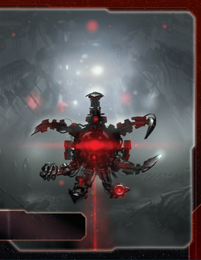

# Nekro Virus Guide

---

## I. Introduction

The Nekro Virus are TI4's tech-stealing cyborg hivemind that cannot research technologies—they assimilate them through conquest. Every destroyed ship is knowledge harvested, every correct agenda prediction is understanding absorbed. You don't build technology; you consume it from those foolish enough to stand against the swarm.

This faction embodies relentless aggression. Your fleets don't just conquer—they learn. Your flagship doesn't just fight—it weaponizes your ground forces in space combat. While other factions carefully research their technologies, you'll have stolen double through sheer force. The galaxy will fear the Nekro Virus not for what you build, but for what you take.

## II. Playstyle

Playing Nekro Virus is like being a technological vampire—you must feed on your enemies to grow stronger. Your Technology Singularity steals techs when you destroy enemy ships, your Galactic Threat predicts agendas to steal techs from voters, and your Propagation converts research actions into command tokens. You're not trying to win peacefully—you're winning through aggression, tech theft, and overwhelming technological superiority.

The key strength of Nekro is technological breadth. Normal factions carefully research their technologies. You'll have double by endgame, stolen from multiple opponents, giving you unit upgrades and utility techs that no normal faction could afford. Understanding WHO to fight and WHEN separates good Nekro players from great ones.

Opponents will hate you—you're incentivized to attack everyone, and your power scales with their destruction. Early game, you'll make deals and non-aggression pacts to survive. Mid-to-late game, you become too technologically advanced to care about those promises.

---

## III. The Basics

### A. Home System & Commodities

**Home System:**
- **Mordai II:** 4 resources / 0 influence
- **Total: 4 resources / 0 influence (4 optimal resources / 0 optimal influence)**

**Commodities:** 3

**Notes:** Single-planet home is easier to defend than multi-planet systems. Usually factions with only resource home systems are token starved, but Propagation fixes this—you gain 3 command tokens when following Technology instead of researching. Mordai II is a strong production hub with 4 resources for military builds. 0 influence means you rely entirely on conquering planets for influence objectives.

### B. Starting Fleet

- 1 Dreadnought
- 1 Carrier
- 1 Cruiser
- 2 Fighters
- 2 Infantry
- 1 Space Dock

**Notes:** Strong starting fleet in space with a dreadnought for early aggression. The cruiser + carrier provide capacity for expansion. Problem is only 2 infantry—this can make you slightly limited in which slices you thrive in, as you need planets you can reasonably conquer with minimal ground forces.

### C. Faction Abilities

**Galactic Threat (Faction Ability):** You cannot vote on agendas. Once per agenda phase, after an agenda is revealed, you may predict aloud the outcome of that agenda. If your prediction is correct, gain 1 technology that is owned by a player who voted how you predicted.

Cannot vote on agendas, which is crippling politically. However, once per agenda phase, predict the outcome. If correct, steal a tech from ANY player who voted that way. Maximum 5 techs over the game (one per round), but realistically expect 2-3 because of the abstain problem—everyone can abstain and the speaker decides the outcome to screw you out of tech.

**Technology Singularity (Faction Ability):** Once per combat, after 1 of your opponent's units is destroyed, you may gain 1 technology that is owned by that player.

Your defining ability. Once per combat (not per ship—per entire combat), after destroying an enemy unit, steal one of their technologies. This incentivizes constant aggression. Every combat is a research opportunity. Note this happens in both space combat and ground combat—invading a 2-planet system could net you 3 techs (1 from space, 1 from each ground combat).

**Propagation (Faction Ability):** You cannot research technology. When you would research a technology, gain 3 command tokens instead.

You CANNOT research technologies normally. If you follow Technology primary/secondary, instead of researching, gain 3 CCs. This seems bad but actually provides excellent economy—3 CCs fund more aggression for more tech theft. On the secondary, you spend 4 resources for a net +2 tokens (spend 1 from strategy pool, gain 3), which is a steal compared to paying 6 influence for 2 tokens on Leadership.

### D. Starting and Faction Technologies

**Starting Technologies:**

**Dacxive Animators (G)** - After you win a ground combat, you may place 1 infantry from your reinforcements on that planet.

One of the worst starting technologies in the game—you'd take almost any other. However, it's helpful for unlocking your Commander and an extra infantry here and there never hurts.

**Valefar Assimilator X** - When you gain another player's technology using one of your faction abilities, you may place the "X" assimilator token on a faction technology owned by that player instead. While that token is on a technology, this card gains that technology's text. You cannot place an assimilator token on technology that already has an assimilator token.

**Valefar Assimilator Y** - When you gain another player's technology using one of your faction abilities, you may place the "Y" assimilator token on a faction technology owned by that player instead. While that token is on a technology, this card gains that technology's text. You cannot place an assimilator token on technology that already has an assimilator token.

**Notes:** Valefar Assimilators let you copy enemy FACTION technologies instead of normal techs when stealing. This is incredibly powerful and makes you have 0 reason to be in Entropic Scar. You can have high variance of how good the faction techs available in the game can be, but usually there are some good ones.

### E. Leaders

**Agent - Nekro Malleon:**

During the action phase: You may exhaust this card to choose a player; that player may discard 1 action card or spend 1 command token from their command sheet to gain 2 trade goods.

Gives a surprising amount of economy and there's no shortage of useless action cards when you start pulling a few around.

**Commander - Nekro Acidos:** *Unlock: Own 3 technologies. A "Valefar Assimilator" technology counts only if its X or Y token is on a technology.*

After you gain a technology: You may draw 1 action card.

Unlocks after owning 3 technologies (Valefar Assimilators only count if you've placed their tokens). Every time you gain a tech (combat theft, agenda prediction), draw 1 action card. Note that placing a Valefar Assimilator token is NOT gaining a technology, so Commander doesn't trigger from that.

**Hero - UNIT.DSGN.FLAYESH:** *Unlock: Have 3 scored objectives.*

**Polymorphic Algorithm - ACTION:** Choose a planet that has a technology specialty in a system that contains your units. Destroy any other player's units on that planet. Gain trade goods equal to the planet's combined resource and influence values and gain 1 technology that matches the specialty of that planet. Then, purge this card.

Can be used offensively but often just good bonus economy and try to get a tech you would probably not get from somewhere else.

### F. Promissory Note - **Antivirus**

At the start of a combat: Place this card faceup in your play area. While this card is in your play area, the Nekro player cannot use his Technological Singularity faction ability against you. If you activate a system that contains 1 or more of the Nekro player's units, return this card to the Nekro player.

You should want a ton for giving this up—you lose so much value by removing a target from your tech theft options. Usually the person asking for it is a neighbor. Only sell this once you've already exhausted their tech options, and if they still want to buy it then.

### G. Alliance

Whoever holds your alliance card has your Commander (Nekro Acidos - draw 1 action card after gaining a technology).

If you sell this early, it will generate 4-5 action cards for the holder over the course of the game. Probably 4-5 TG value, but try to trade up—you're a scary faction so you can get a top tier alliance as people want to incentivize you to not attack them.

### H. Mech - **Mordred**

Cost: 2 | Combat: 6 | **Sustain Damage**

**Special Ability:** During combat against an opponent who has an "X" or "Y" token on 1 or more of their technologies, apply +2 to the result of each of this unit's combat rolls.

It's a punch those who are already down—if you stole their techs your mechs become even better. Crazy synergy with flagship to have murderous flying mechs—one of the strongest ships in the game that also fights on the ground.

### I. Flagship - **The Alastor**

Cost: 8 | Combat: 9 (x2) | Move: 1 | Capacity: 3 | **Sustain Damage**

**Special Ability:** At the start of a space combat, choose any number of your ground forces in this system to participate in that combat as if they were ships.

Note how the flagship makes it redundant to have fighters—your infantry are just better fighters that can also be on the ground. Your flagship, a couple of mechs + some carriers filled with infantry is one of the strongest fleets in the game, don't let the hit on 9 fool ya.

### J. Breakthrough

**Valefar Assimilator Z (Temporal Entanglement)** - When you would gain another player's technology using one of your faction abilities, you may instead place one of your "Z" assimilator tokens on that player's faction sheet. Your flagship gains the text abilities of that faction's flagship in addition to its own.

Gives you very little—save resources by not getting it. Unless you fully understand why you want it for a specific flagship ability, leave it. Only very few flagships are good targets: Nomad, Naaz, Winnu, Yssaril, Sardakk, Crimson, Ghosts, Jol-Nar, Mahact, Last Bastion, Arborec, Naalu, Yin, Barony, Mentak are some potential targets. You have to consider it costs you a tech and an AC.

**Special note:** Fun anti-Ghosts tech to say hello to their home system.

### K. Slice and Draft Considerations

Nekro needs access to tech-rich opponents and strong planets for military production:

**Speaker Order:**
Can be anywhere. Flexible. Tech-prone neighbors good.

**Slice Priorities:**
- **Strong planets nearby** - Need resources for military production.
- **Resources over influence** - Can't vote and can get tokens through resources.
- **Primor / Hope's End** - Helps early game. Lack of ground forces (only 2 infantry to start).
- **Access to people** - You need to reach opponents for tech theft.

**Avoid:**
- **Gravity rifts to neighbors** - Hard to reach through.
- **Asteroid fields to neighbors** - Blocks access.
- **Novas** - Need to have access to people.
- **Entropic Scar** - Useless with Valefar Assimilators.

---

## IV. Structural Weaknesses

### A. First Turn Priorities

**Round 1 Priority Rankings:**

1. **Scoring** - Super priority. You're not a fun target to stop, so stay ahead.

2. **Expansion** - Solving your 2 infantry problem. Expand to be able to reach people and get tech through combat.

3. **Technology** - Try to make a deal for some early tech if possible—better than making an early enemy. If Gravity Drive is on the map, get it ASAP.

4. **Breakthrough** - Only for Thunder's Edge and screwing with people.

**Expansion Notes:** You have to produce and take a few systems nearby. If you produce through Warfare or Construction, use the unlocked units to send a spec ops crew to find an early tech—maybe snipe a destroyer that picked up DET or something. Otherwise you have to walk it kind of slow. Use your superior token economy to get a head start on economy.

### B. Universal Table Hate

Everyone knows you must attack to gain techs. This makes you the table's villain automatically. Expect coordinated opposition, defensive alliances against you, and constant political targeting. You're also a late game beast, so people are not too happy to deal with you early even if you are nice.

Try to play it smart—keep it even, don't target one person way more. Everyone usually has different tech, so it's good to attack everyone equally to be fair and for your own gain.

---

## V. Technology

### A. Overview

You're a tech powerhouse—the person who will almost always end up with the most tech of every type. It will cause diplomatic damage, but in the end, the singularity will consume all.

### B. Technology Stealing Priority

Since you steal techs rather than researching, prioritize targets by tech value:

**Unit Upgrades:**

- **Carrier II (BB)** - Always
  - Cost 3, Combat 9, Move 2, Capacity 6. Essential transport for invasion fleets.
- **Dreadnought II (BBY)** - Always
  - Cost 4, Combat 5, Move 2, Capacity 1, Sustain, BOMBARDMENT 5. Cannot be destroyed by Direct Hit.
- **Destroyer II (RR)** - Always
  - Cost 1, Combat 8, Move 2, AFB 6 (x3). Cheap fleet power.
- **Cruiser II (GYR)** - Always
  - Cost 2, Combat 6, Move 3, Capacity 1, Sustain. Fast mobile ships.
- **Infantry II (GG)** - Always
  - Cost 1 (x2), Combat 7. 6+ chance to revive after death. Flagship makes these deadly.
- **Space Dock II (YY)** - Always
  - PRODUCTION equals 4 + planet resources. Up to 3 fighters don't count against capacity.
- **Fighter II (GB)** - Good
  - Cost 1 (x2), Combat 8, Move 2. Less relevant with flagship infantry strategy.
- **War Sun (RRRY)** - Good
  - Cost 12, Combat 3 (x3), Move 2, Capacity 6, Sustain, BOMBARDMENT 3 (x3). Removes Planetary Shield.
- **PDS II (RY)** - Emergency
  - Planetary Shield, SPACE CANNON 5. Can shoot ships in adjacent systems.

**Blue Technologies:**

- **Gravity Drive (B)** - Always
  - +1 move to 1 ship after activating system. Critical for aggression.
- **Fleet Logistics (BB)** - Always
  - Perform 2 actions per turn instead of 1. Game-changing.
- **Sling Relay (B)** - Always
  - ACTION: Produce 1 ship at any space dock.
- **Light/Wave Deflector (BBB)** - Always
  - Move through systems with enemy ships. Bypass blockades.
- **Antimass Deflectors** - Good
  - Move through asteroid fields. -1 to enemy SPACE CANNON against you.
- **Dark Energy Tap** - Good
  - Explore frontier tokens after tactical actions. Retreat into systems without units/control.

**Red Technologies:**

- **Duranium Armor (RR)** - Always
  - Repair 1 damaged unit per combat round that didn't use Sustain.
- **Assault Cannon (RRR)** - Always
  - Opponent destroys 1 non-fighter ship at space combat start if you have 3+ non-fighters.
- **Plasma Scoring** - Good
  - +1 die for BOMBARDMENT or SPACE CANNON.
- **AI Development Algorithm** - Good
  - Ignore 1 prerequisite for unit upgrades. Reduce production cost by unit upgrade count.
- **Magen Defense Grid (R)** - Good
  - Place infantry with structures when activated. Produce 1 hit at ground combat start.
- **Self-Assembly Routines (R)** - Good
  - Place mech after PRODUCTION. Gain TG when mech destroyed.

**Yellow Technologies:**

- **Sarween Tools** - Always
  - -1 cost when using PRODUCTION.
- **Integrated Economy (YYY)** - Always
  - Produce units on conquered planet equal to resource value.
- **Scanlink Drone Network** - Good
  - Explore 1 planet when activating system.
- **Graviton Laser System (Y)** - Good
  - SPACE CANNON hits assigned to non-fighters if able.
- **Predictive Intelligence (Y)** - Good
  - Redistribute CCs at turn end. Cast 3 additional votes.
- **Transit Diodes (YY)** - Good
  - Remove up to 4 ground forces and place on planets you control.

**Green Technologies:**

- **Bio-Stims (G)** - Always
  - Ready 1 planet with tech specialty or 1 technology at turn end.
- **X-89 Bacterial Weapon Ω (GGG)** - Always
  - Double BOMBARDMENT and ground combat hits. Destroy all enemy infantry if 1+ destroyed.
- **Neural Motivator** - Good
  - Draw 2 action cards per status phase instead of 1.
- **Hyper Metabolism (GG)** - Good
  - Gain 3 CCs in status phase instead of 2.
- **Dacxive Animators (G)** - Emergency (you already have it)
  - Place infantry after winning ground combat.
- **Psychoarchaeology** - Emergency
  - Use tech specialties without exhausting. Exhaust tech specialty planets for TG.

### C. Valefar Assimilator Token Placement

You have X and Y tokens to place on enemy faction technologies. Incredibly hard to rate all faction techs that are stealable, but in general:

**Unit upgrades are all good.** Letani 2 (Arborec infantry upgrade) with flagship is a special type of overpowered.

**Notable non-unit upgrade faction techs:**
- **Chaos Mapping (Saar)** - Others can't activate asteroids with your ships. Produce 1 unit in systems with PRODUCTION.
- **Mirror Computing (Mentak)** - Each trade good worth 2 resources or influence instead of 1.
- **Aetherstream (Empyrean)** - +1 move for you/neighbors activating adjacent to anomalies.
- **Mageon Implants (Yssaril)** - ACTION: Look at player's action cards and steal one.
- **Non-Euclidean Shielding (Barony)** - Sustain Damage cancels 2 hits instead of 1.
- **E-res Siphons (Jol-Nar)** - Gain 4 TG when others activate systems with your ships.

---

## VI. Strategy Cards

### A. Round 1

Incredibly flexible.

**Round 1 Priority Ranking:**

1. **Trade** - For making tech deals. Economy always helpful to max plastic advantage.
2. **Leadership** - To use tons of secondaries.
3. **Construction** - Help out your start and get a head start on structures.
4. **Technology** - Free if primary so 3 tokens like Leadership but better if others tech more and you get more tech later.
5. **Politics** - Agent for money. Speaker for Round 2 plays.
6. **Warfare** - Emergency to fill out slice.
7. **Diplomacy** - Gives more to others than you. You can afford things without.
8. **Imperial** - Never Round 1.

### B. Round 2+

**Love:**
- **Leadership** - CCs fuel your constant aggression. Attack every round.
- **Warfare** - You attack every round. Unlocking fleets is critical for sustained aggression.
- **Politics** - Control agendas + Speaker. Use Agent for political trades.
- **Imperial** - Points are points. Needed rounds 3-5.

**Like:**
- **Trade** - 3 commodities + TGs for military funding.
- **Diplomacy** - Protect home while invading opponents. Readying for objectives.

**Situational:**
- **Technology** - HATE unless Commander unlocked. Propagation only gives 3 CCs. Take only if you can follow for 3 CCs + 1 tech after Commander unlock.

**Hate:**
- **Construction** - Limited structure needs. Others value this more.

---

## VII. Intermediate

### A. Alastor Flagship Tactics

Your flagship's ability (ground forces participate in space combat) is game-changing:

**Optimal Loading:**
- 3 infantry on Alastor at all times
- At space combat start, 3 infantry fight as ships
- Total combat dice: 2 flagship (9+) + 3 infantry (8+) = 5 dice
- Expected hits per round: ~1.5 hits

**Advanced Tactics:**

1. **Infantry Expendability:** Infantry dying in space combat is acceptable—saves flagship from hits
2. **Mech Integration:** Load 1 mech + 2 infantry. Mech fights at 6 (or 4 if +2 bonus applies), provides Sustain
3. **Hero Synergy:** Load more ground forces before Hero activation for overwhelming dice

**Invasion Combo:**
- Approach enemy system with Alastor + 3 infantry
- Declare space combat, ground forces participate
- Roll 5 combat dice, destroy enemy fleet
- Land surviving ground forces for invasion
- Even if 2 infantry die in space combat, 1 survives for ground combat + Dacxive spawns 1 more after ground win

### B. Technology Singularity Timing

You can steal 1 tech per combat. Maximize value:

**Target Selection:**
1. Which ship to kill? Kill ship from player with most valuable unstolen techs
2. Which tech to steal? Prioritize unit upgrades > mobility techs > economic techs
3. Preserve future theft? Don't eliminate tech-rich opponents early—farm them for multiple rounds

**Example:**
- Fighting Jol-Nar with Carrier II, Cruiser II, Dreadnought II, Sarween Tools
- Round 1: Kill carrier, steal Carrier II
- Round 2: Kill cruiser, steal Cruiser II
- Round 3: Kill dreadnought, steal Dreadnought II
- Don't eliminate Jol-Nar! They'll research more techs for you to steal later

### C. Galactic Threat Prediction Optimization

Once per agenda, predict outcome for free tech if correct:

**Prediction Strategy:**

1. **Read the Table:** Identify voting coalitions before agenda phase
2. **Speaker Position:** If you're Speaker, set agendas with obvious outcomes
3. **Agent Intel:** Use Agent on key players to gauge their voting intentions
4. **Safe Predictions:** Predict on law agendas with strong consensus

**Tech Stealing from Predictions:**
- If you predict "For" and it passes, steal from ANY player who voted For
- Choose player with best unstolen techs (usually tech-heavy factions)
- This is free tech gain without combat

**Prediction Percentage Goals:**
- 50% accuracy: 5 free techs per game (2 agendas × 5 rounds × 50%)
- 70% accuracy: 7 free techs per game
- Combined with combat theft: 15-20 techs total

### D. Propagation Economy

You cannot research but gain 3 CCs when you would research:

**Before Commander:**
- Following Technology secondary = 3 CCs
- This is mediocre value (Leadership secondary = 2 CCs for 1 less resource)
- Avoid following Tech unless desperate for CCs

**After Commander:**
- Following Technology secondary = 3 CCs + 1 tech
- This is EXCELLENT value (free tech + 3 CCs)
- Follow Tech secondary every round if possible
- Prioritize taking Leadership/Trade to afford following Tech

**CC Generation:**
- Propagation: +3 CCs per follow
- Galactic Threat: +1 tech per correct agenda prediction (Commander draws card too)
- This funds aggressive expansion + constant combat

### E. Valefar Assimilator Z Breakthrough Strategy

Your breakthrough lets you copy enemy flagship abilities:

**Best Flagship Abilities to Copy:**

1. **Saar - Son of Ragh:** Scuttle (destroy for TGs) + AFB 6(x2). Combine with your ground force participation for absurd dice.
2. **Arborec - Duha Menaimon:** PRODUCTION 5. Your flagship becomes mobile production.
3. **Nomad - Memoria:** Teleport to mech systems. Incredible mobility.
4. **Argent - Crimson Hawk:** +1 die in first combat round. Your Alastor rolls 3 dice at 9+ round 1.
5. **Yin - Van Hauge:** +1 die for each opponent's non-fighter ship. Scales in large battles.

**Placement Timing:**
- Research Valefar Z breakthrough R3-4 if available
- Place Z token on faction with strongest flagship synergy
- Your Alastor gains their text IN ADDITION to ground force ability
- Combined flagship becomes game-winning

---

## VIII. Objectives

### A. Objective Summary

**Strengths:** Excels at tech objectives by stealing technologies through combat. Resource spending objectives are easy with 4 resource home system, and aggressive expansion supports control objectives.

**Weaknesses:** Influence spending objectives are extremely difficult with 0 home influence. Structure objectives are challenging with military focus, and cannot vote for political objectives.

### B. Stage I Objectives

| Stage I Objective                                                       | Status |
|-------------------------------------------------------------------------|--------|
| Erect a Monument (Spend 8 resources)                                    | 🟢     |
| Sway the Council (Spend 8 influence)                                    | 🔴     |
| Negotiate Trade Routes (Spend 5 trade goods)                            | 🟢     |
| Lead from the Front (Spend 3 tokens from tactic/strategy pools)         | 🟢     |
| Diversify Research (Own 2 tech in each of 2 colors)                     | 🟢     |
| Develop Weaponry (Own 2 unit upgrade technologies)                      | 🟢     |
| Found Research Outposts (Control 3 planets with tech specialties)       | 🟡     |
| Intimidate the Council (Ships in 2 systems adjacent to MR)              | 🟢     |
| Expand Borders (Control 6 planets in non-home systems)                  | 🟢     |
| Corner the Market (Control 4 planets with same trait)                   | 🟡     |
| Amass Wealth (Spend 3 influence, 3 resources, 3 trade goods)            | 🟡     |
| Build Defenses (Have 4 or more structures)                              | 🟡     |
| Discover Lost Outposts (Control 2 planets with attachments)             | 🔴     |
| Engineer a Marvel (Have flagship or war sun on board)                   | 🟢     |
| Explore Deep Space (Units in 3 systems without planets)                 | 🟢     |
| Improve Infrastructure (Structures on 3 planets outside HS)             | 🟡     |
| Make History (Units in 2 systems with legendary/MR/anomalies)           | 🟢     |
| Populate the Outer Rim (Units in 3 edge systems)                        | 🟢     |
| Push Boundaries (Control more planets than each neighbor)               | 🟢     |
| Raise a Fleet (5+ non-fighter ships in 1 system)                        | 🟢     |

**Legend:** 🟢 Easy | 🟡 Moderate | 🔴 Difficult

### C. Secret Objectives

| Secret Objective                                                         | Status |
|--------------------------------------------------------------------------|--------|
| Unveil Flagship (Win space combat with flagship)                         | 🟢     |
| Turn their Fleets to Dust (SPACE CANNON destroy last ship)              | 🔴     |
| Destroy their Greatest Ship (Destroy war sun/flagship)                   | 🟢     |
| Spark a Rebellion (Win combat vs VP leader)                              | 🟢     |
| Threaten Enemies (Ships adjacent to another player's HS)                | 🟢     |
| Make an Example (BOMBARDMENT destroy last ground forces)                | 🔴     |
| Cut Supply Lines (Ships in system with enemy space dock)                | 🟢     |
| Monopolize Production (Control 4 industrial planets)                     | 🔴     |
| Mine Rare Minerals (Control 4 hazardous planets)                        | 🔴     |
| Forge an Alliance (Control 4 cultural planets)                          | 🔴     |
| Become a Martyr (Lose control of planet in home system)                 | 🔴     |
| Betray a Friend (Win combat vs player whose PN you have)                | 🟢     |
| Brave the Void (Win combat in anomaly)                                  | 🟢     |
| Darken the Skies (Win combat in another player's HS)                    | 🟢     |
| Defy Space and Time (Units in wormhole nexus)                           | 🟡     |
| Demonstrate your Power (3+ non-fighter ships after space combat)        | 🟢     |
| Destroy Heretical Works (Purge 2 relic fragments)                       | 🔴     |
| Dictate Policy (3+ laws in play)                                        | 🔴     |
| Drive the Debate (You/your planet elected by agenda)                    | 🔴     |
| Establish Hegemony (Control planets with 12+ influence)                 | 🔴     |
| Adapt New Strategies (Own 2 faction technologies)                       | 🟢     |
| Master the Laws of Physics (Own 4 tech of same color)                   | 🟢     |
| Form a Spy Network (Discard 5 action cards)                             | 🟢     |
| Gather a Mighty Fleet (Have 5 dreadnoughts)                             | 🟢     |
| Establish a Perimeter (Have 4 PDS on board)                             | 🔴     |
| Fuel the War Machine (Have 3 space docks)                               | 🟡     |
| Become the Gatekeeper (Ships in alpha and beta wormhole systems)        | 🟡     |
| Learn Secrets of the Cosmos (Ships in 3 systems adjacent to anomalies)  | 🟢     |
| Control the Region (Ships in 6 systems)                                 | 🟢     |
| Occupy the Seat of the Empire (Control MR with 3+ ships)                | 🟢     |
| Fight With Precision (AFB destroy last fighter)                         | 🟡     |
| Foster Cohesion (Be neighbors with all players)                         | 🟢     |
| Hoard Raw Materials (Control planets with 12+ resources)                | 🟢     |
| Mechanize the Military (1 mech on each of 4 planets)                    | 🟡     |
| Occupy the Fringe (9+ ground forces on planet without space dock)       | 🔴     |
| Produce en Masse (Units with PRODUCTION 8+ in single system)            | 🔴     |
| Prove Endurance (Last to pass)                                          | 🟢     |
| Seize an Icon (Control legendary planet)                                | 🟢     |
| Stake Your Claim (Control planet in contested system)                   | 🟢     |
| Strengthen Bonds (Have another player's PN)                             | 🟢     |

### D. Stage II Objectives

| Stage II Objective                                                       | Status |
|--------------------------------------------------------------------------|--------|
| Centralize Galactic Trade (Spend 10 trade goods)                         | 🟢     |
| Found a Golden Age (Spend 16 resources)                                  | 🟢     |
| Galvanize the People (Spend 6 tokens from tactic/strategy pools)         | 🟢     |
| Manipulate Galactic Law (Spend 16 influence)                             | 🔴     |
| Hold Vast Reserves (Spend 6 influence, 6 resources, 6 trade goods)       | 🟢     |
| Command an Armada (Have 8+ non-fighter ships in 1 system)                | 🟢     |
| Achieve Supremacy (Flagship/War Sun in another player's HS or MR)        | 🟢     |
| Become a Legend (Units in 4 systems with legendary/MR/anomalies)         | 🟡     |
| Conquer the Weak (Control 1 planet in another player's HS)               | 🟡     |
| Rule Distant Lands (Control 2 planets in/adjacent to different players' HS) | 🟢     |
| Patrol Vast Territories (Units in 5 systems without planets)             | 🟡     |
| Control the Borderlands (Units in 5 edge systems not HS)                 | 🟡     |
| Subdue the Galaxy (Control 11 planets in non-home systems)               | 🔴     |
| Unify the Colonies (Control 6 planets with same trait)                   | 🔴     |
| Reclaim Ancient Monuments (Control 3 planets with attachments)           | 🔴     |
| Construct Massive Cities (Have 7+ structures)                            | 🔴     |
| Protect the Border (Structures on 5 planets outside HS)                  | 🔴     |
| Master of Sciences (Own 2 techs in each of 4 colors)                     | 🟢     |
| Revolutionize Warfare (Own 3 unit upgrade technologies)                  | 🟢     |

**Legend:** 🟢 Likely | 🟡 Possible | 🔴 Difficult

---

## IX. Alliance Priority

Alliance preference ranking based on commander utility:

**Top Tier:**

1. **Crimson Rebellion** (Ahk Siever) - Gain 1 TG after any combat (all players' fights). Perfect for constant combat playstyle.
2. **Nomad** (Navarch Feng) - Produce flagship without spending resources. Saves 8 resources for Alastor.
3. **Deepwrought** (Aello) - Gain commodity/TG when others research tech. Passive income you need.
4. **Winnu** (Rickar Rickani) - +2 combat in MR/home/legendary systems. Combat boost.

**Good:**

5. **Muaat** (Magmus) - Gain 1 TG after spending strategy pool token. Passive income boost.
6. **Empyrean** (Xuange) - Return tokens when others move into your systems. Token efficiency.
7. **Vuil'raith Cabal** (That Which Molds Flesh) - 2 fighters/infantry don't count against production. More infantry for flagship.
8. **Barony of Letnev** (Rear Admiral Farran) - Gain 1 TG after unit uses Sustain Damage. TG from dreadnoughts.
9. **Naaz-Rokha Alliance** (Dart and Tai) - Explore planet after conquering. Extra value from aggression.
10. **Titans of Ul** (Tungstantus) - Gain 1 TG when using production. Passive income for military production.

---

## X. Bonus Game Elements

This section highlights action cards that synergize particularly well with your faction's strengths or mitigate your weaknesses, relics that offer exceptional value for your faction's strategy and abilities, and agendas to pursue that benefit your position, and agendas to watch out for that could hurt you.

### A. High-Value Action Cards

### B. Relic Priorities

### C. Agenda Awareness

---

## XI. End Notes

Nekro Virus is the faction for players who love aggressive combat and tech optimization. You're not researching technologies—you're stealing them. Every battle is a research opportunity, and you'll end the game with more technologies than anyone else.

Your biggest strength is technological superiority. You don't pay for research, you take it by force. While other factions carefully choose their tech paths, you steal everything—unit upgrades, faction technologies, utility techs. Your flagship turns infantry into space combat powerhouses, making every invasion devastating.

When you master Nekro, you feel like an unstoppable force consuming the galaxy. The table will hate you, but they can't stop you from growing stronger with every combat. Nekro Virus doesn't discover technology—they assimilate it, one destroyed ship at a time.

**The virus assimilates all.**
