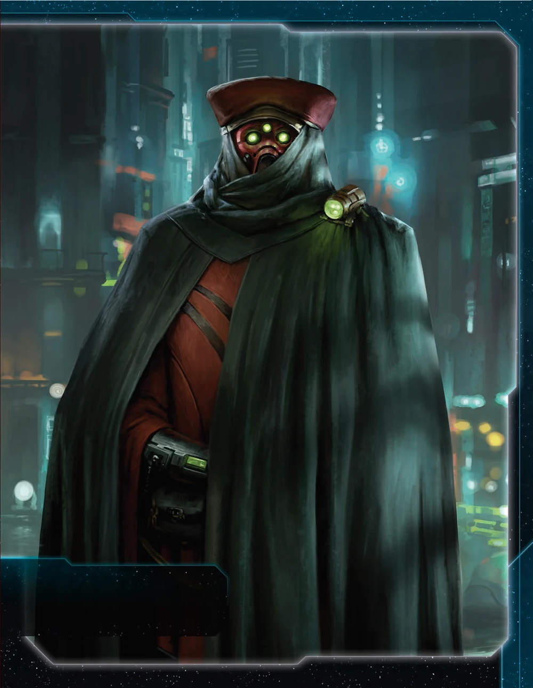

[← Back to Index](../index.html)

# Nomad Guide

## Contents

1. [Introduction](#i-introduction)
2. [Playstyle](#ii-playstyle)
3. [Faction Info and Drafting](#iii-faction-info-and-drafting)
   - [Home System & Commodities](#a-home-system--commodities) · [Starting Fleet](#b-starting-fleet) · [Faction Abilities](#c-faction-abilities) · [Technologies](#d-starting-and-faction-technologies) · [Leaders](#e-leaders) · [Promissory Note](#f-promissory-note---the-cavalry) · [Alliance](#g-alliance) · [Mech](#h-mech---quantum-manipulator) · [Flagship](#i-flagship---memoria-i) · [Breakthrough](#j-breakthrough---thunders-paradox) · [Slice and Draft](#k-slice-and-draft-considerations)
4. [Round 1 Problems and Faction Weakness](#iv-round-1-problems-and-faction-weakness)
   - [First Turn Priorities](#a-first-turn-priorities) · [Flagship Reliance](#b-flagship-reliance)
5. [Technology](#v-technology)
   - [Overview](#a-overview) · [Tech Path](#b-tech-path)
6. [Strategy Cards](#vi-strategy-cards)
   - [Round 1](#a-round-1) · [Round 2+](#b-round-2)
7. [Unit Composition and Game Plan](#vii-unit-composition-and-game-plan)
   - [Unit Composition](#a-unit-composition) · [Game Plan](#b-game-plan)
8. [Objectives](#viii-objectives)
   - [Objective Summary](#a-objective-summary) · [Stage I](#b-stage-i-objectives) · [Secret Objectives](#c-secret-objectives) · [Stage II](#d-stage-ii-objectives)
9. [Alliance Priority](#ix-alliance-priority)
10. [Bonus Game Elements](#x-bonus-game-elements)
    - [Action Cards](#a-high-value-action-cards) · [Relics](#b-relic-priorities) · [Agendas](#c-agenda-awareness)
11. [End Notes](#xi-end-notes)

---

## I. Introduction

The Nomad are temporal wanderers—collectors of agents and artifacts from across the multiverse. You're the only faction that starts with your flagship on the board, and you have three agents instead of one.

Your Memoria flagship treats any system with your mechs as adjacent. Place mechs across the galaxy and your flagship can appear anywhere in a single move. Future Sight lets you see which way the political winds blow, rewarding you with trade goods for voting correctly.

This is a faction about leverage. Every agent exhaust is a favor someone owes you. Every mech placement expands your reach. Every agenda is income. You're the table's broker, and everyone needs what you're selling.

## II. Playstyle

Playing Nomad means building wealth and spending it wisely. Future Sight generates passive trade goods every agenda phase. Four commodities fuel your trades. Artuno banks everything for perfectly timed objective scoring. By mid-game you're sitting on piles of money.

Your three agents are political currency. Every exhaust is a favor someone owes you, leverage you can call in when it matters. You solve objectives through wealth and diplomatic capital rather than military dominance. Other factions fight for what they need—you buy it (or take it).

---

## III. Faction Info and Drafting

### A. Home System & Commodities

**Home System:**
- **Arcturus:** 4 resources / 4 influence = 2 optimal resources + 2 optimal influence
- **Total: 4 resources / 4 influence (2 optimal resources / 2 optimal influence)**

**Commodities:** 4

**Notes:** Good defensively and good production. Strong for flexibility depending on needs and slice. 4 commodities support your trade-heavy playstyle.

### B. Starting Fleet

- 1 Flagship (Memoria I)
- 1 Carrier
- 1 Destroyer
- 3 Fighters
- 4 Infantry
- 1 Space Dock

**Notes:** Very solid starting fleet. You start with your flagship on the board—no one will mess with you early. The Memoria has AFB 8(x3) which shreds fighter screens. Can handle most slices with access to blue tech for bonus movement.

### C. Faction Abilities

**The Company (Faction Ability):** During setup, take the 2 additional Nomad faction agents and place them next to your faction sheet; you have 3 agents.

Three agents instead of one—Thundarian, Artuno, and Field Marshal Mercer. Gives flexibility and combos with your breakthrough. Nothing special but fun flavor.

**Future Sight (Faction Ability):** During the agenda phase, after an outcome you voted for or predicted is resolved, gain 1 trade good.

Easily forgotten but helpful for small bonus income. Only triggers if you vote for the outcome that passes—assuming 4 agenda phases and voting with the majority, expect 4-8 TGs over a game.

### D. Starting and Faction Technologies

**Starting Technologies:**

**Sling Relay (Blue)** - ACTION: Exhaust this card to produce 1 ship in any system that contains 1 of your space docks.

**Notes:** Helpful R1 to get an extra ship out for a solid start on expansion. Also combos with commander—once Navarch Feng is unlocked, use Sling Relay to produce your flagship for free at any space dock.

**Faction Technologies:**

Kind of hard to tech—usually requires a yellow skip or green skip. With Gravity Drive, you can send your flagship all over the map to inflict damage and take objectives freely. If someone kills it, another one appears (commander + Sling Relay).

**Memoria II (GBY):**
*Nomad Flagship - Cost: 8 | Combat: 5 (x2) | Move: 2 | Capacity: 6 | Sustain Damage | ANTI-FIGHTER BARRAGE 5 (x3)*

You may treat this unit as if it were adjacent to systems that contain 1 or more of your mechs.

Move 2, Capacity 6. Heavy prerequisites but strong upgrade if you can get there. Also increases your Cavalry promissory value.

**Temporal Command Suite (Y):**
*After any player's agent becomes exhausted, you may exhaust this card to ready that agent; if you ready another player's agent, you may perform a transaction with that player.*

Can be a diplomatic tool and combos well with your breakthrough to gain even more leverage. Needs a strong target agent to make use of and fairly optimal setup.

### E. Leaders

**Agent - The Thundarian:**

After the "Roll Dice" step of combat: You may exhaust this card. If you do, hits are not assigned to either player's units. Return to the start of this combat round's "Roll Dice" step.

Save for critical combats—flagship fights, MR invasions, defending home. Early rolls have more impact than late ones. Calculate expected hits for both sides to see if the roll was unlucky enough to reroll.

**Agent - Artuno the Betrayer:**

When you gain trade goods from the supply: You may exhaust this card to place an equal number of trade goods on this card. When this card readies, gain the trade goods on this card.

Mostly comboed with Trade TGs, otherwise fairly small value. Can add TGs from Future Sight if you think Trade isn't happening. Also combos with Mallice.

**Agent - Field Marshal Mercer:**

At the end of a player's turn: You may exhaust this card to allow that player to remove 2 of their ground forces from the game board and place them on planets they control in the active system.

Really weak and rarely useful. Your main target for your breakthrough.

**Commander - Navarch Feng:** *Unlock: Have 1 scored secret objective.*

You can produce your flagship without spending resources.

Not a great unlock condition if you get a good action secret you want to keep. Hopefully you're not planning on losing your flagship early. One of the most sought after alliances.

**Hero - Ahk-Syl Siven:** *Unlock: Have 3 scored objectives.*

**Probability Matrix - ACTION:** Place this card near the game board; your flagship and units it transports can move out of systems that contain your command tokens during this game round. At the end of that game round, purge this card.

Late game to solve late game objectives, hopefully when people have passed. Can keep moving the flagship and/or reproduce.

### F. Promissory Note - **The Cavalry**

At the start of a space combat against a player other than the Nomad: During this combat, treat 1 of your non-fighter ships as if it has the Sustain Damage ability, combat value, and ANTI-FIGHTER BARRAGE value of the Nomad's flagship. Return this card to the Nomad player at the end of the combat.

Trade value: 1-2 TG with Memoria I, 3-4 TG with Memoria II. Careful not to give the wrong person a key battle victory.

### G. Alliance

Whoever holds your alliance card has your Commander (Navarch Feng - produce flagship without spending resources).

Very strong alliance. The 8 resources saved is meaningful for anyone. Top tier alliance to trade—demand a good one in return.

### H. Mech - **Quantum Manipulator**

Cost: 2 | Combat: 6 | **Sustain Damage**

**Special Ability:** While this unit is in a space area during combat, you may use its Sustain Damage ability to cancel a hit that is produced against your ships in this system.

Ability is okay—can be used if you have dominant ground force and need some juice in an unlucky space battle. Place mechs strategically to create your flagship teleportation network.

### I. Flagship - **Memoria I**

Cost: 8 | Combat: 7 (x2) | Move: 1 | Capacity: 3 | **Sustain Damage** | **ANTI-FIGHTER BARRAGE 8 (x3)**

**Special Ability:** You may treat this unit as if it were adjacent to systems that contain 1 or more of your mechs.

Okay flagship at the unupgraded version, but strong ship to start with. Use your strong early presence to not get bullied and perhaps greedily grab an extra equidistant.

### J. Breakthrough - **Thunder's Paradox (Y<>G)**

At the start of any player's turn, you may exhaust 1 of your agents to ready any other agent.

Double-use agents or ready opponent agents for favors. Get if optimal agents available to combo with.

**Y<>G Synergy:** Helpful for Memoria II and Bio-Stims Sling Relay combo for stalling. Other than that, you're probably more blue focused.

### K. Slice and Draft Considerations

**Speaker Order:**
Speaker is great. Earlier better but can handle most positions. Looking for friendly trade partners as neighbors.

**Slice Priorities:**
- Flexible slice with high optimal values.
- Access to Mecatol.

**Avoid:**
- Anomalies in the middle of slice.

**Nice to Have:**
- Entropic.
- Yellow/green skips for breakthrough and faction tech.

---

## IV. Round 1 Problems and Faction Weakness

### A. First Turn Priorities

**Round 1 Priority Rankings:**

1. **Scoring** - You want to play from ahead.

2. **Expansion + Production** - Get more planets and stronger economy. Better at ship objectives than tech objectives.

3. **Technology** - If you need to reach stuff with Gravity Drive.

4. **Breakthrough** - If easily obtainable and good game for it.

**Expansion Notes:** Solid start. Can handle almost all slices. Aim for 2 systems nearby, get a 3rd if you got Gravity Drive.

### B. Flagship Reliance

Your entire faction revolves around your flagship. You're only strong in one spot at a time—wherever your flagship is. Without Memoria, you lose your combat presence and early game intimidation factor. Even with commander unlocked and free reproduction, losing your flagship means losing tempo while you rebuild. Plan around protecting your flagship or being ready to reproduce quickly.

---

## V. Technology

### A. Overview

You start with **Sling Relay (B)** (ACTION: produce 1 ship at any space dock).

Prefer to have a green or yellow skip.

### B. Tech Path

**Starting Tech:** Sling Relay (B)

**Round 1:** Gravity Drive (B)
- +1 move to 1 ship per activation
- **Why:** Mobility for flagship and carriers. Reach more systems.

**Round 2:** Bio-Stims (G) if you have skip/breakthrough, otherwise Scanlink or Neural Motivator
- **Bio-Stims:** Ready a tech specialty planet or another tech
- **Scanlink:** Explore when you activate a system with your units
- **Neural:** Draw 2 action cards instead of 1
- **Why:** Bio-Stims combos with Sling Relay for stalling. Scanlink/Neural as prereq if no skip.

**Round 3:** Bio-Stims (G) if you didn't get it R2, otherwise Carrier II (BB)
- **Carrier II:** Cost 3, Combat 9, Move 2, Capacity 6
- **Why:** Get Bio-Stims online, then transport capacity.

**Round 4:** Carrier II (BB) or Memoria II (GBY)
- **Memoria II:** Cost 8, Combat 5 (x2), Move 2, Capacity 6, AFB 5 (x3)
- **Why:** Transport capacity or flagship upgrade depending on game state.

**Round 5:** Memoria II (GBY) or unit upgrades
- **Why:** Flagship upgrade if you can reach it, otherwise flex.

**Flex:** Fleet Logistics (BB), Light/Wave Deflector (BBB), Dreadnought II (BBY) if you got more techs.

---

## VI. Strategy Cards

### A. Round 1

**Round 1 Priority Ranking:**

1. **Trade** - 4 commodities + TG generation. Bank with Artuno for later.

2. **Technology** - Blue path toward Gravity Drive for mobility.

3. **Leadership** - Many extra secondaries and good free value.

4. **Politics** - Nice for custodian and next round setup.

5. **Construction** - Good to get free build for extra system and forward dock for Sling Relay.

6. **Diplomacy** - Only if objective requires. Good to be in control of timing.

7. **Warfare** - Fleet readying for positioning.

8. **Imperial** - Never Round 1.

**Strategy Token Priority:** Technology and Warfare. Diplomacy if you got a bonus one.

### B. Round 2+

**Love:**
- **Trade** - 4 commodities + Artuno banking synergy.
- **Leadership** - CCs for continued expansion.
- **Imperial** - Points are points.

**Good:**
- **Politics** - Future Sight TG generation + agenda control.
- **Technology** - Unit upgrades and Bio-Stims.

**Situational:**
- **Construction** - Solid production for offensive/defensive builds. Forward docks for Sling Relay.
- **Warfare** - Fleet readying and repositioning.
- **Diplomacy** - Protect key systems.

---

## VII. Unit Composition and Game Plan

### A. Unit Composition

**Preferred Units:**
- **Flagship** - Your core unit. Start with it on the board.
- **Carriers** - Transport capacity for objectives.
- **Mechs** - Create your teleportation network. Mech ability can absorb hits for ships.
- **Infantry** - Ground presence for planets.
- **Fighters** - Cheap fleet filler.
- **Dreadnoughts** - Mini capital ship to keep around.

Use strong production to build cost effective fleets.

### B. Game Plan

**Early Game (Rounds 1-2):**

Use your flagship presence to expand safely and grab an extra equidistant if possible. Place mechs to start building your teleportation network. Get Gravity Drive for mobility. Trade your agents for favors and bank TGs with Artuno when Trade fires. Custodians if setup for it.

**Mid Game (Rounds 3-4):**

Your flagship with Gravity Drive can reach anywhere. Use mech teleportation to appear where needed. Unlock commander (1 secret) so flagship becomes free to reproduce. Start solving objectives with your wealth and diplomatic leverage.

**Late Game (Round 5+):**

Use hero to move flagship multiple times for late game objective solves. With commander online, your flagship is economically unkillable—take aggressive trades knowing you can rebuild for free. Close out with your accumulated TGs and political favors.

---

## VIII. Objectives

### A. Objective Summary

**Strengths:** Spending objectives are easy. Ships in systems objectives are solvable with mobility. Tech objectives are solvable.

**Weaknesses:** Structure and control objectives can be tougher.

### B. Stage I Objectives

| Stage I Objective                                                       | Status |
|-------------------------------------------------------------------------|--------|
| **Spendies**                                                            |        |
| Erect a Monument (Spend 8 resources)                                    | 🟢     |
| Sway the Council (Spend 8 influence)                                    | 🟢     |
| Negotiate Trade Routes (Spend 5 trade goods)                            | 🟢     |
| Lead from the Front (Spend 3 tokens from tactic/strategy pools)         | 🟢     |
| Amass Wealth (Spend 3 influence, 3 resources, 3 trade goods)            | 🟢     |
| **Control**                                                             |        |
| Expand Borders (Control 6 planets in non-home systems)                  | 🟢     |
| Corner the Market (Control 4 planets with same trait)                   | 🔴     |
| Found Research Outposts (Control 3 planets with tech specialties)       | 🔴     |
| Discover Lost Outposts (Control 2 planets with attachments)             | 🔴     |
| Push Boundaries (Control more planets than each neighbor)               | 🟢     |
| **Ships in Systems**                                                    |        |
| Intimidate the Council (Ships in 2 systems adjacent to MR)              | 🟢     |
| Explore Deep Space (Units in 3 systems without planets)                 | 🟢     |
| Make History (Units in 2 systems with legendary/MR/anomalies)           | 🟢     |
| Populate the Outer Rim (Units in 3 edge systems)                        | 🟢     |
| Raise a Fleet (5+ non-fighter ships in 1 system)                        | 🟢     |
| Engineer a Marvel (Have flagship or war sun on board)                   | 🟢     |
| **Tech**                                                                |        |
| Diversify Research (Own 2 tech in each of 2 colors)                     | 🟡     |
| Develop Weaponry (Own 2 unit upgrade technologies)                      | 🟢     |
| **Structure**                                                           |        |
| Build Defenses (Have 4 or more structures)                              | 🔴     |
| Improve Infrastructure (Structures on 3 planets outside HS)             | 🔴     |

**Legend:** 🟢 Likely | 🟡 Possible | 🔴 Difficult

### C. Secret Objectives

| Secret Objective                                                         | Status |
|--------------------------------------------------------------------------|--------|
| **Combat**                                                               |        |
| Unveil Flagship (Win space combat with flagship)                         | 🟢     |
| Destroy their Greatest Ship (Destroy war sun/flagship)                   | 🟡     |
| Spark a Rebellion (Win combat vs VP leader)                              | 🟢     |
| Betray a Friend (Win combat vs player whose PN you have)                 | 🟢     |
| Brave the Void (Win combat in anomaly)                                   | 🟢     |
| Darken the Skies (Win combat in another player's HS)                     | 🔴     |
| Demonstrate your Power (3+ non-fighter ships after space combat)         | 🟢     |
| Turn their Fleets to Dust (SPACE CANNON destroy last ship)               | 🔴     |
| Make an Example (BOMBARDMENT destroy last ground forces)                 | 🔴     |
| Fight With Precision (AFB destroy last fighter)                          | 🟢     |
| **Ships in Systems**                                                     |        |
| Threaten Enemies (Ships adjacent to another player's HS)                 | 🟢     |
| Cut Supply Lines (Ships in system with enemy space dock)                 | 🟢     |
| Defy Space and Time (Units in wormhole nexus)                            | 🟡     |
| Become the Gatekeeper (Ships in alpha and beta wormhole systems)         | 🟡     |
| Learn Secrets of the Cosmos (Ships in 3 systems adjacent to anomalies)   | 🟢     |
| Control the Region (Ships in 6 systems)                                  | 🟢     |
| Occupy the Seat of the Empire (Control MR with 3+ ships)                 | 🔴     |
| **Control**                                                              |        |
| Monopolize Production (Control 4 industrial planets)                     | 🔴     |
| Mine Rare Minerals (Control 4 hazardous planets)                         | 🔴     |
| Forge an Alliance (Control 4 cultural planets)                           | 🔴     |
| Establish Hegemony (Control planets with 12+ influence)                  | 🟢     |
| Hoard Raw Materials (Control planets with 12+ resources)                 | 🟢     |
| Seize an Icon (Control legendary planet)                                 | 🟢     |
| Stake Your Claim (Control planet in contested system)                    | 🟢     |
| Become a Martyr (Lose control of planet in home system)                  | 🔴     |
| **Tech**                                                                 |        |
| Adapt New Strategies (Own 2 faction technologies)                        | 🔴     |
| Master the Laws of Physics (Own 4 tech of same color)                    | 🟡     |
| **Structure/Units**                                                      |        |
| Establish a Perimeter (Have 4 PDS on board)                              | 🔴     |
| Fuel the War Machine (Have 3 space docks)                                | 🟢     |
| Gather a Mighty Fleet (Have 5 dreadnoughts)                              | 🟡     |
| Mechanize the Military (1 mech on each of 4 planets)                     | 🟢     |
| Occupy the Fringe (9+ ground forces on planet without space dock)        | 🔴     |
| Produce en Masse (Units with PRODUCTION 8+ in single system)             | 🔴     |
| **Other**                                                                |        |
| Dictate Policy (3+ laws in play)                                         | 🔴     |
| Drive the Debate (You/your planet elected by agenda)                     | 🔴     |
| Destroy Heretical Works (Purge 2 relic fragments)                        | 🔴     |
| Form a Spy Network (Discard 5 action cards)                              | 🟡     |
| Foster Cohesion (Be neighbors with all players)                          | 🟢     |
| Strengthen Bonds (Have another player's PN)                              | 🟢     |
| Prove Endurance (Last to pass)                                           | 🟢     |

**Legend:** 🟢 Likely | 🟡 Possible | 🔴 Difficult

### D. Stage II Objectives

| Stage II Objective                                                       | Status |
|--------------------------------------------------------------------------|--------|
| **Spendies**                                                             |        |
| Centralize Galactic Trade (Spend 10 trade goods)                         | 🟢     |
| Found a Golden Age (Spend 16 resources)                                  | 🟢     |
| Galvanize the People (Spend 6 tokens from tactic/strategy pools)         | 🟢     |
| Manipulate Galactic Law (Spend 16 influence)                             | 🟢     |
| Hold Vast Reserves (Spend 6 influence, 6 resources, 6 trade goods)       | 🟢     |
| **Control**                                                              |        |
| Conquer the Weak (Control 1 planet in another player's HS)               | 🔴     |
| Rule Distant Lands (Control 2 planets in/adjacent to different players' HS) | 🟡  |
| Subdue the Galaxy (Control 11 planets in non-home systems)               | 🔴     |
| Unify the Colonies (Control 6 planets with same trait)                   | 🔴     |
| Reclaim Ancient Monuments (Control 3 planets with attachments)           | 🔴     |
| Form Galactic Brain Trust (Control 5 planets with tech specialties)      | 🔴     |
| **Ships in Systems**                                                     |        |
| Command an Armada (Have 8+ non-fighter ships in 1 system)                | 🟢     |
| Achieve Supremacy (Flagship/War Sun in another player's HS or MR)        | 🟢     |
| Become a Legend (Units in 4 systems with legendary/MR/anomalies)         | 🔴     |
| Patrol Vast Territories (Units in 5 systems without planets)             | 🟡     |
| Control the Borderlands (Units in 5 edge systems not HS)                 | 🟡     |
| **Tech**                                                                 |        |
| Master of Sciences (Own 2 techs in each of 4 colors)                     | 🔴     |
| Revolutionize Warfare (Own 3 unit upgrade technologies)                  | 🟡     |
| **Structure**                                                            |        |
| Construct Massive Cities (Have 7+ structures)                            | 🔴     |
| Protect the Border (Structures on 5 planets outside HS)                  | 🔴     |

**Legend:** 🟢 Likely | 🟡 Possible | 🔴 Difficult

---

## IX. Alliance Priority

**Top Tier:**

1. **Crimson Rebellion** - TG from combat. Solid passive income since you'll fight occasionally.
2. **Deepwrought** - Passive TG when others research with discount. More economy is always good.
3. **Muaat** - TG when spending strategy tokens. Synergizes with your political playstyle.
4. **Winnu** - +2 combat in MR/legendary/HS. Your flagship teleportation lets you reach these easily.

**Good Tier:**

5. **Empyrean** - Late game slaying tool. Your flagship mobility makes positioning tokens easy.
6. **Vuil'raith Cabal** - Extra production capacity for fighters/infantry outside production limit.
7. **Nekro Virus** - Action cards on tech gain. You'll research enough to trigger this.
8. **Barony of Letnev** - TG from sustain damage. Your flagship has sustain.
9. **Mentak Coalition** - Sneaky late game forcing support by winning many battles against the same person.
10. **Naaz-Rokha** - Explore after conquests. Extra value from planets you take.

---

## X. Bonus Game Elements

This section highlights action cards that synergize particularly well with your faction's strengths or mitigate your weaknesses, relics that offer exceptional value for your faction's strategy and abilities, and agendas to pursue that benefit your position, and agendas to watch out for that could hurt you.

### A. High-Value Action Cards

- **Scuttle** - Scuttle dreadnought + flagship for 12 TGs, bank with Artuno for 12 more when he readies, reproduce flagship free with commander. 20 TG profit.

### B. Relic Priorities

### C. Agenda Awareness

---

## XI. End Notes

Nomad is the faction for players who want strong early presence and flexibility. You start with your flagship on the board and three agents to trade. Nobody messes with you early, and by mid-game your flagship threatens the entire map.

The Nomad experience rewards good timing and leverage. Your agents are political currency, your wealth solves objectives, and your flagship hits where needed.

**"Wanderers across time, collectors of lost souls. The Nomad remember what the galaxy forgets."**
