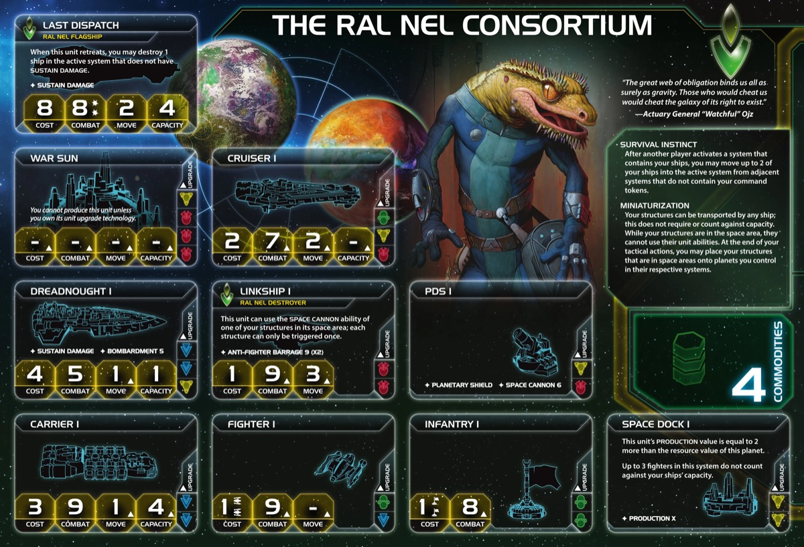
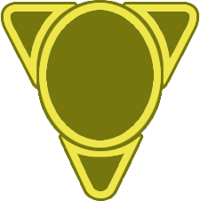
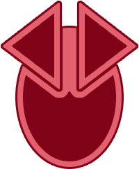

<nav class="page-nav">
<a href="../index.html" class="back-link">Back to Index</a>
<a href="Ral_Nel_Consortium.md" download class="download-link" title="Plain text file - safe to download">Download .md</a>
</nav>

# Ral Nel Consortium Guide

## Contents

1. [Introduction](#i-introduction)
2. [Playstyle](#ii-playstyle)
3. [Faction Info and Drafting](#iii-faction-info-and-drafting)
   - [Home System & Commodities](#a-home-system--commodities) · [Starting Fleet](#b-starting-fleet) · [Faction Abilities](#c-faction-abilities) · [Technologies](#d-starting-and-faction-technologies) · [Leaders](#e-leaders) · [Promissory Note](#f-promissory-note) · [Alliance](#g-alliance) · [Mech](#h-mech) · [Flagship](#i-flagship) · [Breakthrough](#j-breakthrough) · [Slice and Draft](#k-slice-and-draft-considerations)
4. [Round 1 Problems and Faction Weakness](#iv-round-1-problems-and-faction-weakness)
   - [First Turn Priorities](#a-first-turn-priorities) · [Low Starting Resources](#b-low-starting-resources) · [Commander Unlock Challenge](#c-commander-unlock-challenge)
5. [Technology](#v-technology)
   - [Overview](#a-overview) · [Technology Paths](#b-technology-paths)
6. [Strategy Cards](#vi-strategy-cards)
   - [Round 1](#a-round-1) · [Round 2+](#b-round-2)
7. [Unit Composition and Game Plan](#vii-unit-composition-and-game-plan)
   - [Unit Composition](#a-unit-composition) · [Game Plan](#b-game-plan)
8. [Objectives](#viii-objectives)
   - [Objective Summary](#a-objective-summary) · [Stage I](#b-stage-i-objectives) · [Secret Objectives](#c-secret-objectives) · [Stage II](#d-stage-ii-objectives)
9. [Alliance Priority](#ix-alliance-priority)
10. [Bonus Game Elements](#x-bonus-game-elements)
    - [Action Cards](#a-high-value-action-cards) · [Relics](#b-relic-priorities) · [Agendas](#c-agenda-awareness)
11. [End Notes](#xi-end-notes)

---

## I. Introduction

The Ral Nel Consortium are TI4's mobile structure specialists. While other factions build static PDS networks and anchored space docks, yours fly with your fleets. Transport structures on your ships, reposition them as the game evolves, and trigger PDS fire remotely through your destroyers. When opponents activate systems near you, respond defensively before they can act.

This faction rewards creative positioning and understanding when mobility beats static defenses. Your infrastructure isn't a liability to protect—it's a weapon that moves where you need it. The galaxy learns that attacking near Ral Nel space means facing firepower from systems they thought were safe.

---

## II. Playstyle

**"We are everywhere, and our infrastructure moves with us."** You're not building static PDS networks—you're creating mobile defensive platforms. Your destroyers trigger PDS Space Cannon from anywhere. Your structures fly with your fleets.

Core loop: Transport structures on ships → Position PDS/docks strategically → Use Linkships to trigger PDS remotely → Respond to opponent activations (Survival Instinct) → Redeploy structures as needed

You're a mid-tier faction that excels at:
- Defensive flexibility (mobile structures)
- Space Cannon coverage (Linkships trigger PDS anywhere)
- Reactive play (Survival Instinct moves ships when opponents activate near you)
- Economic efficiency (4 commodities + mobile space docks)

**Key Mindset:** Your structures aren't anchors—they're assets you relocate constantly. Think of PDS as mobile artillery and Space Docks as forward bases you move with your fleet. Your commander makes your fleet elusive and hard to predict.

---

## III. Faction Info and Drafting

### A. Home System & Commodities

**Home System:** 2 planets
- **Mez Lo Orz Pei Zsha:** 2 resources / 1 influence
- **Rep Lo Orz Oet:** 1 resource / 3 influence
- **Total: 3 resources / 4 influence**

**Commodities:** 4

**Notes:** 4-influence home system (excellent for politics) but only 3 resources (below average for production). Your economy comes from commodities and mobile space docks, not your home system.

### B. Starting Fleet
- 1 Dreadnought
- 1 Carrier
- 1 Destroyer (Linkship)
- 2 Fighters
- 4 Infantry
- 1 Space Dock
- 2 PDS

**Notes:** Strong defensive start with 2 PDS. Dreadnought provides early combat presence. Linkship destroyer is your unique unit that triggers PDS remotely.

### C. Faction Abilities

**Survival Instinct:** After opponent activates a system containing your ships, you may relocate up to 2 of your vessels into that system from adjacent systems lacking your command tokens.

Excellent defensive tool. Spread ships across adjacent systems and consolidate when attacked. This makes your fleets hard to pin down.

**Miniaturization:** Your structures can be transported by any ships without requiring or consuming capacity. While in space, structures cannot use abilities. At the end of tactical actions, you may deploy structures from space onto controlled planets within their systems.

Your defining ability. Transport PDS and Space Docks with your fleet, deploy on conquered planets immediately. Mobile infrastructure is your core identity.

### D. Starting and Faction Technologies

**Starting Technologies:** Choose 1 red or green technology with no prerequisites.

**Recommendations:**

- **AI Development Algorithm (Red)** - Best for tech path efficiency
- **Neural Motivator (Green)** - Flexible opener for action cards

**Faction Technologies:**

**Nanomachines :**
Exhaust this card to either:
1. Place 1 PDS from reinforcements on planet you control
2. Repair all units in 1 system
3. Trade 1 action card with another player

Flexible utility tech. PDS deployment synergizes with your mobile structure strategy. Repair option helps sustain your fleet.

### E. Leaders

**Agent - Kan Kip Rel:**
At the start of a player's turn: You may exhaust this agent to draw 2 action cards, then give 1 action card from your hand to that player.

Action card generation + trading leverage. You net +1 action card per use while giving value to other players.

**Commander - Watchful Ojz:** [Unlocks after passing last during Action Phase]
When retreating from space combat: You may retreat up to 2 ships to a system that does not contain another player's ships; if you do, place 1 command token from your reinforcements in that system.

Enhanced retreat makes your fleet elusive and hard to predict. Fight battles you might lose—retreating with Commander gives you repositioning advantage.

**Hero - (Unnamed):** [Activates after scoring 3 objectives]
You may remove yourself from passed status, gain 2 command tokens, and draw 1 action card.

Extra turn in late game. Pass, see opponent moves, un-pass and take optimal action. Game-winning surprise potential.

### F. Promissory Note

**Nano-Link Permit:** After the Ral Nel player activates a system: Return this card to the Ral Nel player; you may move your structures from adjacent systems onto planets you control in the active system.

Lets other players mimic your Miniaturization. Trade for Alliance promissories, political support, or trade goods.

### G. Alliance

**Alliance Ability:** *While you are neighbors with the Ral Nel player and their commander is unlocked:* When you declare a retreat, you may immediately retreat up to 2 of your ships from the active system to an adjacent system that does not contain another player's ships. Place a command token from your reinforcements into that system.

Strong defensive alliance for factions that need flexible retreat options. Trade value: 2-3 TG.

### H. Mech

**Alarum:** Cost 2, Combat 6, Sustain Damage

After a combat round during ground combat, you may move up to 2 of your ground forces from planets in adjacent systems to this planet.

Ground force reinforcement mid-combat. Leave mechs around your slice to surprise people with defensive reinforcements. Opponents attack expecting 2v2, suddenly it's 4v2.

### I. Flagship

**Last Dispatch:** Cost 8, Combat 8 (x2), Move 2, Capacity 4, Sustain Damage

When this ship retreats, you may destroy 1 ship in this system that does not have SUSTAIN DAMAGE.

Parting shot on retreat - destroy 1 ship without Sustain Damage when retreating. Combos with Commander for enhanced retreat positioning. Punishes opponents for engaging you.

### J. Breakthrough

**Data Skimmer (Y↔G):** Yellow and green technologies count as each other for prerequisites.

During the action phase, if you have not passed, when other players would discard action cards, they are placed on this card instead. When you pass, take 1 action card from this card and discard the rest.

Excellent action card economy. Cherry-pick the best discarded action card each round. Y↔G synergy helps tech pathing flexibility.

### K. Slice and Draft Considerations

**Speaker Priority:** Mid-priority (3-5)

**Priorities:**

- **Defensible slice** - Your reactive abilities work best when you can predict attack vectors
- **Adjacent systems for Survival Instinct** - Need systems close together for ship consolidation
- **Production planets** - Your home is only 3 resources; need strong expansion targets

**Nice to Have:**

- Yellow or green tech skip (works with Y↔G breakthrough)
- Systems with multiple planets (deploy structures after conquest)
- Wormholes for Linkship positioning flexibility

**Avoid:**

- Isolated slices (Survival Instinct needs adjacent systems)
- Slices with poor production capacity

---

## IV. Round 1 Problems and Faction Weakness

### A. First Turn Priorities

1. **Scoring** - Stay in the mix. If people try to stop you, use action cards to deter.

2. **Breakthrough** - Data Skimmer gives you action card economy. Collect other players' discards and cherry-pick the best one.

3. **Technology** - Get started early with Nanomachines.

4. **Expansion and Production** - Aim for 2 systems, 3 if you got Gravity Drive and production or all planets are nearby.

**Expansion Notes:**

### B. Production Capacity

Your best home planet is only 2 resources - low production capacity per activation. You need good production planets in your slice. Miniaturization helps - transport your Space Dock to better production planets as you expand.

### C. Projected Strength

Data Skimmer collects discarded action cards visibly - opponents see you cherry-picking the best cards from the table. This creates projected strength: they assume you have Sabotage, Direct Hit, and combat tricks even when you don't. Use this reputation to deter attacks. You seem stronger than factions with the same power hidden in their hand.

---

## V. Technology

### A. Overview

**Starting Tech:** Psychoarchaeology or AI Development Algorithm.

Ral Nel has two distinct tech paths:

**Path 1 - AI Development Algorithm Start:** The default, reliable path. Uses AI Dev to efficiently research unit upgrades. Focuses on Dark Energy Tap for exploration and retreat synergy, then Gravity Drive for mobility, into Carrier II and Linkship II/Fleet Logistics.

**Path 2 - Psychoarchaeology Start (Red + Blue Skip):** Requires tech skips in your slice. Psychoarchaeology lets you use tech specialties without exhausting them and generate TG from tech planets. Rush Gravity Drive R1, then Nanomachines, Carrier II, Linkship II.

### B. Technology Paths

**Path 1 - AI Development Algorithm Start:**

**Round 1:** Nanomachines  - Your faction tech
- *Place 1 PDS, repair all units, or discard 1 action card to draw 1 action card*

**Round 2:** Dark Energy Tap - Exploration + retreat flexibility
- *Explore frontier tokens after tactical actions. Ships can retreat into adjacent systems without your units*

**Round 3:** Gravity Drive  - Mobility
- *After you activate a system, apply +1 to the move value of 1 of your ships*

**Round 4:** Carrier II (BB) - Transport capacity
- *Cost 3, Combat 9, Move 2, Capacity 6*

**Round 5+:** Dreadnought II (BBY) or Fleet Logistics 
- *Dreadnought II: Move 2, Sustain Damage, BOMBARDMENT 5. Cannot be destroyed by Direct Hit*
- *Fleet Logistics: Perform 2 actions per turn*

---

**Path 2 - Psychoarchaeology Start (Red + Blue Skip):**

**Round 1:** Gravity Drive  - Mobility
- *After you activate a system, apply +1 to the move value of 1 of your ships*

**Round 2:** Nanomachines  - Your faction tech
- *Place 1 PDS, repair all units, or discard 1 action card to draw 1 action card*

**Round 3:** Carrier II (BB) - Transport capacity
- *Cost 3, Combat 9, Move 2, Capacity 6*

**Round 4:** Linkship II (RR) - Enhanced Linkships
- *Cost 1, Combat 8, Move 4. Can trigger same structure multiple times. AFB 6 (x3)*

**Round 5+:** Dreadnought II (BBY) or Fleet Logistics 
- *Dreadnought II: Move 2, Sustain Damage, BOMBARDMENT 5. Cannot be destroyed by Direct Hit*
- *Fleet Logistics: Perform 2 actions per turn*

---

**Supplemental Techs:**

- **Graviton Laser System ** - Space Cannon hits must target non-fighters. Massive synergy with Linkships - your PDS shots kill real ships instead of fighters. Needs yellow skip but works with Y↔G breakthrough.

- **Bio-Stims ** - Ready a tech specialty planet or technology. Combos with Psychoarchaeology - ready your tech planets to generate more TG, or ready Nanomachines for double use. Needs green skip but works with Y↔G breakthrough.

---

## VI. Strategy Cards

### A. Round 1

Your R1 priority is getting your breakthrough and starting your tech path while expanding to better production planets.

**Round 1 Priority Ranking:**

1. **Trade** - 4 commodities + economic foundation. Need resources with your weak home system.

2. **Technology** - Start your tech path immediately. Nanomachines R1 for PDS placement and utility.

3. **Construction** - Forward space dock on better production planet. Your home is only 2 resources.

4. **Leadership** - Command tokens for expansion and token economy.

5. **Politics** - Breakthrough unlocks with action cards on Politics.

6. **Diplomacy** - Only if you have tech skip planet to refresh.

7. **Warfare** - Extra tactical action for slice filling.

8. **Imperial** - Points come later. Focus on setup first.

**Strategy Token Priority:** Construction, Technology.

### B. Round 2+

**Love:**

- **Leadership** - Token economy essential for flexible play. You need tokens for Survival Instinct positioning.
- **Trade** - Economic flexibility. 4 commodities still valuable.

**Like:**

- **Technology** - Linkship II, Carrier II, Fleet Logistics all critical. Tons of good tech to research.
- **Imperial** - Score objectives. Start pushing for points.
- **Politics** - Speaker priority and action cards. Data Skimmer loves action card flow.

**Situational:**

- **Construction** - No need after first space dock placed. Miniaturization lets you move it.
- **Warfare** - Budget Saar with mobile space dock.
- **Diplomacy** - Only for objectives.

---

## VII. Unit Composition and Game Plan

### A. Unit Composition

- **Carrier II** - Core transport. Move 2, Capacity 6 for structures + ground forces.
- **Fighters** - Always needed for some extra HP. Cheap combat dice.
- **Linkship Destroyers** - Your unique unit. Trigger PDS Space Cannon remotely. Essential.
- **Infantry** - Ground forces for planet control.
- **Mech (Alarum)** - Leave around slice to surprise people with defensive reinforcements.
- **Dreadnought** - Good if low on production capacity. Combat power with sustain damage.
- **Flagship** - Retreat + kill synergy. Punishes opponents for engaging you, combos with Commander.

### B. Game Plan

**Early Game (R1-2):** Trade for breakthrough unlock via Politics secondary. Get Nanomachines R1. Expand to 2 systems (3 if Gravity Drive and good production). Move Space Dock to better production planet with Miniaturization. Deploy PDS on conquered planets for instant defense.

**Mid Game (R3-4):** Data Skimmer collecting discarded action cards - cherry-pick the best. Survival Instinct consolidates ships when opponents attack. Get Gravity Drive and Carrier II. Transport PDS with fleet for mobile coverage.

**Late Game (R5+):** Elusiveness and stall potential really strong. Commander makes your fleet hard to pin down - retreat and reposition safely. Hero lets you un-pass for surprise final turn. Linkships trigger PDS remotely. Graviton Laser System (if you have it) forces Space Cannon hits on real ships. Score structure objectives easily with Miniaturization.

---

## VIII. Objectives

### A. Objective Summary

**Strengths:** Spendies easy with 4 commodities and trade flexibility. Structure objectives easy with Miniaturization - PDS and space docks on every planet. Ships in Systems easy with mobile fleet. Tech objectives achievable with solid tech path.

**Weaknesses:** Control objectives hard - not an expansion powerhouse. Planet trait objectives difficult without lucky slice.

### B. Stage I Objectives

| Stage I Objective                                                       | Status |
|-------------------------------------------------------------------------|--------|
| **Spendies**                                                            |        |
| Erect a Monument (Spend 8 resources)                                    | 🟢     |
| Sway the Council (Spend 8 influence)                                    | 🟢     |
| Negotiate Trade Routes (Spend 5 trade goods)                            | 🟢     |
| Lead from the Front (Spend 3 tokens from tactic/strategy pools)         | 🟢     |
| Amass Wealth (Spend 3 influence, 3 resources, 3 trade goods)            | 🟢     |
| **Control**                                                             |        |
| Expand Borders (Control 6 planets in non-home systems)                  | 🟡     |
| Corner the Market (Control 4 planets with same trait)                   | 🔴     |
| Found Research Outposts (Control 3 planets with tech specialties)       | 🔴     |
| Discover Lost Outposts (Control 2 planets with attachments)             | 🔴     |
| Push Boundaries (Control more planets than each neighbor)               | 🟡     |
| **Ships in Systems**                                                    |        |
| Intimidate the Council (Ships in 2 systems adjacent to MR)              | 🟢     |
| Explore Deep Space (Units in 3 systems without planets)                 | 🟢     |
| Make History (Units in 2 systems with legendary/MR/anomalies)           | 🟢     |
| Populate the Outer Rim (Units in 3 edge systems)                        | 🟢     |
| Raise a Fleet (5+ non-fighter ships in 1 system)                        | 🟢     |
| Engineer a Marvel (Have flagship or war sun on board)                   | 🟢     |
| **Tech**                                                                |        |
| Diversify Research (Own 2 tech in each of 2 colors)                     | 🟢     |
| Develop Weaponry (Own 2 unit upgrade technologies)                      | 🟢     |
| **Structure**                                                           |        |
| Build Defenses (Have 4 or more structures)                              | 🟢     |
| Improve Infrastructure (Structures on 3 planets outside HS)             | 🟢     |

**Legend:** 🟢 Likely | 🟡 Possible | 🔴 Difficult

### C. Secret Objectives

| Secret Objective                                                         | Status |
|--------------------------------------------------------------------------|--------|
| **Combat**                                                               |        |
| Unveil Flagship (Win space combat with flagship)                         | 🟡     |
| Destroy their Greatest Ship (Destroy war sun/flagship)                   | 🔴     |
| Spark a Rebellion (Win combat vs VP leader)                              | 🟢     |
| Betray a Friend (Win combat vs player whose PN you have)                 | 🟢     |
| Brave the Void (Win combat in anomaly)                                   | 🟢     |
| Darken the Skies (Win combat in another player's HS)                     | 🔴     |
| Demonstrate your Power (3+ non-fighter ships after space combat)         | 🟢     |
| Turn their Fleets to Dust (SPACE CANNON destroy last ship)               | 🟢     |
| Make an Example (BOMBARDMENT destroy last ground forces)                 | 🟡     |
| Fight With Precision (AFB destroy last fighter)                          | 🟢     |
| **Ships in Systems**                                                     |        |
| Threaten Enemies (Ships adjacent to another player's HS)                 | 🟢     |
| Cut Supply Lines (Ships in system with enemy space dock)                 | 🟢     |
| Defy Space and Time (Units in wormhole nexus)                            | 🟡     |
| Become the Gatekeeper (Ships in alpha and beta wormhole systems)         | 🟡     |
| Learn Secrets of the Cosmos (Ships in 3 systems adjacent to anomalies)   | 🟢     |
| Control the Region (Ships in 6 systems)                                  | 🟢     |
| Occupy the Seat of the Empire (Control MR with 3+ ships)                 | 🟡     |
| **Control**                                                              |        |
| Monopolize Production (Control 4 industrial planets)                     | 🔴     |
| Mine Rare Minerals (Control 4 hazardous planets)                         | 🔴     |
| Forge an Alliance (Control 4 cultural planets)                           | 🔴     |
| Establish Hegemony (Control planets with 12+ influence)                  | 🟡     |
| Hoard Raw Materials (Control planets with 12+ resources)                 | 🟡     |
| Seize an Icon (Control legendary planet)                                 | 🟡     |
| Stake Your Claim (Control planet in contested system)                    | 🟢     |
| Become a Martyr (Lose control of planet in home system)                  | 🟡     |
| **Tech**                                                                 |        |
| Adapt New Strategies (Own 2 faction technologies)                        | 🟢     |
| Master the Laws of Physics (Own 4 tech of same color)                    | 🟡     |
| **Structure/Units**                                                      |        |
| Establish a Perimeter (Have 4 PDS on board)                              | 🟢     |
| Fuel the War Machine (Have 3 space docks)                                | 🟢     |
| Gather a Mighty Fleet (Have 5 dreadnoughts)                              | 🟡     |
| Mechanize the Military (1 mech on each of 4 planets)                     | 🟢     |
| Occupy the Fringe (9+ ground forces on planet without space dock)        | 🟢     |
| Produce en Masse (Units with PRODUCTION 8+ in single system)             | 🟢     |
| **Other**                                                                |        |
| Dictate Policy (3+ laws in play)                                         | 🔴     |
| Drive the Debate (You/your planet elected by agenda)                     | 🔴     |
| Destroy Heretical Works (Purge 2 relic fragments)                        | 🔴     |
| Form a Spy Network (Discard 5 action cards)                              | 🟢     |
| Foster Cohesion (Be neighbors with all players)                          | 🟢     |
| Strengthen Bonds (Have another player's PN)                              | 🟢     |
| Prove Endurance (Last to pass)                                           | 🟢     |

**Legend:** 🟢 Likely | 🟡 Possible | 🔴 Difficult

### D. Stage II Objectives

| Stage II Objective                                                       | Status |
|--------------------------------------------------------------------------|--------|
| **Spendies**                                                             |        |
| Centralize Galactic Trade (Spend 10 trade goods)                         | 🟢     |
| Found a Golden Age (Spend 16 resources)                                  | 🟢     |
| Galvanize the People (Spend 6 tokens from tactic/strategy pools)         | 🟢     |
| Manipulate Galactic Law (Spend 16 influence)                             | 🟢     |
| Hold Vast Reserves (Spend 6 influence, 6 resources, 6 trade goods)       | 🟢     |
| **Control**                                                              |        |
| Conquer the Weak (Control 1 planet in another player's HS)               | 🔴     |
| Rule Distant Lands (Control 2 planets in/adjacent to different players' HS) | 🟡  |
| Subdue the Galaxy (Control 11 planets in non-home systems)               | 🔴     |
| Unify the Colonies (Control 6 planets with same trait)                   | 🔴     |
| Reclaim Ancient Monuments (Control 3 planets with attachments)           | 🔴     |
| Form Galactic Brain Trust (Control 5 planets with tech specialties)      | 🔴     |
| **Ships in Systems**                                                     |        |
| Command an Armada (Have 8+ non-fighter ships in 1 system)                | 🟢     |
| Achieve Supremacy (Flagship/War Sun in another player's HS or MR)        | 🟢     |
| Become a Legend (Units in 4 systems with legendary/MR/anomalies)         | 🟡     |
| Patrol Vast Territories (Units in 5 systems without planets)             | 🟡     |
| Control the Borderlands (Units in 5 edge systems not HS)                 | 🟡     |
| **Tech**                                                                 |        |
| Master of Sciences (Own 2 techs in each of 4 colors)                     | 🔴     |
| Revolutionize Warfare (Own 3 unit upgrade technologies)                  | 🟢     |
| **Structure**                                                            |        |
| Construct Massive Cities (Have 7+ structures)                            | 🟢     |
| Protect the Border (Structures on 5 planets outside HS)                  | 🟢     |

**Legend:** 🟢 Likely | 🟡 Possible | 🔴 Difficult

---

## IX. Alliance Priority

**Top Tier:**

1. **Deepwrought (Aello)** - When others research tech with -1 discount, gain commodity/TG. Passive TG income addresses your weak economy.

2. **Crimson Rebellion (Ahk Siever)** - At end of combat, gain commodity/TG. Combat-focused TG generation.

3. **Nomad (Navarch Feng)** - Produce flagship without spending resources. Saves 8 resources - Last Dispatch with retreat synergy is excellent.

4. **Muaat (Magmus)** - After you spend strategy token, gain 1 TG. Passive income every round.

5. **Jol-Nar (Ta Zern)** - Reroll unit ability dice. Works with your Space Cannon from Linkships triggering PDS remotely.

**Good:**

6. **Vuil'raith Cabal (That Which Molds Flesh)** - Up to 2 fighters/infantry don't count against PRODUCTION limit. Helps overcome weak home production.

7. **Winnu (Rickar Rickani)** - Apply +2 combat in MR, home system, legendary planet systems. Strong boost in key battles.

8. **Empyrean (Xuange)** - After another player moves ships into system with your token, return token to reinforcements. Late game slaying tool.

9. **Argent Flight (Trrakan Aun Zulok)** - Roll 1 additional die for unit abilities. Extra die for Space Cannon synergy.

10. **Yssaril Tribes (So Ata)** - Look at action cards/PNs/secrets after activating system with your units. Information gathering synergizes with Data Skimmer action card focus.

---

## X. Bonus Game Elements

### A. High-Value Action Cards

### B. Relic Priorities

### C. Agenda Awareness

---

## XI. End Notes

Ral Nel Consortium is the faction for players who love defensive flexibility and outsmarting opponents through positioning. You're not winning through brute force—you're winning because your infrastructure moves with you and your fleet is impossible to pin down. When they attack, you consolidate. When they commit, you retreat and kill their ship on the way out.

Your biggest strength is elusiveness. Survival Instinct pulls ships from adjacent systems when attacked. Your Commander lets you retreat safely while punishing pursuers. Your flagship kills a ship when it retreats. Data Skimmer collects discarded action cards—opponents assume you have Sabotage and Direct Hit even when you don't. You're always where they don't expect, with answers they can't predict.

When you master Ral Nel, you feel untouchable. Opponents spend resources chasing fleets that slip away. They attack systems expecting easy wins, only to face reinforcements from three directions. Your PDS network travels with your carriers, your space docks relocate to wherever production matters most. Nothing is static, everything adapts.

The table learns to fear uncertainty. They know your structures move, but not where. They watch you cherry-pick their best discarded action cards—and adjust their play knowing you have them. They know you can retreat and kill, but not when you'll trigger it. That hesitation—that moment of doubt before every attack—is your real victory.

**"Strike where we stood. We are already elsewhere."**
