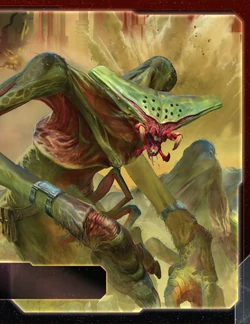

[← Back to Index](../index.html)

# Sardakk N'orr Guide

## Contents

1. [Introduction](#i-introduction)
2. [Playstyle](#ii-playstyle)
3. [Faction Info and Drafting](#iii-faction-info-and-drafting)
   - [Home System & Commodities](#a-home-system--commodities) · [Starting Fleet](#b-starting-fleet) · [Faction Abilities](#c-faction-abilities) · [Technologies](#d-starting-and-faction-technologies) · [Leaders](#e-leaders) · [Promissory Note](#f-promissory-note---tekklar-legion) · [Alliance](#g-alliance) · [Mech](#h-mech---valkyrie-exoskeleton) · [Flagship](#i-flagship---cmorran-norr) · [Breakthrough](#j-breakthrough---norr-supremacy-br) · [Slice and Draft](#k-slice-and-draft-considerations)
4. [Round 1 Problems and Faction Weakness](#iv-round-1-problems-and-faction-weakness)
   - [First Turn Priorities](#a-first-turn-priorities) · [Technology Deficit](#b-technology-deficit) · [Diplomatic Weakness](#c-diplomatic-weakness) · [Over-Aggression Risk](#d-over-aggression-risk)
5. [Technology](#v-technology)
   - [Overview](#a-overview) · [Tech Path](#b-tech-path)
6. [Strategy Cards](#vi-strategy-cards)
   - [Round 1](#a-round-1) · [Round 2+](#b-round-2)
7. [Unit Composition and Game Plan](#vii-unit-composition-and-game-plan)
   - [Unit Composition](#a-unit-composition) · [Game Plan](#b-game-plan)
8. [Objectives](#viii-objectives)
   - [Objective Summary](#a-objective-summary) · [Stage I](#b-stage-i-objectives) · [Secret Objectives](#c-secret-objectives) · [Stage II](#d-stage-ii-objectives)
9. [Alliance Priority](#ix-alliance-priority)
10. [Bonus Game Elements](#x-bonus-game-elements)
    - [Action Cards](#a-high-value-action-cards) · [Relics](#b-relic-priorities) · [Agendas](#c-agenda-awareness)
11. [End Notes](#xi-end-notes)

---

## I. Introduction

The Sardakk N'orr are the galaxy's premier mercenaries—a swarm of relentless bug warriors who do the dirty work nobody else can. You're not building a peaceful empire or racing for technology. You're deploying massive armies of infantry across the map, taking out threats by yourself, and getting paid in command tokens and tech for every fight you win. Sardakk N'orr is about overwhelming opponents with superior numbers and raw combat skill, then leveraging that violence into success.

If you are scared to make an enemy or two, Sardakk is not for you.

## II. Playstyle

Playing Sardakk N'orr means embracing your role as the table's hired gun—employed by yourself. You flood the board with cheap infantry and fighters, strike at whoever's in your way, and extract command tokens and tech from constant aggression. Your units hit harder in combat than anyone else's, your armies can invade from neighboring systems without ships, and every fight you win makes you stronger.

The beauty of Sardakk is that you don't need fancy technology or a booming economy. You just need unit upgrades, tokens and bodies...Lot's of bodies. Swarm planets with infantry, pressure your neighbors, and make deals to take out the leaders. Someone's ahead? You're the one who can stop them. Want to score objectives? Trade your military services for support.

You're behind in tech, behind in points, but scary as hell for anything within reach.

---

## III. Faction Info and Drafting

### A. Home System & Commodities

**Home System:**
- **Tren'Lak:** 1 resource / 0 influence
- **Quinarra:** 3 resources / 1 influence
- **Total: 4 resources / 1 influence (4 optimal resources / 0 optimal influence)**

**Commodities:** 3

**Notes:** Resource-heavy home system (4 resources, only 1 influence). Excellent for fleet production, terrible for voting and tokens. Two-planet home system is mediocre for defense. Your 3 commodities are decent for trading. Built for military production, not politics.

### B. Starting Fleet

- 2 Carriers
- 1 Cruiser
- 5 Infantry
- 1 Space Dock
- 1 PDS

**Notes:** Great starting fleet. 2 carriers with capacity and 5 infantry allows for great expansion to best systems nearby. Your mighty fleet of swarming fighters...oh wait, we didn't get any. Well, good enough.

### C. Faction Abilities

**Unrelenting (Faction Ability):** Apply +1 to the result of each of your unit's combat rolls.

Your signature ability. Only works during combat rounds—does NOT apply to pre-combat abilities like ANTI-FIGHTER BARRAGE, SPACE CANNON, or BOMBARDMENT.

Unrelenting gives each unit 0.1 expected extra hit. For every 10 units you roll, you get 1 extra hit on average. Not great.

### D. Starting and Faction Technologies

**Starting Technologies:**

**None (0 starting technologies)**

**Notes:** You start with ZERO technologies. You are the only faction in the game with no starting tech.

**Faction Technologies:**

**Exotrireme II (BBY):**
*N'orr Dreadnought - Cost: 4 | Combat: 5 | Move: 2 | Capacity: 1 | BOMBARDMENT 4 (x2) | Sustain Damage*

This unit cannot be destroyed by "Direct Hit" action cards. After a round of space combat, you may destroy this unit to destroy up to 2 ships in this system.

Upgraded version of your Exotrireme I with Move 2 (instead of 1), immunity to Direct Hit, and kamikaze ability to destroy 2 ships by sacrificing the dreadnought.

**Valkyrie Particle Weave (RR):**
*After making combat rolls during a round of ground combat, if your opponent produced 1 or more hits, you produce 1 additional hit.*

Strong defensive ground combat tech. If your opponent gets any hits during ground combat, you get 1 bonus hit back. Synergizes well with your Valkyrie Exoskeleton mech's ability.

### E. Leaders

**Agent - T'ro:**

At the end of a player's tactical ACTION: You may exhaust this card; if you do, that player may place 2 infantry from their reinforcements on a planet they control in the active system.

Support agent. After any tactical action, exhaust to let that player (you or opponent) place 2 free infantry on planets in active system. Use on yourself (free reinforcements) or trade to others for favors.

**Commander - G'hom Sek'kus:** *Unlock: Control 5 planets in non-home systems.*

During the "Commit Ground Forces" step: You can commit up to 1 ground force from each planet in the active system and each planet in adjacent systems that do not contain 1 of your command tokens.

Powerful invasion commander. Easy unlock (5 non-home planets by R2-R3). Once unlocked, when invading, you can commit ground forces from:
1. Planets in the active system (bypasses capacity requirements)
2. Planets in ADJACENT systems (completely bypasses needing ships)

This lets you invade with massive armies by pulling infantry from neighboring planets without needing ships with capacity. If invading a system adjacent to 3 of your planets, you can commit ground forces from all 3 for overwhelming numbers.

**Hero - Sh'val, Harbinger:** *Unlock: Have 3 scored objectives.* **Tekklar Conditioning** - After you move ships into the active system: You may skip directly to the "Commit Ground Forces" step. If you do, after you commit ground forces to land on planets, purge this card and return each of your ships in the active system to your reinforcements.

Devastating invasion hero. Move ships into system, skip directly to invasion (no space combat), land ground forces, then your ships disappear. Use this to:
1. Bypass enemy fleets entirely (no space combat)
2. Invade multiple planets with ground forces
3. Sacrifice ships (they return to reinforcements, not destroyed)

Example: Move 3 carriers with 12 infantry into enemy system. Hero: Skip space combat, land 12 infantry on 3 planets, ships disappear. You just invaded 3 planets without fighting their fleet.

### F. Promissory Note - **Tekklar Legion**

At the start of an invasion combat: Apply +1 to the result of each of your unit's combat rolls during this combat. If your opponent is the Sardakk N'orr player, apply -1 to the result of his unit's combat rolls during this combat. Then, return this card to the N'orr player.

Decent invasion promissory. Holder gets +1 to combat rolls in ONE ground combat. If fighting YOU (Sardakk), you get -1 (net -2 swing). Try to sell to the active player for 2TG at the start of bigger combats and 1TG for smaller combats to not get it stuck somewhere. A few extra hits can shift the tide of battle.

### G. Alliance

Quite niche for your faction but since it's a weird ability it can surprise people. Try to trade up to a better alliance for yours with the argument of them not being a bug snack.

### H. Mech - **Valkyrie Exoskeleton**

Cost: 2 | Combat: 6 | **Sustain Damage**

After this unit uses its Sustain Damage ability during ground combat, it produces 1 hit against your opponent's ground forces on this planet.

One of the strongest mechs in the game. When it sustains damage (blocks 1 hit), it produces 1 hit back. Devastating in the often short swingy ground combats. With Unrelenting (+1), it hits on 5 instead of 6.

### I. Flagship - **C'Morran N'orr**

Cost: 8 | Combat: 6 (x2) | Move: 1 | Capacity: 3 | **Sustain Damage**

Apply +1 to the result of each of your other ship's combat rolls in this system.

Stacking combat bonus flagship. Your flagship gives +1 to ALL other ships in the system. Combined with Unrelenting (+1), your ships get +2 total:
- Fighters: 9 → 7 to hit
- Cruisers: 7 → 5 to hit
- Dreadnoughts: 5 → 3 to hit

The flagship bonus gives each ship 0.1 expected extra hit. For every 10 ships you roll, you get 1 extra hit on average. Powerful boost to your entire fleet when the flagship is present.

**Exotrireme I - N'orr Dreadnought (Special Unit):**

Cost: 4 | Combat: 5 | Move: 1 | Capacity: 1 | **BOMBARDMENT 4 (x2)** | Sustain Damage

Your unique dreadnought. Different from normal dreadnoughts:
- **BOMBARDMENT 4 (x2):** Normal dreadnoughts have BOMBARDMENT 5 (x1).

Perfect for Sardakk's aggressive playstyle—BOMBARD planets, land ground forces via capacity, invade.

### J. Breakthrough - **N'orr Supremacy (B<>R)**

After you win a combat, either gain 1 command token or research a unit upgrade technology. Blue and red technologies count as each other for prerequisites.

This is what a breakthrough is supposed to be: game changing, faction lifting, and just a ton of fun. Get every game.

**Combat Reward:** After EACH combat victory, choose:
1. Gain 1 command token (any pool)
2. Research 1 unit upgrade tech (must still meet prerequisites)

Win 5 combats R2-R4 = gain 5 command tokens OR research 5 unit upgrades. You convert aggression into tangible advantages. Fight constantly, research unit upgrades from combat victories instead of needing Technology strategy card. Winning fights to not get stalled is fantastic for late game.

### K. Slice and Draft Considerations

Sardakk wants aggressive positioning and resources:

**Speaker Order:**
- **Prefer positions 1-3** - Breakthrough guarantee in early draft.
- **Any position acceptable** - Slight favor to weak neighbor.
- Position matters more for slice composition/planet placements to leverage your commander.

**Slice Priorities:**
- **5+ planets** - Unlock commander (requires 5 non-home planets).
- **Planets all the way towards Mecatol** - Aggressive positioning for map control.
- **Balanced slice** - Resource-heavy home system and breakthrough for tokens means balanced slices work fine. You can work around both resource-heavy or influence-heavy slices.
- **Slight favor to more influence** - Your +1 combat rolls shine with many units (not a few big ships). More influence = more command tokens = more activations = more units.
- **Entropic Scar (legendary planet)** - Get a head start with bonus red tech which is also blue. Massive advantage. Both your faction techs you would get later or not at all but with this your combat prowess improves further.
- **Hope's End (legendary planet)** - Get out early mechs to start winning those easy ground combats.
- **Tech skips** - Not needed but welcome to get more avenues for advantageous combats.

**Slice Features to Avoid:**
- **Isolated slices** - Need neighbors to attack for breakthrough rewards.
- **Anomalies in middle of slice** - Asteroid fields and gravity rifts block movement without tech you won't get early.

---

## IV. Round 1 Problems and Faction Weakness

### A. First Turn Priorities

**Round 1 Priority Rankings:**

1. **Breakthrough** - Get N'orr Supremacy early. Game changing, faction lifting, and essential for your strategy.

2. **Technology** - Activate your breakthrough by unlocking prerequisites for unit upgrades.

3. **Scoring** - You can have problems with some objectives. If you can get an early one, do it.

4. **Expansion and Production** - Use your strong starting fleet to expand.

**Expansion Notes:** Aim for 2 strong systems nearby. One of them should be on the way to Mecatol. We need to get some targets...cough...neighbors.

### B. Technology Deficit

There is definitely a tech deficit. Things are locked and you got 0 flexibility. You can catch up on unit upgrades quickly through N'orr Supremacy, but you will never have the tech. Accept you're tech-poor. Use breakthrough to research unit upgrades from combat wins. Focus on what you need, not what's optimal.

### C. Diplomatic Weakness

You have to attack people and no one wants to be attacked. You have to be smart and optimize the amount of attacks. Focus your aggression strategically, not randomly. Do not be greedy and go for more than it's worth. Having someone on a revenge tour because you wanted an extra token is not worth it.

### D. Over-Aggression Risk

Being spread out is not that good. What you want from an enemy is a bit of a tug of war. You take here, they win a combat there. You don't have to move too far to find good combats. For them, war is costly. For you, it's just cost of doing business.

---

## V. Technology

### A. Overview

You start with **0 technologies.**

There's really only 1 tech path these days: **AI Development Algorithm + Gravity Drive (B)**. Use N'orr Supremacy to research unit upgrades from combat wins.

**What AI Development Algorithm + Gravity Drive (B) unlocks:**
- AI Development Algorithm + Gravity Drive (B) = 1R + 1B
- With B<>R synergy: 3 Red OR 3 Blue (interchangeable)
- AI Dev ignores 1 prerequisite for unit upgrades

**Available unit upgrades via N'orr Supremacy:**
- Carrier II (BB) - ✓
- Exotrireme II (BBY) - ✓ (AI Dev ignores yellow)
- Destroyer II (RR) - ✓
- Fighter II (GB) - ✓ (AI Dev ignores green)
- PDS II (RY) - ✓ (AI Dev ignores yellow)

**Cannot research via N'orr Supremacy:**
- War Sun (RRRY) - Needs 1 more red + yellow
- Infantry II (GG) - Needs 1 more green
- Space Dock II (YY) - Needs 1 more yellow
- Cruiser II (GYR) - Needs green + yellow

### B. Tech Path

**Round 1: AI Development Algorithm (R)**
- When you research unit upgrade tech, ignore 1 prerequisite. When using PRODUCTION, reduce cost by number of unit upgrade techs you own.
- **Why:** Mainly for ignoring prerequisites on unit upgrades. Lets you research more unit upgrades via N'orr Supremacy.

**Round 2: Gravity Drive (B)**
- +1 move to 1 ship per activation
- **Why:** Mobility for raids and repositioning.

**Round 3+:** Use N'orr Supremacy to research unit upgrades from combat wins.

**Priority order for available upgrades:**
1. **Carrier II** - Capacity 6 for transporting armies
2. **Exotrireme II** - Move 2, Direct Hit immunity, kamikaze ability
3. **Fighter II** - Move 2, can move without transport
4. **Destroyer II** - AFB 6 (x3)
5. **PDS II** - Deep Space Cannon

**Flexibility:** If taking Technology strategy card, consider Duranium Armor (RR) or Fleet Logistics (BB) based on game needs.

---

## VI. Strategy Cards

### A. Round 1

**Round 1 Priority Ranking:**

1. **Trade** - Breakthrough early. Flexible economy. Careful to not give debt to targets.

2. **Leadership** - Breakthrough early. Command tokens for expansion and activations.

3. **Politics** - Breakthrough early. Setting up flexibility for round 2.

4. **Diplomacy** - Breakthrough early.

5. **Technology** - AI Dev round 1 to unlock prerequisites.

6. **Warfare** - Combat enabler but need breakthrough first.

7. **Construction** - Screw people out of Warfare.

8. **Imperial** - Never R1.

**Strategy Token Priority:** Technology and Diplomacy.

**Note:** If you're 6th pick as Sardakk, what did you do?

### B. Round 2+

**Love:**
- **Imperial** - There will be bad rounds for Sardakk so Imperial and hopefully an Imperial point is critical to be in the running. Worst case have to use hero if heavily reinforced by a meanie.
- **Warfare** - Value card. Potential of 2-3 tech and 2-3 tokens from 2 activations.

**Good:**
- **Leadership** - Command tokens for aggression and production.
- **Politics** - Improve speaker order to solve objectives.
- **Trade** - 7-9 trade goods. Good to smooth out diplomacy but careful if diplomacy already went bad.

**Situational:**
- **Technology** - Depends on tech needs.
- **Construction** - Only if needing structures.
- **Diplomacy** - Limited value.

---

## VII. Unit Composition and Game Plan

### A. Unit Composition

**Preferred Units:**
- **Carriers** - Transport infantry for invasions.
- **Exotrireme** - BOMBARDMENT and combat power. War sun killer.
- **Fighters** - Prefer more fighters rather than 1 big exotrireme because of Unrelenting.
- **Infantry** - Mass infantry for ground combat.
- **Mechs** - Strong ground combat presence.
- **Flagship** - Late game power spike.

### B. Game Plan

**Early Game (Rounds 1-2):**

Focus on grabbing 5+ planets to unlock your commander. Expand toward your neighbors' planets to set up commander invasions from adjacent systems. Position yourself for planets toward Mecatol—look for 2 strong systems nearby, one of them on the way to Mecatol. Get breakthrough unlocked so you can start extracting value from combats.

**Mid Game (Rounds 3-4):**

Fight constantly. Every combat win gets you a command token or unit upgrade tech from N'orr Supremacy. Get into 2-3 combats per round after breakthrough. Set up tug-of-war positions where you can win fights without overextending. Focus combats against few targets—don't want 3 people mad at the same time. Always try to smooth out one relationship before destroying another. Mecatol is a planet you can grab with your hero if you have adjacent systems.

**Late Game (Round 5+):**

Use your accumulated combat advantage to close out the game. Your unit upgrades from N'orr Supremacy should give you a strong fleet. Flagship comes online for power spike. Hero for Mecatol or critical objectives if needed. Pressure neighbors and score combat objectives to win.

---

## VIII. Objectives

### A. Objective Summary

**Strengths:** N'orr Supremacy breakthrough makes every combat profitable with command tokens or unit upgrade tech. Combat objectives are excellent. Commander enables invasions from adjacent systems without moving ships. Territorial objectives from aggressive expansion.

**Weaknesses:** Tech deficit - 0 starting tech, permanently tech-poor. Structures - no Space Dock II (YY) hurts production scaling. Mobility early - no movement tech until round 2, hard to reach targets without Gravity Drive (B).

### B. Stage I Objectives

| Stage I Objective                                                       | Status |
|-------------------------------------------------------------------------|--------|
| **Spendies** | |
| Develop Weaponry (Own 2 unit upgrade technologies)                      | 🟢     |
| Diversify Research (Own 2 tech in each of 2 colors)                     | 🔴     |
| Lead from the Front (Spend 3 tokens from tactic/strategy pools)         | 🟢     |
| Negotiate Trade Routes (Spend 5 trade goods)                            | 🔴     |
| Sway the Council (Spend 8 influence)                                    | 🔴     |
| **Control** | |
| Expand Borders (Control 6 planets in non-home systems)                  | 🟢     |
| Push Boundaries (Control more planets than each neighbor)               | 🟢     |
| **Ships in Systems** | |
| Amass Wealth (Spend 3 influence, 3 resources, 3 trade goods)            | 🟡     |
| Discover Lost Outposts (Control 2 planets with attachments)             | 🔴     |
| Engineer a Marvel (Have flagship or war sun on board)                   | 🟢     |
| Explore Deep Space (Units in 3 systems without planets)                 | 🔴     |
| Intimidate the Council (Ships in 2 systems adjacent to MR)              | 🟡     |
| Make History (Units in 2 systems with legendary/MR/anomalies)           | 🟡     |
| Populate the Outer Rim (Units in 3 edge systems)                        | 🔴     |
| Raise a Fleet (5+ non-fighter ships in 1 system)                        | 🟢     |
| **Tech** | |
| Corner the Market (Control 4 planets with same trait)                   | 🟡     |
| Found Research Outposts (Control 3 planets with tech specialties)       | 🔴     |
| **Structure** | |
| Build Defenses (Have 4 or more structures)                              | 🔴     |
| Erect a Monument (Spend 8 resources)                                    | 🟢     |
| Improve Infrastructure (Structures on 3 planets outside HS)             | 🔴     |

**Legend:** 🟢 Likely | 🟡 Possible | 🔴 Difficult

### C. Secret Objectives

| Secret Objective                                                         | Status |
|--------------------------------------------------------------------------|--------|
| **Combat** | |
| Become a Martyr (Lose control of planet in home system)                 | 🟡     |
| Betray a Friend (Win combat vs player whose PN you have)                | 🟢     |
| Brave the Void (Win combat in anomaly)                                  | 🟢     |
| Darken the Skies (Win combat in another player's HS)                    | 🟡     |
| Demonstrate your Power (3+ non-fighter ships after space combat)        | 🟢     |
| Destroy their Greatest Ship (Destroy war sun/flagship)                   | 🟢     |
| Fight With Precision (AFB destroy last fighter)                         | 🟢     |
| Make an Example (BOMBARDMENT destroy last ground forces)                | 🟢     |
| Spark a Rebellion (Win combat vs VP leader)                              | 🟢     |
| Turn their Fleets to Dust (SPACE CANNON destroy last ship)              | 🔴     |
| **Ships in Systems** | |
| Become the Gatekeeper (Ships in alpha and beta wormhole systems)        | 🟡     |
| Cut Supply Lines (Ships in system with enemy space dock)                | 🟢     |
| Forge an Alliance (Control 4 cultural planets)                           | 🟡     |
| Occupy the Seat of the Empire (Control MR with 3+ ships)                | 🟡     |
| Threaten Enemies (Ships adjacent to another player's HS)                | 🟢     |
| **Control** | |
| Adapt New Strategies (Own 2 faction technologies)                       | 🟡     |
| Defy Space and Time (Units in wormhole nexus)                           | 🟡     |
| Establish Hegemony (Control planets with 12+ influence)                 | 🔴     |
| Hoard Raw Materials (Control planets with 12+ resources)                | 🟢     |
| Learn Secrets of the Cosmos (Ships in 3 systems adjacent to anomalies)  | 🟢     |
| Mine Rare Minerals (Control 4 hazardous planets)                         | 🟡     |
| Monopolize Production (Control 4 industrial planets)                     | 🟡     |
| Seize an Icon (Control legendary planet)                                | 🟢     |
| **Tech** | |
| Master the Laws of Physics (Own 4 tech of same color)                   | 🟡     |
| Unveil Flagship (Win space combat with flagship)                         | 🟢     |
| **Structure/Units** | |
| Establish a Perimeter (Have 4 PDS on board)                             | 🟡     |
| Fuel the War Machine (Have 3 space docks)                               | 🟡     |
| Mechanize the Military (1 mech on each of 4 planets)                    | 🟡     |
| Occupy the Fringe (9+ ground forces on planet without space dock)       | 🟡     |
| **Other** | |
| Control the Region (Ships in 6 systems)                                 | 🟢     |
| Destroy Heretical Works (Purge 2 relic fragments)                       | 🔴     |
| Dictate Policy (3+ laws in play)                                        | 🔴     |
| Drive the Debate (You/your planet elected by agenda)                    | 🔴     |
| Form a Spy Network (Discard 5 action cards)                             | 🟡     |
| Foster Cohesion (Be neighbors with all players)                         | 🟢     |
| Gather a Mighty Fleet (Have 5 dreadnoughts)                             | 🟢     |
| Produce en Masse (Units with PRODUCTION 8+ in single system)            | 🟡     |
| Prove Endurance (Last to pass)                                          | 🟡     |
| Stake Your Claim (Control planet in contested system)                   | 🟢     |
| Strengthen Bonds (Have another player's PN)                             | 🟢     |

🟢 Likely | 🟡 Possible | 🔴 Difficult

### D. Stage II Objectives

| Stage II Objective                                                       | Status |
|--------------------------------------------------------------------------|--------|
| **Spendies** | |
| Centralize Galactic Trade (Spend 10 trade goods)                         | 🔴     |
| Found a Golden Age (Spend 16 resources)                                  | 🟡     |
| Galvanize the People (Spend 6 tokens from tactic/strategy pools)         | 🟢     |
| Manipulate Galactic Law (Spend 16 influence)                             | 🔴     |
| **Control** | |
| Conquer the Weak (Control 1 planet in another player's HS)               | 🟢     |
| Hold Vast Reserves (Spend 6 influence, 6 resources, 6 trade goods)       | 🔴     |
| Subdue the Galaxy (Control 11 planets in non-home systems)               | 🔴     |
| **Ships in Systems** | |
| Achieve Supremacy (Flagship/War Sun in another player's HS or MR)        | 🟢     |
| Command an Armada (Have 8+ non-fighter ships in 1 system)                | 🟢     |
| Control the Borderlands (Units in 5 edge systems not HS)                 | 🔴     |
| Patrol Vast Territories (Units in 5 systems without planets)             | 🔴     |
| Rule Distant Lands (Control 2 planets in/adjacent to different players' HS) | 🟢     |
| **Tech** | |
| Master of Sciences (Own 2 techs in each of 4 colors)                     | 🔴     |
| Revolutionize Warfare (Own 3 unit upgrade technologies)                  | 🟢     |
| Unify the Colonies (Control 6 planets with same trait)                   | 🔴     |
| **Structure** | |
| Become a Legend (Units in 4 systems with legendary/MR/anomalies)         | 🟡     |
| Construct Massive Cities (Have 7+ structures)                            | 🔴     |
| Protect the Border (Structures on 5 planets outside HS)                  | 🔴     |
| Reclaim Ancient Monuments (Control 3 planets with attachments)           | 🔴     |
| Form Galactic Brain Trust (Control 5 planets with tech specialties)      | 🔴     |

🟢 Likely | 🟡 Possible | 🔴 Difficult

---

## IX. Alliance Priority

**Top Tier:**

1. **Crimson Rebellion (Ahk Siever)** - Gain commodity/TG after combat. Perfect synergy with constant fighting.
2. **Deepwrought (Aello)** - Passive TG when others research tech. Addresses TG weakness.
3. **Yin Brotherhood (Brother Omar)** - Green prereq + skip prereqs when researching others' tech. Tech path flexibility.
4. **Muaat (Magmus)** - Gain 1 TG after spending strategy token. Addresses TG weakness.

**Good:**

5. **Nomad (Navarch Feng)** - Produce flagship without resources. Saves 8 resources.
6. **Titans of Ul (Tungstantus)** - Gain 1 TG when using PRODUCTION. You produce constantly.
7. **Barony of Letnev (Rear Admiral Farran)** - Gain 1 TG after sustain damage. Good for dreadnought-heavy faction.
8. **Vuil'raith Cabal (That Which Molds Flesh)** - Up to 2 fighters/infantry don't count against PRODUCTION limit. Perfect for swarm tactics.
9. **Empyrean (Xuange)** - Return token when others move into your systems. Late game slaying tool. Pay people to activate you with stalls to unlock and do more fighting with your main fleet.
10. **Nekro Virus (Nekro Acidos)** - Draw action card after gaining tech. Value from breakthrough tech gains.
11. **Mentak Coalition (S'ula Mentarion)** - Steal promissory note after winning space combat. Combat-focused value.

---

## X. Bonus Game Elements

This section highlights action cards that synergize particularly well with your faction's strengths or mitigate your weaknesses, relics that offer exceptional value for your faction's strategy and abilities, and agendas to pursue that benefit your position, and agendas to watch out for that could hurt you.

### A. High-Value Action Cards

### B. Relic Priorities

### C. Agenda Awareness

---

## XI. End Notes

Sardakk N'orr is Twilight Imperium's pure combat faction. While other factions balance multiple priorities, Sardakk focuses on overwhelming martial superiority. Your units win fights they shouldn't win, and every victory makes you stronger through your breakthrough's feedback loop.

Playing Sardakk offers a completely different experience. You're not optimizing trade networks or racing through tech trees—you're the galaxy's menace, converting violence into power. Every combat makes you stronger, turning aggression into command tokens and technologies. You become the table's wild card: a constant threat that must be managed. The faction rewards decisive, aggressive play and teaches you to embrace conflict as a path to victory.

Don't let zero starting technologies fool you. You're not behind—you're playing a different game than everyone else.

**Unrelenting. Unstoppable. Victorious.**
