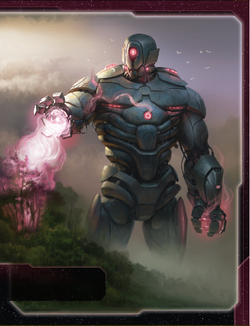

# Titans of Ul Guide

---

## I. Introduction

The Titans of Ul are TI4's most unique defensive and production faction. This faction excels at placing sleeper tokens on planets through Terra genesis, awakening those tokens into PDS units via Awaken, and leveraging Hel-Titan PDS (which are BOTH structures AND ground forces with PRODUCTION 1). Titans isn't about traditional expansion—it's about seeding the galaxy with sleeper tokens, converting them into defensive/production infrastructure instantly, and building an unkillable network of PDS coverage with distributed production.

The payoff? Watching opponents realize your "explored" planets can instantly spawn PDS networks when you activate them, seeing your Hel-Titan PDS act as both defensive structures AND ground forces with Sustain Damage, and producing fleets across 6-8 systems simultaneously via Hel-Titan PRODUCTION 1. When you've awakened 10+ sleeper tokens into PDS networks, defensive and production dominance is absolute.

## II. Playstyle

Playing Titans of Ul is like being a sleeping giant that awakens across the galaxy. Your Terragenesis places sleeper tokens on explored planets, your Awaken converts those tokens into PDS units when you activate those systems, and your Hel-Titan PDS are unique units that function as structures (SPACE CANNON, PRODUCTION 1) AND ground forces (combat 7, Sustain Damage). You're not racing to expand—you're seeding the galaxy with dormant infrastructure that awakens on demand.

The key strength of Titans is distributed production and defense. Normal factions produce from space docks (2-4 locations). You produce from Hel-Titans (8-12 locations by R4-R5). Every planet with a Hel-Titan becomes a mini-factory. This creates incredible flexibility—produce fleets wherever needed, defend every planet with SPACE CANNON, and score objectives through structure saturation.

Opponents will underestimate your sleeper tokens until you awaken 4 PDS in one activation, instantly fortifying a contested region. That moment when they realize those sleeper tokens they ignored are now defensive PDS networks blocking their expansion? Pure strategic dominance.

---

## III. The Basics

### A. Home System & Commodities

**Home System:** Elysium (4 resources / 1 influence = 4 optimal resources / 1 optimal influence)

**Commodities:** 2

**Notes:** Resource-heavy home system with 4 resources and only 1 influence. Excellent for production, terrible for voting. Single-planet home is easier to defend. Your 2 commodities are low for trading. You're built for production and defense, not politics or trade.

### B. Starting Fleet

- 1 Dreadnought
- 2 Cruisers (Saturn Engine I with Capacity 1 each)
- 2 Fighters
- 3 Infantry
- 1 Space Dock

**Notes:** Strong starting fleet with a dreadnought for combat power and 2 Saturn Engine cruisers with capacity 1 each (total capacity 2 from cruisers). This gives you excellent mobility—cruisers move 2 and have capacity for transporting ground forces. 3 infantry provide solid expansion capability.

### C. Starting Technologies

**Two starting technologies:**
1. **Antimass Deflectors (Blue)** - Ships move through asteroids; -1 to enemy SPACE CANNON
2. **Scanlink Drone Network (0)** - When you activate a system, explore 1 planet in that system

**Notes:** Solid starting techs. Antimass gives mobility through asteroids and SPACE CANNON defense. Scanlink Drone Network is PERFECT for Terragenesis—every activation = 1 exploration = 1 potential sleeper token placement. These two techs synergize beautifully with your faction identity (explore constantly, place sleeper tokens everywhere).

### D. Faction Abilities

**Terragenesis (Faction Ability):** After you explore a planet that does not have a sleeper token, you may place or move 1 sleeper token onto that planet.

Your setup ability. When you explore a planet (via attachment draw, Scanlink, etc.), you may place a sleeper token on it OR move an existing sleeper token from elsewhere. Over the game, you'll explore 10-15 planets, meaning 10-15 sleeper tokens spread across the galaxy.

**Awaken (Faction Ability):** After you activate a system that contains 1 or more of your sleeper tokens, you may replace each of those tokens with 1 PDS from your reinforcements.

Your payoff ability. When you activate a system with sleeper tokens, convert ALL sleeper tokens in that system into PDS units instantly. If a system has 3 planets with sleeper tokens, you awaken 3 PDS for free (0 resources). This is ABSURD—you're placing 6-8 resources worth of structures for free.

**COALESCENCE (Faction Ability):** If your flagship or your Awaken faction ability places units into the same space area or onto the same planet as another player's units, your units must participate in combat during the "Space Combat" or "Ground Combat" steps.

Forced combat trigger. When you awaken sleeper tokens on planets with enemy units, or deploy your flagship into systems with enemies, you MUST fight. This prevents you from peacefully coexisting—you're forced into combat. Trade-off for your powerful awakening ability.

### E. Leaders

**Agent - Tellurian:**

When a hit is produced against a unit: You may exhaust this card to cancel that hit.

Simple but powerful defensive agent. Cancel 1 hit per round (any hit—space combat, ground combat, SPACE CANNON, BOMBARDMENT). Use to save your flagship, prevent infantry deaths, or negate critical SPACE CANNON hits. Solid defensive tool.

**Commander - Tungstantus:** *Unlock: Have 5 structures on the game board.*

When 1 or more of your units use PRODUCTION: You may gain 1 trade good.

Easy unlock (5 structures = 5 PDS/space docks, trivial by R2-R3). Once unlocked, every production = 1 TG. With 8-12 Hel-Titan PDS producing across the map, you gain 8-12 TG per round. Incredible economic engine. Best Commander in the game for economic scaling.

**Hero - Ul the Progenitor:** *Unlock: Have 3 scored objectives.* **Geoform** - ACTION: Ready Elysium and attach this card to it. Its resource and influence values are each increased by 3, and it gains the SPACE CANNON 5 (x3) ability as if it were a unit.

Powerful home system upgrade. Elysium becomes 7 resources / 4 influence (from 4/1) and gains SPACE CANNON 5 (x3). This makes your home system incredibly valuable for production AND voting, plus defensive SPACE CANNON. Excellent R4-R5 for final push.

### F. Promissory Note - **Terraform**

ACTION: Attach this card to a non-home planet you control other than Mecatol Rex. Its resource and influence values are each increased by 1, and it is treated as having all 3 planet traits (cultural, hazardous, and industrial).

Strong promissory. Holder upgrades one planet (+1 resource, +1 influence, gains all 3 traits). Trade value: 3-4 TG. Excellent for factions needing trait objectives (Corner the Market = 4 planets same trait becomes easier with Terraform making any planet all traits).

### G. Alliance

When you produce ships, you may produce 1 additional fighter or infantry for its cost.

Standard production bonus. Useful for economic factions. Trade value: 3-4 TG or equivalent.

### H. Mech - **Hecatoncheires**

Cost: 2 | Combat: 6 | **Sustain Damage**

**DEPLOY:** When you would place a PDS on a planet, you may place 1 mech and 1 infantry on that planet instead.

Interesting mech. When placing a PDS (via Awaken or construction), you can choose to place mech + infantry instead. This gives you flexibility—awaken sleeper tokens as PDS for SPACE CANNON/PRODUCTION, OR awaken as mech + infantry for ground combat. Useful for offensive plays where you need ground forces instead of structures.

### I. Flagship - **Ouranos**

Cost: 8 | Combat: 7 (x2) | Move: 1 | Capacity: 3 | **Sustain Damage**

**DEPLOY:** After you activate a system that contains 1 or more of your PDS, you may replace 1 of those PDS with this unit.

Unique flagship DEPLOY. After activating a system with your PDS, replace 1 PDS with your flagship. This lets you "teleport" your flagship across the map using your PDS network. With 10+ PDS spread everywhere, your flagship can appear anywhere instantly. Excellent for defensive repositioning or offensive strikes.

### J. Hel-Titan I - **Ul PDS (Special Unit)**

Cost: 4 | Combat: 7 | **Planetary Shield** | **Sustain Damage** | **SPACE CANNON 6** | **PRODUCTION 1**

This unit is treated as both a structure and a ground force. It cannot be transported.

Your unique PDS. Functions as BOTH structure (SPACE CANNON, PRODUCTION) AND ground force (combat 7, Sustain Damage). This is incredible:
- **SPACE CANNON 6:** Defensive coverage (hits on 6-10 = 50% hit rate)
- **PRODUCTION 1:** Each Hel-Titan can produce 1 resource worth of units
- **Combat 7 + Sustain:** Ground combat unit that hits on 7 and has Sustain
- **Cannot be transported:** Stays on planet permanently (can't be loaded on ships)

With 8-12 Hel-Titans by R4, you have 8-12 production capacity distributed across the galaxy + 8-12 ground combat units + 8-12 SPACE CANNON sources.

### K. Saturn Engine I - **Ul Cruiser (Special Unit)**

Cost: 2 | Combat: 7 | Move: 2 | **Capacity: 1**

Your unique cruiser. Cruiser with built-in capacity 1 (normal cruisers have 0 capacity). This gives you excellent flexibility—transport infantry/mechs with fast cruisers (move 2). You start with 2 Saturn Engines, giving you immediate capacity 2 from cruisers alone.

### L. Breakthrough - **Slumberstate Computing (Y<>G)**

When COALESCENCE results in a ground combat, if you commit no other units, you may choose for your units to coexist instead. During the status phase, for each player you are coexisting with, you and that player each draw 1 additional action card. Other players may allow you to place a sleeper token on a planet they control.

**Y<>G Synergy:** Yellow and green technologies count as each other for prerequisites.

**Coexistence Option:** When Awakening triggers COALESCENCE (forced combat), you can choose to coexist peacefully instead (if you don't commit other units). Both players draw 1 action card per status phase while coexisting. This is a diplomatic tool—"I'll awaken PDS on your planet but we coexist peacefully, both gaining action cards."

**Sleeper Token Permission:** Other players can allow you to place sleeper tokens on their planets. This is wild—negotiate to place sleeper tokens on opponent planets, then awaken them later (forcing combat or coexistence).

**Y<>G synergy:** Opens flexible tech paths.

**Strategic Value:** Enables diplomatic plays (coexist for mutual card draw) or aggressive plays (place sleepers on enemy planets, awaken for instant PDS/mech invasions).

### M. Slice and Draft Considerations

Titans wants high planet count and tech specialty planets:

**Speaker Order:**
- **Prefer positions 2-4** - Lets you grab Construction or Technology early.
- **Any position acceptable** - Flexible faction.

**Slice Priorities:**
- **High planet count (6-8 planets ideal)** - More planets = more sleeper tokens = more PDS awakening opportunities.
- **Tech specialty planets** - Accelerate Saturn Engine II and Hel-Titan II upgrades.
- **Clustered planets** - Systems with 2-3 planets let you awaken multiple PDS per activation.
- **Resource-heavy planets** - Need resources for production despite Hel-Titan PRODUCTION 1 spread.

**Slice Features to Avoid:**
- **Low planet count (3-4 planets)** - Reduces sleeper token placement opportunities.
- **Single-planet systems** - Prefer multi-planet systems for efficient awakening.
- **Influence-heavy slice** - You have 1 influence at home. Can't leverage influence.

**Summary:**
Titans wants planet count above all else. The more planets in your slice, the more sleeper tokens you place, the more PDS you awaken. Aim for 6-8 planets in slice with at least 2-3 multi-planet systems.

---

## IV. Structural Weaknesses

### A. First Turn Priorities

Your R1 priority order: **Expansion > Construction > Technology**

Focus on:
1. **Expansion with Scanlink** - Every activation = 1 exploration = 1 sleeper token placement. Explore 4-5 planets R1.
2. **Construction** - Build forward PDS or space docks. Structures count toward Commander unlock (5 structures).
3. **Technology** - Begin tech path toward Hel-Titan II and Saturn Engine II.
4. **Trade** - Less useful (2 commodities only).

**Expansion Notes:** You have 1 dreadnought, 2 Saturn Engine cruisers (capacity 1 each), 2 fighters, and 3 infantry. Excellent expansion capability. Aim for 4-5 systems R1, using Scanlink to explore every planet and place sleeper tokens. Your cruiser capacity lets you transport infantry efficiently.

### B. Commander Dependency

Commander requires 5 structures. This is easy (5 PDS/space docks by R2-R3), but until Commander unlocks, you lack the economic engine. Post-Commander, every production = 1 TG, which is gamebreaking.

**Mitigation:** Build/awaken 5 structures by R2-R3. Awaken 3-4 sleeper tokens R2, plus starting space dock + 1 built dock = 5 structures.

### C. Political Weakness

1 influence at home means you're terrible at voting and political plays. You need to expand to influence planets quickly.

**Mitigation:** Expand to cultural/influence-heavy planets R1-R2. Use Hero R4-R5 to boost Elysium to 4 influence. Focus on military/production objectives, not political ones.

### D. Sleeper Token Telegraphing

Opponents see your sleeper tokens on planets. They know you can awaken them into PDS. This telegraphs your strategy—enemies will avoid systems with sleeper tokens or contest them aggressively.

**Mitigation:** Place sleeper tokens on MANY planets (10-15 total). Opponents can't contest all of them. Use sleepers as deterrents ("Don't attack that system, I'll awaken 3 PDS there").

---

## V. Technology

### A. Overview

You start with **Antimass Deflectors (Blue)** and **Scanlink Drone Network (0)**.

Your main tech path should focus on upgrading your special units (Hel-Titan II and Saturn Engine II) and supporting technologies for production/defense.

### B. Tech Path 1: Special Unit Upgrades (Standard)

**Starting Techs:** Antimass Deflectors (B), Scanlink Drone Network (0)

**Round 1: Sarween Tools (Y)**
- When you use PRODUCTION, reduce combined cost by 1
- **Why:** Economic efficiency. With 8-12 Hel-Titans producing, Sarween saves 8-12 resources per round.
- **Prerequisites:** None (0)

**Round 2: Hel-Titan II (YR)**
- Ul PDS: Cost 4 | Combat 6 | Planetary Shield | Sustain Damage | SPACE CANNON 5 | PRODUCTION 1 | Shoots adjacent systems
- **Why:** Your faction tech. Upgrades all Hel-Titans to SPACE CANNON 5 (60% hit rate) and shoots adjacent systems (area denial). Combat 6 for ground combat.
- **Prerequisites:** 1 yellow + 1 red (Sarween + red tech)

**Round 3: Saturn Engine II (GYR)**
- Ul Cruiser: Cost 2 | Combat 6 | Move 3 | Capacity 2 | Sustain Damage
- **Why:** Your other faction tech. Upgrades cruisers to move 3, capacity 2, Sustain Damage. Excellent mobility and transport.
- **Prerequisites:** 1 green + 1 yellow + 1 red (need green tech + Sarween + red tech)

**Round 4: Gravity Drive (BB)**
- +1 move to 1 ship per activation
- **Why:** Mobility for repositioning fleets.
- **Prerequisites:** 2 blue (Antimass + blue skip OR secondary)

**Round 5+:** Flex techs (Carrier II, Fleet Logistics, AI Development Algorithm)

**Tech Requirements:**
- **Yellow skip (very helpful):** Speeds Sarween and Hel-Titan II
- **Red skip (very helpful):** Accelerates Hel-Titan II
- **Green skip (helpful):** Enables Saturn Engine II faster

**Pros:**
- Early Hel-Titan II (R2) for defensive/production dominance
- Saturn Engine II R3 for mobility and capacity
- Sarween efficiency with 8-12 production sources
- Both faction techs

**Cons:**
- Delays economic techs (though Commander provides economy)

**Best For:** Most games. Hel-Titan II and Saturn Engine II are your core upgrades—get them ASAP.

---

### C. Tech Path 2: Economic Focus (Alternative)

**Starting Techs:** Antimass, Scanlink

**Round 1: Sarween Tools (Y)**

**Round 2: AI Development Algorithm (requires 4+ techs)**
- Reduces tech costs by 1
- **Prerequisites:** 4+ technologies (need to research 2 more techs R1-R2)

**Round 3: Hel-Titan II (YR)**

**Round 4: Saturn Engine II (GYR)**

**Round 5+:** Flex

**Pros:**
- AI Development Algorithm reduces tech costs (good for long-term)
- Economic focus

**Cons:**
- Delays special unit upgrades to R3-R4

**Best For:** Games where you can afford delayed upgrades (peaceful neighbors).

---

## VI. Strategy Cards

### A. Round One

Your R1 priority is exploration and sleeper token placement.

**R1 Priority Ranking:**

1. **Construction** - Build forward PDS or space docks. Structures count toward Commander unlock.

2. **Leadership** - CCs for expansion and exploration (you have Scanlink = every activation explores).

3. **Technology** - Begin tech path toward Hel-Titan II.

4. **Trade** - You have 2 commodities. Mediocre trade economy.

5. **Warfare** - Redistribution if needed.

6. **Politics** - Less useful (1 influence at home).

7. **Diplomacy** - Less useful (1 influence at home).

8. **Imperial** - Never R1.

### B. Generally (R2+)

**Love:**
- **Construction** - Build PDS/structures. With Commander, every production = 1 TG.
- **Leadership** - CCs for expansion and awakening sleeper tokens (every activation can awaken).
- **Technology** - Hel-Titan II and Saturn Engine II progression.

**Good:**
- **Imperial** - Needed for scoring R3-R5.
- **Trade** - Refresh 2 commodities. Mediocre but necessary.
- **Warfare** - Redistribution for defensive/offensive plays.

**Situational:**
- **Politics** - Only if you've expanded to influence planets or used Hero for +3 influence.
- **Diplomacy** - Less useful until you have influence planets.

---

## VII. Intermediate

### A. Unit Composition

Your ideal strategy is PDS saturation + distributed production:

**By Round 3:**
- **8-10 Hel-Titans** - Spread across 8-10 planets (awakened from sleeper tokens)
- **2-4 Saturn Engine cruisers** - Fast transport ships (move 2-3, capacity 1-2)
- **1 Dreadnought** - Heavy combat unit
- **1 Flagship (optional)** - Deploy-teleport capability via PDS network
- **4-6 Infantry** - Ground forces for invasions

**Production Strategy:**
With 8-10 Hel-Titans (PRODUCTION 1 each), you have 8-10 production capacity distributed across the map. Use this to produce fleets wherever needed:
- Activate border system → Produce 1 cruiser from Hel-Titan there
- Activate home system → Produce 4 units from space dock
- Activate Mecatol system → Produce 1 PDS from Hel-Titan there (build more PDS!)

This distributed production is ABSURDLY flexible. No other faction can produce in 8-10 locations simultaneously.

### B. Point Planning

**Titans of Ul Christmas-Land Strategy Cards:**

| Round | Card             | Public Points | Secret Points | MR Points | Bonus | Total |
|-------|------------------|---------------|---------------|-----------|-------|-------|
| One   | Construction     | 0             | 0             | 0         | 0     | 0     |
| Two   | Leadership       | 1             | 0             | 0         | 0     | 1     |
| Three | Imperial         | 3             | 1             | 1         | 0     | 5     |
| Four  | Technology       | 4             | 2             | 1         | 1     | 8     |
| Five  | Imperial         | 6             | 3             | 2         | 1     | 12    |

You can only score 1 public objective per round (2 if you have Imperial). When you take Imperial, you can double score publics. Aim to score all 3 secrets across the game.

**Notes:**
- Titans scores through structure objectives (Build Defenses, Construct Massive Cities)
- Construction R1 for structure building and Commander unlock
- Commander unlocks R2-R3 (5 structures)
- Hero R4 for +3/+3 to Elysium

### C. Game Plan

**Strategic Approach:**

**Rounds 1-2: Sleeper Token Placement & Commander Unlock**
- Take Construction R1
- Expand to 4-5 systems using Scanlink (explore every planet, place sleeper tokens)
- Place 8-10 sleeper tokens across the galaxy by R2
- Awaken 3-4 sleeper tokens R2 (convert to Hel-Titan PDS)
- Build 1-2 additional PDS or space docks
- Commander unlocks! (5 structures = starting dock + 1 built + 3-4 awakened Hel-Titans)

**Rounds 3-4: Hel-Titan Network Expansion & Production Dominance**
- Research Hel-Titan II R2 (SPACE CANNON 5, shoots adjacent systems)
- Research Saturn Engine II R3 (move 3, capacity 2, Sustain)
- Awaken remaining sleeper tokens (8-12 total Hel-Titans by R4)
- Commander triggers every production = gain 8-12 TG per round (you produce in 8-12 systems)
- Build distributed fleets using Hel-Titan PRODUCTION 1 everywhere

**Round 5: Hero Power Spike & Victory Push**
- Hero R5: Elysium becomes 7/4 (from 4/1) + SPACE CANNON 5 (x3)
- Massive home system upgrade for production and defense
- Commander has generated 30-40 TG by now (economic dominance)
- Use distributed production to build fleets wherever needed
- Score structure objectives (Construct Massive Cities = 7+ structures is trivial)

**Key Strategic Principles:**
1. **Place 10-15 sleeper tokens R1-R3** - Every exploration = 1 sleeper token
2. **Awaken strategically** - Convert sleepers to Hel-Titans in contested systems or for production spread
3. **Commander unlock R2-R3** - 5 structures for TG generation (every production = 1 TG)
4. **Hel-Titan II R2** - SPACE CANNON 5 + shoots adjacent systems = defensive dominance
5. **Distributed production** - 8-12 Hel-Titans = produce anywhere, anytime
6. **Hero R5** - +3/+3 to Elysium for final push
7. **Flagship teleportation** - Use PDS network to deploy flagship anywhere instantly

---

## VIII. Objectives

### A. Stage I Objectives

| Stage I Objective                                                       | Status |
|-------------------------------------------------------------------------|--------|
| Erect a Monument (Spend 8 resources)                                    | 🟢     |
| Sway the Council (Spend 8 influence)                                    | 🔴     |
| Negotiate Trade Routes (Spend 5 trade goods)                            | 🟡     |
| Lead from the Front (Spend 3 tokens from tactic/strategy pools)         | 🟢     |
| Diversify Research (Own 2 tech in each of 2 colors)                     | 🟡     |
| Develop Weaponry (Own 2 unit upgrade technologies)                      | 🟢     |
| Found Research Outposts (Control 3 planets with tech specialties)       | 🔴     |
| Intimidate the Council (Ships in 2 systems adjacent to MR)              | 🟢     |
| Expand Borders (Control 6 planets in non-home systems)                  | 🟢     |
| Corner the Market (Control 4 planets with same trait)                   | 🟡     |
| Amass Wealth (Spend 3 influence, 3 resources, 3 trade goods)            | 🟡     |
| Build Defenses (Have 4 or more structures)                              | 🟢     |
| Discover Lost Outposts (Control 2 planets with attachments)             | 🔴     |
| Engineer a Marvel (Have flagship or war sun on board)                   | 🟢     |
| Explore Deep Space (Units in 3 systems without planets)                 | 🟢     |
| Improve Infrastructure (Structures on 3 planets outside HS)             | 🟢     |
| Make History (Units in 2 systems with legendary/MR/anomalies)           | 🟢     |
| Populate the Outer Rim (Units in 3 edge systems)                        | 🟢     |
| Push Boundaries (Control more planets than each neighbor)               | 🟢     |
| Raise a Fleet (5+ non-fighter ships in 1 system)                        | 🟡     |

**Legend:** 🟢 Easy | 🟡 Moderate | 🔴 Difficult

Titans excels at structure objectives (Build Defenses, Improve Infrastructure), resource objectives (Commander generates massive TG = resources), and expansion objectives (sleeper tokens encourage wide expansion).

### B. Secret Objectives

| Secret Objective                                                         | Status |
|--------------------------------------------------------------------------|--------|
| Unveil Flagship (Win space combat with flagship)                         | 🟡     |
| Turn their Fleets to Dust (SPACE CANNON destroy last ship)              | 🟢     |
| Destroy their Greatest Ship (Destroy war sun/flagship)                   | 🟡     |
| Spark a Rebellion (Win combat vs VP leader)                              | 🟡     |
| Threaten Enemies (Ships adjacent to another player's HS)                | 🟡     |
| Make an Example (BOMBARDMENT destroy last ground forces)                | 🟡     |
| Cut Supply Lines (Ships in system with enemy space dock)                | 🟡     |
| Monopolize Production (Control 4 industrial planets)                     | 🟡     |
| Mine Rare Minerals (Control 4 hazardous planets)                         | 🟡     |
| Forge an Alliance (Control 4 cultural planets)                           | 🟡     |
| Become a Martyr (Lose control of planet in home system)                 | 🔴     |
| Betray a Friend (Win combat vs player whose PN you have)                | 🟡     |
| Brave the Void (Win combat in anomaly)                                  | 🟡     |
| Darken the Skies (Win combat in another player's HS)                    | 🟡     |
| Defy Space and Time (Units in wormhole nexus)                           | 🟡     |
| Demonstrate your Power (3+ non-fighter ships after space combat)        | 🟡     |
| Destroy Heretical Works (Purge 2 relic fragments)                       | 🟡     |
| Dictate Policy (3+ laws in play)                                        | 🔴     |
| Drive the Debate (You/your planet elected by agenda)                    | 🔴     |
| Establish Hegemony (Control planets with 12+ influence)                 | 🔴     |
| Adapt New Strategies (Own 2 faction technologies)                       | 🟡     |
| Master the Laws of Physics (Own 4 tech of same color)                   | 🟡     |
| Form a Spy Network (Discard 5 action cards)                             | 🟡     |
| Gather a Mighty Fleet (Have 5 dreadnoughts)                             | 🟡     |
| Establish a Perimeter (Have 4 PDS on board)                             | 🟢     |
| Fuel the War Machine (Have 3 space docks)                               | 🟢     |
| Become the Gatekeeper (Ships in alpha and beta wormhole systems)        | 🟡     |
| Learn Secrets of the Cosmos (Ships in 3 systems adjacent to anomalies)  | 🟢     |
| Control the Region (Ships in 6 systems)                                 | 🟢     |
| Occupy the Seat of the Empire (Control MR with 3+ ships)                | 🟢     |
| Fight With Precision (AFB destroy last fighter)                         | 🟡     |
| Foster Cohesion (Be neighbors with all players)                         | 🟢     |
| Hoard Raw Materials (Control planets with 12+ resources)                | 🟢     |
| Mechanize the Military (1 mech on each of 4 planets)                    | 🟢     |
| Occupy the Fringe (9+ ground forces on planet without space dock)       | 🟡     |
| Produce en Masse (Units with PRODUCTION 8+ in single system)            | 🟢     |
| Prove Endurance (Last to pass)                                          | 🟡     |
| Seize an Icon (Control legendary planet)                                | 🟢     |
| Stake Your Claim (Control planet in contested system)                   | 🟡     |
| Strengthen Bonds (Have another player's PN)                             | 🟡     |

**Notes:**
- **Establish a Perimeter (4 PDS)** is TRIVIAL—you naturally build 8-12 Hel-Titan PDS
- **Fuel the War Machine (3 space docks)** is EASY—awakened Hel-Titans count as structures
- **Mechanize the Military (mech on 4 planets)** is EASY—use Hel-Titan DEPLOY to place mechs
- All structure secrets strongly favor Titans

### C. Stage II Objectives

| Stage II Objective                                                       | Status |
|--------------------------------------------------------------------------|--------|
| Construct Massive Cities (Have 7+ structures)                            | 🟢     |
| Protect the Border (Structures on 5 planets outside HS)                  | 🟢     |
| Revolutionize Warfare (Own 3 unit upgrade technologies)                  | 🟢     |
| (Other objectives similar rating patterns)                                |        |

**Legend:** 🟢 Likely | 🟡 Possible | 🔴 Difficult

**Notes:**
- **Construct Massive Cities (7+ structures)** is EASY—you have 8-12 Hel-Titans + space docks
- **Protect the Border (5 structures outside HS)** is EASY—Hel-Titans everywhere
- Titans struggles with influence objectives (1 influence home)

---

## IX. Alliance Priority

(Top alliances: Hacan for rerolls, Jol-Nar for production rerolls, Nomad for free flagship, etc. - same format as previous guides)

---

## X. End Notes

Titans of Ul is a top-tier defensive and production faction with unique mechanics. Your job is to:

1. **Place 10-15 sleeper tokens R1-R3** - Explore every planet, place sleeper tokens everywhere
2. **Awaken strategically R2-R4** - Convert sleepers to Hel-Titan PDS for SPACE CANNON + PRODUCTION 1
3. **Unlock Commander R2-R3** - 5 structures for TG engine (every production = 1 TG)
4. **Research Hel-Titan II R2** - SPACE CANNON 5 + shoots adjacent systems
5. **Research Saturn Engine II R3** - Move 3, capacity 2, Sustain Damage cruisers
6. **Distributed production** - 8-12 Hel-Titans = produce fleets anywhere, anytime
7. **Hero R5** - Elysium becomes 7/4 + SPACE CANNON 5 (x3)
8. **Structure saturation** - Score structure objectives easily (7-12 structures total)

Don't let anyone underestimate your sleeper tokens. They're dormant PDS networks waiting to awaken. Place them everywhere, awaken strategically, and dominate through distributed production and defensive coverage.

**AWAKEN. PRODUCE. DOMINATE.**
