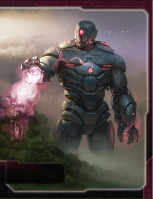

[← Back to Index](../index.html)

# Titans of Ul Guide

## Contents

1. [Introduction](#i-introduction)
2. [Playstyle](#ii-playstyle)
3. [Faction Info and Drafting](#iii-faction-info-and-drafting)
   - [Home System & Commodities](#a-home-system--commodities) · [Starting Fleet](#b-starting-fleet) · [Faction Abilities](#c-faction-abilities) · [Technologies](#d-starting-and-faction-technologies) · [Leaders](#e-leaders) · [Promissory Note](#f-promissory-note) · [Alliance](#g-alliance) · [Mech](#h-mech) · [Flagship](#i-flagship) · [Special Units](#j-hel-titan-i---ul-pds-special-unit) · [Breakthrough](#l-breakthrough---slumberstate-computing-yg) · [Slice and Draft](#m-slice-and-draft-considerations)
4. [Round 1 Problems and Faction Weakness](#iv-round-1-problems-and-faction-weakness)
   - [First Turn Priorities](#a-first-turn-priorities) · [Commander Dependency](#b-commander-dependency) · [Political Weakness](#c-political-weakness) · [Sleeper Token Telegraphing](#d-sleeper-token-telegraphing)
5. [Technology](#v-technology)
   - [Overview](#a-overview) · [Special Unit Upgrades Path](#b-tech-path-1-special-unit-upgrades-standard) · [Economic Focus Path](#c-tech-path-2-economic-focus-alternative)
6. [Strategy Cards](#vi-strategy-cards)
   - [Round 1](#a-round-1) · [Round 2+](#b-round-2)
7. [Unit Composition and Game Plan](#vii-unit-composition-and-game-plan)
   - [Unit Composition](#a-unit-composition) · [Game Plan](#c-game-plan)
8. [Objectives](#viii-objectives)
   - [Objective Summary](#a-objective-summary) · [Stage I](#b-stage-i-objectives) · [Secret Objectives](#c-secret-objectives) · [Stage II](#d-stage-ii-objectives)
9. [Alliance Priority](#ix-alliance-priority)
10. [Bonus Game Elements](#x-bonus-game-elements)
    - [Action Cards](#a-high-value-action-cards) · [Relics](#b-relic-priorities) · [Agendas](#c-agenda-awareness)
11. [End Notes](#xi-end-notes)

---

## I. Introduction

The Titans of Ul are TI4's infrastructure specialists—a faction for players who understand that the galaxy belongs to those who build it. While other factions race to expand and conquer, you're planting sleeper tokens on every planet you explore. Those dormant markers transform into defensive networks and production facilities the moment you activate them. You're not just controlling territory—you're terraforming it into an extension of your will.

This is a faction about distributed power. Your Hel-Titan PDS are both structures and ground forces, defending planets while producing ships simultaneously. Your Commander turns every production into trade goods. Your sleeper tokens let you awaken infrastructure anywhere, instantly.

You don't fight for the galaxy—you build it, one awakened Hel-Titan at a time.

## II. Playstyle

Playing Titans means swinging one of the strongest fleets in the game while maintaining impenetrable defenses. Your Saturn Engine cruisers aren't normal cruisers—upgraded, they're fast mobile capital ships with Sustain Damage that carry troops anywhere. Your Hel-Titan PDS networks defend your territory while producing ships wherever your fleet needs reinforcements.

Your early game focuses on excavation. Explore planets with Scanlink, place sleeper tokens with Terragenesis, then awaken them into infrastructure. Your Commander unlocks and transforms your economy—every production generates trade goods. This wealth funds your elite cruiser fleet while Hel-Titan networks provide distributed production.

As the game progresses, your Saturn Engine fleet projects force across the map while Hel-Titans defend your controlled territory. Distributed production means you build ships wherever needed. Your cruisers swing between objectives, leveraging mobility and Sustain Damage to dominate contested space. Defensive networks keep your home secure while your fleet operates freely.

Your endgame combines overwhelming force with total security. Your cruiser fleet is elite. Your defensive infrastructure is impenetrable. Commander has generated massive wealth. Structure objectives are free. You control the map through mobility and production dominance.

---

## III. Faction Info and Drafting

### A. Home System & Commodities

**Home System:** 1 planet
- **Elysium:** 4 resources / 1 influence = 4 optimal resources
- **Total: 4 resources / 1 influence (4 optimal resources)**

**Commodities:** 2

**Notes:** Very strong defensive home. Single planet with Hero becomes 7/4 late game for extreme production capacity. Low commodities (2) means economy comes from Commander, not trade.

### B. Starting Fleet

- 1 Dreadnought
- 2 Cruisers (Saturn Engine I)
- 2 Fighters
- 3 Infantry
- 1 Space Dock

**Notes:** Strong combat start with dreadnought. 3 infantry can feel lacking, but Saturn Engine cruisers with move 2 make you very flexible for any slice.

### C. Faction Abilities

**Terragenesis:** After you explore a planet that does not have a sleeper token, you may place or move 1 sleeper token onto that planet.

Place sleeper tokens on explored planets. Scanlink explores planets every activation, generating constant sleeper placement opportunities. Combos with Slumberstate Computing breakthrough—negotiate to place sleepers on opponents' planets.

**Awaken:** After you activate a system that contains 1 or more of your sleeper tokens, you may replace each of those tokens with 1 PDS from your reinforcements.

Setup all structures for free. If critically need mobile ground forces, use mech DEPLOY to make mech + infantry instead of PDS.

**COALESCENCE:** If your flagship or your Awaken faction ability places units into the same space area or onto the same planet as another player's units, your units must participate in combat during the "Space Combat" or "Ground Combat" steps.

Forced combat when awakening sleepers on contested planets or deploying flagship into occupied systems. Rarely activate without knowing combat outcome, so not usually a problem.

**Saturn Engine I (Special Unit):** Cost: 2 | Combat: 7 | Move: 2 | Capacity: 1

Makes ton of difference for early expansion. Capacity and move 2 on an early ship frees you from needing Gravity Drive.

**Hel-Titan I (Special Unit):** Cost: 4 | Combat: 7 | Planetary Shield | Sustain Damage | SPACE CANNON 6 | PRODUCTION 1. This unit is treated as both a structure and a ground force. It cannot be transported.

Your unique PDS. Functions as both structure (SPACE CANNON, PRODUCTION) and ground force (combat 7, Sustain Damage). Core unit for distributed production and defense.

### D. Starting and Faction Technologies

**Starting Technologies:**

**Antimass Deflectors** - Ships move through asteroids; -1 to enemy SPACE CANNON

Love to have, hate to tech. Good to start with.

**Scanlink Drone Network** - When you activate a system, explore 1 planet in that system

Perfect synergy with Terragenesis. Every activation explores a planet, every exploration can place a sleeper token.

**Faction Technologies:**

**Saturn Engine II (GYR):** Ul Cruiser - Cost: 2 | Combat: 6 | Move: 3 | Capacity: 2 | Sustain Damage

Probably the strongest ship in the game. Versatility and combat power are unmatched. Get most of these on board for constant presence across the map.

**Hel-Titan II (YR):** Ul PDS - Combat: 6 | Planetary Shield | Sustain Damage | SPACE CANNON 5 | PRODUCTION 1. This unit is treated as both a structure and a ground force. It cannot be transported. You may use this unit's SPACE CANNON against ships that are adjacent to this unit's system.

Difference isn't huge—shoots adjacent systems for defensive value and potential extortion. Won't affect people's willingness to attack you much considering your cruisers and well-defended planets already deter aggression.

### E. Leaders

**Agent - Tellurian:** When a hit is produced against a unit: You may exhaust this card to cancel that hit.

Rarely useful but comes up when someone might lose critical ground combat or their capacity ship gets into unfortunate circumstances. People usually willing to pay 2-3 TG.

**Commander - Tungstantus:** *Unlock: Have 5 structures on the game board.* When 1 or more of your units use PRODUCTION: You may gain 1 trade good.

Your main economic engine. Natural unlock with awakened PDS. Makes a big difference. Notable: turns your influence (tokens) into resources but not the other way around—be careful about overusing secondaries.

**Hero - Ul the Progenitor:** *Unlock: Have 3 scored objectives.* ACTION: Ready Elysium and attach this card to it. Its resource and influence values are each increased by 3, and it gains the SPACE CANNON 5 (x3) ability as if it were a unit.

Elite defenses. SPACE CANNON isn't huge but might help. Biggest thing is 9 production at home—combined with your PDS network, you rarely need bonus space docks. Can be annoying to unlock if you get bad secrets and tough objectives.

### F. Promissory Note - **Terraform**

ACTION: Attach this card to a non-home planet you control other than Mecatol Rex. Its resource and influence values are each increased by 1, and it is treated as having all 3 planet traits (cultural, hazardous, and industrial).

Planet upgrade (+1 resource, +1 influence, gains all traits). Try to sell to rich neighbor R1 for good start. Aim for 3 TG unless planet type objective on the table.

### G. Alliance

**Alliance Ability:** When you produce ships, you may produce 1 additional fighter or infantry for its cost.

Standard production bonus for ally. Trade value: 2-3 TG.

### H. Mech - **Hecatoncheires**

Cost: 2 | Combat: 6 | **Sustain Damage**

**DEPLOY:** When you would place a PDS on a planet, you may place 1 mech and 1 infantry on that planet instead.

Helpful if you need ground forces. Also useful after your 6 PDS are already placed—can still get value from awakening sleepers.

### I. Flagship - **Ouranos**

Cost: 8 | Combat: 7 (x2) | Move: 1 | Capacity: 3 | **Sustain Damage**

**DEPLOY:** After you activate a system that contains 1 or more of your PDS, you may replace 1 of those PDS with this unit.

Good for getting flagship free if you're already at PDS limit. Otherwise very weak.

### J. Breakthrough - **Slumberstate Computing (Y<>G)**

When COALESCENCE results in a ground combat, if you commit no other units, you may choose for your units to coexist instead. During the status phase, for each player you are coexisting with, you and that player each draw 1 additional action card. Other players may allow you to place a sleeper token on a planet they control.

**Y<>G Synergy:** Yellow and green count as each other for prerequisites. Scanlink (0) counts as both yellow and green. Rarely useful.

**Coexistence Option:** Choose peaceful coexistence instead of combat when awakening on contested planets (if no other units committed). Both players draw 1 action card per status phase.

**Sleeper Permission:** Negotiate to place sleeper tokens on opponents' planets. Diplomatic or aggressive tool depending on situation.

**Value Assessment:** Not overly useful if it messes with your R1. You don't like messing with turn 1 and like your tokens—you're always token starved. Politics gives 2 action cards immediately for 1 token. Solving breakthrough then activating someone R2 nets you 3 bonus cards (R2, R3, R4) but they also got 3 cards, and yours come later. Not superb value. Upside is control objectives—more planets, more neighbors. But if not many control objectives exist, don't make big deal of it. Use general strength of Titans to stay ahead and be hard to stop at the end.

**Fun Option:** Go Leadership, unlock breakthrough, convince 2-3 people to let you spend your 3 early bonus tokens for crazy action card game. Might be fun, not sure if helpful since best action cards are holders and not use right away.

### K. Slice and Draft Considerations

**Speaker Order:** Earlier the better, but can handle almost any position. Focus more on getting a good slice. Your neighbors are not too important—you won't be the target.

**Slice Priorities:**
- **High planet count** - More sleeper token opportunities.
- **Multi-planet systems** - Awaken multiple PDS per activation.
- **High influence** - You can turn tokens into resources but not the other way around.

**Nice to Have:**
- Tech skips.
- Tech specialty planets.
- The Fracture.

**Avoid:**
- Low planet count slices.
- Empty tiles in middle of your slice (bad for defensive coverage).

---

## IV. Round 1 Problems and Faction Weakness

### A. First Turn Priorities

**Round 1 Priority Rankings:**

1. **Scoring** - Unlock your hero ASAP.

2. **Expansion and Production** - Setup economy. Explore systems with Scanlink, place sleeper tokens everywhere.

3. **Technology** - Get your cool toys. Path toward Hel-Titan II and Saturn Engine II.

4. **Breakthrough** - Only if game pushes you that way. Combos with Leadership but hate to throw secret to bad proposition most of the time.

**Expansion Notes:** Dread + Saturn to 2-planet system nearby if high value. Otherwise cherry-pick with cruisers to get best planets early.

### B. Token Scarcity

You want to spend tokens to Scanlink (activations), awaken sleepers, use for breakthrough, and send to potentially be aggressive. Always token starved—Commander helps by converting tokens into resources via production TG, but doesn't solve the token shortage itself.

---

## V. Technology

### A. Overview

**Starting Tech:** Antimass Deflectors (Blue) and Scanlink Drone Network (0).

Priority is Saturn Engine II. Hel-Titan II difference isn't huge but still worth getting.

### B. Technology Paths

**Standard Path:**

**Round 1:** AI Development Algorithm (R)
- When you research a unit upgrade technology, you may exhaust to ignore 1 prerequisite. When using PRODUCTION, you may exhaust to reduce cost by number of unit upgrades you own
- **Prerequisites:** 4 technologies (Antimass + Scanlink + 2 more)
- **Why:** Get prereqs for Saturn Engine II.

**Round 2:** Saturn Engine II (GYR)
- Ul Cruiser: Cost 2, Combat 6, Move 3, Capacity 2, Sustain Damage
- **Why:** Strongest ship in game. Elite fleet mobility.

**Round 3:** Gravity Drive (B)
- After you activate a system, apply +1 to the move value of 1 of your ships during this tactical action
- **Why:** Mobility boost for cruiser fleet.

**Round 4:** Fleet Logistics (BB) OR Carrier II (BB) OR Dreadnought II (BBY)
- **Fleet Logistics:** 2 actions per turn
- **Carrier II:** Cost 3, Combat 9, Move 2, Capacity 6
- **Dreadnought II:** Cost 4, Combat 5, Move 2, Capacity 1, Sustain Damage, BOMBARDMENT 5
- **Why:** Utility upgrades or unit upgrades based on objectives.

**Round 5:** Light/Wave Deflector (BBB) OR continue unit upgrades
- **Light/Wave:** Move through enemy ships
- **Why:** Utility or combat power based on needs.

---

## VI. Strategy Cards

### A. Round 1

**Round 1 Priority Ranking:**

1. **Trade** - Refresh 2 commodities. Economy foundation with low commodity count.
2. **Leadership** - Command tokens for Scanlink activations. You're always token starved.
3. **Technology** - Path toward Saturn Engine II. Save resources.
4. **Politics** - Sell speaker token for money. Best chance if you get 2 bad action cards to unlock breakthrough.
5. **Construction** - Produce at home. Use your 4 resources to get 2 cruisers, get 2 more ground forces via mech + infantry to fill out slice. If you have bonus TG, add more infantry in the build.
6. **Diplomacy** - Flip tech skip if you have one.
7. **Warfare** - Extra tactical action for expansion.
8. **Imperial** - Never R1.

**Strategy Token Priority:** Technology and Diplomacy as secondary.

### B. Round 2+

**Love:**
- **Trade** - Refresh commodities. Economy for production.
- **Leadership** - Command tokens for awakening and activations. Always need tokens.
- **Imperial** - Scoring tempo and hero unlock.

**Like:**
- **Technology** - Continue Saturn Engine II path. Save resources and increase tempo.
- **Politics** - Setup for objectives.

**Situational:**
- **Warfare** - If you need to make a key play. Redistribution and fleet pool.
- **Diplomacy** - Refresh planets if needed.
- **Construction** - Worst. If you need structures, secondary works fine (space dock objectives, etc.).

---

## VII. Unit Composition and Game Plan

### A. Unit Composition

Your ideal fleet composition:

- **Hel-Titans** - PDS across the galaxy for distributed production and defense.
- **Saturn Engine Cruisers** - Your core fleet. Elite mobility and Sustain Damage when upgraded.
- **Dreadnought** - Heavy combat support.
- **Infantry** - Ground forces from distributed production.
- **Flagship** - Teleports via PDS network.

Focus on Saturn Engine cruiser fleet with Hel-Titan production support. Cruisers are your primary force projection tool.

### B. Game Plan

Your game plan is straightforward: excavate planets with Scanlink, seed sleeper tokens everywhere, awaken them for Commander unlock, then leverage elite Saturn Engine cruiser fleet with distributed Hel-Titan production support.

**Early Game (R1-2):** Explore 3-4 systems with Scanlink (only systems with planets need exploring), placing sleeper tokens everywhere. Get AI Development Algorithm R1 for tech prereqs. Try to have Commander unlocked by R2 (5 structures—awaken 3-4 sleepers + starting dock + built structures). Best case scenario: hero unlocked in status phase R2 as well—aim for that. Build cruisers and expand your slice. Commander transforms economy—every production generates trade goods. Start accumulating wealth.

**Mid Game (R3-4):** Saturn Engine II online—your cruisers become elite fleet with move 3, capacity 2, Sustain Damage. Gravity Drive adds mobility. Awaken remaining sleepers for distributed production network. Commander generates passive TG income with every production. Build Saturn Engine fleet and swing across map for objectives. Distributed Hel-Titan production means you produce reinforcements wherever your fleet operates. Hero upgrades Elysium to 7/4 for extreme production capacity at home.

**Late Game (R5+):** Commander has generated significant wealth over the game. Your Saturn Engine fleet dominates contested space—fastest mobile capital ships with Sustain Damage. Structure objectives are doable with 6+ Hel-Titans. Most things are doable if you got a good start. Fleet Logistics or Light/Wave adds final layer of dominance. Close out with overwhelming mobility and production advantage.

---

## VIII. Objectives

### A. Objective Summary

**Strengths:** Structure objectives are easy with 6 Hel-Titans naturally deployed. Control objectives benefit from high planet count strategy. Spending benefits from Commander TG generation. Saturn Engine fleet makes ships in systems objectives achievable.

**Weaknesses:** Influence spending objectives are very difficult with 1 influence home. Token spending objectives are hard—you're always token starved.

### B. Stage I Objectives

| Stage I Objective                                                       | Status |
|-------------------------------------------------------------------------|--------|
| **Spendies**                                                            |        |
| Erect a Monument (Spend 8 resources)                                    | 🟢     |
| Sway the Council (Spend 8 influence)                                    | 🔴     |
| Negotiate Trade Routes (Spend 5 trade goods)                            | 🟡     |
| Lead from the Front (Spend 3 tokens from tactic/strategy pools)         | 🔴     |
| Amass Wealth (Spend 3 influence, 3 resources, 3 trade goods)            | 🟡     |
| **Control**                                                             |        |
| Expand Borders (Control 6 planets in non-home systems)                  | 🟢     |
| Corner the Market (Control 4 planets with same trait)                   | 🔴     |
| Found Research Outposts (Control 3 planets with tech specialties)       | 🔴     |
| Discover Lost Outposts (Control 2 planets with attachments)             | 🔴     |
| Push Boundaries (Control more planets than each neighbor)               | 🟢     |
| **Ships in Systems**                                                    |        |
| Intimidate the Council (Ships in 2 systems adjacent to MR)              | 🟢     |
| Explore Deep Space (Units in 3 systems without planets)                 | 🟢     |
| Make History (Units in 2 systems with legendary/MR/anomalies)           | 🟢     |
| Populate the Outer Rim (Units in 3 edge systems)                        | 🟢     |
| Raise a Fleet (5+ non-fighter ships in 1 system)                        | 🟡     |
| Engineer a Marvel (Have flagship or war sun on board)                   | 🟢     |
| **Tech**                                                                |        |
| Diversify Research (Own 2 tech in each of 2 colors)                     | 🟢     |
| Develop Weaponry (Own 2 unit upgrade technologies)                      | 🟢     |
| **Structure**                                                           |        |
| Build Defenses (Have 4 or more structures)                              | 🟢     |
| Improve Infrastructure (Structures on 3 planets outside HS)             | 🟢     |

**Legend:** 🟢 Likely | 🟡 Possible | 🔴 Difficult

### C. Secret Objectives

| Secret Objective                                                         | Status |
|--------------------------------------------------------------------------|--------|
| **Combat**                                                               |        |
| Unveil Flagship (Win space combat with flagship)                         | 🟢     |
| Destroy their Greatest Ship (Destroy war sun/flagship)                   | 🟢     |
| Spark a Rebellion (Win combat vs VP leader)                              | 🟢     |
| Betray a Friend (Win combat vs player whose PN you have)                | 🟢     |
| Brave the Void (Win combat in anomaly)                                  | 🟢     |
| Darken the Skies (Win combat in another player's HS)                    | 🟡     |
| Demonstrate your Power (3+ non-fighter ships after space combat)        | 🟢     |
| Turn their Fleets to Dust (SPACE CANNON destroy last ship)              | 🟡     |
| Make an Example (BOMBARDMENT destroy last ground forces)                | 🟡     |
| Fight With Precision (AFB destroy last fighter)                         | 🟡     |
| **Ships in Systems**                                                     |        |
| Threaten Enemies (Ships adjacent to another player's HS)                 | 🟢     |
| Cut Supply Lines (Ships in system with enemy space dock)                 | 🟢     |
| Defy Space and Time (Units in wormhole nexus)                            | 🟡     |
| Become the Gatekeeper (Ships in alpha and beta wormhole systems)         | 🟡     |
| Learn Secrets of the Cosmos (Ships in 3 systems adjacent to anomalies)   | 🟢     |
| Control the Region (Ships in 6 systems)                                  | 🟢     |
| Occupy the Seat of the Empire (Control MR with 3+ ships)                 | 🟢     |
| **Control**                                                              |        |
| Monopolize Production (Control 4 industrial planets)                     | 🔴     |
| Mine Rare Minerals (Control 4 hazardous planets)                         | 🔴     |
| Forge an Alliance (Control 4 cultural planets)                           | 🔴     |
| Establish Hegemony (Control planets with 12+ influence)                  | 🟡     |
| Hoard Raw Materials (Control planets with 12+ resources)                | 🟢     |
| Seize an Icon (Control legendary planet)                                | 🟢     |
| Stake Your Claim (Control planet in contested system)                   | 🟢     |
| Become a Martyr (Lose control of planet in home system)                 | 🔴     |
| **Tech**                                                                 |        |
| Adapt New Strategies (Own 2 faction technologies)                        | 🟢     |
| Master the Laws of Physics (Own 4 tech of same color)                    | 🟢     |
| **Structure/Units**                                                      |        |
| Establish a Perimeter (Have 4 PDS on board)                              | 🟢     |
| Fuel the War Machine (Have 3 space docks)                                | 🟡     |
| Gather a Mighty Fleet (Have 5 dreadnoughts)                              | 🟡     |
| Mechanize the Military (1 mech on each of 4 planets)                     | 🟢     |
| Occupy the Fringe (9+ ground forces on planet without space dock)        | 🟡     |
| Produce en Masse (Units with PRODUCTION 8+ in single system)             | 🟢     |
| **Other**                                                                |        |
| Dictate Policy (3+ laws in play)                                         | 🔴     |
| Drive the Debate (You/your planet elected by agenda)                     | 🔴     |
| Destroy Heretical Works (Purge 2 relic fragments)                        | 🔴     |
| Form a Spy Network (Discard 5 action cards)                              | 🟡     |
| Foster Cohesion (Be neighbors with all players)                          | 🟢     |
| Strengthen Bonds (Have another player's PN)                              | 🟢     |
| Prove Endurance (Last to pass)                                           | 🔴     |

### D. Stage II Objectives

| Stage II Objective                                                       | Status |
|--------------------------------------------------------------------------|--------|
| **Spendies**                                                             |        |
| Centralize Galactic Trade (Spend 10 trade goods)                         | 🟡     |
| Found a Golden Age (Spend 16 resources)                                  | 🟢     |
| Galvanize the People (Spend 6 tokens from tactic/strategy pools)         | 🔴     |
| Manipulate Galactic Law (Spend 16 influence)                             | 🔴     |
| Hold Vast Reserves (Spend 6 influence, 6 resources, 6 trade goods)       | 🔴     |
| **Control**                                                              |        |
| Conquer the Weak (Control 1 planet in another player's HS)               | 🟡     |
| Rule Distant Lands (Control 2 planets in/adjacent to different players' HS) | 🟡  |
| Subdue the Galaxy (Control 11 planets in non-home systems)               | 🔴     |
| Unify the Colonies (Control 6 planets with same trait)                   | 🔴     |
| Reclaim Ancient Monuments (Control 3 planets with attachments)           | 🟡     |
| Form Galactic Brain Trust (Control 5 planets with tech specialties)      | 🔴     |
| **Ships in Systems**                                                     |        |
| Command an Armada (Have 8+ non-fighter ships in 1 system)                | 🟡     |
| Achieve Supremacy (Flagship/War Sun in another player's HS or MR)        | 🟡     |
| Become a Legend (Units in 4 systems with legendary/MR/anomalies)         | 🟡     |
| Patrol Vast Territories (Units in 5 systems without planets)             | 🔴     |
| Control the Borderlands (Units in 5 edge systems not HS)                 | 🟡     |
| **Tech**                                                                 |        |
| Master of Sciences (Own 2 techs in each of 4 colors)                     | 🔴     |
| Revolutionize Warfare (Own 3 unit upgrade technologies)                  | 🟢     |
| **Structure**                                                            |        |
| Construct Massive Cities (Have 7+ structures)                            | 🟢     |
| Protect the Border (Structures on 5 planets outside HS)                  | 🟢     |

**Legend:** 🟢 Likely | 🟡 Possible | 🔴 Difficult

---

## IX. Alliance Priority

**Top Tier:**

1. **Crimson Rebellion (Ahk Siever)** - Gain commodity/TG at end of combat. Passive income.
2. **Deepwrought (Aello)** - Gain commodity/TG when others research tech with discount. Passive income.
3. **Muaat (Magmus)** - Gain 1 TG after spending strategy token. Passive income from secondaries.
4. **Barony of Letnev (Rear Admiral Farran)** - Gain 1 TG after unit uses Sustain Damage. Passive income.
5. **Vuil'raith Cabal (That Which Molds Flesh)** - Up to 2 fighters/infantry don't count against PRODUCTION limit. Combos with PDS production.

**Good:**

6. **Nomad (Navarch Feng)** - Produce flagship without spending resources. Free Ouranos (8 resources saved).
7. **Jol-Nar (Ta Zern)** - Reroll unit ability dice (BOMBARDMENT, AFB, SPACE CANNON). Reroll Space Cannon.
8. **Argent Flight (Trrakan Aun Zulok)** - Roll 1 additional die for unit abilities. Extra Space Cannon die.
9. **Nekro Virus (Nekro Acidos)** - Draw 1 action card after gaining tech. Action card economy.
10. **Empyrean (Xuange)** - Return command token after players move ships into your systems. Winslaying.

---

## X. Bonus Game Elements

This section highlights action cards that synergize particularly well with your faction's strengths or mitigate your weaknesses, relics that offer exceptional value for your faction's strategy and abilities, and agendas to pursue that benefit your position, and agendas to watch out for that could hurt you.

### A. High-Value Action Cards

### B. Relic Priorities

### C. Agenda Awareness

---

## XI. End Notes

Titans of Ul is the faction for players who understand that infrastructure and mobility create unstoppable advantages. You're absolutely racing for early points—unlocking hero by status phase R2 accelerates your scaling. You're building one of the strongest fleets in the game while maintaining impenetrable defenses.

Your biggest strength is the Saturn Engine II cruiser fleet. These aren't normal cruisers—they're mobile capital ships that swing across the map, projecting force anywhere while your Hel-Titan PDS networks defend controlled territory. Combined with distributed production, you build reinforcements wherever your fleet operates.

Your value comes from excavation and Commander. Scanlink explores planets constantly, placing sleeper tokens everywhere. Awaken transforms sleepers into instant infrastructure. Commander generates wealth with every production—passive TG income funds your economy without effort. Hero upgrades your home system for massive late-game production.

The table learns to respect your patient buildup. Sleeper tokens transform into defensive networks. Your elite cruiser fleet swings freely while Hel-Titans defend. You don't conquer the galaxy—you cultivate it, then dominate with superior mobility and production.

**"We do not conquer. We cultivate."**
