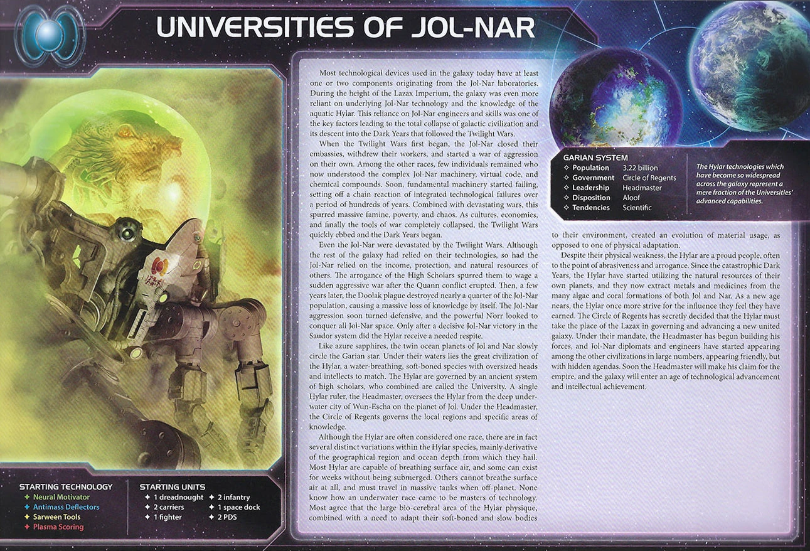

# Universities of Jol-Nar Guide

---

## I. Introduction

The Universities of Jol-Nar are TI4's ultimate technology faction. This faction excels at researching technologies faster than anyone through Brilliant (use Technology primary on secondary), bypassing prerequisites via Analytical, and leveraging 4 starting technologies for immediate tech advantage. Jol-Nar isn't about military dominance—it's about technological supremacy, using superior unit upgrades and faction techs to overcome the Fragile weakness (-1 to all combat rolls).

The payoff? Watching opponents realize you have 8+ technologies by R3 while they have 3-4, seeing your flagship roll 9s and 10s for triple hits, and using E-Res Siphons to gain 4 trade goods whenever opponents activate systems with your ships. When you've researched every key tech and fielded fully upgraded fleets, technological dominance translates to victory.

## II. Playstyle

Playing Jol-Nar is like being a fragile genius with overwhelming technological advantages. Your Brilliant ability lets you use Technology primary when taking the secondary (double tech per round easily), your Analytical ignores 1 prerequisite for non-unit techs (skip ahead in tech trees), and you start with 4 technologies (MASSIVE early advantage). You're not winning through combat prowess—you're winning through superior technology, economic efficiency, and unit upgrades that offset your Fragile weakness.

The key strength of Jol-Nar is technology acceleration. You research 8-10 technologies by R3-R4 (normal factions have 4-6). This unlocks powerful unit upgrades, economic technologies, and your Commander (Ta Zern at 8 techs = reroll all dice for unit abilities, offsetting Fragile).

Opponents will underestimate your military until they realize your -1 combat is offset by unit upgrades (+1 from Dreadnought II, Carrier II combat 9, etc.) and Commander rerolls. That moment when your "weak" fleet with 8 techs defeats their "strong" fleet with 3 techs? Pure technological supremacy.

---

## III. The Basics

### A. Home System & Commodities

**Home System:**
- **Jol:** 1 resource / 2 influence = 1 optimal resource / 2 optimal influence
- **Nar:** 2 resources / 3 influence = 2 optimal resources / 3 optimal influence
- **Total: 3 resources / 5 influence (3 optimal resources / 5 optimal influence)**

**Commodities:** 4

**Notes:** Influence-heavy home system with 5 influence total. Excellent for voting and political plays. The 3 resources are modest—you'll need to expand for production economy. Two-planet home system provides flexibility. Your 4 commodities make you an excellent trading partner.

### B. Starting Fleet

- 1 Dreadnought
- 2 Carriers
- 1 Fighter
- 2 Infantry
- 1 Space Dock
- 2 PDS

**Notes:** Strong defensive starting fleet. 1 dreadnought gives you combat power (though -1 combat makes it weaker). 2 carriers provide capacity 8 total. 2 PDS give you defensive SPACE CANNON coverage. Only 1 fighter and 2 infantry limit your expansion capability compared to other factions.

### C. Faction Abilities

**Fragile (Faction Ability):** Apply -1 to the result of each of your unit's combat rolls.

Your weakness. All your units roll at -1 for combat. Infantry hit on 9 instead of 8, fighters hit on 10 instead of 9, dreadnoughts hit on 6 instead of 5. This makes you weaker in combat than most factions.

**HOWEVER:** Plasma Scoring gives +1 vs non-fighters, offsetting this to net 0 against ships. You only suffer -1 against fighters and ground forces.

**Brilliant (Faction Ability):** When you spend a command token to resolve the secondary ability of the "Technology" strategy card, you may resolve the primary ability instead.

Your signature tech acceleration ability. When someone takes Technology and you use the secondary (normally research 1 tech for 1 CC + resources), you instead use the PRIMARY (research 1 tech, then may spend 6 resources for another tech). This lets you research 2 technologies in one round by taking Technology secondary.

**Strategic Implications:** You effectively have Technology primary every round someone takes it, even if you're not the holder. This doubles your tech output.

**Analytical (Faction Ability):** When you research a technology that is not a unit upgrade technology, you may ignore 1 prerequisite.

Skip ahead in tech trees. Want Gravity Drive (BB)? Ignore 1 blue prerequisite, only need 1 blue tech instead of 2. Want AI Development Algorithm (requires 4+ technologies)? Ignore the "4 techs" requirement. Excellent for accelerating to key technologies.

**Note:** Only works for NON-unit-upgrade techs. Can't skip prerequisites for Dreadnought II, Carrier II, etc.

### D. Starting and Faction Technologies

**Starting Technologies:**

1. **Neural Motivator** - You have +2 starting command counters
2. **Antimass Deflectors** - Ships move through asteroids; -1 to enemy SPACE CANNON
3. **Sarween Tools** - Reduce production costs by 1
4. **Plasma Scoring** - Ships +1 to combat rolls vs non-fighter ships

**Notes:** You start with MORE technologies than any faction (4 vs 1-2 for most). This is ABSURD. You have immediate advantages:
- +2 CCs from Neural Motivator (5 starting CCs instead of 3)
- Production efficiency from Sarween (save 1 resource per production)
- Combat bonus from Plasma Scoring (+1 vs non-fighters offsets your -1 Fragile = net 0)
- Mobility from Antimass Deflectors (move through asteroids)

You're ahead of everyone technologically from R1.

**Faction Technologies:**

**Spacial Conduit Cylinder (BB):**
*You may exhaust this card after you activate a system that contains 1 or more of your units; that system is adjacent to all other systems that contain 1 or more of your units during this activation.*

Movement tech. Exhaust after activating a system with your units to treat it as adjacent to ALL other systems with your units. This creates teleportation across the map - move from any system with your units to the activated system.

**E-Res Siphons (YY):**
*After another player activates a system that contains 1 or more of your ships, gain 4 trade goods.*

Economic engine tech. When opponents activate systems with your ships, gain 4 TGs. Spread fighters/destroyers across the map, and every opponent activation near you generates 4 TGs. Over a game, this produces 20-40 TGs.

### E. Leaders

**Agent - Doctor Sucaban:**

When a player spends resources to research: You may exhaust this card to allow that player to remove any number of their infantry from the game board. For each unit removed, reduce the resources spent by 1.

Interesting support agent. When any player researches tech, exhaust this to let them sacrifice infantry to reduce research costs (1 infantry = -1 resource cost). Use on yourself (sacrifice 2 infantry to research expensive tech cheaply) or trade to others for favors.

**Commander - Ta Zern:** *Unlock: Own 8 technologies.*

After you roll dice for a unit ability: You may reroll any of those dice.

Your power spike. Easy unlock (you'll have 8 techs by R3-R4). Once unlocked, reroll any dice for ANY unit ability (combat, SPACE CANNON, AFB, BOMBARDMENT, PRODUCTION). This MASSIVELY offsets Fragile—reroll all your combat misses, effectively negating the -1 penalty through sheer reroll value.

**Hero - Rin, the Master's Legacy:** *Unlock: Have 3 scored objectives.* **Genetic Memory** - ACTION: For each non-unit upgrade technology you own, you may replace that technology with any technology of the same color from the deck. Then, purge this card.

Flexible tech swap hero. For each non-unit tech you own (usually 6-8 by R4-R5), swap it for ANY tech of the same color. Use this to:
1. Swap situational techs for objective-scoring techs
2. Adapt to meta (swap combat techs for economic techs if no one is fighting)
3. Cherry-pick powerful techs you skipped

Example: You have 8 non-unit techs. Swap all 8 for the best 8 techs in the game (Fleet Logistics, Gravity Drive, Lightwave Deflector, Integrated Economy, Predictive Intelligence, etc.).

### F. Promissory Note - **Research Agreement**

After the Jol-Nar player researches a technology that is not a faction technology: Gain that technology. Then, return this card to the Jol-Nar player.

Powerful promissory. Holder copies your next non-faction tech research. Trade value: 4-6 TG or Alliance promissory. Excellent political leverage—"I'll give you Research Agreement if you vote my way" or trade for Support for the Throne.

**Strategic Use:** Research a powerful tech (Gravity Drive, Fleet Logistics, Carrier II), holder copies it for free.

### G. Alliance

When you produce ships, you may produce 1 additional fighter or infantry for its cost.

Standard production bonus. Useful for economic factions. Trade value: 3-4 TG or equivalent.

### H. Mech - **Shield Paling**

Cost: 2 | Combat: 6 | **Sustain Damage**

Your infantry on this planet are not affected by your Fragile faction ability.

Excellent mech. Infantry on this planet ignore Fragile (hit on 8 instead of 9). This makes your ground forces competitive. Place mechs on contested planets (Mecatol Rex, legendary planets) to enable infantry combat without -1 penalty.

### I. Flagship - **J.N.S. Hylarim**

Cost: 8 | Combat: 6 (x2) | Move: 1 | Capacity: 3 | **Sustain Damage**

When making a combat roll for this ship, each result of 9 or 10, before applying modifiers, produces 2 additional hits.

Explosive flagship. Rolls 2 dice at combat 6. With Fragile (-1) and Plasma Scoring (+1 vs non-fighters), net combat 6. Each natural 9 or 10 produces 3 TOTAL hits (1 normal + 2 additional). Expected output:
- 2 dice rolling 6+ (modified) = ~1 hit normally
- BUT natural 9-10 (20% chance per die) produces 3 hits = 0.4 extra hits per die
- Average: 1.8 hits per round (better than most flagships)

With Commander rerolls, this becomes even more deadly—reroll misses, fish for natural 9-10s.

### J. Breakthrough - **Specialized Compounds (Y<>G)**

When you research technology using the "Technology" strategy card, you may exhaust a planet that has a technology specialty instead of spending resources; if you do, you must research a technology of that color.

**Y<>G Synergy:** Yellow and green technologies count as each other for prerequisites.

**Ability:** When using Technology card (primary or Brilliant secondary), exhaust a tech specialty planet to research for FREE (0 resources). Must research a tech matching the planet's color. Incredible economic efficiency—research 2 techs per round for 0 resources.

**Y<>G synergy:** Sarween Tools and Neural Motivator count as each other's color. Very flexible tech progression.

**Strategic Value:** With 2-3 tech specialty planets, you can research 4-6 technologies for free over the game (save 12-24 resources).

### K. Slice and Draft Considerations

Jol-Nar wants tech specialty planets and defensive positioning:

**Speaker Order:**
- **Prefer positions 2-4** - Lets you grab Technology or Trade early.
- **Avoid last position** - You want access to Technology every round.

**Slice Priorities:**
- **Tech specialty planets (CRITICAL)** - Need 2-3 tech specialty planets for Analytical acceleration and Specialized Compounds efficiency.
- **Influence-heavy planets** - Your 5 influence home makes you natural politician. Stack influence.
- **Defensive positioning** - Fragile makes you vulnerable. Want corner/edge slices with fewer aggressive neighbors.
- **High planet count** - More planets = more resources for tech research.

**Slice Features to Avoid:**
- **Zero tech specialty planets** - Wastes Analytical and Specialized Compounds. UNPLAYABLE.
- **Aggressive neighbor-heavy slices** - Fragile makes you weak to early aggression.
- **Low planet count** - Need resources for tech research.

**Summary:**
Jol-Nar MUST have tech specialty planets (2-3 minimum). Your entire gameplan revolves around accelerated tech research. Without tech specialties, you lose massive economic efficiency.

---

## IV. Structural Weaknesses

### A. First Turn Priorities

**Round 1 Priority Rankings:**

1. **Technology** - Research 2 technologies R1 using Technology primary (Dreadnought II via Analytical, then Carrier II or PDS II for 6 resources). Your Brilliant ability lets you use Technology primary on secondary, accelerating you ahead of all opponents. This is your core strength.

2. **Expansion + Production** - Expand to 2-3 systems prioritizing tech specialty planets for Specialized Compounds efficiency. Limited to 2 infantry restricts ground invasions. Your 2 carriers (capacity 8 total) and dreadnought provide strong fleet presence despite limited expansion.

3. **Scoring** - Acceptable R1 if you can score tech objectives early (Diversify Research = 2 techs in each of 2 colors is easy with 4 starting techs). However, Technology primary is usually more valuable than Imperial R1.

4. **Breakthrough** - Not a priority R1. Focus on unit upgrades (Dreadnought II, Carrier II) and Commander unlock (8 techs by R3-R4) before pursuing breakthrough technologies.

**Expansion Notes:** You have 2 carriers (capacity 8), 1 dreadnought, 1 fighter, and 2 infantry. Limited ground forces (only 2 infantry) restrict your expansion to 2-3 systems R1. Your 2 PDS stay home for defense. Prioritize tech specialty planets during expansion.

### B. Fragile Weakness

-1 to all combat rolls makes you vulnerable to aggression. Without Plasma Scoring (+1 vs non-fighters), you'd be extremely weak militarily. Even with Plasma, you're at net 0 against ships and -1 against fighters/ground forces.

**Mitigation:** Research unit upgrades early (Dreadnought II, Carrier II offset Fragile). Unlock Commander R3-R4 (reroll dice to negate misses). Use mechs to remove Fragile from infantry. Build 2 PDS for defensive SPACE CANNON.

### C. Commander Unlock Requirement

Commander requires 8 technologies. With Brilliant + Analytical, this is easy (R3-R4 unlock), but you must prioritize tech research over military/economic expansion early.

**Mitigation:** Take Technology every possible opportunity R1-R3. Use Brilliant to double-tech per round. Research 8 techs by R3-R4 for Commander unlock.

### D. Low Resource Home System

Only 3 resources at home limits your production capacity. You need to expand to resource-heavy planets quickly for fleet production.

**Mitigation:** Expand to industrial planets R1-R2. Use Sarween Tools to stretch resources (save 1 per production). Trade your 4 commodities for resources.

---

## V. Technology

### A. Overview

You start with **4 technologies:** Neural Motivator (G), Antimass Deflectors (B), Sarween Tools (Y), Plasma Scoring (R).

Your main tech path should focus on unit upgrades (offset Fragile), Commander unlock (8 techs), and powerful economic/mobility technologies.

### B. Tech Path 1: Unit Upgrade Focus (Standard)

**Starting Techs:** Neural Motivator, Antimass Deflectors, Sarween Tools, Plasma Scoring (4 total)

**Round 1: Dreadnought II (BBY) - WITH ANALYTICAL**
- Cost 4 | Combat 5 | Move 2 | BOMBARDMENT 5 | Sustain Damage
- **Why:** Offset Fragile with superior unit. Dreadnought II at combat 5 - 1 (Fragile) + 1 (Plasma) = net combat 5 (same as normal Dreadnought II). Move 2 and Sustain make it excellent.
- **Prerequisites:** 2 blue + 1 yellow (with Analytical ignoring 1 prereq)

**Round 2: Carrier II (BB) AND PDS II (RY) - DOUBLE TECH WITH BRILLIANT**
- **Carrier II:** Cost 3 | Combat 9 | Move 2 | Capacity 6
  - **Why:** Combat 9 - 1 (Fragile) + 1 (Plasma) = net 9. Hits easily, massive capacity.
  - **Prerequisites:** 2 blue
- **PDS II:** Planetary Shield | SPACE CANNON 5 | Shoots adjacent systems
  - **Why:** Defensive upgrade. You start with 2 PDS; upgrade both.
  - **Prerequisites:** 1 red + 1 yellow (Plasma + Sarween)

**Round 3: Gravity Drive (B) AND AI Development Algorithm - DOUBLE TECH**
- **Gravity Drive:** +1 move to 1 ship per activation
  - **Prerequisites:** 1 blue
- **AI Development Algorithm:** Reduces tech costs by 1
  - **Prerequisites:** None (base tech)
  - **Why:** Now you have 8 TECHS → Commander unlocks!

**Round 4: Fleet Logistics (BB) AND Cruiser II (GYR) - DOUBLE TECH WITH COMMANDER**
- **Fleet Logistics:** Perform 2 actions per turn
- **Cruiser II:** Cost 2 | Combat 7 | Move 3 | CAPACITY 1

**Round 5+:** Flex techs (faction techs, economic techs, etc.)

**Tech Requirements:**
- **Blue skip (very helpful):** Accelerates Carrier II and Gravity Drive
- **Yellow skip (helpful):** Speeds Dreadnought II
- **Tech specialty planets (CRITICAL):** Use Specialized Compounds to research for free

**Pros:**
- Early unit upgrades (Dreadnought II R1, Carrier II + PDS II R2)
- Commander unlocks R3 (8 techs)
- Fully upgraded fleet by R4
- Superior combat through technology

**Cons:**
- Expensive tech research early (mitigated by Sarween + Specialized Compounds)

**Best For:** Most games. Unit upgrades offset Fragile, Commander unlocks early for rerolls.

---

### C. Tech Path 2: Economic/Faction Tech (Alternative)

**Starting Techs:** Neural Motivator, Antimass Deflectors, Sarween Tools, Plasma Scoring

**Round 1: Gravity Drive (BB) - WITH ANALYTICAL**
- Ignore 1 blue prerequisite (only need Antimass)

**Round 2: E-Res Siphons (YY) AND Spacial Conduit Cylinder (BB) - DOUBLE TECH**
- **E-Res Siphons:** After another player activates system with your ships, gain 4 TG
  - **Why:** Your faction tech. Massive economic engine. Place ships in high-traffic systems, gain 4 TG per activation.
- **Spacial Conduit Cylinder:** Exhaust after activating system with your units; that system is adjacent to ALL your systems
  - **Why:** Your other faction tech. Instant teleportation for fleet movement.

**Round 3-5:** Unit upgrades and Commander unlock

**Pros:**
- Both faction techs (E-Res Siphons = economic powerhouse)
- Early mobility (Gravity Drive R1)
- Economic focus

**Cons:**
- Delays unit upgrades (vulnerable to aggression)

**Best For:** Peaceful games with low aggression. Focus on economy and tech acceleration.

---

## VI. Strategy Cards

### A. Round 1

Your R1 priority is technology acceleration.

**Round 1 Priority Ranking:**

1. **Technology** - Research 2 techs R1 (primary + 6 resources for second). Begin tech acceleration immediately.

2. **Trade** - You have 4 commodities. Excellent trade economy.

3. **Leadership** - CCs for expansion (you already have +2 from Neural Motivator).

4. **Politics** - Speaker for political control (5 influence home).

5. **Construction** - Build structures for objectives.

6. **Warfare** - Less useful (you're weak militarily early).

7. **Diplomacy** - Protect home system.

8. **Imperial** - Never R1.

### B. Round 2+

**Love:**
- **Technology** - ALWAYS take if available. Brilliant lets you use primary on secondary = double tech per round.
- **Trade** - Refresh 4 commodities. Excellent economy.

**Good:**
- **Leadership** - CCs for expansion and production.
- **Imperial** - Needed for scoring R3-R5.
- **Politics** - Speaker and agenda control (5 influence home).

**Situational:**
- **Construction** - Only if needing structures.
- **Warfare** - Only if playing aggressively.
- **Diplomacy** - Defensive tool.

---

## VII. Intermediate

### A. Unit Composition

Your ideal fleet composition leverages unit upgrades to offset Fragile:

**Preferred Units:**
- **Dreadnought II** - Combat 5 (net 5 with Fragile + Plasma). BOMBARDMENT 5, Sustain Damage. Core fleet unit.
- **Carrier II** - Combat 9 (net 9 with Fragile + Plasma). Capacity 6. Excellent all-around.
- **Cruiser II** - Combat 7 (net 7 with Fragile + Plasma). Move 3, Capacity 1. Fast screening.
- **Flagship** - Natural 9-10 rolls produce 3 hits. Devastating with Commander rerolls.

**Production Strategy:**
R1-R2: Produce basic fleets using Sarween efficiency
R3-R4: Produce upgraded fleets using Dreadnought II and Carrier II
R5: Fully upgraded armada with Commander rerolls

### C. Game Plan

**Strategic Approach:**

**Rounds 1-2: Technology Acceleration & Expansion**
- Take Technology R1 (research 2 techs: Dreadnought II + Carrier II or PDS II)
- Expand to 3-4 systems, prioritizing tech specialty planets
- Trade your 4 commodities for resources
- Build defensive PDS network at home (2 PDS upgraded to PDS II)

**Rounds 3-4: Commander Unlock & Unit Upgrade Saturation**
- Research 8 total technologies by R3 (Commander unlocks)
- Commander (Ta Zern): Reroll any dice for unit abilities (offsets Fragile completely)
- Use Brilliant every round someone takes Technology (double tech per round)
- Fully upgrade fleet (Dreadnought II, Carrier II, Cruiser II)
- Use E-Res Siphons to gain 4 TG per enemy activation of your systems (economic powerhouse)

**Round 5: Hero Tech Swap & Domination**
- Hero R5: Swap 6-8 non-unit techs for optimal techs (Fleet Logistics, Lightwave Deflector, etc.)
- Commander rerolls make your fleet extremely powerful despite Fragile
- Score tech objectives (own 2 unit upgrades = EASY)
- Win through technological supremacy

**Key Strategic Principles:**
1. **Research constantly** - Take Technology R1, R3, R5 minimum. Use Brilliant for double tech.
2. **Unlock Commander R3** - 8 technologies for reroll ability (offsets Fragile).
3. **Use Analytical aggressively** - Ignore 1 prerequisite for non-unit techs (skip ahead).
4. **E-Res Siphons placement** - Place ships in high-traffic systems (gain 4 TG per activation).
5. **Unit upgrades early** - Dreadnought II and Carrier II offset Fragile through superior stats.
6. **Hero R5** - Swap 6-8 techs for optimal endgame technologies.
7. **Specialized Compounds** - Research for free using tech specialty planets (save 20+ resources).

---

## VIII. Objectives

### A. Objective Summary

**Strengths:** Jol-Nar dominates all tech objectives with research bonuses and 8-12 total technologies. Spending objectives are trivial with E-Res Siphons economy generating massive trade goods, and influence spending is easy with 5 home influence plus expansion.

**Weaknesses:** Combat and conquest objectives are very challenging due to Fragile penalty (-1 combat). Aggressive objectives contradict your defensive research-focused strategy, requiring significant military investment to compensate.

### B. Stage I Objectives

| Stage I Objective                                                       | Status |
|-------------------------------------------------------------------------|--------|
| Erect a Monument (Spend 8 resources)                                    | 🟡     |
| Sway the Council (Spend 8 influence)                                    | 🟢     |
| Negotiate Trade Routes (Spend 5 trade goods)                            | 🟢     |
| Lead from the Front (Spend 3 tokens from tactic/strategy pools)         | 🟢     |
| Diversify Research (Own 2 tech in each of 2 colors)                     | 🟢     |
| Develop Weaponry (Own 2 unit upgrade technologies)                      | 🟢     |
| Found Research Outposts (Control 3 planets with tech specialties)       | 🟢     |
| Intimidate the Council (Ships in 2 systems adjacent to MR)              | 🟢     |
| Expand Borders (Control 6 planets in non-home systems)                  | 🟡     |
| Corner the Market (Control 4 planets with same trait)                   | 🟡     |
| Amass Wealth (Spend 3 influence, 3 resources, 3 trade goods)            | 🟢     |
| Build Defenses (Have 4 or more structures)                              | 🟡     |
| Discover Lost Outposts (Control 2 planets with attachments)             | 🔴     |
| Engineer a Marvel (Have flagship or war sun on board)                   | 🟢     |
| Explore Deep Space (Units in 3 systems without planets)                 | 🟢     |
| Improve Infrastructure (Structures on 3 planets outside HS)             | 🟡     |
| Make History (Units in 2 systems with legendary/MR/anomalies)           | 🟢     |
| Populate the Outer Rim (Units in 3 edge systems)                        | 🟢     |
| Push Boundaries (Control more planets than each neighbor)               | 🟡     |
| Raise a Fleet (5+ non-fighter ships in 1 system)                        | 🟢     |

**Legend:** 🟢 Easy | 🟡 Moderate | 🔴 Difficult

Jol-Nar excels at tech objectives (Diversify Research, Develop Weaponry, Found Research Outposts), influence objectives (5 influence home), and trade objectives (4 commodities).

### C. Secret Objectives

| Secret Objective                                                         | Status |
|--------------------------------------------------------------------------|--------|
| Unveil Flagship (Win space combat with flagship)                         | 🟡     |
| Turn their Fleets to Dust (SPACE CANNON destroy last ship)              | 🟢     |
| Destroy their Greatest Ship (Destroy war sun/flagship)                   | 🔴     |
| Spark a Rebellion (Win combat vs VP leader)                              | 🟡     |
| Threaten Enemies (Ships adjacent to another player's HS)                | 🟢     |
| Make an Example (BOMBARDMENT destroy last ground forces)                | 🟡     |
| Cut Supply Lines (Ships in system with enemy space dock)                | 🟢     |
| Monopolize Production (Control 4 industrial planets)                     | 🟡     |
| Mine Rare Minerals (Control 4 hazardous planets)                        | 🟡     |
| Forge an Alliance (Control 4 cultural planets)                          | 🟡     |
| Become a Martyr (Lose control of planet in home system)                 | 🔴     |
| Betray a Friend (Win combat vs player whose PN you have)                | 🟡     |
| Brave the Void (Win combat in anomaly)                                  | 🟡     |
| Darken the Skies (Win combat in another player's HS)                    | 🔴     |
| Defy Space and Time (Units in wormhole nexus)                           | 🟡     |
| Demonstrate your Power (3+ non-fighter ships after space combat)        | 🟢     |
| Destroy Heretical Works (Purge 2 relic fragments)                       | 🔴     |
| Dictate Policy (3+ laws in play)                                        | 🟡     |
| Drive the Debate (You/your planet elected by agenda)                    | 🟢     |
| Establish Hegemony (Control planets with 12+ influence)                 | 🟢     |
| Adapt New Strategies (Own 2 faction technologies)                       | 🟢     |
| Master the Laws of Physics (Own 4 tech of same color)                   | 🟢     |
| Form a Spy Network (Discard 5 action cards)                             | 🟡     |
| Gather a Mighty Fleet (Have 5 dreadnoughts)                             | 🟡     |
| Establish a Perimeter (Have 4 PDS on board)                             | 🟢     |
| Fuel the War Machine (Have 3 space docks)                               | 🟡     |
| Become the Gatekeeper (Ships in alpha and beta wormhole systems)        | 🟡     |
| Learn Secrets of the Cosmos (Ships in 3 systems adjacent to anomalies)  | 🟢     |
| Control the Region (Ships in 6 systems)                                 | 🟢     |
| Occupy the Seat of the Empire (Control MR with 3+ ships)                | 🟢     |
| Fight With Precision (AFB destroy last fighter)                         | 🟡     |
| Foster Cohesion (Be neighbors with all players)                         | 🟡     |
| Hoard Raw Materials (Control planets with 12+ resources)                | 🟡     |
| Mechanize the Military (1 mech on each of 4 planets)                    | 🟢     |
| Occupy the Fringe (9+ ground forces on planet without space dock)       | 🟡     |
| Produce en Masse (Units with PRODUCTION 8+ in single system)            | 🟡     |
| Prove Endurance (Last to pass)                                          | 🔴     |
| Seize an Icon (Control legendary planet)                                | 🟢     |
| Stake Your Claim (Control planet in contested system)                   | 🟡     |
| Strengthen Bonds (Have another player's PN)                             | 🟢     |

**Notes:**
- **Adapt New Strategies (2 faction techs)** is EASY—E-Res Siphons + Spacial Conduit Cylinder
- **Master the Laws of Physics (4 techs of same color)** is EASY—you naturally research 8+ techs
- **Establish Hegemony (12+ influence)** is EASY with 5 influence home
- **Turn their Fleets to Dust (SPACE CANNON)** is EASY—you start with 2 PDS, upgrade to PDS II
- All tech secrets strongly favor Jol-Nar

### D. Stage II Objectives

| Stage II Objective                                                       | Status |
|--------------------------------------------------------------------------|--------|
| Centralize Galactic Trade (Spend 10 trade goods)                         | 🟢     |
| Found a Golden Age (Spend 16 resources)                                  | 🟡     |
| Galvanize the People (Spend 6 tokens from tactic/strategy pools)         | 🟢     |
| Manipulate Galactic Law (Spend 16 influence)                             | 🟢     |
| Hold Vast Reserves (Spend 6 influence, 6 resources, 6 trade goods)       | 🟢     |
| Command an Armada (Have 8+ non-fighter ships in 1 system)                | 🟡     |
| Achieve Supremacy (Flagship/War Sun in another player's HS or MR)        | 🔴     |
| Become a Legend (Units in 4 systems with legendary/MR/anomalies)         | 🟡     |
| Conquer the Weak (Control 1 planet in another player's HS)               | 🔴     |
| Rule Distant Lands (Control 2 planets in/adjacent to different players' HS) | 🔴     |
| Patrol Vast Territories (Units in 5 systems without planets)             | 🔴     |
| Control the Borderlands (Units in 5 edge systems not HS)                 | 🔴     |
| Subdue the Galaxy (Control 11 planets in non-home systems)               | 🔴     |
| Unify the Colonies (Control 6 planets with same trait)                   | 🔴     |
| Reclaim Ancient Monuments (Control 3 planets with attachments)           | 🔴     |
| Construct Massive Cities (Have 7+ structures)                            | 🔴     |
| Protect the Border (Structures on 5 planets outside HS)                  | 🔴     |
| Master of Sciences (Own 2 techs in each of 4 colors)                     | 🟢     |
| Revolutionize Warfare (Own 3 unit upgrade technologies)                  | 🟢     |

**Legend:** 🟢 Likely | 🟡 Possible | 🔴 Difficult

**Notes:**
- **Master of Sciences (2 techs in each of 4 colors)** is EASY—you research 8-12 techs total
- **Revolutionize Warfare (3 unit upgrades)** is EASY—you naturally research unit upgrades
- **Centralize Galactic Trade (10 TG)** is EASY—E-Res Siphons generates 4 TG per activation, plus 4 commodities
- **Manipulate Galactic Law (16 influence)** is EASY—5 influence home + expansion
- Jol-Nar struggles with conquest/aggression objectives due to Fragile

---

## IX. Alliance Priority

Trading for other factions' Alliance promissory notes (which give you access to their Commanders) can significantly boost your strategy. Here are the top alliances to prioritize:

**Super Top Tier:**
1. **Hacan (Carth of Golden Sands)** - After you roll dice for combat/SPACE CANNON/AFB, reroll any number. Stacks with Commander (Ta Zern) for double rerolls = massively offsets Fragile.
2. **Titans of Ul (Tungstantus)** - When you use PRODUCTION, gain 1 trade good. You produce constantly = constant TG income.
3. **Nomad (Navarch Feng)** - Produce flagship without spending resources. Saves 8 resources for tech research.
4. **Sardakk N'orr (G'hom Sek'kus)** - During Commit Ground Forces, commit 1 ground force from each planet. Helps offset weak infantry (Fragile).

**Really Useful:**
5. **Muaat (Magmus)** - After you spend strategy token, gain 1 trade good. CC usage = TG income.
6. **Empyrean (Xuange)** - After player moves ships into system with your tokens, return token. Useful for defensive plays.
7. **L1Z1X (Il Na Viroset)** - During tactical actions, activate systems with your tokens and return both tokens. Flexibility.
8. **Xxcha (Elder Qanoj)** - Each planet exhausted for votes gives +1 vote. Stacks with your 5 influence home for voting dominance.

---

## X. Bonus Game Elements

This section highlights action cards that synergize particularly well with your faction's strengths or mitigate your weaknesses, relics that offer exceptional value for your faction's strategy and abilities, and agendas to pursue that benefit your position, and agendas to watch out for that could hurt you.

### A. High-Value Action Cards

### B. Relic Priorities

### C. Agenda Awareness

---

## XI. End Notes

Universities of Jol-Nar are a top-tier technology faction with the fastest tech acceleration in the game. Your job is to:

1. **Research 8+ technologies by R3-R4** - Use Brilliant (double tech from Technology secondary) and Analytical (ignore prerequisites)
2. **Unlock Commander R3-R4** - 8 techs for Ta Zern (reroll any dice for unit abilities = offsets Fragile completely)
3. **Research unit upgrades early** - Dreadnought II R1, Carrier II R2 (superior stats offset Fragile)
4. **Use Specialized Compounds** - Research for free using tech specialty planets (save 20+ resources over game)
5. **E-Res Siphons placement** - Place ships in high-traffic systems to gain 4 TG per enemy activation
6. **Hero R5** - Swap 6-8 non-unit techs for optimal endgame technologies (Fleet Logistics, Lightwave Deflector, etc.)
7. **Fragile mitigation** - Plasma Scoring (+1 vs non-fighters) + unit upgrades + Commander rerolls = competitive combat

Don't let anyone tell you Fragile makes you weak. You offset it through technological supremacy—unit upgrades, Commander rerolls, and superior positioning. Research aggressively, unlock Commander early, and dominate through superior technology.

**KNOWLEDGE IS POWER. TECHNOLOGY IS VICTORY.**
