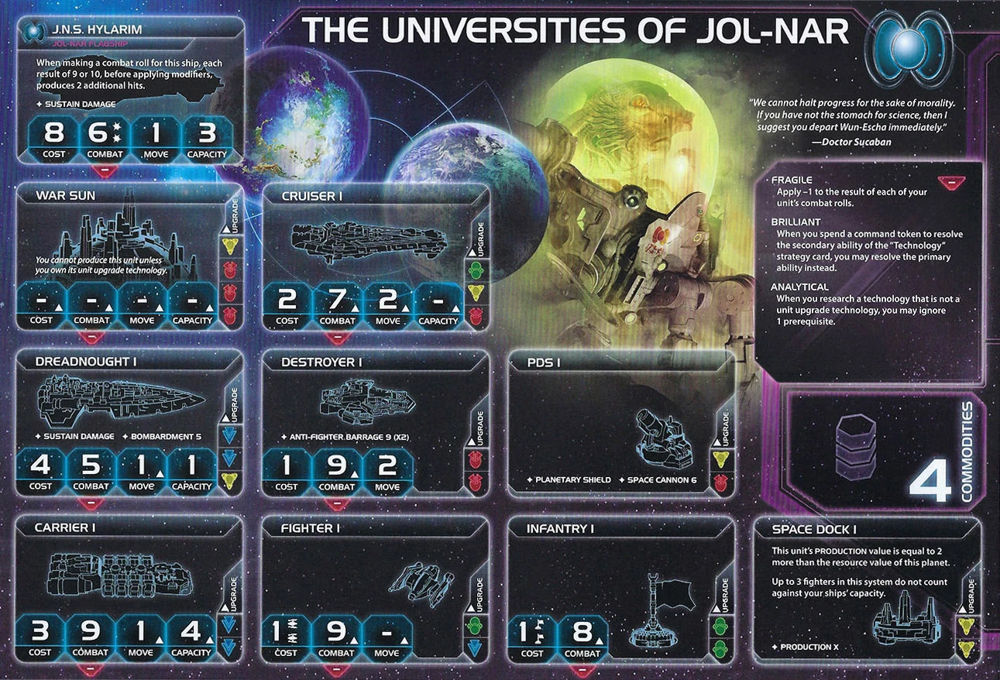

<nav class="page-nav">
<a href="../index.html" class="back-link">Back to Index</a>
<a href="Universities_of_Jol-Nar.md" download class="download-link" title="Plain text file - safe to download">Download .md</a>
</nav>

# Universities of Jol-Nar Guide

## Contents

1. [Introduction](#i-introduction)
2. [Playstyle](#ii-playstyle)
3. [Faction Info and Drafting](#iii-faction-info-and-drafting)
   - [Home System & Commodities](#a-home-system--commodities) · [Starting Fleet](#b-starting-fleet) · [Faction Abilities](#c-faction-abilities) · [Technologies](#d-starting-and-faction-technologies) · [Leaders](#e-leaders) · [Promissory Note](#f-promissory-note---research-agreement) · [Alliance](#g-alliance) · [Mech](#h-mech---shield-paling) · [Flagship](#i-flagship---jns-hylarim) · [Breakthrough](#j-breakthrough---specialized-compounds-yg) · [Slice and Draft](#k-slice-and-draft-considerations)
4. [Round 1 Problems and Faction Weakness](#iv-round-1-problems-and-faction-weakness)
   - [First Turn Priorities](#a-first-turn-priorities) · [Fragile Weakness](#b-fragile-weakness) · [Commander Unlock Requirement](#c-commander-unlock-requirement) · [Low Resource Home System](#d-low-resource-home-system)
5. [Technology](#v-technology)
   - [Overview](#a-overview) · [Starting Technologies](#b-starting-technologies) · [Technology Paths](#c-technology-paths)
6. [Strategy Cards](#vi-strategy-cards)
   - [Round 1](#a-round-1) · [Round 2+](#b-round-2)
7. [Unit Composition and Game Plan](#vii-unit-composition-and-game-plan)
   - [Unit Composition](#a-unit-composition) · [Game Plan](#b-game-plan)
8. [Objectives](#viii-objectives)
   - [Objective Summary](#a-objective-summary) · [Stage I](#b-stage-i-objectives) · [Secret Objectives](#c-secret-objectives) · [Stage II](#d-stage-ii-objectives)
9. [Alliance Priority](#ix-alliance-priority)
10. [Bonus Game Elements](#x-bonus-game-elements)
    - [Action Cards](#a-high-value-action-cards) · [Relics](#b-relic-priorities) · [Agendas](#c-agenda-awareness)
11. [End Notes](#xi-end-notes)

---

## I. Introduction

The Universities of Jol-Nar are TI4's technological elite—a faction for players who understand that knowledge is the ultimate currency. While other factions struggle to afford a single tech per round, you're researching two. While they debate which technology path to pursue, you have access to all of them. You're not competing in the tech race—you've already won it.

This faction is about being the most technologically advanced player at the table. Everyone wants what you're selling, and selling it costs you nothing. Your combat penalty makes others dismiss you—until your "weak" fleet defeats their "strong" one through superior upgrades. You don't conquer through brute force—you win through overwhelming technological supremacy.

## II. Playstyle

Playing Jol-Nar means operating as the galaxy's research institution. Everyone needs technology, and you're the one selling it. Your tech acceleration happens automatically—you research twice as fast as anyone else, and the entire tech tree is open to you from the start. This technological surplus translates into everything: better units, economic engines, and flexibility to adapt to whatever the game demands.

Your early game is about establishing tech supremacy while building income. You're the faction everyone wants to trade with, and those deals fund your research while costing you nothing. Your starting fleet is ship-rich but infantry-poor, so you're not the aggressive expander—you're the one building an unassailable technological lead while others fight over planets.

As the game progresses, your tech advantage becomes military power. Your units have better stats than anyone else's through upgrades. Your Commander turns every dice roll into a second chance. Your slice fills with PDS that punish anyone who activates near you. Opponents who dismissed you as "fragile" discover that superior technology beats raw numbers.

Your endgame is about having options nobody else has. You've researched everything that matters while others are still catching up. Your hero lets you swap your entire tech portfolio for whatever you need to close out the game. You're not the aggressive conqueror—you're the technological superpower that wins through overwhelming advantage.

---

## III. Faction Info and Drafting

### A. Home System & Commodities

**Home System:**

- **Jol:** 1 resource / 2 influence = 0 optimal resources / 2 optimal influence
- **Nar:** 2 resources / 3 influence = 0 optimal resources / 3 optimal influence
- **Total: 3 resources / 5 influence (0 optimal resources / 5 optimal influence)**

**Commodities:** 4

**Notes:** Influence-heavy home system with 5 influence total—one of the best in the game. This gives you basically two free command counters each round from Leadership secondary, leading to healthy command counter supply all game. The 3 resources are modest—you'll need to expand for production economy. Two-planet home system is slightly worse for defense (two PDS can cover both, but splitting infantry is a concern).

Your 4 commodities complete the economic picture. Between E-Res Siphons and Research Agreement income, you'd be rich with zero commodities. Four is just gravy.

### B. Starting Fleet

- 1 Dreadnought
- 2 Carriers
- 1 Fighter
- 2 Infantry
- 1 Space Dock
- 2 PDS

**Notes:** Great ships—literally the best possible ships outside of two war suns. 1 dreadnought + 2 carriers = 9 total capacity and strong presence. 2 PDS + Plasma Scoring = 3 SPACE CANNON shots from the get-go.

**Your Achilles heel is the 2 infantry.** You have 9 capacity but only 3 things to put inside it (1 fighter, 2 infantry). You don't have enough infantry to take planets round one.

### C. Faction Abilities

**Fragile (Faction Ability):** Apply -1 to the result of each of your unit's combat rolls.

Your weakness. Infamous. All your units roll at -1 for combat. Infantry hit on 9 instead of 8, fighters hit on 10 instead of 9, dreadnoughts hit on 6 instead of 5.

**In space:** Not the biggest deal. You can get around it with HP (sustain damage ships), unit upgrades (better base stats), and Commander rerolls. Space combat has lots of mitigation options.

**On the ground:** That's bad. Really bad. -1 on the ground is where those numbers really matter. Jol-Nar has to play the numbers game—you need more stuff on the ground than your opponent. Your mech helps (removes Fragile from infantry on that planet), but ground combat is your weakness.

**Brilliant (Faction Ability):** When you spend a command token to resolve the secondary ability of the "Technology" strategy card, you may resolve the primary ability instead.

You effectively have Technology primary every round someone takes it. Research 2 techs per round easily.

**Analytical (Faction Ability):** When you research a technology that is not a unit upgrade technology, you may ignore 1 prerequisite.

You start with 4 techs, one of each color. Combined with Analytical skipping a prereq, you have access to the entire tech tree. Get whatever you want, whenever you want it.

**Note:** Only works for non-unit-upgrade techs, but you already qualify for most unit upgrades anyway.

### D. Starting and Faction Technologies

**Starting Technologies:**

1. **Neural Motivator (G)** - During the status phase, draw 2 action cards instead of 1
2. **Antimass Deflectors (B)** - Ships move through asteroids; -1 to enemy SPACE CANNON rolls
3. **Sarween Tools (Y)** - Reduce production costs by 1
4. **Plasma Scoring (R)** - When using BOMBARDMENT or SPACE CANNON, 1 unit may roll 1 additional die

**Notes:** You start with MORE technologies than any faction (4 vs 1-2 for most). It's all the level zero tech from base game—16 resources worth of free research. Completely ridiculous start.

- **Neural Motivator + Sarween Tools:** Two techs you love to just start with. Everyone wants these.
- **Antimass Deflectors:** A tech you love to have and not have to research. Flexible pathing.
- **Plasma Scoring + 2 PDS:** Nobody else starts with 2 PDS. You have 3 SPACE CANNON shots immediately.

You're ahead of everyone technologically from R1, and it only accelerates from there.

**Faction Technologies:**

**E-Res Siphons (YY):**
*After another player activates a system that contains 1 or more of your ships, gain 4 trade goods.*

Certifiably filthy. This component is disgusting. 4 TG every time someone activates a system with your ships. You can research this round one with Analytical (ignore 1 yellow prereq).

It's important to gum (leave ships everywhere) as Jol-Nar—not just to protect your home, but because 4 TG is a lot of money. It's a deterrent against lazy attacks. People don't just pick off your stuff in the mid-game for nothing when it costs them 4 TG to you. In the end game, it doesn't protect you (if they need your home, they're coming), but you might have enough money to build defenses while they're on the way.

**Spacial Conduit Cylinder (BB):**
*You may exhaust this card after you activate a system that contains 1 or more of your units; that system is adjacent to all other systems that contain 1 or more of your units during this activation.*

Defensive in nature. Exhaust after activating a system with your units to treat it as adjacent to ALL other systems with your units. Incredible for defending Mecatol Rex or defending home—just send everything back. For a faction that often just needs to hold on to one or two things in the late game, it has its uses.

But it's not some critical component. It's a "we have bonus tech and I can splurge" tech. Rarely the linchpin of your strategy.

### E. Leaders

**Agent - Doctor Sucaban:**

When a player spends resources to research: You may exhaust this card to allow that player to remove any number of their infantry from the game board. For each unit removed, reduce the resources spent by 1.

Mostly used round one. Try to sell it after early game.

**Why not use it yourself?** Infantry cost more than their 0.5 resource price tag. When you activate and produce 4 infantry, you're spending a command token plus 2 resources. Each infantry really costs ~0.75 in token value plus 0.5 resources. Trading that for 1 resource discount on tech usually isn't worth it.

**Commander - Ta Zern:** *Unlock: Own 8 technologies.*

After you roll dice for a unit ability: You may reroll any of those dice.

Your power spike. You started with 4 techs. Research 2 per round, unlock this R2 in a good game, R3 normally. Once unlocked, let's walk down unit ability lane:

- **BOMBARDMENT:** All your dreadnoughts can reroll. Clear planets efficiently.
- **Anti-Fighter Barrage:** Destroyers become excellent fighter killers with rerolls. Get Destroyer II and you're on easy street.
- **SPACE CANNON:** This is the big one. You started with 2 PDS + Plasma Scoring = 3 shots. With rerolls, half your dice effectively become coin flips that you try twice. 5 shots with rerolls is nothing to scoff at.

PDS II becomes a real strategy for Jol-Nar—fill your slice with PDS because it's a considerable amount of heat opponents have to take to invade. Add Graviton Laser System late and your slice becomes a fortress.

**Hero - Rin, the Master's Legacy:** *Unlock: Have 3 scored objectives.* **Genetic Memory** - ACTION: For each non-unit upgrade technology you own, you may replace that technology with any technology of the same color from the deck. Then, purge this card.

Swap your non-unit techs for whatever you need. Hero typically fires R4-R5.

**Swap targets by color:**

**Blue:**

- Likely to have teched: **Antimass Deflectors** (starting), Gravity Drive (B), **Dark Energy Tap**
- Hero targets: **Fleet Logistics** (BB), **Light/Wave Deflector** (BBB), Sling Relay (B)

**Green:**

- Likely to have teched: Neural Motivator (starting), Hyper Metabolism (GG)
- Hero targets: Bio-Stims (G), X-89 Bacterial Weapon Ω (GGG)

**Yellow:**

- Likely to have teched: **Sarween Tools** (starting), **Scanlink Drone Network**
- Hero targets: **E-Res Siphons** (YY) (faction), **Graviton Laser System** (Y), Predictive Intelligence (Y), Transit Diodes (YY), Integrated Economy (YYY)

**Red:**

- Likely to have teched: Plasma Scoring (starting), Self-Assembly Routines (R)
- Hero targets: Magen Defense Grid (R), Duranium Armor (RR), Assault Cannon (RRR)

### F. Promissory Note - **Research Agreement**

After the Jol-Nar player researches a technology that is not a faction technology: Gain that technology. Then, return this card to the Jol-Nar player.

One of the best promissory notes in the entire game. Contrary to most promissory notes, **this costs Jol-Nar absolutely nothing**—you were researching tech anyway, the holder just gets a copy. Worth 3-4 TG per sale.

You can sell Research Agreement twice per round. Sell to a non-tech holder before Technology is played, then sell to the tech holder during their turn. Same works if you have Technology (which you don't prefer taking).

### G. Alliance

**Alliance Ability:**
*While the Jol-Nar player's commander is unlocked:*
*After you roll dice for a unit ability: You may reroll any of those dice.*

Excellent for factions with strong unit abilities—SPACE CANNON, BOMBARDMENT, Anti-Fighter Barrage all benefit from rerolls.

### H. Mech - **Shield Paling**

Cost: 2 | Combat: 6 | **Sustain Damage**

Your infantry on this planet are not affected by your Fragile faction ability.

Excellent mech that basically fixes your ground game problem. Your infantry on this planet hit on 8s instead of 9s—putting you on par with everybody else. **Note:** The mech itself is still affected by Fragile, hitting on 7 instead of 6.

**Spread, don't stack:** Unlike other factions who stack 2-3 mechs together for massive damage with sustains absorbing hits, your mechs don't synergize that way. A single mech added to an infantry stack provides minimal additional firepower (one combat 7 roll). Instead, spread your mechs across multiple planets—each one fixes an entire infantry stack's ground combat. One mech per contested planet is more valuable than three mechs in one place.

### I. Flagship - **J.N.S. Hylarim**

Cost: 8 | Combat: 6 (x2) | Move: 1 | Capacity: 3 | **Sustain Damage**

When making a combat roll for this ship, each result of 9 or 10, before applying modifiers, produces 2 additional hits.

Explosive flagship. Rolls 2 dice at combat 6, but with Fragile you hit on 7+. Each natural 9 or 10 produces 3 TOTAL hits (1 normal + 2 additional).

**Average hits comparison:**

- Jol-Nar flagship (7+, 9-10 = 3 hits): 0.8 avg hits per die × 2 = **1.6 avg hits**
- Standard flagship (5, x2): 0.6 avg hits per die × 2 = **1.2 avg hits**

Despite Fragile, your flagship is 33% better on average.

### J. Breakthrough - **Specialized Compounds (Y↔G)**

When you research technology using the "Technology" strategy card, you may exhaust a planet that has a technology specialty instead of spending resources; if you do, you must research a technology of that color.

**Y↔G Synergy:** Yellow and green technologies count as each other for prerequisites. 100% useless for you—Analytical already handles prerequisites.

**Ability:** Exhaust a tech specialty planet to research instead of spending resources. Must research a tech matching the planet's color. Not actually "free"—you lose the planet's resource/influence value that round. Average tech skip planet is ~2 value, so you're saving maybe 4-6 resources total over a game (2-3 uses). Minor value—only get this breakthrough if it unlocks Thunder's Edge.

### K. Slice and Draft Considerations

Jol-Nar wants tech specialty planets and defensive positioning:

**Speaker Order:**

- No special preference. You get tech acceleration regardless of position through Brilliant.
- Rich, friendly neighbors who can afford Research Agreement help a lot. Your economy thrives on tech sales.

**Slice Priorities:**

- **Resource-heavy planets** - You need resources for tech and production. Your 5 influence home already covers command tokens.
- **Planets in mid-slice** - Place PDS on planets in the middle of your slice for security. Covers multiple approach angles.
- **High planet count** - More planets = more resources for tech research.

**Nice to Have:**

- **Tech specialty planets** - Tech skips let Analytical work without exhausting.
- **Primor / Hope's End** - Infantry help your early expansion (you only start with 2).
- **Industrex** - Easy War Sun with your tech advantage.

**Slice Features to Avoid:**

- **Empty mid-slice** - No planets in the middle means nowhere to place PDS for defense.
- **Low resource slices** - You need resources for tech and production.

**Summary:**
Resources and mid-slice planets for PDS are your priorities. Tech skips are nice to have but not critical—your acceleration comes from Brilliant and Analytical.

---

## IV. Round 1 Problems and Faction Weakness

### A. First Turn Priorities

**Round 1 Priority Rankings:**

1. **Technology** - You research 2 techs when others get 1. Every round without Technology slows your Commander unlock (8 techs), delays E-Res Siphons income, and wastes Brilliant. Mobility and economy techs like Hyper Metabolism and Gravity Drive are great to research—and great to sell via Research Agreement.

2. **Expansion + Production** - Expand to 2-3 systems. Limited to 2 infantry restricts how many planets you can take. Your 2 carriers have great capacity (8 total) but you need to fill them with something—produce infantry early.

3. **Scoring** - Acceptable R1 but makes you more of a target early.

4. **Breakthrough** - Does nothing R1. You won't have any readied tech skip planets, and would need extremely lucky timing on when Technology gets played.

**Expansion Notes:** You have 2 carriers (capacity 8), 1 dreadnought, 1 fighter, and 2 infantry. Limited ground forces (only 2 infantry) restrict your expansion to 2-3 systems R1.

### B. Fragile Weakness

-1 to all combat rolls makes you vulnerable to aggression. All your units are weaker in straight combat. Fighters hit on 10s, infantry on 9s, and even dreadnoughts hit on 6s instead of 5s. Ground combat is where Fragile hurts most—you need more bodies than your opponent, or a mech to remove Fragile from your infantry.

**Mitigation:** Lean into unit abilities instead of raw combat. Destroyer II with Anti-Fighter Barrage and your PDS network with Commander rerolls let you deal damage before combat even starts.

### C. Rich but Weak

You're a rich faction with a lot of tech—4 commodities, Research Agreement sales, and E-Res Siphons generate constant income. But you're weak in combat due to Fragile, making you an easy target early. Use your money to build more units, buy favors, and avoid fights you can't win. With tough neighbors, prioritize early E-Res Siphons and PDS II to mitigate.

---

## V. Technology

### A. Overview

You start with **4 technologies:** Neural Motivator, Antimass Deflectors, Sarween Tools, Plasma Scoring—one base tech in each color. More starting tech than any other faction.

Be flexible to your needs—you have almost all options available at all times. Adapt your tech choices to objectives, neighbors, and game state.

### B. Starting Technologies

**Neural Motivator (G):** During the status phase, draw 2 action cards instead of 1. Extra cards mean more options and potential Sabotages.

**Antimass Deflectors (B):** Move through asteroid fields. -1 to SPACE CANNON rolls against your units. Enables flexible pathing and reduces enemy PDS effectiveness.

**Sarween Tools (Y):** Reduce the combined cost of produced units by 1 when using PRODUCTION. Saves resources every time you build—adds up significantly over a game.

**Plasma Scoring (R):** When using BOMBARDMENT or SPACE CANNON, 1 unit may roll 1 additional die. Synergizes with your 2 starting PDS for 3 shots instead of 2.

### C. Greedy Economy Path

**Starting:** Neural Motivator, Antimass Deflectors, Sarween Tools, Plasma Scoring

With Brilliant, you research 2 techs per round when following Technology.

**R1:** Gravity Drive (B), Hyper Metabolism (GG)
- Gravity Drive: +1 move to 1 ship per activation.
- Hyper Metabolism: 3 command tokens instead of 2 in status phase.

**R2:** Dark Energy Tap, Self-Assembly Routines (R)
- Dark Energy Tap: Explore frontiers, retreat into empty systems.
- Self-Assembly Routines: Free mech on production, 1 TG when mech dies.
- **Commander unlocks.**

**R3:** Destroyer II (RR), PDS II (RY)
- Destroyer II: Cost 1, Combat 8, Move 2, AFB 6 (x3).
- PDS II: SPACE CANNON 5, shoots adjacent systems.
- Unit abilities with Commander rerolls.

**R4:** Dreadnought II (BBY), Sling Relay (B)
- Dreadnought II: Cost 4, Combat 5, Move 2, Capacity 1, Sustain, BOMBARDMENT 5. Immune to Direct Hit.
- Sling Relay: Produce 1 ship at any space dock.
- **Hero swap available**—see Hero section for swap targets.

**Notes:**

- Analytical skips 1 prereq on non-unit techs only
- Adapt based on objectives and neighbors—PDS II earlier if aggressive neighbors, E-Res earlier if you need income
- Unit upgrades require meeting full prereqs (no Analytical help)

---

## VI. Strategy Cards

### A. Round 1

Your R1 priority is economy and expansion while letting others take Technology for you.

**Round 1 Priority Ranking:**

1. **Trade** - You have 4 commodities. Excellent trade economy.

2. **Leadership** - CCs for expansion and secondaries.

3. **Construction** - Solves ground force issues. Solid choice to increase production capacity.

4. **Warfare** - Poor man's Construction for you.

5. **Diplomacy** - If objective requires it.

6. **Politics** - Only for setting up R2.

7. **Technology** - You get primary via Brilliant anyway. Only pick if no one has taken it and you're last to pick.

8. **Imperial** - Never R1.

**Strategy Token Priority:** Warfare and Technology. Bonus Diplomacy and Construction if token rich.

### B. Round 2+

**Love:**

- **Trade** - Refresh 4 commodities. Excellent economy.
- **Imperial** - Needed for scoring R3-R5.

**Like:**

- **Leadership** - CCs for expansion and production.
- **Construction** - You love PDS and production capacity.
- **Politics** - Speaker and agenda control (5 influence home).

**Situational:**

- **Warfare** - Only if playing aggressively.
- **Diplomacy** - Defensive tool.
- **Technology** - Only pick if no one took it and you're picking last.

---

## VII. Unit Composition and Game Plan

### A. Unit Composition

Your ideal fleet composition in each system:

- **Dreadnoughts** - Sustain Damage absorbs hits, offsetting Fragile. BOMBARDMENT 5 with Commander rerolls clears planets. Your starting dreadnought is your best R1 ship.
- **Carriers** - Capacity for ground forces. Great transport but need to fill them.
- **Fighters** - Cheap HP to absorb hits. Hit on 10s with Fragile but that's not the point—they die so your real ships don't.
- **PDS II** - SPACE CANNON 5, shoots adjacent systems. With Commander rerolls, your PDS network deals damage before combat. Spread across your slice.
- **Destroyer II** - Cost 1, Combat 8, Move 2, AFB 6 (x3). Cheap screening with devastating AFB against fighter fleets.
- **Infantry** - Produce early and often. You start with only 2 infantry but 9 capacity. Fill your carriers.
- **Mechs** - Spread across planets, one per contested planet. Removes Fragile from infantry on that planet.
- **Flagship** - Explosive damage. Natural 9-10 rolls produce 3 total hits. 1.6 avg hits vs 1.2 for standard flagships.

**Fleet Priority:** Offset Fragile with sustain ships and unit abilities. Dreadnoughts absorb hits, PDS II and Destroyer II deal damage before combat rolls. Commander rerolls make SPACE CANNON, AFB, and BOMBARDMENT reliable.

**Ground Combat:** Your weakness. Need more bodies than your opponent. Spread mechs to fix infantry—one mech per contested planet is better than stacking.

### B. Game Plan

**Early Game (R1-R2):** Expand to 2-3 systems with limited infantry. Produce ground forces to fill carrier capacity. Let others take Technology—Brilliant gives you primary anyway. Research Gravity Drive and Hyper Metabolism for economy. Trade commodities and sell Research Agreement for income. Start building toward Commander unlock (8 techs).

**Mid Game (R3-R4):** Commander unlocks at 8 techs—now unit abilities become reliable with rerolls. Build PDS network across your slice. Research Destroyer II and PDS II. E-Res Siphons generates income when opponents activate your systems. Gum the map—leave ships in systems to trigger E-Res. Spread mechs to contested planets.

**Late Game (R5+):** Hero swaps your tech portfolio for whatever you need to close. Fleet Logistics for double actions, Light/Wave Deflector for mobility, X-89 for ground clearing. Your PDS network and Commander rerolls make your slice painful to invade. Win through technological supremacy, not aggressive conquest.

**Research Agreement Economy:**

Your promissory note costs you nothing—you were researching anyway. Sell it for 3-4 TG per use. Sell twice per round: once before Technology is played (to non-holder), once during (to holder). Rich neighbors who can afford your tech make the best trading partners.

---

## VIII. Objectives

### A. Objective Summary

**Strengths:** Jol-Nar dominates all tech objectives with research bonuses and 8-12 total technologies. Spending objectives are trivial with E-Res Siphons economy generating massive trade goods, and influence spending is easy with 5 home influence plus expansion.

**Weaknesses:** Combat and conquest objectives are very challenging due to Fragile penalty (-1 combat). Aggressive objectives contradict your defensive research-focused strategy, requiring significant military investment to compensate.

### B. Stage I Objectives

| Stage I Objective                                                       | Status |
|-------------------------------------------------------------------------|--------|
| **Spendies**                                                            |        |
| Erect a Monument (Spend 8 resources)                                    | 🟢     |
| Sway the Council (Spend 8 influence)                                    | 🟢     |
| Negotiate Trade Routes (Spend 5 trade goods)                            | 🟢     |
| Lead from the Front (Spend 3 tokens from tactic/strategy pools)         | 🟢     |
| Amass Wealth (Spend 3 influence, 3 resources, 3 trade goods)            | 🟢     |
| **Control**                                                             |        |
| Expand Borders (Control 6 planets in non-home systems)                  | 🟡     |
| Corner the Market (Control 4 planets with same trait)                   | 🔴     |
| Found Research Outposts (Control 3 planets with tech specialties)       | 🔴     |
| Discover Lost Outposts (Control 2 planets with attachments)             | 🔴     |
| Push Boundaries (Control more planets than each neighbor)               | 🟡     |
| **Ships in Systems**                                                    |        |
| Intimidate the Council (Ships in 2 systems adjacent to MR)              | 🟢     |
| Explore Deep Space (Units in 3 systems without planets)                 | 🟢     |
| Make History (Units in 2 systems with legendary/MR/anomalies)           | 🟢     |
| Populate the Outer Rim (Units in 3 edge systems)                        | 🟢     |
| Raise a Fleet (5+ non-fighter ships in 1 system)                        | 🟢     |
| Engineer a Marvel (Have flagship or war sun on board)                   | 🟢     |
| **Tech**                                                                |        |
| Diversify Research (Own 2 tech in each of 2 colors)                     | 🟢     |
| Develop Weaponry (Own 2 unit upgrade technologies)                      | 🟢     |
| **Structure**                                                           |        |
| Build Defenses (Have 4 or more structures)                              | 🟢     |
| Improve Infrastructure (Structures on 3 planets outside HS)             | 🟢     |

**Legend:** 🟢 Likely | 🟡 Possible | 🔴 Difficult

### C. Secret Objectives

| Secret Objective                                                         | Status |
|--------------------------------------------------------------------------|--------|
| **Combat**                                                               |        |
| Unveil Flagship (Win space combat with flagship)                         | 🟢     |
| Destroy their Greatest Ship (Destroy war sun/flagship)                   | 🔴     |
| Spark a Rebellion (Win combat vs VP leader)                              | 🟢     |
| Betray a Friend (Win combat vs player whose PN you have)                 | 🟢     |
| Brave the Void (Win combat in anomaly)                                   | 🟢     |
| Darken the Skies (Win combat in another player's HS)                     | 🔴     |
| Demonstrate your Power (3+ non-fighter ships after space combat)         | 🟢     |
| Turn their Fleets to Dust (SPACE CANNON destroy last ship)               | 🟢     |
| Make an Example (BOMBARDMENT destroy last ground forces)                 | 🟢     |
| Fight With Precision (AFB destroy last fighter)                          | 🟢     |
| **Ships in Systems**                                                     |        |
| Threaten Enemies (Ships adjacent to another player's HS)                 | 🟢     |
| Cut Supply Lines (Ships in system with enemy space dock)                 | 🟢     |
| Defy Space and Time (Units in wormhole nexus)                            | 🟡     |
| Become the Gatekeeper (Ships in alpha and beta wormhole systems)         | 🟢     |
| Learn Secrets of the Cosmos (Ships in 3 systems adjacent to anomalies)   | 🟢     |
| Control the Region (Ships in 6 systems)                                  | 🟢     |
| Occupy the Seat of the Empire (Control MR with 3+ ships)                 | 🟡     |
| **Control**                                                              |        |
| Monopolize Production (Control 4 industrial planets)                     | 🔴     |
| Mine Rare Minerals (Control 4 hazardous planets)                         | 🔴     |
| Forge an Alliance (Control 4 cultural planets)                           | 🔴     |
| Establish Hegemony (Control planets with 12+ influence)                  | 🟢     |
| Hoard Raw Materials (Control planets with 12+ resources)                 | 🟢     |
| Seize an Icon (Control legendary planet)                                 | 🟢     |
| Stake Your Claim (Control planet in contested system)                    | 🟡     |
| Become a Martyr (Lose control of planet in home system)                  | 🟡     |
| **Tech**                                                                 |        |
| Adapt New Strategies (Own 2 faction technologies)                        | 🟢     |
| Master the Laws of Physics (Own 4 tech of same color)                    | 🟢     |
| **Structure/Units**                                                      |        |
| Establish a Perimeter (Have 4 PDS on board)                              | 🟢     |
| Fuel the War Machine (Have 3 space docks)                                | 🟢     |
| Gather a Mighty Fleet (Have 5 dreadnoughts)                              | 🟢     |
| Mechanize the Military (1 mech on each of 4 planets)                     | 🟢     |
| Occupy the Fringe (9+ ground forces on planet without space dock)        | 🔴     |
| Produce en Masse (Units with PRODUCTION 8+ in single system)             | 🔴     |
| **Other**                                                                |        |
| Dictate Policy (3+ laws in play)                                         | 🔴     |
| Drive the Debate (You/your planet elected by agenda)                     | 🔴     |
| Destroy Heretical Works (Purge 2 relic fragments)                        | 🔴     |
| Form a Spy Network (Discard 5 action cards)                              | 🟢     |
| Foster Cohesion (Be neighbors with all players)                          | 🟢     |
| Strengthen Bonds (Have another player's PN)                              | 🟢     |
| Prove Endurance (Last to pass)                                           | 🟢     |

**Legend:** 🟢 Likely | 🟡 Possible | 🔴 Difficult

### D. Stage II Objectives

| Stage II Objective                                                       | Status |
|--------------------------------------------------------------------------|--------|
| **Spendies**                                                             |        |
| Centralize Galactic Trade (Spend 10 trade goods)                         | 🟢     |
| Found a Golden Age (Spend 16 resources)                                  | 🟢     |
| Galvanize the People (Spend 6 tokens from tactic/strategy pools)         | 🟢     |
| Manipulate Galactic Law (Spend 16 influence)                             | 🟢     |
| Hold Vast Reserves (Spend 6 influence, 6 resources, 6 trade goods)       | 🟢     |
| **Control**                                                              |        |
| Conquer the Weak (Control 1 planet in another player's HS)               | 🔴     |
| Rule Distant Lands (Control 2 planets in/adjacent to different players' HS) | 🔴  |
| Subdue the Galaxy (Control 11 planets in non-home systems)               | 🔴     |
| Unify the Colonies (Control 6 planets with same trait)                   | 🔴     |
| Reclaim Ancient Monuments (Control 3 planets with attachments)           | 🔴     |
| Form Galactic Brain Trust (Control 5 planets with tech specialties)      | 🔴     |
| **Ships in Systems**                                                     |        |
| Command an Armada (Have 8+ non-fighter ships in 1 system)                | 🟢     |
| Achieve Supremacy (Flagship/War Sun in another player's HS or MR)        | 🔴     |
| Become a Legend (Units in 4 systems with legendary/MR/anomalies)         | 🟡     |
| Patrol Vast Territories (Units in 5 systems without planets)             | 🟡     |
| Control the Borderlands (Units in 5 edge systems not HS)                 | 🟡     |
| **Tech**                                                                 |        |
| Master of Sciences (Own 2 techs in each of 4 colors)                     | 🟢     |
| Revolutionize Warfare (Own 3 unit upgrade technologies)                  | 🟢     |
| **Structure**                                                            |        |
| Construct Massive Cities (Have 7+ structures)                            | 🟡     |
| Protect the Border (Structures on 5 planets outside HS)                  | 🔴     |

**Legend:** 🟢 Likely | 🟡 Possible | 🔴 Difficult

---

## IX. Alliance Priority

**Top Tier:**

1. **Nekro Virus (Nekro Acidos)** - After you gain tech, draw 1 action card. You research constantly—this generates massive action card flow.

2. **Crimson Rebellion (Ahk Siever)** - At end of combat, gain commodity/TG. Combat-focused income.

3. **Deepwrought (Aello)** - When others research tech with -1 discount, gain commodity/TG. Passive income in tech-heavy games.

4. **Muaat (Magmus)** - After you spend strategy token, gain 1 TG. You use lots of secondaries = passive income.

5. **Nomad (Navarch Feng)** - Produce flagship without spending resources. Saves 8 resources for tech research.

**Good:**

6. **Vuil'raith Cabal (That Which Molds Flesh)** - Up to 2 fighters/infantry don't count against PRODUCTION limit. Extra production capacity.

7. **Empyrean (Xuange)** - After player moves ships into system with your tokens, return token. Late game slaying tool.

8. **Argent Flight (Trrakan Aun Zulok)** - Roll 1 additional die for unit abilities. Extra die for SPACE CANNON synergizes with your PDS.

9. **Winnu (Rickar Rickani)** - Apply +2 combat in MR, home system, legendary planets. Helps offset Fragile in key battles.

10. **Titans of Ul (Tungstantus)** - Gain 1 TG when using PRODUCTION. Passive income when producing.

---

## X. Bonus Game Elements

This section highlights action cards that synergize particularly well with your faction's strengths or mitigate your weaknesses, relics that offer exceptional value for your faction's strategy and abilities, and agendas to pursue that benefit your position, and agendas to watch out for that could hurt you.

### A. High-Value Action Cards

### B. Relic Priorities

### C. Agenda Awareness

---

## XI. End Notes

Universities of Jol-Nar is the faction for players who love technology and economy. You're not winning through military might or aggressive expansion. You're winning because you have twice the technology of everyone else, and they're paying you to get it.

Your biggest strength is acceleration. Brilliant turns every Technology secondary into a primary. Analytical skips prerequisites others need to plan around. Four starting techs means you're ahead before the game begins. While opponents debate which single tech to research, you're picking two—and selling them copies via Research Agreement.

When you master Jol-Nar, Fragile stops feeling like a weakness. Your PDS network with Commander rerolls punishes anyone who enters your space. Your Destroyer II AFB shreds fighter screens before combat begins. Your dreadnoughts sustain damage while their BOMBARDMENT clears planets. You don't fight fair—you fight with better equipment.

The table learns to respect your economy. E-Res Siphons means attacking you funds your defense. Research Agreement means your tech sales cost you nothing. They need your tech, and you set the price.

**"What they call impossible, we call next quarter's curriculum."**
