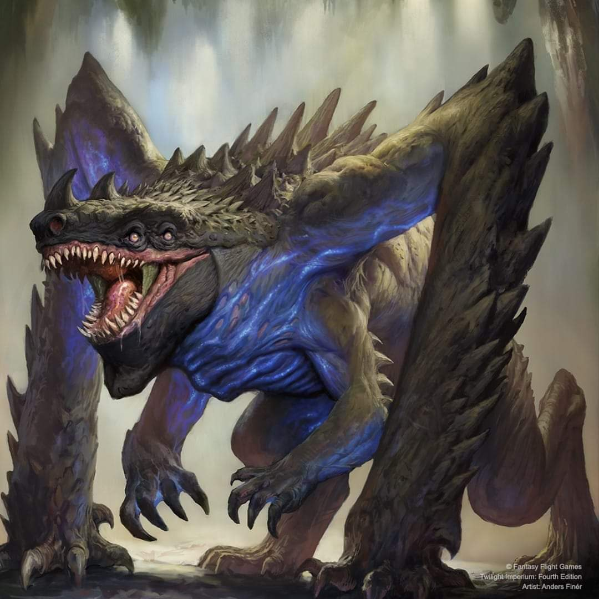

# Vuil'raith Cabal Guide

---

## I. Introduction

The Vuil'raith Cabal are TI4's ultimate resource recyclers and gravity rift specialists. Every enemy unit destroyed becomes your production fuel. Your dimensional tear space docks create gravity rifts for enhanced mobility, and your captured unit economy scales exponentially with each battle.

This faction rewards aggressive combat and resource efficiency. You don't build traditional economy—you steal it from your opponents. Every destroyed ship is future production, every captured unit is saved resources. The more you fight, the stronger you become.

## II. Playstyle

Playing Vuil'raith Cabal is like being a cosmic scavenger that turns enemy losses into your gains. Your Devour captures enemy units destroyed in combat, your Amalgamation lets you spend captured units instead of resources for production, and your Riftmeld uses captured units to bypass tech prerequisites. You're not building traditional economy—you're stealing enemy units and recycling them into your own fleets.

The key strength of Vuil'raith is captured unit economy. Every enemy ship you destroy becomes free production fuel. One captured dreadnought equals one free dreadnought you can produce later. This scales exponentially—the more you fight, the stronger your economy becomes.

Opponents will hesitate to attack you once they realize every ship they lose becomes your production fuel.

---

## III. The Basics

### A. Home System & Commodities

**Home System:**
- **Acheron:** 4 resources / 0 influence
- **Total: 4 resources / 0 influence (4 optimal resources / 0 optimal influence)**

**Commodities:** 2

**Notes:** Resource-heavy home system with 4 resources and ZERO influence. This is extreme—excellent for production, terrible for voting and political plays. Single-planet home system is easier to defend. Your 2 commodities are low for trading. You're built for military production.

### B. Starting Fleet

- 1 Dreadnought
- 1 Carrier
- 1 Cruiser
- 3 Fighters
- 3 Infantry
- 1 Space Dock

**Notes:** Strong starting fleet with a dreadnought (most factions start with carriers/cruisers only). 3 infantry, a dreadnought, and a carrier all moving 2 steps gives you solid flexibility. Very combat-ready R1.

### C. Faction Abilities

**Devour (Faction Ability):** Capture your opponent's non-structure units that are destroyed during combat.

Your signature ability. When enemy units die in combat (space or ground), you capture them instead of them going to reinforcements. These captured units sit on your faction sheet and can be used for Amalgamation (free production) or Riftmeld (ignore tech prerequisites). Devour allows you for pretty much costless wars—you should never have a problem to produce for almost free from the early game. Once you start producing, you never stop.

**Amalgamation (Faction Ability):** When you produce a unit, you may return 1 captured unit of that type to produce that unit without spending resources.

Free production. When producing a dreadnought, return 1 captured dreadnought to produce it for 0 resources. This is insane—every captured unit = 1 free production of that type. Over a game with 20 captured units, you save 40-60 resources.

**Riftmeld (Faction Ability):** When you research a unit upgrade technology, you may return 1 captured unit of that type to ignore all of that technology's prerequisites.

Unit upgrades are helpful to leverage your massive production. Usually your tech stack will be very small, and the ability to skip prerequisites opens up options. Do not overindex on this—you will need to spend your focus elsewhere. You will win combats with upgrades or not.

**Dimensional Tear (Special Unit):** Your space docks make the system a gravity rift. Your ships do not roll for this gravity rift. Up to 6 fighters in the system don't count against capacity.

Your dimensional tear space docks turn systems into gravity rifts for mobility advantages. You don't roll for your own gravity rifts, and opponents moving through must roll. Place them in forward positions for enhanced fleet movement.

### D. Starting and Faction Technologies

**Starting Technologies:**

**Self-Assembly Routines (R)** - After 1 or more of your units use PRODUCTION, you may exhaust this card to place 1 mech from your reinforcements on a planet you control in that system. After 1 of your mechs is destroyed, gain 1 trade good.

**Notes:** Solid starting tech. Place mech after production for free. Gain TG when mechs die. Feel free to let mechs die for TGs—you will be able to afford new mechs (might have some captured), but TGs are in short supply.

**Faction Technologies:**

**Dimensional Tear II (YY):**
*Vuil'raith Space Dock - PRODUCTION 7*

This system is a gravity rift; your ships do not roll for this gravity rift. Place a dimensional tear token beneath this unit as a reminder. Up to 12 fighters in this system do not count against your ships' capacity.

Hard to get normally but crazy value if you get from Entropic Scar. Having the 7 production and 2 bonus from Commander while every unit is free—pretty crazy. The endless supply of free fighters able to sit and defend your docks from being blockaded is helpful.

**Vortex (R):**
*ACTION: Exhaust this card to choose another player's non-structure unit in a system that is adjacent to 1 or more of your space docks. Capture 1 unit of that type from that player's reinforcements.*

Vortex is a stall—it gives less diplomatic anger than fighting for the troops, but this is a bit overrated. Unless you feel like you really don't want to anger people and have good targets nearby your docks, probably skip it and focus on unit upgrades.

### E. Leaders

**Agent - The Stillness of Stars:**

After another player replenishes commodities: You may exhaust this card to convert their commodities to trade goods and capture 1 unit from their reinforcements that has a cost equal to or lower than their commodity value.

Use it to steal dreadnoughts and carriers from willing or unwilling targets. Another economy boost to your production.

**Commander - That Which Molds Flesh:** *Unlock: Have units in 3 gravity rifts.*

When you produce fighter or infantry units: Up to 2 of those units do not count against your PRODUCTION limit.

Easy unlock—your dimensional tear space docks create gravity rifts, helping you place units in 3 gravity rift systems. Once unlocked, when producing fighters/infantry, 2 don't count against PRODUCTION limit (still cost resources). Very strong to emphasize your military advantage with extra production capacity.

**Hero - It Feeds on Carrion:** *Unlock: Have 3 scored objectives.* **Dimensional Anchor** - ACTION: Each other player rolls a die for each of his non-fighter ships that are in or adjacent to a system that contains a dimensional tear; on a 1-3, capture that unit. If this causes a player's ground forces or fighter to be removed, also capture those units. Then, purge this card.

It usually only captures a few ships because there won't be massive capital fleets next to you. Getting a flagship or war sun is just a pipe dream—it happens but rare. Just use whenever you feel a bit light on captured units or save for when you got nothing else to do.

### F. Promissory Note - **Crucible**

After you activate a system: Your ships do not roll for gravity rifts during this movement; apply an additional +1 to the move values of your ships that would move out of or through a gravity rift instead. Then, return this card to the Vuil'raith player.

Trade value 1-2 TG, but very useful if people need it for attacking someone important. The bonus movement helps too.

### G. Alliance

Whoever holds your alliance card has your Commander (That Which Molds Flesh - up to 2 fighters/infantry don't count against PRODUCTION limit).

When people have your alliance, they get to produce more like you. Strong alliance and definitely only trade for one of the top ones.

### H. Mech - **Reanimator**

Cost: 2 | Combat: 6 | **Sustain Damage**

When your infantry on this planet are destroyed, place them on your faction sheet; those units are captured.

Excellent mech. When YOUR infantry die on this planet, you capture them (instead of returning to reinforcements). This means your dead infantry can be used for Amalgamation later (free infantry production). Essentially makes your infantry immortal through recycling—they die, you capture them, you produce them again for free.

### I. Flagship - **The Terror Between**

Cost: 8 | Combat: 5 (x2) | Move: 1 | Capacity: 3 | **Sustain Damage** | **BOMBARDMENT 5**

Capture all other non-structure units that are destroyed in this system, including your own.

Insane flagship. Captures ALL units destroyed in the system (enemy AND yours). This means:
1. Enemy ships destroyed = captured (normal Devour)
2. YOUR ships destroyed = captured (not normal—you recycle your own losses!)

If you have massive fights with your flagship once, you will probably never have to pay for plastic again.

### J. Breakthrough - **Al'raith Ix Ianovar (R<>G)**

This breakthrough causes The Fracture to enter play without a roll, if it is not already in play. After this card enters play, move up to 2 ingress tokens into systems that contain gravity rifts. Apply +1 to the MOVE value of each of your ships that start their movement in The Fracture.

**R<>G Synergy:** Red and green technologies count as each other for prerequisites.

The synergy won't matter a lot—you won't tech almost at all—but guaranteeing The Fracture appears is very good for you. Being able to decide that a portal to The Fracture appears on one of your docks for strong movement. You can get neutral units, relics, and a point. In The Fracture you are unmatched. If you want to play a "peaceful Cabal," The Fracture is the place to hang out.

### K. Slice and Draft Considerations

Vuil'raith wants combat opportunities and gravity rift access:

**Speaker Order:**
All positions fine except 6th. No neighbor is too scary—you are the least favorite neighbor.

**Slice Priorities:**
- **Gravity rift highway** - Planets on the way to Mecatol with gravity rifts.
- **High influence slice** - All your units are free, you need tokens.
- **Not aggressive neighbors** - You will bring it either way.
- **Wormholes** - Nice for more targets.
- **Entropic Scar** - Very good. Lets you skip spending on tech and get a sneaky Dimensional Tear II.

**Slice Features to Avoid:**
- **High resource slice** - All your units are free, you need influence for tokens.
- **Asteroids / Novas in the middle** - Things that make you position your space docks weirdly.

---

## IV. Structural Weaknesses

### A. First Turn Priorities

**Round 1 Priority Rankings:**

1. **Scoring** - Try to get on it early. You don't excel at all objectives, so getting a head start is great.

2. **Expansion and Production** - You will have an easy time to take your entire slice, maybe even grab an extra equidistant that isn't "yours" (they all are, the rest don't know it yet).

3. **Breakthrough** - Fine to grab Round 1 if you got the opportunity. Getting to decide who can access The Fracture and not is actually very strong.

4. **Technology** - Not needed. Wait until you have units to upgrade. Try to play with very limited tech.

**Expansion Notes:** After you produce, you can almost always take everything. No special tips needed. Construction from yourself or Warfare from someone else.

### B. Diplomatic Struggles

You are the scary neighbor no one likes. Try to extort value from neighbors trying to keep you in check. The problem is that even if you are not winning, people still won't make a lot of deals with you. Dinos scary. Have to work around this best you can and grab extra planets to get resources.

---

## V. Technology

### A. Overview

You start with **Self-Assembly Routines (R)** (place mech after production, gain TG when mech destroyed).

Use Riftmeld to skip prerequisites on unit upgrades when you have captured units. Try to play with very limited tech.

### B. Tech Path

**Starting Tech:** Self-Assembly Routines (R)

**Round 2:** Carrier II (BB) - WITH RIFTMELD
- Cost 3, Combat 9, Move 2, Capacity 6
- **Why:** Transport capacity for invasions. Use Riftmeld with captured carrier to skip prerequisites.
- **Prerequisites:** None via Riftmeld (normally requires 2 blue)

**Round 3:** Dreadnought II (BBY) - WITH RIFTMELD
- Cost 4, Combat 5, Move 2, Capacity 1, Sustain, BOMBARDMENT 5
- **Why:** Capital ship upgrade. Use Riftmeld with captured dreadnought to skip prerequisites.
- **Prerequisites:** None via Riftmeld (normally requires 2 blue + 1 yellow)

**Round 4:** Destroyer II (RR) - WITH RIFTMELD
- Cost 1, Combat 8, Move 2, AFB 6 (x3)
- **Why:** Cheap fleet power. Use Riftmeld with captured destroyer to skip prerequisites.
- **Prerequisites:** None via Riftmeld (normally requires 2 red)

**Round 5+:** Ignore tech. You're done.

Having the freedom to get 3 unit upgrades and then not spend any more thought on tech is fantastic.

---

## VI. Strategy Cards

### A. Round 1

**Round 1 Priority Ranking:**

1. **Construction** - For double dock (done with commander unlock).

2. **Trade** - To get some early bonus production. Lack of TGs for rest of game can also be a nice boost to save a few.

3. **Leadership** - Can always do stuff with tokens, fight or produce.

4. **Politics** - To setup a strong round and some bonus money selling speaker. Unlock breakthrough on all of Trade/Leadership/Politics/Diplomacy.

5. **Technology** - Vortex early doesn't hurt but not my favorite.

6. **Diplomacy** - To get some bonus resources early.

7. **Warfare** - For "I don't want to have any friends" going right into someone's slice, then move again to kill them round.

8. **Imperial** - Never Round 1.

**Strategy Token Priority:** Diplomacy and Warfare as strategy tokens.

### B. Round 2+

**Love:**
- **Leadership** - Tokens for constant production and expansion.
- **Imperial** - Scoring points.

**Good:**
- **Politics** - Control agendas and speaker position.
- **Trade** - Economy boost with 2 commodities.
- **Construction** - Build more dimensional tears for production and commander unlock.

**Situational:**
- **Diplomacy** - Only for late game scoring. Who would attack you?
- **Warfare** - Should not be needed.
- **Technology** - Fine to do secondary.

---

## VII. Intermediate

### A. Unit Composition

**Preferred Units:**
- **Dreadnoughts** - Sustain Damage capital ships. Capture and reproduce for free.
- **Carriers** - Transport capacity for invasions. Capture and reproduce for free.
- **Destroyers** - Cheap fleet power. Once upgraded, excellent AFB.
- **Infantry** - Commander bonus (2 don't count against production). Spam these.
- **Fighters** - Commander bonus (2 don't count against production). Spam these.
- **Flagship** - Captures all units destroyed (including your own).

**Avoid:**
- **Cruisers (unupgraded)** - Not worth it.
- **War Sun** - Too expensive.

### B. Game Plan

**Early Game (Rounds 1-2):**

Your early game is about aggressive expansion and building your captured unit reserves. Expand to your entire slice and maybe grab an extra equidistant. Build dimensional tear space docks in forward positions to create gravity rift zones—aim to unlock Commander (units in 3 gravity rifts). Fight early to start capturing units—every destroyed ship becomes future free production.

**Mid Game (Rounds 3-4):**

Use Riftmeld to get Carrier II, Dreadnought II, and Destroyer II without prerequisites. Start producing units for free using Amalgamation with your captured reserves. Consider pushing toward Mecatol Rex or controlling The Fracture if you have the breakthrough. In The Fracture you are unmatched—neutral units, relics, and points available.

**Late Game (Round 5+):**

You should have massive captured unit reserves. Produce entire fleets for free using Amalgamation. Make plays for Styx and Mecatol to have a big swing round. Try to not be beyond saving diplomatically at that point. Score objectives and close out the game with your overwhelming production advantage.

---

## VIII. Objectives

### A. Objective Summary

**Strengths:** Excels at combat objectives with aggressive playstyle. Aggressive expansion with free production supports control objectives.

**Weaknesses:** Spending objectives are hard despite free production. Tech objectives challenging with minimal tech. Structure objectives difficult.

### B. Stage I Objectives

| Stage I Objective                                                       | Status |
|-------------------------------------------------------------------------|--------|
| Erect a Monument (Spend 8 resources)                                    | 🟢     |
| Sway the Council (Spend 8 influence)                                    | 🔴     |
| Negotiate Trade Routes (Spend 5 trade goods)                            | 🔴     |
| Lead from the Front (Spend 3 tokens from tactic/strategy pools)         | 🔴     |
| Diversify Research (Own 2 tech in each of 2 colors)                     | 🔴     |
| Develop Weaponry (Own 2 unit upgrade technologies)                      | 🟢     |
| Found Research Outposts (Control 3 planets with tech specialties)       | 🟡     |
| Intimidate the Council (Ships in 2 systems adjacent to MR)              | 🟢     |
| Expand Borders (Control 6 planets in non-home systems)                  | 🟢     |
| Corner the Market (Control 4 planets with same trait)                   | 🟡     |
| Amass Wealth (Spend 3 influence, 3 resources, 3 trade goods)            | 🟡     |
| Build Defenses (Have 4 or more structures)                              | 🟡     |
| Discover Lost Outposts (Control 2 planets with attachments)             | 🟡     |
| Engineer a Marvel (Have flagship or war sun on board)                   | 🟢     |
| Explore Deep Space (Units in 3 systems without planets)                 | 🟢     |
| Improve Infrastructure (Structures on 3 planets outside HS)             | 🟡     |
| Make History (Units in 2 systems with legendary/MR/anomalies)           | 🟢     |
| Populate the Outer Rim (Units in 3 edge systems)                        | 🟢     |
| Push Boundaries (Control more planets than each neighbor)               | 🟢     |
| Raise a Fleet (5+ non-fighter ships in 1 system)                        | 🟢     |

**Legend:** 🟢 Easy | 🟡 Moderate | 🔴 Difficult

### C. Secret Objectives

| Secret Objective                                                         | Status |
|--------------------------------------------------------------------------|--------|
| Unveil Flagship (Win space combat with flagship)                         | 🟢     |
| Turn their Fleets to Dust (SPACE CANNON destroy last ship)              | 🔴     |
| Destroy their Greatest Ship (Destroy war sun/flagship)                   | 🟢     |
| Spark a Rebellion (Win combat vs VP leader)                              | 🟢     |
| Threaten Enemies (Ships adjacent to another player's HS)                | 🟢     |
| Make an Example (BOMBARDMENT destroy last ground forces)                | 🟢     |
| Cut Supply Lines (Ships in system with enemy space dock)                | 🟢     |
| Monopolize Production (Control 4 industrial planets)                     | 🔴     |
| Mine Rare Minerals (Control 4 hazardous planets)                        | 🔴     |
| Forge an Alliance (Control 4 cultural planets)                          | 🔴     |
| Become a Martyr (Lose control of planet in home system)                 | 🔴     |
| Betray a Friend (Win combat vs player whose PN you have)                | 🟢     |
| Brave the Void (Win combat in anomaly)                                  | 🟢     |
| Darken the Skies (Win combat in another player's HS)                    | 🟢     |
| Defy Space and Time (Units in wormhole nexus)                           | 🟡     |
| Demonstrate your Power (3+ non-fighter ships after space combat)        | 🟢     |
| Destroy Heretical Works (Purge 2 relic fragments)                       | 🔴     |
| Dictate Policy (3+ laws in play)                                        | 🔴     |
| Drive the Debate (You/your planet elected by agenda)                    | 🔴     |
| Establish Hegemony (Control planets with 12+ influence)                 | 🔴     |
| Adapt New Strategies (Own 2 faction technologies)                       | 🔴     |
| Master the Laws of Physics (Own 4 tech of same color)                   | 🔴     |
| Form a Spy Network (Discard 5 action cards)                             | 🟡     |
| Gather a Mighty Fleet (Have 5 dreadnoughts)                             | 🟢     |
| Establish a Perimeter (Have 4 PDS on board)                             | 🔴     |
| Fuel the War Machine (Have 3 space docks)                               | 🟢     |
| Become the Gatekeeper (Ships in alpha and beta wormhole systems)        | 🟡     |
| Learn Secrets of the Cosmos (Ships in 3 systems adjacent to anomalies)  | 🟢     |
| Control the Region (Ships in 6 systems)                                 | 🟢     |
| Occupy the Seat of the Empire (Control MR with 3+ ships)                | 🟢     |
| Fight With Precision (AFB destroy last fighter)                         | 🟢     |
| Foster Cohesion (Be neighbors with all players)                         | 🟢     |
| Hoard Raw Materials (Control planets with 12+ resources)                | 🟢     |
| Mechanize the Military (1 mech on each of 4 planets)                    | 🟢     |
| Occupy the Fringe (9+ ground forces on planet without space dock)       | 🔴     |
| Produce en Masse (Units with PRODUCTION 8+ in single system)            | 🔴     |
| Prove Endurance (Last to pass)                                          | 🔴     |
| Seize an Icon (Control legendary planet)                                | 🟢     |
| Stake Your Claim (Control planet in contested system)                   | 🟢     |
| Strengthen Bonds (Have another player's PN)                             | 🟢     |

### D. Stage II Objectives

| Stage II Objective                                                       | Status |
|--------------------------------------------------------------------------|--------|
| Centralize Galactic Trade (Spend 10 trade goods)                         | 🔴     |
| Found a Golden Age (Spend 16 resources)                                  | 🟡     |
| Galvanize the People (Spend 6 tokens from tactic/strategy pools)         | 🔴     |
| Manipulate Galactic Law (Spend 16 influence)                             | 🔴     |
| Hold Vast Reserves (Spend 6 influence, 6 resources, 6 trade goods)       | 🔴     |
| Command an Armada (Have 8+ non-fighter ships in 1 system)                | 🟡     |
| Achieve Supremacy (Flagship/War Sun in another player's HS or MR)        | 🟢     |
| Become a Legend (Units in 4 systems with legendary/MR/anomalies)         | 🟢     |
| Conquer the Weak (Control 1 planet in another player's HS)               | 🟡     |
| Rule Distant Lands (Control 2 planets in/adjacent to different players' HS) | 🟢     |
| Patrol Vast Territories (Units in 5 systems without planets)             | 🔴     |
| Control the Borderlands (Units in 5 edge systems not HS)                 | 🟡     |
| Subdue the Galaxy (Control 11 planets in non-home systems)               | 🟢     |
| Unify the Colonies (Control 6 planets with same trait)                   | 🔴     |
| Reclaim Ancient Monuments (Control 3 planets with attachments)           | 🔴     |
| Construct Massive Cities (Have 7+ structures)                            | 🔴     |
| Protect the Border (Structures on 5 planets outside HS)                  | 🔴     |
| Master of Sciences (Own 2 techs in each of 4 colors)                     | 🔴     |
| Revolutionize Warfare (Own 3 unit upgrade technologies)                  | 🟢     |

**Legend:** 🟢 Likely | 🟡 Possible | 🔴 Difficult

---

## IX. Alliance Priority

Alliance preference ranking based on commander utility:

**Top Tier:**

1. **Crimson Rebellion** (Ahk Siever) - Gain 1 TG after any combat (all players' fights). Constant passive income.
2. **Titans of Ul** (Tungstantus) - Gain 1 TG when using production. You produce constantly = constant TG income.
3. **Muaat** (Magmus) - Gain 1 TG after spending strategy pool token. Passive income boost.
4. **Deepwrought** (Aello) - Gain commodity/TG when others research tech. Passive income you need.

**Good:**

5. **Empyrean** (Xuange) - Return tokens when others move into your systems. Double attack.
6. **Barony of Letnev** (Rear Admiral Farran) - Gain 1 TG after unit uses Sustain Damage. TG from dreadnoughts.
7. **Naaz-Rokha Alliance** (Dart and Tai) - Explore planet after conquering. Extra value from aggression.
8. **Winnu** (Rickar Rickani) - +2 combat in MR/home/legendary systems. Combat boost.
9. **Mentak Coalition** (S'ula Mentarion) - Force opponent to give PN after space combat win. Very frustrating to fight Mentak and lose your plastic and your PN.
10. **Nomad** (Navarch Feng) - Produce flagship without spending resources. Saves 8 resources.

---

## X. Bonus Game Elements

This section highlights action cards that synergize particularly well with your faction's strengths or mitigate your weaknesses, relics that offer exceptional value for your faction's strategy and abilities, and agendas to pursue that benefit your position, and agendas to watch out for that could hurt you.

### A. High-Value Action Cards

### B. Relic Priorities

### C. Agenda Awareness

---

## XI. End Notes

Vuil'raith Cabal is the faction for players who love aggressive combat and resource recycling. You're not building traditional economy—you're stealing it from your enemies. Every destroyed ship becomes your production fuel, and you'll end the game with more free units than anyone else.

Your biggest strength is captured unit economy. You don't pay for production like other factions. With Amalgamation and Devour, combat isn't just about winning—it's about converting enemy losses into your gains. Every fight makes you stronger, every captured unit is saved resources. Your production scales infinitely with aggression.

When you master Vuil'raith Cabal, you feel like an unstoppable force consuming the galaxy. The table will fear you, but they can't stop you from growing stronger with every battle. Vuil'raith Cabal builds massive fleets—they just don't pay for them.

**DEVOUR. ASSIMILATE. DOMINATE.**
