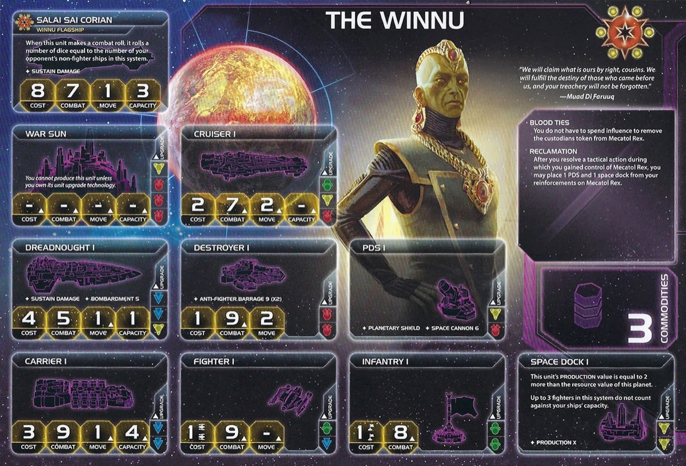

<nav class="page-nav">
<a href="../index.html" class="back-link">Back to Index</a>
<a href="Winnu.md" download class="download-link" title="Plain text file - safe to download">Download .md</a>
</nav>

# Winnu Guide

## Contents

1. [Introduction](#i-introduction)
2. [Playstyle](#ii-playstyle)
3. [Faction Info and Drafting](#iii-faction-info-and-drafting)
   - [Home System & Commodities](#a-home-system--commodities) · [Starting Fleet](#b-starting-fleet) · [Faction Abilities](#c-faction-abilities) · [Technologies](#d-starting-and-faction-technologies) · [Leaders](#e-leaders) · [Promissory Note](#f-promissory-note---acquiescence) · [Alliance](#g-alliance) · [Mech](#h-mech---reclaimer) · [Flagship](#i-flagship---salai-sai-corian) · [Breakthrough](#j-breakthrough---imperator-br) · [Slice and Draft](#k-slice-and-draft-considerations)
4. [Round 1 Problems and Faction Weakness](#iv-round-1-problems-and-faction-weakness)
   - [First Turn Priorities](#a-first-turn-priorities) · [Mecatol Rex Dependency](#b-mecatol-rex-dependency) · [Universal Target](#c-universal-target)
5. [Technology](#v-technology)
   - [Overview](#a-overview) · [Tech Path 1: Blue](#b-tech-path-1-blue-path-fast) · [Tech Path 2: Red](#c-tech-path-2-red-path-slow)
6. [Strategy Cards](#vi-strategy-cards)
   - [Round 1](#a-round-1) · [Round 2+](#b-round-2)
7. [Unit Composition and Game Plan](#vii-unit-composition-and-game-plan)
   - [Unit Composition](#a-unit-composition) · [Game Plan](#b-game-plan)
8. [Objectives](#viii-objectives)
   - [Objective Summary](#a-objective-summary) · [Stage I](#b-stage-i-objectives) · [Secret Objectives](#c-secret-objectives) · [Stage II](#d-stage-ii-objectives)
9. [Alliance Priority](#ix-alliance-priority)
10. [Bonus Game Elements](#x-bonus-game-elements)
    - [Action Cards](#a-high-value-action-cards) · [Relics](#b-relic-priorities) · [Agendas](#c-agenda-awareness)
11. [End Notes](#xi-end-notes)

---

## I. Introduction

The Winnu are TI4's Mecatol Rex specialists—a faction with exactly one strategy: take Mecatol Rex early and hold it. Their quirky, all-in nature makes them a fan favorite to love (or hate). You're racing to MR, fortifying it with free structures, and defending the throne with everything you've got.

This faction has surprising power when piloted correctly. Despite appearing weak on paper, their MR bonuses can snowball into victory if you execute the rush perfectly and survive the inevitable backlash.

## II. Playstyle

Playing Winnu is like being the rightful heir to an empty throne. You start weak—limited tech, modest fleet—but you overcome it by claiming what's rightfully yours. You take Mecatol Rex for free while others pay dearly, fortify it instantly, and become a defensive powerhouse when fighting for key targets like Mecatol Rex and legendaries. You're not conquering the galaxy—you're claiming the throne and daring anyone to take it from you.

Expect massive swing turns—dominating one round, then getting ganged up on the next. Once you take Mecatol Rex, you become everyone's problem. It's king of the hill, and you're standing on top with every other player trying to knock you off.

If you secure and hold Mecatol Rex, you win. If you can't, you lose. It's that simple.

---

## III. Faction Info and Drafting

### A. Home System & Commodities

**Home System:**

- **Winnu:** 3 resources / 4 influence
- **Total: 3 resources / 4 influence (0 optimal resources / 4 optimal influence)**

**Commodities:** 3

**Notes:** You need resources to improve your dire plastic situation early game, but you only have a 4 influence home system which you often have to spend as early resources. This creates early economic tension. However, single-planet home with starting PDS + Commander (unlocked after taking MR) creates crazy strong defense later.

### B. Starting Fleet

- 1 Carrier
- 1 Cruiser
- 2 Fighters
- 2 Infantry
- 1 Space Dock
- 1 PDS

**Notes:** Very modest fleet. Low ship count, poor infantry (only 2), and only 1 capacity ship is terrible for expansion. Your Round 1 expansion is a key feature for your success—sell your soul to get plastic on the board. Trade aggressively, use Construction, do whatever it takes to expand to 3+ systems and build more units early.

### C. Faction Abilities

**Blood Ties (Faction Ability):** You do not have to spend influence to remove the custodians token from Mecatol Rex.

Your signature ability. Normally, taking Mecatol Rex costs 6 influence to remove custodians. You spend 0 influence. This makes you the strongest custodian faction. Problem is, this puts a bullseye on you so very clearly—everyone knows you're going for MR. At the same time, gotta risk it for the biscuit.

**Reclamation (Faction Ability):** After you resolve a tactical action during which you gained control of Mecatol Rex, you may place 1 PDS and 1 space dock from your reinforcements on Mecatol Rex.

Free structures on Mecatol Rex. Instant fortification. Once you take it, you should try to hold it—you have bonus combat power and structures to help. Easiest way to hold it is with mechs and infantry. Very hard to hold the space.

### D. Starting and Faction Technologies

**Starting Technologies:**

**Choose any 1 technology that has no prerequisites (0 cost techs only)**

**Best Options:**

1. **Dark Energy Tap** - For value and action-heavy playstyle.

2. **AI Development Algorithm** - For defensive and slow roll playstyle.

**Notes:** Being able to pick any tech is flexible, but not all techs are made equal. These 2 offer differing playstyles—DET for more value and actions, AI DEV for more defensive and slow rolling your way to victory.

**Faction Technologies:**

**Lazax Gate Folding (BB):**
*During your tactical actions, if you do not control Mecatol Rex, treat its system as if it contains both an alpha and beta wormhole. ACTION: If you control Mecatol Rex, exhaust this card to place 1 infantry from your reinforcements on Mecatol Rex.*

Very situational. Only useful in weird slices where it's problematic to get to MR but happens to have a well-placed wormhole. Very niche.

**Hegemonic Trade Policy (YY):**
*Exhaust this card when 1 or more of your units use PRODUCTION; swap the resource and influence values of 1 planet you control until the end of your turn.*

Really weird tech that seems incredibly niche. When would you need this? If you want flexibility, just use your trade goods—they're already flexible. This does nothing for you and is costly on a bad tech path.

### E. Leaders

**Agent - Berekar Berekon:**

When 1 or more of a player's units use PRODUCTION: You may exhaust this card to reduce the combined cost of the produced units by 2.

Big solve for your early production and defense, but 2 resources only for production is not overly useful. Good to have any economy, but agent is on the weaker side. Rarely sold.

**Commander - Rickar Rickani:** *Unlock: Control Mecatol Rex or enter into a combat in the Mecatol Rex system.*

During combat: Apply +2 to the result of each of your unit's combat rolls in the Mecatol Rex system, your home system, and each system that contains a legendary planet.

Easy unlock. Combat powerhouse for defending Mecatol Rex, your home, and legendaries. Great if you have a lot of legendary planets. Activates before you fight on Mecatol if you didn't get there first. Key aspect of your game.

**Hero - Mathis Mathinus:** *Unlock: Have 3 scored objectives.* **Imperial Seal** - ACTION: Perform the primary ability of any strategy card. Then, choose any number of other players. Those players may perform the secondary ability of that strategy card. Then, purge this card.

Almost always used for Imperial to make a big point swing, especially assuming you'll often be behind or trying to make a big rush for the finish if people didn't put you down early.

### F. Promissory Note - **Acquiescence**

When the Winnu player resolves a strategic ACTION: You do not have to spend or place a command token to resolve the secondary ability of that strategy card. Then, return this card to the Winnu player.

Useful promissory. Try to sell for 2 TG every round. Does affect Leadership a bit (since they spend no token), so effectively giving you -2 TG.

### G. Alliance

Whoever holds your alliance card has your Commander (Rickar Rickani - +2 combat in Mecatol Rex, home system, and legendary planet systems).

Very valuable. If you already have control of MR, you can consider selling since the person attacking you will lose it before getting bonus value. Before that, never risk someone having your big bonus on MR.

### H. Mech - **Reclaimer**

Cost: 2 | Combat: 6 | **Sustain Damage**

After you resolve a tactical action during which you gained control of this planet, you may place 1 PDS or 1 space dock from your reinforcements on this planet.

Excellent expansion mech. After conquering a planet, place a free PDS or space dock on it. This accelerates your infrastructure—every conquered planet can immediately become a production facility or defensive position. Very strong for slow expansion.

Try to make a few early mechs (2 minimum), then use them to walk towards Mecatol for a very safe and structure-filled slice.

**Special Note:** Hope's End attachment can give you early mechs, which is huge for Winnu.

### I. Flagship - **Salai Sai Corian**

Cost: 8 | Combat: 7 (x?) | Move: 1 | Capacity: 3 | **Sustain Damage**

When this unit makes a combat roll, it rolls a number of dice equal to the number of your opponent's non-fighter ships in this system.

One of the best flagships in the game. Always get it. Rolls dice equal to opponent's non-fighter ship count. If put on Mecatol with Commander, it hits on 5 (7 - 2 = 5). Excellent against large fleets.

### J. Breakthrough - **Imperator (B↔R)**

Apply +1 to the results of each of your unit's combat rolls for each "Support for the Throne" in your opponent's play area. After you activate a system that contains a legendary planet, apply +1 to the move value of 1 of your ships during this tactical action.

**B↔R Synergy:** Blue and red technologies count as each other for prerequisites.

If planning to get custodian, very helpful to get this instead of tech. Functions as Gravity Drive for legendary planets. Combat bonus for each Support for the Throne opponents have.

### K. Slice and Draft Considerations

Winnu needs access to Mecatol Rex and resources for fleet production:

**Speaker Order:**
Loves speaker. Trade is your very best tool—makes a huge difference. Otherwise, any early value is helpful, so try to be early.

**Slice Priorities:**

- **Clear path to Mecatol Rex** - Critical for your MR rush.
- **Resource-heavy planets** - You need resources for fleet production.
- **Legendary planets** - Synergize with Commander combat bonus.
- **Rich slice** - You're quite poor, so a rich slice is good.
- **Hope's End** - Gives you early mechs, which is huge.

**Avoid:**

- **Asteroid fields on the way to Mecatol** - Slows you down.
- **Gravity rift on the way to Mecatol** - Dangerous and costly.
- **Entropic Scar** - Not good for you. Let someone else get it. Both your faction techs are niche.

---

## IV. Round 1 Problems and Faction Weakness

### A. First Turn Priorities

**Round 1 Priority Rankings:**

1. **Expansion + Production** - Most important. Solving early production with Construction or Warfare might be necessary. You have to spread out in some way. Build fleet and claim systems toward MR.

2. **Breakthrough** - Get Imperator if possible. Tech is more costly in general.

3. **Technology** - Lower priority than breakthrough.

4. **Scoring** - Scoring early with Winnu is almost impossible and I would highly refrain from it. Your start is so weak you need others to spend resources and effort to score while you get back up to even.

**Expansion Notes:** You have 1 carrier (capacity 4), 1 cruiser, and 2 infantry. 2 systems is realistic. If you have a handy legendary planet in a good spot, you might be able to get 3.

### B. Mecatol Rex Dependency

All your abilities point toward Mecatol. Your Commander only unlocks after controlling MR or fighting near it. Your Reclamation only triggers on MR. Your entire faction is built around Mecatol Rex.

If you play with people/factions that also like Mecatol, it will be a tough battle. Small note: with the new fracture, less people might be in the way of your Mecatol control.

### C. Universal Target

People know that if you get rolling, it's surprisingly hard to stop you. You can have massive swingy turns with Imperial x2. They might screw you early or team up later to take you down.

---

## V. Technology

### A. Overview

You start with **one technology of your choice** (0-cost tech only). **Dark Energy Tap** or **AI Development Algorithm** are the best choices.

Your starting tech determines your path: fast blue path or slow red path. Fast blue path gets you mobile early with Gravity Drive. Slow red path focuses on defensive tech and unit upgrades.

### B. Tech Path 1: Blue Path (Fast)

**Starting Tech:** Dark Energy Tap

**Round 1:** Gravity Drive (B) - if you can afford tech
- After you activate a system, apply +1 to the move value of 1 of your ships
- **Why:** Reach Mecatol faster. Critical for early MR assault.

**Round 2:** Carrier II (BB)
- Cost 3, Combat 9, Move 2, Capacity 6
- **Why:** Better transport for armies and reinforcements to MR.

**Round 3:** Sling Relay (B) OR Fleet Logistics (BB)
- **Sling Relay:** ACTION: Exhaust to produce 1 ship in any system with your space docks
- **Fleet Logistics:** Perform 2 actions per turn
- **Why:** Production flexibility or double actions for positioning.

**Round 4:** Fleet Logistics (BB) OR Light/Wave Deflector (BBB)
- **Light/Wave Deflector:** Your ships can move through systems that contain other players' ships
- **Why:** Bypass blockades, extreme mobility.

**Round 5+:** Flex techs

Together with your breakthrough, this path offers great mobility to make some moves.

**Best For:** Flexibility and movement objectives. Slightly weaker defensively. Good in general.

---

### C. Tech Path 2: Red Path (Slow)

**Starting Tech:** AI Development Algorithm

**Round 1:** Gravity Drive (B) - if you can afford tech
- After you activate a system, apply +1 to the move value of 1 of your ships
- **Why:** Mobility for reaching targets.

**Round 2:** Magen Defense Grid (R)
- When any player activates a system with your structures, place 1 infantry with each structure. At start of ground combat on planet with your structures, produce 1 hit
- **Why:** Free infantry when systems activated, plus ground combat hit. Strong defensive tech.

**Round 3:** PDS II (RY)
- Planetary Shield, SPACE CANNON 5. Can shoot ships adjacent to this unit's system
- **Why:** Upgrade your PDS network. Strong defense.

**Round 4:** Destroyer II (RR)
- Cost 1, Combat 8, Move 2, ANTI-FIGHTER BARRAGE 6 (x3)
- **Why:** Cheap upgraded destroyers with AFB.

**Round 5:** Carrier II (BB)
- Cost 3, Combat 9, Move 2, Capacity 6
- **Why:** Better transport capacity.

More unit focused. Tons of PDS defending your slice. Best utilized if you have multiple mechs walking out in your slice over 2 turns to fill out with structures.

**Best For:** Defensive play and combat objectives. Weaker mobility. Good if you want more structures and ground forces.

---

## VI. Strategy Cards

### A. Round 1

**Round 1 Priority Ranking:**

1. **Trade** - Very best card. Get resources to not be seen as a target.
2. **Technology** - Useful to save resources. Early tech is useful to get the best systems in slice.
3. **Politics** - For setting up custodian and MR Round 2, but can be resource starved.
4. **Construction** - If you need to produce (risk of no Warfare).
5. **Leadership** - Just for breakthrough and bonus tokens can give some bonuses early.
6. **Diplomacy** - Resources and unlock breakthrough. Taking your slice without mechs is sad.
7. **Warfare** - If someone took Construction.
8. **Imperial** - Never Round 1.

**Strategy Token Priority:** Warfare and Diplomacy as strategy tokens.

### B. Round 2+

**Love:**

- **Imperial** - Score points from Mecatol Rex control. Your win condition.
- **Trade** - Make more plastic and not appear like an easy target. Always good to make friends and have a flexible economy.

**Good:**

- **Leadership** - Command tokens for actions and defense.
- **Politics** - To be able to secure Imperial.

**Situational:**

- **Diplomacy** - Bonus economy or protecting a key system.
- **Construction** - Almost useless if you took your slice properly and got structures from mech and MR.
- **Warfare** - Redistribution or fleet unlock if necessary.

---

## VII. Unit Composition and Game Plan

### A. Unit Composition

**Blue Path Composition:**

- **Carriers** - Your main transport. Upgrade to Carrier II (BB) for move 2 and capacity 6. Essential for moving armies to Mecatol and reinforcing it.
- **Infantry** - Your ground forces. With Commander (+2 combat), they hit on 6 instead of 8 on Mecatol. Cheap and effective defenders.
- **Mechs** - Sustain Damage ground forces. Use Reclaimer ability to place free structures when conquering planets. Critical for building your infrastructure.
- **Flagship** - Rolls dice equal to opponent's non-fighter ships. With Commander, hits on 5 instead of 7 on Mecatol. Devastating against large fleets.
- **Fighter screen** - Cheap fleet support. Absorb hits and provide fleet presence.

**Red Path Composition:**

- **Carriers** - Transport for infantry and mechs. Upgrade to Carrier II (BB) for move 2 and capacity 6.
- **Destroyers** - Cheap ships with AFB. Upgrade to Destroyer II (RR) for combat 8 and AFB 6 (x3). More cost-effective than cruisers or dreadnoughts.
- **Infantry** - Your ground forces. With Commander (+2 combat), hit on 6 on Mecatol. Essential for holding the planet.
- **Mechs** - Sustain Damage ground forces. Reclaimer ability places free structures. Build 2-4 mechs early and walk them toward Mecatol.
- **Flagship** - Scales with opponent's fleet size. Hits on 5 with Commander on Mecatol. Excellent defensive ship.
- **Fighter screen** - Cheap units for fleet presence and absorbing hits.

**General Note:** Try to avoid expensive ships like dreadnoughts. With Commander combat bonus, cheaper units become very effective.

### B. Game Plan

**Early Game (Round 1):**

Your early game is about surviving your weak start and positioning for Mecatol Rex. Expand to 2-3 systems, prioritize Trade for economy, and build plastic to not look like an easy target. If you can afford tech Round 1, grab Gravity Drive for mobility. Build mechs early (2 minimum) and walk them toward Mecatol to create a structure-filled path.

**Round 2 - Custodian Grab:**

Take custodians on Mecatol Rex using Blood Ties (free 6 influence cost removal). This is your optimal play—you're the best custodian faction and should leverage it. Place free PDS and space dock with Reclamation immediately. Your Commander unlocks, giving you +2 combat in the MR system, making you nearly unkillable there. Politics Round 1 helps set this up. Start building your defensive fleet on MR to prepare for inevitable attacks.

**Mid Game (Rounds 3-4):**

If you secured custodians Round 2, focus on holding Mecatol Rex and scoring Imperial points. Take Imperial when possible to score 2 points from MR control. Make political deals to avoid getting ganged up on—you're now everyone's problem.

If you didn't get custodians Round 2, take Mecatol Rex now using Blood Ties. By this point, your slice should be carefully defended with mechs and structures, allowing you to make greedy moves toward MR without exposing your home system. Place free PDS and space dock with Reclamation. Your Commander unlocks, giving you combat power on Mecatol and legendaries.

**Late Game (Round 5+):**

Hold Mecatol Rex and keep scoring Imperial. Your Commander makes you surprisingly hard to dislodge. Use your Hero for a massive point swing when needed. Win through MR control and Imperial scoring.

---

## VIII. Objectives

### A. Objective Summary

**Strengths:** Excels at MR objectives with Blood Ties and natural positioning on Mecatol Rex. Reclamation provides free structures for structure objectives, and Commander helps defend key positions.

**Weaknesses:** Poor early expansion and weak economy (3/4 home) make planet control and spending objectives challenging. Tech objectives are difficult with 1 starting tech, and losing MR removes most advantages.

### B. Stage I Objectives

**Spendies**

| Stage I Objective                                                       | Status |
|-------------------------------------------------------------------------|--------|
| Develop Weaponry (Own 2 unit upgrade technologies)                      | 🟡     |
| Diversify Research (Own 2 tech in each of 2 colors)                     | 🔴     |
| Lead from the Front (Spend 3 tokens from tactic/strategy pools)         | 🟡     |
| Negotiate Trade Routes (Spend 5 trade goods)                            | 🟡     |
| Sway the Council (Spend 8 influence)                                    | 🟡     |

**Control**

| Stage I Objective                                                       | Status |
|-------------------------------------------------------------------------|--------|
| Expand Borders (Control 6 planets in non-home systems)                  | 🔴     |
| Push Boundaries (Control more planets than each neighbor)               | 🔴     |

**Ships in Systems**

| Stage I Objective                                                       | Status |
|-------------------------------------------------------------------------|--------|
| Amass Wealth (Spend 3 influence, 3 resources, 3 trade goods)            | 🟡     |
| Discover Lost Outposts (Control 2 planets with attachments)             | 🟡     |
| Engineer a Marvel (Have flagship or war sun on board)                   | 🟡     |
| Explore Deep Space (Units in 3 systems without planets)                 | 🔴     |
| Intimidate the Council (Ships in 2 systems adjacent to MR)              | 🟢     |
| Make History (Units in 2 systems with legendary/MR/anomalies)           | 🟢     |
| Populate the Outer Rim (Units in 3 edge systems)                        | 🔴     |
| Raise a Fleet (5+ non-fighter ships in 1 system)                        | 🟢     |

**Tech**

| Stage I Objective                                                       | Status |
|-------------------------------------------------------------------------|--------|
| Corner the Market (Control 4 planets with same trait)                   | 🔴     |
| Found Research Outposts (Control 3 planets with tech specialties)       | 🔴     |

**Structure**

| Stage I Objective                                                       | Status |
|-------------------------------------------------------------------------|--------|
| Build Defenses (Have 4 or more structures)                              | 🟡     |
| Erect a Monument (Spend 8 resources)                                    | 🟡     |
| Improve Infrastructure (Structures on 3 planets outside HS)             | 🟢     |

**Legend:** 🟢 Likely | 🟡 Possible | 🔴 Difficult

### C. Secret Objectives

**Combat**

| Secret Objective                                                         | Status |
|--------------------------------------------------------------------------|--------|
| Become a Martyr (Lose control of planet in home system)                 | 🔴     |
| Betray a Friend (Win combat vs player whose PN you have)                | 🟢     |
| Brave the Void (Win combat in anomaly)                                  | 🟢     |
| Darken the Skies (Win combat in another player's HS)                    | 🔴     |
| Demonstrate your Power (3+ non-fighter ships after space combat)        | 🟢     |
| Destroy their Greatest Ship (Destroy war sun/flagship)                   | 🟡     |
| Fight With Precision (AFB destroy last fighter)                         | 🔴     |
| Make an Example (BOMBARDMENT destroy last ground forces)                | 🔴     |
| Spark a Rebellion (Win combat vs VP leader)                              | 🟢     |
| Turn their Fleets to Dust (SPACE CANNON destroy last ship)              | 🟡     |

**Ships in Systems**

| Secret Objective                                                         | Status |
|--------------------------------------------------------------------------|--------|
| Become the Gatekeeper (Ships in alpha and beta wormhole systems)        | 🟡     |
| Cut Supply Lines (Ships in system with enemy space dock)                | 🟢     |
| Learn Secrets of the Cosmos (Ships in 3 systems adjacent to anomalies)  | 🟢     |
| Occupy the Seat of the Empire (Control MR with 3+ ships)                | 🟢     |
| Seize an Icon (Control legendary planet)                                | 🟢     |
| Threaten Enemies (Ships adjacent to another player's HS)                | 🟡     |

**Control**

| Secret Objective                                                         | Status |
|--------------------------------------------------------------------------|--------|
| Adapt New Strategies (Own 2 faction technologies)                       | 🟢     |
| Defy Space and Time (Units in wormhole nexus)                           | 🟡     |
| Forge an Alliance (Control 4 cultural planets)                          | 🔴     |
| Hoard Raw Materials (Control planets with 12+ resources)                | 🔴     |
| Mechanize the Military (1 mech on each of 4 planets)                    | 🟡     |
| Mine Rare Minerals (Control 4 hazardous planets)                        | 🔴     |
| Monopolize Production (Control 4 industrial planets)                     | 🔴     |
| Stake Your Claim (Control planet in contested system)                   | 🟡     |

**Tech**

| Secret Objective                                                         | Status |
|--------------------------------------------------------------------------|--------|
| Master the Laws of Physics (Own 4 tech of same color)                   | 🔴     |
| Unveil Flagship (Win space combat with flagship)                         | 🟢     |

**Structure/Units**

| Secret Objective                                                         | Status |
|--------------------------------------------------------------------------|--------|
| Dictate Policy (3+ laws in play)                                        | 🔴     |
| Establish Hegemony (Control planets with 12+ influence)                 | 🟢     |
| Establish a Perimeter (Have 4 PDS on board)                             | 🟢     |
| Fuel the War Machine (Have 3 space docks)                               | 🟢     |
| Gather a Mighty Fleet (Have 5 dreadnoughts)                             | 🔴     |
| Occupy the Fringe (9+ ground forces on planet without space dock)       | 🔴     |

**Other**

| Secret Objective                                                         | Status |
|--------------------------------------------------------------------------|--------|
| Control the Region (Ships in 6 systems)                                 | 🟢     |
| Destroy Heretical Works (Purge 2 relic fragments)                       | 🔴     |
| Drive the Debate (You/your planet elected by agenda)                    | 🔴     |
| Form a Spy Network (Discard 5 action cards)                             | 🟡     |
| Foster Cohesion (Be neighbors with all players)                         | 🟢     |
| Prove Endurance (Last to pass)                                          | 🔴     |
| Strengthen Bonds (Have another player's PN)                             | 🟢     |

**Legend:** 🟢 Likely | 🟡 Possible | 🔴 Difficult

### D. Stage II Objectives

**Spendies**

| Stage II Objective                                                       | Status |
|--------------------------------------------------------------------------|--------|
| Centralize Galactic Trade (Spend 10 trade goods)                         | 🟡     |
| Found a Golden Age (Spend 16 resources)                                  | 🟡     |
| Galvanize the People (Spend 6 tokens from tactic/strategy pools)         | 🟡     |
| Hold Vast Reserves (Spend 6 influence, 6 resources, 6 trade goods)       | 🟡     |
| Manipulate Galactic Law (Spend 16 influence)                             | 🟡     |

**Control**

| Stage II Objective                                                       | Status |
|--------------------------------------------------------------------------|--------|
| Conquer the Weak (Control 1 planet in another player's HS)               | 🔴     |
| Control the Borderlands (Units in 5 edge systems not HS)                 | 🔴     |
| Subdue the Galaxy (Control 11 planets in non-home systems)               | 🔴     |
| Form Galactic Brain Trust (Control 5 planets with tech specialties)      | 🔴     |

**Ships in Systems**

| Stage II Objective                                                       | Status |
|--------------------------------------------------------------------------|--------|
| Achieve Supremacy (Flagship/War Sun in another player's HS or MR)        | 🟢     |
| Become a Legend (Units in 4 systems with legendary/MR/anomalies)         | 🟡     |
| Command an Armada (Have 8+ non-fighter ships in 1 system)                | 🟢     |
| Patrol Vast Territories (Units in 5 systems without planets)             | 🔴     |

**Tech**

| Stage II Objective                                                       | Status |
|--------------------------------------------------------------------------|--------|
| Revolutionize Warfare (Own 3 unit upgrade technologies)                  | 🟡     |
| Unify the Colonies (Control 6 planets with same trait)                   | 🔴     |

**Structure**

| Stage II Objective                                                       | Status |
|--------------------------------------------------------------------------|--------|
| Construct Massive Cities (Have 7+ structures)                            | 🟢     |
| Protect the Border (Structures on 5 planets outside HS)                  | 🟢     |

**Legend:** 🟢 Likely | 🟡 Possible | 🔴 Difficult

---

## IX. Alliance Priority

Alliance preference ranking based on commander utility:

**Top Tier:**

1. **Nomad** (Navarch Feng) - Produce flagship without spending resources. Saves 8 resources for MR fleet.
2. **Deepwrought** (Aello) - Gain commodity/TG when others research tech. Passive income you desperately need.
3. **Crimson Rebellion** (Ahk Siever) - Gain 1 TG after any combat (all players' fights). Constant passive income.
4. **Empyrean** (Xuange) - Return tokens when others move into your systems. Critical for coordinating MR retakes.

**Good:**

5. **Muaat** (Magmus) - Gain 1 TG after spending strategy pool token. Passive income boost.
6. **Titans of Ul** (Tungstantus) - Gain 1 TG when using production. Income at MR space dock.
7. **Jol-Nar** (Ta Zern) - Reroll unit ability dice (BOMBARDMENT, AFB, SPACE CANNON). Insane with Magen/PDS defense.
8. **Argent Flight** (Trrakan Aun Zulok) - Roll 1 additional die for unit abilities. Insane with Magen/PDS defense.
9. **Vuil'raith** (That Which Molds Flesh) - 2 fighters/infantry don't count against production. More plastic.
10. **Yssaril** (So Ata) - Look at cards when activating systems with your units. Intel for MR defense planning.

---

## X. Bonus Game Elements

This section highlights action cards that synergize particularly well with your faction's strengths or mitigate your weaknesses, relics that offer exceptional value for your faction's strategy and abilities, and agendas to pursue that benefit your position, and agendas to watch out for that could hurt you.

### A. High-Value Action Cards

### B. Relic Priorities

### C. Agenda Awareness

---

## XI. End Notes

Winnu is TI4's ultimate king-of-the-hill faction—weak on paper, terrifying when executed correctly. You're playing an all-or-nothing game: claim the throne early and hold it, or lose trying.

**The Winnu Experience:**
Your early game is fragile. Poor starting fleet, terrible economy, limited expansion. You're racing to Mecatol Rex Round 2 while everyone knows it's coming. Blood Ties lets you take custodians for free (saving 6 influence), Reclamation gives you instant fortification with free structures, and your Commander makes you nearly unkillable on MR with +2 combat.

**The Challenges:**
You're everyone's problem the moment you take Mecatol. Expect massive backlash, constant threats, and political maneuvering. You need to make deals, spread favors, and convince the table that someone else is the real threat. Your Mecatol dependency means losing it can end your game. You live and die by that throne.

**What Makes It Fun:**
Massive swing turns. Holding Mecatol against overwhelming odds. Free custodian removal when everyone else pays dearly. Scoring Imperial multiple times while daring anyone to take it from you. Your Hero can copy any strategy card primary at a critical moment—perfect for clutch plays. When you're defending that throne with Commander (+2), PDS, structures, and your fleet, you feel invincible.

Play aggressively, claim what's yours, defend ruthlessly, and prove the rightful heirs can reclaim their throne.

**Your Emperor commands you to take your fleet to Mecatol Rex.**
