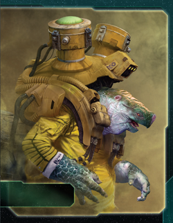

# Xxcha Kingdom Guide

---

## I. Introduction

The Xxcha Kingdom are TI4's ultimate defensive and political powerhouse. This faction excels at turtling behind impenetrable PDS networks, controlling agendas through Quash and political leverage, and expanding through Peace Accords (free planet acquisition). Xxcha isn't about aggression—it's about outlasting opponents through superior defense, patience, and political manipulation while they exhaust themselves fighting each other.

The payoff? Watching opponents realize they can't break through your SPACE CANNON coverage, seeing your Quash veto their victory-enabling agendas, and claiming abandoned planets for free via Peace Accords. When you've built an unkillable fortress and control the political landscape, victory comes through attrition and superior positioning.

## II. Playstyle

Playing Xxcha Kingdom is like being an immortal turtle with a veto stamp. Your Peace Accords lets you claim empty planets adjacent to yours without combat, your Quash ability discards bad agendas and forces re-rolls, and your PDS/flagship create layered defensive networks that make you nearly impossible to attack. You're not conquering the galaxy—you're building an impregnable position and controlling politics while others bleed resources fighting.

The key strength of Xxcha is control—you dictate WHEN fights happen (Diplomacy), WHAT agendas pass (Quash), and WHO expands WHERE (Peace Accords claims). Opponents waste resources on aggression; you accumulate points through patience and superior economy.

Opponents will avoid attacking you once they see your PDS network. That moment when they calculate the cost of attacking through 4 PDS and your flagship and decide it's not worth it? Pure defensive dominance.

---

## III. The Basics

### A. Home System & Commodities

**Home System:**
- **Archon Ren:** 2 resources / 3 influence = 2 optimal resources / 3 optimal influence
- **Archon Tau:** 1 resource / 1 influence = 1 optimal resource / 1 optimal influence
- **Total: 3 resources / 4 influence (3 optimal resources / 4 optimal influence)**

**Commodities:** 4

**Notes:** Influence-heavy home system (4 influence) perfect for political dominance and Diplomacy plays. The 3 resources are modest but sufficient. Two-planet home system is easier to defend than three-planet systems. Your 4 commodities make you an excellent trading partner.

### B. Starting Fleet

- 1 Carrier
- 2 Cruisers
- 3 Fighters
- 4 Infantry
- 1 Space Dock
- 1 PDS

**Notes:** Unique starting fleet with 2 cruisers (speed + combat power) and 1 PDS. The PDS gives you immediate defensive presence. 4 infantry enable solid R1 expansion. Your cruisers give you mobility (move 2) that most defensive factions lack.

### C. Starting Technologies

**Graviton Laser System (Yellow)** - When one or more of your units use SPACE CANNON against another player's ships, apply -1 to the result of each die roll. Your opponent may choose 1 of their ships that was hit to be destroyed. That player may destroy 1 of their other ships that was not hit instead.

**Notes:** Excellent starting tech. Makes your SPACE CANNON more deadly (effective -1 to opponent's rolls = easier to hit). Starts your PDS path—you already have 1 PDS, and Graviton makes it much better. Opens yellow tech paths.

### D. Faction Abilities

**Peace Accords (Faction Ability):** After you resolve the primary or secondary ability of the "Diplomacy" strategy card, you may gain control of 1 planet other than Mecatol Rex that does not contain any units and is in a system that is adjacent to a planet you control.

Free planet acquisition. Every time you resolve Diplomacy (primary or secondary), claim one empty planet adjacent to your territory. Over 5 rounds, this is 5-10 free planets without spending CCs or fighting. Incredible expansion ability.

**Quash (Faction Ability):** When an agenda is revealed, you may spend 1 token from your strategy pool to discard that agenda and reveal 1 agenda from the top of the deck. Players vote on this agenda instead.

Agenda veto. When an agenda is revealed, spend 1 strategy CC to discard it and draw a new one. This lets you fish for better agendas or veto terrible ones. Exceptional political control—you're vetoing 20-40% of all agendas over a game.

### E. Leaders

**Agent - Ggrocuto Rinn:**

ACTION: Exhaust this card to ready any planet; if that planet is in a system that is adjacent to a planet you control, you may remove 1 infantry from that planet and return it to its reinforcements.

Flexible economic agent. Ready any planet for economic boost (2-4 resources/influence), and if it's adjacent to your territory, remove an enemy infantry as a bonus. Use this to deny opponent ground forces or ready key planets for production/voting.

**Commander - Elder Qanoj:** *Unlock: Control planets that have a combined total of at least 12 influence.*

Each planet you exhaust to cast votes provides 1 additional vote. Game effects cannot prevent you from voting on an agenda.

Easy unlock with your influence-heavy home system (4) plus expansion. Once unlocked, every planet you exhaust for voting gives +1 vote—if you exhaust 5 planets with 10 influence total, you cast 15 votes instead of 10. Massive voting advantage. Additionally, you can ALWAYS vote (cannot be prevented).

**Hero - Xxekir Grom:** *Thunder's Edge Version* *Unlock: Have 3 scored objectives.* **Planetary Defense Nexus** - ACTION: Place any combination of up to 4 PDS or mechs onto planets you control, ready each planet that you place a unit on. Then, purge this card.

Powerful defensive hero. Place up to 4 PDS and/or mechs anywhere on your planets, then ready those planets. Use R4-R5 to instantly fortify 4 key planets (Mecatol Rex, border planets, legendary planets) with PDS for defensive coverage, then immediately use those planets for production/voting.

### F. Promissory Note - **Political Favor**

After an agenda is revealed: Remove 1 token from the Xxcha player's strategy pool and return it to his reinforcements. Then, discard the revealed agenda and reveal 1 agenda from the top of the deck. Players vote on this agenda instead. Then, return this card to the Xxcha player.

Your promissory is Quash for other players. They can discard an agenda and draw a new one. Trade value: 2-3 TG or political favors. Excellent political leverage—"I'll give you Political Favor if you vote my way" or trade for Alliance promissories.

### G. Alliance

When you produce ships, you may produce 1 additional fighter or infantry for its cost.

Standard production bonus. Useful for economic factions. Trade value: 3-4 TG or equivalent.

### H. Mech - **Indomitus**

Cost: 2 | Combat: 6 | **Sustain Damage** | **SPACE CANNON 8**

You may use this unit's SPACE CANNON against ships that are in adjacent systems.

Excellent defensive mech. SPACE CANNON 8 (hits on 8-10 = 30% hit rate) that can shoot at ADJACENT systems. Place mechs on border planets to create overlapping SPACE CANNON coverage with your PDS. Sustain Damage makes them durable in ground combat.

### I. Flagship - **Loncara Ssodu**

Cost: 8 | Combat: 7 (x2) | Move: 1 | Capacity: 3 | **Sustain Damage** | **SPACE CANNON 5 (x3)**

You may use this unit's SPACE CANNON against ships that are in adjacent systems.

Devastating flagship. SPACE CANNON 5 (x3) = 3 dice hitting on 5-10 (60% hit rate each) = average 1.8 hits before combat even starts. Can shoot at adjacent systems for area denial. Keep flagship with your main defensive fleet—opponents will avoid systems within 2 spaces of your flagship.

### J. Breakthrough - **Archon's Gift (Y<>G)**

You can spend influence as if it were resources. You can spend resources as if it were influence.

**Y<>G Synergy:** Yellow and green technologies count as each other for prerequisites.

**Ability:** All your planets become flexible—spend influence as resources and vice versa. This is incredibly powerful. Your 4-influence Archon Ren becomes 4-resources for production, or your resource planets become influence for voting. Removes all economic rigidity.

**Y<>G synergy:** Graviton Laser System (Y) counts as green, opening green tech paths. Very flexible tech progression.

**Strategic Value:** With Archon's Gift, you have effectively 7/7 home system (3R+4I can be spent as any combination). Late game with 10 planets (20 R/I total), you can spend all 20 as resources for massive production OR all 20 as influence for voting dominance.

### K. Slice and Draft Considerations

Xxcha is defensive and wants influence for political control:

**Speaker Order:**
- **Prefer positions 2-4** - Lets you grab Politics or Diplomacy early.
- **Avoid last position** - You want access to Diplomacy and Politics.

**Slice Priorities:**
- **Influence-heavy slice** - Your 4 influence at home + Commander voting makes you natural politician. Stack influence.
- **High planet count** - More planets = more Peace Accords targets and Commander voting power.
- **Tech skips (yellow/green ideal)** - Yellow skip accelerates PDS II, green skip speeds tech progression.
- **Defensive positioning** - Corner or edge slices with fewer aggressive neighbors.

**Slice Features to Avoid:**
- **Resource-starved slices** - You need resources for PDS/structure production. Don't go below 6-8 total resources.
- **Aggressive neighbor-heavy slices** - Being surrounded by 2-3 combat factions makes Peace Accords less effective.

**Summary:**
Xxcha wants influence for politics, resources for PDS production, and defensive positioning. Your Archon's Gift breakthrough makes resource/influence interchangeable, giving you massive economic flexibility.

---

## IV. Structural Weaknesses

### A. First Turn Priorities

Your R1 priority order: **Politics/Diplomacy > Trade > Technology**

Focus on:
1. **Politics** - Control speaker and agendas. This is your domain.
2. **Diplomacy** - Enables Peace Accords R1 and defensive system protection.
3. **Trade** - You have 4 commodities. Excellent trading economy.
4. **Technology** - Fourth priority. Begin tech path toward PDS II.

**Expansion Notes:** You have 1 carrier (capacity 4), 2 cruisers, and 4 infantry. Your cruisers give you speed (move 2) for expansion. Aim for 3-4 systems R1. Your 1 PDS should stay home for defense unless you're placing it forward as deterrent.

### B. Slow Offensive Capability

You're built for defense, not offense. Your units are standard (no combat bonuses), and your abilities reward turtling. Aggressive opponents will expand faster initially.

**Mitigation:** Use Peace Accords to claim planets others abandon. Let opponents fight each other, then claim the aftermath. Out-expand via free planets, not combat.

### C. Commander Unlock Requirement

Commander requires 12+ influence across your planets. With only 4 influence at home, you need to expand to 3-4 influence-heavy planets. This takes time (R2-R3 unlock realistically).

**Mitigation:** Prioritize influence planets during expansion. Use Peace Accords to claim influence-rich planets. Aim for Commander unlock R2-R3.

### D. PDS Network Cost

Building 4-6 PDS costs 12-18 resources. This is expensive infrastructure that doesn't score points directly. You need strong economy to support PDS spam while still scoring objectives.

**Mitigation:** Use Graviton Laser System + PDS II to make each PDS extremely cost-effective. Build PDS gradually (1-2 per round R2-R4). Prioritize placement on border planets and Mecatol Rex.

---

## V. Technology

### A. Overview

You start with **Graviton Laser System (Yellow)** (improve SPACE CANNON).

Your main tech path focuses on PDS II for defensive dominance, blue tech for mobility, or green/yellow for economic/political advantages depending on breakthrough acquisition.

### B. Tech Path 1: PDS Defense (Standard)

**Starting Tech:** Graviton Laser System (Y)

**Round 1: Sarween Tools (Y) OR Neural Motivator (G)**
- **Sarween Tools:** When you use PRODUCTION, reduce the combined cost of produced units by 1
  - **Why:** Economy boost for constant structure production. Saves 15-20 resources over game.
  - **Prerequisites:** None (0)
- **Neural Motivator:** You have +2 starting command counters
  - **Why:** More CCs for Quash usage and defensive activations.
  - **Prerequisites:** 1 green

**Round 2: PDS II (RY)**
- Planetary Shield | SPACE CANNON 5 | You may use this unit's SPACE CANNON against ships that are adjacent to this unit's system
- **Why:** Your core defensive tech. PDS II hits on 5+ (60% hit rate) with Graviton = effective 4+ (83% hit rate). Shoots adjacent systems for area denial.
- **Prerequisites:** 1 red + 1 yellow (need red tech + Graviton)

**Round 3: Gravity Drive (BB)**
- After you activate a system, apply +1 to the move value of 1 of your ships during this tactical action
- **Why:** Mobility for repositioning defensive fleets and reaching distant objectives.
- **Prerequisites:** 2 blue (need to pick up blue techs)

**Round 4: Carrier II (BBBB) OR Cruiser II (GGGB)**
- **Carrier II:** Cost 3 | Combat 9 | Move 2 | Capacity 6
  - **Prerequisites:** 2 blue + Gravity Drive
  - **Why:** Transport armies and provide mobile capacity.
- **Cruiser II:** Cost 2 | Combat 7 | Move 3 | CAPACITY 1
  - **Prerequisites:** 3 green + 1 blue (or with Y<>G synergy)
  - **Why:** Fast ships for mobility and screening.

**Round 5+:** Flex techs (Fleet Logistics, Nullification Field faction tech, etc.)

**Tech Requirements:**
- **Yellow skip (helpful):** Speeds Sarween acquisition
- **Red skip (very helpful):** Accelerates PDS II
- **Blue skip (helpful):** Enables faster Gravity Drive
- **Green skip (with Y<>G):** Opens tech flexibility

**Pros:**
- Early PDS II (R2) for defensive dominance
- Sarween reduces production costs (PDS cost 2, Sarween makes them 1 effective)
- Gravity Drive provides mobility R3
- Strong defensive core

**Cons:**
- Expensive infrastructure (PDS network costs 10-15 resources)
- Delays offensive capabilities

**Best For:** Most games. PDS II is Xxcha's signature—build 4-6 PDS for overlapping coverage and become unkillable.

---

### C. Tech Path 2: Economic/Political (with Archon's Gift)

**Starting Tech:** Graviton Laser System (Y)

**Round 1: Sarween Tools (Y) OR Psychoarchaeology (0)**
- **Psychoarchaeology:** When you resolve primary/secondary of Politics or Imperial, draw 1 action card
  - **Why:** Political tech synergizes with Quash and Commander voting. More action cards = more political leverage.

**Round 2: Instinct Training (G)**
- You may exhaust this card and spend 1 token from your strategy pool when another player plays an action card; cancel that action card
- **Why:** Your faction tech. Cancel opponent action cards for 1 CC. Excellent political defense (cancel Sabotage, Direct Hit, etc.).
- **Prerequisites:** 1 green (with Y<>G synergy from Graviton)

**Round 3: PDS II (RY)**
- PDS II is still mandatory for defense
- **Prerequisites:** 1 red + 1 yellow (Graviton + red tech)

**Round 4: Gravity Drive (BB)**
- Mobility for late game

**Round 5+:** Flex

**Pros:**
- Instinct Training gives you action card cancellation
- Psychoarchaeology boosts political action card hand
- Still gets PDS II R3
- Political control focus

**Cons:**
- Delays PDS II to R3
- Less defensive early

**Best For:** Political-heavy games with lots of agendas and action card plays.

---

## VI. Strategy Cards

### A. Round One

Your R1 priority is securing Politics or Diplomacy for your faction abilities.

**R1 Priority Ranking:**

1. **Politics** - Control speaker and agendas. Use Quash effectively.

2. **Diplomacy** - Enables Peace Accords R1 (free planet) and protects home system.

3. **Trade** - You have 4 commodities. Excellent trade economy.

4. **Leadership** - Command counters for Quash usage and expansion.

5. **Technology** - Tech progression toward PDS II.

6. **Construction** - Build structures for defense and objectives.

7. **Warfare** - Less useful for defensive Xxcha.

8. **Imperial** - Never R1.

### B. Generally (R2+)

**Love:**
- **Politics** - Control speaker, use Quash, draw action cards with Psychoarchaeology. Always take this when available.
- **Diplomacy** - Peace Accords free planets + system protection. With Commander unlocked, this becomes even better (ready multiple planets).
- **Trade** - Consistent economy from 4 commodities.

**Good:**
- **Leadership** - Command counters for Quash and defensive plays.
- **Construction** - Build PDS/structures for defensive network and objectives.
- **Technology** - Stay on tech path toward PDS II and mobility.
- **Imperial** - Needed for scoring R3-R5.

**Situational:**
- **Warfare** - Only if playing unexpectedly aggressive or needing redistribution.

---

## VII. Intermediate

### A. Unit Composition

Your ideal fleet composition in each system:

- **Flagship (Loncara Ssodu)** - SPACE CANNON 5 (x3) shoots adjacent systems. Core defensive anchor.
- **2-4 Cruisers** - Speed (move 2) and combat power for screening.
- **1 Carrier** - Capacity for ground forces.
- **2-4 Fighters** - Absorb hits.
- **Infantry + Mechs** - Ground forces with mech SPACE CANNON.
- **PDS on planets** - 4-6 PDS total across your territory.

Your defensive positioning is: **PDS on border planets → Flagship in key system → Cruisers screening → Mechs on planets with SPACE CANNON**. This creates 3-4 layers of SPACE CANNON before opponents reach your fleet.

**PDS Network Placement:**
1. Home system (keep starting PDS)
2. Border planets adjacent to aggressive neighbors
3. Mecatol Rex (if you control it)
4. Equidistant systems between opponents

### B. Point Planning

**Xxcha Kingdom Christmas-Land Strategy Cards:**

| Round | Card             | Public Points | Secret Points | MR Points | Bonus | Total |
|-------|------------------|---------------|---------------|-----------|-------|-------|
| One   | Politics         | 0             | 0             | 0         | 0     | 0     |
| Two   | Diplomacy        | 1             | 0             | 0         | 0     | 1     |
| Three | Imperial         | 3             | 1             | 1         | 0     | 5     |
| Four  | Politics         | 4             | 2             | 1         | 1     | 8     |
| Five  | Imperial         | 6             | 3             | 2         | 1     | 12    |

You can only score 1 public objective per round (2 if you have Imperial). When you take Imperial, you can double score publics. Aim to score all 3 secrets across the game.

**Notes:**
- Xxcha scores through patience and control objectives
- Politics R1/R4 for speaker + Quash control
- Diplomacy R2 for Peace Accords expansion
- Imperial R3/R5 for scoring windows
- Commander unlocks R2-R3 (12+ influence), boosting voting power

### C. Game Plan

**Strategic Approach:**

**Rounds 1-2: Build Defensive Core & Expand via Peace Accords**
- Take Politics R1 for speaker control
- Build 2-3 PDS by R2 (home + border planets)
- Use Peace Accords to claim 2-3 free planets (empty planets adjacent to yours)
- Research PDS II R2
- Unlock Commander R2-R3 (12+ influence across planets)

**Rounds 3-4: PDS Network Saturation & Political Control**
- Build 4-6 PDS total covering key systems
- Use Quash 2-3 times to veto terrible agendas
- Commander voting (each planet gives +1 vote when exhausted)
- Peace Accords continues claiming free planets
- Take Imperial R3 for scoring window

**Round 5: Hero Fortification & Victory Push**
- Hero R5: Place 4 PDS/mechs on key planets (Mecatol Rex, legendaries, border planets), ready those planets
- Use Archon's Gift to spend influence as resources for massive production
- Commander voting dominates final agendas
- Score final objectives via defensive positioning and planet control
- Win through attrition (opponents exhausted, you're unkillable)

**Key Strategic Principles:**
1. **Build 4-6 PDS** - Create overlapping SPACE CANNON coverage across territory
2. **Use Peace Accords** - Claim 5-8 free planets over the game without combat
3. **Unlock Commander R2-R3** - 12+ influence for voting dominance
4. **Use Quash liberally** - Veto 3-5 bad agendas per game
5. **Hero R5** - Place 4 PDS/mechs to fortify final position
6. **Play defensive** - Let opponents fight, claim planets they abandon, outlast everyone

---

## VIII. Objectives

### A. Stage I Objectives

| Stage I Objective                                                       | Status |
|-------------------------------------------------------------------------|--------|
| Erect a Monument (Spend 8 resources)                                    | 🟡     |
| Sway the Council (Spend 8 influence)                                    | 🟢     |
| Negotiate Trade Routes (Spend 5 trade goods)                            | 🟢     |
| Lead from the Front (Spend 3 tokens from tactic/strategy pools)         | 🟢     |
| Diversify Research (Own 2 tech in each of 2 colors)                     | 🟡     |
| Develop Weaponry (Own 2 unit upgrade technologies)                      | 🟡     |
| Found Research Outposts (Control 3 planets with tech specialties)       | 🔴     |
| Intimidate the Council (Ships in 2 systems adjacent to MR)              | 🟢     |
| Expand Borders (Control 6 planets in non-home systems)                  | 🟢     |
| Corner the Market (Control 4 planets with same trait)                   | 🟡     |
| Amass Wealth (Spend 3 influence, 3 resources, 3 trade goods)            | 🟢     |
| Build Defenses (Have 4 or more structures)                              | 🟢     |
| Discover Lost Outposts (Control 2 planets with attachments)             | 🔴     |
| Engineer a Marvel (Have flagship or war sun on board)                   | 🟢     |
| Explore Deep Space (Units in 3 systems without planets)                 | 🟢     |
| Improve Infrastructure (Structures on 3 planets outside HS)             | 🟢     |
| Make History (Units in 2 systems with legendary/MR/anomalies)           | 🟢     |
| Populate the Outer Rim (Units in 3 edge systems)                        | 🟢     |
| Push Boundaries (Control more planets than each neighbor)               | 🟢     |
| Raise a Fleet (5+ non-fighter ships in 1 system)                        | 🟡     |

**Legend:** 🟢 Easy | 🟡 Moderate | 🔴 Difficult

Xxcha excels at influence-spending (Sway the Council), structure objectives (Build Defenses, Improve Infrastructure), and control objectives (Expand Borders via Peace Accords).

### B. Secret Objectives

| Secret Objective                                                         | Status |
|--------------------------------------------------------------------------|--------|
| Unveil Flagship (Win space combat with flagship)                         | 🟡     |
| Turn their Fleets to Dust (SPACE CANNON destroy last ship)              | 🟢     |
| Destroy their Greatest Ship (Destroy war sun/flagship)                   | 🔴     |
| Spark a Rebellion (Win combat vs VP leader)                              | 🟡     |
| Threaten Enemies (Ships adjacent to another player's HS)                | 🟢     |
| Make an Example (BOMBARDMENT destroy last ground forces)                | 🔴     |
| Cut Supply Lines (Ships in system with enemy space dock)                | 🟢     |
| Monopolize Production (Control 4 industrial planets)                     | 🟡     |
| Mine Rare Minerals (Control 4 hazardous planets)                        | 🟡     |
| Forge an Alliance (Control 4 cultural planets)                          | 🟡     |
| Become a Martyr (Lose control of planet in home system)                 | 🔴     |
| Betray a Friend (Win combat vs player whose PN you have)                | 🟡     |
| Brave the Void (Win combat in anomaly)                                  | 🟡     |
| Darken the Skies (Win combat in another player's HS)                    | 🔴     |
| Defy Space and Time (Units in wormhole nexus)                           | 🟡     |
| Demonstrate your Power (3+ non-fighter ships after space combat)        | 🟢     |
| Destroy Heretical Works (Purge 2 relic fragments)                       | 🔴     |
| Dictate Policy (3+ laws in play)                                        | 🟢     |
| Drive the Debate (You/your planet elected by agenda)                    | 🟢     |
| Establish Hegemony (Control planets with 12+ influence)                 | 🟢     |
| Adapt New Strategies (Own 2 faction technologies)                       | 🟢     |
| Master the Laws of Physics (Own 4 tech of same color)                   | 🔴     |
| Form a Spy Network (Discard 5 action cards)                             | 🟡     |
| Gather a Mighty Fleet (Have 5 dreadnoughts)                             | 🔴     |
| Establish a Perimeter (Have 4 PDS on board)                             | 🟢     |
| Fuel the War Machine (Have 3 space docks)                               | 🟡     |
| Become the Gatekeeper (Ships in alpha and beta wormhole systems)        | 🟡     |
| Learn Secrets of the Cosmos (Ships in 3 systems adjacent to anomalies)  | 🟢     |
| Control the Region (Ships in 6 systems)                                 | 🟢     |
| Occupy the Seat of the Empire (Control MR with 3+ ships)                | 🟢     |
| Fight With Precision (AFB destroy last fighter)                         | 🔴     |
| Foster Cohesion (Be neighbors with all players)                         | 🟡     |
| Hoard Raw Materials (Control planets with 12+ resources)                | 🟡     |
| Mechanize the Military (1 mech on each of 4 planets)                    | 🟢     |
| Occupy the Fringe (9+ ground forces on planet without space dock)       | 🟡     |
| Produce en Masse (Units with PRODUCTION 8+ in single system)            | 🟡     |
| Prove Endurance (Last to pass)                                          | 🔴     |
| Seize an Icon (Control legendary planet)                                | 🟢     |
| Stake Your Claim (Control planet in contested system)                   | 🟡     |
| Strengthen Bonds (Have another player's PN)                             | 🟢     |

**Notes:**
- **Turn their Fleets to Dust (SPACE CANNON)** is EASY with 4-6 PDS and flagship
- **Establish a Perimeter (4 PDS)** is EASY—you naturally build 4-6 PDS
- **Dictate Policy and Drive the Debate** are EASY with Quash and Commander voting
- **Establish Hegemony (12+ influence)** is EASY with 4 influence home + expansion

### C. Stage II Objectives

| Stage II Objective                                                       | Status |
|--------------------------------------------------------------------------|--------|
| Centralize Galactic Trade (Spend 10 trade goods)                         | 🟢     |
| Found a Golden Age (Spend 16 resources)                                  | 🟡     |
| Galvanize the People (Spend 6 tokens from tactic/strategy pools)         | 🟢     |
| Manipulate Galactic Law (Spend 16 influence)                             | 🟢     |
| Hold Vast Reserves (Spend 6 influence, 6 resources, 6 trade goods)       | 🟢     |
| Command an Armada (Have 8+ non-fighter ships in 1 system)                | 🔴     |
| Achieve Supremacy (Flagship/War Sun in another player's HS or MR)        | 🟡     |
| Become a Legend (Units in 4 systems with legendary/MR/anomalies)         | 🟡     |
| Conquer the Weak (Control 1 planet in another player's HS)               | 🔴     |
| Rule Distant Lands (Control 2 planets in/adjacent to different players' HS) | 🔴     |
| Patrol Vast Territories (Units in 5 systems without planets)             | 🔴     |
| Control the Borderlands (Units in 5 edge systems not HS)                 | 🔴     |
| Subdue the Galaxy (Control 11 planets in non-home systems)               | 🟡     |
| Unify the Colonies (Control 6 planets with same trait)                   | 🔴     |
| Reclaim Ancient Monuments (Control 3 planets with attachments)           | 🔴     |
| Construct Massive Cities (Have 7+ structures)                            | 🟢     |
| Protect the Border (Structures on 5 planets outside HS)                  | 🟢     |
| Master of Sciences (Own 2 techs in each of 4 colors)                     | 🔴     |
| Revolutionize Warfare (Own 3 unit upgrade technologies)                  | 🟡     |

**Legend:** 🟢 Likely | 🟡 Possible | 🔴 Difficult

**Notes:**
- **Manipulate Galactic Law (16 influence)** is EASY with 4 influence home + Commander voting
- **Construct Massive Cities and Protect the Border** are EASY—you build 4-6 PDS + space docks
- **Hold Vast Reserves** is EASY with 4 commodities + Archon's Gift flexibility
- Xxcha struggles with aggressive conquest objectives

---

## IX. Alliance Priority

Trading for other factions' Alliance promissory notes (which give you access to their Commanders) can significantly boost your strategy. Here are the top alliances to prioritize:

**Super Top Tier:**
1. **Hacan (Carth of Golden Sands)** - After you roll dice for combat/SPACE CANNON/AFB, reroll any number. Excellent for improving PDS rolls and combat consistency.
2. **Titans of Ul (Tungstantus)** - When you use PRODUCTION, gain 1 trade good. You produce constantly (PDS, structures, fleets) = constant TG income.
3. **Nomad (Navarch Feng)** - Produce flagship without spending resources. Saves 8 resources for PDS production.
4. **Jol-Nar (Ta Zern)** - When units use PRODUCTION/AFB/BOMBARDMENT/SPACE CANNON, reroll any dice. Boosts your PDS network and production.

**Really Useful:**
5. **Empyrean (Xuange)** - After player moves ships into system with your tokens, return token. Useful for defensive plays.
6. **Nekro Virus (Nekro Acidos)** - After you gain tech, draw 1 action card. Boosts political hand.
7. **Xxcha's own Alliance (for others)** - Production bonus is valuable for economic factions.

---

## X. End Notes

Xxcha Kingdom is a top-tier defensive and political faction. Your job is to:

1. **Build 4-6 PDS covering your territory** - Overlapping SPACE CANNON coverage makes you unkillable
2. **Use Peace Accords to claim 5-8 free planets** - Every Diplomacy resolution = 1 free planet
3. **Unlock Commander R2-R3** - 12+ influence for voting dominance (+1 vote per planet)
4. **Use Quash 3-5 times per game** - Veto bad agendas, fish for better ones
5. **Hero R5** - Place 4 PDS/mechs to fortify final defensive position
6. **Control politics** - Quash + Commander voting + 4 commodities = agenda mastery
7. **Outlast opponents** - Let them fight, claim abandoned planets, win through attrition

Don't let anyone pressure you into aggression. You're the turtle, not the rabbit. Build your impenetrable fortress, control the political landscape, and win through patience and superior positioning.

**PEACE THROUGH SUPERIOR FIREPOWER.**
