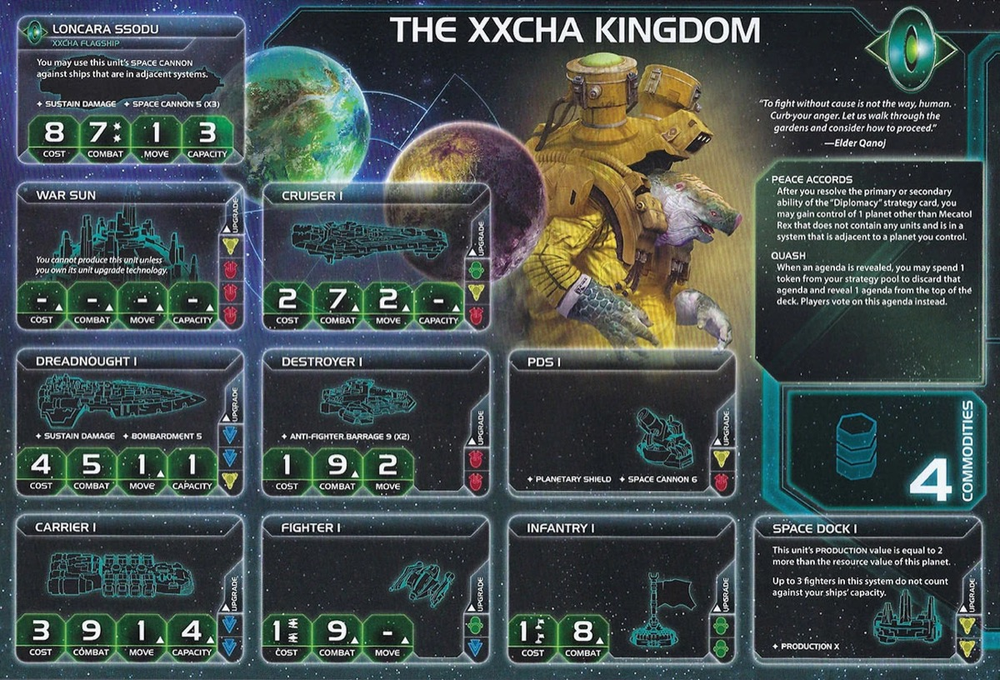

<nav class="page-nav">
<a href="../index.html" class="back-link">Back to Index</a>
<a href="Xxcha_Kingdom.md" download class="download-link" title="Plain text file - safe to download">Download .md</a>
</nav>

# Xxcha Kingdom Guide

## Contents

1. [Introduction](#i-introduction)
2. [Playstyle](#ii-playstyle)
3. [Faction Info and Drafting](#iii-faction-info-and-drafting)
   - [Home System & Commodities](#a-home-system--commodities) · [Starting Fleet](#b-starting-fleet) · [Faction Abilities](#c-faction-abilities) · [Technologies](#d-starting-and-faction-technologies) · [Leaders](#e-leaders) · [Promissory Note](#f-promissory-note---political-favor) · [Alliance](#g-alliance) · [Mech](#h-mech---indomitus) · [Flagship](#i-flagship---loncara-ssodu) · [Breakthrough](#j-breakthrough---archons-gift-yg) · [Slice and Draft](#k-slice-and-draft-considerations)
4. [Round 1 Problems and Faction Weakness](#iv-round-1-problems-and-faction-weakness)
   - [First Turn Priorities](#a-first-turn-priorities) · [Slow Offensive Capability](#b-slow-offensive-capability)
5. [Technology](#v-technology)
   - [Overview](#a-overview) · [Tech Path 1: Defensive](#b-tech-path-1-defensive) · [Tech Path 2: Offensive](#c-tech-path-2-offensive)
6. [Strategy Cards](#vi-strategy-cards)
   - [Round 1](#a-round-1) · [Round 2+](#b-round-2)
7. [Unit Composition and Game Plan](#vii-unit-composition-and-game-plan)
   - [Unit Composition](#a-unit-composition) · [Game Plan](#b-game-plan)
8. [Objectives](#viii-objectives)
   - [Objective Summary](#a-objective-summary) · [Stage I](#b-stage-i-objectives) · [Secret Objectives](#c-secret-objectives) · [Stage II](#d-stage-ii-objectives)
9. [Alliance Priority](#ix-alliance-priority)
10. [Bonus Game Elements](#x-bonus-game-elements)
    - [Action Cards](#a-high-value-action-cards) · [Relics](#b-relic-priorities) · [Agendas](#c-agenda-awareness)
11. [End Notes](#xi-end-notes)

---

## I. Introduction

The Xxcha Kingdom are the galaxy's most patient predators. While aggressive factions burn resources fighting over contested territory, you build an impenetrable defensive network and claim abandoned planets without spending command counters or fighting. While others struggle for political leverage, you veto harmful agendas and dominate votes through overwhelming influence. Xxcha doesn't conquer through force—you win by making yourself impossible to stop while controlling the political machinery that determines victory.

Your strength compounds over time. Your defensive network grows until attacking you becomes suicide. Your influence accumulates until you dictate every agenda outcome. Opponents eventually realize they can't break through your layered defenses, can't pass the agendas they need, and can't expand into the territory you've quietly absorbed. When you've built an unkillable fortress and seized control of the political landscape, victory becomes inevitable.

## II. Playstyle

Playing Xxcha Kingdom is like being an immortal turtle with a veto stamp. Your Peace Accords lets you claim empty planets adjacent to yours without combat, your Quash ability discards bad agendas and forces re-rolls, and your PDS/flagship create layered defensive networks that make you nearly impossible to attack. You're not conquering the galaxy—you're building an impregnable position and controlling politics while others bleed resources fighting.

The key strength of Xxcha is control—you dictate WHEN fights happen and WHAT agendas pass. Opponents waste resources on aggression; you accumulate points through patience and superior economy.

Opponents will avoid attacking you once they see your PDS network. That moment when they calculate the cost of attacking through your defenses and decide it's not worth it? That's Xxcha.

---

## III. Faction Info and Drafting

### A. Home System & Commodities

**Home System:**

- **Archon Ren:** 2 resources / 3 influence
- **Archon Tau:** 1 resource / 1 influence
- **Total: 3 resources / 4 influence (0.5 optimal resources / 3.5 optimal influence)**

**Commodities:** 4

Influence-heavy home system perfect for political dominance. 4 influence provides excellent token economy during action phase and supports your commander unlock requirement. 3 resources are modest but sufficient for early expansion and structure production. Two-planet home system is easier to defend than three-planet systems. 4 commodities make you an excellent trading partner.

### B. Starting Fleet

- 1 Carrier
- 2 Cruisers
- 3 Fighters
- 4 Infantry
- 1 Space Dock
- 1 PDS

Awkward starting fleet with limited carry capacity. 2 cruisers instead of another carrier makes expansion difficult—you're forced to rely on Peace Accords to compensate for weak early expansion. Starting PDS establishes defensive presence and forms the foundation of your SPACE CANNON network.

### C. Faction Abilities

**Peace Accords:** After you resolve the primary or secondary ability of the Diplomacy strategy card, you may gain control of 1 planet other than Mecatol Rex that does not contain any units and is in a system that is adjacent to a planet you control.

Peace Accords lets you claim empty planets adjacent to your territory when you resolve Diplomacy, without spending command counters or engaging in combat. Most valuable during early expansion when empty planets are available in your slice. Mid-game you might grab an additional planet opponents left uncontested. Planets with DMZ exploration cards (makes planet peaceful with no units) are prime targets for this ability.

**Quash:** When an agenda is revealed, you may spend 1 token from your strategy pool to discard that agenda and reveal 1 agenda from the top of the deck. Players vote on this agenda instead.

Quash lets you veto agendas by spending 1 strategy command counter to discard and draw a replacement. Rarely impactful and commonly feels too pricey—losing a strategy token is expensive. To use this effectively, someone needs to pay you for the lost token on top of getting their agenda quashed. Rarely valuable in practice.

### D. Starting and Faction Technologies

**Starting Technology:**

**Graviton Laser System (Y):** You may exhaust this card before 1 or more of your units use SPACE CANNON; hits produced by those units must be assigned to non-fighter ships if able.

Graviton Laser System bypasses fighter screens, forcing your SPACE CANNON hits to be assigned to enemy capital ships instead of expendable fighters. This is devastating against fleets that rely on fighters for protection—opponents can't just sacrifice cheap fighters to absorb your PDS fire. Combined with PDS II's improved hit rate and adjacent-system targeting, Graviton Laser System turns your defensive network into a capital ship killer. Opens yellow tech path for PDS II.

**Faction Technologies:**

**Instinct Training (G):** You may exhaust this card and spend 1 token from your strategy pool when another player plays an action card; cancel that action card.

Instinct Training gives you action card cancellation. By exhausting this technology and spending 1 strategy command counter, you can cancel any action card another player plays. This serves as a hard counter to game-changing action cards and provides exceptional defensive control throughout the game.

**Nullification Field (YY):** After another player activates a system that contains 1 or more of your ships, you may exhaust this card and spend 1 token from your strategy pool; immediately end that player's turn.

Nullification Field is a turn-ending defensive technology. When an opponent activates a system containing your ships, you can exhaust this technology and spend 1 strategy command counter to immediately end their entire turn. This denies them their tactical action, movement, and any combat or production they planned. Nullification Field is one of the most powerful defensive abilities in the game, capable of completely shutting down aggressive plays against your fleets.

### E. Leaders

**Agent - Ggrocuto Rinn:** ACTION: Exhaust this card to ready any planet; if that planet is in a system that is adjacent to a planet you control, you may remove 1 infantry from that planet and return it to its reinforcements.

Usually used on your own high-value planets for extra resources. Use early to fully fortify your slice—the readied planet gives you a head start on production or early spending objectives. Influence from readied planets only useful during action phase for Leadership secondary or influence objectives. Infantry removal on adjacent planets is a situational bonus for softening invasion targets.

**Commander - Elder Qanoj:** *Unlock: Control planets that have a combined total of at least 12 influence.* Each planet you exhaust to cast votes provides 1 additional vote. Game effects cannot prevent you from voting on an agenda.

Elder Qanoj unlocks easily with your influence-heavy home system providing 4 influence plus your natural expansion to influence-rich planets. Once unlocked, every planet you exhaust for voting provides 1 additional vote beyond its base influence value. Additionally, you can always vote on agendas regardless of any game effects that would normally prevent voting. This commander transforms you into a voting powerhouse during agenda phases, giving you massive political control.

**Hero - Xxekir Grom:** *Unlock: Have 3 scored objectives.* ACTION: Place any combination of up to 4 PDS or mechs onto planets you control, ready each planet that you place a unit on. Then, purge this card.

Xxekir Grom provides powerful defensive fortification. When activated, you place up to 4 PDS or mechs in any combination onto planets you control, then ready each planet that received a unit. Use this hero during critical rounds to instantly fortify key planets with PDS for defensive coverage, then immediately leverage those readied planets for production or voting. This hero is particularly effective for securing Mecatol Rex, fortifying border planets, or establishing defensive positions on legendary planets.

### F. Promissory Note - **Political Favor**

After an agenda is revealed: Remove 1 token from the Xxcha player's strategy pool and return it to his reinforcements. Then, discard the revealed agenda and reveal 1 agenda from the top of the deck. Players vote on this agenda instead. Then, return this card to the Xxcha player.

Political Favor lets another player use your Quash ability at your expense—they discard a revealed agenda and you lose a strategy token. Generally useless since you can just sell Quash usage directly when needed. Having Political Favor out means someone can trigger it at an inopportune time when you can't afford to lose the token. Keep it and negotiate Quash usage on a case-by-case basis instead.

### G. Alliance

Your Alliance promissory note gives another player access to Elder Qanoj's commander ability—+1 vote per exhausted planet and immunity to voting prevention effects. Decent for agenda phase dominance but usually not a priority for others to grab. You may need to add value to trade it for a better alliance in return. Look for allies who can help you control votes together, such as Empyrean or Argent Flight—creating a voting bloc that dictates agenda outcomes.

### H. Mech - **Indomitus**

Cost: 2 | Combat: 6 | **Sustain Damage** | **SPACE CANNON 8**

You may use this unit's SPACE CANNON against ships that are in adjacent systems.

Getting mechs out together with your PDS network turns your slice into a minefield. Each mech adds another adjacent-system SPACE CANNON source, creating overlapping defensive coverage that makes approaching your territory extremely costly.

### I. Flagship - **Loncara Ssodu**

Cost: 8 | Combat: 7 (x2) | Move: 1 | Capacity: 3 | **Sustain Damage** | **SPACE CANNON 5 (x3)**

You may use this unit's SPACE CANNON against ships that are in adjacent systems.

One of your main defensive tools before PDS network and Nullification Field come online. Position in the middle of your slice with a mech or two—opponents must consider getting their carriers blown up before battle even starts, losing all carried units in the process. Three dice at SPACE CANNON 5 hitting adjacent systems creates serious area denial.

### J. Breakthrough - **Archon's Gift (Y↔G)**

You can spend influence as if it were resources. You can spend resources as if it were influence.

**Y↔G Synergy:** Yellow and green technologies count as each other for prerequisites.

Helpful but not fantastic—most times you need both resources and influence anyway, and your 4 commodities usually even out imbalances. Sometimes has limited value. Main benefit is slice flexibility during draft. Y↔G synergy makes Graviton count as green for faction tech prerequisites.

### K. Slice and Draft Considerations

As a defensive and politically-oriented faction, Xxcha has specific priorities during galaxy setup and faction draft.

**Speaker Order:**

Not critical for Xxcha. In 6-player games, Diplomacy might not get picked if you grab something else early, which can make early game troublesome without Peace Accords. Getting top cards like Trade, Technology, or Leadership is always good. Your breakthrough is not critical in most cases.

**Slice Priorities:**

- Influence-heavy slices for commander unlock and voting dominance
- High planet count for commander voting power
- Defensive positioning with fewer aggressive neighbors

**Nice to Have:** Blue tech skip for Gravity Drive and Carrier II. Entropic Scar access for tech path flexibility.

**Avoid:** Complicated slices that require extra movement tech for early expansion.

---

## IV. Round 1 Problems and Faction Weakness

### A. First Turn Priorities

1. **Scoring** – No real catchup mechanics or strong fleet to grab Mecatol/Styx later
2. **Expansion/Production** – Claim planets and build fleet for economy and defense
3. **Technology** – Plasma Scoring enables R2 PDS II
4. **Breakthrough** – Not a priority until defensive infrastructure established

**R1 Expansion Notes:** Building at home is priority with Warfare secondary if Diplomacy is not picked—you prefer Diplomacy but people probably won't do you favors. Hope for a breakthrough-dependent faction in last positions who might pick it.

### B. Slow Offensive Capability

Your faction is built for defense rather than offense. Your units have standard combat values without bonuses, and your faction abilities reward defensive positioning and patience. Aggressive opponents will expand faster initially and may secure valuable territory before you can contest it.

---

## V. Technology

### A. Overview

You start with **Graviton Laser System (Yellow)** (forces SPACE CANNON hits onto non-fighters).

### B. Tech Path 1: Defensive

**R1:** Dark Energy Tap (B) – Explore frontier tokens after tactical actions, retreat to adjacent systems without units. Double cruiser explores offset poor starting fleet.

**R2:** Gravity Drive (B) – +1 move to 1 ship when activating a system. Fleet mobility for repositioning.

**R3:** Plasma Scoring – 1 additional die when using BOMBARDMENT or SPACE CANNON. Synergizes with mech and flagship.

**R4:** PDS II (RY) – Planetary Shield, SPACE CANNON 5, can shoot adjacent systems. Hero should be down by now for PDS placement.

**R5+:** Fleet Logistics (BB) – 2 actions per turn. Carrier II (BB) – Move 2, Capacity 6. Dreadnought II (BBY) – Move 2, BOMBARDMENT 5, immune to Direct Hit.

### C. Tech Path 2: Offensive

**R1:** Dark Energy Tap (B) – Explore frontier tokens after tactical actions. Double cruiser explores offset poor starting fleet.

**R2:** Gravity Drive (B) – +1 move to 1 ship. Fleet mobility.

**R3:** Carrier II (BB) – Move 2, Capacity 6.

**R4:** Fleet Logistics (BB) – 2 actions per turn.

**R5+:** Dreadnought II (BBY) – Move 2, BOMBARDMENT 5, immune to Direct Hit. Lightwave Deflector (BBB) – Move through systems with enemy ships.

If yellow skip, consider Nullification Field (YY) as flex tech for maximum safety.

---

## VI. Strategy Cards

### A. Round 1

1. **Trade** – Excellent flexibility, affords tech, breakthrough, and production most likely
2. **Technology** – DET for cruiser explores
3. **Diplomacy** – Peace Accords free planet + protection. People won't take it for you, high priority
4. **Construction** – Space dock + production to solve one capacity ship start
5. **Leadership** – Secondaries to follow, decent value but more in need of resources
6. **Politics** – Can sell speaker for a few TGs
7. **Warfare** – Not enough bang but can help fill out annoying slice
8. **Imperial** – Avoid in opening round

**Strategy Token Priority:** Warfare + Technology.

### B. Round 2+

**Love:**

- **Trade** - 4 commodities provide consistent economy. Flexibility for tech, production, and objectives.
- **Technology** - Continue tech path progression toward PDS II and blue upgrades.

**Like:**

- **Imperial** - Scoring is priority since no catchup mechanics. Hard to reach Mecatol.
- **Diplomacy** - Peace Accords free planet every time. Protection for key systems.
- **Politics** - Setup objectives, leverage your agenda power with commander.
- **Leadership** - Secondaries to follow.

**Situational:**

- **Construction** - PDS network and space docks when needed.
- **Warfare** - Fill out slice or redistribute fleet.

---

## VII. Unit Composition and Game Plan

### A. Unit Composition

- **Flagship (anchor)** - SPACE CANNON 5 (x3) hitting adjacent systems. Position mid-slice with mechs for area denial
- **PDS (network)** - Build across territory for overlapping SPACE CANNON coverage. Hero places 4 for free
- **Mechs (support)** - SPACE CANNON 8 hitting adjacent systems. Adds to defensive minefield
- **Infantry (protect)** - Protect PDS network from ground invasions
- **Carriers (transport)** - Capacity for ground forces. Upgrade to Carrier II for move 2
- **Fighters (absorb)** - Soak hits in combat
- **Dreadnoughts (late)** - Combat power if going offensive path

**Fleet Priority:** PDS network is your core defense. Flagship anchors mid-slice early before PDS II comes online. Mechs add overlapping SPACE CANNON coverage.

**Late Game Composition:** Extensive PDS network with flagship, mechs on key planets, dreadnoughts for combat power if offensive tech path.

### B. Game Plan

**Rounds 1-2: Expand and Economy**

Scoring is top priority—no catchup mechanics. Trade R1 for flexibility if available. Dark Energy Tap R1 enables double cruiser explores to offset poor starting fleet. Position flagship mid-slice with mechs for early area denial before PDS network comes online. Work toward 12 influence for commander unlock.

**Rounds 3-4: Hero and PDS Network**

PDS II online by R4. Activate hero to place 4 PDS/mechs on critical planets. Build out defensive network. Leverage commander for agenda dominance. Take Imperial for scoring.

**Round 5+: Victory Push**

PDS network makes you difficult to attack. Commander dominates agendas—use voting power to pass favorable laws and block opponents. Score through defensive positioning and planet control.

---

## VIII. Objectives

### A. Objective Summary

**Strengths:** Structure objectives are easy with PDS networks. All spending objectives are easy with breakthrough flexibility and 4 commodities.

**Weaknesses:** All control objectives are difficult—defensive playstyle means you don't expand aggressively. Combat objectives challenging.

### B. Stage I Objectives

| Stage I Objective                                                       | Status |
|-------------------------------------------------------------------------|--------|
| **Spendies** | |
| Develop Weaponry (Own 2 unit upgrade technologies)                      | 🟡     |
| Diversify Research (Own 2 tech in each of 2 colors)                     | 🟡     |
| Lead from the Front (Spend 3 tokens from tactic/strategy pools)         | 🟢     |
| Negotiate Trade Routes (Spend 5 trade goods)                            | 🟢     |
| Sway the Council (Spend 8 influence)                                    | 🟢     |
| **Control** | |
| Expand Borders (Control 6 planets in non-home systems)                  | 🔴     |
| Push Boundaries (Control more planets than each neighbor)               | 🔴     |
| **Ships in Systems** | |
| Amass Wealth (Spend 3 influence, 3 resources, 3 trade goods)            | 🟢     |
| Discover Lost Outposts (Control 2 planets with attachments)             | 🔴     |
| Engineer a Marvel (Have flagship or war sun on board)                   | 🟢     |
| Explore Deep Space (Units in 3 systems without planets)                 | 🟡     |
| Intimidate the Council (Ships in 2 systems adjacent to MR)              | 🟡     |
| Make History (Units in 2 systems with legendary/MR/anomalies)           | 🟡     |
| Populate the Outer Rim (Units in 3 edge systems)                        | 🔴     |
| Raise a Fleet (5+ non-fighter ships in 1 system)                        | 🟢     |
| **Tech** | |
| Corner the Market (Control 4 planets with same trait)                   | 🔴     |
| Found Research Outposts (Control 3 planets with tech specialties)       | 🔴     |
| **Structure** | |
| Build Defenses (Have 4 or more structures)                              | 🟢     |
| Erect a Monument (Spend 8 resources)                                    | 🟢     |
| Improve Infrastructure (Structures on 3 planets outside HS)             | 🟢     |

**Legend:** 🟢 Likely | 🟡 Possible | 🔴 Difficult

### C. Secret Objectives

| Secret Objective                                                         | Status |
|--------------------------------------------------------------------------|--------|
| **Combat** | |
| Become a Martyr (Lose control of planet in home system)                 | 🔴     |
| Betray a Friend (Win combat vs player whose PN you have)                | 🟢     |
| Brave the Void (Win combat in anomaly)                                  | 🟢     |
| Darken the Skies (Win combat in another player's HS)                    | 🔴     |
| Demonstrate your Power (3+ non-fighter ships after space combat)        | 🟢     |
| Destroy their Greatest Ship (Destroy war sun/flagship)                   | 🔴     |
| Fight With Precision (AFB destroy last fighter)                         | 🔴     |
| Make an Example (BOMBARDMENT destroy last ground forces)                | 🔴     |
| Spark a Rebellion (Win combat vs VP leader)                              | 🟡     |
| Turn their Fleets to Dust (SPACE CANNON destroy last ship)              | 🟢     |
| **Ships in Systems** | |
| Become the Gatekeeper (Ships in alpha and beta wormhole systems)        | 🟡     |
| Cut Supply Lines (Ships in system with enemy space dock)                | 🟡     |
| Forge an Alliance (Control 4 cultural planets)                          | 🔴     |
| Occupy the Seat of the Empire (Control MR with 3+ ships)                | 🔴     |
| Threaten Enemies (Ships adjacent to another player's HS)                | 🟡     |
| **Control** | |
| Adapt New Strategies (Own 2 faction technologies)                       | 🔴     |
| Defy Space and Time (Units in wormhole nexus)                           | 🟡     |
| Establish Hegemony (Control planets with 12+ influence)                 | 🟢     |
| Hoard Raw Materials (Control planets with 12+ resources)                | 🟡     |
| Learn Secrets of the Cosmos (Ships in 3 systems adjacent to anomalies)  | 🟡     |
| Mine Rare Minerals (Control 4 hazardous planets)                        | 🔴     |
| Monopolize Production (Control 4 industrial planets)                     | 🔴     |
| Seize an Icon (Control legendary planet)                                | 🔴     |
| **Tech** | |
| Master the Laws of Physics (Own 4 tech of same color)                   | 🔴     |
| Unveil Flagship (Win space combat with flagship)                         | 🟡     |
| **Structure/Units** | |
| Establish a Perimeter (Have 4 PDS on board)                             | 🟢     |
| Fuel the War Machine (Have 3 space docks)                               | 🟢     |
| Mechanize the Military (1 mech on each of 4 planets)                    | 🟢     |
| Occupy the Fringe (9+ ground forces on planet without space dock)       | 🔴     |
| **Other** | |
| Control the Region (Ships in 6 systems)                                 | 🟡     |
| Destroy Heretical Works (Purge 2 relic fragments)                       | 🔴     |
| Dictate Policy (3+ laws in play)                                        | 🟢     |
| Drive the Debate (You/your planet elected by agenda)                    | 🟢     |
| Form a Spy Network (Discard 5 action cards)                             | 🟡     |
| Foster Cohesion (Be neighbors with all players)                         | 🟢     |
| Gather a Mighty Fleet (Have 5 dreadnoughts)                             | 🔴     |
| Produce en Masse (Units with PRODUCTION 8+ in single system)            | 🔴     |
| Prove Endurance (Last to pass)                                          | 🔴     |
| Stake Your Claim (Control planet in contested system)                   | 🔴     |
| Strengthen Bonds (Have another player's PN)                             | 🟢     |

🟢 Likely | 🟡 Possible | 🔴 Difficult

### D. Stage II Objectives

| Stage II Objective                                                       | Status |
|--------------------------------------------------------------------------|--------|
| **Spendies** | |
| Centralize Galactic Trade (Spend 10 trade goods)                         | 🟢     |
| Found a Golden Age (Spend 16 resources)                                  | 🟢     |
| Galvanize the People (Spend 6 tokens from tactic/strategy pools)         | 🟢     |
| Manipulate Galactic Law (Spend 16 influence)                             | 🟢     |
| **Control** | |
| Conquer the Weak (Control 1 planet in another player's HS)               | 🔴     |
| Hold Vast Reserves (Spend 6 influence, 6 resources, 6 trade goods)       | 🟢     |
| Subdue the Galaxy (Control 11 planets in non-home systems)               | 🔴     |
| **Ships in Systems** | |
| Achieve Supremacy (Flagship/War Sun in another player's HS or MR)        | 🔴     |
| Command an Armada (Have 8+ non-fighter ships in 1 system)                | 🟡     |
| Control the Borderlands (Units in 5 edge systems not HS)                 | 🔴     |
| Patrol Vast Territories (Units in 5 systems without planets)             | 🔴     |
| Rule Distant Lands (Control 2 planets in/adjacent to different players' HS) | 🔴     |
| **Tech** | |
| Master of Sciences (Own 2 techs in each of 4 colors)                     | 🔴     |
| Revolutionize Warfare (Own 3 unit upgrade technologies)                  | 🟡     |
| Unify the Colonies (Control 6 planets with same trait)                   | 🔴     |
| **Structure** | |
| Become a Legend (Units in 4 systems with legendary/MR/anomalies)         | 🔴     |
| Construct Massive Cities (Have 7+ structures)                            | 🟢     |
| Protect the Border (Structures on 5 planets outside HS)                  | 🟢     |
| Reclaim Ancient Monuments (Control 3 planets with attachments)           | 🔴     |
| Form Galactic Brain Trust (Control 5 planets with tech specialties)      | 🔴     |

🟢 Likely | 🟡 Possible | 🔴 Difficult

---

## IX. Alliance Priority

Trading for other factions' Alliance promissory notes grants you access to their commanders, potentially boosting your strategy significantly.

**Top Tier:**

1. **Crimson Rebellion (Ahk Siever)** – At end of combat, gain commodity/TG. Passive income from table aggression.

2. **Nomad (Navarch Feng)** – Produce flagship without spending resources. Saves 8 resources on Loncara Ssodu.

3. **Deepwrought Scholarate (Aello)** – When others research tech, gain commodity/TG if they take -1 discount. Passive income.

4. **Muaat (Magmus)** – Gain 1 TG after spending strategy token. Synergizes with Quash usage.

5. **Jol-Nar (Ta Zern)** – Reroll SPACE CANNON, AFB, and BOMBARDMENT dice. Improves PDS hit rates.

**Good:**

6. **Empyrean (Xuange)** – Return command token when opponents move into systems with your tokens. Late game slaying tool.

7. **Argent Flight (Trrakan Aun Zulok)** – Roll 1 additional die for SPACE CANNON, AFB, BOMBARDMENT. Extra die per PDS.

8. **Nekro Virus (Nekro Acidos)** – Draw 1 action card after gaining technology. Builds your hand.

9. **Winnu (Rickar Rickani)** – Apply +2 combat in MR, home system, and legendary planet systems. Defensive boost in key locations.

10. **Yin Brotherhood (Brother Omar)** – Green prereq + skip prereqs when researching others' tech. Tech path flexibility, green skip synergizes with Y↔G breakthrough.

---

## X. Bonus Game Elements

This section highlights action cards that synergize particularly well with your faction's strengths or mitigate your weaknesses, relics that offer exceptional value for your faction's strategy and abilities, and agendas to pursue that benefit your position, and agendas to watch out for that could hurt you.

### A. High-Value Action Cards

### B. Relic Priorities

### C. Agenda Awareness

---

## XI. End Notes

Xxcha Kingdom is TI4's defensive and political powerhouse. You build impenetrable positions while others bleed resources fighting, then dominate the agenda phase with overwhelming voting power.

Early game feels awkward with limited carry capacity. Offset this with Dark Energy Tap double cruiser explores and Peace Accords free planets. Position flagship mid-slice with mechs for area denial before your PDS network comes online. Unlock Elder Qanoj R2-R3 by controlling 12+ influence for voting dominance.

Deploy your hero R3-R4 to place 4 PDS/mechs and establish your defensive network. Once PDS II is online, your slice becomes a minefield. Opponents calculate the cost of attacking through your defenses and decide it's not worth it.

Don't let opponents pressure you into premature aggression. You're the turtle, not the rabbit. Build your fortress, control the political landscape, and win through patience.

**PEACE THROUGH POLITICAL SPACE CANNON.**
