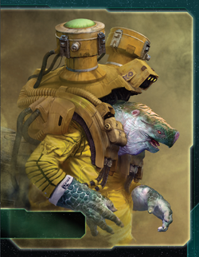

[← Back to Index](../index.html)

# Xxcha Kingdom Guide

---

## I. Introduction

The Xxcha Kingdom are the galaxy's most patient predators. While aggressive factions burn resources fighting over contested territory, you build an impenetrable defensive network and claim abandoned planets without spending command counters or fighting. While others struggle for political leverage, you veto harmful agendas and dominate votes through overwhelming influence. Xxcha doesn't conquer through force—you win by making yourself impossible to stop while controlling the political machinery that determines victory.

Your strength compounds over time. Your defensive network grows until attacking you becomes suicide. Your influence accumulates until you dictate every agenda outcome. Opponents eventually realize they can't break through your layered defenses, can't pass the agendas they need, and can't expand into the territory you've quietly absorbed. When you've built an unkillable fortress and seized control of the political landscape, victory becomes inevitable.

## II. Playstyle

Playing Xxcha Kingdom is like being an immortal turtle with a veto stamp. Your Peace Accords lets you claim empty planets adjacent to yours without combat, your Quash ability discards bad agendas and forces re-rolls, and your PDS/flagship create layered defensive networks that make you nearly impossible to attack. You're not conquering the galaxy—you're building an impregnable position and controlling politics while others bleed resources fighting.

The key strength of Xxcha is control—you dictate WHEN fights happen and WHAT agendas pass. Opponents waste resources on aggression; you accumulate points through patience and superior economy.

Opponents will avoid attacking you once they see your PDS network. That moment when they calculate the cost of attacking through your defenses and decide it's not worth it? That's Xxcha.

---

## III. The Basics

### A. Home System & Commodities

**Home System:**
- **Archon Ren:** 2 resources / 3 influence
- **Archon Tau:** 1 resource / 1 influence
- **Total: 3 resources / 4 influence (2.5 optimal resources / 3.5 optimal influence)**

**Commodities:** 4

Influence-heavy home system perfect for political dominance. 4 influence provides excellent token economy during action phase and supports your commander unlock requirement. 3 resources are modest but sufficient for early expansion and structure production. Two-planet home system is easier to defend than three-planet systems. 4 commodities make you an excellent trading partner.

### B. Starting Fleet

- 1 Carrier
- 2 Cruisers
- 3 Fighters
- 4 Infantry
- 1 Space Dock
- 1 PDS

Unique starting fleet with 2 cruisers providing mobility (move 2) that most defensive factions lack. Starting PDS immediately establishes defensive presence and forms the foundation of your SPACE CANNON network. 4 infantry enable solid expansion in the opening round.

### C. Faction Abilities

**Peace Accords:** After you resolve the primary or secondary ability of the Diplomacy strategy card, you may gain control of 1 planet other than Mecatol Rex that does not contain any units and is in a system that is adjacent to a planet you control.

Peace Accords is your free planet acquisition engine. Every time you resolve Diplomacy, whether as the primary player or through the secondary ability, you claim one empty planet adjacent to your territory without spending command counters or engaging in combat. Over a typical game, this translates to claiming numerous free planets, massively expanding your territorial control and economic base. This ability transforms Diplomacy from a situational card into a must-take strategy for Xxcha.

**Quash:** When an agenda is revealed, you may spend 1 token from your strategy pool to discard that agenda and reveal 1 agenda from the top of the deck. Players vote on this agenda instead.

Quash gives you an agenda veto. When any agenda is revealed during the agenda phase, you can spend 1 strategy command counter to discard it and draw a replacement from the deck. This exceptional political control lets you fish for favorable agendas or veto terrible ones that would harm your position. You can use Quash multiple times per agenda phase if you have the strategy tokens available, giving you unprecedented control over the political landscape of the game.

### D. Starting and Faction Technologies

**Starting Technology:**

**Graviton Laser System (Y):** When one or more of your units use SPACE CANNON against another player's ships, apply -1 to the result of each die roll. Your opponent may choose 1 of their ships that was hit to be destroyed. That player may destroy 1 of their other ships that was not hit instead.

Graviton Laser System is an excellent starting technology that makes your SPACE CANNON abilities significantly more deadly. The -1 modifier to each die roll means you hit more frequently, and the forced hit allocation gives you tactical flexibility. Since you start with a PDS, this technology immediately enhances your defensive capabilities. Graviton also opens yellow technology paths, giving you access to important economic and utility technologies throughout the game.

**Faction Technologies:**

**Instinct Training (G):** You may exhaust this card and spend 1 token from your strategy pool when another player plays an action card; cancel that action card.

Instinct Training gives you action card cancellation. By exhausting this technology and spending 1 strategy command counter, you can cancel any action card another player plays. This serves as a hard counter to game-changing action cards and provides exceptional defensive control throughout the game.

**Nullification Field (YY):** After another player activates a system that contains 1 or more of your ships, you may exhaust this card and spend 1 token from your strategy pool; immediately end that player's turn.

Nullification Field is a turn-ending defensive technology. When an opponent activates a system containing your ships, you can exhaust this technology and spend 1 strategy command counter to immediately end their entire turn. This denies them their tactical action, movement, and any combat or production they planned. Nullification Field is one of the most powerful defensive abilities in the game, capable of completely shutting down aggressive plays against your fleets.

### E. Leaders

**Agent - Ggrocuto Rinn:** ACTION: Exhaust this card to ready any planet; if that planet is in a system that is adjacent to a planet you control, you may remove 1 infantry from that planet and return it to its reinforcements.

Ggrocuto Rinn is a flexible economic and tactical agent. You can exhaust this agent to ready any planet, providing an immediate economic boost of resources or influence for production or voting. If the planet is adjacent to your territory, you can also remove an enemy infantry from that planet as a bonus effect. Use this agent to ready key planets for critical production or voting turns, or to deny opponent ground forces from contested border planets.

**Commander - Elder Qanoj:** *Unlock: Control planets that have a combined total of at least 12 influence.* Each planet you exhaust to cast votes provides 1 additional vote. Game effects cannot prevent you from voting on an agenda.

Elder Qanoj unlocks easily with your influence-heavy home system providing 4 influence plus your natural expansion to influence-rich planets. Once unlocked, every planet you exhaust for voting provides 1 additional vote beyond its base influence value. Additionally, you can always vote on agendas regardless of any game effects that would normally prevent voting. This commander transforms you into a voting powerhouse during agenda phases, giving you massive political control.

**Hero - Xxekir Grom:** *Unlock: Have 3 scored objectives.* ACTION: Place any combination of up to 4 PDS or mechs onto planets you control, ready each planet that you place a unit on. Then, purge this card.

Xxekir Grom provides powerful defensive fortification. When activated, you place up to 4 PDS or mechs in any combination onto planets you control, then ready each planet that received a unit. Use this hero during critical rounds to instantly fortify key planets with PDS for defensive coverage, then immediately leverage those readied planets for production or voting. This hero is particularly effective for securing Mecatol Rex, fortifying border planets, or establishing defensive positions on legendary planets.

### F. Promissory Note - **Political Favor**

After an agenda is revealed: Remove 1 token from the Xxcha player's strategy pool and return it to his reinforcements. Then, discard the revealed agenda and reveal 1 agenda from the top of the deck. Players vote on this agenda instead. Then, return this card to the Xxcha player.

Political Favor functions as your Quash ability for other players. When they play this promissory note, they can discard a revealed agenda and draw a replacement, giving them the same powerful veto capability you wield. This promissory note has excellent trade value and provides exceptional political leverage—you can negotiate agenda votes by offering Political Favor, or trade it for Alliance promissories and other valuable deals.

### G. Alliance

When you produce ships, you may produce 1 additional fighter or infantry for its cost.

Your Alliance promissory note provides a production bonus, allowing the holder to produce 1 additional fighter or infantry for its cost when producing ships. This is a standard production bonus that has moderate trade value and is particularly useful for economic factions building large fleets.

### H. Mech - **Indomitus**

Cost: 2 | Combat: 6 | **Sustain Damage** | **SPACE CANNON 8**

You may use this unit's SPACE CANNON against ships that are in adjacent systems.

Indomitus is an excellent defensive mech that extends your SPACE CANNON network. With SPACE CANNON 8 that can target ships in adjacent systems, each mech you place on border planets creates overlapping coverage with your PDS units. The Sustain Damage ability makes your mechs durable in ground combat, allowing them to absorb hits and protect your planets. Deploy mechs strategically on border planets to create layered defensive zones that deter enemy fleets from approaching your territory.

### I. Flagship - **Loncara Ssodu**

Cost: 8 | Combat: 7 (x2) | Move: 1 | Capacity: 3 | **Sustain Damage** | **SPACE CANNON 5 (x3)**

You may use this unit's SPACE CANNON against ships that are in adjacent systems.

Loncara Ssodu is a devastating defensive flagship. With SPACE CANNON 5 rolling three dice, your flagship delivers punishing pre-combat damage before space battles even begin. The ability to shoot at adjacent systems creates massive area denial—opponents will avoid systems within range of your flagship. Keep this flagship positioned with your main defensive fleet to anchor your territorial control and force opponents to route around your defensive network.

### J. Breakthrough - **Archon's Gift (Y<>G)**

You can spend influence as if it were resources. You can spend resources as if it were influence.

**Y<>G Synergy:** Yellow and green technologies count as each other for prerequisites.

Archon's Gift is an incredibly powerful breakthrough that removes all economic rigidity from your planets. With this breakthrough, all your planets become completely flexible—you can spend influence as resources for production, or spend resources as influence for voting. Your influence-heavy planets can suddenly fund massive production runs, while resource planets can provide voting power during critical agenda phases.

The Y<>G synergy provides exceptional tech path flexibility. Your starting Graviton Laser System counts as both yellow and green for prerequisites, opening multiple technology progression paths. This makes it significantly easier to research both your faction technologies and important unit upgrades.

The strategic value of Archon's Gift cannot be overstated. With this breakthrough, your home system effectively becomes flexible, allowing you to leverage all your economic output for whatever purpose is most critical at any given moment. In the late game with extensive planetary control, you can redirect your entire economic base toward production or politics as the situation demands.

### K. Slice and Draft Considerations

As a defensive and politically-oriented faction, Xxcha has specific priorities during galaxy setup and faction draft.

**Speaker Order:**

Prefer speaker positions 2-4 during the draft. These positions allow you to grab Politics or Diplomacy early in the strategy card selection phase, which are critical cards for your faction abilities. Avoid taking last position in speaker order, as you want reliable access to Diplomacy for Peace Accords and Politics for agenda control.

**Slice Priorities:**

Prioritize influence-heavy slices that complement your political strengths. Your 4 influence home system combined with Elder Qanoj's commander ability makes you a natural politician, so stacking additional influence planets amplifies this advantage. Look for slices with high planet counts, as more planets create more targets for Peace Accords expansion and increase your voting power through the commander.

Seek technology specialties, particularly yellow and green skips. Yellow specialties accelerate your path to PDS II, while green specialties speed your access to Instinct Training and other important technologies. Defensive positioning is valuable—corner or edge slices with fewer aggressive neighbors allow your Peace Accords to claim more empty planets and reduce the military pressure on your borders.

**Features to Avoid:**

Avoid resource-starved slices. While you're influence-focused, you still need adequate resources for PDS and structure production. Avoid slices with total resources below a reasonable threshold. Similarly, being surrounded by multiple aggressive combat factions reduces the effectiveness of Peace Accords, as there will be fewer empty planets to claim adjacent to your territory.

Xxcha wants influence for politics, resources for PDS production, and defensive positioning. Your Archon's Gift breakthrough makes resource and influence interchangeable, giving you massive economic flexibility regardless of your slice composition.

---

## IV. Structural Weaknesses

### A. First Turn Priorities

Your opening round priorities differ from typical aggressive factions due to your defensive and political focus.

**Expansion and Production** should be your primary focus. Use your carrier, 2 cruisers, and 4 infantry to expand to multiple systems. Your cruisers provide excellent mobility with their move 2 capability, allowing you to claim distant or valuable systems. Prioritize influence-heavy planets that accelerate your path to the Elder Qanoj commander unlock while building political dominance. Begin building PDS units gradually to establish the foundation of your defensive network.

**Technology** is your secondary priority. Begin working toward PDS II, which requires red and yellow prerequisites. Your starting Graviton Laser System opens the yellow technology path. Securing PDS II in the early game creates the defensive zones that define your faction strategy.

**Scoring** objectives is acceptable if political or influence objectives are available, but your true strength emerges in the mid-to-late game once your PDS network is established and your commander is unlocked. You can afford to defer major scoring until your defensive infrastructure is in place.

**Breakthrough** technologies are not a priority in the opening round. Focus on PDS II and reaching the commander unlock threshold before pursuing breakthrough technologies. Your defensive network requires this foundational infrastructure to function effectively.

You have 1 carrier with capacity 4, 2 cruisers with move 2, and 4 infantry for expansion. Aim to claim multiple systems in the opening round. Your starting PDS typically should remain in your home system for defense unless you're placing it forward as a deterrent on a key border planet.

### B. Slow Offensive Capability

Your faction is built for defense rather than offense. Your units have standard combat values without bonuses, and your faction abilities reward defensive positioning and patience. Aggressive opponents will expand faster initially and may secure valuable territory before you can contest it.

Mitigate this weakness by leveraging Peace Accords to claim planets that opponents abandon or leave uncontested. Let aggressive factions fight each other over contested territory, then use Peace Accords to claim the planets they leave behind. You out-expand through free planets rather than combat victories.

### C. Commander Unlock Requirement

Your commander requires controlling planets with a combined total of at least 12 influence. With only 4 influence in your home system, you need to expand to several influence-rich planets to reach this threshold. Realistically, this unlock occurs in the second or third round rather than immediately.

Mitigate this by prioritizing influence planets during expansion. Use Peace Accords strategically to claim influence-rich planets that become available. Aim to unlock Elder Qanoj during the second or third round to activate your voting dominance when agenda phases become more critical.

### D. PDS Network Cost

Building an extensive PDS network is expensive. Producing multiple PDS units requires significant resource investment in infrastructure that doesn't directly score objectives. You need a strong economy to support PDS production while simultaneously pursuing victory points.

Mitigate this through efficient technology choices. Graviton Laser System combined with PDS II makes each PDS extremely cost-effective, maximizing the defensive value of each unit. Build your PDS network gradually rather than all at once, producing units over multiple rounds. Prioritize placement on border planets and critical locations like Mecatol Rex to get maximum defensive coverage from minimal units.

---

## V. Technology

### A. Overview

You start with **Graviton Laser System (Yellow)** (improve SPACE CANNON).

Your main tech path focuses on PDS II for defensive dominance, blue tech for mobility, or green/yellow for economic/political advantages depending on breakthrough acquisition.

### B. Tech Path 1: PDS Defense (Standard)

This is the standard technology path that emphasizes your defensive strengths through rapid PDS II acquisition.

**Round 1:** Research Sarween Tools or Neural Motivator. Sarween Tools reduces the combined cost of produced units by 1 when you use PRODUCTION, providing an economy boost that saves significant resources over the course of the game. Alternatively, Neural Motivator provides +2 starting command counters, giving you more command tokens for Quash usage and defensive activations. Both technologies have no prerequisites.

**Round 2:** Research PDS II (RY). This is your core defensive technology. PDS II provides Planetary Shield, improves SPACE CANNON to 5+, and allows your PDS to shoot at ships in adjacent systems. Combined with Graviton Laser System, your PDS become formidable defensive weapons with excellent hit rates and extended range for area denial. This technology requires 1 red and 1 yellow prerequisite.

**Round 3:** Research Gravity Drive (B). This blue technology provides +1 to the move value of one of your ships during tactical actions, giving you mobility for repositioning defensive fleets and reaching distant objectives. It requires 1 blue prerequisite.

**Round 4:** Research Carrier II (BB) or Cruiser II (GYR). Carrier II provides improved transport capacity and combat capability, requiring 2 blue prerequisites. Cruiser II offers fast movement and screening capabilities, requiring 1 green, 1 yellow, and 1 red prerequisite. Choose based on your fleet composition needs and available technology specialties.

**Round 5 and Beyond:** Research flex technologies such as Fleet Logistics, Nullification Field (your faction tech), or other situational technologies based on game state.

This path benefits from technology specialties. Yellow skips speed Sarween Tools acquisition, red skips accelerate PDS II research, blue skips enable faster Gravity Drive, and green skips (combined with Y<>G synergy from Archon's Gift) open additional technology flexibility.

This path excels at establishing early defensive dominance through PDS II. Sarween Tools reduces your infrastructure costs significantly, and Gravity Drive provides mobility. However, the path requires expensive infrastructure investment and delays offensive capabilities.

This technology path is best for most games. PDS II is Xxcha's signature technology, and building extensive PDS coverage makes you extremely difficult to attack.

---

### C. Tech Path 2: Economic/Political (with Archon's Gift)

This alternative technology path emphasizes political control and action card management, particularly effective when you acquire the Archon's Gift breakthrough.

**Round 1:** Research Sarween Tools or Psychoarchaeology. Psychoarchaeology allows you to draw 1 action card when you resolve the primary or secondary ability of Politics or Imperial. This political technology synergizes excellently with Quash and Elder Qanoj's commander ability, giving you more action cards for political leverage and control.

**Round 2:** Research Instinct Training (G). This is your faction technology that allows you to cancel opponent action cards by exhausting this card and spending 1 strategy command counter. This provides excellent political defense against game-changing action cards. With Y<>G synergy from Archon's Gift, Graviton Laser System counts as the green prerequisite, making this technology accessible early.

**Round 3:** Research PDS II (RY). Despite the political focus of this path, PDS II remains mandatory for establishing your defensive network. This technology requires 1 red and 1 yellow prerequisite.

**Round 4:** Research Gravity Drive (B) for mobility in the late game.

**Round 5 and Beyond:** Research flex technologies based on game needs.

This path provides action card cancellation through Instinct Training and boosts your political action card hand through Psychoarchaeology. You still acquire PDS II for defense, though slightly delayed. However, this path is less defensive in the early game and delays your PDS network establishment.

This technology path is best for political-heavy games with frequent agendas and significant action card play, where controlling the political landscape provides more value than early defensive dominance.

---

## VI. Strategy Cards

### A. Round 1

Your opening round priority is securing Politics or Diplomacy to leverage your faction abilities effectively.

Politics should be your top choice when available. This card gives you speaker control, agenda influence, and allows effective Quash usage throughout the agenda phase. Diplomacy is your second priority, enabling Peace Accords for a free planet while protecting your home system from early aggression.

Trade ranks third with your 4 commodities providing excellent trade economy. Leadership is valuable for the command counters it provides, supporting Quash usage and expansion. Technology helps you progress toward PDS II. Construction allows you to build structures for defense and objectives.

Warfare is less useful for your defensive playstyle. Avoid taking Imperial in the opening round.

### B. Round 2+

Several strategy cards become core picks for your strategy. Politics remains your highest priority—take this whenever available for speaker control, Quash usage, and action card draws with Psychoarchaeology. Diplomacy continues to provide free planets through Peace Accords and system protection, becoming even more powerful once Elder Qanoj is unlocked. Trade provides consistent economy from your 4 commodities.

Leadership, Construction, Technology, and Imperial are all good picks depending on your needs. Leadership provides command counters for Quash and defensive plays. Construction builds your PDS network and structures for objectives. Technology keeps you progressing toward PDS II, mobility technologies, and faction techs. Imperial becomes necessary for scoring opportunities in the mid-to-late game.

Warfare remains situational—only consider this card if you're playing unexpectedly aggressively or need the fleet redistribution ability.

---

## VII. Intermediate

### A. Unit Composition

Your ideal fleet composition emphasizes layered defensive positioning rather than pure combat strength.

Your flagship Loncara Ssodu serves as your core defensive anchor, with SPACE CANNON 5 firing three dice at ships in your system or adjacent systems. Support this with cruisers for screening and combat power, utilizing their move 2 speed for repositioning. Include carriers for transporting ground forces, and maintain fighters to absorb hits in combat. Deploy infantry and mechs for ground control, leveraging your mechs' SPACE CANNON ability for additional defensive firepower.

Most importantly, establish a PDS network across your territory. Build and position multiple PDS units on key planets to create overlapping SPACE CANNON coverage. Your defensive positioning creates multiple layers: PDS on border planets form the outer layer, your flagship anchors a key system creating the second layer, cruisers screen for the third layer, and mechs on planets provide additional SPACE CANNON coverage. This layered approach means opponents must pass through multiple rounds of SPACE CANNON fire before reaching your main fleet.

Position your PDS network strategically. Keep your starting PDS in your home system, place additional PDS on border planets adjacent to aggressive neighbors, fortify Mecatol Rex if you control it, and consider placing PDS on equidistant systems between opponents to deter aggression from multiple directions.

### B. Game Plan

Your strategic approach evolves across the phases of the game, transitioning from defensive establishment to political dominance to final victory consolidation.

**Rounds 1-2: Build Defensive Core and Expand via Peace Accords**

Take Politics in the opening round to secure speaker control. Begin building your PDS network, aiming to have several PDS units deployed by the second round on your home system and border planets. Use Peace Accords to claim free planets adjacent to your territory whenever you resolve Diplomacy. Research PDS II during the second round to upgrade your defensive capabilities. Work toward unlocking Elder Qanoj by controlling planets with at least 12 total influence, targeting this unlock for the second or third round.

**Rounds 3-4: PDS Network Saturation and Political Control**

Expand your PDS network to achieve comprehensive coverage across key systems. Use Quash multiple times to veto agendas that harm your position or benefit opponents. Leverage Elder Qanoj's commander ability during agenda phases, using the +1 vote per exhausted planet to dominate political outcomes. Continue using Peace Accords to claim additional free planets as they become available. Take Imperial during the third round to open your scoring window and begin accumulating victory points.

**Round 5 and Beyond: Hero Fortification and Victory Push**

Activate Xxekir Grom to place PDS or mechs on critical planets such as Mecatol Rex, legendary planets, or border positions, then immediately ready those planets for production or voting. If you have Archon's Gift, leverage the resource/influence flexibility to redirect your entire economic base toward massive production turns or overwhelming voting power. Use Elder Qanoj to dominate final agendas. Score final objectives through your defensive positioning and extensive planet control. Win through attrition as opponents exhaust their resources while you remain effectively unkillable behind your defensive network.

**Key Strategic Principles:**

Build extensive PDS coverage to create overlapping SPACE CANNON zones across your territory. Use Peace Accords consistently throughout the game to claim free planets without combat. Unlock Elder Qanoj in the early-mid game to establish voting dominance. Use Quash liberally to veto bad agendas and fish for favorable political outcomes. Deploy your hero during critical rounds to fortify your final defensive position. Play defensively throughout the game—let opponents fight each other, claim the planets they abandon, and outlast everyone through superior positioning and patience.

---

## VIII. Objectives

### A. Objective Summary

**Strengths:** Xxcha dominates political objectives with 4 home influence, Quash ability, and Elder Qanoj commander voting bonuses. Structure objectives are easy with PDS networks naturally deployed, and spending objectives benefit from Peace Accords free planet expansion.

**Weaknesses:** Combat and conquest objectives are very challenging with defensive playstyle. Aggressive objectives contradict your turtle strategy, and resource spending can be difficult with only 3 home resources.

### B. Stage I Objectives

| Stage I Objective                                                       | Status |
|-------------------------------------------------------------------------|--------|
| Erect a Monument (Spend 8 resources)                                    | 🟡     |
| Sway the Council (Spend 8 influence)                                    | 🟢     |
| Negotiate Trade Routes (Spend 5 trade goods)                            | 🟢     |
| Lead from the Front (Spend 3 tokens from tactic/strategy pools)         | 🟢     |
| Diversify Research (Own 2 tech in each of 2 colors)                     | 🟡     |
| Develop Weaponry (Own 2 unit upgrade technologies)                      | 🟡     |
| Found Research Outposts (Control 3 planets with tech specialties)       | 🔴     |
| Intimidate the Council (Ships in 2 systems adjacent to MR)              | 🟢     |
| Expand Borders (Control 6 planets in non-home systems)                  | 🟢     |
| Corner the Market (Control 4 planets with same trait)                   | 🟡     |
| Amass Wealth (Spend 3 influence, 3 resources, 3 trade goods)            | 🟢     |
| Build Defenses (Have 4 or more structures)                              | 🟢     |
| Discover Lost Outposts (Control 2 planets with attachments)             | 🔴     |
| Engineer a Marvel (Have flagship or war sun on board)                   | 🟢     |
| Explore Deep Space (Units in 3 systems without planets)                 | 🟢     |
| Improve Infrastructure (Structures on 3 planets outside HS)             | 🟢     |
| Make History (Units in 2 systems with legendary/MR/anomalies)           | 🟢     |
| Populate the Outer Rim (Units in 3 edge systems)                        | 🟢     |
| Push Boundaries (Control more planets than each neighbor)               | 🟢     |
| Raise a Fleet (5+ non-fighter ships in 1 system)                        | 🟡     |

**Legend:** 🟢 Easy | 🟡 Moderate | 🔴 Difficult

Xxcha excels at influence-spending (Sway the Council), structure objectives (Build Defenses, Improve Infrastructure), and control objectives (Expand Borders via Peace Accords).

### C. Secret Objectives

| Secret Objective                                                         | Status |
|--------------------------------------------------------------------------|--------|
| Unveil Flagship (Win space combat with flagship)                         | 🟡     |
| Turn their Fleets to Dust (SPACE CANNON destroy last ship)              | 🟢     |
| Destroy their Greatest Ship (Destroy war sun/flagship)                   | 🔴     |
| Spark a Rebellion (Win combat vs VP leader)                              | 🟡     |
| Threaten Enemies (Ships adjacent to another player's HS)                | 🟢     |
| Make an Example (BOMBARDMENT destroy last ground forces)                | 🔴     |
| Cut Supply Lines (Ships in system with enemy space dock)                | 🟢     |
| Monopolize Production (Control 4 industrial planets)                     | 🟡     |
| Mine Rare Minerals (Control 4 hazardous planets)                        | 🟡     |
| Forge an Alliance (Control 4 cultural planets)                          | 🟡     |
| Become a Martyr (Lose control of planet in home system)                 | 🔴     |
| Betray a Friend (Win combat vs player whose PN you have)                | 🟡     |
| Brave the Void (Win combat in anomaly)                                  | 🟡     |
| Darken the Skies (Win combat in another player's HS)                    | 🔴     |
| Defy Space and Time (Units in wormhole nexus)                           | 🟡     |
| Demonstrate your Power (3+ non-fighter ships after space combat)        | 🟢     |
| Destroy Heretical Works (Purge 2 relic fragments)                       | 🔴     |
| Dictate Policy (3+ laws in play)                                        | 🟢     |
| Drive the Debate (You/your planet elected by agenda)                    | 🟢     |
| Establish Hegemony (Control planets with 12+ influence)                 | 🟢     |
| Adapt New Strategies (Own 2 faction technologies)                       | 🟢     |
| Master the Laws of Physics (Own 4 tech of same color)                   | 🔴     |
| Form a Spy Network (Discard 5 action cards)                             | 🟡     |
| Gather a Mighty Fleet (Have 5 dreadnoughts)                             | 🔴     |
| Establish a Perimeter (Have 4 PDS on board)                             | 🟢     |
| Fuel the War Machine (Have 3 space docks)                               | 🟡     |
| Become the Gatekeeper (Ships in alpha and beta wormhole systems)        | 🟡     |
| Learn Secrets of the Cosmos (Ships in 3 systems adjacent to anomalies)  | 🟢     |
| Control the Region (Ships in 6 systems)                                 | 🟢     |
| Occupy the Seat of the Empire (Control MR with 3+ ships)                | 🟢     |
| Fight With Precision (AFB destroy last fighter)                         | 🔴     |
| Foster Cohesion (Be neighbors with all players)                         | 🟡     |
| Hoard Raw Materials (Control planets with 12+ resources)                | 🟡     |
| Mechanize the Military (1 mech on each of 4 planets)                    | 🟢     |
| Occupy the Fringe (9+ ground forces on planet without space dock)       | 🟡     |
| Produce en Masse (Units with PRODUCTION 8+ in single system)            | 🟡     |
| Prove Endurance (Last to pass)                                          | 🔴     |
| Seize an Icon (Control legendary planet)                                | 🟢     |
| Stake Your Claim (Control planet in contested system)                   | 🟡     |
| Strengthen Bonds (Have another player's PN)                             | 🟢     |

**Notes:**

Turn their Fleets to Dust requiring you to destroy the last ship in a system with SPACE CANNON is straightforward with your extensive PDS network and flagship providing multiple SPACE CANNON opportunities. Establish a Perimeter requiring 4 PDS is natural since you build extensive PDS networks as part of your core strategy. Dictate Policy and Drive the Debate political objectives are easily achieved through your combination of Quash and Elder Qanoj's commander voting power. Establish Hegemony requiring planets with 12+ influence is simple with your 4 influence home system and the territorial expansion you achieve through Peace Accords.

### D. Stage II Objectives

| Stage II Objective                                                       | Status |
|--------------------------------------------------------------------------|--------|
| Centralize Galactic Trade (Spend 10 trade goods)                         | 🟢     |
| Found a Golden Age (Spend 16 resources)                                  | 🟡     |
| Galvanize the People (Spend 6 tokens from tactic/strategy pools)         | 🟢     |
| Manipulate Galactic Law (Spend 16 influence)                             | 🟢     |
| Hold Vast Reserves (Spend 6 influence, 6 resources, 6 trade goods)       | 🟢     |
| Command an Armada (Have 8+ non-fighter ships in 1 system)                | 🔴     |
| Achieve Supremacy (Flagship/War Sun in another player's HS or MR)        | 🟡     |
| Become a Legend (Units in 4 systems with legendary/MR/anomalies)         | 🟡     |
| Conquer the Weak (Control 1 planet in another player's HS)               | 🔴     |
| Rule Distant Lands (Control 2 planets in/adjacent to different players' HS) | 🔴     |
| Patrol Vast Territories (Units in 5 systems without planets)             | 🔴     |
| Control the Borderlands (Units in 5 edge systems not HS)                 | 🔴     |
| Subdue the Galaxy (Control 11 planets in non-home systems)               | 🟡     |
| Unify the Colonies (Control 6 planets with same trait)                   | 🔴     |
| Reclaim Ancient Monuments (Control 3 planets with attachments)           | 🔴     |
| Construct Massive Cities (Have 7+ structures)                            | 🟢     |
| Protect the Border (Structures on 5 planets outside HS)                  | 🟢     |
| Master of Sciences (Own 2 techs in each of 4 colors)                     | 🔴     |
| Revolutionize Warfare (Own 3 unit upgrade technologies)                  | 🟡     |

**Legend:** 🟢 Likely | 🟡 Possible | 🔴 Difficult

**Notes:**

Manipulate Galactic Law requiring 16 influence is straightforward with your 4 influence home system and Elder Qanoj's commander ability amplifying your voting power. Construct Massive Cities and Protect the Border are natural fits for your strategy since you build extensive PDS networks and space docks as part of your defensive infrastructure. Hold Vast Reserves is easily achievable with your 4 commodities and the economic flexibility provided by Archon's Gift. However, Xxcha struggles significantly with aggressive conquest objectives that require invading opponent territory or winning combat in enemy systems.

---

## IX. Alliance Priority

Trading for other factions' Alliance promissory notes provides access to their Commanders, which can significantly boost your strategy.

The highest priority alliances are Hacan, Titans of Ul, Nomad, and Jol-Nar. Hacan's Carth of Golden Sands allows you to reroll any number of dice after rolling for combat, SPACE CANNON, or AFB, dramatically improving your PDS hit rates and combat consistency. Titans of Ul's Tungstantus grants 1 trade good whenever you use PRODUCTION, and since you're constantly producing PDS, structures, and fleets, this generates steady trade good income. Nomad's Navarch Feng lets you produce your flagship without spending resources, saving significant resources that can be redirected toward PDS production. Jol-Nar's Ta Zern allows you to reroll any dice when your units use PRODUCTION, AFB, BOMBARDMENT, or SPACE CANNON, boosting both your PDS network effectiveness and your production efficiency.

Additional useful alliances include Empyrean, Nekro Virus, and trading your own Alliance to other players. Empyrean's Xuange returns your command token when players move ships into systems containing your tokens, supporting your defensive plays by preserving command counters. Nekro Virus's Nekro Acidos lets you draw 1 action card after gaining a technology, strengthening your political hand. Your own Alliance provides a production bonus that's valuable for economic factions, making it a reasonable trading asset.

---

## X. Bonus Game Elements

This section highlights action cards that synergize particularly well with your faction's strengths or mitigate your weaknesses, relics that offer exceptional value for your faction's strategy and abilities, and agendas to pursue that benefit your position, and agendas to watch out for that could hurt you.

### A. High-Value Action Cards

### B. Relic Priorities

### C. Agenda Awareness

---

## XI. End Notes

Xxcha Kingdom is a top-tier defensive and political faction with a clear strategic identity.

Your core responsibilities center on building an extensive PDS network covering your territory with overlapping SPACE CANNON coverage that makes you extremely difficult to attack. Use Peace Accords consistently throughout the game to claim free planets every time you resolve Diplomacy, accumulating significant territorial expansion without combat. Unlock Elder Qanoj during the second or third round by controlling planets with 12+ influence, establishing voting dominance where each exhausted planet provides an additional vote.

Use Quash liberally throughout the game to veto harmful agendas and fish for favorable political outcomes. Deploy your hero during critical rounds to place PDS or mechs on key planets and fortify your final defensive position. Control the political landscape through the combination of Quash, Elder Qanoj's commander voting power, and your 4 commodities, achieving mastery over agenda phases. Outlast your opponents by letting them fight each other while you claim the planets they abandon, winning through attrition and superior defensive positioning.

Don't let opponents pressure you into premature aggression. You're the turtle, not the rabbit. Build your impenetrable fortress, control the political landscape, and win through patience and superior positioning.

**PEACE THROUGH SUPERIOR FIREPOWER.**
