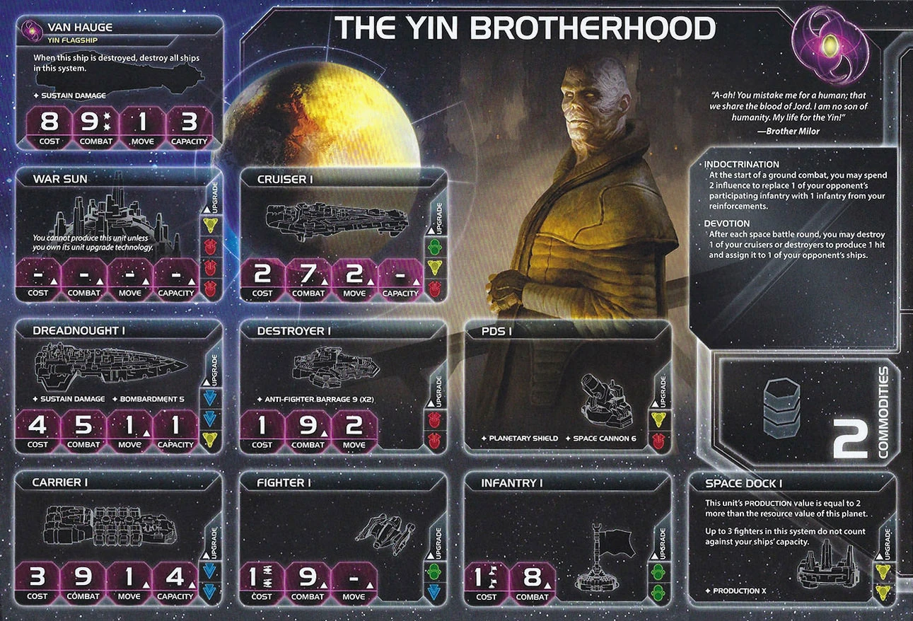

<nav class="page-nav">
<a href="../index.html" class="back-link">Back to Index</a>
<a href="Yin_Brotherhood.md" download class="download-link" title="Plain text file - safe to download">Download .md</a>
</nav>

# Yin Brotherhood Guide

## Contents

1. [Introduction](#i-introduction)
2. [Playstyle](#ii-playstyle)
3. [Faction Info and Drafting](#iii-faction-info-and-drafting)
   - [Home System & Commodities](#a-home-system--commodities) · [Starting Fleet](#b-starting-fleet) · [Faction Abilities](#c-faction-abilities) · [Technologies](#d-starting-and-faction-technologies) · [Leaders](#e-leaders) · [Promissory Note](#f-promissory-note) · [Alliance](#g-alliance) · [Mech](#h-mech) · [Flagship](#i-flagship) · [Breakthrough](#j-breakthrough) · [Slice and Draft](#k-slice-and-draft-considerations)
4. [Round 1 Problems and Faction Weakness](#iv-round-1-problems-and-faction-weakness)
   - [First Turn Priorities](#a-first-turn-priorities) · [Kamikaze Math Dependency](#b-kamikaze-math-dependency) · [Influence Scarcity](#c-influence-scarcity) · [Flagship Double-Edged Sword](#d-flagship-double-edged-sword)
5. [Technology](#v-technology)
   - [Overview](#a-overview) · [Yin Spinner Path](#b-tech-path-1-yin-spinner-focus-standard) · [Blue Mobility Path](#c-tech-path-2-blue-mobility-alternative) · [Kamikaze Math](#d-kamikaze-math--devotion-strategy)
6. [Strategy Cards](#vi-strategy-cards)
   - [Round 1](#a-round-1) · [Round 2+](#b-round-2)
7. [Unit Composition and Game Plan](#vii-unit-composition-and-game-plan)
   - [Unit Composition](#a-unit-composition) · [Game Plan](#c-game-plan)
8. [Objectives](#viii-objectives)
   - [Objective Summary](#a-objective-summary) · [Stage I](#b-stage-i-objectives) · [Secret Objectives](#c-secret-objectives) · [Stage II](#d-stage-ii-objectives)
9. [Alliance Priority](#ix-alliance-priority)
10. [Bonus Game Elements](#x-bonus-game-elements)
    - [Action Cards](#a-high-value-action-cards) · [Relics](#b-relic-priorities) · [Agendas](#c-agenda-awareness)
11. [End Notes](#xi-end-notes)

---

## I. Introduction

The Yin Brotherhood are TI4's suicide bombers—a faction for players who understand that sacrifice isn't loss, it's investment. While other factions protect their ships and mourn their casualties, you're calculating which destroyer to detonate next. Your cheap units exist to die profitably.

This is a faction about asymmetric value. Your Devotion ability guarantees kills after combat rounds. Your Indoctrination steals enemy infantry before ground combat begins. Your Yin Spinner spawns free infantry everywhere you produce. Death fuels your expansion—every sacrifice generates more value than survival would have.

Watch opponents hesitate before engaging your fleets. They know your destroyers are missiles waiting to launch. They know your flagship nukes everything when it dies. They know attacking you costs more than it gains. That fear, that careful calculation before every engagement, is your real advantage.

---

## II. Playstyle

Playing Yin means treating your units as expendable resources rather than precious assets. Your faction rewards players who understand that sacrifice generates value—Devotion guarantees kills, Indoctrination steals infantry, and Yin Spinner floods your planets with free ground forces.

Your early game focuses on establishing your economic engine. Get Yin Spinner online and watch infantry accumulate automatically with every production. Expand aggressively—Indoctrination lets you invade with fewer ground forces since you're converting defenders before combat even starts. Your cheap production means you can afford to trade units and rebuild quickly.

As the game develops, your presence becomes a deterrent. Opponents learn that fighting you costs more than expected. Your flagship threatens mutually assured destruction. Devotion picks off cruisers and destroyers after every combat round. Use this reputation to expand into contested space while others hesitate to engage.

Your endgame leverages everything you've built. Infantry swarms from Yin Spinner secure planets. Breakthrough alliances stack up from scoring objectives. Your production efficiency lets you rebuild faster than opponents can destroy. You don't need the strongest fleet—you need opponents who dread the cost of fighting you.

---

## III. Faction Info and Drafting

### A. Home System & Commodities

**Home System:** 1 planet
- **Darien:** 4 resources / 4 influence = 2 optimal resources + 2 optimal influence
- **Total: 4 resources / 4 influence (2 optimal resources / 2 optimal influence)**

**Commodities:** 2

**Notes:** Balanced 4/4 home system gives flexibility. Single planet is easy to defend. Low commodities (2) means your economy comes from slice planets, not trade.

### B. Starting Fleet

- 2 Carriers
- 1 Destroyer
- 4 Fighters
- 4 Infantry
- 1 Space Dock

**Notes:** Strong expansion start with dual carriers and 4 infantry. Split forces across multiple systems R1.

### C. Faction Abilities

**Devotion:** After each space battle round, you may destroy 1 of your cruisers or destroyers in the active system to produce 1 hit and assign it to 1 of your opponent's ships in that system.

Guaranteed hit after each combat round. Sacrifice a destroyer or cruiser to deal one hit you assign to any enemy ship. Used to avoid variance—you don't have to rely on dice to secure kills. Best targets are ships that already used Sustain Damage, or cruisers and destroyers you can kill outright. Against fresh dreadnoughts or war suns, the hit just gets absorbed—only use Devotion on capital ships if they're already damaged.

**Indoctrination:** At the start of a ground combat, you may spend 2 influence to replace 1 of your opponent's participating infantry with 1 infantry from your reinforcements.

Convert one enemy infantry to yours before ground combat starts. Costs 2 influence but swings the fight by 2 units (they lose one, you gain one). Works best as a deterrent—opponents leave extra infantry on planets because they know you can convert. When you do use it, spend smaller influence planets or trade goods to avoid wasting your 4-influence home system.

### D. Starting and Faction Technologies

**Starting Technologies:**

**Sarween Tools** - When you use PRODUCTION, reduce the combined cost of produced units by 1.

Strong starting tech. Every production saves 1 resource, adding up over the game.

**Faction Technologies:**

**Yin Spinner (GG):** After you produce units, place up to 2 infantry from your reinforcements on any planet you control or in any space area that contains 1 or more of your ships.

Your priority faction tech. Triggers on "produce" not "PRODUCTION"—meaning Sling Relay, exploration cards, and Integrated Economy all trigger Yin Spinner. Look for small production opportunities to maximize infantry generation.

**Impulse Core (YY):** At the start of a space combat, you may destroy 1 of your cruisers or destroyers in the active system to produce 1 hit against your opponent's ships; that hit must be assigned by your opponent to 1 of his non-fighter ships if able.

Pre-combat Devotion that forces the hit onto a non-fighter. Situational—only worth it if you're heavily invested in the kamikaze playstyle.

### E. Leaders

**Agent - Brother Milor:** After a player's unit is destroyed: You may exhaust this card to allow that player to place 2 fighters in the destroyed unit's system if it was a ship, or 2 infantry if it was a ground force.

Solid agent. Works as a deterrent for your own combats, swing unlucky combat rolls, or save an ally from embarrassing ground combat losses. Sell for 2-3 TG or use as leverage.

**Commander - Brother Omar:** *Unlock: Use one of your faction abilities.* This card satisfies a green technology prerequisite. When you research a tech owned by another player, you may return 1 of your infantry to reinforcements to ignore its prerequisites.

Easy unlock (use Devotion or Indoctrination once). Green prereq helps rush Yin Spinner R2 with a green skip. Copy ability is useless against some factions, invaluable against others—depends who's at the table.

**Hero - Dannel of the Tenth:** *Unlock: Have 3 scored objectives.* Commit up to 3 infantry from your reinforcements to any non-home planets and resolve invasions on those planets; players cannot use SPACE CANNON against those units.

Great hero, especially with Fracture. Steal potential is 3 relics from guarded planets, VP at Styx, screw opponents on key control objectives. Save influence to combo with Indoctrination on the drops.

### F. Promissory Note - **Greyfire Mutagen**

At the start of a ground combat against 2 or more ground forces that are not controlled by the Yin player: Replace 1 of your opponent's infantry with 1 infantry from your reinforcements. Then, return this card to the Yin player.

Indoctrination for another player. Trade value: 1-3 TG.

### G. Alliance

**Alliance Ability:** When you produce ships, you may produce 1 additional fighter or infantry for its cost.

Solid production bonus for ally. Free fighter or infantry with every ship production. Trade value: 2-3 TG.

### H. Mech - **Moyin's Ashes**

Cost: 2 | Combat: 6 | **Sustain Damage**

**DEPLOY:** When you use your Indoctrination faction ability, you may spend 1 additional influence to replace your opponent's unit with 1 mech instead of 1 infantry.

Spend 3 influence instead of 2 to place a mech instead of infantry. Keeps opponents guessing how much they need to take your planets—are they fighting 2 infantry with 4, or a mech + 2 infantry with 3?

### I. Flagship - **Van Hauge**

Cost: 8 | Combat: 9 (x2) | Move: 1 | Capacity: 3 | **Sustain Damage**

When this ship is destroyed, destroy all ships in this system.

Mutually assured destruction. Most likely a defensive tool parked at home. Fun to have on the board and great for extorting big fleets—opponents won't engage if it costs them everything.

### J. Breakthrough - **Yin Ascendant (Y↔G)**

When you gain this card or score a public objective, gain the alliance ability of a random, unused faction.

**Y↔G Synergy:** Sarween counts as green for Yin Spinner (GG) and opens Integrated Economy (YYY) + X-89 (GGG) paths.

**Random Alliances:** Excellent ability. Expect 4-6 alliances over a game, which averages out to great value. Unlock before first public objective scores to maximize. Having multiple commander abilities stacking makes you significantly stronger than your components suggest.

### K. Slice and Draft Considerations

**Speaker Order:** Prefer early positions 1-4 to unlock breakthrough before first public objective scores and get some good value. You like a target neighbor—you can play nice but should be opportunistic.

**Slice Priorities:**

- **Balanced resources/influence** - Your 4/4 home makes you flexible.
- **Influence access** - You need influence for Indoctrination (2 per use).

**Nice to Have:**

- 2-3 influence planets to threaten Indoctrination without wasting your 4-influence home.
- Green/yellow tech skips to accelerate Yin Spinner.
- Entropic Scar is fine but nothing special.

**Avoid:**

- Slices that require early mobility.

---

## IV. Round 1 Problems and Faction Weakness

### A. First Turn Priorities

**Round 1 Priority Rankings:**

1. **Breakthrough** - Yin Ascendant is excellent. Getting it before first public objective scores means you start collecting alliance abilities immediately, maximizing value over the game.

2. **Scoring** - If available, take it. Once you have Yin Ascendant, every public objective you score gives you a random alliance ability, making scoring even more valuable than for other factions.

3. **Expansion and Production** - Your dual carriers and 4 infantry give you strong expansion capability. Claim 3 systems R1 to establish economy. Build units with Sarween discount to prepare for R2 aggression.

4. **Technology** - Start your path toward Yin Spinner (GG). This is your faction's core tech and should be online R2-R3. Every production after Yin Spinner generates 2 free infantry.

**Expansion Notes:** You have 2 carriers, 1 destroyer, and 4 infantry. Split forces across multiple systems using your dual carriers. Aim for 2-3 systems R1.

### B. Economic Weakness

Only 2 commodities combined with expensive abilities creates constant economic pressure. Indoctrination costs 2 influence per use. Devotion sacrifices ships. Your abilities are powerful but drain resources quickly. Expand to high-value planets and budget carefully—you can't afford to spam your faction abilities every round.

### C. Lack of Mobility

No mobility tech in your faction kit. You're stuck at move 1 until you research Gravity Drive. This makes early expansion slower and limits your ability to project force across the map. Plan your slice positioning carefully and prioritize blue tech if the map requires it.

---

## V. Technology

### A. Overview

**Starting Tech:** Sarween Tools (reduce production costs by 1).

Both paths assume you unlock Yin Ascendant breakthrough and Commander early. The paths diverge on tech priorities:

**Yin Spinner Path:** Rush your faction tech for infantry spam and ground dominance. Focuses on Yin Spinner early (R2) then pivots into Integrated Economy + X-89 Bacterial Weapon for production flexibility and nuclear ground combat. Maximizes your infantry generation and ground force control. Best when you need to hold planets and score control objectives.

**Blue Path:** Prioritize mobility and unit upgrades over faction tech. Gets Gravity Drive R2, delays Yin Spinner to R3, then pushes into Carrier II and Dreadnought II for fleet strength. More flexible and well-rounded but sacrifices early infantry spam. Best for aggressive tables or slices requiring early mobility.

### B. Technology Paths

**Yin Spinner Path (No Skips):**

**Round 1:** Bio-Stims (G)
- At the start of a combat round, you may exhaust this card to apply +2 to the result of 1 unit's combat roll
- Ready a technology (or tech specialty planet if you own Psychoarchaeology)
- **Why:** Green prereq for Yin Spinner. Combat bonus is useful.

**Round 2:** Yin Spinner (GG)
- After you produce units, place up to 2 infantry from your reinforcements on any planet you control or in any space area that contains 1 or more of your ships
- **Why:** Core faction tech. Free infantry with every production. Triggers on "produce" not PRODUCTION—works with Sling Relay, exploration, Integrated Economy.

**Round 3:** Gravity Drive (B)
- After you activate a system, apply +1 to the move value of 1 of your ships during this tactical action
- **Why:** Mobility. Move 2 carriers. Essential for map control.

**Round 4:** Integrated Economy (YYY)
- When you gain trade goods or resolve the secondary ability of the Trade strategy card, gain 1 additional trade good
- **Why:** If unlocking Yin Ascendant (Y↔G), this counts as 3 green techs for X-89. Extra trade goods help your weak economy.

**Round 5:** X-89 Bacterial Weapon (GGG)
- At the start of ground combat, choose up to 2 planets and exhaust this card; destroy all infantry on those planets
- **Why:** Nuclear ground combat option. Clears planets before invasions. Works with Indoctrination to convert survivors after X-89 kills their army.

---

**Blue Path (Boring but Reliable):**

**Round 1:** Dark Energy Tap (B)
- After you exhaust a planet to activate a system, you may exhaust this card to explore that planet
- Ships can retreat into adjacent systems that do not contain other players' units
- **Why:** Exploration value. Retreat flexibility. Blue prereq for Gravity Drive.

**Round 2:** Gravity Drive (B)
- After you activate a system, apply +1 to the move value of 1 of your ships during this tactical action
- **Why:** Mobility. Move 2 carriers. Essential early.

**Round 3:** Yin Spinner (GG)
- After you produce units, place up to 2 infantry from your reinforcements on any planet you control or in any space area that contains 1 or more of your ships
- **Why:** Core faction tech. Delayed to R3 for early mobility priority.

**Round 4:** Carrier II (BB)
- Cost 3 | Combat 9 | Move 2 | Capacity 6
- **Why:** Transport capacity for Yin Spinner infantry. Move 2 + Gravity Drive = move 3 carriers.

**Round 5:** Dreadnought II (BBY)
- Cost 4 | Combat 5 | Move 2 | Capacity 1 | SUSTAIN DAMAGE | BOMBARDMENT 5
- Cannot be destroyed by Direct Hit action cards
- **Why:** Move 2 capital ships. Bombardment synergy. Immune to Direct Hit.

**Commander Flexibility:**

Your Commander lets you research any tech someone else has by sacrificing an infantry to skip prerequisites. This means you can pick up powerful table techs if they're available:

- **Sling Relay** - Produce 2 ships in any system with your ships (including other players' space docks). Synergizes with Yin Spinner.
- **Light/Wave Deflector** - Your ships can move through opponent ships and systems. Excellent mobility.
- **Fleet Logistics** - 2 actions per turn. Always strong if you can afford the prerequisites or skip them with Commander.

---

## VI. Strategy Cards

### A. Round 1

**Round 1 Priority Ranking:**

1. **Leadership** - Return your secret objective to unlock Yin Ascendant breakthrough. Critical to get it before first objective scores.
2. **Trade** - Refresh your 2 commodities. Economy foundation with low commodity count.
3. **Politics** - Action cards begone. Try to make speaker deal—offer 2 TG for 2nd pick position.
4. **Technology** - Good value, saves a strategy token. Solve breakthrough in another way (Leadership or Trade).
5. **Diplomacy** - Flip a tech skip planet if you have one in slice.
6. **Warfare** - Fill out slice with extra tactical action.
7. **Construction** - Only if structure objective revealed.
8. **Imperial** - Never R1.

**Strategy Token Priority:** Diplomacy and Technology as secondary.

### B. Round 2+

**Love:**

- **Trade** - Flexible spending. Refresh commodities for economy.
- **Leadership** - Need 3 command tokens to use influence for abilities like Indoctrination.
- **Imperial** - Scoring synergizes with breakthrough alliances.

**Like:**

- **Technology** - Save resources and increase tempo.
- **Politics** - Setup for objectives. Agenda control.

**Situational:**

- **Warfare** - Solves low mobility. Fleet pool and redistribution.
- **Construction** - If poor for objectives or need forward dock.
- **Diplomacy** - Refresh planets if needed.

---

## VII. Unit Composition and Game Plan

### A. Unit Composition

Your ideal fleet composition:

- **Carriers** - Core transport for Yin Spinner infantry swarms.
- **Infantry** - Yin Spinner generates 2 per production. Build massive ground force advantage.
- **Fighters** - Cheap hit points for fleet protection. Absorb hits.
- **Destroyers/Cruisers** - Devotion fodder when profitable trades exist. Only build if combat value justifies it.
- **Mechs** - Deploy by spending 3 influence instead of 2 when using Indoctrination. Sustain Damage ground forces.
- **Flagship** - Parked at home as deterrent. Mutually assured destruction keeps opponents away.

Focus on carriers and infantry. Yin Spinner makes infantry free, so maximize production opportunities. Avoid expensive capital ships early—your strength is infantry spam and ground control, not fleet battles.

### B. Game Plan

**Early Game (R1-2):** Unlock Yin Ascendant breakthrough R1—this is critical for starting your alliance ability collection before first objective scores. Expand to 2-3 systems with your dual carriers while pushing toward Yin Spinner tech. Commander unlock is trivial (just use Devotion or Indoctrination once), so get it done R1-R2. Build your economy foundation and position for R3+ infantry spam.

**Mid Game (R3-4):** Yin Spinner comes online and your game changes completely. Produce constantly to generate 2 free infantry per production. Look for Sling Relay, exploration opportunities, and Integrated Economy to trigger bonus Yin Spinner productions. Start invading planets with Indoctrination—convert defenders before ground combat to swing the math in your favor. Breakthrough alliances begin stacking (4-5 by R4), giving you multiple commander abilities. Use Devotion to avoid variance in critical space battles. Focus on control objectives and planet accumulation since your infantry swarms excel at holding territory.

**Late Game (R5+):** Your power peaks. Hero lets you drop 3 infantry anywhere without Space Cannon defense—use this to steal key planets, grab Mecatol, or secure objective planets. X-89 Bacterial Weapon (if researched) nukes entire planets before invasions. You have 4-6 breakthrough alliance abilities stacking together for massive power. Stay flexible—make your late game plans based on which alliances you rolled. Combat alliances push you toward aggression, economy alliances fund more production, mobility alliances open new strategic options. Infantry swarms from Yin Spinner secure everything. Deploy mechs via Indoctrination on critical planets for Sustain Damage ground forces. Convert your overwhelming ground force advantage into victory points and close out the game.

---

## VIII. Objectives

### A. Objective Summary

**Strengths:** Control objectives benefit from Yin Spinner infantry spam and Indoctrination invasions. Ships in systems objectives are achievable with standard fleet building. Combat secrets align with Devotion and aggressive play.

**Weaknesses:** Spending objectives are challenging with only 2 commodities and weak economy. Trade good spendies are especially hard. Structure objectives require investment you don't naturally make. Tech objectives take time without dedicated tech focus.

### B. Stage I Objectives

| Stage I Objective                                                       | Status |
|-------------------------------------------------------------------------|--------|
| **Spendies**                                                            |        |
| Erect a Monument (Spend 8 resources)                                    | 🟢     |
| Sway the Council (Spend 8 influence)                                    | 🟡     |
| Negotiate Trade Routes (Spend 5 trade goods)                            | 🔴     |
| Lead from the Front (Spend 3 tokens from tactic/strategy pools)         | 🟡     |
| Amass Wealth (Spend 3 influence, 3 resources, 3 trade goods)            | 🟡     |
| **Control**                                                             |        |
| Expand Borders (Control 6 planets in non-home systems)                  | 🟢     |
| Corner the Market (Control 4 planets with same trait)                   | 🔴     |
| Found Research Outposts (Control 3 planets with tech specialties)       | 🔴     |
| Discover Lost Outposts (Control 2 planets with attachments)             | 🔴     |
| Push Boundaries (Control more planets than each neighbor)               | 🟢     |
| **Ships in Systems**                                                    |        |
| Intimidate the Council (Ships in 2 systems adjacent to MR)              | 🟡     |
| Explore Deep Space (Units in 3 systems without planets)                 | 🟡     |
| Make History (Units in 2 systems with legendary/MR/anomalies)           | 🟡     |
| Populate the Outer Rim (Units in 3 edge systems)                        | 🟡     |
| Raise a Fleet (5+ non-fighter ships in 1 system)                        | 🟡     |
| Engineer a Marvel (Have flagship or war sun on board)                   | 🟢     |
| **Tech**                                                                |        |
| Diversify Research (Own 2 tech in each of 2 colors)                     | 🟢     |
| Develop Weaponry (Own 2 unit upgrade technologies)                      | 🟡     |
| **Structure**                                                           |        |
| Build Defenses (Have 4 or more structures)                              | 🟡     |
| Improve Infrastructure (Structures on 3 planets outside HS)             | 🔴     |

**Legend:** 🟢 Likely | 🟡 Possible | 🔴 Difficult

### C. Secret Objectives

| Secret Objective                                                         | Status |
|--------------------------------------------------------------------------|--------|
| **Combat**                                                               |        |
| Unveil Flagship (Win space combat with flagship)                         | 🔴     |
| Destroy their Greatest Ship (Destroy war sun/flagship)                   | 🟢     |
| Spark a Rebellion (Win combat vs VP leader)                              | 🟢     |
| Betray a Friend (Win combat vs player whose PN you have)                 | 🟢     |
| Brave the Void (Win combat in anomaly)                                   | 🟢     |
| Darken the Skies (Win combat in another player's HS)                     | 🔴     |
| Demonstrate your Power (3+ non-fighter ships after space combat)         | 🟢     |
| Turn their Fleets to Dust (SPACE CANNON destroy last ship)               | 🔴     |
| Make an Example (BOMBARDMENT destroy last ground forces)                 | 🔴     |
| Fight With Precision (AFB destroy last fighter)                          | 🟡     |
| **Ships in Systems**                                                     |        |
| Threaten Enemies (Ships adjacent to another player's HS)                 | 🟢     |
| Cut Supply Lines (Ships in system with enemy space dock)                 | 🟢     |
| Defy Space and Time (Units in wormhole nexus)                            | 🟡     |
| Become the Gatekeeper (Ships in alpha and beta wormhole systems)         | 🟡     |
| Learn Secrets of the Cosmos (Ships in 3 systems adjacent to anomalies)   | 🟢     |
| Control the Region (Ships in 6 systems)                                  | 🟢     |
| Occupy the Seat of the Empire (Control MR with 3+ ships)                 | 🟢     |
| **Control**                                                              |        |
| Monopolize Production (Control 4 industrial planets)                     | 🔴     |
| Mine Rare Minerals (Control 4 hazardous planets)                         | 🔴     |
| Forge an Alliance (Control 4 cultural planets)                           | 🔴     |
| Establish Hegemony (Control planets with 12+ influence)                  | 🟡     |
| Hoard Raw Materials (Control planets with 12+ resources)                 | 🟡     |
| Seize an Icon (Control legendary planet)                                 | 🟢     |
| Stake Your Claim (Control planet in contested system)                    | 🟢     |
| Become a Martyr (Lose control of planet in home system)                  | 🔴     |
| **Tech**                                                                 |        |
| Adapt New Strategies (Own 2 faction technologies)                        | 🟢     |
| Master the Laws of Physics (Own 4 tech of same color)                    | 🟢     |
| **Structure/Units**                                                      |        |
| Establish a Perimeter (Have 4 PDS on board)                              | 🔴     |
| Fuel the War Machine (Have 3 space docks)                                | 🟡     |
| Gather a Mighty Fleet (Have 5 dreadnoughts)                              | 🔴     |
| Mechanize the Military (1 mech on each of 4 planets)                     | 🟢     |
| Occupy the Fringe (9+ ground forces on planet without space dock)        | 🟢     |
| Produce en Masse (Units with PRODUCTION 8+ in single system)             | 🔴     |
| **Other**                                                                |        |
| Dictate Policy (3+ laws in play)                                         | 🔴     |
| Drive the Debate (You/your planet elected by agenda)                     | 🔴     |
| Destroy Heretical Works (Purge 2 relic fragments)                        | 🔴     |
| Form a Spy Network (Discard 5 action cards)                              | 🟡     |
| Foster Cohesion (Be neighbors with all players)                          | 🟢     |
| Strengthen Bonds (Have another player's PN)                              | 🟢     |
| Prove Endurance (Last to pass)                                           | 🔴     |

**Legend:** 🟢 Likely | 🟡 Possible | 🔴 Difficult

### D. Stage II Objectives

| Stage II Objective                                                       | Status |
|--------------------------------------------------------------------------|--------|
| **Spendies**                                                             |        |
| Centralize Galactic Trade (Spend 10 trade goods)                         | 🔴     |
| Found a Golden Age (Spend 16 resources)                                  | 🟡     |
| Galvanize the People (Spend 6 tokens from tactic/strategy pools)         | 🟡     |
| Manipulate Galactic Law (Spend 16 influence)                             | 🟡     |
| Hold Vast Reserves (Spend 6 influence, 6 resources, 6 trade goods)       | 🔴     |
| **Control**                                                              |        |
| Conquer the Weak (Control 1 planet in another player's HS)               | 🔴     |
| Rule Distant Lands (Control 2 planets in/adjacent to different players' HS) | 🟢  |
| Subdue the Galaxy (Control 11 planets in non-home systems)               | 🔴     |
| Unify the Colonies (Control 6 planets with same trait)                   | 🔴     |
| Reclaim Ancient Monuments (Control 3 planets with attachments)           | 🟡     |
| Form Galactic Brain Trust (Control 5 planets with tech specialties)      | 🔴     |
| **Ships in Systems**                                                     |        |
| Command an Armada (Have 8+ non-fighter ships in 1 system)                | 🔴     |
| Achieve Supremacy (Flagship/War Sun in another player's HS or MR)        | 🔴     |
| Become a Legend (Units in 4 systems with legendary/MR/anomalies)         | 🔴     |
| Patrol Vast Territories (Units in 5 systems without planets)             | 🔴     |
| Control the Borderlands (Units in 5 edge systems not HS)                 | 🟡     |
| **Tech**                                                                 |        |
| Master of Sciences (Own 2 techs in each of 4 colors)                     | 🔴     |
| Revolutionize Warfare (Own 3 unit upgrade technologies)                  | 🟡     |
| **Structure**                                                            |        |
| Construct Massive Cities (Have 7+ structures)                            | 🔴     |
| Protect the Border (Structures on 5 planets outside HS)                  | 🔴     |

**Legend:** 🟢 Likely | 🟡 Possible | 🔴 Difficult

---

## IX. Alliance Priority

When you unlock Yin Ascendant, you gain random alliance abilities every time you score a public objective. Here's how to evaluate your draws:

**Top Tier (You Got Lucky):**

1. **Nomad (Navarch Feng)** - Produce flagship without spending resources. Free Van Hauge (8 resources saved).
2. **Crimson Rebellion (Ahk Siever)** - Gain commodity/TG at end of combat. Passive income from table-wide combat.
3. **Deepwrought (Aello)** - Gain commodity/TG when others research tech with discount. Passive income.
4. **Muaat (Magmus)** - Gain 1 TG after spending strategy token. Passive income from secondaries.
5. **Sardakk N'orr (G'hom Sek'kus)** - Commit 1 ground force from adjacent planets during invasion. Pairs perfectly with Yin Spinner infantry everywhere.
6. **Winnu (Rickar Rickani)** - Apply +2 combat in MR, home system, legendary planets. Strong combat boost.
7. **Empyrean (Xuange)** - Return command token after players move ships into your systems. Token economy.
8. **Naaz-Rokha (Dart and Tai)** - Explore planet after conquering from another player. Extra value from invasions.
9. **Barony of Letnev (Rear Admiral Farran)** - Gain 1 TG after unit uses Sustain Damage. Passive income.
10. **Nekro Virus (Nekro Acidos)** - Draw 1 action card after gaining tech. Action card economy.

**Good (Solid Value):**

11. **Titans of Ul (Tungstantus)** - Gain 1 TG when using PRODUCTION. Money every time you produce.
12. **Mentak Coalition (S'ula Mentarion)** - Force opponent to give PN after winning space combat. Extract value.
13. **Arborec (Dirzuga Rophal)** - Produce 1 unit when others activate systems with your PRODUCTION units. Combos with flagship.
14. **Federation of Sol (Claire Gibson)** - Place 1 infantry when defending ground combat. Defensive boost.
15. **Jol-Nar (Ta Zern)** - Reroll unit ability dice (BOMBARDMENT, AFB, SPACE CANNON). Versatile.
16. **Vuil'raith Cabal (That Which Molds Flesh)** - Up to 2 fighters/infantry don't count against PRODUCTION limit. More production capacity.
17. **Yssaril Tribes (So Ata)** - Look at action cards/PNs/secrets when activating systems with your units. Information.
18. **Ral Nel (Watchful OJZ)** - Retreat up to 2 ships to adjacent system, place token. Defensive flexibility.
19. **Ghosts of Creuss (Sai Seravus)** - Place fighters after moving through wormholes. Fighter generation.
20. **Firmament (Captain Aroz)** - Treat planets in systems with ships as controlled for scoring secrets. Niche but useful.

**Life Sucks (Bad Draws):**

21. **Clan of Saar (Rowl Sarring)** - Place fighters/infantry at any space dock when producing. Production flexibility you don't need.
22. **Obsidian (Aroz Hollow)** - Apply +1 combat in The Fracture. Ultra-niche.
23. **Last Bastion (Nip and Tuck)** - Action cards cannot be canceled by Sabotage. Nekro protection. Situational.
24. **Argent Flight (Trrakan Aun Zulok)** - Roll 1 additional die for unit abilities. Extra dice for unit abilities.
25. **Xxcha Kingdom (Elder Qanoj)** - Each exhausted planet provides +1 vote. Voting focus doesn't help you.
26. **Council Keleres (Suffi An)** - Perform additional action after component action. Very situational.
27. **L1Z1X Mindnet (2RAM)** - Ignore Planetary Shield for BOMBARDMENT. Only useful if you build dreads.
28. **Hacan (Gila the Silvertongue)** - Spend TGs for 2 votes each. Completely dead—you're poor and can't trade.
29. **Naalu Collective (M'aban)** - Look at neighbors' PNs and top/bottom agenda card. Information doesn't win games.

---

## X. Bonus Game Elements

This section highlights action cards that synergize particularly well with your faction's strengths or mitigate your weaknesses, relics that offer exceptional value for your faction's strategy and abilities, and agendas to pursue that benefit your position, and agendas to watch out for that could hurt you.

### A. High-Value Action Cards

### B. Relic Priorities

### C. Agenda Awareness

---

## XI. End Notes

Yin Brotherhood is the faction for players who understand that units are resources to spend, not assets to preserve. You're not the strongest military faction, but you scale better than most through Yin Ascendant's alliance collection and Yin Spinner's infantry generation.

Your biggest strength is flexibility through randomness. Yin Ascendant gives you 4-6 random alliance abilities over the game—some games you roll money commanders and swim in trade goods, other games you get combat buffs and become a military threat. Adapt your strategy to what you draw. The faction rewards players who can pivot based on what alliances appear.

When you master Yin, you use Devotion to avoid variance in critical combats. Your Indoctrination acts as a deterrent—opponents leave extra infantry on planets because they fear conversion. Yin Spinner generates massive infantry swarms with every production, making ground control objectives trivial. Your flagship parks at home as mutually assured destruction, keeping your slice safe.

The table learns to respect your abilities without overvaluing them. Devotion is powerful but situational—it won't save bad fights. Indoctrination swings key invasions but you can't afford to spam it. Your breakthrough alliances stack up gradually, making you stronger each round. By late game, you're not the faction they thought they knew.

**"Sacrifice is just another word for investment."**
