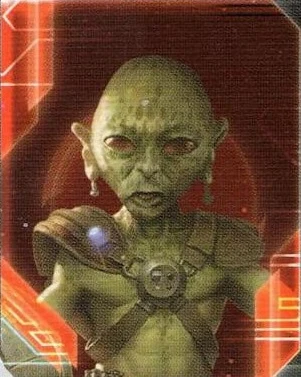

# Yssaril Tribes Guide

---

## I. Introduction

The Yssaril Tribes are the most politically dominant faction in TI4. This faction excels at manipulating action card advantage through unlimited hand size, cycling through cards to find perfect answers, and seeing opponents' hidden information through commander snooping. Yssaril isn't about brute force—it's about perfect information, political leverage, and outplaying opponents through superior card advantage and timing manipulation.

The payoff? Watching opponents realize you've seen their entire hand, knowing exactly what they can and cannot do, and discarding action cards freely to activate your Stall Tactics ability without fear of running out. When you have 15 action cards in hand while everyone else has 3, information dominance becomes absolute.

## II. Playstyle

Playing Yssaril Tribes is like being a spymaster in a galaxy of blind players. Your Scheming ability gives you double the card draw (draw 2, discard 1 = net +1 per draw), your Crafty ability removes the hand size limit entirely, and your Stall Tactics lets you discard action cards for strategic benefits. You're not trying to win through military might—you're winning through perfect information and political control.

The key strength of Yssaril is information asymmetry. Unlock your Commander early (7 action cards—trivial for you), and suddenly every time an opponent activates a system with your units, you SEE their action cards, promissory notes, AND secret objectives. You know everything they're planning. That knowledge becomes leverage.

Opponents will underestimate your card advantage until they realize you're sitting on 12+ action cards at any moment, cycling through the deck to find exactly what you need. That moment when they commit their flagship and you play Direct Hit because you drew through 20 cards to find it? Pure mastery.

---

## III. The Basics

### A. Home System & Commodities

**Home System:**
- **Retillion:** 2 resources / 3 influence = 2 optimal resources + 3 optimal influence
- **Shalloq:** 1 resource / 2 influence = 1 optimal resource + 2 optimal influence
- **Total: 3 resources / 5 influence (3 optimal resources / 5 optimal influence)**

**Commodities:** 3

**Notes:** Influence-heavy home system (5 influence!) is perfect for political dominance and trade agreements. The 3 resources are modest but sufficient for your economic needs. Your home system profile makes you a natural politician—lots of influence for voting, decent resources for production.

### B. Starting Fleet

- 2 Carriers
- 1 Cruiser
- 2 Fighters
- 5 Infantry
- 1 Space Dock
- 1 PDS

**Notes:** Strong starting fleet with 2 carriers for capacity. The 5 infantry and dual carriers give you excellent R1 expansion capability—you can take 2-3 systems easily. The cruiser provides combat power and speed. Very solid defensive starting position.

### C. Starting Technologies

**Neural Motivator (Green)** - You have +2 starting command counters.

**Notes:** One of the best starting techs in the game. +2 command counters gives you 5 tokens R1 (3 base + 2 from tech) instead of 3, enabling more activations, production secondaries, and crucially, more uses of Stall Tactics (which costs action card discards, not command counters). This accelerates your entire game.

### D. Faction Abilities

**Stall Tactics (Faction Ability):** ACTION: Discard 1 action card from your hand.

This is your strategic timing tool. Spend an action to discard a card—this lets you "skip" your turn to see what others do first, or rapidly cycle through your hand to find specific cards. Combined with Crafty (unlimited hand size) and Scheming (draw 2, discard 1), you're constantly churning through the action card deck.

**Scheming (Faction Ability):** When you draw 1 or more action cards, draw 1 additional action card. Then, choose and discard 1 action card from your hand.

Your card advantage engine. Every time you draw action cards, you draw +1 additional and then discard 1. This means you see 2 cards and keep the better one. Over a game, you'll draw 20-30 action cards while opponents draw 10-15. You see more of the deck, you get better card selection, and you always have answers.

**Crafty (Faction Ability):** You can have any number of action cards in your hand. Game effects cannot prevent you from using this ability.

Removes the 7-card hand limit. This is HUGE. While everyone else discards down to 7, you can hold 10, 15, even 20 action cards. Combined with Scheming, you build a massive hand of perfect cards. Your hand becomes an arsenal of answers for every situation.

### E. Leaders

**Agent - Ssruu:** This card has the text ability of each other player's agent, even if that agent is exhausted.

Incredibly versatile agent that copies ALL other agents at the table. If Nomad is in the game, you have their agent ability. If Hacan is in the game, you have their agent ability. Your agent is as good as the best agent at your table. Absurdly flexible and powerful in the right games.

**Commander - So Ata:** *Unlock: Have 7 action cards.*

After another player activates a system that contains your units: You may look at that player's action cards, promissory notes, or secret objectives.

Easy unlock with Crafty (unlimited hand size) and Scheming (draw 2 per draw). Once unlocked, you gain PERFECT INFORMATION whenever opponents activate systems with your units. Spread a few fighters or infantry around the map, and suddenly you're seeing everyone's hidden information constantly. This is one of the most powerful commanders in the game.

**Hero - Kyver, Blade and Key:** *Unlock: Have 3 scored objectives.* **Guild of Spies** - ACTION: Each other player shows you 1 action card from their hand. For each player, you may either take that card or force that player to discard 3 random action cards from their hand. Then, purge this card.

Devastating hero. In a 6-player game, you either steal 5 cards OR force opponents to discard 15 cards total. Use this R4-R5 to cripple opponents' hands right before critical turns. The discard option is often stronger than taking cards—forcing someone to discard 3 random cards can remove their entire game plan.

### F. Promissory Note - **Spy Net**

At the start of your turn: Look at the Yssaril player's hand of action cards. Choose 1 of those cards and add it to your hand. Then, return this card to the Yssaril player.

Strong promissory note. Opponent looks at your hand and steals 1 card. Trade value: 2-3 TG. Since you have 10-15 cards in hand, losing 1 isn't crippling. Trade this liberally for favors, votes, or peace agreements. The information they gain (seeing your hand) is offset by the political value you extract.

### G. Alliance

When you produce ships, you may produce 1 additional fighter or infantry for its cost.

Standard production bonus. Useful for economic factions. Trade value: 3-4 TG or equivalent.

### H. Mech - **Blackshade Infiltrator**

Cost: 2 | Combat: 6 | **Sustain Damage**

**DEPLOY:** After you use your Stall Tactics faction ability, you may place 1 mech on a planet you control.

Interesting mech with DEPLOY synergy. Every time you use Stall Tactics (discard action card for an action), you can place a mech for free. This makes Stall Tactics a dual-purpose ability: timing manipulation + free mech deployment. Over a game, you can deploy 3-5 mechs without spending resources. Excellent economy.

### I. Flagship - **Y'sia Y'ssrila**

Cost: 8 | Combat: 5 (x2) | Move: 2 | Capacity: 3 | **Sustain Damage**

This ship can move through systems that contain other players' ships.

Solid flagship with exceptional mobility. Moving through enemy ships means you can't be blocked—critical for reaching Mecatol Rex or contested objectives. The combat stats (5x2) are decent but not exceptional. The mobility is the real value—bypassing blockades and PDS networks.

### J. Breakthrough - **Deepgloom Executable (Y<>G)**

You can allow other players to use your STALL TACTICS or SCHEMING faction abilities; when you do, you may resolve a transaction with that player. During the action phase, that transaction does not count against the once-per-player transaction limit for that turn.

**Y<>G Synergy:** Yellow and green technologies count as each other for prerequisites.

**Ability:** You can "sell" your faction abilities to other players. Let them use Stall Tactics (discard action card for an action) or Scheming (draw 2, discard 1) in exchange for a transaction. This bypasses the once-per-player transaction limit, letting you trade with the same player multiple times per round. Excellent for extracting value from your unique abilities.

**Y<>G synergy:** Neural Motivator (G) counts as yellow, opening yellow tech paths. Very flexible tech progression.

### K. Slice and Draft Considerations

Yssaril is flexible and can thrive in most slices. Your priorities:

**Speaker Order:**
- **Prefer positions 2-4** - Lets you grab Politics or Trade early without being too early or too late.
- **Avoid last position** - You want access to Politics strategy card for political control.

**Slice Priorities:**
- **Influence-heavy slice** - Your 5 influence at home makes you a natural politician. Stack more influence for voting dominance.
- **High planet count** - More planets = more resources and influence for your needs.
- **Tech skips (any color helpful)** - Yellow or green skips accelerate your tech path. Blue skip opens mobility options.
- **Systems adjacent to Mecatol Rex** - Lets you place units near MR to trigger Commander snooping when others activate it.

**Slice Features to Avoid:**
- **Resource-starved slices** - You need enough resources to fund production. Don't go below 6-7 total resources in slice.
- **Low planet count** - Reduces your economic ceiling and objective scoring potential.

**Summary:**
Yssaril wants influence for politics, resources for production, and planet count for objectives. Your flexible tech path (Neural Motivator + Y<>G synergy) means tech skips are helpful but not mandatory. Focus on high-value slices with balanced economics.

---

## IV. Structural Weaknesses

### A. First Turn Priorities

Your R1 priority order: **Politics > Trade > Leadership**

Focus on:
1. **Politics** - Control the speaker token and agendas. This is your domain.
2. **Trade** - You have 3 commodities and need early economy for production.
3. **Leadership** - Command tokens enable more Stall Tactics usage and expansion.

**Expansion Notes:** You have 2 carriers (capacity 8 total), 1 cruiser, and 5 infantry. This gives you excellent R1 expansion capability. Aim for 3-4 systems R1. Your dual carriers let you split your forces effectively—send one carrier with 2-3 infantry to grab distant systems, and use the other carrier + cruiser for a closer cluster.

Your 5 starting command counters (3 base + 2 from Neural Motivator) give you more flexibility than most factions R1. Use this to expand aggressively.

### B. Commander Dependency

Your power level spikes dramatically once Commander unlocks. Before Commander: you're a faction with good card draw. After Commander: you're a faction that SEES EVERYTHING. Unlock Commander R2-R3 by drawing aggressively and holding 7 action cards (easy with Crafty).

**Mitigation:** Draw action cards every opportunity. Take Imperial secondary R2 to draw cards. Trade with players for action cards. Unlock Commander by R2-R3 to maximize its impact.

### C. Military Mediocrity

Your units are standard. No combat bonuses, no special abilities (except mech). You're not winning fights through stats—you're winning through action cards (Direct Hit, Morale Boost) and political leverage.

**Mitigation:** Use action cards for combat advantage. Avoid unnecessary fights. Let opponents fight each other, then capitalize on weakened winners.

### D. Action Card Knowledge Requirement

Your faction rewards high-skill play. You need to know which action cards are good, when to play them, and how to leverage them politically. Bad Yssaril players hoard cards uselessly. Good Yssaril players extract maximum value from every card.

**Mitigation:** Study the action card deck. Learn which cards win games (Direct Hit, Sabotage, Diplomacy, Warfare, etc.). Practice timing and political leverage.

---

## V. Technology

### A. Overview

You start with **Neural Motivator (Green)** (+2 starting command counters).

Your main tech path is highly flexible thanks to Y<>G breakthrough synergy. You can go blue for mobility, yellow for economy, or stay green for political/economic tools.

### B. Tech Path 1: Political/Economic (Standard)

**Starting Tech:** Neural Motivator (G)

**Round 1: Sarween Tools (Y) OR Bio-Stims (GG)**
- **Sarween Tools:** When you use PRODUCTION, reduce the combined cost of produced units by 1
  - **Why:** Economy boost for constant production. With Y<>G synergy, Sarween counts as green prerequisite.
  - **Prerequisites:** None (0)
- **Bio-Stims:** At the end of your turn, you may exhaust this card to ready 1 planet you control with a technology specialty OR 1 of your other technologies
  - **Why:** Doubles your economic output by readying planets or readying Sarween Tools for double use. Excellent for influence-heavy slices.
  - **Prerequisites:** 2 green (Neural Motivator + tech skip or secondary)

**Round 2: Psychoarchaeology (YYY) - WITH YELLOW SKIP**
- When you resolve a primary or secondary ability of the Politics or Imperial strategy card, you may draw 1 action card
- **Why:** More action card draw = more Scheming triggers = massive hand size. Synergizes perfectly with your faction identity.
- **Prerequisites:** 3 yellow (Sarween + Neural Motivator with Y<>G + yellow skip)
- **Note:** Only viable with yellow skip. Otherwise skip this tech.

**Round 3: Gravity Drive (BB)**
- After you activate a system, apply +1 to the move value of 1 of your ships during this tactical action
- **Why:** Mobility for reaching distant objectives and bypassing defenses. Essential for late game repositioning.
- **Prerequisites:** 2 blue (need to pick up blue techs)

**Round 4: Transparasteel Plating (G)**
- During your turn of the action phase, players that have passed cannot play action cards
- **Why:** Your faction tech. Shuts down opponents' action cards after they pass. Situationally powerful for preventing sabotage/interference.
- **Prerequisites:** 1 green (Neural Motivator)

**Round 5+:** Flex based on objectives (Carrier II, Cruiser II, Fleet Logistics)

**Tech Requirements:**
- **Yellow skip (very helpful):** Enables Psychoarchaeology path
- **Blue skip (helpful):** Accelerates Gravity Drive
- **Green skip (bonus):** Speeds up Bio-Stims

**Pros:**
- Maximizes action card draw (Psychoarchaeology)
- Strong economy (Sarween + Bio-Stims)
- Gets faction tech (Transparasteel Plating)
- Political control focus

**Cons:**
- Requires yellow skip for optimal path
- Delayed mobility (Gravity Drive R3)
- No unit upgrades until late

**Best For:** Influence-heavy slices, political objectives, games where you dominate agendas.

---

### C. Tech Path 2: Blue Mobility (Alternative)

**Starting Tech:** Neural Motivator (G)

**Round 1: Sarween Tools (Y) OR Scanlink Drone Network (0)**
- **Sarween Tools:** When you use PRODUCTION, reduce the combined cost of produced units by 1
  - **Prerequisites:** None (0)
- **Scanlink Drone Network:** When you activate a system, you may explore 1 planet in that system that contains 1 or more of your units
  - **Prerequisites:** None (0)
  - **Why:** Gain relic fragments and exploration bonuses. Synergizes with spreading units for Commander triggers.

**Round 2: Antimass Deflectors (B) OR Gravity Drive (BB) - WITH BLUE SKIP**
- **Antimass Deflectors:** Your ships can move into and through asteroid fields. When other players' units use SPACE CANNON against your units, apply -1 to the result of each die roll
  - **Prerequisites:** 1 blue
- **Gravity Drive:** After you activate a system, apply +1 to the move value of 1 of your ships during this tactical action
  - **Prerequisites:** 2 blue (Neural Motivator with Y<>G + blue skip)

**Round 3: Gravity Drive (BB) if skipped R2, otherwise Carrier II (BBBB)**
- **Carrier II:** Cost 3 | Combat 9 | Move 2 | Capacity 6
  - **Prerequisites:** 2 blue (Antimass + Gravity Drive OR Neural Motivator + blue skip)

**Round 4: Cruiser II (GGGB) OR Carrier II (BBBB)**
- **Cruiser II:** Cost 2 | Combat 7 | Move 3 | CAPACITY 1
  - **Prerequisites:** 2 green + 1 blue (Neural Motivator + green techs + blue)

**Round 5+:** Fleet Logistics, unit upgrades

**Tech Requirements:**
- **Blue skip (key):** Accelerates Gravity Drive significantly
- **Yellow skip (helpful):** Enables Sarween R1
- **Green skip (bonus):** Speeds Cruiser II

**Pros:**
- Early mobility (Gravity Drive R2-R3)
- Unit upgrades for fleet power
- Exploration bonuses (Scanlink)
- Better board presence

**Cons:**
- Delays action card synergies (no Psychoarchaeology)
- Skips faction tech
- More military-focused, less political

**Best For:** Resource-heavy slices, control objectives, games where you need fleet presence.

---

### D. Tech Priorities by Slice & Neighbors

**Influence-Heavy Slice:** Political path (Path 1). Maximize Psychoarchaeology + Bio-Stims for action card dominance.

**Resource-Heavy Slice:** Blue path (Path 2). Build fleets and unit upgrades, use mobility to control objectives.

**Weak Neighbors:** Consider Mageon Implants (GGG) - your other faction tech that lets you look at and steal from one player's action card hand. Good for targeting specific opponents.

---

## VI. Strategy Cards

### A. Round One

Your R1 priority is establishing political control and economy.

**R1 Priority Ranking:**

1. **Politics** - Control speaker and agendas. This is YOUR card.

2. **Trade** - You have 3 commodities and need economy for production.

3. **Leadership** - Command counters for Stall Tactics usage and expansion.

4. **Technology** - Tech progression if going for fast Psychoarchaeology/Bio-Stims.

5. **Construction** - Build forward dock or PDS network for objectives.

6. **Warfare** - Redistribution is fine, but you're not hyper-aggressive R1.

7. **Diplomacy** - Defensive tool but not your priority.

8. **Imperial** - Never R1.

### B. Generally (R2+)

**Love:**
- **Politics** - Control agendas, gain speaker. With Psychoarchaeology, also draw action cards. Always take this when available.
- **Trade** - Consistent economy from 3 commodities. Also good for trading your Spy Net promissory note for favors.

**Good:**
- **Leadership** - Command counters for Stall Tactics and production secondaries. You use CCs more than most factions.
- **Imperial** - Draw action cards from secondary (Scheming trigger). Also needed for scoring R3-R5.
- **Technology** - Stay on tech path. Psychoarchaeology makes this even better (draw action card when taking primary/secondary).

**Situational:**
- **Construction** - Only if you need structures for objectives or defensive PDS networks.
- **Warfare** - Only if planning aggressive plays or needing redistribution.

**Hate:**
- **Diplomacy** - Rarely worth the pick. Your defensive abilities (Crafty + action cards) are sufficient.

---

## VII. Intermediate

### A. Unit Composition

Your ideal fleet composition in each system:

- **Carrier + Fighter screen** - Core fleet for capacity and defense
- **1 Cruiser or Flagship** - Speed and combat power
- **Infantry** - Ground forces for objectives
- **1-2 Mechs** - Deploy via Stall Tactics for free ground force power

Your fleets are standard but efficient. Focus on spreading small forces (1-2 ships + 1-2 ground forces) across many systems to maximize Commander triggers. When opponents activate systems with your units, you see their secrets.

**Strategic Unit Placement:**
- Place 1 fighter or infantry in systems adjacent to Mecatol Rex (see opponents' secrets when they move toward MR)
- Place ground forces on equidistant planets (see secrets when contested)
- Spread thin presence across 6-8 systems by R3 for maximum Commander value

### B. Point Planning

**Yssaril Tribes Christmas-Land Strategy Cards:**

| Round | Card             | Public Points | Secret Points | MR Points | Bonus | Total |
|-------|------------------|---------------|---------------|-----------|-------|-------|
| One   | Politics         | 0             | 0             | 0         | 0     | 0     |
| Two   | Trade/Imperial   | 1             | 0             | 0         | 0     | 1     |
| Three | Imperial         | 3             | 1             | 1         | 0     | 5     |
| Four  | Politics         | 4             | 2             | 1         | 1     | 8     |
| Five  | Imperial         | 6             | 3             | 2         | 1     | 12    |

You can only score 1 public objective per round (2 if you have Imperial). When you take Imperial, you can double score publics. Aim to score all 3 secrets across the game.

**Notes:**
- Yssaril scores through political control (taking Imperial when ready) and seeing opponents' secrets
- Commander lets you know opponents' secret objectives—counter their plans or steal contested objectives
- Hero R4 cripples opponents right before critical scoring turns
- Politics R1, R4 for agenda dominance; Imperial R2, R3, R5 for scoring

### C. Game Plan

**Strategic Approach:**

**Rounds 1-2: Build Hand & Unlock Commander**
- Take Politics R1 for speaker control
- Draw action cards aggressively (Scheming triggers, Imperial secondary)
- Spread units across 6-8 systems for future Commander triggers
- Unlock Commander by R2-R3 (hold 7 action cards—trivial with Crafty)

**Rounds 3-4: Information Dominance**
- Commander active: see opponents' secrets whenever they activate systems with your units
- Use Stall Tactics to discard cards and deploy free mechs via DEPLOY
- Trade your Spy Net promissory for favors (letting opponents see your hand for political support)
- Hero R4: force opponents to discard 3 cards each OR steal their best cards

**Round 5: Political Victory**
- Massive action card hand (10-15 cards) from constant Scheming
- Perfect information from Commander (you've seen everyone's secrets multiple times)
- Control final agendas with Politics/Speaker
- Play action cards to deny opponents' scoring or secure your own

**Key Strategic Principles:**
1. **Spread units everywhere** - Maximize Commander triggers
2. **Draw cards constantly** - Scheming + Imperial secondary + Psychoarchaeology
3. **Hold 10+ action cards** - Crafty removes hand limit; maintain huge hand
4. **See opponents' secrets** - Commander gives perfect information when they activate systems with your units
5. **Trade information for favors** - "I know what you're planning; don't do X or I'll counter"

---

## VIII. Objectives

### A. Stage I Objectives

| Stage I Objective                                                       | Status |
|-------------------------------------------------------------------------|--------|
| Erect a Monument (Spend 8 resources)                                    | 🟡     |
| Sway the Council (Spend 8 influence)                                    | 🟢     |
| Negotiate Trade Routes (Spend 5 trade goods)                            | 🟡     |
| Lead from the Front (Spend 3 tokens from tactic/strategy pools)         | 🟢     |
| Diversify Research (Own 2 tech in each of 2 colors)                     | 🟡     |
| Develop Weaponry (Own 2 unit upgrade technologies)                      | 🟡     |
| Found Research Outposts (Control 3 planets with tech specialties)       | 🔴     |
| Intimidate the Council (Ships in 2 systems adjacent to MR)              | 🟢     |
| Expand Borders (Control 6 planets in non-home systems)                  | 🟢     |
| Corner the Market (Control 4 planets with same trait)                   | 🟡     |
| Amass Wealth (Spend 3 influence, 3 resources, 3 trade goods)            | 🟢     |
| Build Defenses (Have 4 or more structures)                              | 🟡     |
| Discover Lost Outposts (Control 2 planets with attachments)             | 🔴     |
| Engineer a Marvel (Have flagship or war sun on board)                   | 🟢     |
| Explore Deep Space (Units in 3 systems without planets)                 | 🟢     |
| Improve Infrastructure (Structures on 3 planets outside HS)             | 🔴     |
| Make History (Units in 2 systems with legendary/MR/anomalies)           | 🟢     |
| Populate the Outer Rim (Units in 3 edge systems)                        | 🟢     |
| Push Boundaries (Control more planets than each neighbor)               | 🟢     |
| Raise a Fleet (5+ non-fighter ships in 1 system)                        | 🟡     |

**Legend:** 🟢 Easy | 🟡 Moderate | 🔴 Difficult

Yssaril excels at influence-spending objectives (Sway the Council), spread objectives (Intimidate the Council, Expand Borders), and command token objectives (Lead from the Front—you have +2 starting CCs).

### B. Secret Objectives

| Secret Objective                                                         | Status |
|--------------------------------------------------------------------------|--------|
| Unveil Flagship (Win space combat with flagship)                         | 🟢     |
| Turn their Fleets to Dust (SPACE CANNON destroy last ship)              | 🔴     |
| Destroy their Greatest Ship (Destroy war sun/flagship)                   | 🟡     |
| Spark a Rebellion (Win combat vs VP leader)                              | 🟢     |
| Threaten Enemies (Ships adjacent to another player's HS)                | 🟢     |
| Make an Example (BOMBARDMENT destroy last ground forces)                | 🔴     |
| Cut Supply Lines (Ships in system with enemy space dock)                | 🟢     |
| Monopolize Production (Control 4 industrial planets)                     | 🟡     |
| Mine Rare Minerals (Control 4 hazardous planets)                        | 🟡     |
| Forge an Alliance (Control 4 cultural planets)                          | 🟡     |
| Become a Martyr (Lose control of planet in home system)                 | 🔴     |
| Betray a Friend (Win combat vs player whose PN you have)                | 🟢     |
| Brave the Void (Win combat in anomaly)                                  | 🟢     |
| Darken the Skies (Win combat in another player's HS)                    | 🟡     |
| Defy Space and Time (Units in wormhole nexus)                           | 🟡     |
| Demonstrate your Power (3+ non-fighter ships after space combat)        | 🟢     |
| Destroy Heretical Works (Purge 2 relic fragments)                       | 🔴     |
| Dictate Policy (3+ laws in play)                                        | 🟢     |
| Drive the Debate (You/your planet elected by agenda)                    | 🟢     |
| Establish Hegemony (Control planets with 12+ influence)                 | 🟢     |
| Adapt New Strategies (Own 2 faction technologies)                       | 🟢     |
| Master the Laws of Physics (Own 4 tech of same color)                   | 🔴     |
| Form a Spy Network (Discard 5 action cards)                             | 🟢     |
| Gather a Mighty Fleet (Have 5 dreadnoughts)                             | 🔴     |
| Establish a Perimeter (Have 4 PDS on board)                             | 🟡     |
| Fuel the War Machine (Have 3 space docks)                               | 🟡     |
| Become the Gatekeeper (Ships in alpha and beta wormhole systems)        | 🟡     |
| Learn Secrets of the Cosmos (Ships in 3 systems adjacent to anomalies)  | 🟢     |
| Control the Region (Ships in 6 systems)                                 | 🟢     |
| Occupy the Seat of the Empire (Control MR with 3+ ships)                | 🟢     |
| Fight With Precision (AFB destroy last fighter)                         | 🔴     |
| Foster Cohesion (Be neighbors with all players)                         | 🟡     |
| Hoard Raw Materials (Control planets with 12+ resources)                | 🟡     |
| Mechanize the Military (1 mech on each of 4 planets)                    | 🟢     |
| Occupy the Fringe (9+ ground forces on planet without space dock)       | 🟡     |
| Produce en Masse (Units with PRODUCTION 8+ in single system)            | 🟡     |
| Prove Endurance (Last to pass)                                          | 🔴     |
| Seize an Icon (Control legendary planet)                                | 🟢     |
| Stake Your Claim (Control planet in contested system)                   | 🟡     |
| Strengthen Bonds (Have another player's PN)                             | 🟢     |

**Notes:**
- **Form a Spy Network (Discard 5 action cards)** is TRIVIAL for Yssaril—you discard constantly via Scheming and Stall Tactics
- **Dictate Policy and Drive the Debate** are EASY due to your political dominance (Politics primary, 5 influence at home)
- **Establish Hegemony (12+ influence)** is EASY with your 5 influence home system
- **Mechanize the Military** is EASY because you deploy free mechs via Stall Tactics
- **Commander lets you see opponents' secret objectives**—steal contested secrets or counter their plans

### C. Stage II Objectives

| Stage II Objective                                                       | Status |
|--------------------------------------------------------------------------|--------|
| Centralize Galactic Trade (Spend 10 trade goods)                         | 🟡     |
| Found a Golden Age (Spend 16 resources)                                  | 🔴     |
| Galvanize the People (Spend 6 tokens from tactic/strategy pools)         | 🟢     |
| Manipulate Galactic Law (Spend 16 influence)                             | 🟢     |
| Hold Vast Reserves (Spend 6 influence, 6 resources, 6 trade goods)       | 🟡     |
| Command an Armada (Have 8+ non-fighter ships in 1 system)                | 🔴     |
| Achieve Supremacy (Flagship/War Sun in another player's HS or MR)        | 🟡     |
| Become a Legend (Units in 4 systems with legendary/MR/anomalies)         | 🟡     |
| Conquer the Weak (Control 1 planet in another player's HS)               | 🟡     |
| Rule Distant Lands (Control 2 planets in/adjacent to different players' HS) | 🟡     |
| Patrol Vast Territories (Units in 5 systems without planets)             | 🔴     |
| Control the Borderlands (Units in 5 edge systems not HS)                 | 🔴     |
| Subdue the Galaxy (Control 11 planets in non-home systems)               | 🔴     |
| Unify the Colonies (Control 6 planets with same trait)                   | 🔴     |
| Reclaim Ancient Monuments (Control 3 planets with attachments)           | 🔴     |
| Construct Massive Cities (Have 7+ structures)                            | 🔴     |
| Protect the Border (Structures on 5 planets outside HS)                  | 🔴     |
| Master of Sciences (Own 2 techs in each of 4 colors)                     | 🔴     |
| Revolutionize Warfare (Own 3 unit upgrade technologies)                  | 🟡     |

**Legend:** 🟢 Likely | 🟡 Possible | 🔴 Difficult

**Notes:**
- **Manipulate Galactic Law (16 influence)** is EASY with 5 influence at home + expansion
- **Galvanize the People (6 tokens)** is EASY with +2 starting CCs from Neural Motivator
- Yssaril struggles with resource-heavy objectives (Founded a Golden Age) due to only 3 resources at home
- Political and token objectives are your strength

---

## IX. Alliance Priority

Trading for other factions' Alliance promissory notes (which give you access to their Commanders) can significantly boost your strategy. Here are the top alliances to prioritize:

**Super Top Tier:**
1. **Xxcha (Elder Qanoj)** - When you exhaust a planet, gain 1 additional vote for each other planet you control that shares a trait with that planet. Stacks with your 5 influence home system for massive voting power.
2. **Hacan (Carth of Golden Sands)** - After you roll dice for a unit's combat, SPACE CANNON, or ANTI-FIGHTER BARRAGE ability, you may reroll any number of those dice. You gain money frequently in alliances with Hacan, and the reroll is excellent for occasional combat.
3. **Nomad (Navarch Feng)** - Produce your flagship without spending resources. Saves 8 resources and gets your flagship on board early for mobility advantage.
4. **Titans of Ul (Tungstantus)** - When you use PRODUCTION, gain 1 trade good. Consistent TG income for your constant production.

**Really Useful:**
5. **Mahact (Airo Shir Aur)** - After a player resolves the secondary of a strategy card: You may exhaust this card to resolve the primary ability of that strategy card. Incredibly powerful for doubling strategy card value—especially Politics and Imperial.
6. **Naaz-Rokha (Dart and Tai)** - After you gain control of a planet from another player, explore that planet. Useful if playing aggressively.
7. **Jol-Nar (Ta Zern)** - When 1 or more of your units use PRODUCTION, ANTI-FIGHTER BARRAGE, BOMBARDMENT, or SPACE CANNON, you may reroll any number of dice. Solid combat/production boost.
8. **Empyrean (Xuange)** - After another player moves ships into a system that contains your command tokens, return that token to your reinforcements. Great for getting tokens back when opponents activate systems with your spread units.

---

## X. End Notes

Yssaril Tribes is a political powerhouse with unmatched information advantage. Your job is to:

1. **Unlock Commander by R2-R3** - Hold 7 action cards (trivial with Crafty) to gain perfect information
2. **Spread units everywhere** - Place 1-2 units in 6-8 systems to trigger Commander constantly
3. **Draw action cards aggressively** - Scheming + Imperial secondary + Psychoarchaeology = 20-30 cards seen
4. **Hold 10-15 action cards** - Crafty removes hand limit; maintain massive hand for political leverage
5. **Use Stall Tactics liberally** - Discard cards for actions and deploy free mechs via DEPLOY
6. **Hero R4-R5** - Force opponents to discard 15 cards total or steal their best cards
7. **Dominate politics** - 5 influence at home + Commander info + Speaker control = agenda mastery

Don't let anyone underestimate your information advantage. You see their secrets, their action cards, their objectives. That knowledge becomes power. Play perfectly, leverage information ruthlessly, and outplay everyone through superior card advantage and political control.

**THE TRIBES SEE ALL.**
