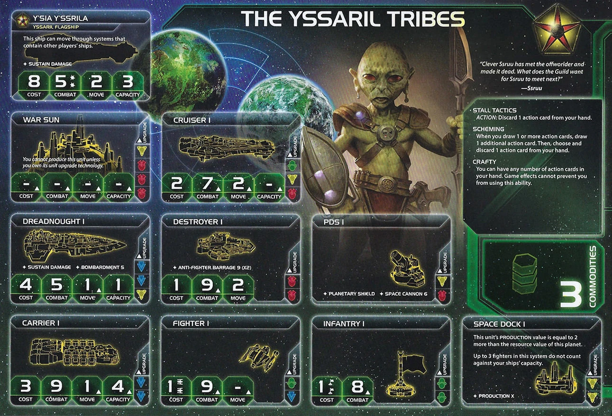

<nav class="page-nav">
<a href="../index.html" class="back-link">Back to Index</a>
<a href="Yssaril_Tribes.md" download class="download-link" title="Plain text file - safe to download">Download .md</a>
</nav>

# Yssaril Tribes Guide

## Contents

1. [Introduction](#i-introduction)
2. [Playstyle](#ii-playstyle)
3. [Faction Info and Drafting](#iii-faction-info-and-drafting)
   - [Home System & Commodities](#a-home-system--commodities) · [Starting Fleet](#b-starting-fleet) · [Faction Abilities](#c-faction-abilities) · [Technologies](#d-starting-and-faction-technologies) · [Leaders](#e-leaders) · [Promissory Note](#f-promissory-note---spy-net) · [Alliance](#g-alliance) · [Mech](#h-mech---blackshade-infiltrator) · [Flagship](#i-flagship---ysia-yssrila) · [Breakthrough](#j-breakthrough---deepgloom-executable-yg) · [Slice and Draft](#k-slice-and-draft-considerations)
4. [Round 1 Problems and Faction Weakness](#iv-round-1-problems-and-faction-weakness)
   - [First Turn Priorities](#a-first-turn-priorities) · [Commander Dependency](#b-commander-dependency) · [Military Mediocrity](#c-military-mediocrity) · [Action Card Knowledge](#d-action-card-knowledge-requirement)
5. [Technology](#v-technology)
   - [Overview](#a-overview) · [Tech Path 1: Political/Economic](#b-tech-path-1-politicaleconomic-standard) · [Tech Path 2: Blue Mobility](#c-tech-path-2-blue-mobility-alternative) · [Tech Priorities by Slice](#d-tech-priorities-by-slice--neighbors)
6. [Strategy Cards](#vi-strategy-cards)
   - [Round 1](#a-round-1) · [Round 2+](#b-round-2)
7. [Unit Composition and Game Plan](#vii-unit-composition-and-game-plan)
   - [Unit Composition](#a-unit-composition) · [Game Plan](#c-game-plan)
8. [Objectives](#viii-objectives)
   - [Objective Summary](#a-objective-summary) · [Stage I](#b-stage-i-objectives) · [Secret Objectives](#c-secret-objectives) · [Stage II](#d-stage-ii-objectives)
9. [Alliance Priority](#ix-alliance-priority)
10. [Bonus Game Elements](#x-bonus-game-elements)
    - [Action Cards](#a-high-value-action-cards) · [Relics](#b-relic-priorities) · [Agendas](#c-agenda-awareness)
11. [End Notes](#xi-end-notes)

---

## I. Introduction

The Yssaril Tribes are sneaky space goblins who win through unfair tools and information advantage. Unlimited hand size lets you hoard action cards while others discard. You see opponents' hidden information—their cards, their secrets, their plans. When you have 25 action cards while everyone else has 5, you're playing a completely different game.

This faction is about perfect information and perfect timing. Skip turns until opponents pass, then strike when they can't respond. You wait, you watch, and you move when it's too late for anyone to stop you. In the late game, you solve what others see as impossible—because you've been holding the perfect cards all along.

## II. Playstyle

Playing Yssaril Tribes means having perfect information while everyone else plays blind. Your commander lets you see opponents' action cards, promissory notes, and secret objectives whenever they activate systems with your units. Your agent copies every other agent at the table. You know what everyone is planning.

And you have the tools to act on that information when no one can react. Stall Tactics lets you skip turns until opponents pass, then strike when they can't respond. You wait, you watch, and you move when it's too late for anyone to stop you. In the late game, you make big swings and solve what others see as impossible—because you've been holding the perfect cards all along.

---

## III. Faction Info and Drafting

### A. Home System & Commodities

**Home System:**

- **Retillion:** 2 resources / 3 influence
- **Shalloq:** 1 resource / 2 influence
- **Total: 3 resources / 5 influence (0 optimal resources / 5 optimal influence)**

**Commodities:** 3

**Notes:** Influence-heavy home system (5 influence!) supports political dominance and strong token economy during the action phase. The 2 resource planet gives weak production but can be overcome.

### B. Starting Fleet

- 2 Carriers
- 1 Cruiser
- 2 Fighters
- 5 Infantry
- 1 Space Dock
- 1 PDS

**Notes:** Strong starting fleet with 2 carriers for capacity. The 5 infantry and dual carriers give you excellent R1 expansion capability—you can take 2-3 systems easily. The cruiser provides combat power and speed. Very solid defensive starting position.

### C. Faction Abilities

**Stall Tactics (Faction Ability):** ACTION: Discard 1 action card from your hand.

This is your strategic timing tool. Spend an action to discard a card—this lets you "skip" your turn to see what others do first. Also triggers your mech's DEPLOY ability for free early game reinforcement.

**Scheming (Faction Ability):** When you draw 1 or more action cards, draw 1 additional action card. Then, choose and discard 1 action card from your hand.

Your card advantage engine. Every time you draw action cards, you draw +1 additional and then discard 1. With Neural Motivator (draw 2 during status) and Politics (draw 2), you draw 3 and pick 2. You see more of the deck, get better card selection, and always have answers.

**Crafty (Faction Ability):** You can have any number of action cards in your hand. Game effects cannot prevent you from using this ability.

Removes the 7-card hand limit. This is HUGE. While everyone else discards down to 7, you can hold 10, 15, even 20 action cards. Combined with Scheming, you build a massive hand of perfect cards. Your hand becomes an arsenal of answers for every situation.

### D. Starting and Faction Technologies

**Starting Technologies:**

**Neural Motivator :** During the status phase, draw 2 action cards instead of 1.

**Notes:** One of the best starting techs in the game for Yssaril. Drawing 2 action cards during status phase instead of 1 triggers Scheming (draw +1, discard 1), so you actually see 3 cards and keep 2. Over a 5-round game, this doubles your action card acquisition. Combined with Crafty (unlimited hand size), you build massive hands faster than any other faction. Opens green tech path for faction techs.

**Faction Technologies:**

**Mageon Implants :**
*ACTION: Exhaust this card to look at another player's hand of action cards. Choose 1 of those cards and add it to your hand.*

Your key villain tech. Look at any player's hand and take their best action card. You know exactly what they have, and they know you'll take the good stuff—making them feel the agony of playing suboptimal cards just so you can't have them. Combine with Bio-Stims to use twice per round.

**Transparasteel Plating :**
*During your turn of the action phase, players that have passed cannot play action cards.*

Competes with Bio-Stims for the 1 green prereq slot. But if you're tech rich, it's wonderful to see all players pass (common occurrence) and know there is literally nothing they can do to stop you.

### E. Leaders

**Agent - Ssruu:** This card has the text ability of each other player's agent, even if that agent is exhausted.

Copies ALL other agents at the table. Notable agents to look for: Mahact (use opponent's CC for strategy secondaries), Hacan (refresh someone's commodities—commonly Hacan's 6, split 4-2), Naalu (return CC when placed in system), Ral Nel (draw 2 action cards, give 1 away).

**Commander - So Ata:** *Unlock: Have 7 action cards.*

After another player activates a system that contains your units: You may look at that player's action cards, promissory notes, or secret objectives.

Easy unlock with Neural Motivator and a few Politics follows. Once unlocked, you see opponents' hidden information whenever they activate systems with your units. Spread ships around the map to trigger this constantly. Also acts as a strong deterrent—opponents don't want you seeing their secrets.

**Hero - Kyver, Blade and Key:** *Unlock: Have 3 scored objectives.* **Guild of Spies** - ACTION: Each other player shows you 1 action card from their hand. For each player, you may either take that card or force that player to discard 3 random action cards from their hand. Then, purge this card.

Devastating hero. In a 6-player game, you either steal 5 cards OR force opponents to discard 15 cards total. If you've already used Mageon to grab their best card, just take another for a stall or extra tool. If you know there's good stuff left, target strong players with the discard option to cripple their hands.

### F. Promissory Note - **Spy Net**

At the start of your turn: Look at the Yssaril player's hand of action cards. Choose 1 of those cards and add it to your hand. Then, return this card to the Yssaril player.

Extremely annoying promissory note. Only really used for "selling action cards"—show them a specific card, agree on a price, and give them the PN to take it.

### G. Alliance

Your Alliance promissory note gives another player access to So Ata's commander ability—they can look at an opponent's action cards, promissory notes, or secret objectives when that opponent activates a system containing their units. Try to sell to a faction that needs a deterrent and trade for something useful to you.

### H. Mech - **Blackshade Infiltrator**

Cost: 2 | Combat: 6 | **Sustain Damage**

**DEPLOY:** After you use your Stall Tactics faction ability, you may place 1 mech on a planet you control.

You should never build this mech the normal way—there's always a reason to stall. Free mechs throughout the game just for using Stall Tactics.

### I. Flagship - **Y'sia Y'ssrila**

Cost: 8 | Combat: 5 (x2) | Move: 2 | Capacity: 3 | **Sustain Damage**

This ship can move through systems that contain other players' ships.

Combat and mobility are very solid. One of your key ships for clinching objectives in an otherwise low mobility fleet.

### J. Breakthrough - **Deepgloom Executable (Y↔G)**

You can allow other players to use your STALL TACTICS or SCHEMING faction abilities; when you do, you may resolve a transaction with that player. During the action phase, that transaction does not count against the once-per-player transaction limit for that turn.

**Y↔G Synergy:** Yellow and green technologies count as each other for prerequisites.

People will sometimes pay for a stall or Scheming use, but two problems: do you actually want them to stall (they might reach Leadership before you)? And why would they buy Scheming for a better action card if you can just take it with Mageon anyway?

**Y↔G synergy:** Not too helpful since you need blue for movement. Might come in handy somehow.

### K. Slice and Draft Considerations

**Speaker Order:**

- **Prefer top 4** - Grab valuable strategy cards. Peaceful neighbors help.

**Slice Priorities:**

- **Balanced or high-res slice** - Counter your high influence home system with resources for production.
- **Green skip** - Speeds up faction tech access.
- **Entropic Scar** - Two fantastic faction techs that let you focus on other stuff instead of going deep green.
- **Legendaries** - Hope's End (draw 2 action cards!) and Garbozia (take action cards back from discard) are incredible for you.

**Avoid:**

- **Top heavy slices** - Best planets far away is bad for your low mobility.
- **You're always a target** - Plan accordingly.
- **Funny stuff in the middle** - Asteroids, supernovas, nebulae blocking your path.

---

## IV. Round 1 Problems and Faction Weakness

### A. First Turn Priorities

**Round 1 Priority Rankings:**

1. **Technology** - Get Bio-Stims to start toward Mageon Implants ASAP. This is your key villain tech.

2. **Expansion + Production** - Expand to 2-3 systems. Dual carriers allow splitting forces effectively.

3. **Scoring** - Solid starting fleet so some scoring could be done with the right objective.

4. **Breakthrough** - Not a priority. Just get it if you happen to get an opportunity for Thunder's Edge or likewise.

**Expansion Notes:** Take your carriers to nearby systems. Produce off secondary Warfare if you get the chance. As long as your best planets are nearby you'll have a decent start and can handle any slice.

### B. Military Mediocrity

Your units are standard. No combat bonuses, no special abilities (except mech). You're not winning fights through stats—you're winning through action cards and diplomatic leverage.

**Mitigation:** Use action cards for combat advantage. Avoid unnecessary fights. Let opponents fight each other, then capitalize on weakened winners.

### C. Massive Target

You are hated. Everyone at the table knows you're stealing their best action cards with Mageon, seeing their secrets with your commander, and stalling until they commit before you act. Nobody likes having their plans spoiled, their premiere action cards taken, and being forced to move first while you watch. You have every tool in the game and everyone knows it.

**You critically need an ally.** Find someone who benefits from your chaos or fears your enemies more than you. Without protection, the table will coordinate to shut you down before you become unstoppable.

**Mitigation:** Make yourself useful to at least one strong player. Trade information, share action cards via Spy Net, support their agendas. Be annoying to their enemies, not to them.

### D. Action Card Knowledge Requirement

Your faction rewards high-skill play. You need to know which action cards are good, when to play them, and how to leverage them politically. Bad Yssaril players hoard cards uselessly. Good Yssaril players extract maximum value from every card.

**Mitigation:** Study the action card deck. Learn which cards win games.

---

## V. Technology

### A. Overview

You start with **Neural Motivator (Green)** (draw 2 action cards during status phase instead of 1).

There is really no argument for skipping Mageon Implants. It is incredibly impactful—stealing opponents' best action cards while knowing exactly what they have. Your tech path should always work toward GGG for Mageon. After that, you can flex into blue for mobility or yellow for economy, but Mageon comes first.

### B. Tech Path (Standard)

**Starting Tech:** Neural Motivator

**Round 1: Bio-Stims **
- At the end of your turn, you may exhaust this card to ready 1 planet you control with a technology specialty OR 1 of your other technologies
- **Why:** Enables double Mageon use per round. This is your core combo piece.
- **Prerequisites:** 1 green (Neural Motivator)

**Round 2: Mageon Implants **
- **With green skip:** Take Mageon directly. Green skip + Neural Motivator + Bio-Stims = GGG.
- **Without green skip:** Try for double tech that round. Get either:
  - **Hyper Metabolism ** + Mageon, or
  - **Transparasteel Plating ** + Mageon

**Round 3: DET or Antimass Deflectors**
- **Dark Energy Tap:** Your ships can retreat into adjacent systems with your units. You may produce 1 unit at the start of combat.
- **Antimass Deflectors:** Your ships can move into and through asteroid fields. -1 to SPACE CANNON rolls against you.

**Round 4: Gravity Drive **
- +1 move to 1 ship when you activate a system. Bonus fleet movement.

**Round 5: Carrier II (BB)**
- Cost 3, Combat 9, Move 2, Capacity 6. Bonus fleet movement.

**Key:** Green skip makes this path smooth. Without it, you need double tech opportunities to hit Mageon by R2.

---

## VI. Strategy Cards

### A. Round 1

**Round 1 Priority Ranking:**

1. **Trade** - Good way to make early allies. Strong economy solves R1 problems.

2. **Technology** - Solves your low resource home system. Get Bio-Stims.

3. **Leadership** - Helpful to follow a ton of secondaries.

4. **Politics** - Action cards and some extra coins from selling speaker.

5. **Diplomacy** - Solid for extra resources R1 and not missing tech.

6. **Construction** - An extra forward dock doesn't hurt. Best if all planets are close.

7. **Warfare** - Fill out a problematic slice. Works with your decent starting fleet.

8. **Imperial** - Never R1.

**Strategy Token Priority:** Tech, Diplomacy, Politics secondaries are your priority follows.

### B. Round 2+

**Love:**

- **Leadership** - Your stalling tactics are unmatched.
- **Technology** - Increase late game swing options and get early Mageon.

**Good:**

- **Politics** - Action cards and agenda control.
- **Imperial** - Scoring and action card draw.
- **Trade** - Economy and ally-making.

**Situational:**

- **Warfare** - When you need fleet redistribution.
- **Diplomacy** - Can be used for defense since you're prone to being attacked.
- **Construction** - Forward docks if needed.

---

## VII. Unit Composition and Game Plan

### A. Unit Composition

Your ideal fleet composition in each system:

- **Carriers** - Core fleet for capacity. You need to transport infantry for objectives and your low mobility means you can't rely on repositioning—bring enough capacity from the start.
- **Fighters** - Screening and fodder. Absorb hits while your action cards swing combat. Cheap to produce and replace.
- **Dreadnoughts** - Combat power and Sustain Damage. You have no combat bonuses, so you need the raw dice and HP that dreads provide. Essential for holding contested systems.
- **Infantry** - Ground forces for objectives. Standard ground game—nothing special but nothing holding you back either.
- **Mechs (Blackshade Infiltrator)** - Free via Deploy from Stall Tactics. You should never build these normally—just use Stall Tactics and get free mechs throughout the game. Sustain Damage ground forces at no cost.
- **Flagship (Y'sia Y'ssrila)** - Combat 5 (x2), Move 2, Capacity 3, Sustain Damage. Can move through enemy fleets. Your big hitter for clinching objectives. The move-through ability lets you bypass blockers for critical scoring plays.

**Fleet Focus:** Standard efficient fleet augmented by action cards. You don't have combat bonuses, so you win fights through Sabotage, Morale Boost, Direct Hit, and other action cards you've stolen with Mageon. Your mechs are free—use Stall Tactics liberally and accumulate them over time.

### B. Game Plan

**Early Game (Rounds 1-2):**

Make a friend—you critically need an ally to survive. Setup your tech path with Bio-Stims R1 and Mageon R2. Reinforce your slice so it's not fun to engage with. Expand to your slice and build a deterrent fleet. Don't focus on building your action card pile yet—survive first.

**Mid Game (Rounds 3-4):**

Grab the premiere action cards with Mageon. Use stalling to score efficiently while trying not to make yourself a target. Build your action card pile while staying under the radar.

**Late Game (Round 5+):**

Use your death star pile of action cards to swing the game in ways most people cannot understand. Have a clear plan and just flow until the others are done—then it's your time to strike as they sit helplessly and wait.

---

## VIII. Objectives

### A. Objective Summary

**Strengths:** Influence spendies are strong with 5 home influence. Control objectives are good—stalling lets you time your moves perfectly and score when others can't react.

**Weaknesses:** Resource spendies are weak with only 3 home resources. Fighting objectives are average—no combat bonuses, but action cards can swing fights. Structures are average—nothing special but nothing holding you back.

### B. Stage I Objectives

| Stage I Objective                                                       | Status |
|-------------------------------------------------------------------------|--------|
| **Spendies**                                                            |        |
| Erect a Monument (Spend 8 resources)                                    | 🟡     |
| Sway the Council (Spend 8 influence)                                    | 🟢     |
| Negotiate Trade Routes (Spend 5 trade goods)                            | 🟡     |
| Lead from the Front (Spend 3 tokens from tactic/strategy pools)         | 🟢     |
| Amass Wealth (Spend 3 influence, 3 resources, 3 trade goods)            | 🟢     |
| **Control**                                                             |        |
| Expand Borders (Control 6 planets in non-home systems)                  | 🟡     |
| Corner the Market (Control 4 planets with same trait)                   | 🔴     |
| Found Research Outposts (Control 3 planets with tech specialties)       | 🔴     |
| Discover Lost Outposts (Control 2 planets with attachments)             | 🔴     |
| Push Boundaries (Control more planets than each neighbor)               | 🟢     |
| **Ships in Systems**                                                    |        |
| Intimidate the Council (Ships in 2 systems adjacent to MR)              | 🟢     |
| Explore Deep Space (Units in 3 systems without planets)                 | 🟢     |
| Make History (Units in 2 systems with legendary/MR/anomalies)           | 🟢     |
| Populate the Outer Rim (Units in 3 edge systems)                        | 🟢     |
| Raise a Fleet (5+ non-fighter ships in 1 system)                        | 🟢     |
| Engineer a Marvel (Have flagship or war sun on board)                   | 🟢     |
| **Tech**                                                                |        |
| Diversify Research (Own 2 tech in each of 2 colors)                     | 🟡     |
| Develop Weaponry (Own 2 unit upgrade technologies)                      | 🟡     |
| **Structure**                                                           |        |
| Build Defenses (Have 4 or more structures)                              | 🟡     |
| Improve Infrastructure (Structures on 3 planets outside HS)             | 🔴     |

**Legend:** 🟢 Likely | 🟡 Possible | 🔴 Difficult

### C. Secret Objectives

| Secret Objective                                                         | Status |
|--------------------------------------------------------------------------|--------|
| **Combat**                                                               |        |
| Unveil Flagship (Win space combat with flagship)                         | 🟢     |
| Destroy their Greatest Ship (Destroy war sun/flagship)                   | 🟡     |
| Spark a Rebellion (Win combat vs VP leader)                              | 🟢     |
| Betray a Friend (Win combat vs player whose PN you have)                | 🟢     |
| Brave the Void (Win combat in anomaly)                                  | 🟢     |
| Darken the Skies (Win combat in another player's HS)                    | 🔴     |
| Demonstrate your Power (3+ non-fighter ships after space combat)        | 🟢     |
| Turn their Fleets to Dust (SPACE CANNON destroy last ship)              | 🔴     |
| Make an Example (BOMBARDMENT destroy last ground forces)                | 🟡     |
| Fight With Precision (AFB destroy last fighter)                         | 🟡     |
| **Ships in Systems**                                                     |        |
| Threaten Enemies (Ships adjacent to another player's HS)                | 🟢     |
| Cut Supply Lines (Ships in system with enemy space dock)                | 🟢     |
| Defy Space and Time (Units in wormhole nexus)                           | 🟡     |
| Become the Gatekeeper (Ships in alpha and beta wormhole systems)        | 🟡     |
| Learn Secrets of the Cosmos (Ships in 3 systems adjacent to anomalies)  | 🟢     |
| Control the Region (Ships in 6 systems)                                 | 🟢     |
| Occupy the Seat of the Empire (Control MR with 3+ ships)                | 🟢     |
| **Control**                                                              |        |
| Monopolize Production (Control 4 industrial planets)                     | 🔴     |
| Mine Rare Minerals (Control 4 hazardous planets)                        | 🔴     |
| Forge an Alliance (Control 4 cultural planets)                          | 🔴     |
| Establish Hegemony (Control planets with 12+ influence)                 | 🟢     |
| Hoard Raw Materials (Control planets with 12+ resources)                | 🟡     |
| Seize an Icon (Control legendary planet)                                | 🟢     |
| Stake Your Claim (Control planet in contested system)                   | 🟡     |
| Become a Martyr (Lose control of planet in home system)                 | 🟡     |
| **Tech**                                                                 |        |
| Adapt New Strategies (Own 2 faction technologies)                       | 🟢     |
| Master the Laws of Physics (Own 4 tech of same color)                   | 🟢     |
| **Structure/Units**                                                      |        |
| Establish a Perimeter (Have 4 PDS on board)                             | 🔴     |
| Fuel the War Machine (Have 3 space docks)                               | 🟡     |
| Gather a Mighty Fleet (Have 5 dreadnoughts)                             | 🟢     |
| Mechanize the Military (1 mech on each of 4 planets)                    | 🟢     |
| Occupy the Fringe (9+ ground forces on planet without space dock)       | 🟡     |
| Produce en Masse (Units with PRODUCTION 8+ in single system)            | 🔴     |
| **Other**                                                                |        |
| Dictate Policy (3+ laws in play)                                        | 🟡     |
| Drive the Debate (You/your planet elected by agenda)                    | 🟢     |
| Destroy Heretical Works (Purge 2 relic fragments)                       | 🔴     |
| Form a Spy Network (Discard 5 action cards)                             | 🟢     |
| Foster Cohesion (Be neighbors with all players)                         | 🟢     |
| Strengthen Bonds (Have another player's PN)                             | 🟢     |
| Prove Endurance (Last to pass)                                          | 🟢     |

### D. Stage II Objectives

| Stage II Objective                                                       | Status |
|--------------------------------------------------------------------------|--------|
| **Spendies**                                                             |        |
| Centralize Galactic Trade (Spend 10 trade goods)                         | 🟡     |
| Found a Golden Age (Spend 16 resources)                                  | 🟡     |
| Galvanize the People (Spend 6 tokens from tactic/strategy pools)         | 🟡     |
| Manipulate Galactic Law (Spend 16 influence)                             | 🟢     |
| Hold Vast Reserves (Spend 6 influence, 6 resources, 6 trade goods)       | 🟡     |
| **Control**                                                              |        |
| Conquer the Weak (Control 1 planet in another player's HS)               | 🔴     |
| Rule Distant Lands (Control 2 planets in/adjacent to different players' HS) | 🟡     |
| Subdue the Galaxy (Control 11 planets in non-home systems)               | 🔴     |
| Unify the Colonies (Control 6 planets with same trait)                   | 🔴     |
| Reclaim Ancient Monuments (Control 3 planets with attachments)           | 🔴     |
| Form Galactic Brain Trust (Control 5 planets with tech specialties)      | 🔴     |
| **Ships in Systems**                                                     |        |
| Command an Armada (Have 8+ non-fighter ships in 1 system)                | 🟢     |
| Achieve Supremacy (Flagship/War Sun in another player's HS or MR)        | 🟡     |
| Become a Legend (Units in 4 systems with legendary/MR/anomalies)         | 🟡     |
| Patrol Vast Territories (Units in 5 systems without planets)             | 🟡     |
| Control the Borderlands (Units in 5 edge systems not HS)                 | 🟡     |
| **Tech**                                                                 |        |
| Master of Sciences (Own 2 techs in each of 4 colors)                     | 🔴     |
| Revolutionize Warfare (Own 3 unit upgrade technologies)                  | 🔴     |
| **Structure**                                                            |        |
| Construct Massive Cities (Have 7+ structures)                            | 🔴     |
| Protect the Border (Structures on 5 planets outside HS)                  | 🔴     |

**Legend:** 🟢 Likely | 🟡 Possible | 🔴 Difficult

---

## IX. Alliance Priority

Trading for other factions' Alliance promissory notes grants you access to their commanders, potentially boosting your strategy significantly.

**Top Tier:**

1. **Nomad (Navarch Feng)** – Produce flagship without spending resources. Saves 8 resources on Y'sia Y'ssrila for early mobility advantage.

2. **Crimson Rebellion (Ahk Siever)** – At end of combat, gain commodity/TG. Passive income from table aggression addresses your 3-resource home system weakness.

3. **Deepwrought Scholarate (Aello)** – When others research tech, gain commodity/TG if they take -1 discount. Passive income without combat.

4. **Muaat (Magmus)** – Gain 1 TG after spending strategy token. Synergizes with active strategy card usage.

5. **Nekro Virus (Nekro Acidos)** – Draw 1 action card after gaining technology. Synergizes perfectly with your action card focus.

**Good:**

6. **Winnu (Rickar Rickani)** – Apply +2 combat in MR, home system, and legendary planet systems. Defensive boost in key locations.

7. **Last Bastion (Nip and Tuck)** – Action cards cannot be canceled by Sabotage. Your action cards become uncounterable.

8. **Empyrean (Xuange)** – Return command token when opponents move into systems with your tokens. Excellent late game slaying—you spread units everywhere for Commander triggers anyway.

9. **Council Keleres (Suffi An)** – Perform additional action after action card component action. Large hand means more flexibility to find component actions.

10. **Yin Brotherhood (Brother Omar)** – Green prereq + skip prereqs when researching others' tech. Helps tech path flexibility if acquired early.

---

## X. Bonus Game Elements

This section highlights action cards that synergize particularly well with your faction's strengths or mitigate your weaknesses, relics that offer exceptional value for your faction's strategy and abilities, and agendas to pursue that benefit your position, and agendas to watch out for that could hurt you.

### A. High-Value Action Cards

### B. Relic Priorities

### C. Agenda Awareness

---

## XI. End Notes

Yssaril Tribes is the faction for players who want to feel like the smartest person at the table. You don't win through raw power—you win because you always have the answer. Sabotage when they commit. Direct Hit when they sustain. Stall Tactics when they want you to act.

The experience of playing Yssaril is uniquely satisfying. You're holding 15 cards while everyone else has 3. You know their secrets, their promissory notes, their plans. When Mageon steals their Sabotage and you use it against them next round, they realize the game was never fair.

Your biggest strength is inevitability. Every round, your hand grows. Every activation against you, you see their cards. Every tech they research while you have Mageon, you might just take it first. The longer the game goes, the more unfair your advantage becomes.

When you nail Yssaril, you feel like a puppet master pulling strings. The table knows you have answers but can't know which ones. They hesitate. They second-guess. They waste resources preparing for counters you may or may not have. That uncertainty is your real weapon.

Yssaril doesn't win through fair fights—they win because fair was never part of the plan.

**THE TRIBES SEE ALL.**
